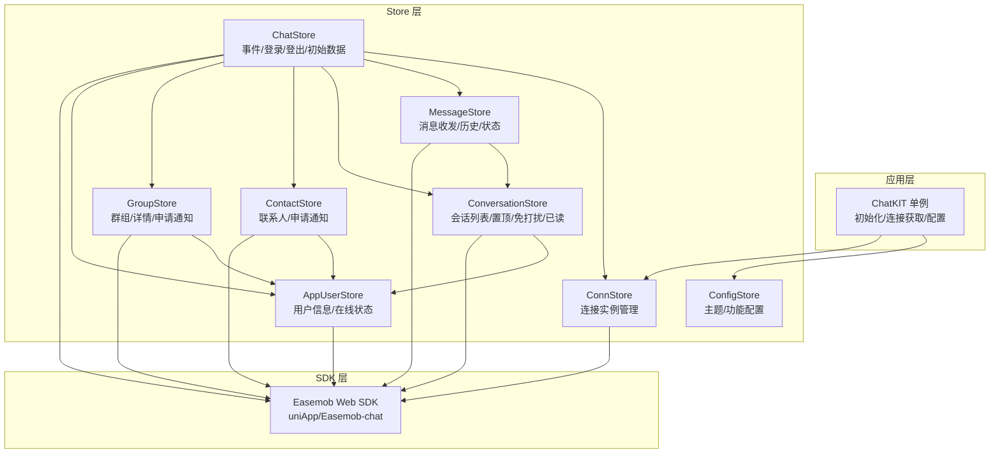
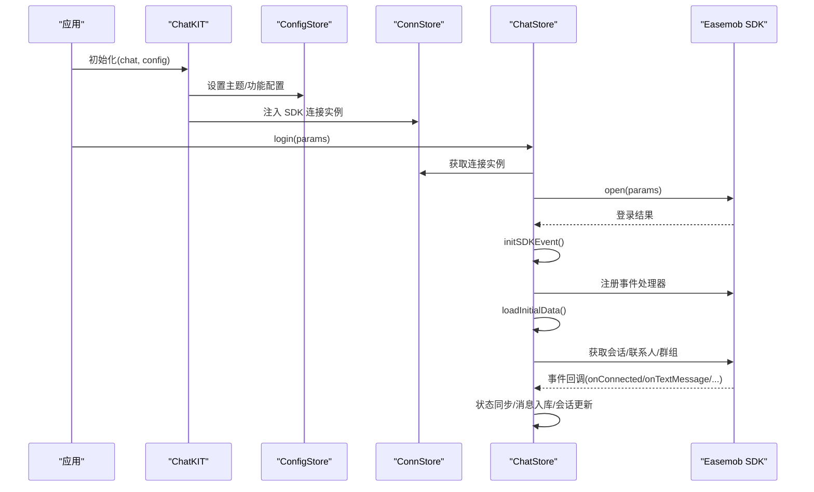
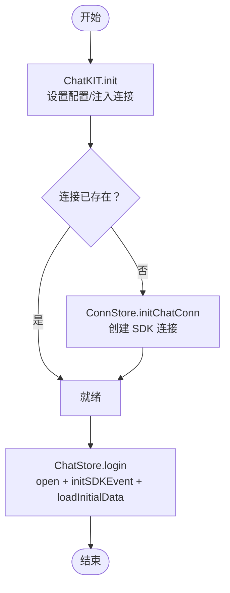
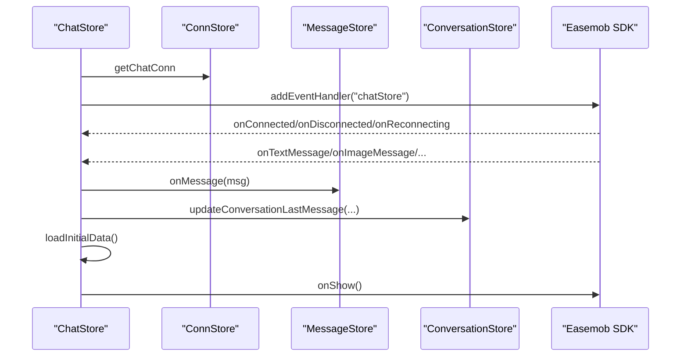
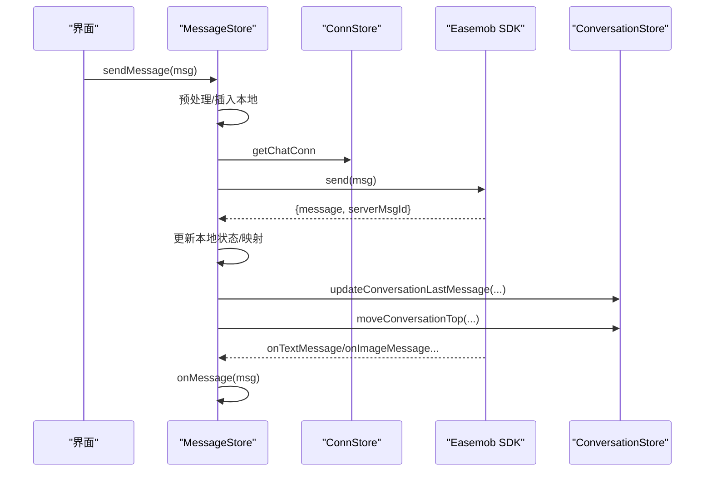
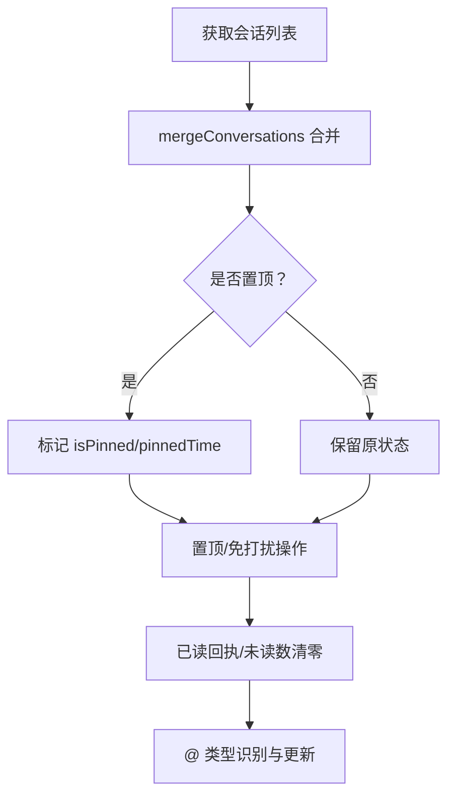
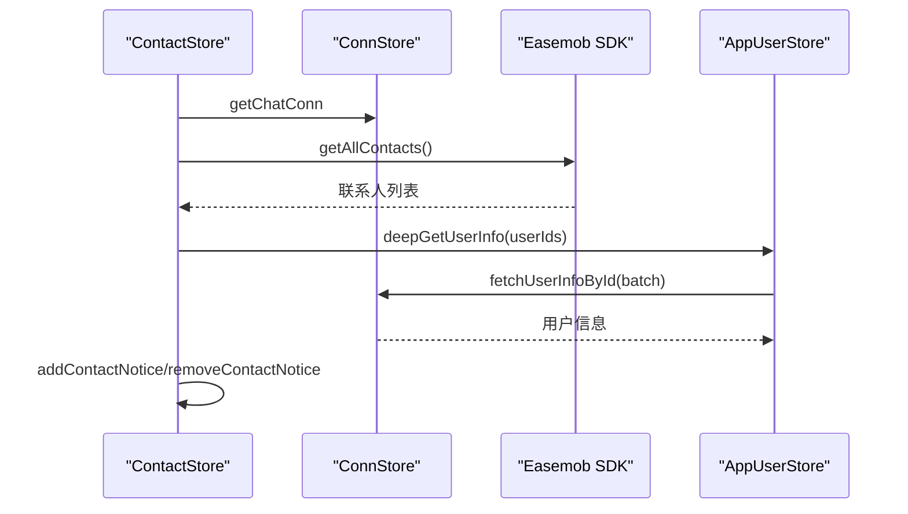
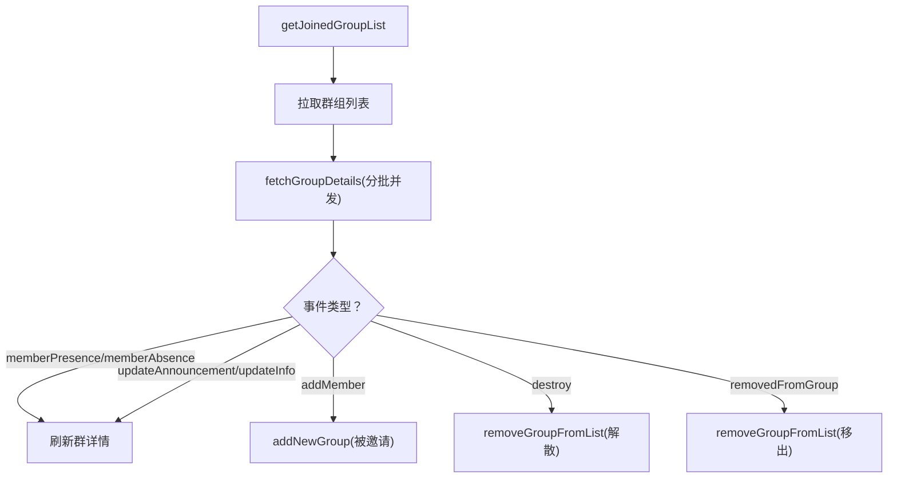
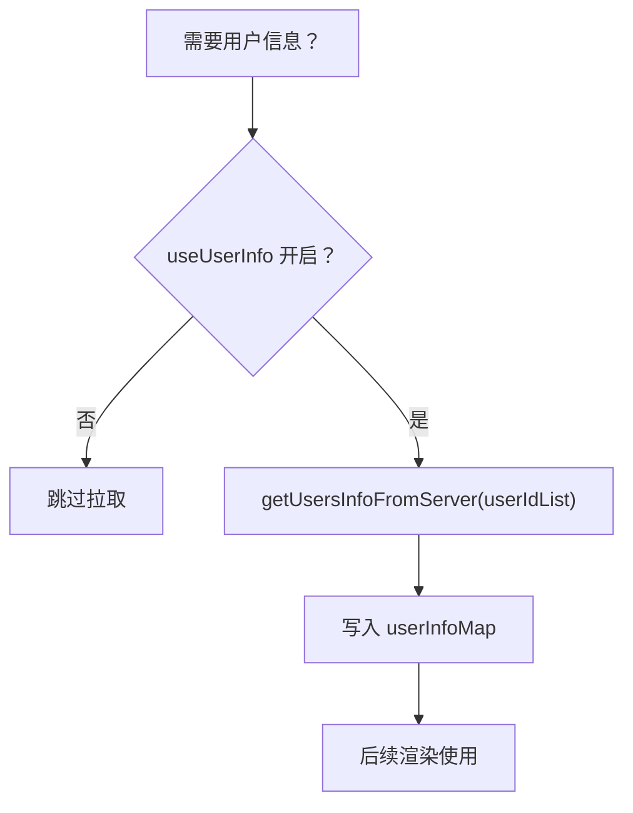
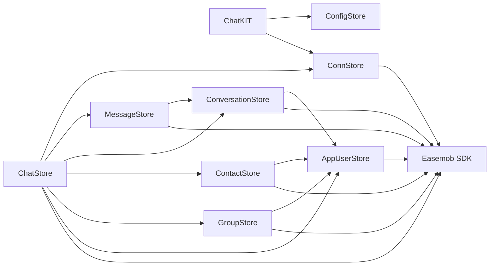

# SDK封装层

<cite>
**本文档引用的文件**
- [ChatUIKit/sdk.ts](file://ChatUIKit/sdk.ts)
- [ChatUIKit/index.ts](file://ChatUIKit/index.ts)
- [ChatUIKit/configType.ts](file://ChatUIKit/configType.ts)
- [ChatUIKit/types/index.ts](file://ChatUIKit/types/index.ts)
- [ChatUIKit/stores/index.ts](file://ChatUIKit/stores/index.ts)
- [ChatUIKit/stores/conn.ts](file://ChatUIKit/stores/conn.ts)
- [ChatUIKit/stores/chat.ts](file://ChatUIKit/stores/chat.ts)
- [ChatUIKit/stores/message.ts](file://ChatUIKit/stores/message.ts)
- [ChatUIKit/stores/conversation.ts](file://ChatUIKit/stores/conversation.ts)
- [ChatUIKit/stores/contact.ts](file://ChatUIKit/stores/contact.ts)
- [ChatUIKit/stores/group.ts](file://ChatUIKit/stores/group.ts)
- [ChatUIKit/stores/appUser.ts](file://ChatUIKit/stores/appUser.ts)
- [ChatUIKit/stores/config.ts](file://ChatUIKit/stores/config.ts)
- [ChatUIKit/const/index.ts](file://ChatUIKit/const/index.ts)
- [ChatUIKit/utils/index.ts](file://ChatUIKit/utils/index.ts)
</cite>

## 目录
1. [简介](#简介)
2. [项目结构](#项目结构)
3. [核心组件](#核心组件)
4. [架构总览](#架构总览)
5. [详细组件分析](#详细组件分析)
6. [依赖关系分析](#依赖关系分析)
7. [性能考量](#性能考量)
8. [故障排除指南](#故障排除指南)
9. [结论](#结论)
10. [附录](#附录)

## 简介
本文件系统性梳理了 Easemob Web SDK 在 ChatUIKit 中的封装策略与抽象层次，覆盖 SDK 初始化、连接管理、事件处理、消息收发、会话管理、联系人同步、群组管理、用户状态与配置等模块。文档重点解释 Store 系统如何与 SDK 集成，完成数据转换、状态同步与错误处理，并提供配置项、性能调优与故障排除建议。

## 项目结构
ChatUIKit 采用“单例 + Pinia Store”架构，通过 ChatKIT 单例集中暴露初始化、连接获取与全局配置；各业务 Store 负责具体领域数据与行为，彼此通过 Store 间协作与 SDK 事件回调实现状态同步。

图表来源
- [ChatUIKit/index.ts](file://ChatUIKit/index.ts#L18-L132)
- [ChatUIKit/stores/index.ts](file://ChatUIKit/stores/index.ts#L1-L31)
- [ChatUIKit/stores/conn.ts](file://ChatUIKit/stores/conn.ts#L20-L83)
- [ChatUIKit/stores/chat.ts](file://ChatUIKit/stores/chat.ts#L29-L398)
- [ChatUIKit/stores/message.ts](file://ChatUIKit/stores/message.ts#L48-L581)
- [ChatUIKit/stores/conversation.ts](file://ChatUIKit/stores/conversation.ts#L40-L421)
- [ChatUIKit/stores/contact.ts](file://ChatUIKit/stores/contact.ts#L25-L282)
- [ChatUIKit/stores/group.ts](file://ChatUIKit/stores/group.ts#L27-L317)
- [ChatUIKit/stores/appUser.ts](file://ChatUIKit/stores/appUser.ts#L24-L242)
- [ChatUIKit/stores/config.ts](file://ChatUIKit/stores/config.ts#L59-L124)
- [ChatUIKit/sdk.ts](file://ChatUIKit/sdk.ts#L1-L13)

章节来源
- [ChatUIKit/index.ts](file://ChatUIKit/index.ts#L18-L132)
- [ChatUIKit/stores/index.ts](file://ChatUIKit/stores/index.ts#L1-L31)

## 核心组件
- ChatKIT 单例：负责初始化、连接获取、主题与功能配置、生命周期 onShow 检测。
- ConnStore：统一持有 SDK 连接实例，提供初始化、关闭与状态清理。
- ChatStore：SDK 事件总线，协调消息、联系人、群组、会话等状态变更。
- MessageStore：消息收发、历史拉取、状态管理、撤回/删除、音频播放控制。
- ConversationStore：会话列表、置顶、免打扰、删除、已读回执、@类型识别。
- ContactStore：联系人列表、好友申请通知、批量获取用户信息。
- GroupStore：群组列表、详情、创建/解散/退出、申请加入、通知。
- AppUserStore：用户信息、在线状态、订阅/发布 Presence。
- ConfigStore：主题与功能开关配置，支持动态隐藏/显示功能。
- 类型与常量：统一 SDK 类型别名、消息状态、@标识、最大消息数等。

章节来源
- [ChatUIKit/index.ts](file://ChatUIKit/index.ts#L18-L132)
- [ChatUIKit/stores/conn.ts](file://ChatUIKit/stores/conn.ts#L20-L83)
- [ChatUIKit/stores/chat.ts](file://ChatUIKit/stores/chat.ts#L29-L398)
- [ChatUIKit/stores/message.ts](file://ChatUIKit/stores/message.ts#L48-L581)
- [ChatUIKit/stores/conversation.ts](file://ChatUIKit/stores/conversation.ts#L40-L421)
- [ChatUIKit/stores/contact.ts](file://ChatUIKit/stores/contact.ts#L25-L282)
- [ChatUIKit/stores/group.ts](file://ChatUIKit/stores/group.ts#L27-L317)
- [ChatUIKit/stores/appUser.ts](file://ChatUIKit/stores/appUser.ts#L24-L242)
- [ChatUIKit/stores/config.ts](file://ChatUIKit/stores/config.ts#L59-L124)
- [ChatUIKit/types/index.ts](file://ChatUIKit/types/index.ts#L1-L100)
- [ChatUIKit/const/index.ts](file://ChatUIKit/const/index.ts#L1-L37)

## 架构总览
SDK 封装遵循“Store 协调 + SDK 事件驱动”的模式：
- ChatKIT 负责应用级初始化与配置注入。
- ConnStore 作为 SDK 连接唯一入口，避免多处直接依赖 SDK。
- ChatStore 注册 SDK 事件处理器，将事件转化为 Store 状态变更。
- 各业务 Store 仅关注自身领域模型，通过 Store 间协作完成跨域联动。
- SDK 请求失败由对应 Store 捕获并记录日志，必要时抛出错误供上层处理。

图表来源
- [ChatUIKit/index.ts](file://ChatUIKit/index.ts#L84-L132)
- [ChatUIKit/stores/chat.ts](file://ChatUIKit/stores/chat.ts#L299-L398)
- [ChatUIKit/stores/conn.ts](file://ChatUIKit/stores/conn.ts#L46-L63)

章节来源
- [ChatUIKit/index.ts](file://ChatUIKit/index.ts#L84-L132)
- [ChatUIKit/stores/chat.ts](file://ChatUIKit/stores/chat.ts#L299-L398)

## 详细组件分析

### SDK 初始化与连接管理
- ChatKIT.init 接收 SDK 连接实例与配置，设置主题与功能配置，并标记初始化完成。
- ConnStore 提供 setChatConn 注入连接，initChatConn 在未初始化时创建连接实例，closeConnection 关闭并清空状态。
- ChatStore.login 调用 ConnStore.getChatConn.open 完成登录；logout 调用 close 并清理所有 Store 状态。

图表来源
- [ChatUIKit/index.ts](file://ChatUIKit/index.ts#L84-L132)
- [ChatUIKit/stores/conn.ts](file://ChatUIKit/stores/conn.ts#L46-L63)
- [ChatUIKit/stores/chat.ts](file://ChatUIKit/stores/chat.ts#L299-L328)

章节来源
- [ChatUIKit/index.ts](file://ChatUIKit/index.ts#L84-L132)
- [ChatUIKit/stores/conn.ts](file://ChatUIKit/stores/conn.ts#L20-L83)
- [ChatUIKit/stores/chat.ts](file://ChatUIKit/stores/chat.ts#L299-L328)

### 事件处理机制
- ChatStore 通过 addEventHandler 注册 SDK 事件，统一处理连接状态、消息、联系人、群组、会话等事件。
- 事件处理完成后，调用对应 Store 的方法更新状态，如消息入库、会话置顶、联系人通知、群组详情刷新等。
- onShow 生命周期中，若已登录则调用 conn.onShow 以检测连接有效性。

图表来源
- [ChatUIKit/stores/chat.ts](file://ChatUIKit/stores/chat.ts#L67-L221)
- [ChatUIKit/stores/message.ts](file://ChatUIKit/stores/message.ts#L341-L388)
- [ChatUIKit/stores/conversation.ts](file://ChatUIKit/stores/conversation.ts#L344-L354)

章节来源
- [ChatUIKit/stores/chat.ts](file://ChatUIKit/stores/chat.ts#L67-L221)

### 消息发送与接收
- 发送流程：MessageStore.sendMessage 预处理本地消息（填充 from/status）、可选上传附件、调用 conn.send，成功后更新本地状态与服务器消息映射，并更新会话最后一条消息与置顶。
- 接收流程：ChatStore.handleReceivedMessage 将消息写入 MessageStore，异步获取发送者用户信息；MessageStore.onMessage 写入会话消息列表，更新会话未读数与置顶。
- 历史消息：getHistoryMessages 分页拉取，去重合并，维护游标与 isLast 标记。
- 撤回/删除：recallMessage/removerHistoryMessages 同步服务端与本地状态；onRecallMessage 将消息替换为“已撤回”提示。

图表来源
- [ChatUIKit/stores/message.ts](file://ChatUIKit/stores/message.ts#L223-L336)
- [ChatUIKit/stores/message.ts](file://ChatUIKit/stores/message.ts#L341-L388)
- [ChatUIKit/stores/conversation.ts](file://ChatUIKit/stores/conversation.ts#L344-L369)

章节来源
- [ChatUIKit/stores/message.ts](file://ChatUIKit/stores/message.ts#L130-L336)
- [ChatUIKit/stores/message.ts](file://ChatUIKit/stores/message.ts#L341-L457)
- [ChatUIKit/stores/conversation.ts](file://ChatUIKit/stores/conversation.ts#L344-L369)

### 会话管理
- 会话列表：getConversationList/getServerPinnedConversations 拉取服务器会话，mergeConversations 合并并保留本地置顶状态。
- 置顶/免打扰：pinConversation/setSilentModeForConversation 与服务器同步，本地更新 isPinned/pinnedTime/muteConvsMap。
- 已读回执：markConversationRead 创建 channel 类型消息发送已读回执，并清零未读数。
- @ 类型：setAtTypeByMessage 基于消息内容识别 @ALL/@ME/NONE 并更新会话。

图表来源
- [ChatUIKit/stores/conversation.ts](file://ChatUIKit/stores/conversation.ts#L126-L189)
- [ChatUIKit/stores/conversation.ts](file://ChatUIKit/stores/conversation.ts#L218-L276)
- [ChatUIKit/stores/conversation.ts](file://ChatUIKit/stores/conversation.ts#L314-L339)
- [ChatUIKit/stores/conversation.ts](file://ChatUIKit/stores/conversation.ts#L392-L407)

章节来源
- [ChatUIKit/stores/conversation.ts](file://ChatUIKit/stores/conversation.ts#L126-L276)
- [ChatUIKit/stores/conversation.ts](file://ChatUIKit/stores/conversation.ts#L314-L407)

### 联系人同步
- getContacts 拉取联系人列表，异步分页获取用户信息；addContact/deleteContact 与服务器交互并同步本地。
- 好友申请通知：addContactNotice/removeContactNotice 管理 invited/agreed/refused/deleted 状态，计算未读数。
- deepGetUserInfo 递归分页获取用户信息，避免一次性请求过大。

图表来源
- [ChatUIKit/stores/contact.ts](file://ChatUIKit/stores/contact.ts#L112-L130)
- [ChatUIKit/stores/contact.ts](file://ChatUIKit/stores/contact.ts#L219-L256)
- [ChatUIKit/stores/appUser.ts](file://ChatUIKit/stores/appUser.ts#L86-L125)

章节来源
- [ChatUIKit/stores/contact.ts](file://ChatUIKit/stores/contact.ts#L83-L130)
- [ChatUIKit/stores/contact.ts](file://ChatUIKit/stores/contact.ts#L178-L214)
- [ChatUIKit/stores/contact.ts](file://ChatUIKit/stores/contact.ts#L219-L256)
- [ChatUIKit/stores/appUser.ts](file://ChatUIKit/stores/appUser.ts#L86-L125)

### 群组管理
- getJoinedGroupList 拉取加入的群组，异步批量获取群组详情；createGroup/destroyGroup/leaveGroup 与服务器交互。
- 群组事件：handleGroupEvent 根据事件类型刷新群详情或移除群组；addNewGroup 兼容字段名差异。
- fetchGroupDetails 分批并发获取详情，避免超时与失败影响整体。

图表来源
- [ChatUIKit/stores/group.ts](file://ChatUIKit/stores/group.ts#L102-L131)
- [ChatUIKit/stores/group.ts](file://ChatUIKit/stores/group.ts#L136-L167)
- [ChatUIKit/stores/chat.ts](file://ChatUIKit/stores/chat.ts#L247-L294)

章节来源
- [ChatUIKit/stores/group.ts](file://ChatUIKit/stores/group.ts#L102-L167)
- [ChatUIKit/stores/chat.ts](file://ChatUIKit/stores/chat.ts#L247-L294)

### 用户信息与在线状态
- AppUserStore.getUserInfo/getSelfUserInfo 提供带默认值的用户信息视图；getUsersInfoFromServer 按需拉取并缓存。
- getUsersPresenceFromServer/subscribePresence/unsubscribePresence/publishPresence 管理 Presence 订阅与发布。
- 与 ConfigStore 的 useUserInfo/usePresence 开关配合，决定是否拉取用户信息与 Presence。

图表来源
- [ChatUIKit/stores/appUser.ts](file://ChatUIKit/stores/appUser.ts#L86-L125)
- [ChatUIKit/stores/config.ts](file://ChatUIKit/stores/config.ts#L92-L95)

章节来源
- [ChatUIKit/stores/appUser.ts](file://ChatUIKit/stores/appUser.ts#L35-L79)
- [ChatUIKit/stores/appUser.ts](file://ChatUIKit/stores/appUser.ts#L86-L159)
- [ChatUIKit/stores/config.ts](file://ChatUIKit/stores/config.ts#L92-L95)

### SDK 与 Store 的集成要点
- 类型对齐：通过 types/index.ts 统一导出 SDK 类型别名，避免直接依赖 SDK 类型污染 UI 层。
- 数据转换：MessageStore 在发送前对音频/文件/视频/图片消息进行字段对齐；撤回时创建“已撤回”提示消息。
- 状态同步：ChatStore 作为事件中枢，将 SDK 回调转换为 Store 动作；各 Store 仅维护自身状态，通过 getter/actions 协作。
- 错误处理：各 Store 在 try/catch 中捕获 SDK 调用异常，记录日志并抛出，便于上层统一处理。

章节来源
- [ChatUIKit/types/index.ts](file://ChatUIKit/types/index.ts#L1-L100)
- [ChatUIKit/stores/message.ts](file://ChatUIKit/stores/message.ts#L223-L336)
- [ChatUIKit/stores/message.ts](file://ChatUIKit/stores/message.ts#L418-L457)
- [ChatUIKit/stores/chat.ts](file://ChatUIKit/stores/chat.ts#L324-L345)

## 依赖关系分析
- ChatKIT 依赖 ConfigStore/ConnStore，对外提供 getChatConn/getThemeConfig/getFeatureConfig 等能力。
- ChatStore 依赖 ConnStore/ConfigStore/AppUserStore/ContactStore/ConversationStore/GroupStore/MessageStore，协调 SDK 事件与业务状态。
- MessageStore/ConversationStore/ContactStore/GroupStore/AppUserStore 之间通过 Store getter/action 互相访问，避免循环依赖。
- SDK 依赖：ConnStore/ChatStore/MessageStore/ConversationStore/ContactStore/GroupStore/AppUserStore 均通过 ConnStore.getChatConn 访问 SDK。

图表来源
- [ChatUIKit/index.ts](file://ChatUIKit/index.ts#L38-L78)
- [ChatUIKit/stores/chat.ts](file://ChatUIKit/stores/chat.ts#L12-L20)
- [ChatUIKit/stores/conn.ts](file://ChatUIKit/stores/conn.ts#L10-L13)

章节来源
- [ChatUIKit/index.ts](file://ChatUIKit/index.ts#L38-L78)
- [ChatUIKit/stores/chat.ts](file://ChatUIKit/stores/chat.ts#L12-L20)

## 性能考量
- 分页与去重：MessageStore.getHistoryMessages 使用游标与 isLast 控制分页，避免重复消息；首次拉取时合并现有消息 ID。
- 消息上限：MAX_MESSAGES_PER_CONVERSATION 控制每个会话消息数量，超过阈值自动清理最早消息，降低内存占用。
- 并发获取：ContactStore.deepGetUserInfo 与 GroupStore.fetchGroupDetails 采用分页与 Promise.all 并发，提升拉取效率。
- 防抖节流：utils/index.ts 提供 throttle 等工具，可在 UI 事件中使用减少频繁触发。
- 响应式优化：Store 使用对象存储主键，getter 缓存派生状态（如 totalUnreadCount/sortedConversationList），减少重复计算。

章节来源
- [ChatUIKit/stores/message.ts](file://ChatUIKit/stores/message.ts#L130-L197)
- [ChatUIKit/stores/message.ts](file://ChatUIKit/stores/message.ts#L530-L554)
- [ChatUIKit/stores/contact.ts](file://ChatUIKit/stores/contact.ts#L83-L107)
- [ChatUIKit/stores/group.ts](file://ChatUIKit/stores/group.ts#L136-L167)
- [ChatUIKit/utils/index.ts](file://ChatUIKit/utils/index.ts#L107-L134)
- [ChatUIKit/const/index.ts](file://ChatUIKit/const/index.ts#L14-L15)

## 故障排除指南
- 连接未初始化：ConnStore.getChatConn 会在未初始化时抛错，检查 ChatKIT.init 是否正确传入 SDK 连接实例。
- 登录失败：ChatStore.login 捕获异常并记录日志，检查网络、账号密码/Token 与服务器连通性。
- 事件未生效：确认 ChatStore.initSDKEvent 是否执行，且 addEventHandler 的事件名与 SDK 一致。
- 消息未入库：MessageStore.onMessage 依赖消息 ID 去重，检查消息 id/serverMsgId 生成与 SDK 返回一致性。
- 会话未更新：ConversationStore.updateConversationLastMessage/mergeConversations 依赖正确的 conversationId 与 chatType，检查 getCvsIdFromMessage 逻辑。
- 联系人/群组为空：ContactStore/GroupStore.getContacts/getJoinedGroupList 需要网络可用，检查 SDK 返回数据结构与字段兼容性。
- 用户信息缺失：AppUserStore.getUsersInfoFromServer 受 ConfigStore.useUserInfo 控制，确认功能开关与用户 ID 列表。
- 日志定位：各 Store 动作均包含 logger.info/logger.error，按日志级别排查问题。

章节来源
- [ChatUIKit/stores/conn.ts](file://ChatUIKit/stores/conn.ts#L29-L34)
- [ChatUIKit/stores/chat.ts](file://ChatUIKit/stores/chat.ts#L324-L327)
- [ChatUIKit/stores/chat.ts](file://ChatUIKit/stores/chat.ts#L67-L221)
- [ChatUIKit/stores/message.ts](file://ChatUIKit/stores/message.ts#L341-L388)
- [ChatUIKit/stores/conversation.ts](file://ChatUIKit/stores/conversation.ts#L344-L354)
- [ChatUIKit/stores/contact.ts](file://ChatUIKit/stores/contact.ts#L112-L130)
- [ChatUIKit/stores/group.ts](file://ChatUIKit/stores/group.ts#L102-L131)
- [ChatUIKit/stores/appUser.ts](file://ChatUIKit/stores/appUser.ts#L92-L95)

## 结论
本封装层通过 ChatKIT 单例与 Pinia Store 体系，将 Easemob Web SDK 的复杂性屏蔽在 Store 内部，提供清晰的抽象边界与稳定的事件驱动机制。消息、会话、联系人、群组与用户状态均以 Store 为中心进行数据转换与状态同步，具备良好的可维护性与扩展性。建议在生产环境中结合日志与错误上报完善可观测性，并根据业务场景调整分页与缓存策略以优化性能。

## 附录

### SDK 配置选项
- 主题配置（ThemeConfig）
  - avatarShape：头像形状(circle/square)
- 功能配置（FeatureConfig）
  - useUserInfo/usePresence：是否使用用户属性/Presence
  - muteConversation/pinConversation/deleteConversation：会话免打扰/置顶/删除
  - messageStatus/copyMessage/deleteMessage/recallMessage/editMessage/replyMessage：消息相关功能
  - inputEmoji/inputImage/inputAudio/inputVideo/inputFile/inputMention：输入区域功能
  - userCard：名片消息
- 默认配置：ConfigStore 提供默认主题与功能开关，可通过 setFeatureConfig/hideFeature/showFeature 动态调整。

章节来源
- [ChatUIKit/configType.ts](file://ChatUIKit/configType.ts#L3-L67)
- [ChatUIKit/stores/config.ts](file://ChatUIKit/stores/config.ts#L19-L57)
- [ChatUIKit/stores/config.ts](file://ChatUIKit/stores/config.ts#L92-L113)

### 常量与工具
- 常量：ASSETS_URL、USER_AVATAR_URL、GROUP_AVATAR_URL、MAX_MESSAGES_PER_CONVERSATION、PRESENCE_STATUS_LIST、AT_ALL、GroupEventFromIds
- 工具：getTimeStringAutoShort、formatTextMessage、renderTxt、sortByPinned、throttle、deepClone、splitArrayIntoChunks、formatMessage、checkCharacter、groupByName

章节来源
- [ChatUIKit/const/index.ts](file://ChatUIKit/const/index.ts#L1-L37)
- [ChatUIKit/utils/index.ts](file://ChatUIKit/utils/index.ts#L31-L344)