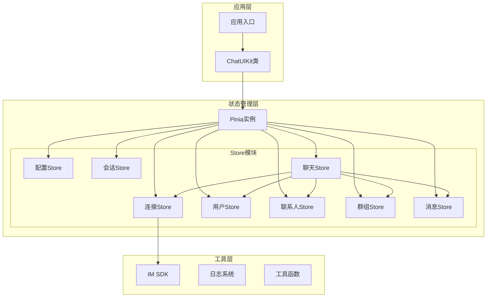
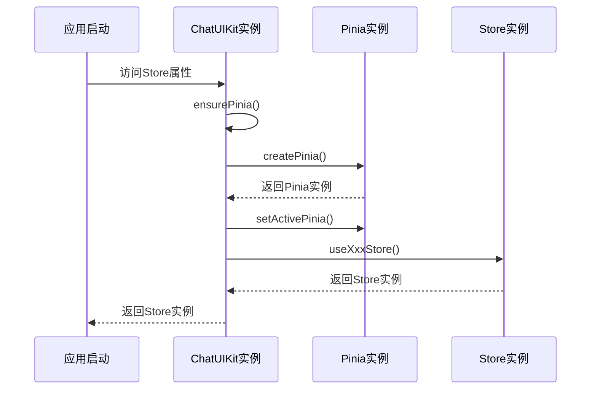
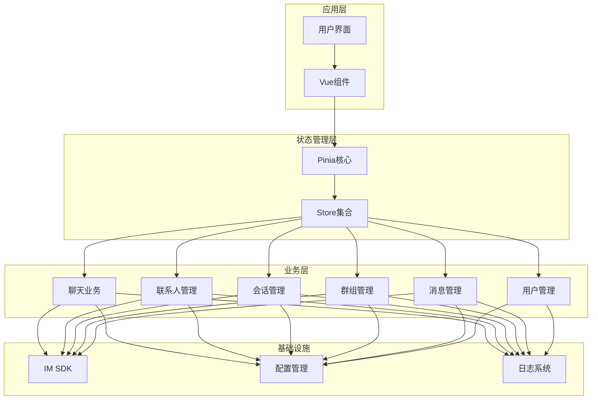
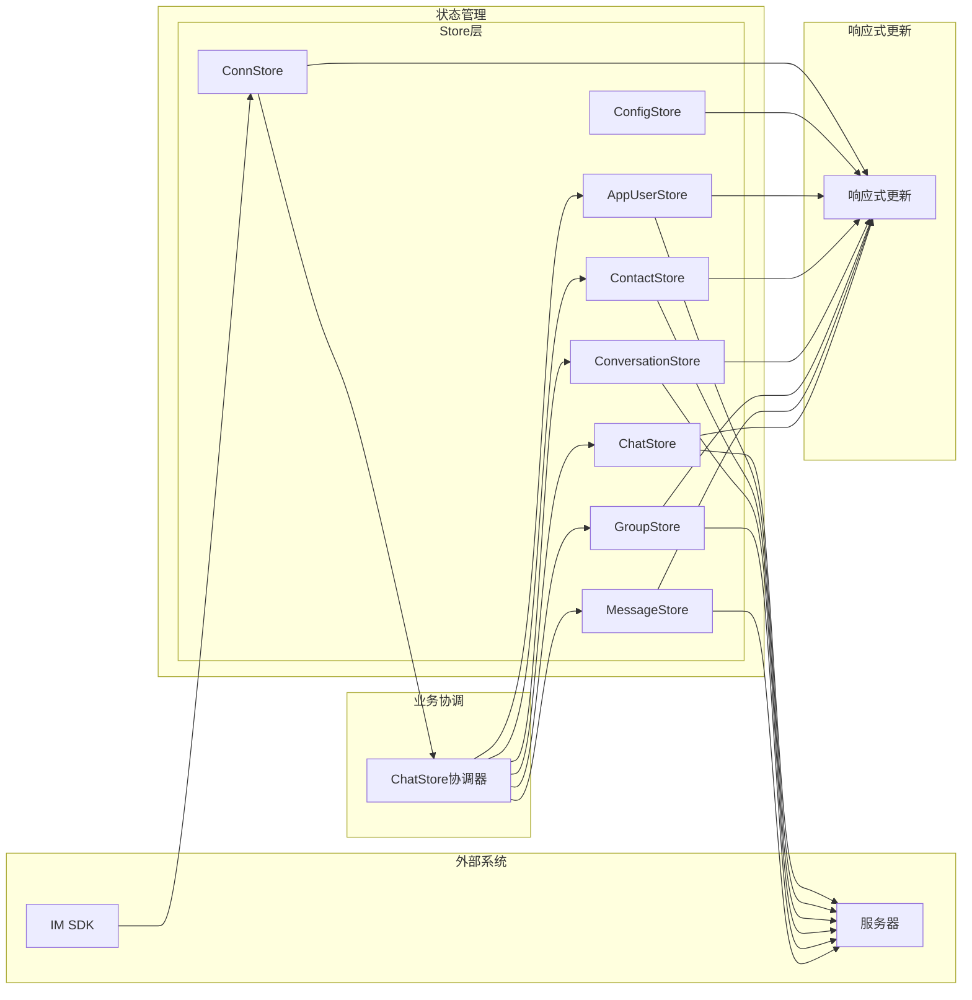
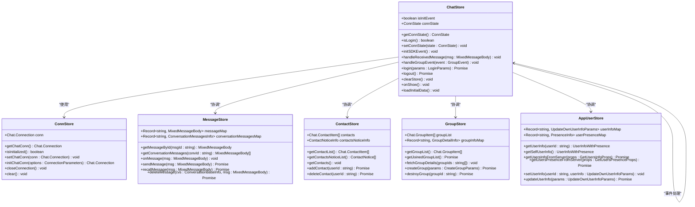
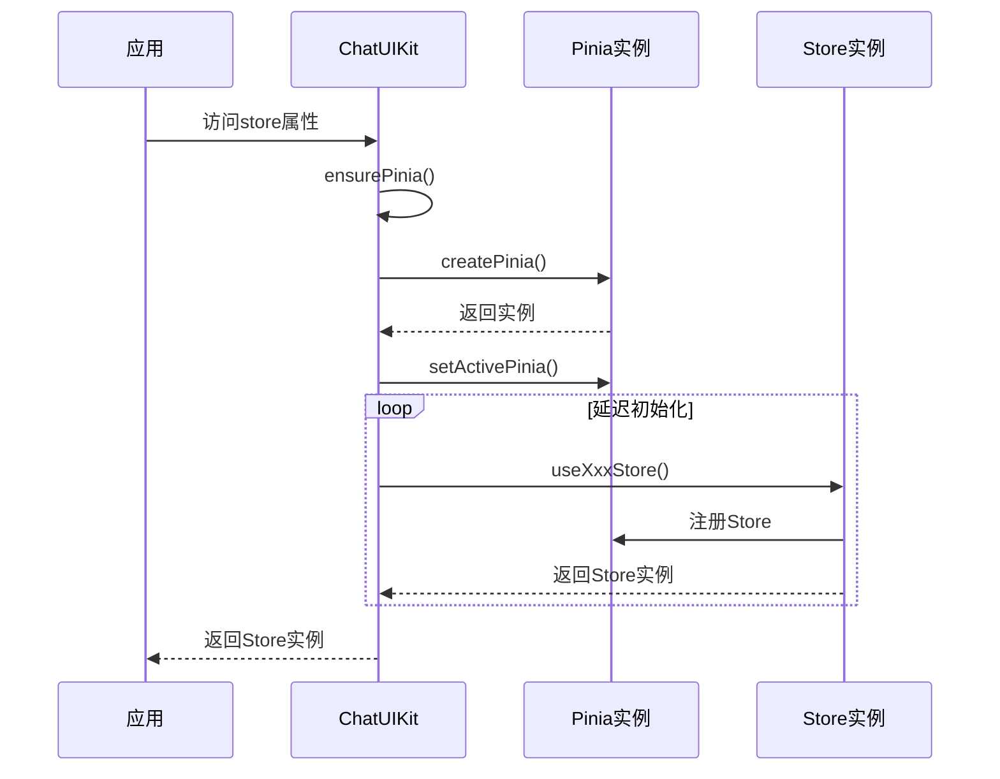
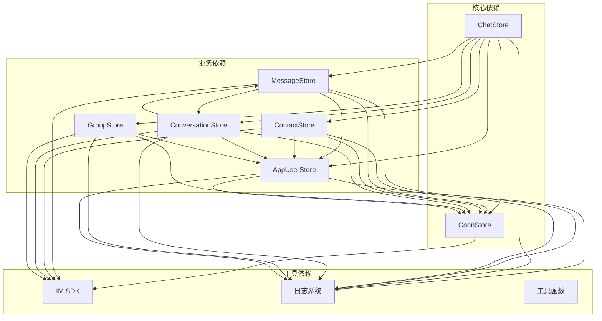
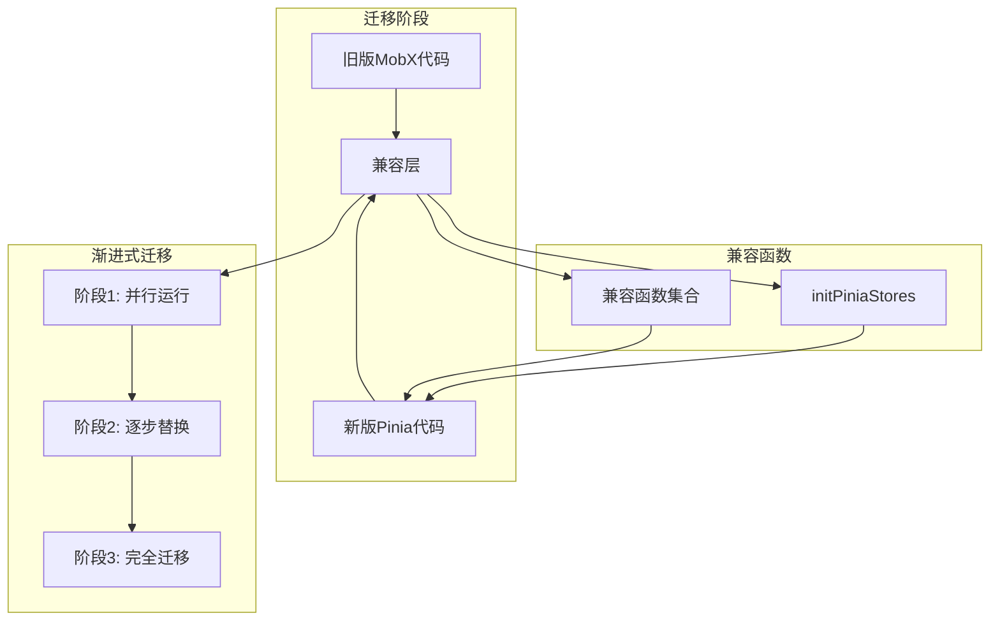
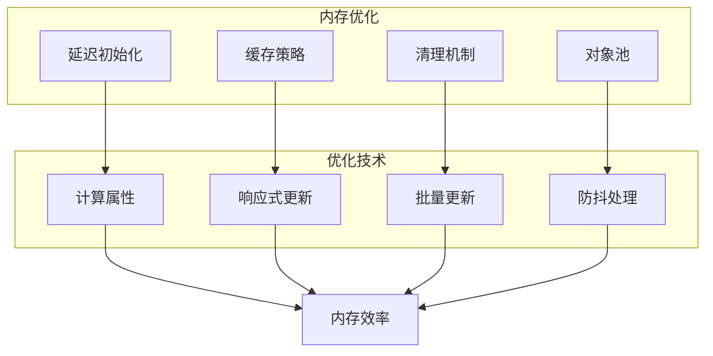
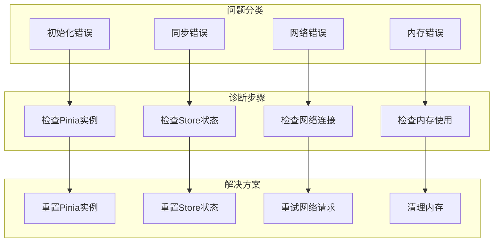

# Pinia状态管理概览

<cite>
**本文档引用的文件**
- [ChatUIKit/index.ts](file://ChatUIKit/index.ts)
- [ChatUIKit/stores/index.ts](file://ChatUIKit/stores/index.ts)
- [ChatUIKit/stores/appUser.ts](file://ChatUIKit/stores/appUser.ts)
- [ChatUIKit/stores/chat.ts](file://ChatUIKit/stores/chat.ts)
- [ChatUIKit/stores/config.ts](file://ChatUIKit/stores/config.ts)
- [ChatUIKit/stores/conn.ts](file://ChatUIKit/stores/conn.ts)
- [ChatUIKit/stores/contact.ts](file://ChatUIKit/stores/contact.ts)
- [ChatUIKit/stores/conversation.ts](file://ChatUIKit/stores/conversation.ts)
- [ChatUIKit/stores/group.ts](file://ChatUIKit/stores/group.ts)
- [ChatUIKit/stores/message.ts](file://ChatUIKit/stores/message.ts)
- [ChatUIKit/configType.ts](file://ChatUIKit/configType.ts)
- [ChatUIKit/types/index.ts](file://ChatUIKit/types/index.ts)
- [ChatUIKit/sdk.ts](file://ChatUIKit/sdk.ts)
- [ChatUIKit/const/index.ts](file://ChatUIKit/const/index.ts)
- [demo/main.js](file://demo/main.js)
</cite>

## 目录
1. [引言](#引言)
2. [项目结构](#项目结构)
3. [核心组件](#核心组件)
4. [架构概览](#架构概览)
5. [详细组件分析](#详细组件分析)
6. [依赖关系分析](#依赖关系分析)
7. [性能考虑](#性能考虑)
8. [故障排除指南](#故障排除指南)
9. [结论](#结论)

## 引言

本项目采用Pinia作为状态管理解决方案，完成了从MobX到Pinia的重大技术升级。这次迁移带来了更好的Vue生态系统支持、组合式API集成以及更优秀的响应式体验。

### 技术决策与优势

**从MobX迁移到Pinia的核心优势：**

1. **更好的Vue生态支持**：Pinia原生支持Vue 3 Composition API，提供更自然的状态管理模式
2. **组合式API集成**：与Vue 3的响应式系统深度整合，提供更直观的开发体验
3. **TypeScript友好**：原生TypeScript支持，提供完整的类型推断和编译时检查
4. **模块化设计**：每个Store独立定义，便于维护和测试
5. **开发工具支持**：内置的Vue DevTools支持，便于调试和性能分析

## 项目结构

项目采用模块化的Store组织方式，每个业务领域都有独立的Store模块：



**图表来源**
- [ChatUIKit/index.ts](file://ChatUIKit/index.ts#L18-L132)
- [ChatUIKit/stores/index.ts](file://ChatUIKit/stores/index.ts#L1-L31)

**章节来源**
- [ChatUIKit/index.ts](file://ChatUIKit/index.ts#L1-L139)
- [ChatUIKit/stores/index.ts](file://ChatUIKit/stores/index.ts#L1-L31)

## 核心组件

### Pinia实例创建与管理

项目实现了延迟初始化策略，通过全局Pinia实例确保在任何Store被访问之前都能正确初始化。



**图表来源**
- [ChatUIKit/index.ts](file://ChatUIKit/index.ts#L31-L42)

### Store命名约定与导出模式

项目采用统一的命名约定和模块化导出策略：

**命名约定：**
- Store函数：`useXxxStore()` - 符合Vue 3 Composition API规范
- Store状态：`xxxStore` - 类型标识符
- Store常量：`XxxStore` - 类型定义

**导出模式：**
- 每个Store独立导出，支持按需导入
- 提供统一的入口文件进行聚合导出
- 兼容旧版接口的迁移支持函数

**章节来源**
- [ChatUIKit/stores/index.ts](file://ChatUIKit/stores/index.ts#L1-L31)
- [ChatUIKit/index.ts](file://ChatUIKit/index.ts#L1-L139)

## 架构概览

### 系统架构图



**图表来源**
- [ChatUIKit/stores/chat.ts](file://ChatUIKit/stores/chat.ts#L1-L407)
- [ChatUIKit/stores/contact.ts](file://ChatUIKit/stores/contact.ts#L1-L282)
- [ChatUIKit/stores/conversation.ts](file://ChatUIKit/stores/conversation.ts#L1-L421)
- [ChatUIKit/stores/group.ts](file://ChatUIKit/stores/group.ts#L1-L317)
- [ChatUIKit/stores/message.ts](file://ChatUIKit/stores/message.ts#L1-L581)
- [ChatUIKit/stores/appUser.ts](file://ChatUIKit/stores/appUser.ts#L1-L242)

### 数据流架构



**图表来源**
- [ChatUIKit/stores/chat.ts](file://ChatUIKit/stores/chat.ts#L67-L221)
- [ChatUIKit/stores/message.ts](file://ChatUIKit/stores/message.ts#L341-L388)

## 详细组件分析

### ChatStore - 聊天协调器

ChatStore作为整个聊天系统的协调器，负责管理SDK事件监听和跨Store的数据流协调。



**图表来源**
- [ChatUIKit/stores/chat.ts](file://ChatUIKit/stores/chat.ts#L22-L398)
- [ChatUIKit/stores/conn.ts](file://ChatUIKit/stores/conn.ts#L15-L84)
- [ChatUIKit/stores/message.ts](file://ChatUIKit/stores/message.ts#L25-L581)
- [ChatUIKit/stores/contact.ts](file://ChatUIKit/stores/contact.ts#L16-L282)
- [ChatUIKit/stores/group.ts](file://ChatUIKit/stores/group.ts#L16-L317)
- [ChatUIKit/stores/appUser.ts](file://ChatUIKit/stores/appUser.ts#L17-L242)

**章节来源**
- [ChatUIKit/stores/chat.ts](file://ChatUIKit/stores/chat.ts#L1-L407)

### Store初始化流程



**图表来源**
- [ChatUIKit/index.ts](file://ChatUIKit/index.ts#L31-L78)

**章节来源**
- [ChatUIKit/index.ts](file://ChatUIKit/index.ts#L1-L139)

### 数据模型设计

```mermaid
erDiagram
CONN_STATE {
Chat.Connection conn
boolean isInitialized
}
CONFIG_STATE {
ThemeConfig themeConfig
FeatureConfig featureConfig
}
APP_USER_STATE {
json userInfoMap
json userPresenceMap
}
CONTACT_STATE {
array contacts
object contactsNoticeInfo
ContactItem viewedUserInfo
}
CONVERSATION_STATE {
array conversationList
ConversationBaseInfo currConversation
json muteConvsMap
object pageParams
object pinParams
}
GROUP_STATE {
array groupList
json groupInfoMap
object groupNoticeInfo
object pageParams
}
MESSAGE_STATE {
json messageMap
json conversationMessagesMap
string playingAudioMsgId
MixedMessageBody quoteMessage
ModifiedMsg editingMessage
}
CONN_STATE ||--|| CONFIG_STATE : "配置"
CONFIG_STATE ||--|| APP_USER_STATE : "用户"
APP_USER_STATE ||--|| CONTACT_STATE : "联系人"
CONTACT_STATE ||--|| CONVERSATION_STATE : "会话"
CONVERSATION_STATE ||--|| GROUP_STATE : "群组"
GROUP_STATE ||--|| MESSAGE_STATE : "消息"
MESSAGE_STATE ||--|| APP_USER_STATE : "用户"
```

**图表来源**
- [ChatUIKit/stores/conn.ts](file://ChatUIKit/stores/conn.ts#L15-L18)
- [ChatUIKit/stores/config.ts](file://ChatUIKit/stores/config.ts#L14-L17)
- [ChatUIKit/stores/appUser.ts](file://ChatUIKit/stores/appUser.ts#L17-L22)
- [ChatUIKit/stores/contact.ts](file://ChatUIKit/stores/contact.ts#L16-L23)
- [ChatUIKit/stores/conversation.ts](file://ChatUIKit/stores/conversation.ts#L27-L38)
- [ChatUIKit/stores/group.ts](file://ChatUIKit/stores/group.ts#L16-L25)
- [ChatUIKit/stores/message.ts](file://ChatUIKit/stores/message.ts#L25-L44)

**章节来源**
- [ChatUIKit/stores/conn.ts](file://ChatUIKit/stores/conn.ts#L1-L84)
- [ChatUIKit/stores/config.ts](file://ChatUIKit/stores/config.ts#L1-L124)
- [ChatUIKit/stores/appUser.ts](file://ChatUIKit/stores/appUser.ts#L1-L242)
- [ChatUIKit/stores/contact.ts](file://ChatUIKit/stores/contact.ts#L1-L282)
- [ChatUIKit/stores/conversation.ts](file://ChatUIKit/stores/conversation.ts#L1-L421)
- [ChatUIKit/stores/group.ts](file://ChatUIKit/stores/group.ts#L1-L317)
- [ChatUIKit/stores/message.ts](file://ChatUIKit/stores/message.ts#L1-L581)

## 依赖关系分析

### Store间依赖关系



**图表来源**
- [ChatUIKit/stores/chat.ts](file://ChatUIKit/stores/chat.ts#L10-L20)
- [ChatUIKit/stores/message.ts](file://ChatUIKit/stores/message.ts#L11-L21)
- [ChatUIKit/stores/contact.ts](file://ChatUIKit/stores/contact.ts#L10-L13)
- [ChatUIKit/stores/conversation.ts](file://ChatUIKit/stores/conversation.ts#L11-L22)
- [ChatUIKit/stores/group.ts](file://ChatUIKit/stores/group.ts#L10-L13)
- [ChatUIKit/stores/appUser.ts](file://ChatUIKit/stores/appUser.ts#L10-L15)

### 迁移兼容性

项目提供了完整的迁移兼容机制：



**图表来源**
- [ChatUIKit/stores/index.ts](file://ChatUIKit/stores/index.ts#L23-L30)

**章节来源**
- [ChatUIKit/stores/index.ts](file://ChatUIKit/stores/index.ts#L1-L31)

## 性能考虑

### 响应式优化策略

1. **延迟初始化**：Store仅在首次访问时创建，减少初始内存占用
2. **计算属性缓存**：使用getter缓存派生状态，避免重复计算
3. **增量数据加载**：支持分页加载和增量更新
4. **消息清理机制**：自动清理超出限制的历史消息

### 内存管理



### 最佳实践建议

1. **Store设计原则**：
   - 每个Store专注于单一职责
   - 使用清晰的命名约定
   - 合理划分state、getters、actions

2. **性能优化技巧**：
   - 使用计算属性缓存复杂计算结果
   - 实现适当的防抖和节流
   - 优化大数据量的渲染

3. **错误处理**：
   - 实现完善的异常捕获和恢复机制
   - 提供友好的错误提示
   - 支持自动重试和降级策略

## 故障排除指南

### 常见问题诊断



### 错误处理机制

项目实现了多层次的错误处理机制：

1. **Store级别错误处理**：每个Store都有独立的错误处理逻辑
2. **全局错误捕获**：通过try-catch包装关键操作
3. **日志记录**：详细的错误日志便于调试
4. **优雅降级**：在网络异常时提供基础功能

**章节来源**
- [ChatUIKit/stores/chat.ts](file://ChatUIKit/stores/chat.ts#L333-L345)
- [ChatUIKit/stores/message.ts](file://ChatUIKit/stores/message.ts#L332-L336)
- [ChatUIKit/stores/contact.ts](file://ChatUIKit/stores/contact.ts#L127-L130)

## 结论

本项目的Pinia状态管理实现展现了现代Vue应用的最佳实践：

### 技术优势总结

1. **架构清晰**：模块化设计，职责分离明确
2. **性能优秀**：延迟初始化、计算属性缓存等优化策略
3. **易于维护**：TypeScript支持，完整的类型系统
4. **迁移友好**：提供完整的迁移兼容机制

### 未来发展方向

1. **进一步优化**：可以考虑实现Store的动态加载和懒加载
2. **监控增强**：添加更详细的性能监控和分析工具
3. **测试完善**：增加单元测试和集成测试覆盖率
4. **文档扩展**：完善API文档和使用示例

通过这次从MobX到Pinia的成功迁移，项目不仅获得了更好的技术栈支持，也为未来的功能扩展奠定了坚实的基础。