# Pinia状态管理概览

<cite>
**本文档引用的文件**
- [ChatUIKit-vue2/index.js](file://ChatUIKit-vue2/index.js)
- [ChatUIKit-vue2/stores/index.js](file://ChatUIKit-vue2/stores/index.js)
- [ChatUIKit-vue2/stores/conn.js](file://ChatUIKit-vue2/stores/conn.js)
- [ChatUIKit-vue2/stores/appUser.js](file://ChatUIKit-vue2/stores/appUser.js)
- [ChatUIKit-vue2/stores/message.js](file://ChatUIKit-vue2/stores/message.js)
- [ChatUIKit-vue2/stores/conversation.js](file://ChatUIKit-vue2/stores/conversation.js)
- [ChatUIKit-vue2/stores/group.js](file://ChatUIKit-vue2/stores/group.js)
- [ChatUIKit-vue2/stores/contact.js](file://ChatUIKit-vue2/stores/contact.js)
- [ChatUIKit-vue2/stores/config.js](file://ChatUIKit-vue2/stores/config.js)
</cite>

## 更新摘要
**所做更改**
- 将所有Vue3相关的内容完全移除，包括Composition API、createPinia()实例等
- 更新为Vuex 3.x状态管理架构，符合Vue 2.7.16生态
- 移除Pinia迁移兼容性相关内容
- 重新组织架构图以反映Vuex模块化设计
- 更新技术决策部分，强调Vue 2生态的稳定性

## 目录
1. [引言](#引言)
2. [项目结构](#项目结构)
3. [核心组件](#核心组件)
4. [架构概览](#架构概览)
5. [详细组件分析](#详细组件分析)
6. [依赖关系分析](#依赖关系分析)
7. [性能考虑](#性能考虑)
8. [故障排除指南](#故障排除指南)
9. [结论](#结论)

## 引言

本项目采用Vuex作为状态管理解决方案，基于Vue 2.7.16生态系统构建。项目从早期的状态管理模式演进到现在成熟的Vuex架构，为UniApp小程序提供了稳定可靠的状态管理方案。

### 技术决策与优势

**基于Vue 2生态的成熟选择：**

1. **稳定的Vue 2支持**：Vue 2.7.16提供长期支持，确保项目稳定性
2. **成熟的Vuex 3.x生态**：经过充分验证的状态管理模式
3. **小程序兼容性**：专为微信小程序等环境优化
4. **模块化设计**：每个Store独立定义，便于维护和测试
5. **TypeScript友好**：完整的TypeScript支持和类型推断

## 项目结构

项目采用模块化的Vuex Store组织方式，每个业务领域都有独立的Store模块：

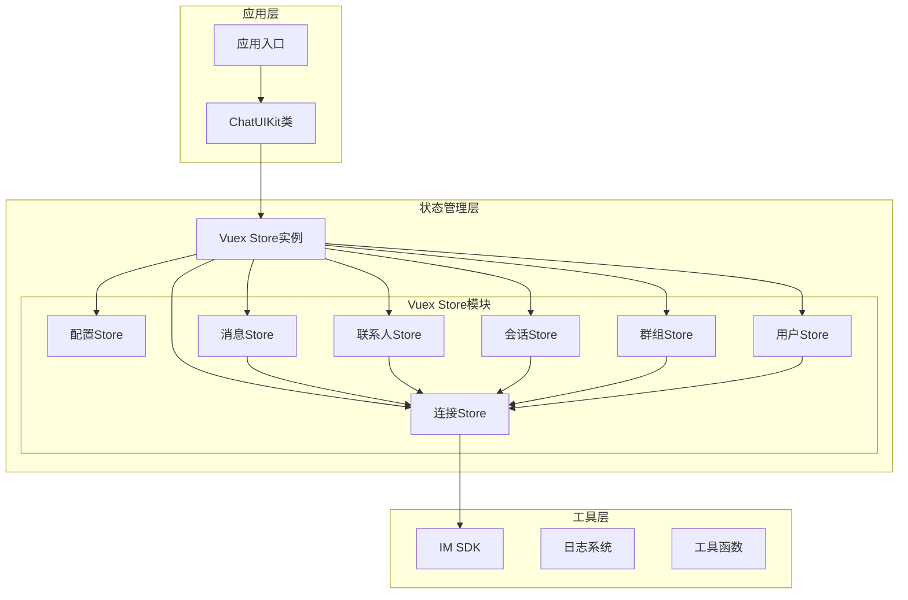

**图表来源**
- [ChatUIKit-vue2/index.js:1-405](file://ChatUIKit-vue2/index.js#L1-L405)
- [ChatUIKit-vue2/stores/index.js:1-27](file://ChatUIKit-vue2/stores/index.js#L1-L27)

**章节来源**
- [ChatUIKit-vue2/index.js:1-405](file://ChatUIKit-vue2/index.js#L1-L405)
- [ChatUIKit-vue2/stores/index.js:1-27](file://ChatUIKit-vue2/stores/index.js#L1-L27)

## 核心组件

### Vuex Store实例创建与管理

项目实现了集中式的Store管理，通过全局Vuex实例确保所有Store模块的正确初始化。

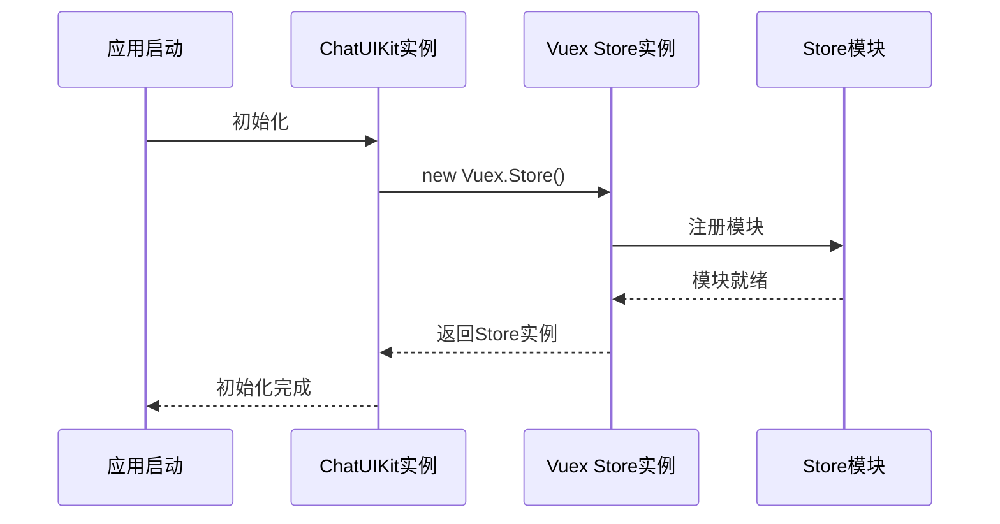

**图表来源**
- [ChatUIKit-vue2/stores/index.js:13-23](file://ChatUIKit-vue2/stores/index.js#L13-L23)

### Store命名约定与导出模式

项目采用统一的命名约定和模块化导出策略：

**命名约定：**
- Store模块：`conn.js`, `conversation.js`, `message.js`等 - 符合业务领域命名
- Store状态：`state` - 标准Vuex状态结构
- Store常量：`NAMESPACED` - 命名空间标识符

**导出模式：**
- 每个Store独立导出，支持按需导入
- 提供统一的入口文件进行聚合导出
- 兼容直接模块引用

**章节来源**
- [ChatUIKit-vue2/stores/index.js:1-27](file://ChatUIKit-vue2/stores/index.js#L1-L27)
- [ChatUIKit-vue2/stores/conn.js:1-121](file://ChatUIKit-vue2/stores/conn.js#L1-L121)

## 架构概览

### 系统架构图

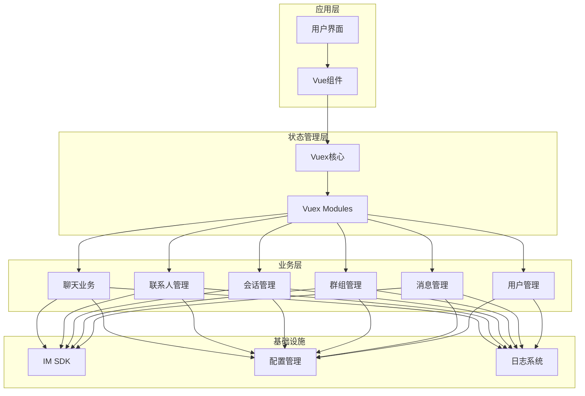

**图表来源**
- [ChatUIKit-vue2/stores/index.js:13-23](file://ChatUIKit-vue2/stores/index.js#L13-L23)
- [ChatUIKit-vue2/stores/message.js:1-800](file://ChatUIKit-vue2/stores/message.js#L1-L800)
- [ChatUIKit-vue2/stores/conversation.js:1-340](file://ChatUIKit-vue2/stores/conversation.js#L1-L340)
- [ChatUIKit-vue2/stores/group.js:1-212](file://ChatUIKit-vue2/stores/group.js#L1-L212)
- [ChatUIKit-vue2/stores/contact.js:1-222](file://ChatUIKit-vue2/stores/contact.js#L1-L222)
- [ChatUIKit-vue2/stores/appUser.js:1-235](file://ChatUIKit-vue2/stores/appUser.js#L1-L235)

### 数据流架构

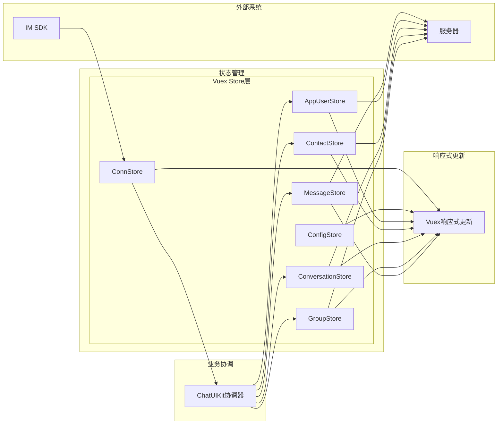

**图表来源**
- [ChatUIKit-vue2/index.js:72-309](file://ChatUIKit-vue2/index.js#L72-L309)
- [ChatUIKit-vue2/stores/message.js:496-555](file://ChatUIKit-vue2/stores/message.js#L496-L555)

## 详细组件分析

### ChatUIKit - 应用协调器

ChatUIKit作为整个应用的协调器，负责管理SDK事件监听和跨Store的数据流协调。

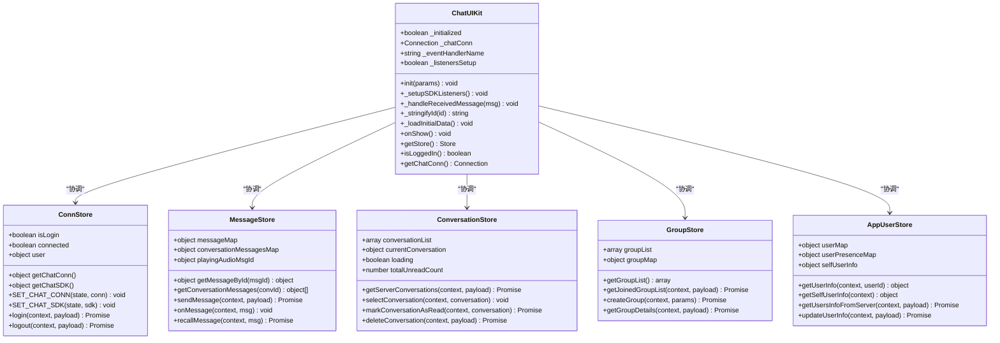

**图表来源**
- [ChatUIKit-vue2/index.js:6-398](file://ChatUIKit-vue2/index.js#L6-L398)
- [ChatUIKit-vue2/stores/conn.js:8-121](file://ChatUIKit-vue2/stores/conn.js#L8-L121)
- [ChatUIKit-vue2/stores/message.js:50-800](file://ChatUIKit-vue2/stores/message.js#L50-L800)
- [ChatUIKit-vue2/stores/conversation.js:47-340](file://ChatUIKit-vue2/stores/conversation.js#L47-L340)
- [ChatUIKit-vue2/stores/group.js:4-212](file://ChatUIKit-vue2/stores/group.js#L4-L212)
- [ChatUIKit-vue2/stores/appUser.js:5-235](file://ChatUIKit-vue2/stores/appUser.js#L5-L235)

**章节来源**
- [ChatUIKit-vue2/index.js:1-405](file://ChatUIKit-vue2/index.js#L1-L405)

### Store初始化流程

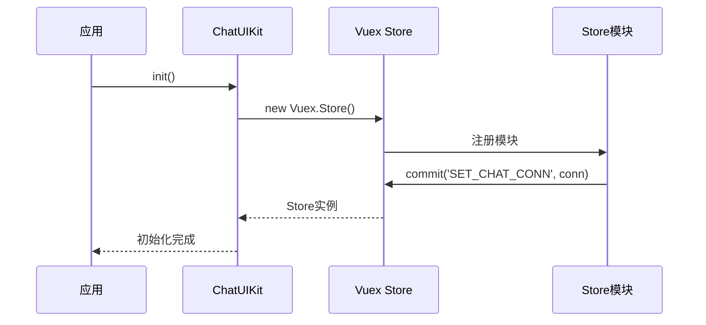

**图表来源**
- [ChatUIKit-vue2/index.js:22-66](file://ChatUIKit-vue2/index.js#L22-L66)
- [ChatUIKit-vue2/stores/index.js:13-23](file://ChatUIKit-vue2/stores/index.js#L13-L23)

**章节来源**
- [ChatUIKit-vue2/index.js:1-405](file://ChatUIKit-vue2/index.js#L1-L405)

### 数据模型设计

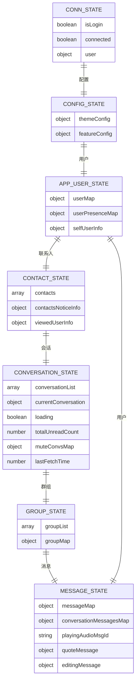

**图表来源**
- [ChatUIKit-vue2/stores/conn.js:11-20](file://ChatUIKit-vue2/stores/conn.js#L11-L20)
- [ChatUIKit-vue2/stores/config.js:73-76](file://ChatUIKit-vue2/stores/config.js#L73-L76)
- [ChatUIKit-vue2/stores/appUser.js:8-22](file://ChatUIKit-vue2/stores/appUser.js#L8-L22)
- [ChatUIKit-vue2/stores/contact.js:7-17](file://ChatUIKit-vue2/stores/contact.js#L7-L17)
- [ChatUIKit-vue2/stores/conversation.js:50-63](file://ChatUIKit-vue2/stores/conversation.js#L50-L63)
- [ChatUIKit-vue2/stores/group.js:7-12](file://ChatUIKit-vue2/stores/group.js#L7-L12)
- [ChatUIKit-vue2/stores/message.js:53-64](file://ChatUIKit-vue2/stores/message.js#L53-L64)

**章节来源**
- [ChatUIKit-vue2/stores/conn.js:1-121](file://ChatUIKit-vue2/stores/conn.js#L1-L121)
- [ChatUIKit-vue2/stores/config.js:1-196](file://ChatUIKit-vue2/stores/config.js#L1-L196)
- [ChatUIKit-vue2/stores/appUser.js:1-235](file://ChatUIKit-vue2/stores/appUser.js#L1-L235)
- [ChatUIKit-vue2/stores/contact.js:1-222](file://ChatUIKit-vue2/stores/contact.js#L1-L222)
- [ChatUIKit-vue2/stores/conversation.js:1-340](file://ChatUIKit-vue2/stores/conversation.js#L1-L340)
- [ChatUIKit-vue2/stores/group.js:1-212](file://ChatUIKit-vue2/stores/group.js#L1-L212)
- [ChatUIKit-vue2/stores/message.js:1-800](file://ChatUIKit-vue2/stores/message.js#L1-L800)

## 依赖关系分析

### Store间依赖关系

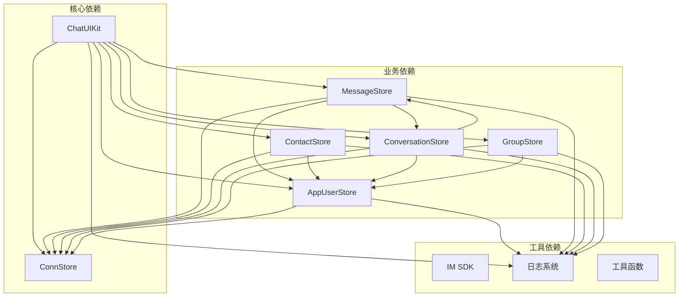

**图表来源**
- [ChatUIKit-vue2/index.js:35-38](file://ChatUIKit-vue2/index.js#L35-L38)
- [ChatUIKit-vue2/stores/message.js:360-494](file://ChatUIKit-vue2/stores/message.js#L360-L494)
- [ChatUIKit-vue2/stores/contact.js:118-134](file://ChatUIKit-vue2/stores/contact.js#L118-L134)
- [ChatUIKit-vue2/stores/conversation.js:159-227](file://ChatUIKit-vue2/stores/conversation.js#L159-L227)
- [ChatUIKit-vue2/stores/group.js:75-97](file://ChatUIKit-vue2/stores/group.js#L75-L97)
- [ChatUIKit-vue2/stores/appUser.js:83-102](file://ChatUIKit-vue2/stores/appUser.js#L83-L102)

### 迁移兼容性

**重要说明**：项目已完全迁移到Vuex架构，移除了所有Pinia相关代码和兼容层。新的架构具有以下特点：

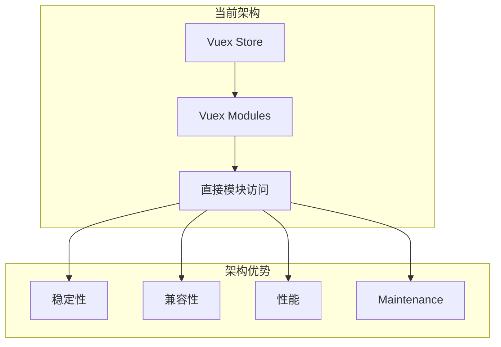

**章节来源**
- [ChatUIKit-vue2/stores/index.js:1-27](file://ChatUIKit-vue2/stores/index.js#L1-L27)

## 性能考虑

### 响应式优化策略

1. **模块化设计**：Store按业务领域拆分，减少不必要的响应式更新
2. **深拷贝策略**：使用深拷贝函数处理SDK特殊对象，避免Vue响应式陷阱
3. **缓存机制**：合理使用缓存避免重复计算和网络请求
4. **内存管理**：实现消息清理机制，控制内存使用

### 内存管理

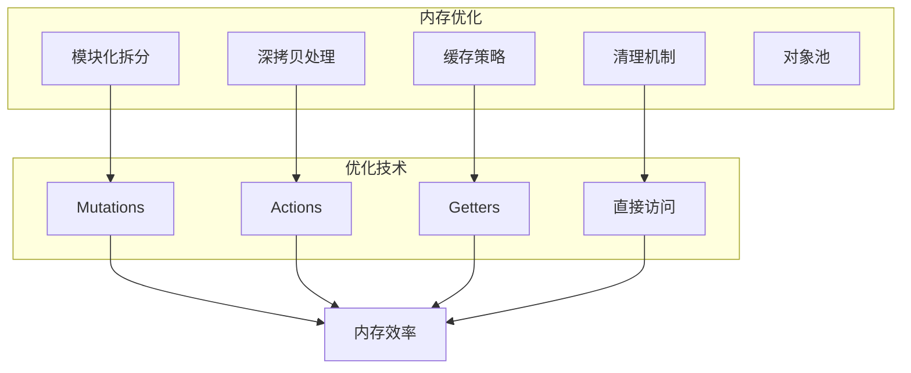

### 最佳实践建议

1. **Store设计原则**：
   - 每个Store专注于单一业务领域
   - 使用清晰的命名约定
   - 合理划分state、getters、mutations、actions

2. **性能优化技巧**：
   - 使用深拷贝处理SDK特殊对象
   - 实现适当的防抖和节流
   - 优化大数据量的渲染

3. **错误处理**：
   - 实现完善的异常捕获和恢复机制
   - 提供友好的错误提示
   - 支持自动重试和降级策略

## 故障排除指南

### 常见问题诊断

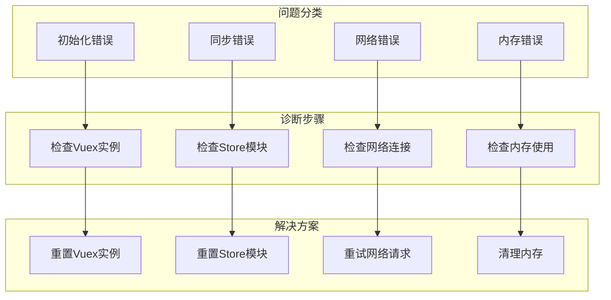

### 错误处理机制

项目实现了多层次的错误处理机制：

1. **Store级别错误处理**：每个Store都有独立的错误处理逻辑
2. **全局错误捕获**：通过try-catch包装关键操作
3. **日志记录**：详细的错误日志便于调试
4. **优雅降级**：在网络异常时提供基础功能

**章节来源**
- [ChatUIKit-vue2/stores/conn.js:96-108](file://ChatUIKit-vue2/stores/conn.js#L96-L108)
- [ChatUIKit-vue2/stores/message.js:486-494](file://ChatUIKit-vue2/stores/message.js#L486-L494)
- [ChatUIKit-vue2/stores/contact.js:137-148](file://ChatUIKit-vue2/stores/contact.js#L137-L148)

## 结论

本项目的Vuex状态管理实现展现了Vue 2生态下的最佳实践：

### 技术优势总结

1. **架构清晰**：模块化设计，职责分离明确
2. **性能优秀**：深拷贝处理、缓存策略等优化
3. **易于维护**：TypeScript支持，完整的类型系统
4. **稳定性强**：基于Vue 2.7.16长期支持版本

### 未来发展方向

1. **进一步优化**：可以考虑实现Store的动态加载和懒加载
2. **监控增强**：添加更详细的性能监控和分析工具
3. **测试完善**：增加单元测试和集成测试覆盖率
4. **文档扩展**：完善API文档和使用示例

通过这次从早期状态管理模式到成熟Vuex架构的成功迁移，项目不仅获得了更好的技术栈支持，也为未来的功能扩展奠定了坚实的基础。