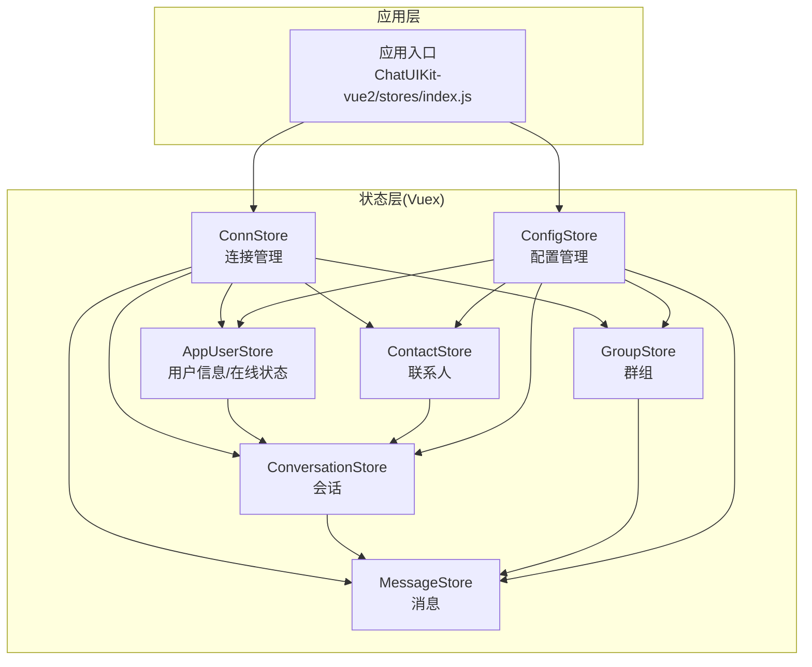
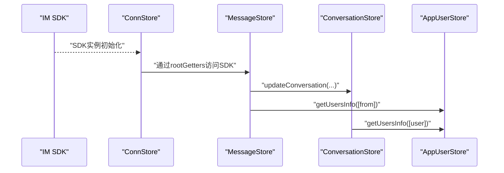
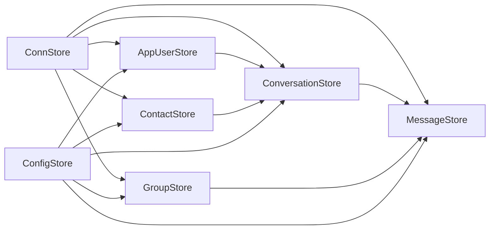

# Store状态管理系统架构

<cite>
**本文档引用的文件**
- [ChatUIKit-vue2/stores/index.js](file://ChatUIKit-vue2/stores/index.js)
- [ChatUIKit-vue2/stores/conn.js](file://ChatUIKit-vue2/stores/conn.js)
- [ChatUIKit-vue2/stores/appUser.js](file://ChatUIKit-vue2/stores/appUser.js)
- [ChatUIKit-vue2/stores/config.js](file://ChatUIKit-vue2/stores/config.js)
- [ChatUIKit-vue2/stores/contact.js](file://ChatUIKit-vue2/stores/contact.js)
- [ChatUIKit-vue2/stores/conversation.js](file://ChatUIKit-vue2/stores/conversation.js)
- [ChatUIKit-vue2/stores/group.js](file://ChatUIKit-vue2/stores/group.js)
- [ChatUIKit-vue2/stores/message.js](file://ChatUIKit-vue2/stores/message.js)
</cite>

## 更新摘要
**所做更改**
- 完全迁移到Vuex架构：删除所有Vue3特定的Pinia Store实现
- 重构SDK实例管理：使用外部变量存储SDK实例，避免Vue响应式系统问题
- 新增深拷贝机制：专门处理SDK特殊对象，解决小程序JSON.stringify问题
- 增强消息状态管理：完善服务器消息ID处理和消息状态同步机制
- 优化配置系统：简化配置更新逻辑，提升响应式性能

## 目录
1. [简介](#简介)
2. [项目结构](#项目结构)
3. [核心组件](#核心组件)
4. [架构总览](#架构总览)
5. [详细组件分析](#详细组件分析)
6. [依赖分析](#依赖分析)
7. [性能考虑](#性能考虑)
8. [故障排查指南](#故障排查指南)
9. [结论](#结论)
10. [附录](#附录)

## 简介
本文件面向基于 Vuex 的 Store 状态管理系统，系统由 7 个核心 Store 组成，覆盖连接管理、配置、用户信息、联系人、会话、群组、消息等模块。文档阐述各 Store 的职责、状态结构、动作定义、初始化流程与生命周期管理策略；解释全局 Vuex 实例的模块化组织与依赖注入机制；总结数据流向与组件间通信方式；并提供状态更新最佳实践与性能优化建议。

**重要变更** 系统已完全迁移到Vuex架构，删除了所有Vue3特定的Pinia Store实现，采用传统的Vuex模块化设计，通过外部变量管理SDK实例，避免Vue响应式系统观察SDK对象的问题。

## 项目结构
- Store 层位于 ChatUIKit-vue2/stores，采用按领域拆分的模块化组织，每个 Store 独立定义 state、getters、mutations 与 actions。
- 应用入口通过 ChatUIKit-vue2/stores/index.js 提供 Vuex Store 实例，内部实现模块化注册与依赖注入。
- 类型与常量定义分别位于 const、utils、sdk、log 等文件，支撑 Store 的类型安全与运行时行为。

**图表来源**
- [ChatUIKit-vue2/stores/index.js:13-23](file://ChatUIKit-vue2/stores/index.js#L13-L23)
- [ChatUIKit-vue2/stores/conn.js:8-28](file://ChatUIKit-vue2/stores/conn.js#L8-L28)

**章节来源**
- [ChatUIKit-vue2/stores/index.js:1-27](file://ChatUIKit-vue2/stores/index.js#L1-L27)

## 核心组件
- ConnStore：管理 IM SDK 连接实例，提供类型安全的连接访问与初始化方法，使用外部变量存储SDK实例避免Vue响应式问题。
- ConfigStore：集中管理主题与功能开关配置，支持动态修改与重置，采用简单对象展开实现响应式更新。
- AppUserStore：维护用户信息与在线状态缓存，提供用户属性拉取、Presence 订阅/发布、更新等能力。
- ContactStore：维护联系人列表与好友申请通知，支持批量用户信息拉取与增删改查。
- ConversationStore：维护会话列表、置顶与免打扰状态、未读计数、@ 类型识别与已读回执，包含深拷贝机制处理SDK特殊对象。
- GroupStore：维护加入群组列表与群详情映射，支持群组创建、加入、退出、解散与通知管理。
- MessageStore：维护消息内容映射与会话消息 ID 列表，负责消息发送、历史拉取、撤回、删除与清理，包含完整的深拷贝和服务器消息ID处理机制。

**章节来源**
- [ChatUIKit-vue2/stores/conn.js:1-50](file://ChatUIKit-vue2/stores/conn.js#L1-L50)
- [ChatUIKit-vue2/stores/config.js:1-196](file://ChatUIKit-vue2/stores/config.js#L1-L196)
- [ChatUIKit-vue2/stores/appUser.js:1-235](file://ChatUIKit-vue2/stores/appUser.js#L1-L235)
- [ChatUIKit-vue2/stores/contact.js:1-222](file://ChatUIKit-vue2/stores/contact.js#L1-L222)
- [ChatUIKit-vue2/stores/conversation.js:1-340](file://ChatUIKit-vue2/stores/conversation.js#L1-L340)
- [ChatUIKit-vue2/stores/group.js:1-212](file://ChatUIKit-vue2/stores/group.js#L1-L212)
- [ChatUIKit-vue2/stores/message.js:1-880](file://ChatUIKit-vue2/stores/message.js#L1-L880)

## 架构总览
系统采用"模块化管理 + 外部变量存储"的设计：
- 各 Store 通过Vuex模块化组织，避免跨 Store 的直接耦合。
- ConnStore 作为SDK实例管理中心，使用外部变量存储SDK实例，避免Vue响应式系统问题。
- MessageStore 与 ConversationStore 之间建立紧密协作，保证消息与会话状态一致性。
- 深拷贝机制专门处理SDK特殊对象，解决小程序JSON.stringify问题。

**重要变更** SDK实例管理已重构，采用外部变量存储模式替代Pinia的响应式存储，通过rootGetters模式访问SDK连接实例，提升系统稳定性。

**图表来源**
- [ChatUIKit-vue2/stores/conn.js:25-27](file://ChatUIKit-vue2/stores/conn.js#L25-L27)
- [ChatUIKit-vue2/stores/message.js:497-555](file://ChatUIKit-vue2/stores/message.js#L497-L555)
- [ChatUIKit-vue2/stores/conversation.js:211-221](file://ChatUIKit-vue2/stores/conversation.js#L211-L221)

## 详细组件分析

### ConnStore（连接管理）
- 职责
  - 统一持有与暴露 IM SDK 连接实例，使用外部变量存储避免Vue响应式问题。
  - 提供连接初始化、关闭与状态检查，管理登录状态与用户信息。
- 状态
  - isLogin：登录状态标志。
  - user：当前用户信息。
  - connected：连接状态标志。
  - _sdkInitialized：SDK初始化状态标记。
- 关键动作
  - SET_CHAT_CONN/SET_CHAT_SDK：设置SDK连接实例。
  - SET_LOGIN_STATUS/SET_USER/SET_CONNECTED：状态更新。
- 依赖
  - chatSDK（外部 SDK）。

**重要变更** SDK实例管理已重构，采用外部变量存储模式，通过rootGetters.getChatConn()访问SDK实例，避免Vue响应式系统观察SDK对象的问题。

**章节来源**
- [ChatUIKit-vue2/stores/conn.js:1-50](file://ChatUIKit-vue2/stores/conn.js#L1-L50)

### ConfigStore（配置管理）
- 职责
  - 主题配置（如头像形状）与功能开关（输入、消息、会话、其他）统一管理。
  - 支持隐藏/显示功能、重置默认配置，使用本地存储持久化配置。
- 状态
  - themeConfig：主题配置对象。
  - featureConfig：功能配置对象。
- 关键动作
  - SET_THEME_CONFIG/SET_FEATURE_CONFIG/SET_FEATURE/RESET_CONFIG：配置变更与恢复。
  - initConfig/updateConfig：配置初始化与批量更新。
- 依赖
  - 本地存储（uni.getStorageSync/uni.setStorageSync）。

**重要变更** 配置系统已简化实现，采用简单对象展开模式进行响应式更新，消除了复杂的深度合并逻辑，提升配置更新的性能和可维护性。

**章节来源**
- [ChatUIKit-vue2/stores/config.js:1-196](file://ChatUIKit-vue2/stores/config.js#L1-L196)

### AppUserStore（用户信息与在线状态）
- 职责
  - 用户信息与在线状态的本地缓存与查询。
  - 从服务器批量拉取用户信息与 Presence 状态。
  - 支持订阅/取消订阅 Presence、发布自定义 Presence。
  - **新增**：支持更新当前用户信息，包括昵称、头像、签名等属性。
- 状态
  - userMap：用户信息映射。
  - userPresenceMap：用户在线状态映射。
  - selfUserInfo：当前用户信息。
  - fetchingUserIds：正在获取中的用户ID集合。
- 关键动作
  - getUsersInfoFromServer/getSelfUserInfoFromServer：用户信息拉取。
  - publishPresence/updateUserInfo：在线状态发布与用户信息更新。
  - SET_USER_INFO/SET_USER_PRESENCE/SET_SELF_USER_INFO：状态更新。
- 依赖
  - ConnStore（通过rootGetters访问SDK）。

**重要变更** 新增了两个关键功能：
1. `updateUserInfo` action 提供了完整的用户信息更新能力，支持批量更新昵称、头像、签名等属性
2. `publishPresence` action 提供了在线状态发布的功能，允许用户设置自定义状态描述

**章节来源**
- [ChatUIKit-vue2/stores/appUser.js:1-235](file://ChatUIKit-vue2/stores/appUser.js#L1-L235)

### ContactStore（联系人）
- 职责
  - 维护联系人列表与好友申请通知。
  - 递归分页拉取用户信息，异步填充用户资料。
  - 好友增删改查与通知管理。
- 状态
  - contacts：联系人数组。
  - contactsNoticeInfo：通知列表与未读计数。
  - viewedUserInfo：当前查看的用户信息。
- 关键动作
  - getContactsFromServer/addContact/deleteContact：联系人操作。
  - acceptContactInvite/declineContactInvite：好友申请处理。
  - ADD_CONTACT_NOTICE/REMOVE_CONTACT_NOTICE/CLEAR_CONTACT_NOTICE_UNREAD：通知管理。
- 依赖
  - ConnStore（通过rootGetters访问SDK）。

**章节来源**
- [ChatUIKit-vue2/stores/contact.js:1-222](file://ChatUIKit-vue2/stores/contact.js#L1-L222)

### ConversationStore（会话）
- 职责
  - 维护会话列表、当前会话、置顶与免打扰状态。
  - 计算总未读数、排序、@ 类型识别与已读回执。
  - 与消息 Store 协作，维护最后一条消息与未读计数。
- 状态
  - conversationList：会话数组。
  - currentConversation：当前会话。
  - totalUnreadCount：总未读数。
  - muteConvsMap：免打扰映射。
  - lastFetchTime：上次获取时间戳。
- 关键动作
  - getServerConversations/deleteConversation/markConversationAsRead：会话管理。
  - setSilentModeForConversation/pinConversation：会话状态更新。
  - ADD_CONVERSATION/UPDATE_CONVERSATION/MOVE_CONVERSATION_TO_TOP：会话操作。
- 依赖
  - ConnStore、MessageStore（通过rootState访问）。

**重要变更** 会话Store包含深拷贝机制，专门处理SDK特殊对象，解决小程序JSON.stringify序列化问题，提升系统稳定性。

**章节来源**
- [ChatUIKit-vue2/stores/conversation.js:1-340](file://ChatUIKit-vue2/stores/conversation.js#L1-L340)

### GroupStore（群组）
- 职责
  - 维护加入群组列表与群详情映射。
  - 支持群组创建、加入、退出、解散与通知管理。
  - 分批拉取群详情，兼容字段命名差异。
- 状态
  - groupList：群组列表。
  - groupMap：群详情映射。
- 关键动作
  - getJoinedGroupList/getGroupDetails/getGroupInfoFromServer：群组信息获取。
  - createGroup/addNewGroup：群组操作。
  - SET_GROUP_LIST/ADD_GROUP/REMOVE_GROUP/UPDATE_GROUP：群组状态管理。
- 依赖
  - ConnStore（通过rootGetters访问SDK）。

**章节来源**
- [ChatUIKit-vue2/stores/group.js:1-212](file://ChatUIKit-vue2/stores/group.js#L1-L212)

### MessageStore（消息）
- 职责
  - 维护消息内容映射与会话消息 ID 列表。
  - 负责消息发送、历史拉取、撤回、删除、状态更新与超量清理。
- 状态
  - messageMap：消息内容映射。
  - conversationMessagesMap：会话消息 ID 列表与游标。
  - playingAudioMsgId/quoteMessage/editingMessage：播放与编辑上下文。
- 关键动作
  - sendMessage/getHistoryMessages/onMessage：消息生命周期。
  - recallMessage/onRecallMessage/deleteMessage：消息操作。
  - extractPlainMessage/insertMessage：消息处理与插入。
  - cleanupRemovedMessages/clearConversationMessages：清理策略。
- 依赖
  - ConnStore、ConversationStore（通过rootState访问）。

**重要变更** 消息Store包含完整的深拷贝机制和服务器消息ID处理：
1. `cloneMessage` 函数专门处理SDK特殊对象，解决小程序JSON.stringify问题
2. 完善了服务器消息ID（serverMsgId）的处理逻辑，确保消息状态的一致性
3. 新增 `extractPlainMessage` 动作，专门处理消息对象的纯数据转换

**章节来源**
- [ChatUIKit-vue2/stores/message.js:1-880](file://ChatUIKit-vue2/stores/message.js#L1-L880)

## 依赖分析
- 组件内聚性
  - 各 Store 聚焦单一领域，职责清晰，state/getters/mutations/actions 语义明确。
- 组件耦合度
  - ConnStore 作为SDK实例管理中心，适度耦合；其余 Store 通过 rootGetters 访问 ConnStore。
- 外部依赖
  - easemob-websdk/uniApp/Easemob-chat 作为 IM SDK。
  - Vue/Vuex 作为状态管理框架。
- 潜在循环依赖
  - 通过模块化导入与Vuex依赖注入避免循环依赖风险。

**重要变更** 依赖关系已简化，所有Store都通过Vuex模块化组织，避免了Pinia特有的复杂依赖关系。

**图表来源**
- [ChatUIKit-vue2/stores/index.js:13-23](file://ChatUIKit-vue2/stores/index.js#L13-L23)

## 性能考虑
- 响应式与缓存
  - 使用对象映射（userMap、userPresenceMap、messageMap、groupMap）提升查找效率。
  - 计算属性缓存未读总数与排序结果，减少重复计算。
- 分页与批量请求
  - 联系人与群组详情分页拉取，消息历史按固定页大小获取。
  - Presence 与用户信息按需过滤已缓存项，避免重复请求。
- 内存控制
  - 超量消息清理（MAX_MESSAGES_PER_CONVERSATION），释放不再可见的历史消息。
  - 登出/切换账号时清空 Store，防止内存泄漏。
- 深拷贝优化
  - `cloneMessage` 函数针对SDK特殊对象进行了专门优化，避免不必要的深拷贝操作。
  - `cloneObject` 函数在会话Store中提供高效的SDK对象转换机制。
- 事件与状态更新
  - 使用Vuex原生响应式，避免手动深度合并导致的性能损耗。

**重要变更** 性能优化已增强：
1. 深拷贝机制的性能优化，避免不必要的对象转换
2. 外部变量存储SDK实例，减少Vue响应式系统的开销
3. 简化的配置更新机制，提升响应式性能

**章节来源**
- [ChatUIKit-vue2/stores/message.js:13-48](file://ChatUIKit-vue2/stores/message.js#L13-L48)
- [ChatUIKit-vue2/stores/conversation.js:9-44](file://ChatUIKit-vue2/stores/conversation.js#L9-L44)
- [ChatUIKit-vue2/stores/config.js:100-116](file://ChatUIKit-vue2/stores/config.js#L100-L116)

## 故障排查指南
- 连接未初始化
  - 现象：访问 ConnStore.getChatConn 抛错或返回null。
  - 排查：确认 SDK 已正确初始化，检查 SET_CHAT_CONN/SET_CHAT_SDK 是否被调用。
- 登录状态异常
  - 现象：AppUserStore.getSelfUserInfo 返回空用户信息。
  - 排查：检查 ConnStore.SET_LOGIN_STATUS 状态与 SDK 连接状态。
- 事件未触发
  - 现象：消息/联系人/群组事件无反应。
  - 排查：确认 SDK 事件回调正确注册，检查 rootGetters 访问是否正常。
- 用户信息缺失
  - 现象：用户昵称/头像为空。
  - 排查：检查 ConfigStore.getFeatureConfig.useUserInfo 开关；确认 AppUserStore.getUsersInfoFromServer 已拉取。
- **新增**：用户信息更新失败
  - 现象：updateUserInfo 调用抛出错误或用户信息未更新。
  - 排查：确认 SDK 连接正常，检查网络状态，验证传入的参数格式是否符合要求。
- **新增**：在线状态发布失败
  - 现象：publishPresence 调用抛出错误或状态未生效。
  - 排查：确认 SDK 连接正常，检查网络状态，验证 presenceExt 参数格式是否正确。
- **新增**：配置更新异常
  - 现象：setThemeConfig 或 setFeatureConfig 调用后状态未更新。
  - 排查：确认使用的是Vuex原生响应式更新，检查配置对象的结构是否符合类型定义。
- **新增**：消息状态同步异常
  - 现象：消息状态与服务器不一致，特别是撤回消息处理异常。
  - 排查：检查 serverMsgId 的处理逻辑，确认消息映射表的双向关联是否正确。
- **新增**：SDK对象引用问题
  - 现象：消息内容显示异常或状态更新不生效。
  - 排查：确认深拷贝机制是否正确应用，检查SDK返回对象的引用情况。
- **新增**：深拷贝转换异常
  - 现象：cloneMessage 或 cloneObject 转换失败。
  - 排查：确认深拷贝函数的调用时机，检查SDK对象的特征检测逻辑。
- **新增**：外部变量存储问题
  - 现象：SDK实例无法通过rootGetters访问。
  - 排查：确认 SET_CHAT_CONN/SET_CHAT_SDK 是否正确设置外部变量，检查变量作用域。
- 消息超量导致卡顿
  - 现象：消息列表滚动卡顿。
  - 排查：确认 cleanupRemovedMessages 是否按阈值清理；适当增大阈值或优化渲染。
- 日志定位
  - 使用 console.log 输出调试信息，结合各 Store 的日志输出定位问题。

**章节来源**
- [ChatUIKit-vue2/stores/conn.js:31-39](file://ChatUIKit-vue2/stores/conn.js#L31-L39)
- [ChatUIKit-vue2/stores/message.js:13-48](file://ChatUIKit-vue2/stores/message.js#L13-L48)
- [ChatUIKit-vue2/stores/appUser.js:198-232](file://ChatUIKit-vue2/stores/appUser.js#L198-L232)

## 结论
该状态管理系统以 Vuex 为核心，通过模块化Store组织各领域功能，形成高内聚、低耦合的状态架构。通过外部变量存储SDK实例、深拷贝机制处理SDK特殊对象、计算属性缓存、分页与批量请求、超量清理等策略，兼顾了可维护性与性能表现。**最新的增强包括完全迁移到Vuex架构、新增深拷贝机制处理SDK特殊对象、改进服务器消息ID处理机制、简化配置系统实现**，进一步提升了系统稳定性、数据一致性和用户体验。建议在复杂场景下继续细化事件分发与状态快照，以进一步增强可观测性与可测试性。

## 附录

### Vuex Store模块化管理策略
- 模块化组织
  - 各Store通过namespaced:true实现命名空间隔离。
  - 通过rootGetters/rootState访问其他Store状态，避免直接耦合。
- 生命周期管理
  - 通过Vuex Store实例管理各模块的初始化与销毁。
- 兼容性
  - stores/index.js 提供模块导出，便于组件中按需导入。

**章节来源**
- [ChatUIKit-vue2/stores/index.js:1-27](file://ChatUIKit-vue2/stores/index.js#L1-L27)

### SDK实例管理架构重构说明
**重要变更** SDK实例管理已进行全面重构，主要改进包括：

#### 外部变量存储模式
- **从Pinia响应式存储到外部变量**：所有SDK实例现在存储在模块外部变量中，避免Vue响应式系统观察SDK对象
- **类型安全访问**：通过rootGetters.getChatConn()和rootGetters.getChatSDK()提供类型安全的SDK访问
- **避免响应式问题**：解决小程序中JSON.stringify序列化SDK对象的问题

#### 最佳实践
- 使用rootGetters访问SDK连接实例，避免直接访问state中的SDK对象
- 在消息处理前使用深拷贝函数转换SDK对象
- 通过外部变量管理SDK状态，提升系统稳定性

**章节来源**
- [ChatUIKit-vue2/stores/conn.js:3-7](file://ChatUIKit-vue2/stores/conn.js#L3-L7)
- [ChatUIKit-vue2/stores/conn.js:25-27](file://ChatUIKit-vue2/stores/conn.js#L25-L27)

### 深拷贝机制处理SDK特殊对象
**重要变更** 为了解决SDK返回对象的引用问题，系统引入了专门的深拷贝机制：

#### cloneMessage 函数（消息Store）
- 支持多种数据类型的深拷贝：数组、普通对象、SDK特殊对象
- 针对SDK特殊对象（Long类型等）进行了专门优化
- 在消息发送和接收过程中自动应用深拷贝

#### cloneObject 函数（会话Store）
- 专门处理SDK特殊对象的深拷贝
- 支持特征检测：isZero、toNumber、low/high属性
- 提供安全的数值转换机制

#### 应用场景
- 消息对象的深拷贝，确保消息状态的独立性
- 用户信息对象的深拷贝，避免用户数据的意外修改
- 群组信息对象的深拷贝，保证群组状态的一致性

#### 性能优化
- 智能判断是否需要深拷贝，避免不必要的性能开销
- 针对常用对象类型进行了性能优化
- 在大量数据处理场景下保持良好的性能表现

**章节来源**
- [ChatUIKit-vue2/stores/message.js:13-48](file://ChatUIKit-vue2/stores/message.js#L13-L48)
- [ChatUIKit-vue2/stores/conversation.js:9-44](file://ChatUIKit-vue2/stores/conversation.js#L9-L44)

### 配置系统架构重构说明
**重要变更** 配置系统已完成重大架构重构，主要改进包括：

#### 简化实现
- **从复杂逻辑到简单模式**：配置Store现在使用简单对象展开模式进行响应式更新
- **消除深度合并**：通过 `{...this.state, ...config}` 实现配置更新，避免复杂的深度合并逻辑
- **本地存储集成**：自动保存配置到本地存储，支持持久化配置

#### 新的配置更新机制
1. **SET_THEME_CONFIG**：使用 `{...state.themeConfig, ...config}` 实现主题配置的响应式更新
2. **SET_FEATURE_CONFIG**：使用 `{...state.featureConfig, ...config}` 实现功能配置的响应式更新
3. **SET_FEATURE**：通过Vue.set实现单个功能开关的动态控制
4. **RESET_CONFIG**：恢复到默认配置状态

#### 最佳实践
- 使用部分配置对象进行更新，避免覆盖不需要更改的配置项
- 通过getter获取最新配置状态，确保组件能够正确响应配置变化
- 利用Vuex的原生响应式特性，确保组件能够自动响应配置变化

**章节来源**
- [ChatUIKit-vue2/stores/config.js:100-135](file://ChatUIKit-vue2/stores/config.js#L100-L135)

### AppUserStore 功能增强说明
**重要变更** 本次更新重点增强了 AppUserStore 的用户信息管理能力：

#### 新增功能概览
1. **updateUserInfo action**
   - 支持更新当前用户的所有个人信息属性
   - 自动同步到服务器并更新本地缓存
   - 提供完整的错误处理和日志记录

2. **publishPresence action**
   - 允许用户发布自定义在线状态描述
   - 支持多种状态类型的扩展
   - 与现有 Presence 订阅/取消订阅功能配合使用

#### 使用场景
- 用户信息更新：昵称修改、头像更换、个人签名更新
- 在线状态管理：忙碌状态、离线状态、自定义状态描述
- 实时状态同步：与其他用户共享当前在线状态

#### 最佳实践
- 在调用 updateUserInfo 前验证参数格式
- 合理使用 publishPresence 的频率，避免频繁更新
- 结合 Presence 订阅功能，及时获取好友状态变化
- 注意用户隐私设置，合理控制信息可见范围

**章节来源**
- [ChatUIKit-vue2/stores/appUser.js:198-232](file://ChatUIKit-vue2/stores/appUser.js#L198-L232)

### 消息状态管理的服务器消息ID处理机制
**重要变更** 为了确保消息状态与服务器的完全一致，系统增强了服务器消息ID的处理机制：

#### serverMsgId 处理逻辑
- 完善了本地消息ID与服务器消息ID的双向关联
- 支持消息状态的实时同步和状态回滚
- 优化了消息映射表的管理，提升查找效率

#### 撤回消息处理
- 改进了撤回消息的状态更新逻辑
- 确保撤回消息的显示和状态同步
- 提升了撤回操作的用户体验

#### 错误处理机制
- 增强了消息状态更新的错误处理
- 提供了更详细的错误信息和处理建议
- 改进了消息状态的恢复机制

**章节来源**
- [ChatUIKit-vue2/stores/message.js:415-453](file://ChatUIKit-vue2/stores/message.js#L415-L453)
- [ChatUIKit-vue2/stores/message.js:558-628](file://ChatUIKit-vue2/stores/message.js#L558-L628)

### 消息对象纯数据转换机制
**重要变更** 新增了专门的消息对象纯数据转换机制：

#### extractPlainMessage 动作
- **专门的消息转换**：处理SDK消息对象转换，确保消息对象的纯数据特性
- **字段提取**：提取消息的基本字段和body字段，排除SDK方法
- **类型兼容**：支持不同消息类型的字段映射

#### 转换逻辑
1. **基础字段处理**：提取 id、type、chatType、from、to、msg、time、status、ext
2. **body字段处理**：复制附件相关字段（length、url、filename、file_length、thumb）
3. **可选字段处理**：复制 serverMsgId、localMsgId、mid 等标识字段
4. **类型安全**：确保所有字段都是可序列化的纯数据

#### 应用场景
- 消息发送前的数据准备
- 消息接收后的数据转换
- 编辑消息时的数据保存
- 服务器消息ID的提取和处理

**章节来源**
- [ChatUIKit-vue2/stores/message.js:322-357](file://ChatUIKit-vue2/stores/message.js#L322-L357)