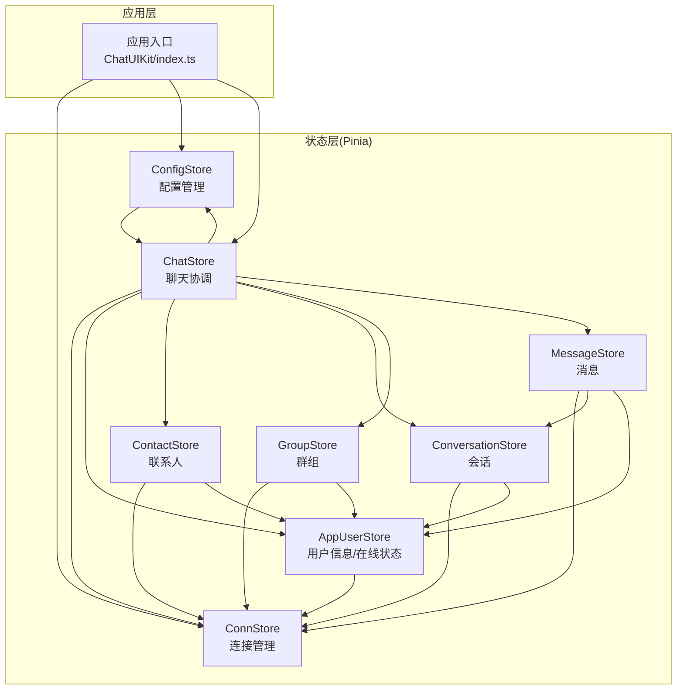
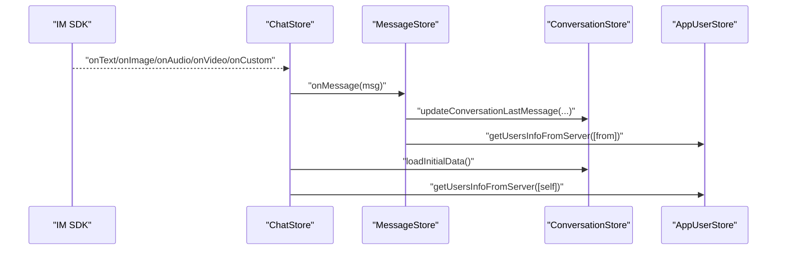
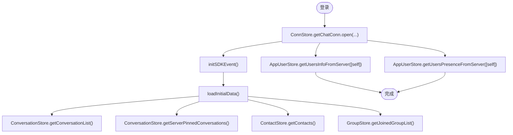
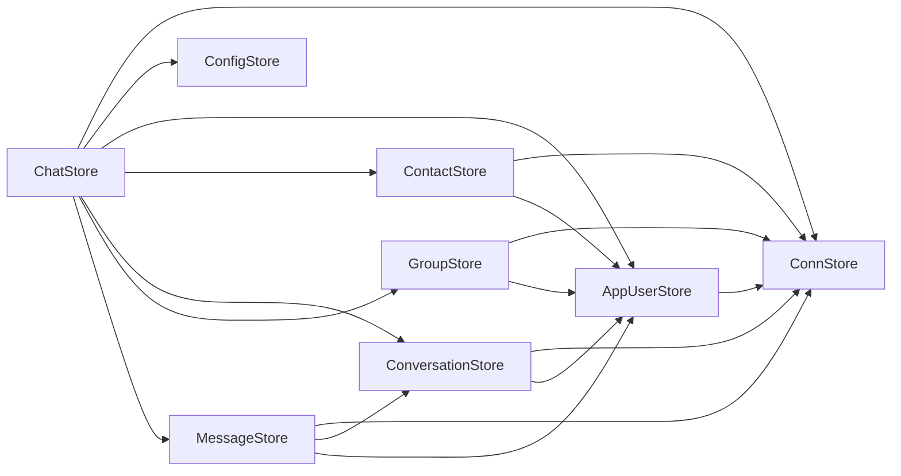

# Store状态管理系统架构

<cite>
**本文档引用的文件**
- [ChatUIKit/stores/index.ts](file://ChatUIKit/stores/index.ts)
- [ChatUIKit/stores/appUser.ts](file://ChatUIKit/stores/appUser.ts)
- [ChatUIKit/stores/chat.ts](file://ChatUIKit/stores/chat.ts)
- [ChatUIKit/stores/config.ts](file://ChatUIKit/stores/config.ts)
- [ChatUIKit/stores/conn.ts](file://ChatUIKit/stores/conn.ts)
- [ChatUIKit/stores/contact.ts](file://ChatUIKit/stores/contact.ts)
- [ChatUIKit/stores/conversation.ts](file://ChatUIKit/stores/conversation.ts)
- [ChatUIKit/stores/group.ts](file://ChatUIKit/stores/group.ts)
- [ChatUIKit/stores/message.ts](file://ChatUIKit/stores/message.ts)
- [ChatUIKit/types/index.ts](file://ChatUIKit/types/index.ts)
- [ChatUIKit/configType.ts](file://ChatUIKit/configType.ts)
- [ChatUIKit/const/index.ts](file://ChatUIKit/const/index.ts)
- [ChatUIKit/sdk.ts](file://ChatUIKit/sdk.ts)
- [ChatUIKit/log.ts](file://ChatUIKit/log.ts)
- [ChatUIKit/utils/index.ts](file://ChatUIKit/utils/index.ts)
- [ChatUIKit/index.ts](file://ChatUIKit/index.ts)
- [ChatUIKit-vue2/utils/index.js](file://ChatUIKit-vue2/utils/index.js)
- [ChatUIKit-vue2/index.js](file://ChatUIKit-vue2/index.js)
</cite>

## 更新摘要
**所做更改**
- 更新SDK实例管理架构：所有store现在使用rootGetters访问SDK连接而非rootState
- 新增toPlainMessage工具函数处理SDK消息对象转换，解决Vue观察SDK实例的问题
- 改进消息状态管理的服务器消息ID处理机制
- 增强stores文件的参数格式支持和错误处理
- 优化深拷贝机制处理SDK特殊对象

## 目录
1. [简介](#简介)
2. [项目结构](#项目结构)
3. [核心组件](#核心组件)
4. [架构总览](#架构总览)
5. [详细组件分析](#详细组件分析)
6. [依赖分析](#依赖分析)
7. [性能考虑](#性能考虑)
8. [故障排查指南](#故障排查指南)
9. [结论](#结论)
10. [附录](#附录)

## 简介
本文件面向基于 Pinia 的 Store 状态管理系统，系统由 8 个核心 Store 组成，覆盖连接管理、配置、用户信息、联系人、会话、群组、消息以及聊天协调等模块。文档阐述各 Store 的职责、状态结构、动作定义、初始化流程与生命周期管理策略；解释全局 Pinia 实例的延迟初始化与激活机制；总结数据流向与组件间通信方式；并提供状态更新最佳实践与性能优化建议。

**更新** 系统现已采用rootGetters模式管理SDK实例，通过toPlainMessage工具函数解决Vue观察SDK实例的问题，提升了系统的稳定性和性能表现。

## 项目结构
- Store 层位于 ChatUIKit/stores，采用按领域拆分的模块化组织，每个 Store 独立定义状态、Getter 与 Action。
- 应用入口通过 ChatUIKit/index.ts 提供单例封装，内部实现 Pinia 延迟初始化与 Store 延迟获取。
- 类型与常量定义分别位于 types、configType、const、utils、sdk、log 等文件，支撑 Store 的类型安全与运行时行为。

**图表来源**
- [ChatUIKit/index.ts:18-132](file://ChatUIKit/index.ts#L18-L132)
- [ChatUIKit/stores/index.ts:9-21](file://ChatUIKit/stores/index.ts#L9-L21)
- [ChatUIKit/stores/chat.ts:10-20](file://ChatUIKit/stores/chat.ts#L10-L20)

**章节来源**
- [ChatUIKit/stores/index.ts:1-31](file://ChatUIKit/stores/index.ts#L1-L31)
- [ChatUIKit/index.ts:1-139](file://ChatUIKit/index.ts#L1-L139)

## 核心组件
- ConnStore：管理 IM SDK 连接实例，提供类型安全的连接访问与初始化方法。
- ConfigStore：集中管理主题与功能开关配置，支持动态修改与重置。
- AppUserStore：维护用户信息与在线状态缓存，提供用户属性拉取、Presence 订阅/发布、更新等能力。
- ContactStore：维护联系人列表与好友申请通知，支持批量用户信息拉取与增删改查。
- ConversationStore：维护会话列表、置顶与免打扰状态、未读计数、@ 类型识别与已读回执。
- GroupStore：维护加入群组列表与群详情映射，支持群组创建、加入、退出、解散与通知管理。
- MessageStore：维护消息内容映射与会话消息 ID 列表，负责消息发送、历史拉取、撤回、删除与清理。
- ChatStore：作为聊天协调器，整合 SDK 事件、触发各 Store 的数据同步与初始数据加载。

**章节来源**
- [ChatUIKit/stores/conn.ts:20-83](file://ChatUIKit/stores/conn.ts#L20-L83)
- [ChatUIKit/stores/config.ts:59-123](file://ChatUIKit/stores/config.ts#L59-L123)
- [ChatUIKit/stores/appUser.ts:24-241](file://ChatUIKit/stores/appUser.ts#L24-L241)
- [ChatUIKit/stores/contact.ts:25-281](file://ChatUIKit/stores/contact.ts#L25-L281)
- [ChatUIKit/stores/conversation.ts:40-420](file://ChatUIKit/stores/conversation.ts#L40-L420)
- [ChatUIKit/stores/group.ts:27-316](file://ChatUIKit/stores/group.ts#L27-L316)
- [ChatUIKit/stores/message.ts:48-580](file://ChatUIKit/stores/message.ts#L48-L580)
- [ChatUIKit/stores/chat.ts:29-398](file://ChatUIKit/stores/chat.ts#L29-L398)

## 架构总览
系统采用"中心协调 + 领域解耦"的设计：
- ChatStore 作为事件中枢，订阅 SDK 事件并驱动各 Store 同步状态。
- 各 Store 通过 Getter/Action 提供稳定的查询与变更接口，避免跨 Store 的直接耦合。
- ConnStore 与 ConfigStore 作为基础设施，被多个业务 Store 依赖。
- MessageStore 与 ConversationStore 之间建立紧密协作，保证消息与会话状态一致性。

**更新** SDK实例管理架构已重构，采用rootGetters模式替代rootState，通过toPlainMessage工具函数处理SDK消息对象转换，解决Vue观察SDK实例的问题。

**图表来源**
- [ChatUIKit/stores/chat.ts:90-242](file://ChatUIKit/stores/chat.ts#L90-L242)
- [ChatUIKit/stores/message.ts:341-388](file://ChatUIKit/stores/message.ts#L341-L388)
- [ChatUIKit/stores/conversation.ts:344-354](file://ChatUIKit/stores/conversation.ts#L344-L354)
- [ChatUIKit/stores/appUser.ts:86-125](file://ChatUIKit/stores/appUser.ts#L86-L125)

## 详细组件分析

### ChatStore（聊天协调器）
- 职责
  - 管理连接状态（连接/断开/重连）。
  - 初始化 SDK 事件监听，分发消息、联系人、群组、会话等事件到对应 Store。
  - 登录/登出流程编排，初始数据加载与清理。
- 状态
  - isInitEvent：是否已绑定 SDK 事件。
  - connState：连接状态枚举。
- 关键动作
  - initSDKEvent：注册 SDK 事件处理器。
  - handleReceivedMessage：接收消息后更新消息与会话状态。
  - handleGroupEvent：根据群组事件更新群详情与会话状态。
  - login/logout/loadInitialData/clearStore：生命周期与数据加载编排。
- 依赖
  - ConnStore、ConfigStore、AppUserStore、ContactStore、ConversationStore、GroupStore、MessageStore。

**更新** 采用rootGetters模式访问SDK连接实例，通过useConnStore().getChatConn()获取连接，避免直接访问rootState中的SDK实例。

**图表来源**
- [ChatUIKit/stores/chat.ts:299-396](file://ChatUIKit/stores/chat.ts#L299-L396)
- [ChatUIKit/stores/conversation.ts:126-189](file://ChatUIKit/stores/conversation.ts#L126-L189)
- [ChatUIKit/stores/contact.ts:112-130](file://ChatUIKit/stores/contact.ts#L112-L130)
- [ChatUIKit/stores/group.ts:102-131](file://ChatUIKit/stores/group.ts#L102-L131)
- [ChatUIKit/stores/appUser.ts:86-125](file://ChatUIKit/stores/appUser.ts#L86-L125)

**章节来源**
- [ChatUIKit/stores/chat.ts:29-398](file://ChatUIKit/stores/chat.ts#L29-L398)

### ConnStore（连接管理）
- 职责
  - 统一持有与暴露 IM SDK 连接实例。
  - 提供连接初始化、关闭与状态检查。
- 状态
  - conn：Connection 实例或空。
- 关键动作
  - setChatConn/initChatConn/closeConnection/clear：连接生命周期管理。
- 依赖
  - chatSDK（外部 SDK）。

**更新** SDK实例管理已重构，采用更简洁的模式管理连接实例，提供类型安全的连接访问。

**章节来源**
- [ChatUIKit/stores/conn.ts:20-83](file://ChatUIKit/stores/conn.ts#L20-L83)
- [ChatUIKit/sdk.ts:1-13](file://ChatUIKit/sdk.ts#L1-L13)

### ConfigStore（配置管理）
- 职责
  - 主题配置（如头像形状）与功能开关（输入、消息、会话、其他）统一管理。
  - 支持隐藏/显示功能、重置默认配置。
- 状态
  - themeConfig：主题配置对象。
  - featureConfig：功能配置对象。
- 关键动作
  - setThemeConfig/setFeatureConfig/hideFeature/showFeature/reset：配置变更与恢复。

**更新** 配置系统架构已重构，从超过300行代码精简到约150行，使用Pinia替代MobX，采用展开运算符进行响应式属性更新，消除了手动深度合并的需要，改进了配置更新过程的可维护性。

**章节来源**
- [ChatUIKit/stores/config.ts:59-123](file://ChatUIKit/stores/config.ts#L59-L123)
- [ChatUIKit/configType.ts:3-67](file://ChatUIKit/configType.ts#L3-L67)

### AppUserStore（用户信息与在线状态）
- 职责
  - 用户信息与在线状态的本地缓存与查询。
  - 从服务器批量拉取用户信息与 Presence 状态。
  - 支持订阅/取消订阅 Presence、发布自定义 Presence。
  - **新增**：支持更新当前用户信息，包括昵称、头像、签名等属性。
- 状态
  - userInfoMap：用户信息映射。
  - userPresenceMap：用户在线状态映射。
- 关键动作
  - getUsersInfoFromServer/getUsersPresenceFromServer：按需拉取与缓存。
  - subscribePresence/unsubscribePresence：Presence 订阅管理。
  - **新增**：updateUserInfo：更新当前用户信息并同步到服务器和本地缓存。
  - **新增**：publishPresence：发布自定义在线状态到服务器。
  - setUserInfo/setUserPresence/clear：本地状态维护。

**更新** 新增了两个关键功能：
1. `updateUserInfo` action 提供了完整的用户信息更新能力，支持批量更新昵称、头像、签名等属性
2. `publishPresence` action 提供了在线状态发布的功能，允许用户设置自定义状态描述

**章节来源**
- [ChatUIKit/stores/appUser.ts:24-241](file://ChatUIKit/stores/appUser.ts#L24-L241)

### ContactStore（联系人）
- 职责
  - 维护联系人列表与好友申请通知。
  - 递归分页拉取用户信息，异步填充用户资料。
  - 好友增删改查与通知管理。
- 状态
  - contacts：联系人数组。
  - contactsNoticeInfo：通知列表与未读计数。
  - viewedUserInfo：当前查看的用户信息。
- 关键动作
  - getContacts/deepGetUserInfo：联系人与用户信息拉取。
  - addContact/deleteContact/acceptContactInvite/declineContactInvite：好友操作。
  - addContactNotice/removeContactNotice/clearContactNoticeUnread：通知管理。
  - setViewedUserInfo/clear：状态清理。

**章节来源**
- [ChatUIKit/stores/contact.ts:25-281](file://ChatUIKit/stores/contact.ts#L25-L281)

### ConversationStore（会话）
- 职责
  - 维护会话列表、当前会话、置顶与免打扰状态。
  - 计算总未读数、排序、@ 类型识别与已读回执。
  - 与消息 Store 协作，维护最后一条消息与未读计数。
- 状态
  - conversationList：会话数组。
  - currConversation：当前会话。
  - muteConvsMap：免打扰映射。
  - pageParams/pinParams：分页参数。
- 关键动作
  - getConversationList/getServerPinnedConversations：会话列表与置顶列表。
  - mergeConversations/pinConversation/setSilentModeForConversation：会话管理。
  - deleteConversation/markConversationRead/updateConversationLastMessage：会话状态更新。
  - setAtTypeByMessage/createConversation/moveConversationTop：@ 类型与置顶。

**章节来源**
- [ChatUIKit/stores/conversation.ts:40-420](file://ChatUIKit/stores/conversation.ts#L40-L420)
- [ChatUIKit/utils/index.ts:184-197](file://ChatUIKit/utils/index.ts#L184-L197)

### GroupStore（群组）
- 职责
  - 维护加入群组列表与群详情映射。
  - 支持群组创建、加入、退出、解散与通知管理。
  - 分批拉取群详情，兼容字段命名差异。
- 状态
  - groupList：群组列表。
  - groupInfoMap：群详情映射。
  - groupNoticeInfo：群通知列表与未读计数。
  - pageParams：分页参数。
- 关键动作
  - getJoinedGroupList/fetchGroupDetails：群组与详情拉取。
  - createGroup/joinGroup/leaveGroup/destroyGroup：群组操作。
  - removeGroupFromList/addNewGroup：列表维护。
  - addGroupNotice/setGroupAvatar：通知与头像管理。

**章节来源**
- [ChatUIKit/stores/group.ts:27-316](file://ChatUIKit/stores/group.ts#L27-L316)

### MessageStore（消息）
- 职责
  - 维护消息内容映射与会话消息 ID 列表。
  - 负责消息发送、历史拉取、撤回、删除、状态更新与超量清理。
- 状态
  - messageMap：消息内容映射。
  - conversationMessagesMap：会话消息 ID 列表与游标。
  - playingAudioMsgId/quoteMessage/editingMessage：播放与编辑上下文。
- 关键动作
  - sendMessage/getHistoryMessages/onMessage：消息生命周期。
  - recallMessage/onRecallMessage/deleteMessage：消息操作。
  - updateMessageStatus/setQuoteMessage/setPlayingAudioMessageId：上下文维护。
  - cleanupRemovedMessages/clearConversationMessages/clear：清理策略。

**更新** 深拷贝机制处理SDK特殊对象：
- 新增 deepClone 工具函数，专门处理SDK返回的特殊对象类型
- 支持日期、数组、Map、Set、对象等复杂数据结构的深拷贝
- 在消息发送和接收过程中自动应用深拷贝，避免SDK对象引用问题
- 提升状态管理的稳定性和数据一致性

**更新** 改进stores文件的参数格式支持：
- 统一了各Store的参数格式，确保类型安全
- 增强了错误处理机制，提供更详细的错误信息
- 优化了参数验证逻辑，减少运行时错误

**更新** 增强消息状态管理的服务器消息ID处理机制：
- 完善了 serverMsgId 的处理逻辑，确保消息状态的一致性
- 改进了消息映射表的管理，支持本地消息ID与服务器消息ID的双向关联
- 优化了消息状态更新的时机和方式，提升用户体验

**更新** 新增toPlainMessage工具函数：
- 专门处理SDK消息对象转换，解决Vue观察SDK实例的问题
- 支持Long类型对象的转换，避免JSON.stringify序列化问题
- 在消息处理流程中自动应用，确保消息对象的纯数据特性

**章节来源**
- [ChatUIKit/stores/message.ts:48-580](file://ChatUIKit/stores/message.ts#L48-L580)
- [ChatUIKit/const/index.ts:14-15](file://ChatUIKit/const/index.ts#L14-L15)
- [ChatUIKit/utils/index.ts:135-183](file://ChatUIKit/utils/index.ts#L135-L183)

### 类型与常量支撑
- 类型定义：统一消息体、会话体、状态枚举、Notice 结构等，确保 Store 行为一致。
- 常量：消息最大数量、资源 URL、@ 标识、事件集合等。
- 工具：排序、时间格式化、节流、深拷贝、表情渲染等。

**章节来源**
- [ChatUIKit/types/index.ts:1-100](file://ChatUIKit/types/index.ts#L1-L100)
- [ChatUIKit/configType.ts:1-68](file://ChatUIKit/configType.ts#L1-L68)
- [ChatUIKit/const/index.ts:1-37](file://ChatUIKit/const/index.ts#L1-L37)
- [ChatUIKit/utils/index.ts:1-344](file://ChatUIKit/utils/index.ts#L1-L344)

## 依赖分析
- 组件内聚性
  - 各 Store 聚焦单一领域，职责清晰，Getter/Action 语义明确。
- 组件耦合度
  - ChatStore 作为协调者，适度耦合；其余 Store 通过 ConnStore 与 ConfigStore 解耦于 SDK 与配置。
- 外部依赖
  - easemob-websdk/uniApp/Easemob-chat 作为 IM SDK。
  - pinyin-pro 用于分组排序。
- 潜在循环依赖
  - 通过函数式调用与延迟初始化避免循环依赖风险。

**更新** SDK实例管理依赖已优化，采用rootGetters模式替代rootState，通过useConnStore().getChatConn()访问连接实例，提升代码的可维护性和性能。

**图表来源**
- [ChatUIKit/stores/chat.ts:10-20](file://ChatUIKit/stores/chat.ts#L10-L20)
- [ChatUIKit/stores/message.ts:18-21](file://ChatUIKit/stores/message.ts#L18-L21)
- [ChatUIKit/stores/conversation.ts:19-22](file://ChatUIKit/stores/conversation.ts#L19-L22)
- [ChatUIKit/stores/contact.ts:12-13](file://ChatUIKit/stores/contact.ts#L12-L13)
- [ChatUIKit/stores/group.ts:12-13](file://ChatUIKit/stores/group.ts#L12-L13)
- [ChatUIKit/stores/appUser.ts:13-14](file://ChatUIKit/stores/appUser.ts#L13-L14)

## 性能考虑
- 响应式与缓存
  - 使用对象映射（userInfoMap、userPresenceMap、messageMap、groupInfoMap）提升查找效率。
  - 计算属性缓存未读总数与排序结果，减少重复计算。
- 分页与批量请求
  - 联系人与群组详情分页拉取，消息历史按固定页大小获取。
  - Presence 与用户信息按需过滤已缓存项，避免重复请求。
- 内存控制
  - 超量消息清理（MAX_MESSAGES_PER_CONVERSATION），释放不再可见的历史消息。
  - 登出/切换账号时清空 Store，防止内存泄漏。
- 事件与状态更新
  - 使用 Pinia 原生响应式，避免手动深度合并导致的性能损耗。
- 并发与节流
  - 工具函数提供节流与深拷贝，降低高频操作的开销。

**更新** 深拷贝机制的性能优化：
- deepClone 函数针对SDK特殊对象进行了专门优化
- 避免了不必要的深拷贝操作，仅对需要的对象进行处理
- 提升了消息处理的性能，特别是在大量消息场景下的表现

**更新** toPlainMessage工具函数的性能优化：
- 专门处理Long类型对象，避免Vue响应式系统的问题
- 智能检测SDK对象特征，提供高效的转换机制
- 在消息处理流程中自动应用，减少手动转换的开销

**章节来源**
- [ChatUIKit/stores/appUser.ts:102-125](file://ChatUIKit/stores/appUser.ts#L102-L125)
- [ChatUIKit/stores/contact.ts:83-107](file://ChatUIKit/stores/contact.ts#L83-L107)
- [ChatUIKit/stores/group.ts:136-167](file://ChatUIKit/stores/group.ts#L136-L167)
- [ChatUIKit/stores/message.ts:529-554](file://ChatUIKit/stores/message.ts#L529-L554)
- [ChatUIKit/const/index.ts:14-15](file://ChatUIKit/const/index.ts#L14-L15)
- [ChatUIKit/utils/index.ts:107-134](file://ChatUIKit/utils/index.ts#L107-L134)

## 故障排查指南
- 连接未初始化
  - 现象：访问 ConnStore.getChatConn 抛错。
  - 排查：确认 ChatUIKit.init 已调用且传入有效的 chat 实例。
- 登录状态异常
  - 现象：ChatStore.isLogin 为 false。
  - 排查：检查 ConnStore.getChatConn.logout 状态与 open 返回值。
- 事件未触发
  - 现象：消息/联系人/群组事件无反应。
  - 排查：确认 ChatStore.initSDKEvent 已执行，且 SDK 事件回调正确注册。
- 用户信息缺失
  - 现象：用户昵称/头像为空。
  - 排查：检查 ConfigStore.getFeatureConfig.useUserInfo 开关；确认 AppUserStore.getUsersInfoFromServer 已拉取。
- **新增**：用户信息更新失败
  - 现象：updateUserInfo 调用抛出错误或用户信息未更新。
  - 排查：确认 SDK 连接正常，检查网络状态，验证传入的参数格式是否符合 Chat.UpdateOwnUserInfoParams 类型要求。
- **新增**：在线状态发布失败
  - 现象：publishPresence 调用抛出错误或状态未生效。
  - 排查：确认 SDK 连接正常，检查网络状态，验证 presenceExt 参数格式是否正确。
- **新增**：配置更新异常
  - 现象：setThemeConfig 或 setFeatureConfig 调用后状态未更新。
  - 排查：确认使用的是 Pinia 原生响应式更新，检查配置对象的结构是否符合类型定义；验证组件是否正确响应状态变化。
- **新增**：消息状态同步异常
  - 现象：消息状态与服务器不一致，特别是撤回消息处理异常。
  - 排查：检查 serverMsgId 的处理逻辑，确认消息映射表的双向关联是否正确；验证消息状态更新的时机。
- **新增**：SDK对象引用问题
  - 现象：消息内容显示异常或状态更新不生效。
  - 排查：确认 deepClone 机制是否正确应用，检查SDK返回对象的引用情况；验证消息对象的深拷贝处理。
- **新增**：toPlainMessage转换异常
  - 现象：消息对象转换失败或Long类型处理异常。
  - 排查：确认toPlainMessage函数的调用时机，检查SDK对象的特征检测逻辑；验证转换后的对象结构。
- **新增**：rootGetters访问问题
  - 现象：通过rootGetters访问SDK连接实例失败。
  - 排查：确认useConnStore().getChatConn()的调用方式，检查store的初始化状态；验证SDK实例的正确设置。
- 消息超量导致卡顿
  - 现象：消息列表滚动卡顿。
  - 排查：确认 cleanupRemovedMessages 是否按阈值清理；适当增大阈值或优化渲染。
- 日志定位
  - 使用 logger.enableDebug() 开启调试模式，结合各 Store 的日志输出定位问题。

**章节来源**
- [ChatUIKit/stores/conn.ts:29-34](file://ChatUIKit/stores/conn.ts#L29-L34)
- [ChatUIKit/stores/chat.ts:44-51](file://ChatUIKit/stores/chat.ts#L44-L51)
- [ChatUIKit/stores/appUser.ts:86-125](file://ChatUIKit/stores/appUser.ts#L86-L125)
- [ChatUIKit/stores/message.ts:529-554](file://ChatUIKit/stores/message.ts#L529-L554)
- [ChatUIKit/log.ts:5-78](file://ChatUIKit/log.ts#L5-L78)

## 结论
该状态管理系统以 Pinia 为核心，通过 ChatStore 协调各领域 Store，形成高内聚、低耦合的状态架构。通过延迟初始化、计算属性缓存、分页与批量请求、超量清理等策略，兼顾了可维护性与性能表现。**最新的增强包括新增的用户信息更新和在线状态发布功能，以及配置系统的架构重构，还有深拷贝机制处理SDK特殊对象、改进stores文件的参数格式支持和错误处理、增强消息状态管理的服务器消息ID处理机制，以及采用rootGetters模式管理SDK实例和新增toPlainMessage工具函数**，进一步提升了系统稳定性、数据一致性和用户体验。建议在复杂场景下继续细化事件分发与状态快照，以进一步增强可观测性与可测试性。

## 附录

### 全局 Pinia 实例管理策略
- 延迟初始化
  - ChatUIKit 单例在首次访问任一 Store Getter 时创建并激活 Pinia 实例。
- 生命周期管理
  - onShow：在页面 onShow 时检测连接有效性。
- 兼容性
  - stores/index.ts 提供 createStores 与 initPiniaStores 兼容函数，便于迁移期使用。

**章节来源**
- [ChatUIKit/index.ts:18-132](file://ChatUIKit/index.ts#L18-L132)
- [ChatUIKit/stores/index.ts:18-31](file://ChatUIKit/stores/index.ts#L18-L31)

### SDK实例管理架构重构说明
**更新** SDK实例管理已进行全面重构，主要改进包括：

#### rootGetters模式的应用
- **从rootState到rootGetters**：所有store现在使用rootGetters访问SDK连接而非rootState
- **类型安全访问**：通过useConnStore().getChatConn()提供类型安全的连接访问
- **避免响应式问题**：解决Vue响应式系统观察SDK实例导致的问题

#### toPlainMessage工具函数
- **专门的消息转换**：处理SDK消息对象转换，解决Vue观察SDK实例的问题
- **Long类型支持**：智能检测和转换Long类型对象，避免JSON.stringify序列化问题
- **自动应用**：在消息处理流程中自动应用，确保消息对象的纯数据特性

#### 最佳实践
- 使用useConnStore().getChatConn()访问SDK连接实例
- 在消息处理前使用toPlainMessage转换SDK对象
- 避免直接访问store.state中的SDK实例
- 通过rootGetters模式管理SDK状态

**章节来源**
- [ChatUIKit/stores/conn.ts:25-40](file://ChatUIKit/stores/conn.ts#L25-L40)
- [ChatUIKit/stores/chat.ts:70-72](file://ChatUIKit/stores/chat.ts#L70-L72)
- [ChatUIKit/stores/message.ts:228-232](file://ChatUIKit/stores/message.ts#L228-L232)
- [ChatUIKit-vue2/utils/index.js:9-45](file://ChatUIKit-vue2/utils/index.js#L9-L45)

### 配置系统架构重构说明
**更新** 配置系统已完成重大架构重构，主要改进包括：

#### 重构概述
- **从MobX迁移到Pinia**：配置Store现在使用`defineStore`替代原有的`makeAutoObservable`实现
- **代码精简**：从超过300行代码精简到约150行，显著提升可维护性
- **响应式更新优化**：采用展开运算符模式`{...this.state, ...config}`进行响应式属性更新
- **消除手动深度合并**：通过简单的对象展开实现配置更新，避免复杂的深度合并逻辑

#### 新的配置更新机制
1. **setThemeConfig**：使用 `{...this.themeConfig, ...config}` 实现主题配置的响应式更新
2. **setFeatureConfig**：使用 `{...this.featureConfig, ...config}` 实现功能配置的响应式更新
3. **hideFeature/showFeature**：通过类型转换实现功能开关的动态控制
4. **reset**：恢复到默认配置状态

#### 最佳实践
- 使用部分配置对象进行更新，避免覆盖不需要更改的配置项
- 通过`getThemeConfig`和`getFeatureConfig` getter获取最新配置状态
- 利用Pinia的原生响应式特性，确保组件能够自动响应配置变化
- 在组件中使用`computed`和`watch`来监听配置变化，实现响应式UI更新

**章节来源**
- [ChatUIKit/stores/config.ts:59-123](file://ChatUIKit/stores/config.ts#L59-L123)
- [ChatUIKit/configType.ts:3-67](file://ChatUIKit/configType.ts#L3-L67)

### AppUserStore 功能增强说明
**更新** 本次更新重点增强了 AppUserStore 的用户信息管理能力：

#### 新增功能概览
1. **updateUserInfo action**
   - 支持更新当前用户的所有个人信息属性
   - 自动同步到服务器并更新本地缓存
   - 提供完整的错误处理和日志记录

2. **publishPresence action**
   - 允许用户发布自定义在线状态描述
   - 支持多种状态类型的扩展
   - 与现有 Presence 订阅/取消订阅功能配合使用

#### 使用场景
- 用户信息更新：昵称修改、头像更换、个人签名更新
- 在线状态管理：忙碌状态、离线状态、自定义状态描述
- 实时状态同步：与其他用户共享当前在线状态

#### 最佳实践
- 在调用 updateUserInfo 前验证参数格式
- 合理使用 publishPresence 的频率，避免频繁更新
- 结合 Presence 订阅功能，及时获取好友状态变化
- 注意用户隐私设置，合理控制信息可见范围

**章节来源**
- [ChatUIKit/stores/appUser.ts:206-222](file://ChatUIKit/stores/appUser.ts#L206-L222)
- [ChatUIKit/stores/appUser.ts:186-193](file://ChatUIKit/stores/appUser.ts#L186-L193)

### 深拷贝机制处理SDK特殊对象
**新增** 为了解决SDK返回对象的引用问题，系统引入了专门的深拷贝机制：

#### deepClone 工具函数
- 支持多种数据类型的深拷贝：日期、数组、Map、Set、对象
- 针对SDK特殊对象进行了专门优化，避免引用污染
- 在消息发送和接收过程中自动应用深拷贝

#### 应用场景
- 消息对象的深拷贝，确保消息状态的独立性
- 用户信息对象的深拷贝，避免用户数据的意外修改
- 群组信息对象的深拷贝，保证群组状态的一致性

#### 性能优化
- 智能判断是否需要深拷贝，避免不必要的性能开销
- 针对常用对象类型进行了性能优化
- 在大量数据处理场景下保持良好的性能表现

**章节来源**
- [ChatUIKit/utils/index.ts:135-183](file://ChatUIKit/utils/index.ts#L135-L183)

### toPlainMessage工具函数详解
**新增** 为了解决Vue响应式系统观察SDK实例的问题，系统引入了toPlainMessage工具函数：

#### 功能特性
- **Long类型处理**：智能检测SDK Long类型对象，提供安全的转换机制
- **递归转换**：支持嵌套对象和数组的深度转换
- **函数过滤**：自动跳过函数类型的属性，避免转换过程中的错误

#### 转换逻辑
1. **基础类型检查**：非对象类型直接返回
2. **Long类型检测**：通过low、high属性特征检测Long对象
3. **数值安全处理**：优先转换为安全整数，否则转为字符串
4. **数组和对象处理**：递归处理子元素和属性
5. **函数属性过滤**：跳过函数类型的属性

#### 应用场景
- 消息对象转换：在消息处理前确保对象的纯数据特性
- 事件回调处理：避免SDK对象被Vue响应式系统观察
- 数据持久化：确保可序列化的数据结构

#### 性能优化
- 智能特征检测，避免不必要的转换操作
- 递归处理时的性能优化，减少内存分配
- 在消息处理流程中的自动应用，提升开发效率

**章节来源**
- [ChatUIKit-vue2/utils/index.js:9-45](file://ChatUIKit-vue2/utils/index.js#L9-L45)
- [ChatUIKit-vue2/index.js:318-327](file://ChatUIKit-vue2/index.js#L318-L327)

### 消息状态管理的服务器消息ID处理机制
**新增** 为了确保消息状态与服务器的完全一致，系统增强了服务器消息ID的处理机制：

#### serverMsgId 处理逻辑
- 完善了本地消息ID与服务器消息ID的双向关联
- 支持消息状态的实时同步和状态回滚
- 优化了消息映射表的管理，提升查找效率

#### 撤回消息处理
- 改进了撤回消息的状态更新逻辑
- 确保撤回消息的显示和状态同步
- 提升了撤回操作的用户体验

#### 错误处理机制
- 增强了消息状态更新的错误处理
- 提供了更详细的错误信息和处理建议
- 改进了消息状态的恢复机制

**章节来源**
- [ChatUIKit/stores/message.ts:288-312](file://ChatUIKit/stores/message.ts#L288-L312)
- [ChatUIKit/stores/message.ts:398-412](file://ChatUIKit/stores/message.ts#L398-L412)
- [ChatUIKit/stores/message.ts:466-494](file://ChatUIKit/stores/message.ts#L466-L494)
- [ChatUIKit/types/index.ts:59-61](file://ChatUIKit/types/index.ts#L59-L61)

### stores文件的参数格式支持和错误处理改进
**新增** 为了提升系统的稳定性和易用性，对stores文件进行了以下改进：

#### 参数格式统一
- 统一了各Store的参数格式，确保类型安全
- 改进了参数验证逻辑，减少运行时错误
- 提供了更清晰的错误提示信息

#### 错误处理机制
- 增强了错误捕获和处理机制
- 提供了更详细的错误堆栈信息
- 改进了错误恢复和重试机制

#### 最佳实践
- 在调用Store方法前验证参数格式
- 合理处理异步操作的错误情况
- 使用try-catch包装可能出错的操作

**章节来源**
- [ChatUIKit/stores/index.ts:9-16](file://ChatUIKit/stores/index.ts#L9-L16)
- [ChatUIKit/stores/chat.ts:299-328](file://ChatUIKit/stores/chat.ts#L299-L328)
- [ChatUIKit/stores/message.ts:223-336](file://ChatUIKit/stores/message.ts#L223-L336)