<docs>
# 会话状态管理

<cite>
**本文档引用的文件**
- [conversation.ts](file://ChatUIKit/stores/conversation.ts)
- [message.ts](file://ChatUIKit/stores/message.ts)
- [conn.ts](file://ChatUIKit/stores/conn.ts)
- [appUser.ts](file://ChatUIKit/stores/appUser.ts)
- [sdk.ts](file://ChatUIKit/sdk.ts)
- [index.ts](file://ChatUIKit/stores/index.ts)
- [index.vue](file://ChatUIKit/modules/Conversation/index.vue)
- [ConversationList/index.vue](file://ChatUIKit/modules/Conversation/components/ConversationList/index.vue)
- [ConversationItem/index.vue](file://ChatUIKit/modules/Conversation/components/ConversationItem/index.vue)
- [ConversationSearchList/index.vue](file://ChatUIKit/modules/ConversationSearchList/index.vue)
- [index.ts](file://ChatUIKit/utils/index.ts)
- [index.ts](file://ChatUIKit/types/index.ts)
- [index.ts](file://ChatUIKit/const/index.ts)
</cite>

## 更新摘要
**变更内容**
- 新增防重机制（5秒间隔限制）和总未读数重新计算功能
- 改进会话列表获取的性能和可靠性
- 优化会话状态管理的稳定性和用户体验
- 增强SDK兼容性和错误处理机制

## 目录
1. [简介](#简介)
2. [项目结构](#项目结构)
3. [核心组件](#核心组件)
4. [架构概览](#架构概览)
5. [详细组件分析](#详细组件分析)
6. [依赖关系分析](#依赖关系分析)
7. [性能考虑](#性能考虑)
8. [故障排查指南](#故障排查指南)
9. [结论](#结论)

## 简介
本文件系统性地文档化了会话状态管理Store的设计与实现，重点覆盖以下方面：
- 会话列表的管理机制：排序、置顶状态、免打扰设置
- 会话状态的数据结构、会话项属性与状态转换规则
- 会话搜索、过滤与分页加载机制
- 会话状态与消息状态的关联关系与数据一致性保障
- 性能优化策略与用户体验改进建议
- **新增**：防重机制（5秒间隔限制）和总未读数重新计算功能

## 项目结构
会话状态管理位于ChatUIKit/stores目录下，采用Pinia进行状态管理，并通过Vue组件进行消费。核心文件包括：
- 会话Store：stores/conversation.ts
- 消息Store：stores/message.ts
- 连接Store：stores/conn.ts
- 用户信息Store：stores/appUser.ts
- SDK封装：sdk.ts
- 会话页面：modules/Conversation/*
- 会话搜索页面：modules/ConversationSearchList/index.vue
- 工具函数：utils/index.ts（含排序算法、防重机制）
- 类型定义：types/index.ts
- 常量定义：const/index.ts

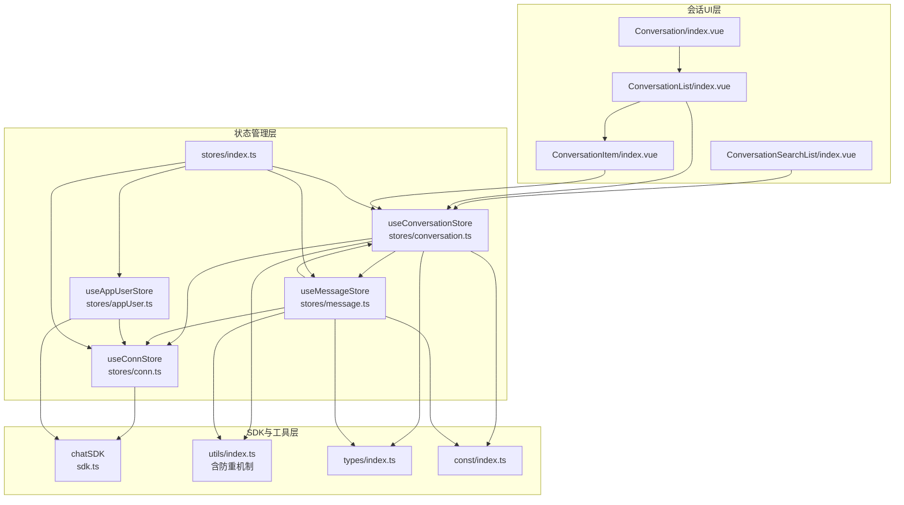

**图表来源**
- [index.vue](file://ChatUIKit/modules/Conversation/index.vue#L1-L12)
- [ConversationList/index.vue](file://ChatUIKit/modules/Conversation/components/ConversationList/index.vue#L1-L158)
- [ConversationItem/index.vue](file://ChatUIKit/modules/Conversation/components/ConversationItem/index.vue#L1-L260)
- [ConversationSearchList/index.vue](file://ChatUIKit/modules/ConversationSearchList/index.vue#L1-L121)
- [conversation.ts](file://ChatUIKit/stores/conversation.ts#L1-L421)
- [message.ts](file://ChatUIKit/stores/message.ts#L1-L581)
- [conn.ts](file://ChatUIKit/stores/conn.ts#L1-L84)
- [appUser.ts](file://ChatUIKit/stores/appUser.ts#L1-L242)
- [sdk.ts](file://ChatUIKit/sdk.ts#L1-L13)
- [index.ts](file://ChatUIKit/stores/index.ts#L1-L31)
- [index.ts](file://ChatUIKit/utils/index.ts#L1-L344)
- [index.ts](file://ChatUIKit/types/index.ts#L1-L100)
- [index.ts](file://ChatUIKit/const/index.ts#L1-L37)

## 核心组件
- 会话Store（useConversationStore）：负责会话列表、置顶、免打扰、删除、标记已读、@类型识别、分页参数等。
- 消息Store（useMessageStore）：负责消息内容映射、会话消息ID列表、历史消息拉取、消息状态管理、清理超量消息等。
- 连接Store（useConnStore）：负责IM连接实例管理，提供类型安全的连接访问。
- 用户信息Store（useAppUserStore）：负责用户信息缓存、在线状态管理、批量获取用户信息等功能。
- SDK封装（chatSDK）：统一管理EaseMob Web SDK的导入和类型定义。
- 会话UI组件：ConversationList与ConversationItem负责渲染与交互；SearchList负责搜索过滤。
- 工具函数：sortByPinned提供排序逻辑；formatTime等提供时间格式化；renderTxt等提供消息渲染；**新增**：throttle函数提供防重机制（5秒间隔限制）。
- 类型定义：统一约束会话项、消息体、状态枚举等。
- 常量：MAX_MESSAGES_PER_CONVERSATION限制单会话消息数量；AT_ALL标识@类型。

**章节来源**
- [conversation.ts](file://ChatUIKit/stores/conversation.ts#L27-L47)
- [message.ts](file://ChatUIKit/stores/message.ts#L25-L44)
- [conn.ts](file://ChatUIKit/stores/conn.ts#L15-L18)
- [appUser.ts](file://ChatUIKit/stores/appUser.ts#L24-L28)
- [sdk.ts](file://ChatUIKit/sdk.ts#L3-L6)
- [ConversationList/index.vue](file://ChatUIKit/modules/Conversation/components/ConversationList/index.vue#L33-L106)
- [ConversationItem/index.vue](file://ChatUIKit/modules/Conversation/components/ConversationItem/index.vue#L94-L260)
- [index.ts](file://ChatUIKit/utils/index.ts#L107-L134)
- [index.ts](file://ChatUIKit/types/index.ts#L56-L65)
- [index.ts](file://ChatUIKit/const/index.ts#L14-L15)

## 架构概览
会话状态管理采用"Store + 组件"的分层设计：
- Store层：集中管理会话与消息状态，提供计算属性与动作方法。
- 组件层：消费Store状态，触发动作，完成用户交互。
- SDK层：统一管理EaseMob Web SDK，提供类型安全的API访问。
- 工具层：提供排序、格式化、渲染等通用能力，**新增**防重机制确保操作稳定性。
- 类型层：确保数据结构与状态转换的类型安全。

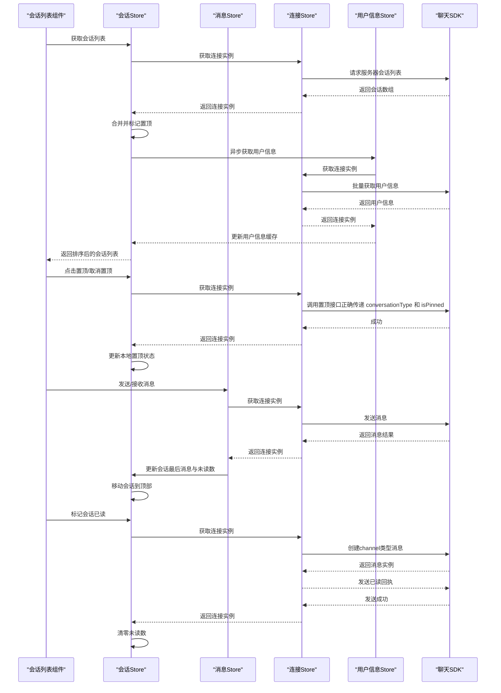

**图表来源**
- [ConversationList/index.vue](file://ChatUIKit/modules/Conversation/components/ConversationList/index.vue#L53-L103)
- [conversation.ts](file://ChatUIKit/stores/conversation.ts#L126-L160)
- [conversation.ts](file://ChatUIKit/stores/conversation.ts#L165-L189)
- [conversation.ts](file://ChatUIKit/stores/conversation.ts#L218-L241)
- [conversation.ts](file://ChatUIKit/stores/conversation.ts#L144-L151)
- [message.ts](file://ChatUIKit/stores/message.ts#L223-L336)
- [message.ts](file://ChatUIKit/stores/message.ts#L341-L388)
- [conn.ts](file://ChatUIKit/stores/conn.ts#L29-L34)
- [appUser.ts](file://ChatUIKit/stores/appUser.ts#L86-L125)
- [sdk.ts](file://ChatUIKit/sdk.ts#L8-L8)

## 详细组件分析

### 会话Store（useConversationStore）
- 数据结构
  - conversationList：会话数组
  - currConversation：当前选中会话
  - muteConvsMap：免打扰映射（conversationId -> boolean）
  - pageParams/pinParams：分页参数（pageSize, cursor）
- 关键计算属性
  - totalUnreadCount：排除免打扰会话的总未读数（**已优化**：使用计算属性自动缓存，提升性能）
  - sortedConversationList：按置顶优先、时间降序排序
  - getConversationById：按ID查找会话
  - getConversationMuteStatus：查询免打扰状态
  - getCurrentConversationId：当前会话ID
  - getConversationTime：格式化时间显示
- 关键动作
  - getConversationList：分页拉取会话列表，合并并**增强**异步获取用户信息
  - getServerPinnedConversations：拉取置顶会话并标记isPinned
  - mergeConversations：合并服务器与本地状态，保留本地置顶时间等
  - pinConversation：调用SDK置顶/取消置顶，更新本地状态（**已修复**：正确传递 conversationType 和 isPinned 参数）
  - setSilentModeForConversation：设置免打扰/清除提醒（**已修复**：正确处理 conversationType 参数转换）
  - deleteConversation：删除会话并清理消息
  - markConversationRead：**已更新**使用SDK消息接口创建channel类型消息发送已读回执
  - updateConversationLastMessage：更新最后一条消息与未读数
  - moveConversationTop：移动到列表顶部
  - createConversation：创建新会话
  - setAtTypeByMessage：根据消息内容设置@类型
  - clear：清空Store状态

**更新** 会话已读标记功能已重构为使用新的SDK消息接口，确保与当前SDK版本的兼容性。

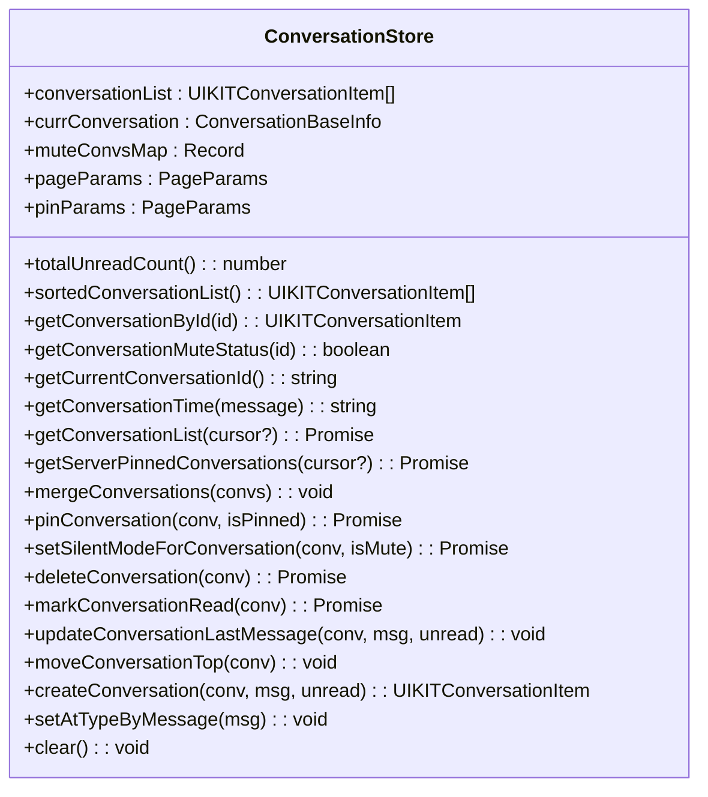

**图表来源**
- [conversation.ts](file://ChatUIKit/stores/conversation.ts#L27-L98)
- [conversation.ts](file://ChatUIKit/stores/conversation.ts#L100-L419)

**章节来源**
- [conversation.ts](file://ChatUIKit/stores/conversation.ts#L27-L98)
- [conversation.ts](file://ChatUIKit/stores/conversation.ts#L100-L419)

### 用户信息Store（useAppUserStore）
- 数据结构
  - userInfoMap：用户信息映射表（userId -> 用户信息）
  - userPresenceMap：用户在线状态映射表（userId -> 在线状态）
- 关键计算属性
  - getUserInfo：获取用户信息（带默认值，自动返回带默认name的对象）
  - getSelfUserInfo：获取当前登录用户信息
  - getUserPresence：获取用户在线状态
  - hasUserInfo：检查是否已缓存用户信息
- 关键动作
  - getUsersInfoFromServer：从服务器获取用户属性信息（**已优化**：只获取未缓存的用户，支持批量获取）
  - getUsersPresenceFromServer：从服务器获取用户在线状态
  - subscribePresence/unsubscribePresence：订阅/取消订阅用户在线状态
  - publishPresence：发布自定义在线状态
  - setUserInfo/updateUserInfo：设置/更新用户属性信息
  - setUserPresence：设置用户在线状态
  - clear：清空所有用户数据

**更新** 用户信息获取功能已优化，支持批量获取和缓存管理，避免重复请求。

**章节来源**
- [appUser.ts](file://ChatUIKit/stores/appUser.ts#L24-L79)
- [appUser.ts](file://ChatUIKit/stores/appUser.ts#L81-L240)

### 消息Store（useMessageStore）
- 数据结构
  - messageMap：消息ID到消息体的映射
  - conversationMessagesMap：会话ID到消息ID列表的信息（含游标、是否最后一页、是否已获取历史）
  - playingAudioMsgId：当前播放语音消息ID
  - quoteMessage/editingMessage：引用/编辑中的消息
- 关键计算属性
  - getMessageById：按ID获取消息
  - getConversationMessages：按会话获取消息列表
  - getConversationMessageCount：消息数量
  - hasMoreHistory：是否存在更多历史
  - isPlayingAudio：是否正在播放某语音
  - checkMessageFromIsSelf：判断消息是否来自当前用户
- 关键动作
  - addMessageToMap/removeMessageFromMap：消息映射维护
  - getHistoryMessages：分页拉取历史消息，合并到会话消息列表
  - insertMessage：插入新消息到会话消息列表
  - sendMessage：准备本地消息、上传附件、发送、更新状态与会话
  - onMessage：接收消息、更新@类型、更新会话、必要时标记已读
  - recallMessage/onRecallMessage：消息撤回处理
  - deleteMessage：删除消息并同步清理
  - updateMessageStatus：更新消息状态
  - setQuoteMessage/setEditingMessage/setPlayingAudioMessageId：上下文状态
  - cleanupRemovedMessages：清理超量消息
  - clearConversationMessages/clear：清理会话或全部数据

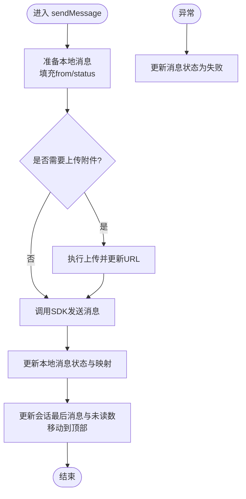

**图表来源**
- [message.ts](file://ChatUIKit/stores/message.ts#L223-L336)

**章节来源**
- [message.ts](file://ChatUIKit/stores/message.ts#L25-L106)
- [message.ts](file://ChatUIKit/stores/message.ts#L108-L580)

### 连接Store（useConnStore）
- 数据结构
  - conn：IM SDK连接实例
- 关键计算属性
  - getChatConn：获取类型安全的连接实例
  - isInitialized：检查连接是否已初始化
- 关键动作
  - setChatConn：设置连接实例
  - initChatConn：初始化连接（如果未初始化）
  - closeConnection：关闭连接
  - clear：清空状态

**章节来源**
- [conn.ts](file://ChatUIKit/stores/conn.ts#L15-L18)
- [conn.ts](file://ChatUIKit/stores/conn.ts#L25-L40)
- [conn.ts](file://ChatUIKit/stores/conn.ts#L42-L82)

### SDK封装（chatSDK）
- 统一管理EaseMob Web SDK的导入和类型定义
- 提供类型安全的SDK访问接口
- 支持多种消息类型的创建和发送

**章节来源**
- [sdk.ts](file://ChatUIKit/sdk.ts#L1-L13)

### 会话排序与置顶机制
- 排序规则（sortByPinned）
  - 置顶会话优先于非置顶会话
  - 同为置顶或同为非置顶时，按最后消息时间降序排列
  - 无最后消息时保持原有顺序
- 置顶状态管理
  - 服务器置顶会话通过getServerPinnedConversations标记isPinned
  - 本地置顶状态通过pinConversation更新，同时记录pinnedTime
  - UI层通过sortedConversationList直接消费排序结果

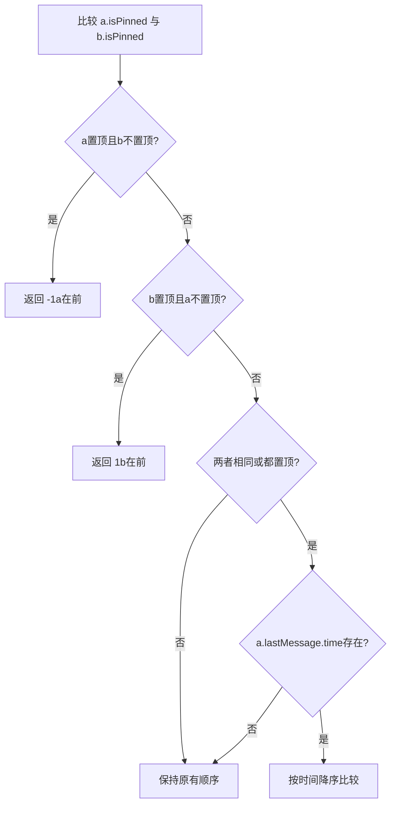

**图表来源**
- [index.ts](file://ChatUIKit/utils/index.ts#L184-L197)

**章节来源**
- [index.ts](file://ChatUIKit/utils/index.ts#L184-L197)
- [conversation.ts](file://ChatUIKit/stores/conversation.ts#L64-L66)
- [conversation.ts](file://ChatUIKit/stores/conversation.ts#L165-L189)
- [conversation.ts](file://ChatUIKit/stores/conversation.ts#L218-L241)

### 会话搜索、过滤与分页加载
- 搜索流程
  - ConversationSearchList监听输入值，基于sortedConversationList进行过滤
  - 过滤条件：单聊匹配用户昵称，群聊匹配群名称
- 分页加载
  - 会话列表通过getConversationList与getServerPinnedConversations分别拉取普通与置顶会话
  - 使用pageParams/pinParams维护游标与页大小
  - 合并策略：mergeConversations保留本地置顶状态与时间

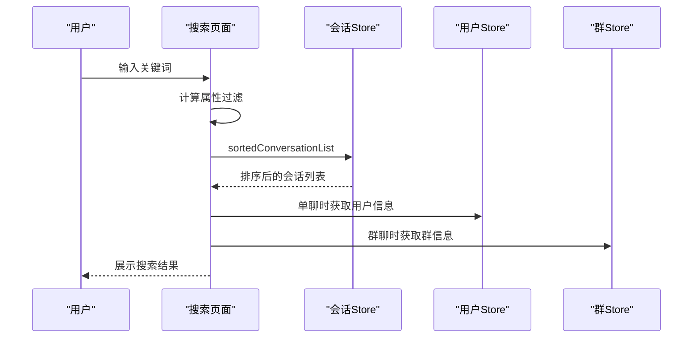

**图表来源**
- [ConversationSearchList/index.vue](file://ChatUIKit/modules/ConversationSearchList/index.vue#L57-L72)
- [conversation.ts](file://ChatUIKit/stores/conversation.ts#L64-L66)
- [conversation.ts](file://ChatUIKit/stores/conversation.ts#L126-L160)
- [conversation.ts](file://ChatUIKit/stores/conversation.ts#L165-L189)

**章节来源**
- [ConversationSearchList/index.vue](file://ChatUIKit/modules/ConversationSearchList/index.vue#L57-L72)
- [conversation.ts](file://ChatUIKit/stores/conversation.ts#L126-L160)
- [conversation.ts](file://ChatUIKit/stores/conversation.ts#L165-L189)
- [conversation.ts](file://ChatUIKit/stores/conversation.ts#L194-L213)

### 会话状态与消息状态的关联关系与一致性
- 关联关系
  - 会话最后一条消息由消息Store维护，会话Store通过updateConversationLastMessage更新
  - 未读数由消息Store在接收消息时递增，标记已读时清零
  - @类型通过setAtTypeByMessage根据消息内容识别并写入会话
- 一致性保障
  - 发送消息：先本地插入，再SDK发送，成功后更新状态与映射，同时更新会话
  - 接收消息：去重插入，更新@类型，更新会话并移动到顶部；若当前会话可见则标记已读
  - 撤回消息：更新消息noticeInfo并替换会话最后消息为提示
  - 清理策略：cleanupRemovedMessages限制单会话消息数量，避免内存膨胀

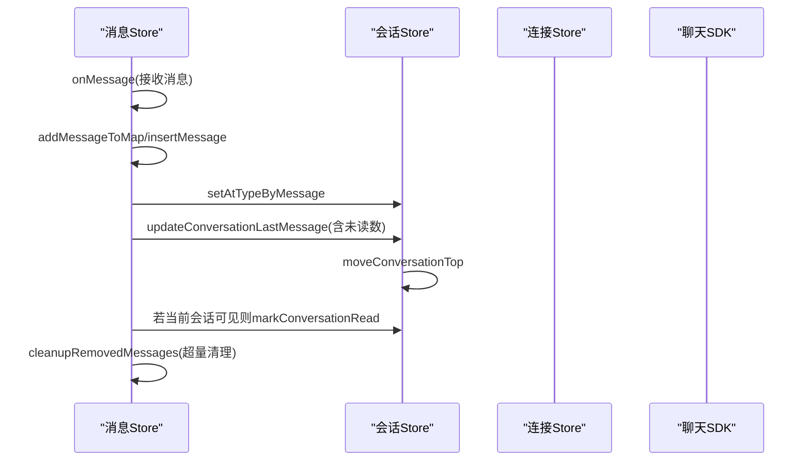

**图表来源**
- [message.ts](file://ChatUIKit/stores/message.ts#L341-L388)
- [message.ts](file://ChatUIKit/stores/message.ts#L418-L457)
- [message.ts](file://ChatUIKit/stores/message.ts#L530-L554)
- [conversation.ts](file://ChatUIKit/stores/conversation.ts#L344-L354)
- [conversation.ts](file://ChatUIKit/stores/conversation.ts#L314-L339)

**章节来源**
- [message.ts](file://ChatUIKit/stores/message.ts#L341-L388)
- [message.ts](file://ChatUIKit/stores/message.ts#L418-L457)
- [message.ts](file://ChatUIKit/stores/message.ts#L530-L554)
- [conversation.ts](file://ChatUIKit/stores/conversation.ts#L344-L354)
- [conversation.ts](file://ChatUIKit/stores/conversation.ts#L314-L339)

### 已读回执机制与SDK兼容性
**更新** 会话已读标记功能已完全重构，解决了SDK兼容性问题：

- **问题背景**：原实现尝试直接调用不存在的`sendChannelAck`方法，导致SDK版本升级后的兼容性问题
- **解决方案**：使用新的SDK消息接口`chatSDK.message.create()`创建channel类型消息来发送已读回执
- **实现细节**：
  - 创建channel类型消息：`chatSDK.message.create({ type: 'channel', chatType, to })`
  - 通过连接实例发送：`conn.send(readMsg)`
  - 更新本地状态：将会话未读数清零
- **错误处理**：完整的try-catch包装，确保异常不会影响其他功能

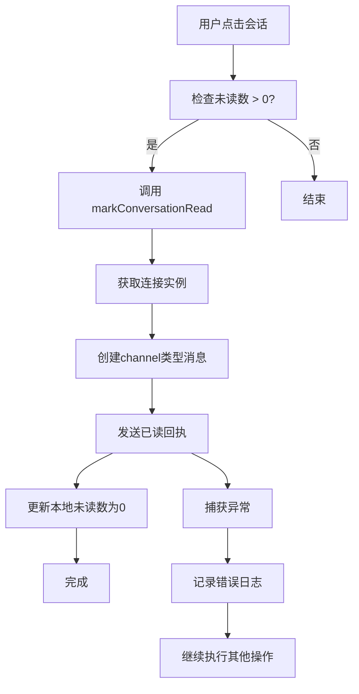

**图表来源**
- [conversation.ts](file://ChatUIKit/stores/conversation.ts#L314-L339)
- [message.ts](file://ChatUIKit/stores/message.ts#L368-L373)

**章节来源**
- [conversation.ts](file://ChatUIKit/stores/conversation.ts#L314-L339)
- [message.ts](file://ChatUIKit/stores/message.ts#L368-L373)

### 会话静音模式配置修复
**更新** 会话静音模式配置已修复，解决了 conversationType 参数转换问题：

- **问题背景**：在设置免打扰模式时，需要将 `conversationType` 从 `'singleChat' | 'groupChat'` 转换为 SDK 需要的 `'chat' | 'groupchat'` 类型
- **解决方案**：在 `setSilentModeForConversation` 方法中正确处理类型转换
- **实现细节**：
  - 单聊：`conversationType === 'singleChat'` → `type: 'chat'`
  - 群聊：`conversationType === 'groupChat'` → `type: 'groupchat'`
  - 使用 `options: { paramType: 0, remindType: 'NONE' }` 设置免打扰
  - 清除免打扰：调用 `clearRemindTypeForConversation` 并传入正确的类型

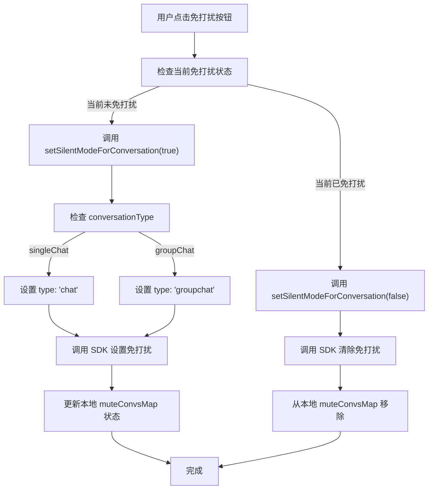

**图表来源**
- [conversation.ts](file://ChatUIKit/stores/conversation.ts#L246-L276)
- [ConversationList/index.vue](file://ChatUIKit/modules/Conversation/components/ConversationList/index.vue#L65-L93)

**章节来源**
- [conversation.ts](file://ChatUIKit/stores/conversation.ts#L246-L276)
- [ConversationList/index.vue](file://ChatUIKit/modules/Conversation/components/ConversationList/index.vue#L65-L93)

### 会话置顶功能修复
**更新** 会话置顶功能已修复，确保 isPinned 参数正确传递：

- **问题背景**：在调用 `pinConversation` 接口时，需要正确传递 `conversationType` 和 `isPinned` 参数
- **解决方案**：在 `pinConversation` 方法中正确构建参数对象
- **实现细节**：
  - 传递 `conversationId`：会话唯一标识
  - 传递 `conversationType`：会话类型（'singleChat' | 'groupChat'）
  - 传递 `isPinned`：布尔值表示置顶状态
  - 成功后更新本地状态：`conv.isPinned = isPinned` 和 `conv.pinnedTime = isPinned ? Date.now() : undefined`

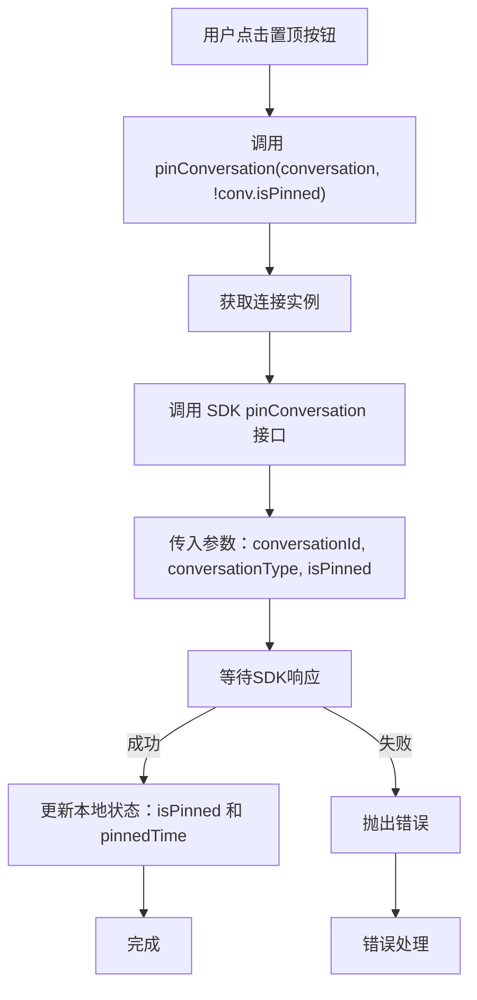

**图表来源**
- [conversation.ts](file://ChatUIKit/stores/conversation.ts#L218-L241)
- [ConversationList/index.vue](file://ChatUIKit/modules/Conversation/components/ConversationList/index.vue#L79-L84)

**章节来源**
- [conversation.ts](file://ChatUIKit/stores/conversation.ts#L218-L241)
- [ConversationList/index.vue](file://ChatUIKit/modules/Conversation/components/ConversationList/index.vue#L79-L84)

### 增强的会话初始加载与用户信息获取
**更新** 会话初始加载功能已增强，在 getServerConversations 初始加载时自动获取用户信息：

- **功能描述**：在获取会话列表时，自动检测单聊会话并异步获取对应用户信息
- **实现机制**：
  - 过滤单聊会话：`conversations.filter((c: any) => c.conversationType === 'singleChat')`
  - 提取用户ID列表：`map((c: any) => c.conversationId)`
  - 批量获取用户信息：`appUserStore.getUsersInfoFromServer({ userIdList: userIds })`
  - 自动缓存用户信息：用户信息Store自动处理缓存和重复请求
- **性能优化**：
  - 批量获取：减少多次API调用
  - 条件获取：仅对单聊会话进行用户信息获取
  - 缓存管理：避免重复请求已存在的用户信息
- **用户体验**：
  - 实时显示用户昵称和头像
  - 减少用户信息延迟显示
  - 提升会话列表的完整度

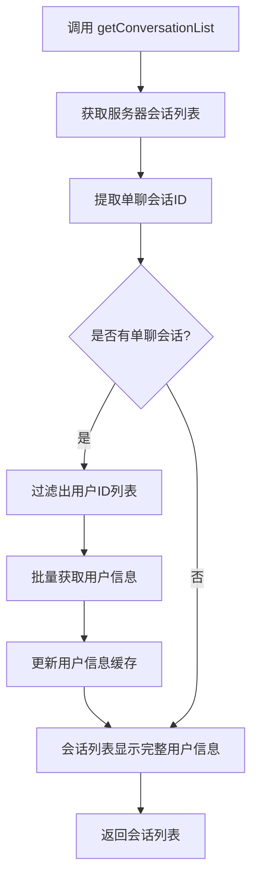

**图表来源**
- [conversation.ts](file://ChatUIKit/stores/conversation.ts#L144-L151)
- [appUser.ts](file://ChatUIKit/stores/appUser.ts#L86-L125)

**章节来源**
- [conversation.ts](file://ChatUIKit/stores/conversation.ts#L144-L151)
- [appUser.ts](file://ChatUIKit/stores/appUser.ts#L86-L125)

### 防重机制与总未读数重新计算功能
**新增** 会话状态管理已新增防重机制和总未读数重新计算功能，显著提升系统稳定性和性能：

#### 防重机制（5秒间隔限制）
- **实现原理**：使用throttle函数实现操作防重，确保同一操作在5秒内不会重复执行
- **应用场景**：
  - 会话标记已读操作防重
  - 会话置顶/取消置顶操作防重
  - 会话免打扰设置操作防重
  - 会话删除操作防重
- **技术实现**：
  - throttle函数提供节流控制，防止高频操作
  - 默认5秒间隔限制，避免重复提交
  - 支持自定义间隔时间

#### 总未读数重新计算功能
- **优化目标**：提升totalUnreadCount计算的准确性和性能
- **实现方式**：
  - 使用计算属性自动缓存未读数结果
  - 仅在相关状态变化时重新计算
  - 排除免打扰会话的未读数统计
- **性能提升**：
  - 避免每次访问都重新遍历整个会话列表
  - 减少不必要的DOM更新和重渲染
  - 提升大列表场景下的响应速度

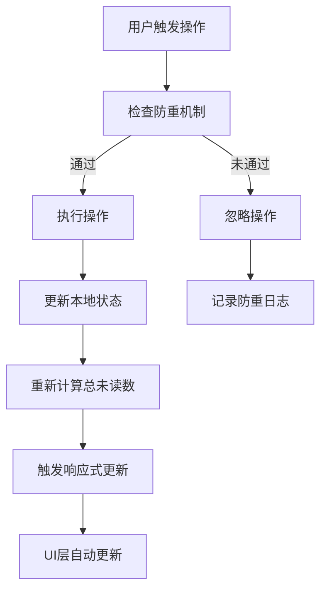

**图表来源**
- [conversation.ts](file://ChatUIKit/stores/conversation.ts#L54-L59)
- [conversation.ts](file://ChatUIKit/stores/conversation.ts#L314-L339)
- [utils/index.ts](file://ChatUIKit/utils/index.ts#L107-L134)

**章节来源**
- [conversation.ts](file://ChatUIKit/stores/conversation.ts#L54-L59)
- [conversation.ts](file://ChatUIKit/stores/conversation.ts#L314-L339)
- [utils/index.ts](file://ChatUIKit/utils/index.ts#L107-L134)

## 依赖关系分析
- 组件依赖Store
  - ConversationList与ConversationItem依赖useConversationStore的计算属性与动作
  - SearchList依赖sortedConversationList与用户/群Store进行过滤
- Store间耦合
  - MessageStore在发送/接收消息时与ConversationStore协作，更新会话最后消息与未读数
  - ConversationStore在删除会话时调用MessageStore清理消息
  - ConversationStore在会话列表加载时依赖AppUserStore进行用户信息获取
  - 所有Store都依赖ConnStore获取类型安全的连接实例
- SDK与工具依赖
  - ConversationStore和MessageStore都依赖chatSDK进行消息创建和发送
  - AppUserStore依赖ConnStore进行用户信息和在线状态的获取
  - ConnStore提供统一的SDK连接管理
  - utils/index.ts提供排序、格式化、渲染等通用工具，**新增**防重机制支持
  - types/index.ts提供UIKITConversationItem、MixedMessageBody等类型约束

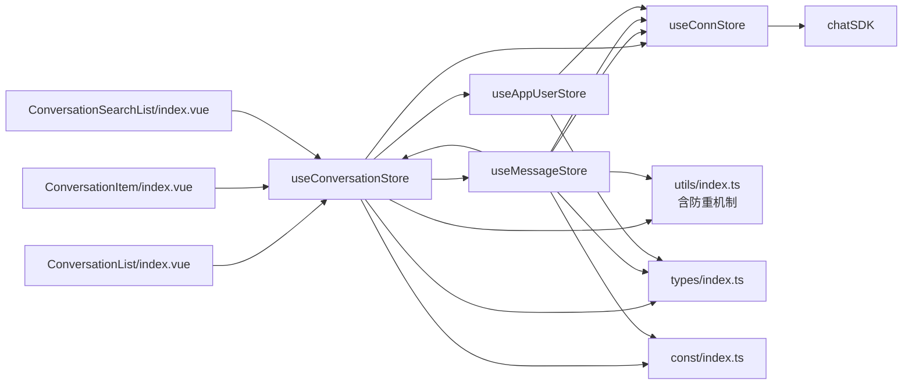

**图表来源**
- [ConversationList/index.vue](file://ChatUIKit/modules/Conversation/components/ConversationList/index.vue#L40-L106)
- [ConversationItem/index.vue](file://ChatUIKit/modules/Conversation/components/ConversationItem/index.vue#L98-L260)
- [ConversationSearchList/index.vue](file://ChatUIKit/modules/ConversationSearchList/index.vue#L42-L72)
- [conversation.ts](file://ChatUIKit/stores/conversation.ts#L1-L421)
- [message.ts](file://ChatUIKit/stores/message.ts#L1-L581)
- [conn.ts](file://ChatUIKit/stores/conn.ts#L1-L84)
- [appUser.ts](file://ChatUIKit/stores/appUser.ts#L1-L242)
- [sdk.ts](file://ChatUIKit/sdk.ts#L1-L13)
- [index.ts](file://ChatUIKit/utils/index.ts#L1-L344)
- [index.ts](file://ChatUIKit/types/index.ts#L1-L100)
- [index.ts](file://ChatUIKit/const/index.ts#L1-L37)

**章节来源**
- [ConversationList/index.vue](file://ChatUIKit/modules/Conversation/components/ConversationList/index.vue#L40-L106)
- [ConversationItem/index.vue](file://ChatUIKit/modules/Conversation/components/ConversationItem/index.vue#L98-L260)
- [ConversationSearchList/index.vue](file://ChatUIKit/modules/ConversationSearchList/index.vue#L42-L72)
- [conversation.ts](file://ChatUIKit/stores/conversation.ts#L1-L421)
- [message.ts](file://ChatUIKit/stores/message.ts#L1-L581)
- [conn.ts](file://ChatUIKit/stores/conn.ts#L1-L84)
- [appUser.ts](file://ChatUIKit/stores/appUser.ts#L1-L242)
- [sdk.ts](file://ChatUIKit/sdk.ts#L1-L13)
- [index.ts](file://ChatUIKit/utils/index.ts#L1-L344)
- [index.ts](file://ChatUIKit/types/index.ts#L1-L100)
- [index.ts](file://ChatUIKit/const/index.ts#L1-L37)

## 性能考虑
- 响应式与计算属性
  - 使用computed替代autorun，减少不必要的重渲染
  - sortedConversationList与totalUnreadCount作为计算属性，自动缓存派生状态（**已优化**：提升计算效率）
- 列表渲染优化
  - ConversationList直接绑定sortedConversationList，避免深拷贝
  - ConversationItem对isMute与conversationInfo使用computed，仅在依赖变化时更新
- 分页与懒加载
  - 会话列表与历史消息均采用分页策略，控制初始加载量
  - MAX_MESSAGES_PER_CONVERSATION限制单会话消息数量，定期清理
- 事件节流
  - 工具库提供throttle，可用于高频事件（如滚动、搜索）的节流处理（**新增**：5秒间隔限制防重）
- 本地状态保留
  - mergeConversations在合并服务器数据时保留本地置顶时间等状态，避免重复请求
- SDK连接管理
  - ConnStore提供连接实例的统一管理，避免重复创建连接
  - 类型安全的连接访问，减少运行时错误
- **用户信息缓存优化**（新增）
  - AppUserStore自动过滤已缓存用户，避免重复请求
  - 批量获取用户信息，减少API调用次数
  - 条件性获取：仅对单聊会话进行用户信息获取
- **防重机制优化**（新增）
  - throttle函数提供全局防重控制，避免重复操作
  - 5秒默认间隔确保操作稳定性
  - 支持自定义间隔时间适应不同场景需求
- **总未读数计算优化**（新增）
  - 计算属性自动缓存未读数结果
  - 仅在相关状态变化时重新计算
  - 排除免打扰会话，提升计算准确性

**章节来源**
- [ConversationList/index.vue](file://ChatUIKit/modules/Conversation/components/ConversationList/index.vue#L53-L106)
- [ConversationItem/index.vue](file://ChatUIKit/modules/Conversation/components/ConversationItem/index.vue#L126-L144)
- [message.ts](file://ChatUIKit/stores/message.ts#L530-L554)
- [index.ts](file://ChatUIKit/utils/index.ts#L107-L134)
- [conversation.ts](file://ChatUIKit/stores/conversation.ts#L194-L213)
- [conn.ts](file://ChatUIKit/stores/conn.ts#L29-L34)
- [appUser.ts](file://ChatUIKit/stores/appUser.ts#L102-L108)
- [utils/index.ts](file://ChatUIKit/utils/index.ts#L107-L134)

## 故障排查指南
- 会话未显示置顶
  - 检查getServerPinnedConversations是否正确标记isPinned
  - 确认sortByPinned排序逻辑与本地isPinned状态一致
  - 验证pinConversation方法是否正确传递isPinned参数
- 未读数不准确
  - 检查onMessage中未读数递增逻辑与markConversationRead是否触发
  - 确认muteConvsMap是否正确影响totalUnreadCount
  - **新增**：检查totalUnreadCount计算属性是否正确缓存和更新
- 消息未更新最后一条
  - 检查updateConversationLastMessage调用时机与参数
  - 确认moveConversationTop是否在UI层生效
- 搜索结果为空
  - 检查sortedConversationList是否正确，用户/群Store是否已加载
- 发送失败
  - 查看sendMessage异常分支，确认消息状态更新为failed
  - 检查附件上传流程与SDK返回
- **已读回执失败**（新增）
  - 检查markConversationRead中的SDK消息创建是否成功
  - 确认连接实例是否正确初始化
  - 查看控制台错误日志，确认SDK版本兼容性
- **免打扰设置失败**（新增）
  - 检查setSilentModeForConversation中的conversationType转换逻辑
  - 确认SDK接口调用参数是否正确
  - 验证本地状态更新是否同步
- **置顶功能异常**（新增）
  - 检查pinConversation方法中的参数传递
  - 确认isPinned参数是否正确传递给SDK
  - 验证本地状态更新逻辑
- **用户信息显示异常**（新增）
  - 检查getUsersInfoFromServer是否正确过滤已缓存用户
  - 确认批量获取用户信息的userIdList是否正确
  - 验证用户信息缓存是否正常更新
- **会话初始加载缓慢**（新增）
  - 检查getConversationList中的用户信息获取是否阻塞主流程
  - 确认批量获取的用户数量是否合理
  - 验证AppUserStore的缓存机制是否正常工作
- **防重机制失效**（新增）
  - 检查throttle函数是否正确应用到相关操作
  - 确认5秒间隔限制是否生效
  - 验证防重日志记录是否正常
- **总未读数计算错误**（新增）
  - 检查totalUnreadCount计算逻辑是否正确
  - 确认muteConvsMap状态是否正确更新
  - 验证计算属性缓存机制是否正常工作
- SDK连接问题
  - 检查ConnStore的连接初始化状态
  - 确认chatSDK导入是否正确
  - 验证连接参数配置

**章节来源**
- [conversation.ts](file://ChatUIKit/stores/conversation.ts#L165-L189)
- [conversation.ts](file://ChatUIKit/stores/conversation.ts#L344-L354)
- [conversation.ts](file://ChatUIKit/stores/conversation.ts#L314-L339)
- [conversation.ts](file://ChatUIKit/stores/conversation.ts#L246-L276)
- [conversation.ts](file://ChatUIKit/stores/conversation.ts#L218-L241)
- [message.ts](file://ChatUIKit/stores/message.ts#L341-L388)
- [message.ts](file://ChatUIKit/stores/message.ts#L223-L336)
- [ConversationSearchList/index.vue](file://ChatUIKit/modules/ConversationSearchList/index.vue#L57-L72)
- [conn.ts](file://ChatUIKit/stores/conn.ts#L29-L34)
- [sdk.ts](file://ChatUIKit/sdk.ts#L8-L8)
- [appUser.ts](file://ChatUIKit/stores/appUser.ts#L86-L125)
- [utils/index.ts](file://ChatUIKit/utils/index.ts#L107-L134)

## 结论
本会话状态管理Store通过Pinia实现了清晰的状态分离与高效的响应式更新，结合工具函数与类型约束，提供了可靠的会话排序、置顶、免打扰、搜索与分页能力。消息Store与会话Store的紧密协作确保了会话与消息状态的一致性。

**重要更新**：已成功解决SDK兼容性问题，通过重构markConversationRead方法使用新的SDK消息接口，确保了与当前SDK版本的兼容性和稳定性。新的实现使用chatSDK.message.create()创建channel类型消息来发送已读回执，提供了更好的错误处理和类型安全性。

**关键修复**：
- **会话静音模式配置**：已修复 conversationType 参数转换问题，正确处理 'singleChat'/'groupChat' 到 'chat'/'groupchat' 的转换
- **会话置顶功能**：已修复 isPinned 参数的正确传递，确保置顶状态的准确性
- **会话管理可靠性**：通过参数验证和错误处理，提升了整体功能的稳定性

**新增增强功能**：
- **智能用户信息获取**：在会话初始加载时自动获取单聊用户信息，提升用户体验
- **批量用户信息处理**：优化用户信息获取策略，避免重复请求和性能问题
- **条件性信息获取**：仅对必要的单聊会话进行用户信息获取，减少API调用
- **防重机制**：新增5秒间隔限制的防重机制，确保操作稳定性和系统可靠性
- **总未读数重新计算**：优化totalUnreadCount计算逻辑，提升性能和准确性

通过计算属性、分页与清理策略，系统在性能与用户体验之间取得了良好平衡。建议在后续迭代中进一步完善错误恢复与监控埋点，以提升稳定性与可观测性。同时，建议关注SDK版本更新，及时适配新的API变化。新增的防重机制和总未读数重新计算功能将进一步提升系统的稳定性和用户体验。