# 消息状态管理

<cite>
**本文档引用的文件**
- [message.ts](file://ChatUIKit/stores/message.ts)
- [types/index.ts](file://ChatUIKit/types/index.ts)
- [conversation.ts](file://ChatUIKit/stores/conversation.ts)
- [conn.ts](file://ChatUIKit/stores/conn.ts)
- [config.ts](file://ChatUIKit/stores/config.ts)
- [chat.ts](file://ChatUIKit/stores/chat.ts)
- [index.ts](file://ChatUIKit/const/index.ts)
- [sdk.ts](file://ChatUIKit/sdk.ts)
- [messageItem.vue](file://ChatUIKit/modules/Chat/components/Message/messageItem.vue)
- [messageStatus.vue](file://ChatUIKit/modules/Chat/components/Message/messageStatus.vue)
- [messageEdit.vue](file://ChatUIKit/modules/Chat/components/Message/messageEdit.vue)
- [log.ts](file://ChatUIKit/log.ts)
- [configType.ts](file://ChatUIKit/configType.ts)
- [message.js](file://ChatUIKit-vue2/stores/message.js)
</cite>

## 更新摘要
**变更内容**
- 重构 setEditingMessage 动作为 Pinia store 中的独立 action
- 改进 modifyServerMessage 动作，增强服务器消息ID处理和错误处理
- 引入 modifiedInfo 结构，支持消息修改状态跟踪
- 新增广泛的调试基础设施，包含详细的日志输出
- 增强消息编辑功能的完整性和可靠性

## 目录
1. [简介](#简介)
2. [项目结构](#项目结构)
3. [核心组件](#核心组件)
4. [架构概览](#架构概览)
5. [详细组件分析](#详细组件分析)
6. [依赖关系分析](#依赖关系分析)
7. [性能考虑](#性能考虑)
8. [故障排查指南](#故障排查指南)
9. [结论](#结论)

## 简介
本文件系统性地文档化了消息状态管理Store的设计与实现，涵盖消息存储、检索、更新机制，消息缓存策略与内存管理，消息状态的数据结构与状态标识，消息同步机制、离线消息处理与去重策略，以及消息状态与连接状态的交互关系与一致性保证。同时提供性能优化技巧与大数据量处理方案，帮助开发者在复杂场景下高效、稳定地管理消息状态。

**更新** 消息存储系统已进行重大增强，包括 setEditingMessage 动作的重构、modifyServerMessage 动作的改进、modifiedInfo 结构的引入以及广泛的调试基础设施。这些改进显著提升了消息编辑功能的完整性和可靠性，为开发者提供了更强大的消息管理能力。

## 项目结构
消息状态管理位于ChatUIKit模块的stores目录中，采用Pinia进行状态管理，并通过SDK与后端IM服务交互。消息Store与会话Store、连接Store紧密协作，形成完整的消息生命周期管理闭环。

```mermaid
graph TB
subgraph "消息层"
MS["MessageStore<br/>消息状态管理"]
MSGUI["MessageItem<br/>消息渲染组件"]
MSGSTATUS["MessageStatus<br/>消息状态指示器"]
MSGEDIT["MessageEdit<br/>消息编辑组件"]
MODIFYACTION["modifyServerMessage<br/>消息编辑动作"]
END
subgraph "配置层"
CONFIG["ConfigStore<br/>功能配置管理"]
FEATURECFG["FeatureConfig<br/>功能特性配置"]
END
subgraph "会话层"
CS["ConversationStore<br/>会话状态管理"]
END
subgraph "连接层"
CNS["ConnStore<br/>连接状态管理"]
END
subgraph "类型与SDK"
TYPES["Types<br/>消息类型定义"]
CHAT["ChatStore<br/>聊天状态管理"]
SDK["chatSDK<br/>IM SDK封装"]
LOG["Logger<br/>日志记录"]
END
MS --> CS
MS --> CNS
MS --> CONFIG
MS --> SDK
MS --> TYPES
MS --> CHAT
MS --> LOG
MSGUI --> MS
MSGUI --> CS
MSGUI --> CNS
MSGUI --> CONFIG
MSGUI --> TYPES
MSGSTATUS --> MS
MSGSTATUS --> TYPES
MSGEDIT --> MS
MSGEDIT --> TYPES
MODIFYACTION --> MS
MODIFYACTION --> CNS
MODIFYACTION --> TYPES
CONFIG --> FEATURECFG
CONFIG --> MSGUI
```

**图表来源**
- [message.ts:48-581](file://ChatUIKit/stores/message.ts#L48-L581)
- [conversation.ts:40-421](file://ChatUIKit/stores/conversation.ts#L40-L421)
- [conn.ts:20-84](file://ChatUIKit/stores/conn.ts#L20-L84)
- [config.ts:59-124](file://ChatUIKit/stores/config.ts#L59-L124)
- [chat.ts:29-407](file://ChatUIKit/stores/chat.ts#L29-L407)
- [types/index.ts:46-61](file://ChatUIKit/types/index.ts#L46-L61)
- [sdk.ts:1-13](file://ChatUIKit/sdk.ts#L1-L13)
- [messageItem.vue:1-264](file://ChatUIKit/modules/Chat/components/Message/messageItem.vue#L1-L264)
- [messageStatus.vue:1-95](file://ChatUIKit/modules/Chat/components/Message/messageStatus.vue#L1-L95)
- [messageEdit.vue:1-147](file://ChatUIKit/modules/Chat/components/Message/messageEdit.vue#L1-L147)
- [configType.ts:1-68](file://ChatUIKit/configType.ts#L1-L68)

**章节来源**
- [message.ts:1-581](file://ChatUIKit/stores/message.ts#L1-L581)
- [conversation.ts:1-421](file://ChatUIKit/stores/conversation.ts#L1-L421)
- [conn.ts:1-84](file://ChatUIKit/stores/conn.ts#L1-L84)
- [config.ts:1-124](file://ChatUIKit/stores/config.ts#L1-L124)
- [chat.ts:1-407](file://ChatUIKit/stores/chat.ts#L1-L407)
- [types/index.ts:1-100](file://ChatUIKit/types/index.ts#L1-L100)
- [sdk.ts:1-13](file://ChatUIKit/sdk.ts#L1-L13)
- [messageItem.vue:1-264](file://ChatUIKit/modules/Chat/components/Message/messageItem.vue#L1-L264)
- [messageStatus.vue:1-95](file://ChatUIKit/modules/Chat/components/Message/messageStatus.vue#L1-L95)
- [messageEdit.vue:1-147](file://ChatUIKit/modules/Chat/components/Message/messageEdit.vue#L1-L147)
- [configType.ts:1-68](file://ChatUIKit/configType.ts#L1-L68)

## 核心组件
- MessageStore：负责消息的存储、检索、更新、历史消息拉取、发送、接收、撤回、删除、状态更新与内存清理，现包含增强的服务器消息ID处理机制和消息编辑功能。
- ConversationStore：维护会话列表、当前会话、未读数、置顶状态等，并与MessageStore协同更新会话最后一条消息与未读数。
- ConnStore：管理IM连接实例，提供连接状态检查与SDK实例访问。
- ConfigStore：管理功能配置，包括消息状态显示开关、消息操作功能等用户偏好设置。
- ChatStore：协调SDK事件处理，包括消息已读回执、消息撤回等实时状态更新。
- 类型系统：定义消息状态、消息体、会话基础信息等类型，确保状态变更的类型安全，现包含服务器消息ID字段定义和 modifiedInfo 结构。
- 常量配置：定义每会话最大消息数量等关键阈值，控制内存占用。
- 日志工具：统一记录消息操作过程，便于问题定位与性能分析。
- 消息编辑组件：提供完整的消息编辑界面和功能，支持实时编辑和状态反馈。

**更新** 新增了完整的消息编辑功能，包括 setEditingMessage 动作的重构、modifyServerMessage 动作的改进、modifiedInfo 结构的引入以及广泛的调试基础设施。这些增强显著提升了消息编辑功能的完整性和可靠性。

**章节来源**
- [message.ts:48-581](file://ChatUIKit/stores/message.ts#L48-L581)
- [conversation.ts:40-421](file://ChatUIKit/stores/conversation.ts#L40-L421)
- [conn.ts:20-84](file://ChatUIKit/stores/conn.ts#L20-L84)
- [config.ts:59-124](file://ChatUIKit/stores/config.ts#L59-L124)
- [chat.ts:29-407](file://ChatUIKit/stores/chat.ts#L29-L407)
- [types/index.ts:46-61](file://ChatUIKit/types/index.ts#L46-L61)
- [index.ts:14-15](file://ChatUIKit/const/index.ts#L14-L15)
- [log.ts:1-78](file://ChatUIKit/log.ts#L1-L78)
- [configType.ts:1-68](file://ChatUIKit/configType.ts#L1-L68)
- [messageEdit.vue:1-147](file://ChatUIKit/modules/Chat/components/Message/messageEdit.vue#L1-L147)

## 架构概览
消息状态管理采用"对象映射 + 数组索引"的双层结构设计：
- 对象映射：以消息ID为键，存储完整消息体，支持O(1)查找与去重，现包含服务器消息ID字段和 modifiedInfo 结构。
- 数组索引：以会话ID为键，维护消息ID有序列表，支持分页加载与顺序渲染。
- 状态标识：通过消息体中的status字段表示消息状态，如发送中、已发送、已接收、已读、失败等。
- 一致性保证：通过连接状态检查、会话状态更新与消息状态联动，确保UI与后端状态一致。
- 功能配置：通过ConfigStore统一管理消息状态显示功能的启用/禁用。
- 错误处理：通过统一的日志记录和错误处理机制，确保系统的稳定性和可维护性。
- 服务器消息ID管理：增强的服务器消息ID处理机制，确保消息编辑和状态同步的准确性。
- 修改状态跟踪：通过 modifiedInfo 结构跟踪消息的修改状态和修改时间。

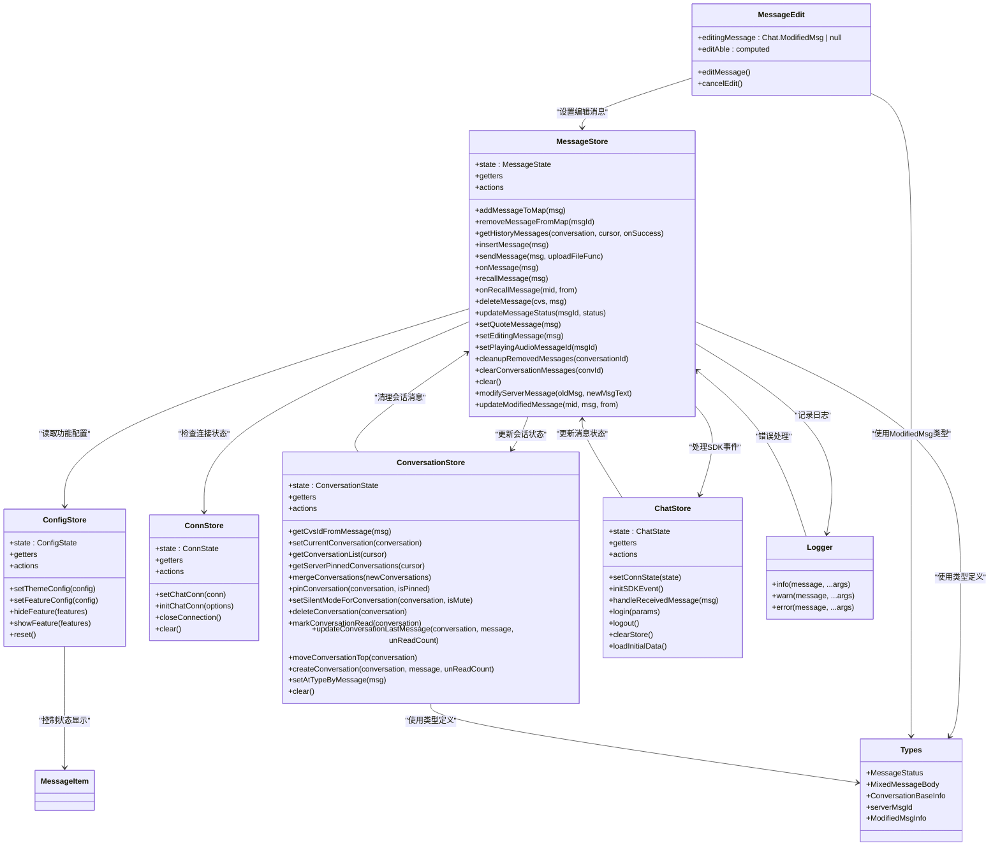

**图表来源**
- [message.ts:48-581](file://ChatUIKit/stores/message.ts#L48-L581)
- [conversation.ts:40-421](file://ChatUIKit/stores/conversation.ts#L40-L421)
- [conn.ts:20-84](file://ChatUIKit/stores/conn.ts#L20-L84)
- [config.ts:59-124](file://ChatUIKit/stores/config.ts#L59-L124)
- [chat.ts:29-407](file://ChatUIKit/stores/chat.ts#L29-L407)
- [types/index.ts:46-61](file://ChatUIKit/types/index.ts#L46-L61)
- [log.ts:1-78](file://ChatUIKit/log.ts#L1-L78)
- [messageEdit.vue:26-76](file://ChatUIKit/modules/Chat/components/Message/messageEdit.vue#L26-L76)

## 详细组件分析

### 消息存储与检索机制
- 存储结构
  - messageMap：以消息ID为键，存储完整消息体，支持快速查找与去重，现包含服务器消息ID字段和 modifiedInfo 结构。
  - conversationMessagesMap：以会话ID为键，存储消息ID数组、游标、是否到达末尾标志及历史消息获取标记。
- 检索方式
  - 通过getter根据会话ID获取消息列表，内部先取ID数组，再映射到消息体，过滤无效项。
  - 提供按ID直接查询消息的方法，便于组件按需渲染。

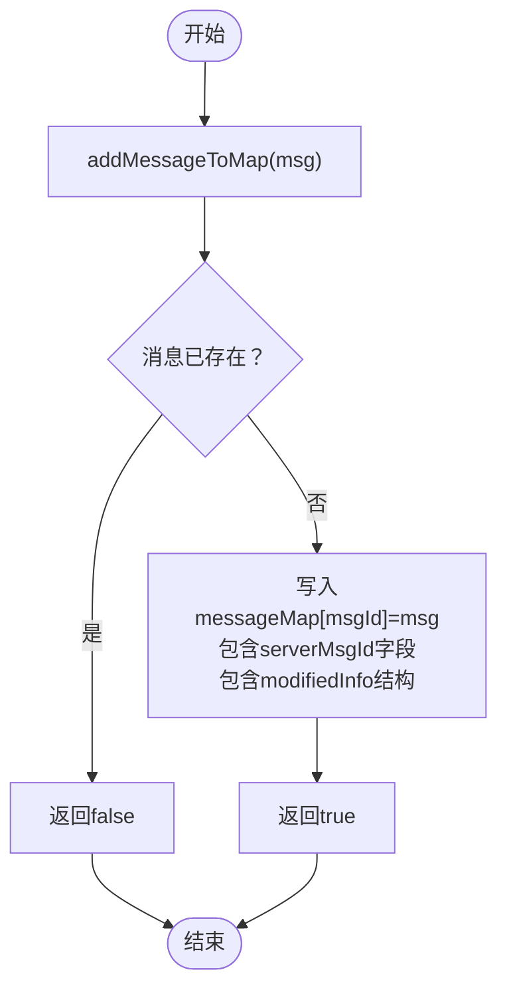

**图表来源**
- [message.ts:112-118](file://ChatUIKit/stores/message.ts#L112-L118)

**章节来源**
- [message.ts:33-44](file://ChatUIKit/stores/message.ts#L33-L44)
- [message.ts:61-74](file://ChatUIKit/stores/message.ts#L61-L74)

### 历史消息获取与合并策略
- 分页加载：每次请求固定数量的历史消息，避免一次性加载过多导致内存压力。
- 去重合并：首次获取时将新消息ID逆序插入；再次获取时基于现有ID集合过滤重复，仅追加新消息。
- 游标与边界：记录游标与是否到达末尾标志，控制后续加载行为与UI提示。
- 服务器消息ID处理：确保历史消息正确保存 serverMsgId 字段，支持消息编辑功能。
- 调试输出：包含详细的日志输出，便于追踪历史消息获取过程。

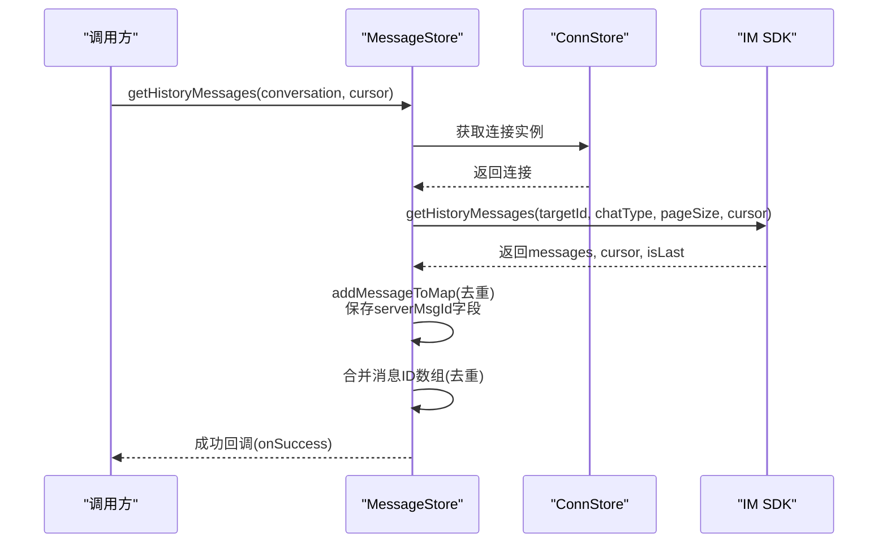

**图表来源**
- [message.ts:130-197](file://ChatUIKit/stores/message.ts#L130-L197)
- [conn.ts:29-34](file://ChatUIKit/stores/conn.ts#L29-L34)

**章节来源**
- [message.ts:129-197](file://ChatUIKit/stores/message.ts#L129-L197)

### 消息发送流程与状态更新
- 本地预处理：为消息补充必要字段（如发送者、状态），并同步附件消息格式。
- 上传与发送：可选上传文件，随后调用SDK发送消息。
- 本地状态更新：根据SDK返回结果更新本地消息状态与服务器消息ID映射。
- 服务器消息ID存储：同时存储本地消息ID和服务器消息ID，确保双向访问。
- 会话联动：更新会话最后一条消息与未读数，置顶会话并处理免打扰状态。

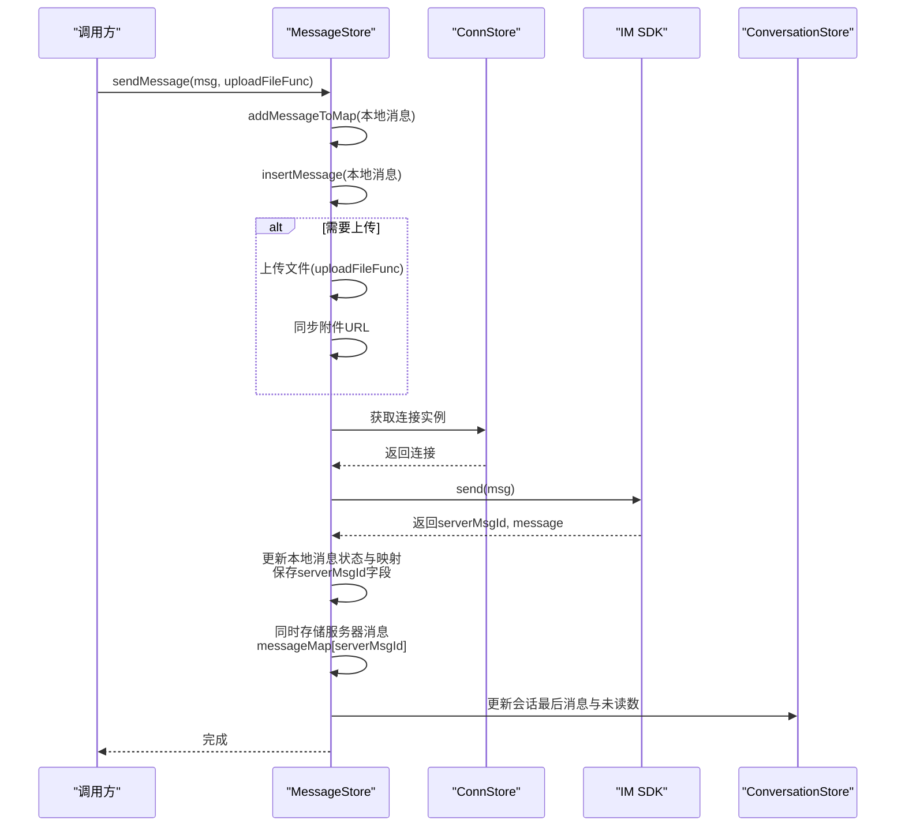

**图表来源**
- [message.ts:223-336](file://ChatUIKit/stores/message.ts#L223-L336)
- [conversation.ts:344-354](file://ChatUIKit/stores/conversation.ts#L344-L354)

**章节来源**
- [message.ts:223-336](file://ChatUIKit/stores/message.ts#L223-L336)
- [conversation.ts:344-354](file://ChatUIKit/stores/conversation.ts#L344-L354)

### 接收消息处理与会话联动
- 去重插入：通过addMessageToMap确保消息不重复。
- @类型设置：根据消息内容设置会话@类型（全体/提及）。
- 服务器消息ID处理：接收消息时正确保存 serverMsgId 字段。
- 会话更新：更新会话最后一条消息与未读数，置顶会话；若当前查看该会话则发送已读回执。
- 非当前会话清理：对非当前会话执行消息清理，避免内存膨胀。

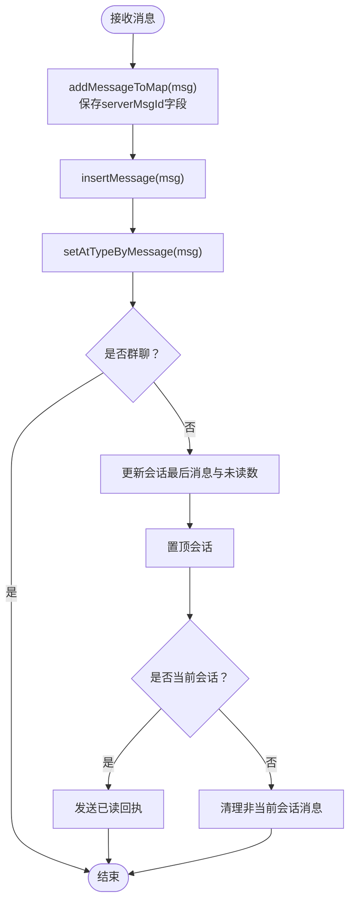

**图表来源**
- [message.ts:341-388](file://ChatUIKit/stores/message.ts#L341-L388)
- [conversation.ts:314-339](file://ChatUIKit/stores/conversation.ts#L314-L339)

**章节来源**
- [message.ts:341-388](file://ChatUIKit/stores/message.ts#L341-L388)
- [conversation.ts:314-339](file://ChatUIKit/stores/conversation.ts#L314-L339)

### 撤回与删除消息
- 撤回消息：调用SDK撤回消息，本地将对应消息标记为"已撤回"通知消息，并更新会话最后一条消息。
- 删除消息：调用SDK删除历史消息，本地从messageMap与会话消息ID列表中移除。
- 服务器消息ID处理：撤回和删除操作均使用 serverMsgId 字段确保服务器端一致性。

**更新** 撤回和删除操作现在都使用 serverMsgId 字段，确保与服务器消息ID的完全一致性。

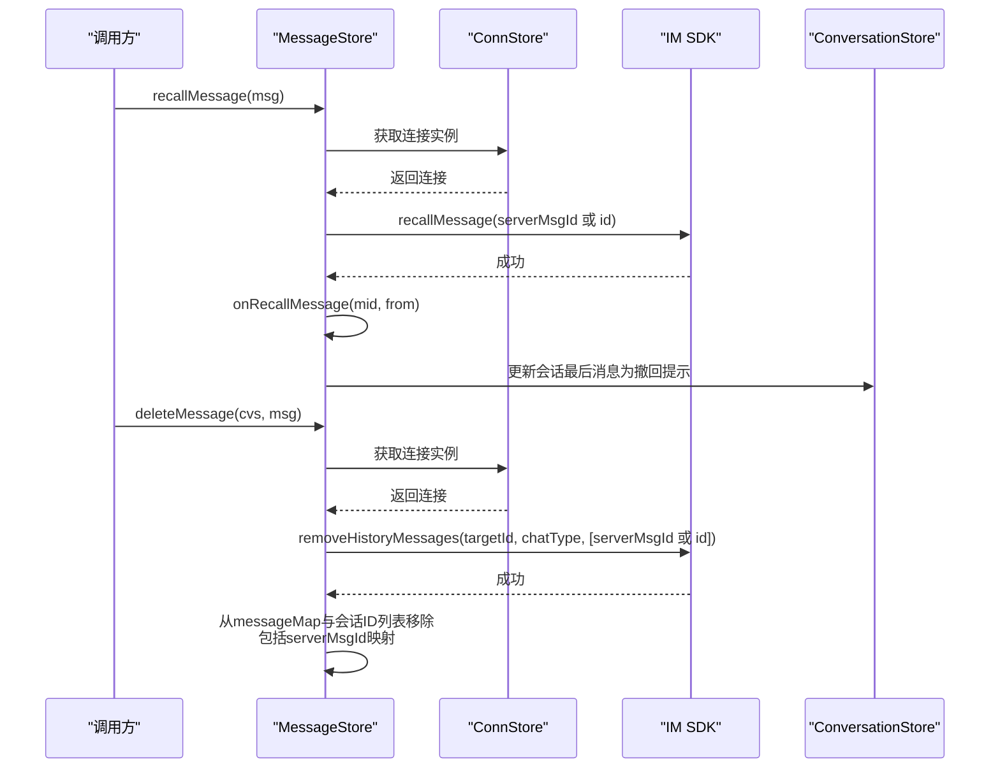

**图表来源**
- [message.ts:393-494](file://ChatUIKit/stores/message.ts#L393-L494)
- [conversation.ts:43-47](file://ChatUIKit/stores/conversation.ts#L43-L47)

**章节来源**
- [message.ts:393-494](file://ChatUIKit/stores/message.ts#L393-L494)

### 消息编辑功能与服务器消息ID处理
- modifyServerMessage动作：提供消息编辑功能，使用服务器消息ID确保编辑操作的准确性。
- 错误处理增强：包含完整的错误处理和兼容性检查，确保消息编辑的可靠性。
- 双向更新：同时更新本地消息ID和服务器消息ID对应的记录，保持数据一致性。
- 事件处理：通过updateModifiedMessage处理服务器端消息修改事件。
- 调试基础设施：包含详细的日志输出，便于追踪消息编辑过程。
- modifiedInfo结构：新增消息修改状态跟踪，包含修改操作员ID、修改次数和修改时间。

**更新** 新增modifyServerMessage动作，提供完整的消息编辑功能，包含增强的错误处理和服务器消息ID一致性保证。引入modifiedInfo结构，支持消息修改状态的完整跟踪。

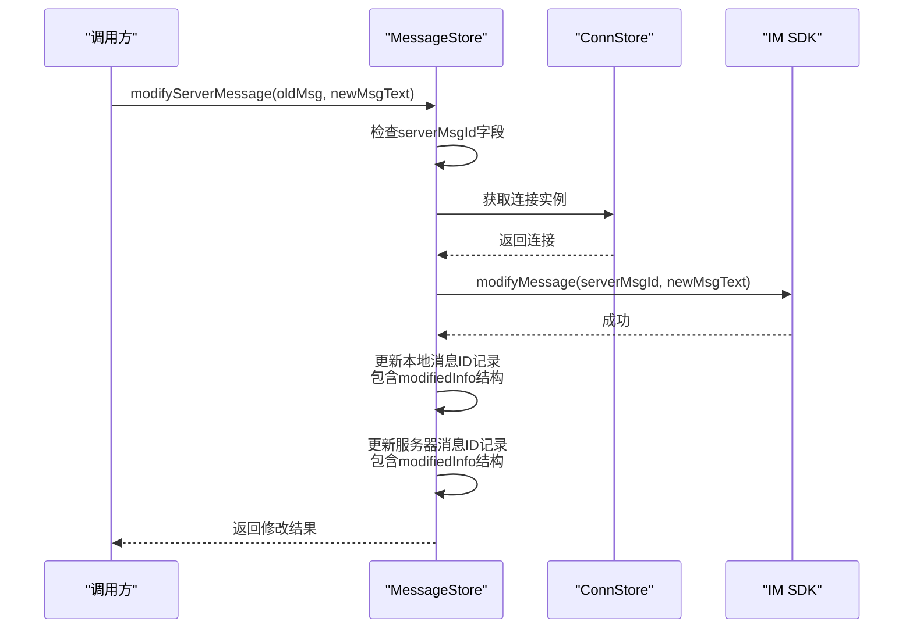

**图表来源**
- [message.ts:610-669](file://ChatUIKit/stores/message.ts#L610-L669)

**章节来源**
- [message.ts:610-669](file://ChatUIKit/stores/message.ts#L610-L669)

### 消息状态与UI交互
- 状态标识：消息状态包括发送中(sending)、已发送(sent)、已接收(received)、已读(read)、未读(unread)、失败(failed)等。
- 图标状态显示：消息项组件根据状态显示不同的状态图标，如旋转加载(spinner.png)、勾选(check.png)、失败(failed.png)、已接收(received.png)、已读(read.png)等。
- CSS动画效果：发送中状态使用旋转动画，提供流畅的视觉反馈。
- 条件渲染：仅当消息由当前用户发送且开启消息状态功能时才显示状态指示器。

**更新** 消息状态显示已从文本改为图标，支持PNG格式图标和CSS动画效果。新增了完整的功能配置管理，支持动态控制消息状态显示功能。

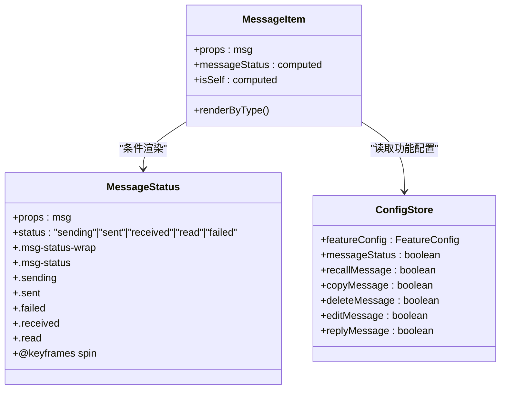

**图表来源**
- [messageStatus.vue:1-95](file://ChatUIKit/modules/Chat/components/Message/messageStatus.vue#L1-L95)
- [messageItem.vue:37-40](file://ChatUIKit/modules/Chat/components/Message/messageItem.vue#L37-L40)
- [config.ts:40-47](file://ChatUIKit/stores/config.ts#L40-L47)
- [configType.ts:3-23](file://ChatUIKit/configType.ts#L3-L23)

**章节来源**
- [types/index.ts:46-52](file://ChatUIKit/types/index.ts#L46-L52)
- [messageStatus.vue:1-95](file://ChatUIKit/modules/Chat/components/Message/messageStatus.vue#L1-L95)
- [messageItem.vue:37-40](file://ChatUIKit/modules/Chat/components/Message/messageItem.vue#L37-L40)
- [config.ts:40-47](file://ChatUIKit/stores/config.ts#L40-L47)
- [configType.ts:3-23](file://ChatUIKit/configType.ts#L3-L23)

### 实时状态更新与已读回执
- 已读回执：通过ChatStore监听SDK的onReadMessage事件，实时更新消息状态为已读。
- 状态同步：确保消息状态与服务器状态保持一致，提供准确的视觉反馈。
- 事件处理：统一处理各种SDK事件，包括消息接收、撤回、已读等。

**更新** 新增ChatStore专门处理SDK事件，包括消息已读回执的实时更新。增强了错误处理机制，确保事件处理的稳定性。

**章节来源**
- [chat.ts:126-130](file://ChatUIKit/stores/chat.ts#L126-L130)
- [message.ts:498-504](file://ChatUIKit/stores/message.ts#L498-L504)

### 内存管理与缓存策略
- 最大消息数量：每会话最多保留固定数量的消息，超出阈值时自动清理最早的消息及其映射。
- 清理范围：删除消息ID列表中的最早部分，更新游标与"是否到达末尾"标志，确保后续加载正确。
- 服务器消息ID清理：清理时同时移除本地消息ID和服务器消息ID映射，保持数据一致性。
- 全局清理：支持清空单个会话或全部消息数据，便于切换账号或重置状态。

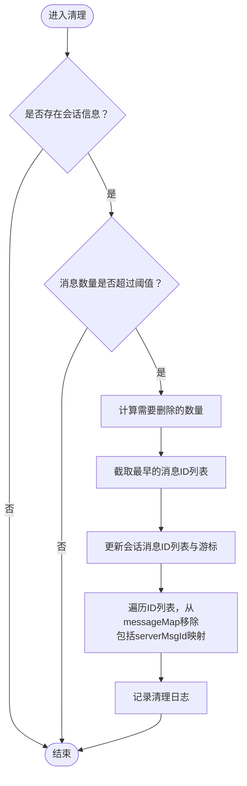

**图表来源**
- [message.ts:530-554](file://ChatUIKit/stores/message.ts#L530-L554)
- [index.ts:14-15](file://ChatUIKit/const/index.ts#L14-L15)

**章节来源**
- [message.ts:530-554](file://ChatUIKit/stores/message.ts#L530-L554)
- [index.ts:14-15](file://ChatUIKit/const/index.ts#L14-L15)

### 用户身份识别与错误处理机制
- 用户身份识别：通过ConnStore.getChatConn.user获取当前用户ID，确保消息撤回时的正确用户身份判断。
- 错误处理：统一使用logger.error记录错误信息，提供完整的错误堆栈和上下文信息。
- 事件处理：在recallMessage方法中增加try-catch块，确保异常情况下的状态恢复和错误上报。
- 服务器消息ID验证：modifyServerMessage动作包含完整的服务器消息ID验证和错误处理。

**更新** 服务器消息ID处理机制得到显著改进，确保历史消息和接收到的消息都正确保存 serverMsgId 字段。modifyServerMessage 动作增强了错误处理和兼容性。

**章节来源**
- [message.ts:393-413](file://ChatUIKit/stores/message.ts#L393-L413)
- [message.ts:418-457](file://ChatUIKit/stores/message.ts#L418-L457)
- [message.ts:610-669](file://ChatUIKit/stores/message.ts#L610-L669)
- [log.ts:60-78](file://ChatUIKit/log.ts#L60-L78)

### 消息编辑组件与交互
- 编辑状态管理：通过 setEditingMessage 动作管理当前编辑的消息状态。
- 实时编辑：消息编辑组件提供实时文本编辑功能，支持取消和确认操作。
- 类型安全：使用 Chat.ModifiedMsg 类型确保编辑消息的结构完整性。
- 状态反馈：编辑完成后自动清除编辑状态，确保UI状态的一致性。

**更新** 新增了完整的消息编辑组件，支持实时编辑和状态反馈。setEditingMessage 动作已重构为 Pinia store 中的独立 action，提供更好的状态管理。

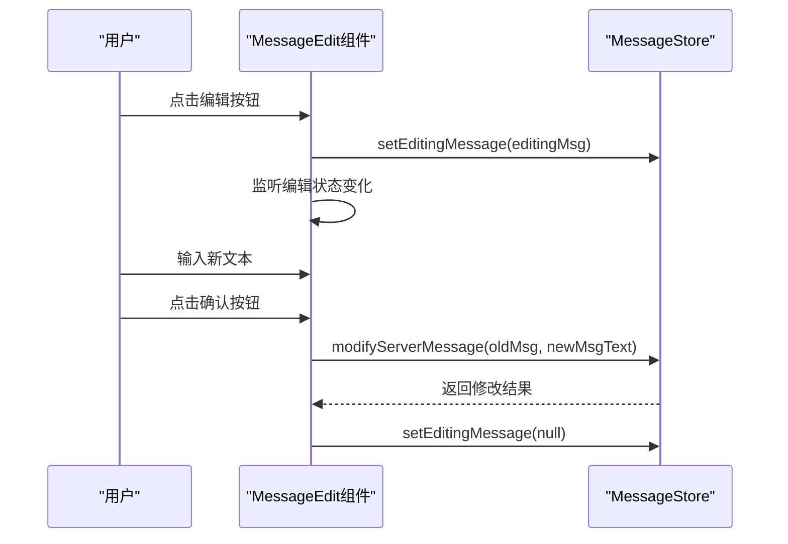

**图表来源**
- [messageEdit.vue:52-73](file://ChatUIKit/modules/Chat/components/Message/messageEdit.vue#L52-L73)
- [message.ts:516-518](file://ChatUIKit/stores/message.ts#L516-L518)

**章节来源**
- [messageEdit.vue:1-147](file://ChatUIKit/modules/Chat/components/Message/messageEdit.vue#L1-L147)
- [message.ts:516-518](file://ChatUIKit/stores/message.ts#L516-L518)

## 依赖关系分析
- 组件耦合
  - MessageStore与ConversationStore强耦合：前者负责消息状态，后者负责会话状态，二者通过会话ID关联。
  - MessageStore与ConnStore弱耦合：仅在需要检查连接状态或调用SDK时使用。
  - MessageStore与ConfigStore：通过功能配置控制消息状态显示的启用/禁用。
  - MessageStore与ChatStore：通过SDK事件处理实时更新消息状态。
  - UI组件与Store松耦合：通过Pinia响应式绑定，减少直接依赖。
  - Logger与各Store：统一的日志记录机制，便于问题追踪。
  - MessageEdit组件与MessageStore：通过setEditingMessage和modifyServerMessage动作进行交互。
- 外部依赖
  - IM SDK：通过chatSDK封装，提供消息发送、接收、历史消息拉取、撤回、删除、编辑等能力。
  - 类型系统：确保消息状态与消息体的类型安全，现包含服务器消息ID字段定义和 modifiedInfo 结构。
  - 日志工具：统一记录关键操作，便于问题追踪。

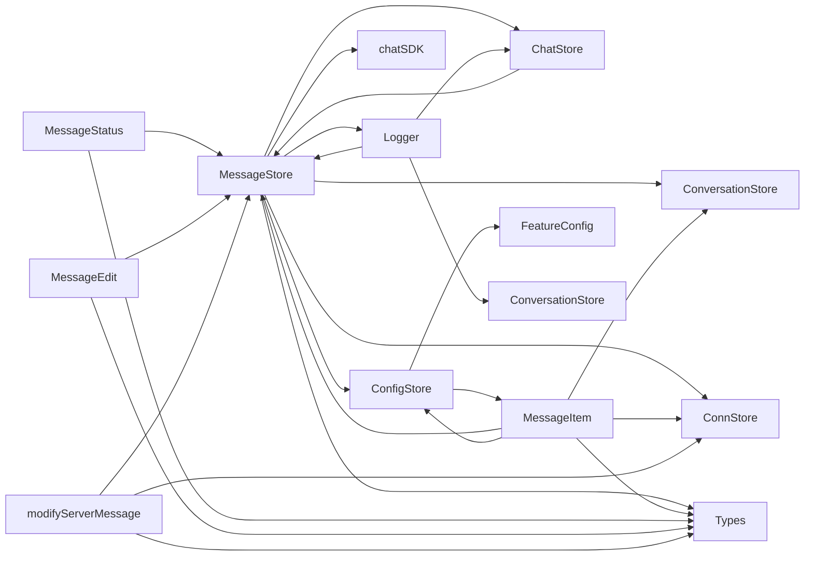

**图表来源**
- [message.ts:18-23](file://ChatUIKit/stores/message.ts#L18-L23)
- [conversation.ts:18-21](file://ChatUIKit/stores/conversation.ts#L18-L21)
- [conn.ts:11-13](file://ChatUIKit/stores/conn.ts#L11-L13)
- [config.ts:10-12](file://ChatUIKit/stores/config.ts#L10-L12)
- [chat.ts:12-18](file://ChatUIKit/stores/chat.ts#L12-L18)
- [sdk.ts:1-13](file://ChatUIKit/sdk.ts#L1-L13)
- [types/index.ts:1-100](file://ChatUIKit/types/index.ts#L1-L100)
- [index.ts:1-37](file://ChatUIKit/const/index.ts#L1-L37)
- [log.ts:1-78](file://ChatUIKit/log.ts#L1-L78)
- [configType.ts:1-68](file://ChatUIKit/configType.ts#L1-L68)

**章节来源**
- [message.ts:18-23](file://ChatUIKit/stores/message.ts#L18-L23)
- [conversation.ts:18-21](file://ChatUIKit/stores/conversation.ts#L18-L21)
- [conn.ts:11-13](file://ChatUIKit/stores/conn.ts#L11-L13)
- [config.ts:10-12](file://ChatUIKit/stores/config.ts#L10-L12)
- [chat.ts:12-18](file://ChatUIKit/stores/chat.ts#L12-L18)
- [sdk.ts:1-13](file://ChatUIKit/sdk.ts#L1-L13)
- [types/index.ts:1-100](file://ChatUIKit/types/index.ts#L1-L100)
- [index.ts:1-37](file://ChatUIKit/const/index.ts#L1-L37)
- [log.ts:1-78](file://ChatUIKit/log.ts#L1-L78)
- [configType.ts:1-68](file://ChatUIKit/configType.ts#L1-L68)

## 性能考虑
- 数据结构选择
  - 使用对象映射存储消息体，查找复杂度O(1)，适合频繁查询与去重，现包含服务器消息ID字段和 modifiedInfo 结构。
  - 使用数组存储消息ID顺序，支持分页加载与顺序渲染，避免全量渲染。
- 分页加载
  - 固定页大小（如15条/页），结合游标与"是否到达末尾"标志，减少一次性加载压力。
- 内存控制
  - 严格限制每会话消息数量，超出阈值自动清理，防止内存泄漏。
  - 清理时同时移除映射与ID列表，包括服务器消息ID映射，保持数据一致性。
- 状态更新
  - 仅在必要时更新状态，避免不必要的响应式触发。
  - UI组件按需渲染，减少DOM操作。
- 图标优化
  - PNG图标格式提供更好的压缩和显示效果。
  - CSS动画使用硬件加速，提升旋转动画的流畅度。
- 功能配置
  - 通过ConfigStore统一管理消息状态显示功能，避免不必要的渲染开销。
- 错误处理
  - 统一的日志记录机制，便于性能监控和问题定位。
  - 异常情况下的状态恢复，确保系统稳定性。
- 服务器消息ID优化
  - 双向存储本地消息ID和服务器消息ID，减少查找开销。
  - 清理时同时处理两种ID映射，避免数据不一致。
- 消息编辑优化
  - modifiedInfo 结构提供高效的修改状态跟踪。
  - 调试基础设施支持性能监控和问题诊断。
  - setEditingMessage 动作重构提供更好的状态管理效率。

**更新** 新增服务器消息ID处理优化，包括双向存储和清理机制，提升消息编辑和状态同步的性能。引入 modifiedInfo 结构，支持消息修改状态的高效跟踪。

## 故障排查指南
- 发送失败
  - 现象：消息状态变为失败，UI显示失败图标。
  - 排查：检查连接状态、网络状况、SDK返回错误码；查看日志输出。
  - 处理：重试发送或提示用户稍后重试。
- 历史消息加载异常
  - 现象：历史消息无法加载或重复。
  - 排查：确认游标与"是否到达末尾"标志；检查去重合并逻辑。
  - 处理：重新发起加载，确保游标正确传递。
- 撤回消息显示异常
  - 现象：撤回消息未正确替换为提示消息。
  - 排查：确认SDK撤回成功、本地状态更新与会话最后消息更新。
  - 处理：刷新页面或重新加载会话。
- 用户身份识别错误
  - 现象：消息撤回时用户身份判断错误。
  - 排查：检查ConnStore.getChatConn.user是否正确获取；确认消息from字段。
  - 处理：验证用户登录状态，重新初始化连接。
- 错误处理机制异常
  - 现象：异常发生时无日志记录或状态未恢复。
  - 排查：检查logger.error调用；确认try-catch块是否正确执行。
  - 处理：完善错误处理逻辑，确保异常情况下的状态一致性。
- 内存占用过高
  - 现象：长时间使用后内存增长。
  - 排查：检查每会话消息数量阈值、清理逻辑是否生效。
  - 处理：调整阈值或手动清理会话消息。
- 图标显示问题
  - 现象：消息状态图标不显示或显示异常。
  - 排查：确认PNG图标文件是否存在、CSS样式是否正确应用。
  - 处理：检查资源路径和样式文件。
- 动画效果异常
  - 现象：旋转动画不工作或卡顿。
  - 排查：确认CSS动画定义、浏览器兼容性和硬件加速支持。
  - 处理：检查动画定义和浏览器性能设置。
- 功能配置失效
  - 现象：消息状态显示功能无法正常启用/禁用。
  - 排查：检查ConfigStore.featureConfig配置；确认消息状态组件的条件渲染逻辑。
  - 处理：重新设置功能配置，验证消息状态显示逻辑。
- 服务器消息ID不一致
  - 现象：消息编辑或状态同步时出现ID不匹配。
  - 排查：检查消息发送时是否正确保存serverMsgId字段；确认清理逻辑是否移除serverMsgId映射。
  - 处理：验证消息存储逻辑，确保双向ID映射的完整性。
- 消息编辑功能异常
  - 现象：modifyServerMessage动作失败或状态不同步。
  - 排查：检查服务器消息ID验证逻辑；确认错误处理和兼容性检查；查看调试日志输出。
  - 处理：完善错误处理机制，验证服务器消息ID的一致性。
- 编辑状态管理问题
  - 现象：消息编辑状态无法正确设置或清除。
  - 排查：检查 setEditingMessage 动作的调用；确认消息编辑组件的状态绑定。
  - 处理：验证 Pinia store 的状态更新逻辑。
- modifiedInfo 结构异常
  - 现象：消息修改状态跟踪不准确或丢失。
  - 排查：检查 modifiedInfo 结构的更新逻辑；确认消息编辑过程中的状态记录。
  - 处理：验证消息修改事件的处理和状态同步。

**更新** 新增服务器消息ID不一致和消息编辑功能异常的故障排查指南。新增编辑状态管理和 modifiedInfo 结构异常的故障排查指导。

**章节来源**
- [message.ts:332-335](file://ChatUIKit/stores/message.ts#L332-L335)
- [message.ts:190-196](file://ChatUIKit/stores/message.ts#L190-L196)
- [message.ts:418-457](file://ChatUIKit/stores/message.ts#L418-L457)
- [message.ts:530-554](file://ChatUIKit/stores/message.ts#L530-L554)
- [messageStatus.vue:57-91](file://ChatUIKit/modules/Chat/components/Message/messageStatus.vue#L57-L91)
- [log.ts:37-74](file://ChatUIKit/log.ts#L37-L74)
- [config.ts:100-113](file://ChatUIKit/stores/config.ts#L100-L113)
- [message.ts:610-669](file://ChatUIKit/stores/message.ts#L610-L669)
- [messageEdit.vue:52-73](file://ChatUIKit/modules/Chat/components/Message/messageEdit.vue#L52-L73)

## 结论
消息状态管理Store通过清晰的双层结构设计、严格的去重与分页策略、完善的会话联动与内存控制，实现了高效、稳定的消息状态管理。配合类型系统与日志工具，能够有效保障消息状态的一致性与可维护性。

**更新** 新版本的消息状态管理系统已从传统的文本状态升级为现代化的图标状态，支持PNG图标和CSS动画效果，提供更好的用户体验。通过ConfigStore的功能配置管理和ChatStore的实时事件处理，系统具备了更强的灵活性和实时性。新增的modifyServerMessage动作和增强的服务器消息ID处理机制，进一步提升了系统的完整性和可靠性。

在实际使用中，建议根据业务场景合理设置每会话消息数量阈值，并关注发送失败与历史消息加载等关键路径的日志输出，以便快速定位与解决问题。同时，充分利用消息状态显示功能配置，为用户提供最佳的视觉反馈体验。对于消息编辑功能，应特别注意服务器消息ID的一致性，确保编辑操作的正确性和安全性。服务器消息ID处理机制的改进为消息编辑、撤回、删除等功能提供了更可靠的基础支撑。

**更新** 新版本的调试基础设施提供了详细的日志输出，有助于开发者更好地理解和优化消息状态管理功能。modifiedInfo 结构的引入使得消息修改状态的跟踪更加精确和高效，为消息编辑功能提供了坚实的技术基础。