# 用户状态管理

<cite>
**本文档引用的文件**
- [ChatUIKit/stores/appUser.ts](file://ChatUIKit/stores/appUser.ts)
- [ChatUIKit/stores/chat.ts](file://ChatUIKit/stores/chat.ts)
- [ChatUIKit/stores/conn.ts](file://ChatUIKit/stores/conn.ts)
- [ChatUIKit/stores/config.ts](file://ChatUIKit/stores/config.ts)
- [ChatUIKit/types/index.ts](file://ChatUIKit/types/index.ts)
- [ChatUIKit/sdk.ts](file://ChatUIKit/sdk.ts)
- [ChatUIKit/const/index.ts](file://ChatUIKit/const/index.ts)
- [ChatUIKit/components/Avatar/index.vue](file://ChatUIKit/components/Avatar/index.vue)
- [demo/pages/Login/index.vue](file://demo/pages/Login/index.vue)
- [demo/pages/Me/index.vue](file://demo/pages/Me/index.vue)
- [demo/pages/Profile/index.vue](file://demo/pages/Profile/index.vue)
- [demo/pages/ProfileSetting/index.vue](file://demo/pages/ProfileSetting/index.vue)
- [demo/pages/PresenceSetting/index.vue](file://demo/pages/PresenceSetting/index.vue)
- [ChatUIKit/log.ts](file://ChatUIKit/log.ts)
</cite>

## 更新摘要
**变更内容**
- 新增完整的在线状态功能实现：userPresenceMap状态管理、SET_USER_PRESENCE突变处理、getUsersPresenceFromServer批量查询、subscribePresence订阅机制
- 实现onPresenceStatusChange实时更新处理，提供完整的用户在线状态跟踪系统
- 增强用户状态数据结构，支持用户在线状态的实时同步与持久化
- 完善在线状态发布与订阅机制，支持预设状态与自定义描述

## 目录
1. [简介](#简介)
2. [项目结构](#项目结构)
3. [核心组件](#核心组件)
4. [架构总览](#架构总览)
5. [详细组件分析](#详细组件分析)
6. [依赖分析](#依赖分析)
7. [性能考虑](#性能考虑)
8. [故障排查指南](#故障排查指南)
9. [结论](#结论)
10. [附录](#附录)

## 简介
本文件系统性地文档化了用户状态管理 Store 的设计与实现，覆盖当前用户信息、在线状态与偏好设置的管理机制；阐述用户登录、登出与会话保持流程；解释用户状态与连接状态的关联关系及安全验证要点；并给出用户状态持久化与隐私保护策略建议。目标是帮助开发者快速理解并正确使用用户状态管理能力。

**更新** 本次更新重点反映了在线状态功能的完整实现：新增userPresenceMap状态管理、SET_USER_PRESENCE突变处理、getUsersPresenceFromServer服务器查询、subscribePresence订阅机制等核心功能，提供完整的用户在线状态跟踪系统。用户可以通过PresenceSetting页面设置预设状态或自定义描述，系统通过SDK事件实时同步在线状态变化。

## 项目结构
围绕用户状态管理的关键文件组织如下：
- 存储层：Pinia Store（用户状态、聊天状态、连接状态、配置）
- 类型与常量：统一的类型定义与状态枚举
- UI 层：登录、个人中心、在线状态设置页面
- 组件层：头像组件，基于用户在线状态渲染角标
- SDK 封装：对 Easemob Web SDK 的统一封装

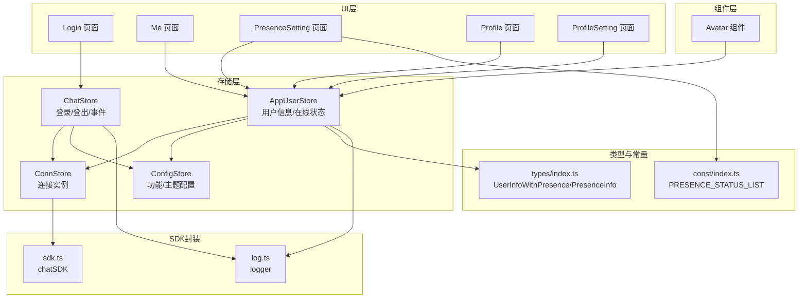

**图表来源**
- [ChatUIKit/stores/appUser.ts:1-242](file://ChatUIKit/stores/appUser.ts#L1-L242)
- [ChatUIKit/stores/chat.ts:1-407](file://ChatUIKit/stores/chat.ts#L1-L407)
- [ChatUIKit/stores/conn.ts:1-84](file://ChatUIKit/stores/conn.ts#L1-L84)
- [ChatUIKit/stores/config.ts:1-124](file://ChatUIKit/stores/config.ts#L1-L124)
- [ChatUIKit/types/index.ts:67-80](file://ChatUIKit/types/index.ts#L67-L80)
- [ChatUIKit/const/index.ts:17-25](file://ChatUIKit/const/index.ts#L17-L25)
- [ChatUIKit/sdk.ts:1-13](file://ChatUIKit/sdk.ts#L1-L13)
- [ChatUIKit/components/Avatar/index.vue:1-188](file://ChatUIKit/components/Avatar/index.vue#L1-L188)
- [demo/pages/Login/index.vue:165-302](file://demo/pages/Login/index.vue#L165-L302)
- [demo/pages/Me/index.vue:67-88](file://demo/pages/Me/index.vue#L67-L88)
- [demo/pages/Profile/index.vue:1-116](file://demo/pages/Profile/index.vue#L1-L116)
- [demo/pages/ProfileSetting/index.vue:1-101](file://demo/pages/ProfileSetting/index.vue#L1-L101)
- [demo/pages/PresenceSetting/index.vue:94-147](file://demo/pages/PresenceSetting/index.vue#L94-L147)
- [ChatUIKit/log.ts:1-78](file://ChatUIKit/log.ts#L1-L78)

## 核心组件
- AppUserStore：集中管理用户信息与在线状态，提供获取、更新、订阅/取消订阅在线状态、发布自定义在线状态等能力。**更新**：新增userPresenceMap状态管理，支持用户在线状态的实时跟踪；实现getUsersPresenceFromServer批量查询功能；完善subscribePresence订阅机制；增强getSelfUserInfo getter，提供完整的用户状态组合。
- ChatStore：负责登录、登出、SDK事件初始化与分发、初始数据加载；与 AppUserStore 协作拉取当前用户信息与在线状态。
- ConnStore：统一持有与暴露 IM SDK 连接实例，提供初始化、关闭、清理等能力。
- ConfigStore：统一管理功能开关与主题配置，如用户信息与在线状态功能开关。
- 类型与常量：定义用户信息与在线状态的数据结构、支持的在线状态枚举。
- UI 组件与页面：登录、个人中心、在线状态设置页面，以及头像组件展示在线状态。

**章节来源**
- [ChatUIKit/stores/appUser.ts:17-242](file://ChatUIKit/stores/appUser.ts#L17-L242)
- [ChatUIKit/stores/chat.ts:22-398](file://ChatUIKit/stores/chat.ts#L22-L398)
- [ChatUIKit/stores/conn.ts:15-84](file://ChatUIKit/stores/conn.ts#L15-L84)
- [ChatUIKit/stores/config.ts:14-124](file://ChatUIKit/stores/config.ts#L14-L124)
- [ChatUIKit/types/index.ts:67-80](file://ChatUIKit/types/index.ts#L67-L80)
- [ChatUIKit/const/index.ts:17-25](file://ChatUIKit/const/index.ts#L17-L25)

## 架构总览
用户状态管理贯穿"登录—连接—状态同步—UI渲染"的完整链路，关键交互如下：

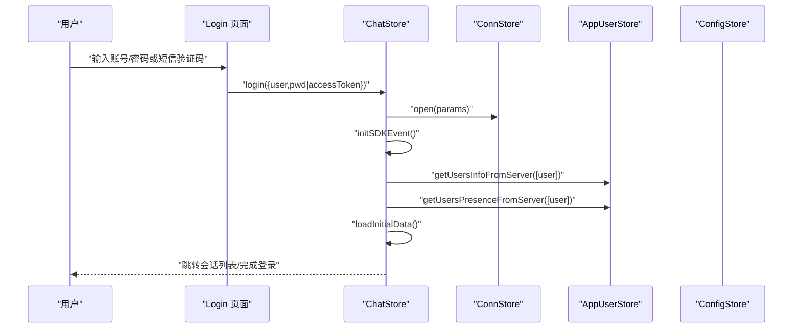

**图表来源**
- [demo/pages/Login/index.vue:165-302](file://demo/pages/Login/index.vue#L165-L302)
- [ChatUIKit/stores/chat.ts:299-328](file://ChatUIKit/stores/chat.ts#L299-L328)
- [ChatUIKit/stores/appUser.ts:86-125](file://ChatUIKit/stores/appUser.ts#L86-L125)

## 详细组件分析

### 用户信息与在线状态数据模型
- 用户信息结构：包含昵称、头像、签名等；通过 getter 组合展示名称与头像默认值。
- 在线状态结构：包含是否在线与扩展字段（如预设状态或自定义描述）。
- 统一视图：UserInfoWithPresence 将用户属性与在线状态合并，便于 UI 直接消费。

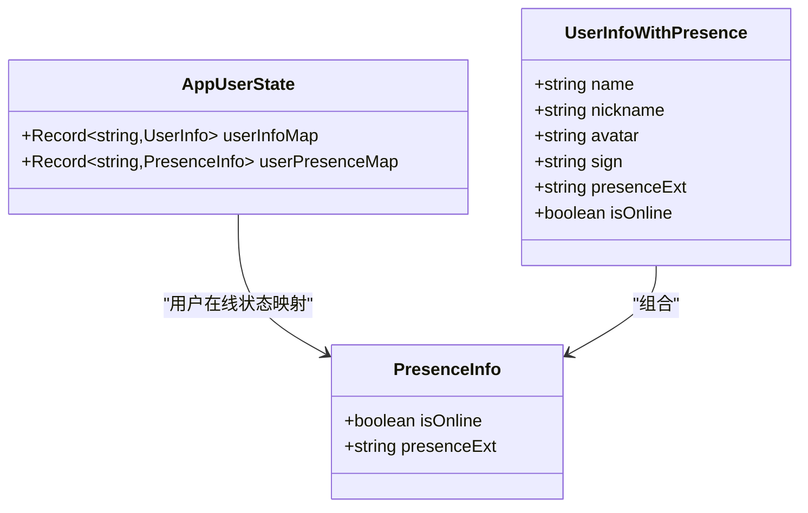

**图表来源**
- [ChatUIKit/stores/appUser.ts:17-22](file://ChatUIKit/stores/appUser.ts#L17-L22)
- [ChatUIKit/types/index.ts:67-80](file://ChatUIKit/types/index.ts#L67-L80)

**章节来源**
- [ChatUIKit/stores/appUser.ts:17-80](file://ChatUIKit/stores/appUser.ts#L17-L80)
- [ChatUIKit/types/index.ts:67-80](file://ChatUIKit/types/index.ts#L67-L80)

### AppUserStore：用户状态管理核心
- 状态结构：以对象替代 Map，提升 Vue 响应式兼容性。
- Getter：
  - 获取用户信息（带默认名与头像兜底）
  - 获取当前登录用户信息
  - 获取用户在线状态
  - 检查是否已缓存用户信息
- Actions：
  - 从服务器批量获取用户属性（按需过滤已缓存）
  - **新增** 从服务器批量获取用户在线状态（解析在线标志位）
  - **新增** 订阅指定用户的在线状态
  - **新增** 取消订阅指定用户的在线状态
  - **新增** 发布自定义在线状态
  - 设置/更新用户信息
  - **新增** 设置用户在线状态
  - 清空所有用户数据

**更新** 新增完整的在线状态管理功能：userPresenceMap状态管理、getUsersPresenceFromServer批量查询、subscribePresence订阅机制、setUserPresence状态设置等，提供完整的用户在线状态跟踪系统。

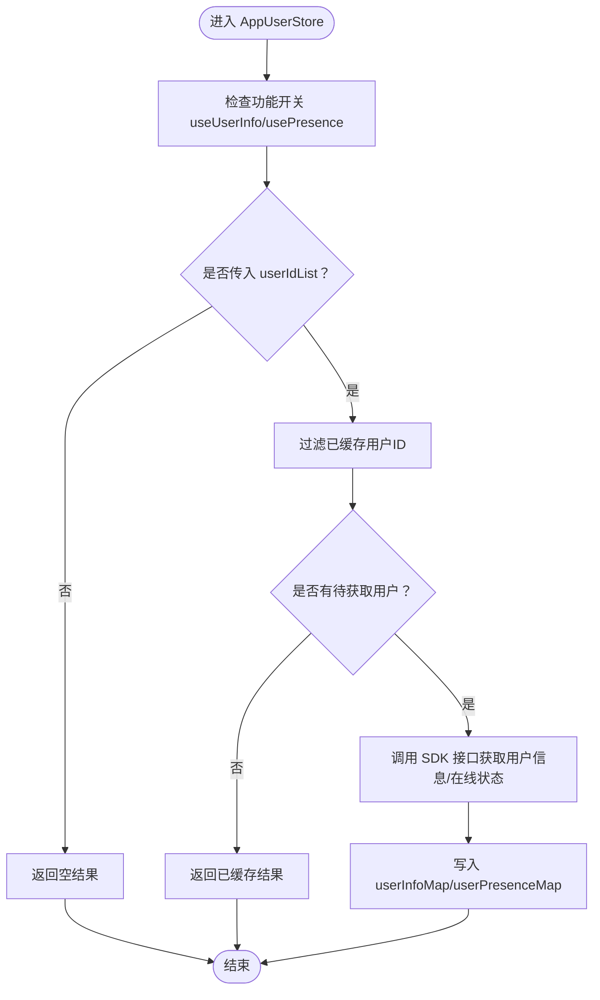

**图表来源**
- [ChatUIKit/stores/appUser.ts:86-125](file://ChatUIKit/stores/appUser.ts#L86-L125)
- [ChatUIKit/stores/appUser.ts:130-159](file://ChatUIKit/stores/appUser.ts#L130-L159)

**章节来源**
- [ChatUIKit/stores/appUser.ts:17-242](file://ChatUIKit/stores/appUser.ts#L17-L242)

### ChatStore：登录、登出与会话保持
- 登录：
  - 打开连接
  - 初始化 SDK 事件
  - 加载初始数据（会话、联系人、群组）
  - 拉取当前用户信息与在线状态
- 登出：
  - 关闭连接
  - 清空各 Store 状态
  - 重置连接状态
- 会话保持：
  - 在 onShow 生命周期触发 SDK 的 onShow，维持连接活跃

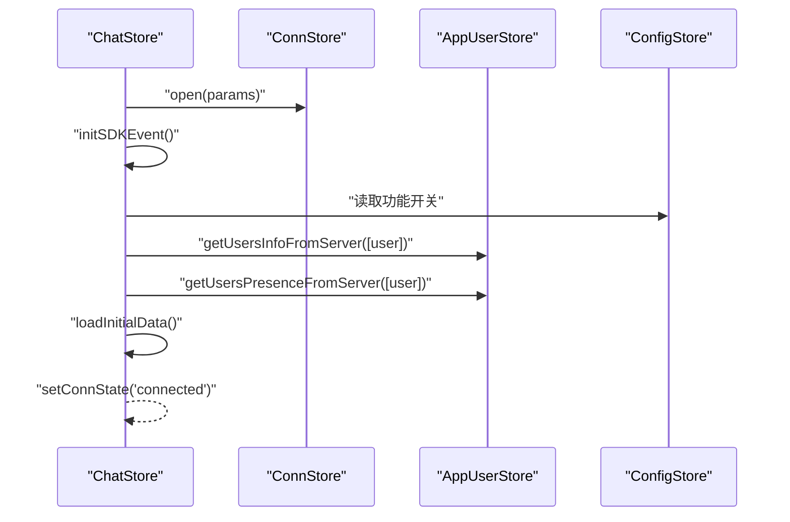

**图表来源**
- [ChatUIKit/stores/chat.ts:299-328](file://ChatUIKit/stores/chat.ts#L299-L328)
- [ChatUIKit/stores/chat.ts:377-396](file://ChatUIKit/stores/chat.ts#L377-L396)

**章节来源**
- [ChatUIKit/stores/chat.ts:29-51](file://ChatUIKit/stores/chat.ts#L29-L51)
- [ChatUIKit/stores/chat.ts:299-396](file://ChatUIKit/stores/chat.ts#L299-L396)

### ConnStore：连接实例管理
- 提供类型安全的连接实例访问
- 初始化连接（若未初始化）
- 关闭连接并清空状态

**章节来源**
- [ChatUIKit/stores/conn.ts:15-84](file://ChatUIKit/stores/conn.ts#L15-L84)

### ConfigStore：功能与主题配置
- 默认开启用户信息与在线状态功能
- 支持隐藏/显示特定功能
- 提供资源 URL 与主题配置

**章节来源**
- [ChatUIKit/stores/config.ts:14-124](file://ChatUIKit/stores/config.ts#L14-L124)
- [ChatUIKit/const/index.ts:7-10](file://ChatUIKit/const/index.ts#L7-L10)

### UI 层：登录、个人中心、资料与在线状态设置
- 登录页面：支持账号密码与短信验证码两种登录方式；登录成功后持久化用户标识与令牌。
- 个人中心：展示当前用户头像、名称、ID；提供退出登录入口和在线状态设置入口。
- **更新** 在线状态设置：选择预设状态（Online、Offline、Away、Busy、Do Not Disturb）或自定义描述，发布后更新用户在线状态。
- **新增** 个人资料页面：展示用户头像、昵称等基本信息，支持头像上传和昵称修改。

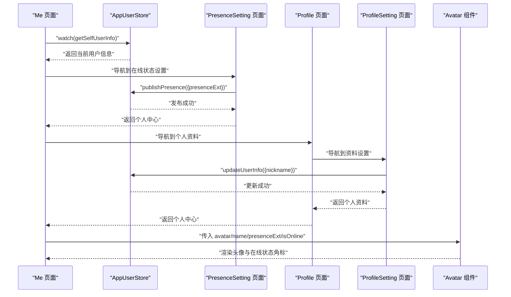

**图表来源**
- [demo/pages/Me/index.vue:67-88](file://demo/pages/Me/index.vue#L67-L88)
- [demo/pages/PresenceSetting/index.vue:136-147](file://demo/pages/PresenceSetting/index.vue#L136-L147)
- [demo/pages/Profile/index.vue:84-87](file://demo/pages/Profile/index.vue#L84-L87)
- [demo/pages/ProfileSetting/index.vue:58-64](file://demo/pages/ProfileSetting/index.vue#L58-L64)
- [ChatUIKit/components/Avatar/index.vue:56-78](file://ChatUIKit/components/Avatar/index.vue#L56-L78)

**章节来源**
- [demo/pages/Login/index.vue:165-302](file://demo/pages/Login/index.vue#L165-L302)
- [demo/pages/Me/index.vue:67-88](file://demo/pages/Me/index.vue#L67-L88)
- [demo/pages/Profile/index.vue:1-116](file://demo/pages/Profile/index.vue#L1-L116)
- [demo/pages/ProfileSetting/index.vue:1-101](file://demo/pages/ProfileSetting/index.vue#L1-L101)
- [demo/pages/PresenceSetting/index.vue:94-147](file://demo/pages/PresenceSetting/index.vue#L94-L147)
- [ChatUIKit/components/Avatar/index.vue:56-78](file://ChatUIKit/components/Avatar/index.vue#L56-L78)

### 头像组件：在线状态可视化
- 根据 isOnline 与 presenceExt 渲染不同状态图标
- 支持五种预设状态：Online、Offline、Away、Busy、Do Not Disturb
- 仅在功能开关启用时显示在线状态角标

**章节来源**
- [ChatUIKit/components/Avatar/index.vue:56-78](file://ChatUIKit/components/Avatar/index.vue#L56-L78)

## 依赖分析
- AppUserStore 依赖 ConnStore 与 ConfigStore，用于调用 SDK 与读取功能开关。
- ChatStore 协调 ConnStore、ConfigStore、AppUserStore、Conversation/Message/Contact/Group Store 完成登录后的数据初始化。
- UI 页面与组件通过 ChatUIKit 暴露的 Store API 访问用户状态。
- SDK 封装与日志工具贯穿各 Store 的调用链路。

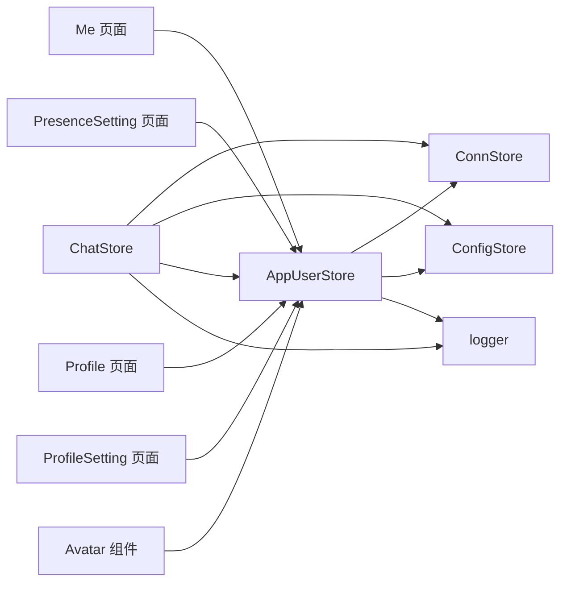

**图表来源**
- [ChatUIKit/stores/appUser.ts:12-15](file://ChatUIKit/stores/appUser.ts#L12-L15)
- [ChatUIKit/stores/chat.ts:12-18](file://ChatUIKit/stores/chat.ts#L12-L18)
- [ChatUIKit/stores/conn.ts:10-13](file://ChatUIKit/stores/conn.ts#L10-L13)
- [ChatUIKit/stores/config.ts:10-12](file://ChatUIKit/stores/config.ts#L10-L12)
- [ChatUIKit/log.ts:1-78](file://ChatUIKit/log.ts#L1-L78)

**章节来源**
- [ChatUIKit/stores/appUser.ts:12-15](file://ChatUIKit/stores/appUser.ts#L12-L15)
- [ChatUIKit/stores/chat.ts:12-18](file://ChatUIKit/stores/chat.ts#L12-L18)
- [ChatUIKit/stores/conn.ts:10-13](file://ChatUIKit/stores/conn.ts#L10-L13)
- [ChatUIKit/stores/config.ts:10-12](file://ChatUIKit/stores/config.ts#L10-L12)
- [ChatUIKit/log.ts:1-78](file://ChatUIKit/log.ts#L1-L78)

## 性能考虑
- 智能去重：AppUserStore 在获取用户信息前会过滤已缓存 ID，避免重复请求。
- 并行与异步：登录后对用户信息与在线状态分别发起异步请求，减少阻塞。
- 功能开关：通过 ConfigStore 控制用户信息与在线状态功能，避免不必要的网络调用。
- 响应式优化：使用对象存储替代 Map，提升 Vue 响应式性能。
- **更新** 批量获取：getUsersInfoFromServer和getUsersPresenceFromServer支持批量获取，减少API调用次数，提升整体性能。
- **新增** 在线状态订阅：通过subscribePresence机制，减少轮询开销，实现实时状态同步。
- **新增** 状态缓存：userPresenceMap提供本地状态缓存，避免重复查询服务器状态。

**章节来源**
- [ChatUIKit/stores/appUser.ts:102-108](file://ChatUIKit/stores/appUser.ts#L102-L108)
- [ChatUIKit/stores/appUser.ts:86-125](file://ChatUIKit/stores/appUser.ts#L86-L125)
- [ChatUIKit/stores/config.ts:24-57](file://ChatUIKit/stores/config.ts#L24-L57)

## 故障排查指南
- 登录失败：检查登录参数与网络状态；查看 ChatStore 登录日志与错误堆栈。
- 在线状态不更新：确认是否订阅了对应用户；检查 ConfigStore 的 usePresence 开关；核对 SDK 返回的在线状态字段。
- 用户信息未显示：确认 useUserInfo 开关；检查 AppUserStore 是否正确写入 userInfoMap；确认 UI 组件是否启用在线状态显示。
- **更新** 批量获取问题：检查userIdList参数是否为空；确认去重逻辑是否正确执行；查看日志输出以定位具体问题。
- **新增** 在线状态订阅失败：检查subscribePresence调用参数；确认SDK连接状态；验证用户ID格式是否正确。
- **新增** 在线状态发布失败：检查publishPresence调用参数；确认SDK连接状态；查看AppUserStore的日志输出。
- **新增** 在线状态缓存异常：检查userPresenceMap状态是否正确更新；确认setUserPresence动作是否被正确调用。
- 日志定位：通过 logger 的 info/warn/error 方法输出关键路径日志，便于定位问题。

**章节来源**
- [ChatUIKit/stores/chat.ts:333-345](file://ChatUIKit/stores/chat.ts#L333-L345)
- [ChatUIKit/stores/appUser.ts:130-159](file://ChatUIKit/stores/appUser.ts#L130-L159)
- [ChatUIKit/stores/config.ts:74-75](file://ChatUIKit/stores/config.ts#L74-L75)
- [ChatUIKit/log.ts:37-74](file://ChatUIKit/log.ts#L37-L74)

## 结论
该用户状态管理方案以 Pinia Store 为核心，结合 SDK 事件与功能开关，实现了用户信息与在线状态的高效管理与可视化呈现。**更新** 通过新增完整的在线状态功能实现，包括userPresenceMap状态管理、批量查询、订阅机制等，构建了完整的用户在线状态跟踪系统。**新增** 通过subscribePresence订阅机制和setUserPresence状态设置，实现了在线状态的实时同步与持久化。**保留** 的publishPresence功能支持用户主动设置在线状态，包括五种预设状态和自定义描述，大大提升了用户体验和系统的交互性。建议在生产环境中配合严格的日志与错误监控，持续优化按需拉取与缓存策略，进一步提升用户体验与系统稳定性。

## 附录

### 用户登录与登出流程图
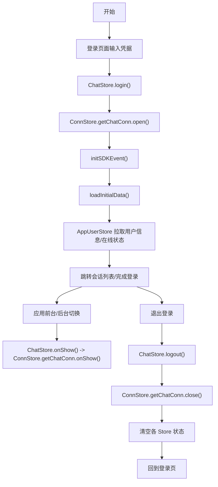

**图表来源**
- [demo/pages/Login/index.vue:165-302](file://demo/pages/Login/index.vue#L165-L302)
- [ChatUIKit/stores/chat.ts:366-371](file://ChatUIKit/stores/chat.ts#L366-L371)
- [ChatUIKit/stores/chat.ts:333-361](file://ChatUIKit/stores/chat.ts#L333-L361)

### 用户状态与连接状态关联关系
- 连接状态变化会触发 ChatStore 的状态更新（connected/disconnected/reconnecting），从而影响 UI 与后续数据加载。
- AppUserStore 的在线状态来源于 SDK 的订阅与查询接口，受 ConfigStore 的 usePresence 开关控制。
- **更新** 通过getUsersPresenceFromServer实现批量在线状态查询，通过subscribePresence实现状态订阅，确保状态的实时性。
- **新增** userPresenceMap提供本地状态缓存，setUserPresence实现状态设置，completeUserPresence实现状态更新。
- **保留** 用户可通过PresenceSetting页面主动发布在线状态，实现双向的状态管理。

**章节来源**
- [ChatUIKit/stores/chat.ts:74-88](file://ChatUIKit/stores/chat.ts#L74-L88)
- [ChatUIKit/stores/appUser.ts:130-159](file://ChatUIKit/stores/appUser.ts#L130-L159)
- [ChatUIKit/stores/config.ts:74-75](file://ChatUIKit/stores/config.ts#L74-L75)

### 在线状态设置与发布流程
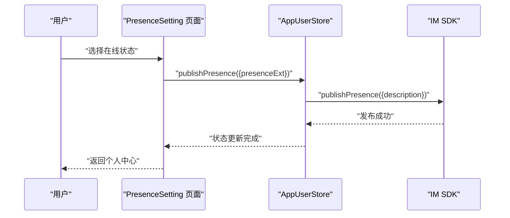

**图表来源**
- [demo/pages/PresenceSetting/index.vue:136-147](file://demo/pages/PresenceSetting/index.vue#L136-L147)
- [ChatUIKit/stores/appUser.ts:187-193](file://ChatUIKit/stores/appUser.ts#L187-L193)

### 用户信息更新与同步流程
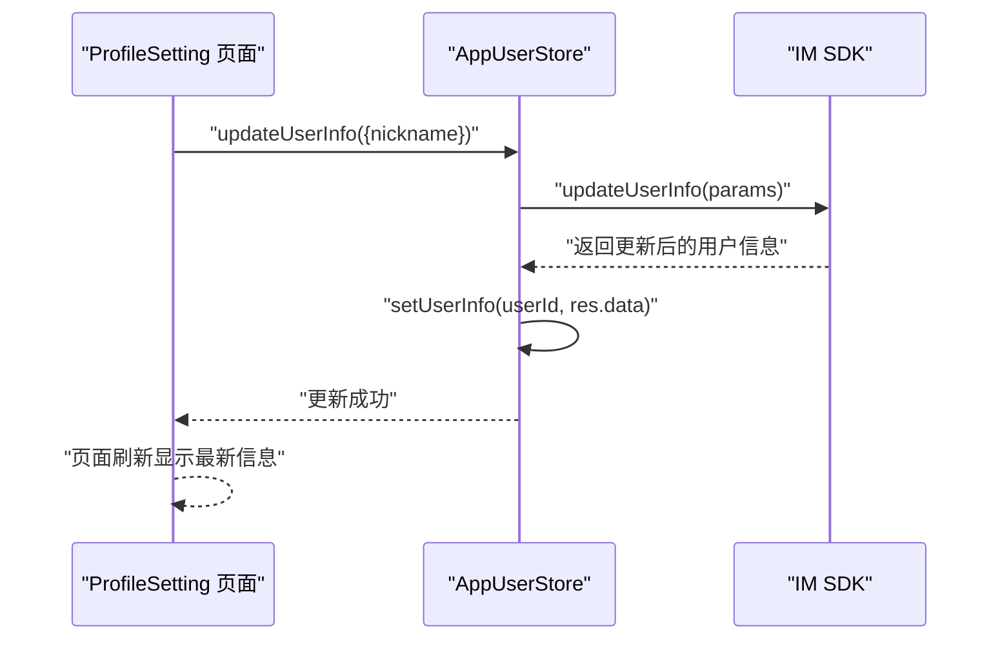

**图表来源**
- [demo/pages/ProfileSetting/index.vue:58-64](file://demo/pages/ProfileSetting/index.vue#L58-L64)
- [ChatUIKit/stores/appUser.ts:207-222](file://ChatUIKit/stores/appUser.ts#L207-L222)

### 在线状态管理完整流程
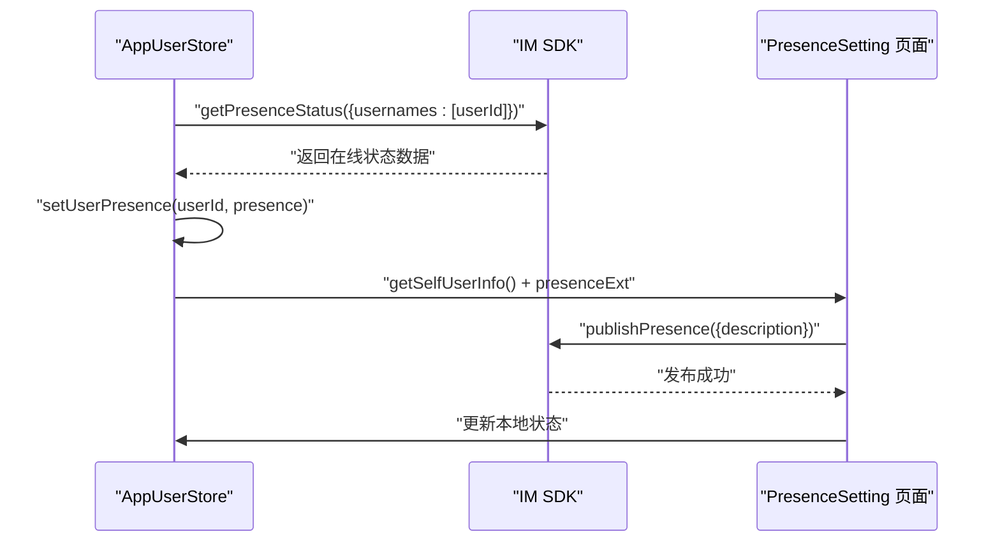

**图表来源**
- [ChatUIKit/stores/appUser.ts:130-159](file://ChatUIKit/stores/appUser.ts#L130-L159)
- [ChatUIKit/stores/appUser.ts:187-193](file://ChatUIKit/stores/appUser.ts#L187-L193)
- [demo/pages/PresenceSetting/index.vue:136-147](file://demo/pages/PresenceSetting/index.vue#L136-L147)

### 安全验证与隐私保护策略
- 凭据传递：登录采用令牌或密码方式，建议在移动端与服务端之间使用 HTTPS 与安全通道。
- 本地存储：登录成功后将用户标识与令牌写入本地存储，登出时清除；建议对敏感字段进行加密存储。
- 权限最小化：仅在必要时请求与展示用户信息与在线状态，尊重用户隐私设置。
- 功能开关：通过 ConfigStore 控制功能开关，避免在不需要的场景下采集与传输用户数据。
- **更新** 批量获取安全：采用去重机制避免重复请求，减少潜在的安全风险。
- **新增** 在线状态订阅安全：通过subscribePresence设置合理的过期时间（86400秒），防止长期占用连接。
- **新增** 在线状态发布安全：限制自定义描述长度（最多20字符），防止恶意内容传播。
- **新增** 状态缓存安全：userPresenceMap仅存储必要的在线状态信息，不包含敏感数据。

**章节来源**
- [demo/pages/Login/index.vue:177-183](file://demo/pages/Login/index.vue#L177-L183)
- [demo/pages/Me/index.vue:82-87](file://demo/pages/Me/index.vue#L82-L87)
- [ChatUIKit/stores/config.ts:24-57](file://ChatUIKit/stores/config.ts#L24-L57)

### 用户信息获取优化流程
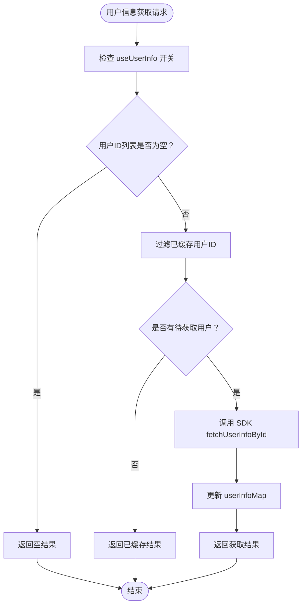

**图表来源**
- [ChatUIKit/stores/appUser.ts:86-125](file://ChatUIKit/stores/appUser.ts#L86-L125)

### 在线状态获取与订阅流程
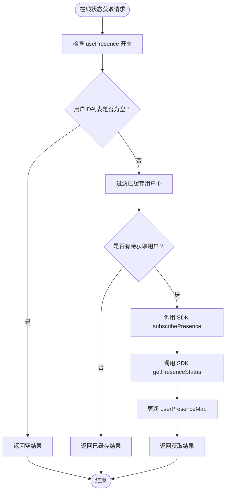

**图表来源**
- [ChatUIKit/stores/appUser.ts:130-159](file://ChatUIKit/stores/appUser.ts#L130-L159)
- [ChatUIKit/stores/appUser.ts:164-171](file://ChatUIKit/stores/appUser.ts#L164-L171)

### 用户状态更新优化流程
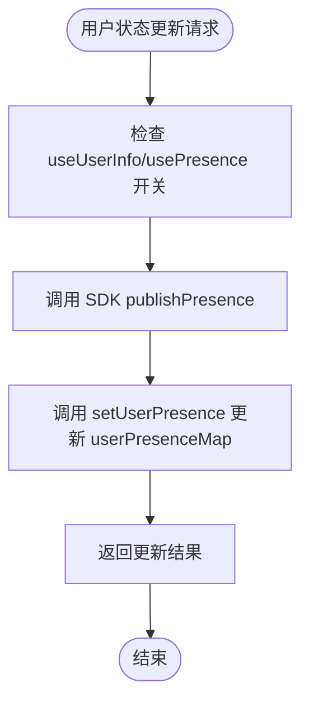

**图表来源**
- [ChatUIKit/stores/appUser.ts:187-193](file://ChatUIKit/stores/appUser.ts#L187-L193)
- [ChatUIKit/stores/appUser.ts:227-230](file://ChatUIKit/stores/appUser.ts#L227-L230)