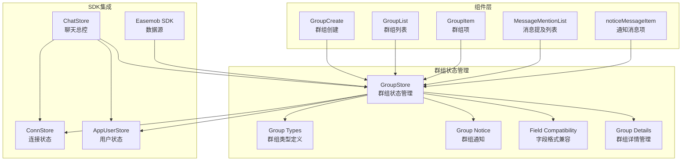
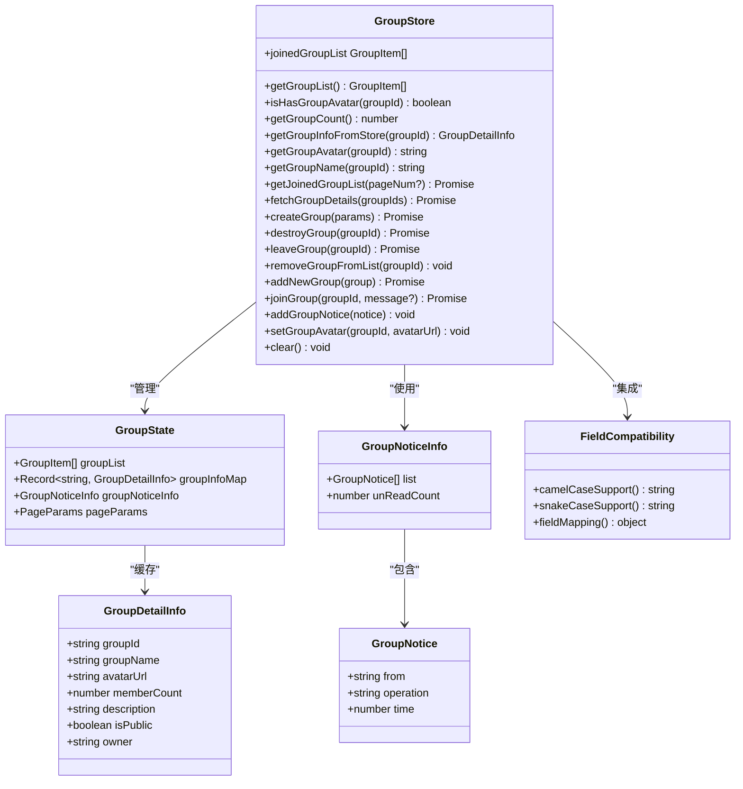
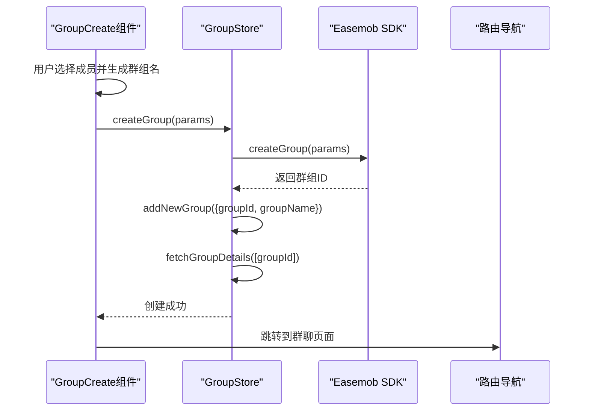
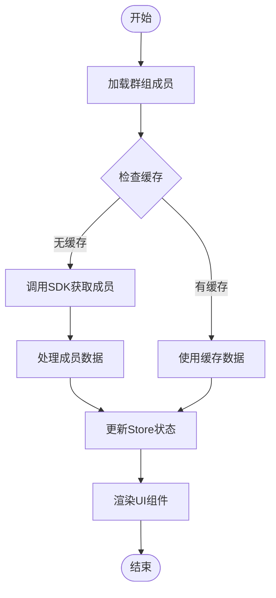
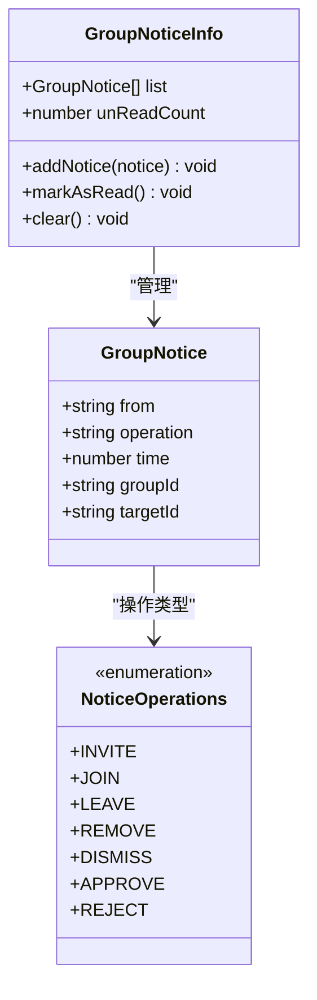
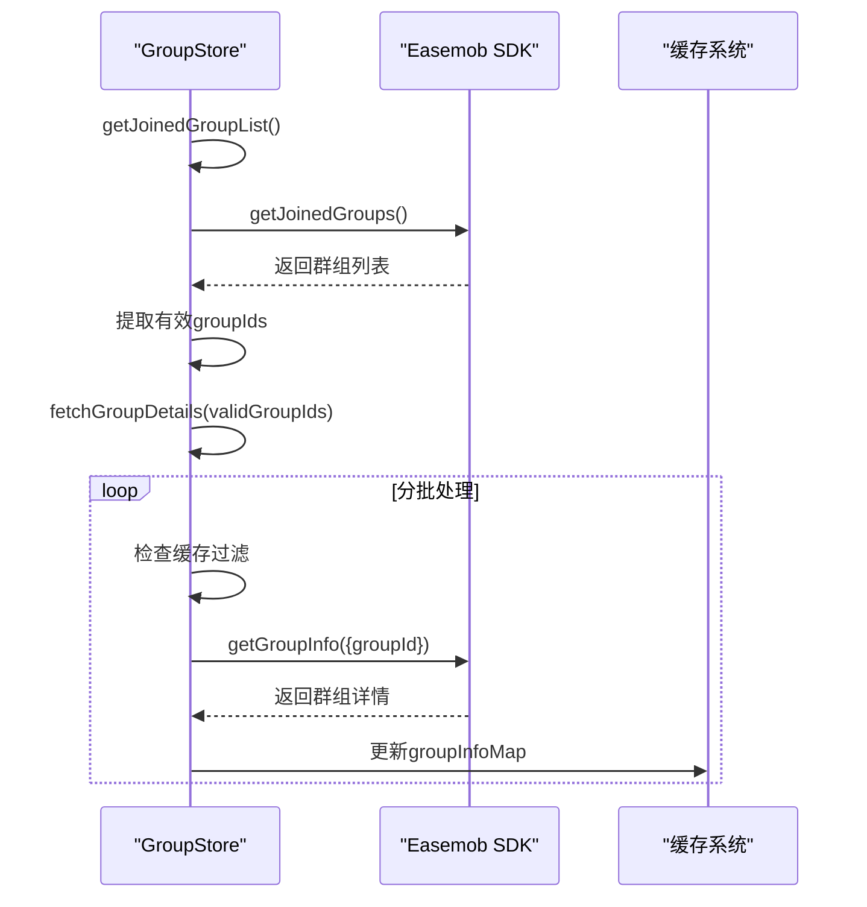
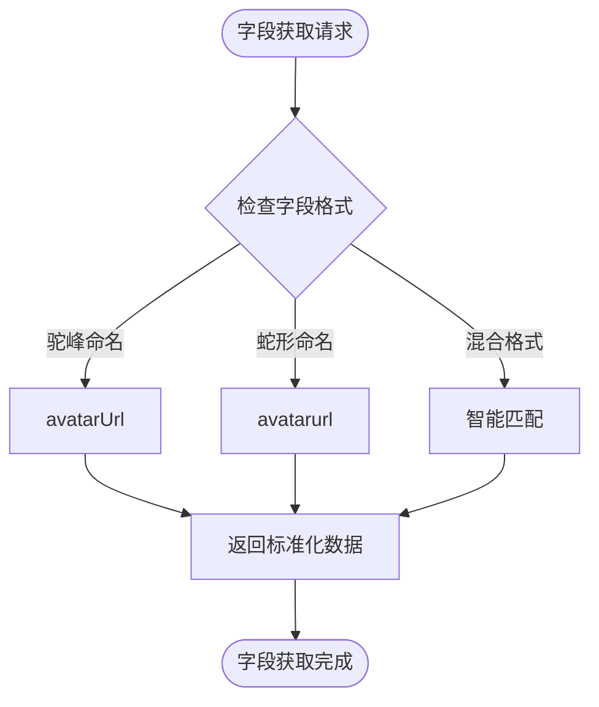
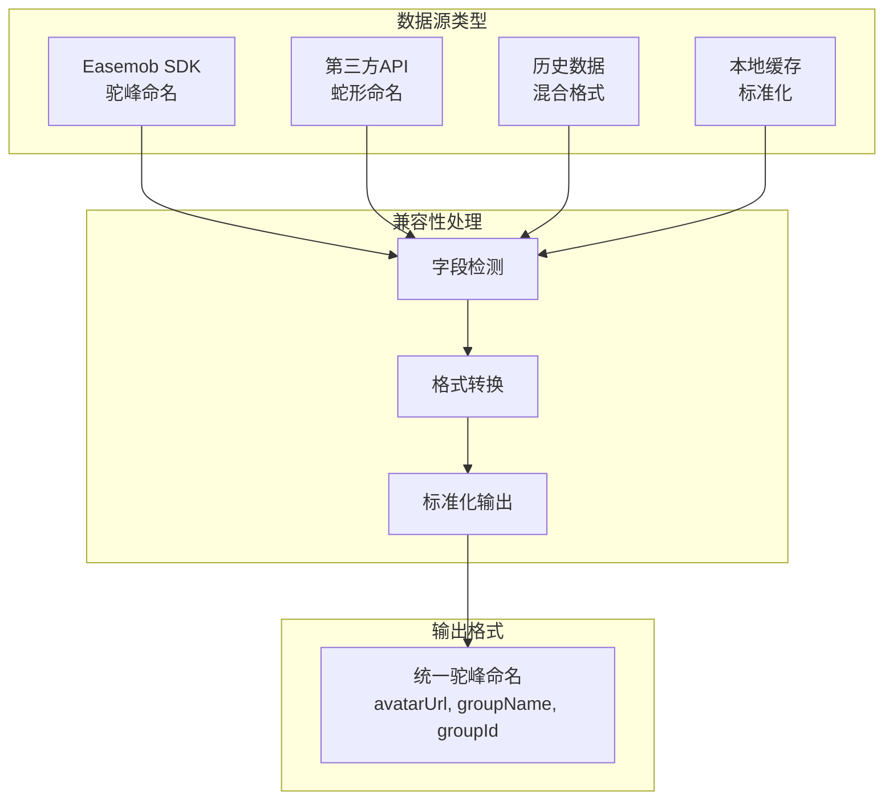

# 群组状态管理

<cite>
**本文档引用的文件**
- [ChatUIKit/stores/group.ts](file://ChatUIKit/stores/group.ts)
- [demo/ChatUIKit/stores/group.ts](file://demo/ChatUIKit/stores/group.ts)
- [ChatUIKit/types/index.ts](file://ChatUIKit/types/index.ts)
- [ChatUIKit/stores/contact.ts](file://ChatUIKit/stores/contact.ts)
- [ChatUIKit/stores/chat.ts](file://ChatUIKit/stores/chat.ts)
- [ChatUIKit/modules/GroupCreate/index.vue](file://ChatUIKit/modules/GroupCreate/index.vue)
- [ChatUIKit/modules/GroupList/index.vue](file://ChatUIKit/modules/GroupList/index.vue)
- [ChatUIKit/modules/GroupList/components/GroupItem/index.vue](file://ChatUIKit/modules/GroupList/components/GroupItem/index.vue)
- [ChatUIKit/modules/Chat/components/MessageMentionList/index.vue](file://ChatUIKit/modules/Chat/components/MessageMentionList/index.vue)
- [ChatUIKit/modules/Chat/components/Message/noticeMessageItem.vue](file://ChatUIKit/modules/Chat/components/Message/noticeMessageItem.vue)
- [ChatUIKit/sdk.ts](file://ChatUIKit/sdk.ts)
- [demo/node_modules/easemob-websdk/Easemob-chat.d.ts](file://demo/node_modules/easemob-websdk/Easemob-chat.d.ts)
- [demo/node_modules/easemob-websdk/types/groupApi.d.ts](file://demo/node_modules/easemob-websdk/types/groupApi.d.ts)
</cite>

## 更新摘要
**所做更改**
- 新增字段格式兼容性章节，详细说明驼峰命名和蛇形命名的字段支持
- 更新群组头像和名称获取方法，增强对不同字段格式的兼容能力
- 完善数据结构兼容性说明，涵盖SDK返回数据的多种命名风格
- 增加字段映射策略和最佳实践指导
- **更新** 新增getGroupDetails批量获取功能和getJoinedGroupList自动详细信息获取增强

## 目录
1. [简介](#简介)
2. [项目结构](#项目结构)
3. [核心组件](#核心组件)
4. [架构概览](#架构概览)
5. [详细组件分析](#详细组件分析)
6. [字段格式兼容性](#字段格式兼容性)
7. [依赖关系分析](#依赖关系分析)
8. [性能考虑](#性能考虑)
9. [故障排除指南](#故障排除指南)
10. [结论](#结论)
11. [附录](#附录)

## 简介
本文件详细阐述了群组状态管理Store的设计与实现，涵盖群组信息管理、成员角色与权限体系、群公告通知机制，以及群组状态与联系人状态的交互关系。文档还提供了群组创建、加入和退出的完整流程说明，并包含性能优化建议和大规模群组管理方案。

**更新** 新增字段格式兼容性支持，增强对驼峰命名和蛇形命名字段的处理能力，确保系统在不同数据源环境下的一致性和可靠性。**新增** getGroupDetails批量获取功能和getJoinedGroupList自动详细信息获取增强，显著提升了群组状态管理的效率和用户体验。

## 项目结构
群组状态管理位于ChatUIKit模块的stores目录中，采用Pinia进行状态管理，结合Easemob Web SDK实现群组操作。主要文件包括：
- 群组Store：管理群组列表、详情、通知等状态
- 类型定义：定义群组相关的数据结构和通知类型
- 组件集成：在群组创建、群组列表、消息提及等场景中使用群组Store



**图表来源**
- [ChatUIKit/stores/group.ts](file://ChatUIKit/stores/group.ts#L1-L317)
- [ChatUIKit/types/index.ts](file://ChatUIKit/types/index.ts#L1-L100)
- [ChatUIKit/modules/GroupCreate/index.vue](file://ChatUIKit/modules/GroupCreate/index.vue#L75-L133)

**章节来源**
- [ChatUIKit/stores/group.ts](file://ChatUIKit/stores/group.ts#L1-L317)
- [ChatUIKit/types/index.ts](file://ChatUIKit/types/index.ts#L1-L100)

## 核心组件
群组状态管理的核心组件是GroupStore，它负责：
- 群组列表的获取与维护
- 群组详细信息的缓存与查询
- 群组通知的收集与统计
- 群组创建、加入、退出、解散等操作
- 群组头像和名称的统一获取接口

**更新** 增强字段格式兼容性处理，支持驼峰命名（avatarUrl）和蛇形命名（avatarurl）的双重字段映射，确保在不同数据源环境下的数据一致性。**新增** getGroupDetails批量获取功能，支持分批异步获取多个群组详情，提升大规模群组场景下的性能表现。

关键特性：
- 使用对象映射存储群组详情，支持O(1)查找
- 分离群组列表和详情管理，提升性能
- 兼容多种字段命名风格（驼峰和下划线）
- 支持分页加载和批量详情获取
- 自动详细信息获取机制，简化组件使用

**章节来源**
- [ChatUIKit/stores/group.ts](file://ChatUIKit/stores/group.ts#L16-L36)
- [ChatUIKit/stores/group.ts](file://ChatUIKit/stores/group.ts#L38-L96)

## 架构概览
群组状态管理采用分层架构设计，通过Pinia Store实现状态隔离，通过SDK封装实现业务逻辑。



**图表来源**
- [ChatUIKit/stores/group.ts](file://ChatUIKit/stores/group.ts#L16-L316)
- [ChatUIKit/types/index.ts](file://ChatUIKit/types/index.ts#L19-L31)

## 详细组件分析

### 群组状态数据结构
群组Store采用多层状态结构来管理不同类型的信息：

```mermaid
erDiagram
GroupState {
GroupItem[] groupList
Record<string, GroupDetailInfo> groupInfoMap
GroupNoticeInfo groupNoticeInfo
PageParams pageParams
}
GroupItem {
string groupId
string groupname
string avatar
string avatarurl
string groupName
string groupid
}
GroupDetailInfo {
string groupId
string groupName
string avatarUrl
number memberCount
string description
boolean isPublic
string owner
}
GroupNoticeInfo {
GroupNotice[] list
number unReadCount
}
GroupNotice {
string from
string operation
number time
}
GroupState ||--o{ GroupItem : "包含"
GroupState ||--o{ GroupDetailInfo : "缓存"
GroupState ||--o{ GroupNoticeInfo : "管理"
GroupNoticeInfo ||--o{ GroupNotice : "包含"
```

**图表来源**
- [ChatUIKit/stores/group.ts](file://ChatUIKit/stores/group.ts#L16-L25)
- [ChatUIKit/types/index.ts](file://ChatUIKit/types/index.ts#L19-L31)

### 群组创建流程
群组创建流程涉及UI交互、状态更新和SDK调用三个层面：



**图表来源**
- [ChatUIKit/modules/GroupCreate/index.vue](file://ChatUIKit/modules/GroupCreate/index.vue#L79-L124)
- [ChatUIKit/stores/group.ts](file://ChatUIKit/stores/group.ts#L172-L184)

### 群组成员管理
群组成员管理通过消息提及列表组件实现，支持分页加载和实时更新：



**图表来源**
- [ChatUIKit/modules/Chat/components/MessageMentionList/index.vue](file://ChatUIKit/modules/Chat/components/MessageMentionList/index.vue#L67-L83)

### 群组通知系统
群组通知系统采用统一的通知结构，支持多种操作类型的记录：



**图表来源**
- [ChatUIKit/types/index.ts](file://ChatUIKit/types/index.ts#L19-L31)

### 群组详情批量获取机制
**新增** 群组详情批量获取机制通过fetchGroupDetails方法实现，支持分批异步获取多个群组详情：



**图表来源**
- [ChatUIKit/stores/group.ts](file://ChatUIKit/stores/group.ts#L102-L131)
- [ChatUIKit/stores/group.ts](file://ChatUIKit/stores/group.ts#L136-L167)

**章节来源**
- [ChatUIKit/modules/GroupCreate/index.vue](file://ChatUIKit/modules/GroupCreate/index.vue#L75-L133)
- [ChatUIKit/modules/Chat/components/MessageMentionList/index.vue](file://ChatUIKit/modules/Chat/components/MessageMentionList/index.vue#L42-L112)
- [ChatUIKit/types/index.ts](file://ChatUIKit/types/index.ts#L19-L31)
- [ChatUIKit/stores/group.ts](file://ChatUIKit/stores/group.ts#L102-L131)
- [ChatUIKit/stores/group.ts](file://ChatUIKit/stores/group.ts#L136-L167)

## 字段格式兼容性

**新增** 群组状态管理现已全面支持驼峰命名和蛇形命名的字段格式，确保在不同数据源环境下的数据一致性。

### 字段映射策略
系统采用智能字段映射策略，自动识别和转换不同命名风格的字段：



**图表来源**
- [ChatUIKit/stores/group.ts](file://ChatUIKit/stores/group.ts#L71-L95)

### 支持的字段格式

#### 头像字段兼容性
- **驼峰命名**：`avatarUrl` - 现代API标准格式
- **蛇形命名**：`avatarurl` - 兼容传统API格式
- **自动检测**：系统自动识别并返回可用的头像URL

#### 名称字段兼容性
- **驼峰命名**：`groupName` - 标准驼峰格式
- **蛇形命名**：`groupname` - 下划线分隔格式
- **智能回退**：当首选字段不存在时自动使用备用字段

#### ID字段兼容性
- **驼峰命名**：`groupId` - 标准格式
- **蛇形命名**：`groupid` - 兼容格式
- **统一处理**：内部统一使用`groupId`作为标识符

### 数据源适配
系统能够适配多种数据源的字段命名规范：



**图表来源**
- [ChatUIKit/stores/group.ts](file://ChatUIKit/stores/group.ts#L71-L95)
- [demo/node_modules/easemob-websdk/Easemob-chat.d.ts](file://demo/node_modules/easemob-websdk/Easemob-chat.d.ts#L518-L547)

### 最佳实践建议
1. **统一字段命名**：建议在应用层统一使用驼峰命名格式
2. **向后兼容**：保留对蛇形命名的支持，确保历史数据兼容
3. **字段验证**：在数据入库前进行字段格式验证和转换
4. **缓存策略**：建立标准化的缓存字段格式，避免格式混用

**章节来源**
- [ChatUIKit/stores/group.ts](file://ChatUIKit/stores/group.ts#L71-L95)
- [demo/node_modules/easemob-websdk/Easemob-chat.d.ts](file://demo/node_modules/easemob-websdk/Easemob-chat.d.ts#L518-L547)
- [demo/node_modules/easemob-websdk/types/groupApi.d.ts](file://demo/node_modules/easemob-websdk/types/groupApi.d.ts#L49-L78)

## 依赖关系分析
群组状态管理与其他模块存在紧密的依赖关系：

```mermaid
graph TB
subgraph "状态管理"
GS["GroupStore"]
CS["ConnStore"]
AS["AppUserStore"]
US["UserStore"]
end
subgraph "业务模块"
GC["GroupCreate"]
GL["GroupList"]
GM["MessageMentionList"]
CH["ChatStore"]
end
subgraph "外部依赖"
SDK["Easemob SDK"]
PINIA["Pinia"]
FC["Field Compatibility"]
GD["Group Details"]
END
GS --> CS
GS --> AS
GS --> SDK
GS --> PINIA
GS --> FC
GS --> GD
GC --> GS
GL --> GS
GM --> GS
CH --> GS
AS --> US
CS --> SDK
```

**图表来源**
- [ChatUIKit/stores/group.ts](file://ChatUIKit/stores/group.ts#L10-L14)
- [ChatUIKit/stores/chat.ts](file://ChatUIKit/stores/chat.ts#L10-L18)

### 数据同步机制
群组状态与联系人状态通过以下方式实现数据同步：

1. **初始化同步**：ChatStore在应用启动时同时加载群组和联系人数据
2. **事件驱动**：SDK事件触发后，相关Store更新对应的状态
3. **缓存一致性**：群组详情缓存与用户信息缓存相互独立但可关联查询
4. **字段兼容**：新增字段格式兼容性确保不同数据源的数据一致性
5. **自动详情获取**：getJoinedGroupList自动异步获取群组详情，提升用户体验

**章节来源**
- [ChatUIKit/stores/chat.ts](file://ChatUIKit/stores/chat.ts#L383-L396)
- [ChatUIKit/stores/contact.ts](file://ChatUIKit/stores/contact.ts#L112-L130)

## 性能考虑
针对群组状态管理的性能优化策略：

### 缓存策略
- **对象映射缓存**：使用Record<string, GroupDetailInfo>存储群组详情，实现O(1)查找
- **分页加载**：群组列表采用分页加载，避免一次性加载大量数据
- **批量获取**：群组详情采用批量获取，减少网络请求次数
- **字段缓存**：新增字段格式兼容性处理结果缓存，避免重复转换
- **智能过滤**：自动过滤已缓存和无效的groupIds，避免重复请求

### 内存优化
- **惰性加载**：仅在需要时获取群组详情
- **去重机制**：添加群组时检查重复，避免重复缓存
- **及时清理**：退出或解散群组时及时清理相关缓存
- **智能释放**：字段格式转换后的中间结果及时释放

### 并发控制
- **批量处理**：群组详情获取采用Promise.all并发处理
- **防抖机制**：避免频繁的状态更新触发不必要的重新渲染
- **字段转换优化**：缓存字段映射结果，避免重复的格式检测
- **分批获取**：每批20个群组详情，平衡内存使用和网络效率

### 自动详情获取优化
**新增** getJoinedGroupList的自动详情获取机制：
- **异步获取**：在获取群组列表后立即异步获取详情
- **过滤重复**：自动过滤已存在的groupIds
- **错误处理**：单个群组详情获取失败不影响整体流程
- **缓存利用**：充分利用现有缓存，避免重复请求

**章节来源**
- [ChatUIKit/stores/group.ts](file://ChatUIKit/stores/group.ts#L102-L131)
- [ChatUIKit/stores/group.ts](file://ChatUIKit/stores/group.ts#L136-L167)

## 故障排除指南
常见问题及解决方案：

### 群组头像显示异常
**问题现象**：群组头像无法正常显示
**可能原因**：
- 字段命名不一致（驼峰vs下划线）
- 缓存数据缺失
- 网络请求失败

**解决方法**：
1. 检查字段命名兼容性
2. 验证缓存状态
3. 重新获取群组详情
4. 检查字段格式转换逻辑

### 群组列表加载缓慢
**问题现象**：群组列表加载时间过长
**可能原因**：
- 网络延迟
- 数据量过大
- 缓存未命中

**解决方法**：
1. 实施分页加载
2. 优化缓存策略
3. 增加重试机制
4. 检查字段格式兼容性处理性能

### 成员信息不同步
**问题现象**：群组成员信息与实际不符
**可能原因**：
- 成员变更事件未正确处理
- 缓存数据过期
- 并发更新冲突

**解决方法**：
1. 检查SDK事件监听
2. 实施缓存失效策略
3. 添加乐观更新机制

### 字段格式兼容性问题
**问题现象**：不同数据源的字段格式导致数据读取失败
**可能原因**：
- 驼峰命名和蛇形命名混用
- 字段映射逻辑错误
- 缓存数据格式不一致

**解决方法**：
1. 检查字段格式检测逻辑
2. 验证字段映射规则
3. 清理不一致的缓存数据
4. 实施字段格式标准化

### 批量获取功能异常
**问题现象**：群组详情批量获取失败或性能不佳
**可能原因**：
- 网络请求超时
- 分批大小配置不当
- 缓存冲突

**解决方法**：
1. 检查网络连接状态
2. 调整分批大小（当前20个）
3. 清理缓存后重试
4. 监控错误日志

**章节来源**
- [ChatUIKit/stores/group.ts](file://ChatUIKit/stores/group.ts#L71-L95)
- [ChatUIKit/stores/group.ts](file://ChatUIKit/stores/group.ts#L102-L131)
- [ChatUIKit/stores/group.ts](file://ChatUIKit/stores/group.ts#L136-L167)

## 结论
群组状态管理Store通过合理的数据结构设计和完善的生命周期管理，实现了高效、可靠的群组状态管理。其核心优势包括：

1. **高性能设计**：采用对象映射和分页加载，确保大规模群组场景下的流畅体验
2. **强健的容错机制**：完善的错误处理和重试机制，提升系统稳定性
3. **良好的扩展性**：清晰的接口设计和模块化架构，便于功能扩展
4. **完整的生命周期**：从创建到解散的全生命周期管理，覆盖所有业务场景
5. **字段格式兼容性**：新增的驼峰命名和蛇形命名字段支持，确保系统在不同数据源环境下的可靠性
6. **智能批量处理**：新增的批量获取功能和自动详情获取机制，显著提升性能和用户体验

**更新** 新增的字段格式兼容性功能和批量获取机制显著提升了系统的适应能力和数据处理效率，为构建稳定可靠的群组功能奠定了更加坚实的基础。

## 附录

### API参考
- `getJoinedGroupList(pageNum?)`：获取群组列表（**增强**：自动异步获取群组详情）
- `fetchGroupDetails(groupIds)`：批量获取群组详情（**新增**：分批异步获取，每批20个）
- `createGroup(params)`：创建群组
- `joinGroup(groupId, message?)`：申请加入群组
- `leaveGroup(groupId)`：退出群组
- `destroyGroup(groupId)`：解散群组
- `getGroupAvatar(groupId)`：获取群组头像（支持字段格式兼容）
- `getGroupName(groupId)`：获取群组名称（支持字段格式兼容）

### 配置选项
- 分页参数：pageNum, pageSize, cursor
- 群组属性：公开/私有、最大成员数、邀请设置
- 缓存策略：自动刷新、手动清理
- 字段格式：驼峰命名、蛇形命名、混合格式支持
- **新增** 批量获取配置：分批大小（默认20）、并发控制

### 字段格式映射表

| 输入字段 | 输出字段 | 映射规则 |
|---------|---------|---------|
| avatarUrl | avatarUrl | 直接映射 |
| avatarurl | avatarUrl | 蛇形转驼峰 |
| groupName | groupName | 直接映射 |
| groupname | groupName | 蛇形转驼峰 |
| groupId | groupId | 直接映射 |
| groupid | groupId | 蛇形转驼峰 |

### 性能优化配置

| 功能 | 默认配置 | 优化建议 |
|------|----------|----------|
| 批量获取分批大小 | 20个 | 根据网络状况调整 |
| 并发请求数 | Promise.all | 控制在合理范围内 |
| 缓存有效期 | 永久缓存 | 根据业务需求设置 |
| 错误重试次数 | 1次 | 根据网络质量调整 |
| 自动详情获取 | 启用 | 在需要时启用 |

**章节来源**
- [ChatUIKit/stores/group.ts](file://ChatUIKit/stores/group.ts#L102-L131)
- [ChatUIKit/stores/group.ts](file://ChatUIKit/stores/group.ts#L136-L167)
- [ChatUIKit/stores/group.ts](file://ChatUIKit/stores/group.ts#L237-L266)