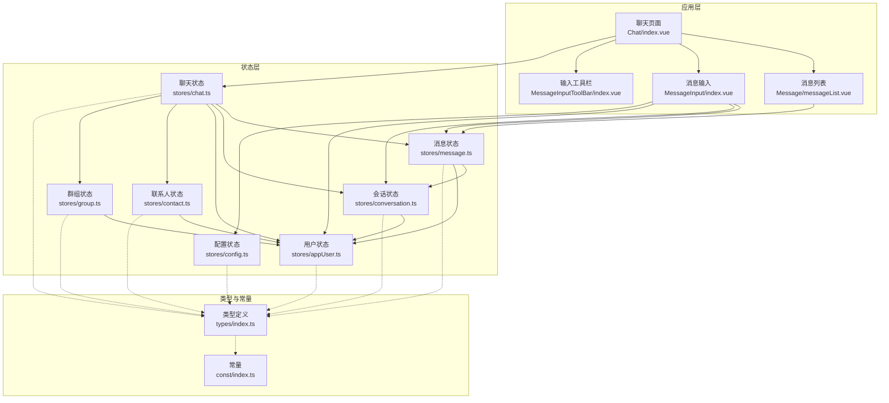
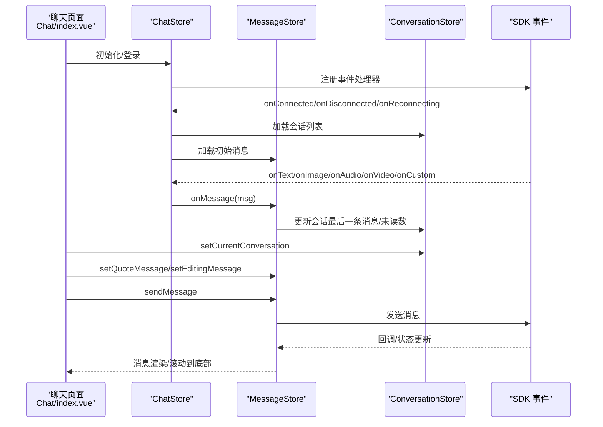
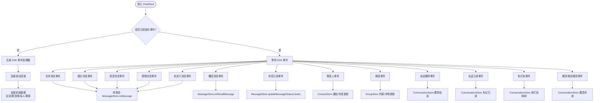
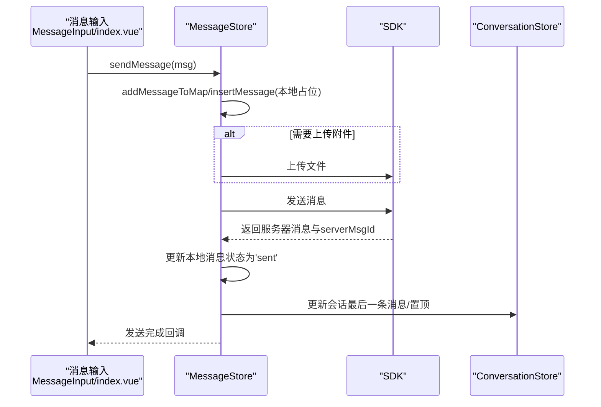
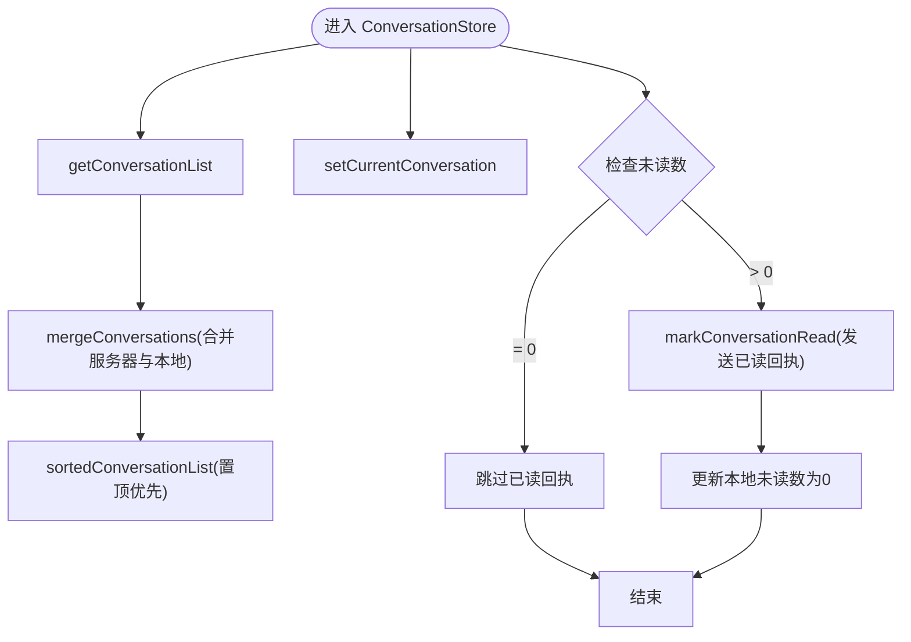
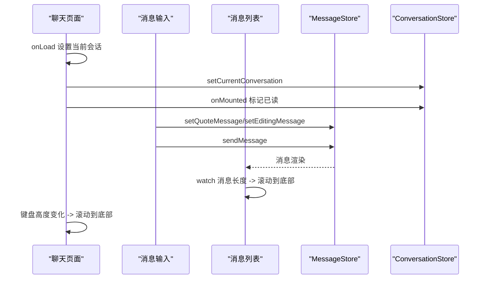
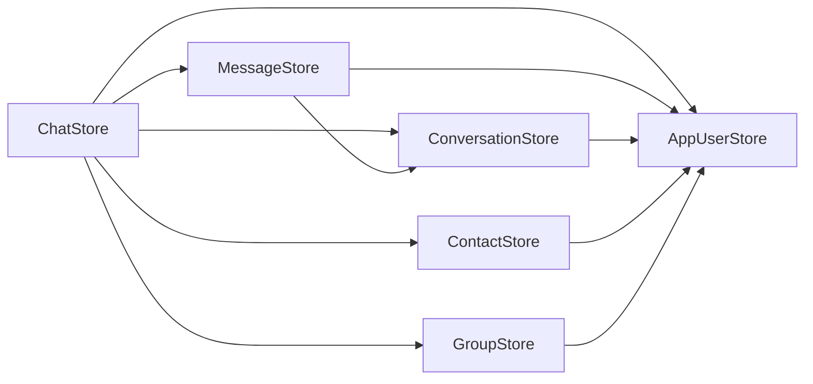

# 聊天界面状态管理

<cite>
**本文档引用的文件**
- [chat.ts](file://ChatUIKit/stores/chat.ts)
- [message.ts](file://ChatUIKit/stores/message.ts)
- [conversation.ts](file://ChatUIKit/stores/conversation.ts)
- [config.ts](file://ChatUIKit/stores/config.ts)
- [appUser.ts](file://ChatUIKit/stores/appUser.ts)
- [contact.ts](file://ChatUIKit/stores/contact.ts)
- [group.ts](file://ChatUIKit/stores/group.ts)
- [index.ts](file://ChatUIKit/types/index.ts)
- [index.ts](file://ChatUIKit/const/index.ts)
- [index.vue](file://ChatUIKit/modules/Chat/index.vue)
- [messageList.vue](file://ChatUIKit/modules/Chat/components/Message/messageList.vue)
- [index.vue](file://ChatUIKit/modules/Chat/components/MessageInput/index.vue)
- [index.vue](file://ChatUIKit/modules/Chat/components/MessageInputToolBar/index.vue)
</cite>

## 更新摘要
**所做更改**
- 更新了会话已读确认系统部分，反映了新的优化机制
- 添加了关于"只有在有未读消息时才发送已读回执"的说明
- 更新了相关架构图和流程图以反映改进的状态管理策略

## 目录
1. [简介](#简介)
2. [项目结构](#项目结构)
3. [核心组件](#核心组件)
4. [架构概览](#架构概览)
5. [详细组件分析](#详细组件分析)
6. [依赖分析](#依赖分析)
7. [性能考虑](#性能考虑)
8. [故障排查指南](#故障排查指南)
9. [结论](#结论)

## 简介
本文件系统性梳理了聊天界面的状态管理架构，重点覆盖以下方面：
- 临时状态管理：当前会话、输入状态、界面交互状态
- 数据结构与状态模型：消息、会话、用户、联系人、群组等状态
- 打开/关闭/切换机制：页面生命周期、会话切换、输入工具栏与表情面板的显隐控制
- 状态协调与数据同步：聊天状态与消息状态的联动、SDK 事件驱动的跨模块同步
- 性能优化与用户体验：消息分页、响应式更新、键盘适配、动画与滚动优化

## 项目结构
聊天状态管理采用 Pinia Store 架构，围绕"聊天主状态"协调"消息、会话、用户、联系人、群组、配置"等多个子状态模块，配合组件层的输入、消息列表、工具栏等 UI 交互。

**图表来源**
- [index.vue:1-255](file://ChatUIKit/modules/Chat/index.vue#L1-L255)
- [messageList.vue:1-284](file://ChatUIKit/modules/Chat/components/Message/messageList.vue#L1-L284)
- [index.vue:1-217](file://ChatUIKit/modules/Chat/components/MessageInput/index.vue#L1-L217)
- [index.vue:1-69](file://ChatUIKit/modules/Chat/components/MessageInputToolBar/index.vue#L1-L69)
- [chat.ts:1-407](file://ChatUIKit/stores/chat.ts#L1-L407)
- [message.ts:1-581](file://ChatUIKit/stores/message.ts#L1-L581)
- [conversation.ts:1-421](file://ChatUIKit/stores/conversation.ts#L1-L421)
- [config.ts:1-124](file://ChatUIKit/stores/config.ts#L1-L124)
- [appUser.ts:1-242](file://ChatUIKit/stores/appUser.ts#L1-L242)
- [contact.ts:1-282](file://ChatUIKit/stores/contact.ts#L1-L282)
- [group.ts:1-317](file://ChatUIKit/stores/group.ts#L1-L317)
- [index.ts:1-100](file://ChatUIKit/types/index.ts#L1-L100)
- [index.ts:1-37](file://ChatUIKit/const/index.ts#L1-L37)

**章节来源**
- [index.vue:1-255](file://ChatUIKit/modules/Chat/index.vue#L1-L255)
- [chat.ts:1-407](file://ChatUIKit/stores/chat.ts#L1-L407)

## 核心组件
- 聊天主状态（ChatStore）：负责 SDK 事件监听、连接状态管理、登录/登出、初始数据加载、跨模块事件协调
- 消息状态（MessageStore）：消息映射、会话消息列表、历史消息分页、消息发送/接收/撤回/删除、播放音频状态、引用/编辑消息状态
- 会话状态（ConversationStore）：会话列表、当前会话、置顶/免打扰、标记已读、@ 提醒状态
- 配置状态（ConfigStore）：主题与功能开关（如输入区功能、消息功能、会话功能等）
- 用户状态（AppUserStore）：用户信息与在线状态缓存、订阅/发布在线状态
- 联系人状态（ContactStore）：联系人列表、好友申请通知
- 群组状态（GroupStore）：加入群组列表、群组详情、群事件处理

**章节来源**
- [chat.ts:22-398](file://ChatUIKit/stores/chat.ts#L22-L398)
- [message.ts:25-581](file://ChatUIKit/stores/message.ts#L25-L581)
- [conversation.ts:27-421](file://ChatUIKit/stores/conversation.ts#L27-L421)
- [config.ts:14-124](file://ChatUIKit/stores/config.ts#L14-L124)
- [appUser.ts:17-242](file://ChatUIKit/stores/appUser.ts#L17-L242)
- [contact.ts:16-282](file://ChatUIKit/stores/contact.ts#L16-L282)
- [group.ts:16-317](file://ChatUIKit/stores/group.ts#L16-L317)

## 架构概览
聊天界面状态管理遵循"事件驱动 + 响应式更新"的模式：
- ChatStore 作为中枢，注册 SDK 事件（连接、消息、联系人、群组、会话等），并将事件转化为各 Store 的状态变更
- MessageStore 负责消息的本地持久化与分页，ConversationStore 负责会话元数据与未读计数
- 组件通过 Pinia 计算属性与 watch 监听状态变化，实现 UI 的自动更新
- 输入组件与消息列表组件分别维护自身的临时 UI 状态（如工具栏显隐、键盘高度、引用消息、编辑消息）

**图表来源**
- [index.vue:211-245](file://ChatUIKit/modules/Chat/index.vue#L211-L245)
- [chat.ts:67-221](file://ChatUIKit/stores/chat.ts#L67-L221)
- [message.ts:341-388](file://ChatUIKit/stores/message.ts#L341-L388)
- [conversation.ts:314-339](file://ChatUIKit/stores/conversation.ts#L314-L339)

## 详细组件分析

### 聊天主状态（ChatStore）
职责与关键点：
- 连接状态管理：维护连接状态枚举，提供 getter 供 UI 判断登录态
- SDK 事件监听：集中注册 onConnected/onDisconnected/onReconnecting 等事件，并在连接成功后加载初始数据
- 跨模块事件协调：消息接收、联系人事件、群组事件、会话事件均在此处分发到对应 Store
- 登录/登出：封装登录流程，初始化事件与初始数据；登出时清理所有 Store 并重置连接状态
- 初始数据加载：会话列表、置顶会话、联系人、群组

**图表来源**
- [chat.ts:67-221](file://ChatUIKit/stores/chat.ts#L67-L221)
- [chat.ts:226-294](file://ChatUIKit/stores/chat.ts#L226-L294)

**章节来源**
- [chat.ts:22-398](file://ChatUIKit/stores/chat.ts#L22-L398)

### 消息状态（MessageStore）
职责与关键点：
- 数据结构：messageMap（消息内容）、conversationMessagesMap（会话消息 ID 序列 + 分页游标）
- 历史消息分页：按 PAGE_SIZE 拉取，去重合并，维护 isLast/isGetHistoryMessage
- 发送流程：准备本地消息、上传附件（可选）、调用 SDK 发送、更新本地状态与服务器消息、更新会话
- 接收流程：onMessage 统一入口，设置 @ 类型，更新会话最后一条消息与未读数，必要时标记已读
- 撤回/删除：调用 SDK 并在本地替换为提示消息，更新会话最后一条消息
- 临时状态：quoteMessage、editingMessage、playingAudioMsgId

**图表来源**
- [index.vue:137-189](file://ChatUIKit/modules/Chat/components/MessageInput/index.vue#L137-L189)
- [message.ts:223-336](file://ChatUIKit/stores/message.ts#L223-L336)
- [conversation.ts:344-369](file://ChatUIKit/stores/conversation.ts#L344-L369)

**章节来源**
- [message.ts:25-581](file://ChatUIKit/stores/message.ts#L25-L581)

### 会话状态（ConversationStore）
职责与关键点：
- 会话列表：支持分页获取、合并服务器与本地状态、置顶排序
- 当前会话：setCurrentConversation，配合消息列表渲染
- 未读计数：totalUnreadCount（排除免打扰）
- 标记已读：发送 channel 类型已读回执，清零未读数
- @ 提醒：根据消息内容设置 atType（NONE/ALL/ME）

**更新** 会话已读确认系统已优化，现在只有在有未读消息时才发送已读回执，提高了效率并减少了不必要的网络流量

**图表来源**
- [conversation.ts:126-160](file://ChatUIKit/stores/conversation.ts#L126-L160)
- [conversation.ts:194-213](file://ChatUIKit/stores/conversation.ts#L194-L213)
- [conversation.ts:314-339](file://ChatUIKit/stores/conversation.ts#L314-L339)
- [conversation.ts:392-407](file://ChatUIKit/stores/conversation.ts#L392-L407)

**章节来源**
- [conversation.ts:27-421](file://ChatUIKit/stores/conversation.ts#L27-L421)

### 配置状态（ConfigStore）
职责与关键点：
- 主题配置：头像形状等
- 功能配置：输入区功能、消息功能、会话功能、消息操作功能、其他功能（如名片、调试）
- 动态开关：hideFeature/showFeature/reset

**章节来源**
- [config.ts:14-124](file://ChatUIKit/stores/config.ts#L14-L124)

### 用户状态（AppUserStore）
职责与关键点：
- 用户信息缓存：getUserInfo/getSelfUserInfo，带默认值与 presence
- 在线状态：getUsersPresenceFromServer、subscribePresence/unsubscribePresence/publishPresence
- 与消息/会话协作：异步获取发送者/被@用户信息，避免重复请求

**章节来源**
- [appUser.ts:17-242](file://ChatUIKit/stores/appUser.ts#L17-L242)

### 联系人状态（ContactStore）
职责与关键点：
- 联系人列表：getContacts，分页递归获取用户信息
- 通知管理：好友申请邀请/同意/拒绝/删除，未读数统计
- 与聊天状态协作：联系人事件触发通知更新

**章节来源**
- [contact.ts:16-282](file://ChatUIKit/stores/contact.ts#L16-L282)

### 群组状态（GroupStore）
职责与关键点：
- 群组列表：getJoinedGroupList，异步获取群详情
- 群事件：成员进出、邀请加入、解散、移除、公告/信息更新等，触发列表与详情更新
- 与聊天状态协作：群事件处理后刷新群详情

**章节来源**
- [group.ts:16-317](file://ChatUIKit/stores/group.ts#L16-L317)

### 组件层状态与交互
- 聊天页面（Chat/index.vue）
  - 临时 UI 状态：isShowToolbar、isShowEmojiPicker、keyboardHeight、isEditingMessage
  - 交互行为：遮罩层关闭工具栏、键盘高度变化滚动到底部、@ 提及、用户名片发送
  - 生命周期：onLoad 设置当前会话，onMounted 标记已读，onUnmounted 清理引用/编辑消息与当前会话

- 消息列表（Message/messageList.vue）
  - 临时 UI 状态：isLoading、currentViewMsgId、selectedMsgId、blinkMsgId、isOpacity
  - 行为：首次进入自动拉取历史消息，watch 消息长度变化滚动到底部，长按选择消息

- 输入组件（MessageInput/index.vue）
  - 临时 UI 状态：isFocus、mentionUserIds
  - 行为：@ 提及检测、引用消息扩展、发送文本消息、聚焦/失焦事件

- 输入工具栏（MessageInputToolBar/index.vue）
  - 临时 UI 状态：根据功能配置显示图片/视频/文件/用户名片按钮
  - 行为：用户名片按钮事件透传

**图表来源**
- [index.vue:229-245](file://ChatUIKit/modules/Chat/index.vue#L229-L245)
- [index.vue:124-134](file://ChatUIKit/modules/Chat/index.vue#L124-L134)
- [index.vue:136-139](file://ChatUIKit/modules/Chat/index.vue#L136-L139)
- [messageList.vue:100-115](file://ChatUIKit/modules/Chat/components/Message/messageList.vue#L100-L115)
- [index.vue:137-189](file://ChatUIKit/modules/Chat/components/MessageInput/index.vue#L137-L189)

**章节来源**
- [index.vue:103-250](file://ChatUIKit/modules/Chat/index.vue#L103-L250)
- [messageList.vue:52-201](file://ChatUIKit/modules/Chat/components/Message/messageList.vue#L52-L201)
- [index.vue:43-217](file://ChatUIKit/modules/Chat/components/MessageInput/index.vue#L43-L217)
- [index.vue:26-69](file://ChatUIKit/modules/Chat/components/MessageInputToolBar/index.vue#L26-L69)

## 依赖分析
- ChatStore 依赖：ConnStore（SDK 连接）、ConfigStore（功能开关）、AppUserStore、ContactStore、ConversationStore、GroupStore、MessageStore
- MessageStore 依赖：ConnStore、ConversationStore、AppUserStore
- ConversationStore 依赖：ConnStore、AppUserStore、MessageStore
- 其他 Store 依赖：ConnStore、AppUserStore

**图表来源**
- [chat.ts:12-18](file://ChatUIKit/stores/chat.ts#L12-L18)
- [message.ts:17-21](file://ChatUIKit/stores/message.ts#L17-L21)
- [conversation.ts:18-21](file://ChatUIKit/stores/conversation.ts#L18-L21)
- [contact.ts:10-14](file://ChatUIKit/stores/contact.ts#L10-L14)
- [group.ts:10-14](file://ChatUIKit/stores/group.ts#L10-L14)
- [appUser.ts:11-15](file://ChatUIKit/stores/appUser.ts#L11-L15)

**章节来源**
- [chat.ts:12-21](file://ChatUIKit/stores/chat.ts#L12-L21)
- [message.ts:17-21](file://ChatUIKit/stores/message.ts#L17-L21)
- [conversation.ts:18-21](file://ChatUIKit/stores/conversation.ts#L18-L21)
- [contact.ts:10-14](file://ChatUIKit/stores/contact.ts#L10-L14)
- [group.ts:10-14](file://ChatUIKit/stores/group.ts#L10-L14)
- [appUser.ts:11-15](file://ChatUIKit/stores/appUser.ts#L11-L15)

## 性能考虑
- 消息分页与裁剪
  - 每页固定大小（PAGE_SIZE），首次进入自动拉取历史，避免一次性加载过多消息
  - 超量消息清理：超过阈值（MAX_MESSAGES_PER_CONVERSATION）时裁剪最早消息，释放内存
- 响应式更新
  - 使用 computed 与 watch 降低不必要的渲染，仅在状态变化时更新
  - 会话列表排序与未读数计算使用计算属性缓存
- 键盘适配
  - 监听键盘高度变化，动态调整布局与滚动位置
- 事件解耦
  - ChatStore 作为事件中枢，避免组件间直接耦合，提高可维护性
- 附件上传
  - 上传完成后替换本地消息体字段，保证 UI 与数据一致
- **会话已读确认优化**
  - 仅在有未读消息时发送已读回执，减少网络流量和服务器压力
  - 通过检查会话未读计数来决定是否发送已读回执

**章节来源**
- [message.ts:46-47](file://ChatUIKit/stores/message.ts#L46-L47)
- [message.ts:530-554](file://ChatUIKit/stores/message.ts#L530-L554)
- [message.ts:130-197](file://ChatUIKit/stores/message.ts#L130-L197)
- [index.vue:136-139](file://ChatUIKit/modules/Chat/index.vue#L136-L139)
- [conversation.ts:54-59](file://ChatUIKit/stores/conversation.ts#L54-L59)

## 故障排查指南
- 登录失败
  - 检查 ChatStore.login 的错误日志，确认 SDK 连接 open 是否抛错
  - 确认初始化事件与初始数据加载是否执行
- 消息未显示或未滚动到底部
  - 检查 MessageStore.getHistoryMessages 是否成功，isLast 与 isGetHistoryMessage 标志
  - 确认 watch 消息长度变化是否触发滚动到底部
- 已读未生效
  - 检查 ConversationStore.markConversationRead 是否发送了 channel 类型已读回执
  - 确认未读数是否被正确清零
  - **新增**：检查会话未读计数是否大于 0，确保已读回执发送逻辑正常
- 群组事件未更新
  - 检查 ChatStore.handleGroupEvent 的分支处理，确认群详情是否刷新
- 键盘遮挡输入框
  - 检查 onKeyboardHeightChange 是否正确设置 keyboardHeight 并触发滚动

**章节来源**
- [chat.ts:299-328](file://ChatUIKit/stores/chat.ts#L299-L328)
- [message.ts:130-197](file://ChatUIKit/stores/message.ts#L130-L197)
- [conversation.ts:314-339](file://ChatUIKit/stores/conversation.ts#L314-L339)
- [chat.ts:247-294](file://ChatUIKit/stores/chat.ts#L247-L294)
- [index.vue:238-244](file://ChatUIKit/modules/Chat/index.vue#L238-L244)

## 结论
本聊天界面状态管理以 ChatStore 为核心，结合 Pinia 的响应式特性与 SDK 事件驱动，实现了消息、会话、用户、联系人、群组等多维度状态的协同管理。通过合理的数据结构设计（消息映射 + 会话 ID 序列）、分页与裁剪策略、键盘适配与滚动优化，既保证了性能，也提升了用户体验。

**重要更新**：会话已读确认系统现已优化，只有在有未读消息时才发送已读回执，这一改进显著提高了系统效率，减少了不必要的网络流量和服务器压力。该优化通过检查会话未读计数来智能决定是否发送已读回执，确保了资源的有效利用。

建议在后续迭代中进一步完善错误恢复与重试机制，并持续优化跨模块状态一致性校验。同时，可以考虑将此优化策略扩展到其他类似的性能敏感场景中。