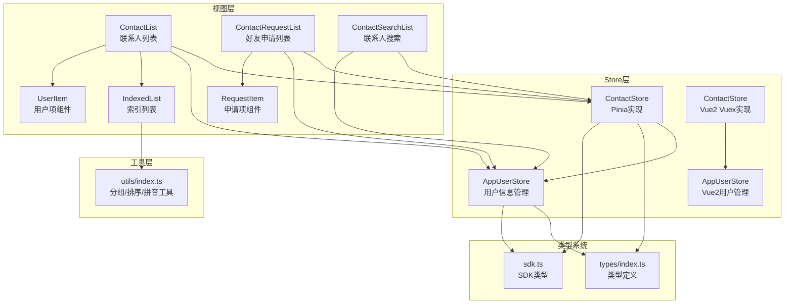
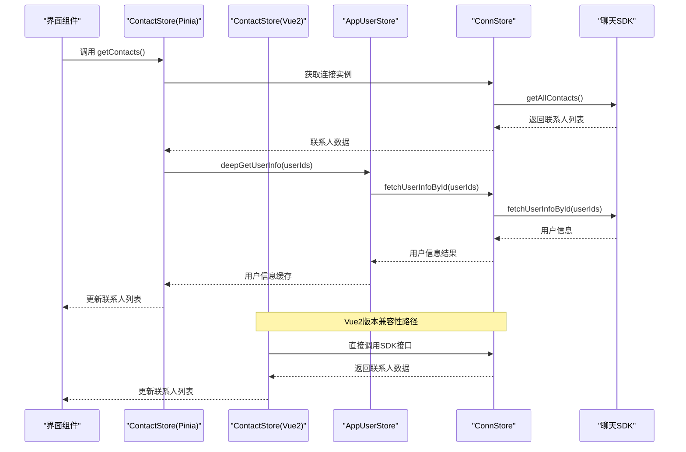
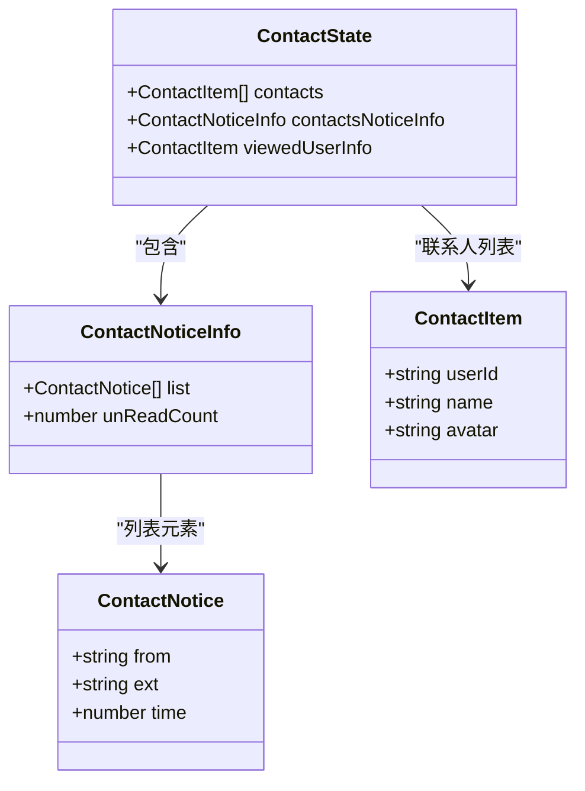
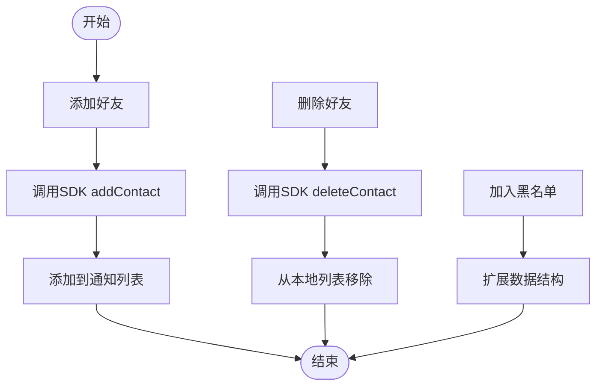
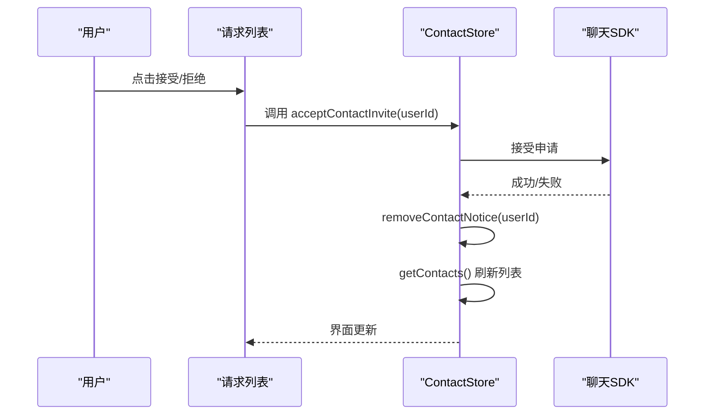
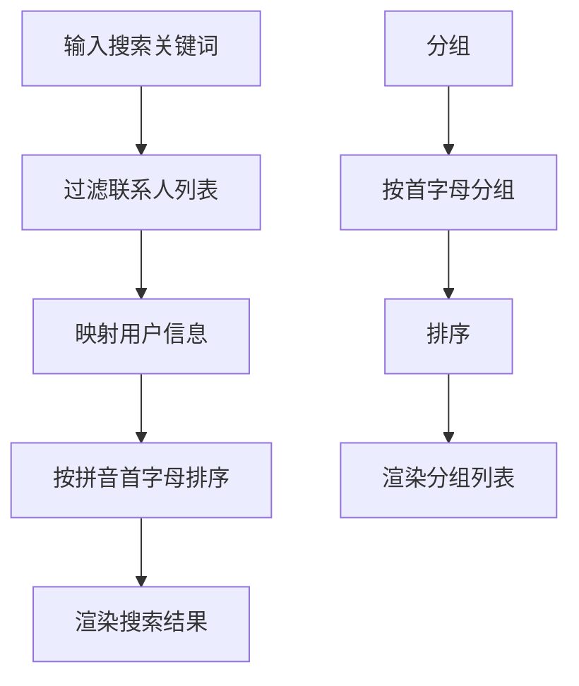
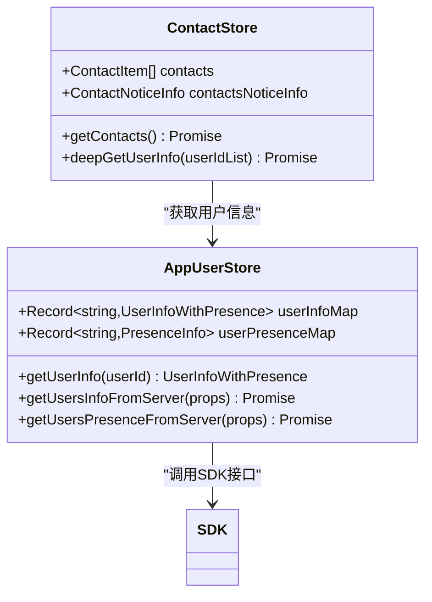
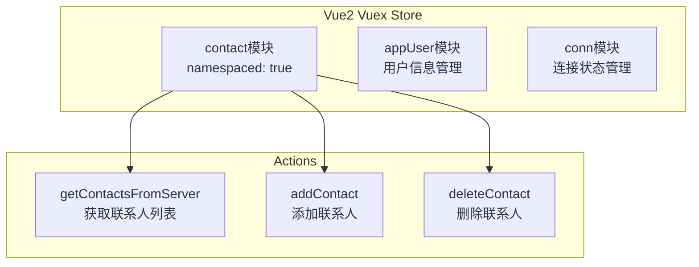
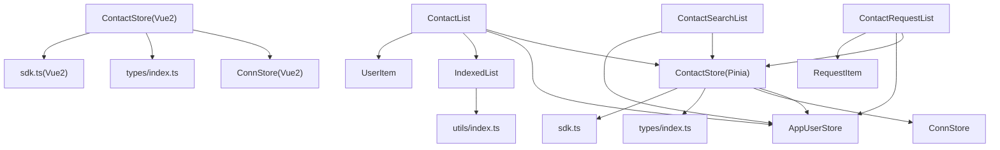

# 联系人状态管理

<cite>
**本文档引用的文件**
- [ChatUIKit/stores/contact.ts](file://ChatUIKit/stores/contact.ts)
- [ChatUIKit-vue2/stores/contact.js](file://ChatUIKit-vue2/stores/contact.js)
- [ChatUIKit/stores/appUser.ts](file://ChatUIKit/stores/appUser.ts)
- [ChatUIKit-vue2/stores/appUser.js](file://ChatUIKit-vue2/stores/appUser.js)
- [ChatUIKit-vue2/stores/index.js](file://ChatUIKit-vue2/stores/index.js)
- [ChatUIKit-vue2/stores/conn.js](file://ChatUIKit-vue2/stores/conn.js)
- [ChatUIKit/types/index.ts](file://ChatUIKit/types/index.ts)
- [ChatUIKit/modules/ContactList/index.vue](file://ChatUIKit/modules/ContactList/index.vue)
- [ChatUIKit/modules/ContactRequestList/index.vue](file://ChatUIKit/modules/ContactRequestList/index.vue)
- [ChatUIKit/modules/ContactSearchList/index.vue](file://ChatUIKit/modules/ContactSearchList/index.vue)
- [ChatUIKit/modules/ContactList/components/UserItem/index.vue](file://ChatUIKit/modules/ContactList/components/UserItem/index.vue)
- [ChatUIKit/modules/ContactRequestList/components/RequestItem/index.vue](file://ChatUIKit/modules/ContactRequestList/components/RequestItem/index.vue)
- [ChatUIKit/components/IndexedList/index.vue](file://ChatUIKit/components/IndexedList/index.vue)
- [ChatUIKit/utils/index.ts](file://ChatUIKit/utils/index.ts)
- [ChatUIKit/sdk.ts](file://ChatUIKit/sdk.ts)
</cite>

## 更新摘要
**所做更改**
- 新增Vue2版本Vuex实现的联系人状态管理模块
- 完善好友请求管理能力的详细文档说明
- 补充通知处理和状态管理功能的技术细节
- 更新架构概览以反映双版本实现方案
- 增强请求处理流程的可视化图表

## 目录
1. [简介](#简介)
2. [项目结构](#项目结构)
3. [核心组件](#核心组件)
4. [架构概览](#架构概览)
5. [详细组件分析](#详细组件分析)
6. [Vue2版本实现](#vue2版本实现)
7. [依赖关系分析](#依赖关系分析)
8. [性能考虑](#性能考虑)
9. [故障排除指南](#故障排除指南)
10. [结论](#结论)

## 简介
本文件详细阐述了Easemob UIKit项目中联系人状态管理Store的设计与实现，涵盖联系人列表管理、好友关系处理、黑名单机制、请求处理流程、数据结构设计、权限控制、搜索与分组排序功能，以及联系人状态与用户状态的关联关系和隐私保护机制。文档特别关注应用变更：联系人Store新增好友请求管理能力、通知处理和状态管理功能，以及Vue2版本的Vuex实现。同时提供了数据同步与冲突解决策略，帮助开发者深入理解并高效使用联系人状态管理模块。

## 项目结构
联系人状态管理主要由以下部分组成：
- Store层：Pinia Store用于管理联系人列表、好友申请通知和当前查看用户信息
- Vue2版本：Vuex实现提供兼容性支持
- 类型系统：统一定义联系人通知、用户信息等类型
- 视图层：联系人列表、请求列表、搜索列表等UI组件
- 工具层：分组排序、拼音转换、节流等工具函数
- SDK集成：通过连接Store调用底层聊天SDK接口

**图表来源**
- [ChatUIKit/stores/contact.ts](file://ChatUIKit/stores/contact.ts#L25-L33)
- [ChatUIKit/stores/appUser.ts](file://ChatUIKit/stores/appUser.ts#L24-L28)
- [ChatUIKit-vue2/stores/contact.js](file://ChatUIKit-vue2/stores/contact.js#L4-L10)
- [ChatUIKit-vue2/stores/appUser.js](file://ChatUIKit-vue2/stores/appUser.js#L4-L17)
- [ChatUIKit/types/index.ts](file://ChatUIKit/types/index.ts#L14-L31)
- [ChatUIKit/sdk.ts](file://ChatUIKit/sdk.ts#L1-L13)

**章节来源**
- [ChatUIKit/stores/contact.ts](file://ChatUIKit/stores/contact.ts#L1-L282)
- [ChatUIKit-vue2/stores/contact.js](file://ChatUIKit-vue2/stores/contact.js#L1-L86)
- [ChatUIKit/stores/appUser.ts](file://ChatUIKit/stores/appUser.ts#L1-L242)
- [ChatUIKit-vue2/stores/appUser.js](file://ChatUIKit-vue2/stores/appUser.js#L1-L54)
- [ChatUIKit/types/index.ts](file://ChatUIKit/types/index.ts#L1-L100)

## 核心组件
- ContactStore（Pinia）：负责联系人列表的获取、添加、删除、好友申请通知的管理，以及当前查看用户信息的设置
- ContactStore（Vue2 Vuex）：提供兼容性的Vuex实现，支持基础的联系人CRUD操作
- AppUserStore：负责用户信息与在线状态的获取、缓存与更新，支持按需拉取和订阅
- 类型系统：统一定义联系人通知、用户信息、在线状态等类型，确保数据结构一致性
- 视图组件：联系人列表、请求列表、搜索列表等UI组件，负责展示和交互
- 工具函数：提供分组排序、拼音转换、节流等工具，支撑联系人列表的索引与搜索

**章节来源**
- [ChatUIKit/stores/contact.ts](file://ChatUIKit/stores/contact.ts#L25-L281)
- [ChatUIKit-vue2/stores/contact.js](file://ChatUIKit-vue2/stores/contact.js#L4-L86)
- [ChatUIKit/stores/appUser.ts](file://ChatUIKit/stores/appUser.ts#L24-L241)
- [ChatUIKit-vue2/stores/appUser.js](file://ChatUIKit-vue2/stores/appUser.js#L4-L54)
- [ChatUIKit/types/index.ts](file://ChatUIKit/types/index.ts#L14-L31)

## 架构概览
联系人状态管理采用Store驱动的架构模式，通过Pinia Store集中管理状态，配合类型系统保证数据结构的正确性。视图层通过computed和事件绑定与Store交互，实现响应式更新。工具层提供高效的分组与排序能力，提升用户体验。Vue2版本提供兼容性支持，确保不同技术栈的应用都能使用相同的API。

**图表来源**
- [ChatUIKit/stores/contact.ts](file://ChatUIKit/stores/contact.ts#L112-L130)
- [ChatUIKit/stores/contact.ts](file://ChatUIKit/stores/contact.ts#L83-L107)
- [ChatUIKit-vue2/stores/contact.js](file://ChatUIKit-vue2/stores/contact.js#L39-L55)
- [ChatUIKit/stores/appUser.ts](file://ChatUIKit/stores/appUser.ts#L86-L125)

**章节来源**
- [ChatUIKit/stores/contact.ts](file://ChatUIKit/stores/contact.ts#L78-L130)
- [ChatUIKit-vue2/stores/contact.js](file://ChatUIKit-vue2/stores/contact.js#L39-L55)
- [ChatUIKit/stores/appUser.ts](file://ChatUIKit/stores/appUser.ts#L81-L125)

## 详细组件分析

### 联系人状态数据结构
联系人状态管理的核心数据结构包括：
- 联系人列表：数组形式存储，便于快速查找和遍历
- 好友申请通知：包含通知类型(ext)、时间戳(time)、申请人(from)等字段
- 当前查看用户信息：用于详情页或操作面板展示

**图表来源**
- [ChatUIKit/stores/contact.ts](file://ChatUIKit/stores/contact.ts#L16-L33)
- [ChatUIKit/types/index.ts](file://ChatUIKit/types/index.ts#L23-L26)
- [ChatUIKit/types/index.ts](file://ChatUIKit/types/index.ts#L14-L17)

**章节来源**
- [ChatUIKit/stores/contact.ts](file://ChatUIKit/stores/contact.ts#L16-L33)
- [ChatUIKit/types/index.ts](file://ChatUIKit/types/index.ts#L14-L31)

### 好友关系与黑名单处理
- 添加好友：通过SDK接口发起申请，记录到通知列表
- 删除好友：调用SDK删除接口，并从本地列表移除
- 黑名单机制：当前实现未包含黑名单专用字段，可通过扩展ContactItem或新增Store字段实现

**图表来源**
- [ChatUIKit/stores/contact.ts](file://ChatUIKit/stores/contact.ts#L135-L147)
- [ChatUIKit/stores/contact.ts](file://ChatUIKit/stores/contact.ts#L152-L165)

**章节来源**
- [ChatUIKit/stores/contact.ts](file://ChatUIKit/stores/contact.ts#L132-L175)

### 请求处理流程
好友申请的处理流程包括通知生成、展示、接受与拒绝：
- 通知生成：addContactNotice方法检查重复并更新未读计数
- 展示：ContactRequestList组件过滤invited类型通知
- 处理：acceptContactInvite/declineContactInvite分别接受或拒绝申请

**图表来源**
- [ChatUIKit/modules/ContactRequestList/components/RequestItem/index.vue](file://ChatUIKit/modules/ContactRequestList/components/RequestItem/index.vue#L47-L68)
- [ChatUIKit/stores/contact.ts](file://ChatUIKit/stores/contact.ts#L180-L196)
- [ChatUIKit/stores/contact.ts](file://ChatUIKit/stores/contact.ts#L219-L237)

**章节来源**
- [ChatUIKit/modules/ContactRequestList/index.vue](file://ChatUIKit/modules/ContactRequestList/index.vue#L34-L52)
- [ChatUIKit/modules/ContactRequestList/components/RequestItem/index.vue](file://ChatUIKit/modules/ContactRequestList/components/RequestItem/index.vue#L47-L68)
- [ChatUIKit/stores/contact.ts](file://ChatUIKit/stores/contact.ts#L178-L237)

### 联系人搜索、分组与排序
- 搜索：ContactSearchList根据用户昵称进行模糊匹配
- 分组：IndexedList组件按首字母分组，支持中文拼音首字母
- 排序：工具函数提供按拼音首字母排序能力

**图表来源**
- [ChatUIKit/modules/ContactSearchList/index.vue](file://ChatUIKit/modules/ContactSearchList/index.vue#L51-L60)
- [ChatUIKit/components/IndexedList/index.vue](file://ChatUIKit/components/IndexedList/index.vue#L130-L159)
- [ChatUIKit/utils/index.ts](file://ChatUIKit/utils/index.ts#L328-L343)

**章节来源**
- [ChatUIKit/modules/ContactSearchList/index.vue](file://ChatUIKit/modules/ContactSearchList/index.vue#L51-L60)
- [ChatUIKit/components/IndexedList/index.vue](file://ChatUIKit/components/IndexedList/index.vue#L130-L159)
- [ChatUIKit/utils/index.ts](file://ChatUIKit/utils/index.ts#L328-L343)

### 联系人状态与用户状态关联
- 用户信息缓存：AppUserStore缓存用户昵称、头像等信息
- 在线状态：支持订阅用户在线状态，显示presenceExt
- 关联展示：联系人列表通过computed合并联系人与用户信息

**图表来源**
- [ChatUIKit/stores/appUser.ts](file://ChatUIKit/stores/appUser.ts#L17-L28)
- [ChatUIKit/stores/contact.ts](file://ChatUIKit/stores/contact.ts#L83-L107)

**章节来源**
- [ChatUIKit/stores/appUser.ts](file://ChatUIKit/stores/appUser.ts#L30-L79)
- [ChatUIKit/modules/ContactList/index.vue](file://ChatUIKit/modules/ContactList/index.vue#L44-L51)

### 权限控制与隐私保护
- 功能开关：通过配置项控制用户信息获取功能
- 信息缓存：避免重复请求，减少网络开销
- 本地处理：敏感操作通过本地确认对话框，防止误操作

**章节来源**
- [ChatUIKit/stores/appUser.ts](file://ChatUIKit/stores/appUser.ts#L86-L100)
- [ChatUIKit/modules/ContactList/components/UserItem/index.vue](file://ChatUIKit/modules/ContactList/components/UserItem/index.vue#L67-L80)

### 数据同步与冲突解决策略
- 异步获取：联系人列表获取后异步补充用户信息，避免阻塞
- 通知去重：同一申请者多次通知时，后入先出替换策略
- 未读计数：基于实际邀请通知数量动态计算，避免计数偏差

**章节来源**
- [ChatUIKit/stores/contact.ts](file://ChatUIKit/stores/contact.ts#L119-L123)
- [ChatUIKit/stores/contact.ts](file://ChatUIKit/stores/contact.ts#L219-L237)
- [ChatUIKit/stores/contact.ts](file://ChatUIKit/stores/contact.ts#L54-L61)

## Vue2版本实现
Vue2版本提供兼容性的Vuex实现，确保在Vue2环境中也能使用联系人管理功能：

### Vuex Store架构
- 模块化设计：独立的contact模块，namespaced命名空间隔离
- 状态管理：简化contacts数组状态，支持基本CRUD操作
- 兼容性：与Pinia版本保持一致的API接口

**图表来源**
- [ChatUIKit-vue2/stores/contact.js](file://ChatUIKit-vue2/stores/contact.js#L4-L86)
- [ChatUIKit-vue2/stores/appUser.js](file://ChatUIKit-vue2/stores/appUser.js#L4-L54)
- [ChatUIKit-vue2/stores/conn.js](file://ChatUIKit-vue2/stores/conn.js#L2-L16)

### Vuex与Pinia对比
- 状态结构：Vue2使用简单数组，Pinia使用复杂对象结构
- 异步处理：Vue2直接调用SDK，Pinia通过ConnStore封装
- 响应式：Vue2使用Vue.set，Pinia自动响应式

**章节来源**
- [ChatUIKit-vue2/stores/contact.js](file://ChatUIKit-vue2/stores/contact.js#L1-L86)
- [ChatUIKit-vue2/stores/appUser.js](file://ChatUIKit-vue2/stores/appUser.js#L1-L54)
- [ChatUIKit-vue2/stores/index.js](file://ChatUIKit-vue2/stores/index.js#L1-L25)

## 依赖关系分析
联系人状态管理模块的依赖关系如下：

**图表来源**
- [ChatUIKit/stores/contact.ts](file://ChatUIKit/stores/contact.ts#L10-L14)
- [ChatUIKit-vue2/stores/contact.js](file://ChatUIKit-vue2/stores/contact.js#L1-L3)
- [ChatUIKit/modules/ContactList/index.vue](file://ChatUIKit/modules/ContactList/index.vue#L34-L36)
- [ChatUIKit/modules/ContactRequestList/index.vue](file://ChatUIKit/modules/ContactRequestList/index.vue#L27-L31)
- [ChatUIKit/modules/ContactSearchList/index.vue](file://ChatUIKit/modules/ContactSearchList/index.vue#L35-L45)

**章节来源**
- [ChatUIKit/stores/contact.ts](file://ChatUIKit/stores/contact.ts#L10-L14)
- [ChatUIKit-vue2/stores/contact.js](file://ChatUIKit-vue2/stores/contact.js#L1-L3)
- [ChatUIKit/modules/ContactList/index.vue](file://ChatUIKit/modules/ContactList/index.vue#L34-L53)

## 性能考虑
- 分页获取：用户信息分页批量获取，避免单次请求过大
- 缓存策略：用户信息与在线状态缓存，减少重复请求
- 响应式更新：使用computed替代autorun，提高更新效率
- 防抖节流：工具函数提供节流功能，优化频繁操作场景
- Vue2兼容：简化状态结构，降低内存占用

## 故障排除指南
- 获取联系人失败：检查ConnStore连接状态和SDK接口调用
- 用户信息缺失：确认AppUserStore的用户信息功能开关和缓存状态
- 通知未更新：验证addContactNotice和removeContactNotice的调用时机
- 搜索无结果：确认搜索关键词与用户昵称的匹配逻辑
- Vue2兼容问题：检查namespaced命名空间和模块导入路径

**章节来源**
- [ChatUIKit/stores/contact.ts](file://ChatUIKit/stores/contact.ts#L115-L129)
- [ChatUIKit/stores/appUser.ts](file://ChatUIKit/stores/appUser.ts#L90-L125)
- [ChatUIKit/stores/contact.ts](file://ChatUIKit/stores/contact.ts#L219-L237)
- [ChatUIKit-vue2/stores/contact.js](file://ChatUIKit-vue2/stores/contact.js#L39-L55)

## 结论
联系人状态管理Store通过清晰的数据结构、完善的请求处理流程和高效的工具支持，实现了完整的联系人管理功能。模块化的架构设计便于扩展和维护，同时提供了良好的性能表现和用户体验。新增的Vue2版本Vuex实现进一步增强了兼容性，确保不同技术栈的应用都能使用相同的API。建议在实际应用中结合业务需求进一步完善黑名单、权限控制等功能，并持续优化数据同步策略以提升系统的稳定性。