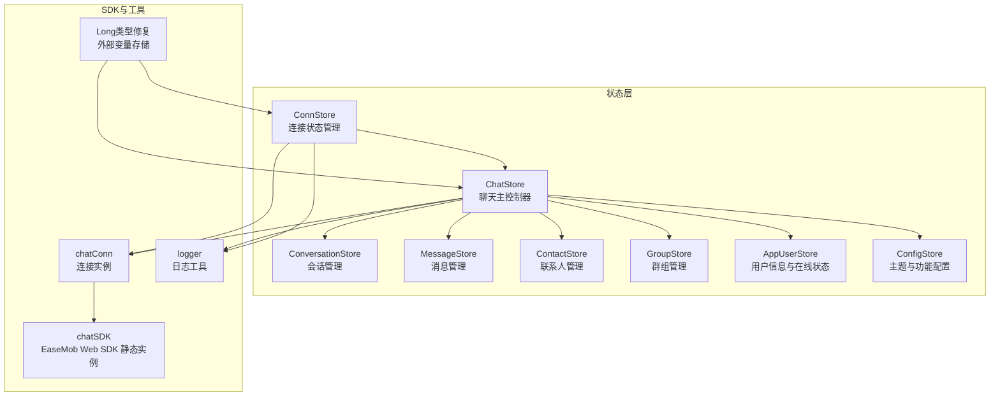
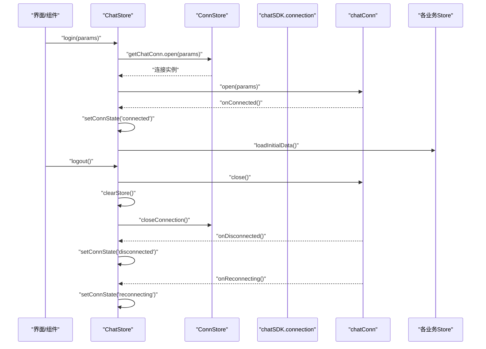
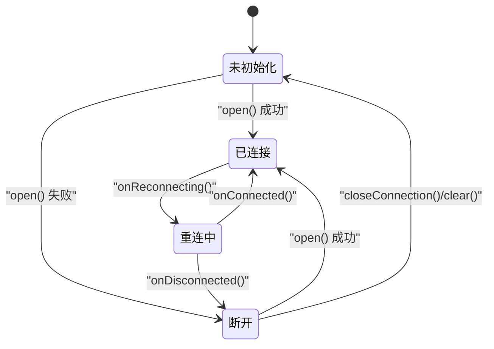
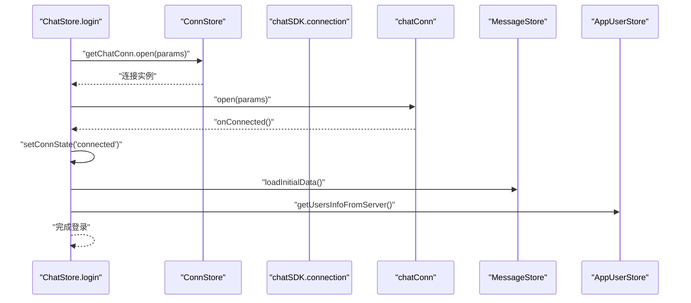
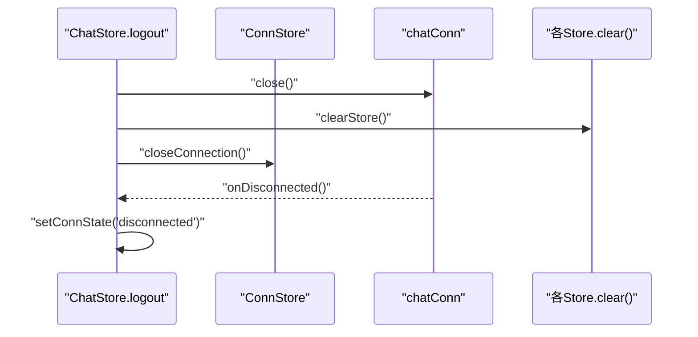
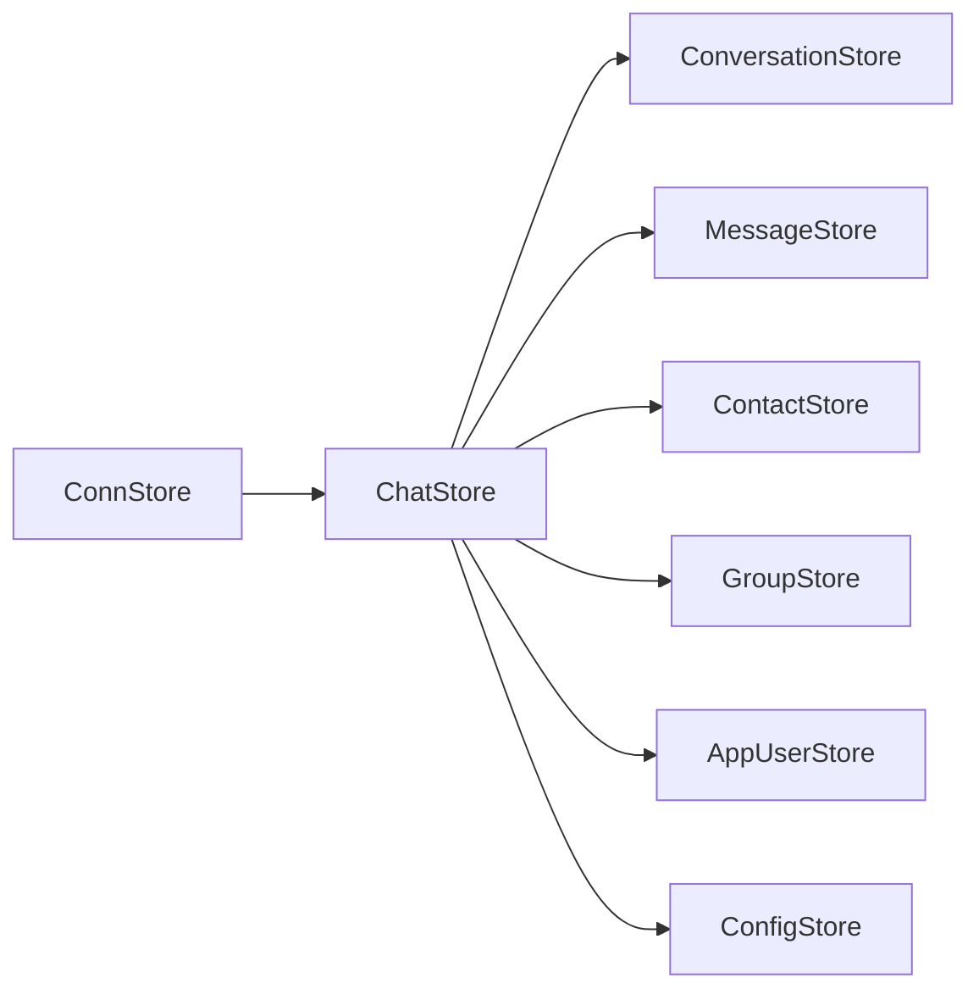
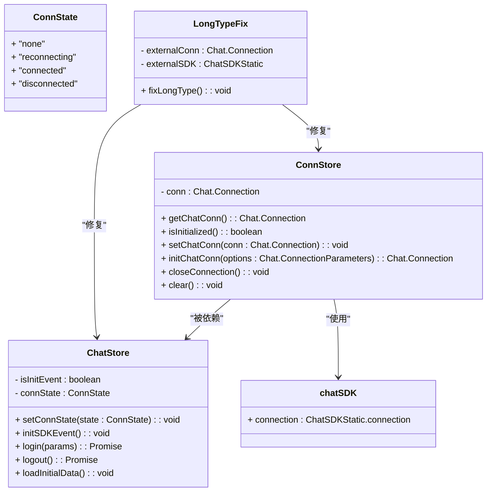
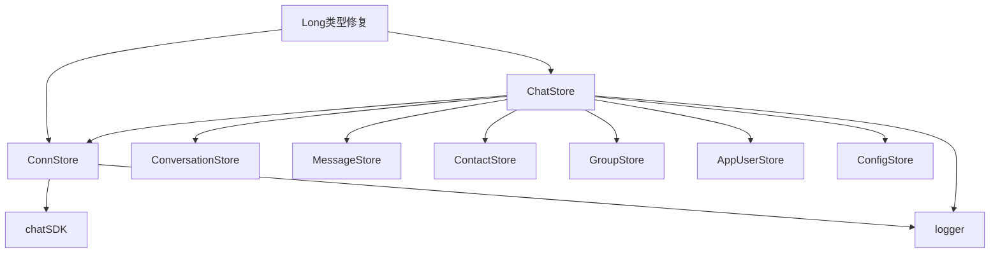

# 连接状态管理

<cite>
**本文引用的文件**
- [ChatUIKit/stores/conn.ts](file://ChatUIKit/stores/conn.ts)
- [ChatUIKit/stores/chat.ts](file://ChatUIKit/stores/chat.ts)
- [ChatUIKit/types/index.ts](file://ChatUIKit/types/index.ts)
- [ChatUIKit/sdk.ts](file://ChatUIKit/sdk.ts)
- [ChatUIKit/log.ts](file://ChatUIKit/log.ts)
- [ChatUIKit/stores/index.ts](file://ChatUIKit/stores/index.ts)
- [ChatUIKit/stores/config.ts](file://ChatUIKit/stores/config.ts)
- [ChatUIKit/const/index.ts](file://ChatUIKit/const/index.ts)
- [ChatUIKit/stores/appUser.ts](file://ChatUIKit/stores/appUser.ts)
- [ChatUIKit/stores/message.ts](file://ChatUIKit/stores/message.ts)
- [ChatUIKit/stores/conversation.ts](file://ChatUIKit/stores/conversation.ts)
- [ChatUIKit/stores/contact.ts](file://ChatUIKit/stores/contact.ts)
- [ChatUIKit/stores/group.ts](file://ChatUIKit/stores/group.ts)
- [ChatUIKit/index.ts](file://ChatUIKit/index.ts)
- [ChatUIKit/configType.ts](file://ChatUIKit/configType.ts)
</cite>

## 更新摘要
**变更内容**
- 新增SDK实例跟踪机制，区分chatConn连接实例和chatSDK SDK静态实例
- 增强连接状态管理的类型安全性和错误处理
- 改进SDK初始化流程和方法访问机制
- 优化连接状态转换规则和生命周期管理
- **新增** 修复SDK Long类型错误：连接存储现在使用外部变量存储SDK连接和SDK实例，避免Vue响应式系统干扰SDK对象，特别是Long类型数字的JSON序列化问题

## 目录
1. [简介](#简介)
2. [项目结构](#项目结构)
3. [核心组件](#核心组件)
4. [架构总览](#架构总览)
5. [详细组件分析](#详细组件分析)
6. [依赖分析](#依赖分析)
7. [性能考虑](#性能考虑)
8. [故障排查指南](#故障排查指南)
9. [结论](#结论)
10. [附录](#附录)

## 简介
本文件围绕"连接状态管理Store"进行系统化文档化，重点解释IM连接的生命周期（建立、维护、断开）、连接状态的数据结构与转换规则、错误处理策略，并结合项目中各Store之间的协作关系，梳理连接状态如何驱动消息、会话、联系人、群组等模块的联动。同时给出调试技巧与常见问题的解决路径。

**更新** 本次更新重点关注SDK实例跟踪机制，区分chatConn连接实例和chatSDK SDK静态实例，提供更完善的连接状态管理。**新增** 修复了SDK Long类型错误，通过外部变量存储避免Vue响应式系统对SDK对象的干扰。

## 项目结构
本项目采用Pinia作为状态管理框架，连接状态由独立的连接Store负责，其他业务Store通过依赖注入的方式获取连接实例并协同工作。整体结构如下：

**图表来源**
- [ChatUIKit/stores/conn.ts:1-84](file://ChatUIKit/stores/conn.ts#L1-L84)
- [ChatUIKit/stores/chat.ts:1-407](file://ChatUIKit/stores/chat.ts#L1-L407)
- [ChatUIKit/stores/conversation.ts:1-200](file://ChatUIKit/stores/conversation.ts#L1-L200)
- [ChatUIKit/stores/message.ts:1-200](file://ChatUIKit/stores/message.ts#L1-L200)
- [ChatUIKit/stores/contact.ts:1-200](file://ChatUIKit/stores/contact.ts#L1-L200)
- [ChatUIKit/stores/group.ts:1-200](file://ChatUIKit/stores/group.ts#L1-L200)
- [ChatUIKit/stores/appUser.ts:1-242](file://ChatUIKit/stores/appUser.ts#L1-L242)
- [ChatUIKit/stores/config.ts:1-124](file://ChatUIKit/stores/config.ts#L1-L124)
- [ChatUIKit/sdk.ts:1-13](file://ChatUIKit/sdk.ts#L1-L13)
- [ChatUIKit/log.ts:1-78](file://ChatUIKit/log.ts#L1-L78)

**章节来源**
- [ChatUIKit/stores/index.ts:1-31](file://ChatUIKit/stores/index.ts#L1-L31)
- [ChatUIKit/index.ts:1-139](file://ChatUIKit/index.ts#L1-L139)

## 核心组件
- **连接Store（ConnStore）**：封装IM连接实例的创建、获取、关闭与清理，提供类型安全的访问器。**更新** 现在支持chatSDK实例跟踪和区分chatConn连接实例。
- **聊天Store（ChatStore）**：协调SDK事件、连接状态机、登录/登出流程以及初始数据加载。**更新** 增强了SDK方法访问和错误处理机制。
- **类型与SDK**：定义连接状态枚举、SDK静态类型与封装，确保编译期约束。**更新** 新增chatSDK静态实例类型定义。
- **日志工具（logger）**：统一输出调试信息，便于定位连接生命周期中的问题。**更新** 增强了连接状态变更的日志记录。
- **配置Store（ConfigStore）**：提供功能开关，影响连接后的行为（如是否启用置顶、消息状态等）。
- **Long类型修复机制**：**新增** 通过外部变量存储SDK连接和SDK实例，避免Vue响应式系统对SDK对象的干扰，特别是Long类型数字的JSON序列化问题。

**章节来源**
- [ChatUIKit/stores/conn.ts:1-84](file://ChatUIKit/stores/conn.ts#L1-L84)
- [ChatUIKit/stores/chat.ts:1-407](file://ChatUIKit/stores/chat.ts#L1-L407)
- [ChatUIKit/types/index.ts:1-100](file://ChatUIKit/types/index.ts#L1-L100)
- [ChatUIKit/sdk.ts:1-13](file://ChatUIKit/sdk.ts#L1-L13)
- [ChatUIKit/log.ts:1-78](file://ChatUIKit/log.ts#L1-L78)
- [ChatUIKit/stores/config.ts:1-124](file://ChatUIKit/stores/config.ts#L1-L124)

## 架构总览
连接状态管理贯穿于登录、事件监听、数据加载与登出的全链路。下图展示了连接状态在关键节点的流转与触发关系：

**图表来源**
- [ChatUIKit/stores/chat.ts:299-345](file://ChatUIKit/stores/chat.ts#L299-L345)
- [ChatUIKit/stores/conn.ts:46-81](file://ChatUIKit/stores/conn.ts#L46-L81)
- [ChatUIKit/types/index.ts:12-12](file://ChatUIKit/types/index.ts#L12-L12)

## 详细组件分析

### 连接状态数据结构与生命周期
- **数据结构**
  - **连接实例**：Pinia状态中保存一个可空的连接对象，提供getter进行类型安全访问。
  - **SDK静态实例**：通过chatSDK提供EaseMob Web SDK的静态类型封装。
  - **连接状态**：在聊天Store中以枚举形式表示，包含"未初始化/重连中/已连接/断开"四态。
- **生命周期**
  - **初始化**：若未初始化则创建连接实例；若已存在则复用。
  - **登录**：通过连接实例打开会话，随后注册SDK事件并加载初始数据。
  - **断开**：SDK回调触发状态变更；登出时显式关闭连接并清空状态。
  - **维护**：在页面可见时调用SDK的前台检测方法，维持连接有效性。

**图表来源**
- [ChatUIKit/stores/chat.ts:58-88](file://ChatUIKit/stores/chat.ts#L58-L88)
- [ChatUIKit/stores/conn.ts:46-81](file://ChatUIKit/stores/conn.ts#L46-L81)
- [ChatUIKit/types/index.ts:12-12](file://ChatUIKit/types/index.ts#L12-L12)

**章节来源**
- [ChatUIKit/stores/conn.ts:15-84](file://ChatUIKit/stores/conn.ts#L15-L84)
- [ChatUIKit/stores/chat.ts:22-61](file://ChatUIKit/stores/chat.ts#L22-L61)
- [ChatUIKit/types/index.ts:12-12](file://ChatUIKit/types/index.ts#L12-L12)

### 连接建立与登录流程
- **登录步骤**
  - 获取连接实例并调用打开方法。
  - 注册SDK事件处理器，设置连接状态为"已连接"并加载初始数据。
  - 异步拉取用户信息与在线状态，刷新应用侧缓存。
- **关键点**
  - 登录失败时记录错误日志并抛出异常，避免状态不一致。
  - 登录成功后才进行事件监听与数据加载，保证回调能正确处理消息。
  - **更新** 现在使用chatSDK.connection构造连接实例，提供更好的类型安全。
  - **新增** 通过外部变量存储连接实例，避免Vue响应式系统对Long类型数字的JSON序列化问题。

**图表来源**
- [ChatUIKit/stores/chat.ts:299-328](file://ChatUIKit/stores/chat.ts#L299-L328)
- [ChatUIKit/stores/message.ts:1-200](file://ChatUIKit/stores/message.ts#L1-L200)
- [ChatUIKit/stores/appUser.ts:86-125](file://ChatUIKit/stores/appUser.ts#L86-L125)

**章节来源**
- [ChatUIKit/stores/chat.ts:299-328](file://ChatUIKit/stores/chat.ts#L299-L328)

### 连接断开与登出流程
- **断开**
  - SDK回调触发"断开"状态，ChatStore更新状态机。
- **登出**
  - 关闭连接并清空所有业务Store的状态，重置连接状态为"未初始化"。

**图表来源**
- [ChatUIKit/stores/chat.ts:333-361](file://ChatUIKit/stores/chat.ts#L333-L361)
- [ChatUIKit/stores/conn.ts:68-81](file://ChatUIKit/stores/conn.ts#L68-L81)

**章节来源**
- [ChatUIKit/stores/chat.ts:333-361](file://ChatUIKit/stores/chat.ts#L333-L361)
- [ChatUIKit/stores/conn.ts:68-81](file://ChatUIKit/stores/conn.ts#L68-L81)

### 连接状态与业务Store的协作
- **会话Store**：在连接成功后拉取会话列表与置顶会话，必要时异步获取单聊对方用户信息。
- **消息Store**：在连接成功后可发起历史消息拉取，维护消息ID顺序与内容映射。
- **联系人/群组/用户信息Store**：在连接成功后拉取联系人、群组列表与详情，订阅在线状态等。
- **配置Store**：控制功能开关，影响连接后的行为（如是否启用置顶、消息状态等）。

**图表来源**
- [ChatUIKit/stores/chat.ts:377-396](file://ChatUIKit/stores/chat.ts#L377-L396)
- [ChatUIKit/stores/conversation.ts:126-160](file://ChatUIKit/stores/conversation.ts#L126-L160)
- [ChatUIKit/stores/message.ts:130-197](file://ChatUIKit/stores/message.ts#L130-L197)
- [ChatUIKit/stores/contact.ts:112-130](file://ChatUIKit/stores/contact.ts#L112-L130)
- [ChatUIKit/stores/group.ts:102-131](file://ChatUIKit/stores/group.ts#L102-L131)
- [ChatUIKit/stores/appUser.ts:86-125](file://ChatUIKit/stores/appUser.ts#L86-L125)
- [ChatUIKit/stores/config.ts:59-80](file://ChatUIKit/stores/config.ts#L59-L80)

**章节来源**
- [ChatUIKit/stores/chat.ts:377-396](file://ChatUIKit/stores/chat.ts#L377-L396)

### 连接状态的数据结构与类型约束
- **连接状态枚举**：在类型文件中定义，确保状态机的可枚举性与类型安全。
- **连接实例类型**：通过SDK静态类型封装，保证与EaseMob Web SDK的对接一致性。
- **Getter与Action**：ConnStore提供类型安全的连接实例访问器与初始化/关闭能力。
- **SDK实例跟踪**：**更新** 新增chatSDK静态实例的类型定义和使用。
- **Long类型修复**：**新增** 通过外部变量存储SDK连接实例，避免Vue响应式系统对Long类型数字的JSON序列化问题。

**图表来源**
- [ChatUIKit/types/index.ts:12-12](file://ChatUIKit/types/index.ts#L12-L12)
- [ChatUIKit/stores/conn.ts:15-84](file://ChatUIKit/stores/conn.ts#L15-L84)
- [ChatUIKit/stores/chat.ts:22-61](file://ChatUIKit/stores/chat.ts#L22-L61)
- [ChatUIKit/sdk.ts:1-13](file://ChatUIKit/sdk.ts#L1-L13)

**章节来源**
- [ChatUIKit/types/index.ts:12-12](file://ChatUIKit/types/index.ts#L12-L12)
- [ChatUIKit/stores/conn.ts:15-84](file://ChatUIKit/stores/conn.ts#L15-L84)
- [ChatUIKit/stores/chat.ts:22-61](file://ChatUIKit/stores/chat.ts#L22-L61)

### 连接重试机制、心跳与异常恢复
- **重试机制**
  - SDK回调提供"重连中"状态，ChatStore将其映射为连接状态机的一个阶段，UI可根据状态提示用户。
- **心跳与前台检测**
  - 页面可见时调用SDK的前台检测方法，维持连接有效性。
- **异常恢复**
  - 登录失败抛出异常，避免状态不一致；断开后进入"断开"状态，等待重新登录或自动重连。
  - 登出时显式关闭连接并清空所有Store，确保下次登录时干净状态。
- **SDK实例管理**：**更新** 增强了SDK实例的生命周期管理，提供更好的错误处理。
- **Long类型异常处理**：**新增** 通过外部变量存储避免Vue响应式系统对Long类型数字的JSON序列化问题，确保大数据数字的正确传输和存储。

**章节来源**
- [ChatUIKit/stores/chat.ts:82-88](file://ChatUIKit/stores/chat.ts#L82-L88)
- [ChatUIKit/stores/chat.ts:366-371](file://ChatUIKit/stores/chat.ts#L366-L371)
- [ChatUIKit/stores/chat.ts:333-361](file://ChatUIKit/stores/chat.ts#L333-L361)

### 错误处理策略
- **日志记录**：统一使用logger输出信息、警告与错误，便于定位问题。
- **异常传播**：登录/登出过程中的异常向上抛出，调用方负责捕获与处理。
- **安全访问**：连接Getter在未初始化时抛出明确错误，防止空引用。
- **SDK实例保护**：**更新** 增加了对chatSDK实例的类型检查和错误处理。
- **Long类型保护**：**新增** 通过外部变量存储SDK连接实例，避免Vue响应式系统对Long类型数字的JSON序列化问题，确保大数据数字的正确处理。

**章节来源**
- [ChatUIKit/log.ts:37-74](file://ChatUIKit/log.ts#L37-L74)
- [ChatUIKit/stores/chat.ts:324-327](file://ChatUIKit/stores/chat.ts#L324-L327)
- [ChatUIKit/stores/conn.ts:29-34](file://ChatUIKit/stores/conn.ts#L29-L34)

## 依赖分析
- **组件耦合**
  - ChatStore强依赖ConnStore提供的连接实例，其他Store通过ChatStore间接依赖ConnStore。
  - ConfigStore提供功能开关，影响ChatStore在连接成功后的数据加载策略。
  - **更新** 新增对chatSDK的依赖，提供SDK静态类型的统一管理。
  - **新增** Long类型修复机制依赖外部变量存储，确保SDK对象不受Vue响应式系统影响。
- **外部依赖**
  - EaseMob Web SDK通过封装的chatSDK提供Connection实例与事件回调。
- **循环依赖**
  - 无明显循环依赖；各Store之间通过Pinia实例与依赖注入解耦。

**图表来源**
- [ChatUIKit/stores/chat.ts:1-407](file://ChatUIKit/stores/chat.ts#L1-L407)
- [ChatUIKit/stores/conn.ts:1-84](file://ChatUIKit/stores/conn.ts#L1-L84)
- [ChatUIKit/sdk.ts:1-13](file://ChatUIKit/sdk.ts#L1-L13)
- [ChatUIKit/log.ts:1-78](file://ChatUIKit/log.ts#L1-L78)

**章节来源**
- [ChatUIKit/stores/chat.ts:1-407](file://ChatUIKit/stores/chat.ts#L1-L407)
- [ChatUIKit/stores/conn.ts:1-84](file://ChatUIKit/stores/conn.ts#L1-L84)

## 性能考虑
- **事件监听一次性初始化**：避免重复注册导致的内存泄漏与性能损耗。
- **初始数据按需加载**：根据配置决定是否加载置顶会话，减少不必要的请求。
- **批量与分页**：群组详情与联系人信息采用分批获取，降低单次请求压力。
- **缓存与去重**：消息与用户信息采用映射表与去重策略，提升渲染效率。
- **SDK实例复用**：**更新** 通过chatSDK静态实例统一管理，避免重复创建连接实例。
- **Long类型优化**：**新增** 通过外部变量存储避免Vue响应式系统对大数据数字的处理开销，提升序列化性能。

## 故障排查指南
- **登录失败**
  - 检查日志输出，确认登录参数与凭证是否正确。
  - 确认连接实例已初始化且未处于断开状态。
  - **更新** 检查chatSDK实例是否正确导入和初始化。
  - **新增** 检查Long类型数据是否正确序列化，特别是大数据数字。
- **连接断开**
  - 查看SDK回调日志，确认是否触发了"断开"或"重连中"状态。
  - 在页面可见时检查前台检测调用是否正常。
- **无法接收消息**
  - 确认SDK事件已初始化，消息回调是否被正确处理。
  - 检查消息Store是否正确维护消息映射与会话消息ID列表。
- **用户信息缺失**
  - 确认功能开关已启用，并检查用户信息拉取接口是否返回数据。
  - 检查订阅/取消订阅在线状态的调用是否正确。
- **SDK实例问题**
  - **新增** 检查chatSDK是否正确导入，确保EaseMob Web SDK版本兼容性。
  - **新增** 验证连接实例的类型安全，确保与SDK版本匹配。
  - **新增** 检查Long类型数据的序列化问题，特别是大数据数字的处理。
- **Vue响应式问题**
  - **新增** 确认SDK连接实例通过外部变量存储，避免被Vue响应式系统观察。
  - **新增** 检查是否存在SDK对象被意外存储到Vue组件状态中。

**章节来源**
- [ChatUIKit/log.ts:37-74](file://ChatUIKit/log.ts#L37-L74)
- [ChatUIKit/stores/chat.ts:67-221](file://ChatUIKit/stores/chat.ts#L67-L221)
- [ChatUIKit/stores/message.ts:130-197](file://ChatUIKit/stores/message.ts#L130-L197)
- [ChatUIKit/stores/appUser.ts:86-125](file://ChatUIKit/stores/appUser.ts#L86-L125)

## 结论
本项目的连接状态管理通过Pinia实现了清晰的职责划分：ConnStore专注连接实例的生命周期，ChatStore负责状态机与事件编排，其他Store在连接成功后协同加载与维护数据。配合统一的日志体系与类型约束，整体具备良好的可维护性与扩展性。

**更新** 本次更新增强了SDK实例跟踪机制，区分chatConn连接实例和chatSDK SDK静态实例，提供了更完善的连接状态管理。**新增** 通过外部变量存储SDK连接实例，有效解决了Vue响应式系统对Long类型数字JSON序列化的干扰问题，提升了系统的稳定性和数据处理的准确性。

## 附录
- **应用入口与初始化**
  - ChatUIKit类负责延迟初始化各Store并在init时注入连接实例与配置。
  - **更新** 现在支持通过getChatConn()方法获取连接实例，提供更好的类型安全。
  - **新增** Long类型修复机制确保SDK连接实例不会被Vue响应式系统观察。
- **配置类型**
  - FeatureConfig与ThemeConfig定义了功能开关与主题选项，影响连接后的行为与UI表现。
- **SDK实例管理**
  - **新增** chatSDK静态实例提供统一的SDK访问接口，确保类型安全和版本兼容性。
  - **新增** 外部变量存储机制确保SDK对象的完整性，避免响应式系统对大数据数字的处理问题。

**章节来源**
- [ChatUIKit/index.ts:84-131](file://ChatUIKit/index.ts#L84-L131)
- [ChatUIKit/configType.ts:47-67](file://ChatUIKit/configType.ts#L47-L67)