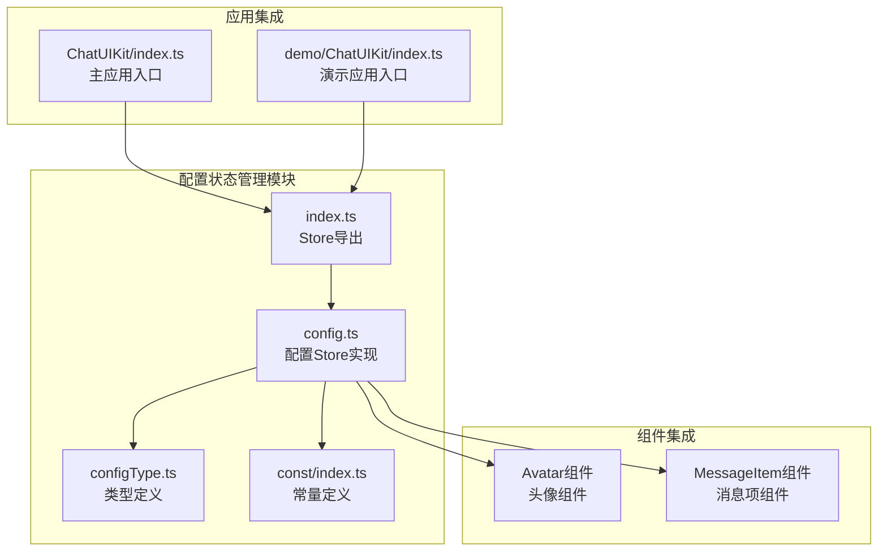
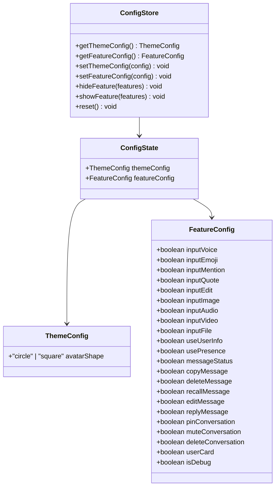
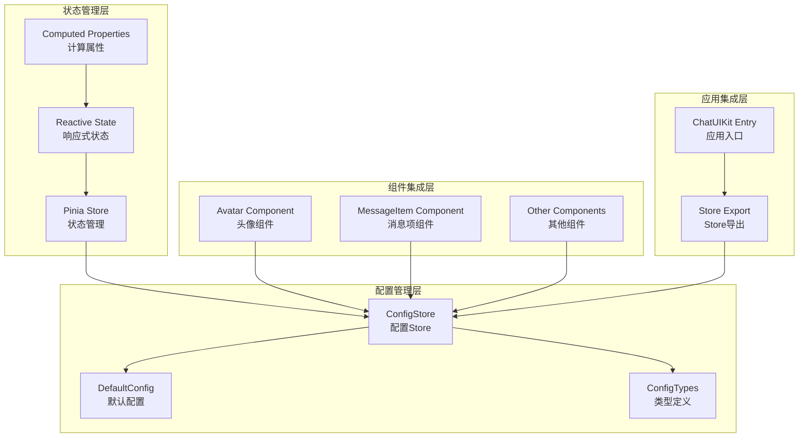
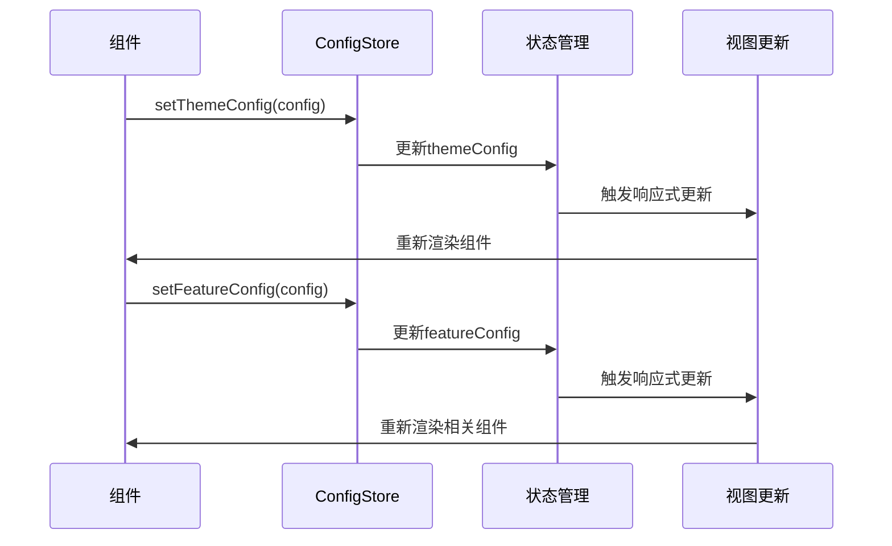
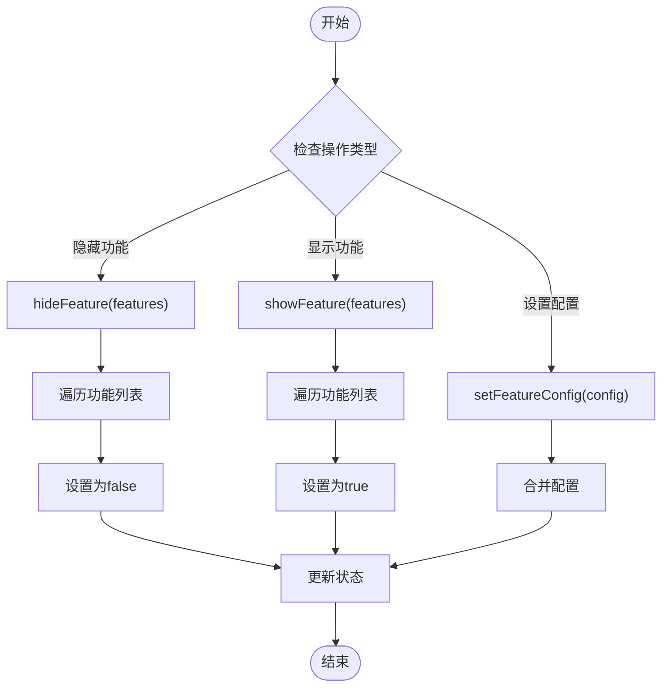
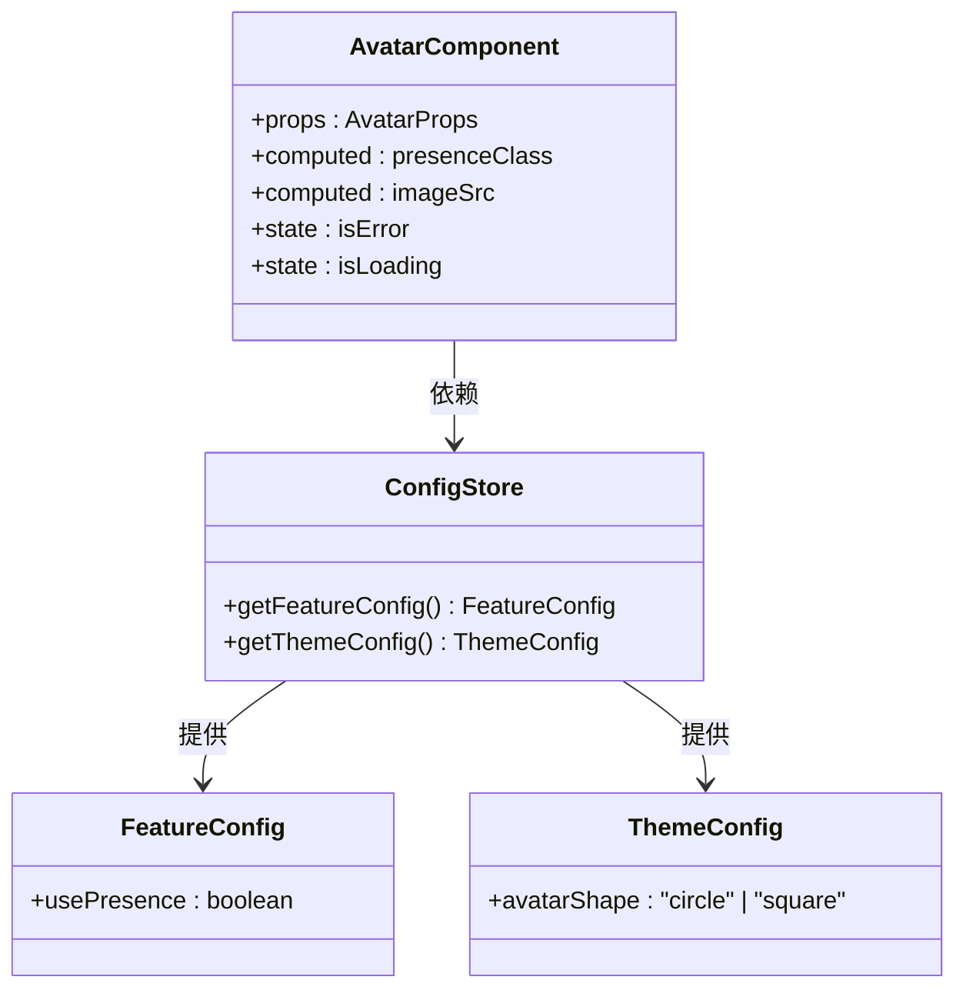
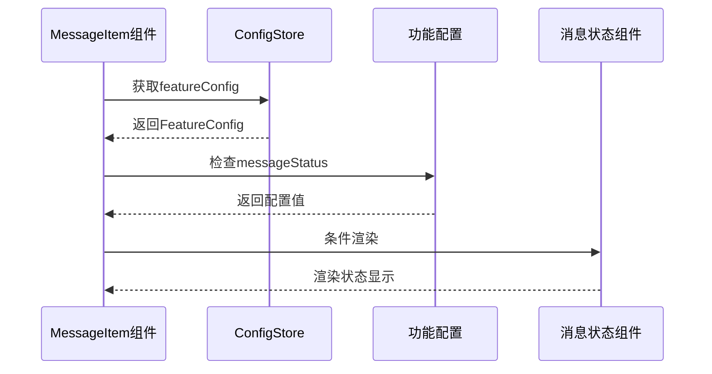
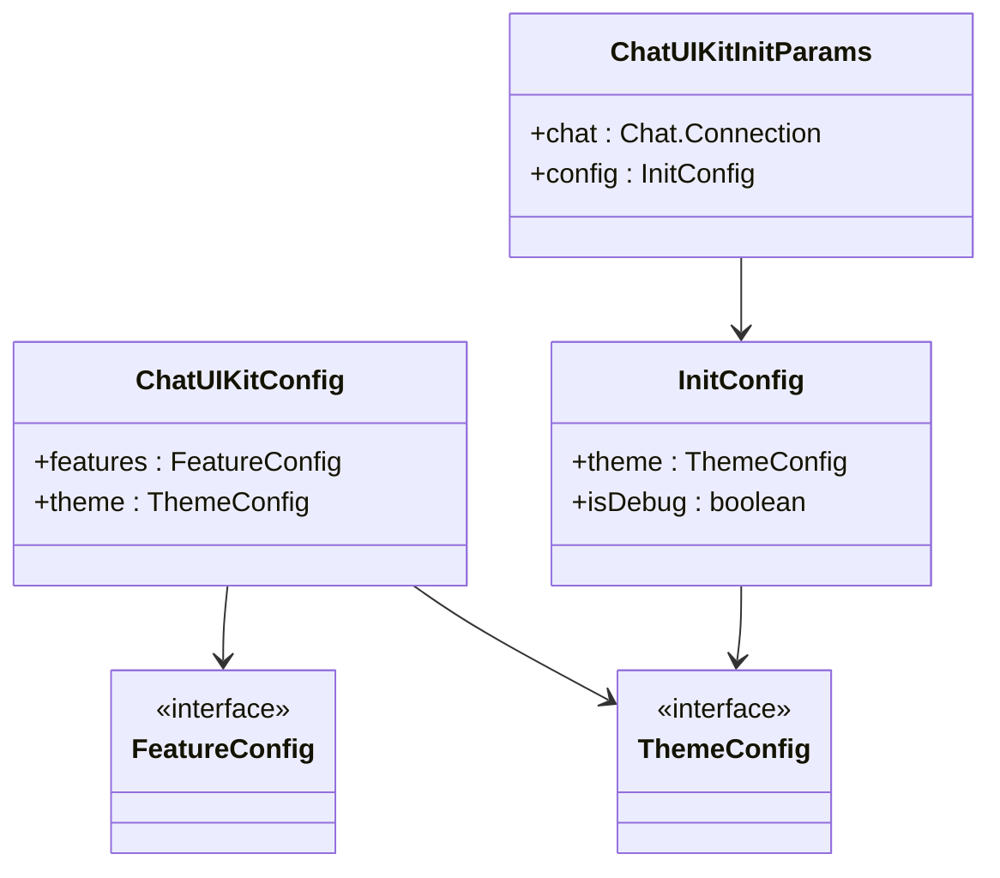
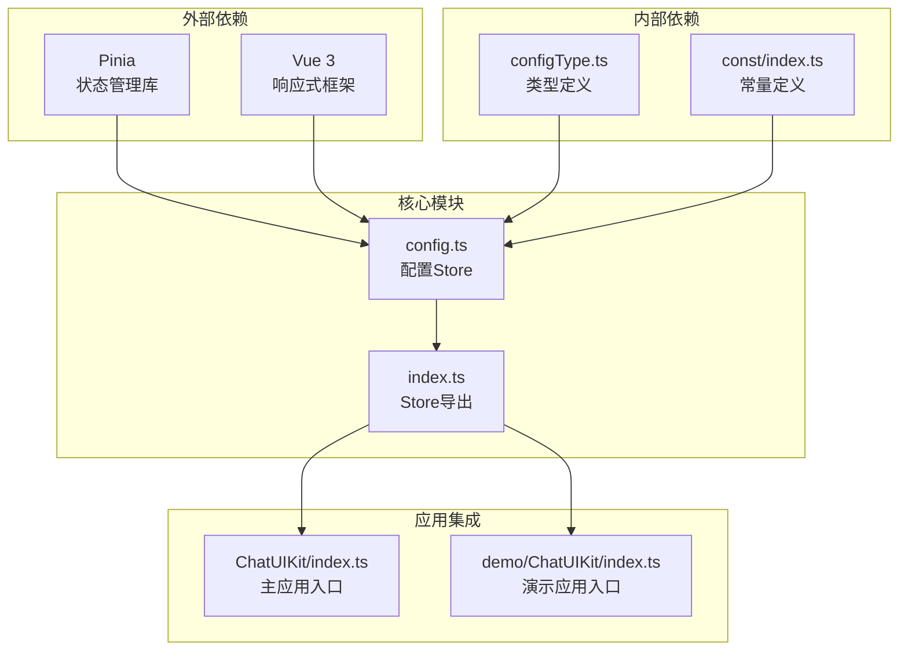

# 配置状态管理

<cite>
**本文档引用的文件**
- [ChatUIKit/stores/config.ts](file://ChatUIKit/stores/config.ts)
- [demo/ChatUIKit/stores/config.ts](file://demo/ChatUIKit/stores/config.ts)
- [ChatUIKit/configType.ts](file://ChatUIKit/configType.ts)
- [ChatUIKit/stores/index.ts](file://ChatUIKit/stores/index.ts)
- [ChatUIKit/const/index.ts](file://ChatUIKit/const/index.ts)
- [ChatUIKit/components/Avatar/index.vue](file://ChatUIKit/components/Avatar/index.vue)
- [ChatUIKit/modules/Chat/components/Message/messageItem.vue](file://ChatUIKit/modules/Chat/components/Message/messageItem.vue)
- [ChatUIKit/index.ts](file://ChatUIKit/index.ts)
- [demo/ChatUIKit/index.ts](file://demo/ChatUIKit/index.ts)
</cite>

## 更新摘要
**变更内容**
- 更新架构概览以反映从 MobX 到 Pinia 的完全迁移
- 修正配置管理机制说明，确认包含完整的 actions 实现
- 更新数据结构分析，反映 themeConfig 和 featureConfig 的分离设计
- 补充 Pinia 状态管理的技术细节
- 更新组件集成分析以反映最新的使用模式

## 目录
1. [简介](#简介)
2. [项目结构](#项目结构)
3. [核心组件](#核心组件)
4. [架构概览](#架构概览)
5. [详细组件分析](#详细组件分析)
6. [依赖分析](#依赖分析)
7. [性能考虑](#性能考虑)
8. [故障排除指南](#故障排除指南)
9. [结论](#结论)

## 简介

配置状态管理Store是EaseMob UIKit项目中的核心状态管理模块，负责统一管理应用的配置状态。该模块实现了从MobX到Pinia的完全重构迁移，提供了主题配置、功能开关和用户偏好设置的统一管理机制。

**更新** 完全迁移到Pinia状态管理库，移除了MobX依赖，提供了更简洁的配置管理架构。

本模块的主要目标包括：
- 统一管理应用配置状态
- 提供主题配置和功能开关的动态更新
- 支持配置的热重载和持久化
- 与主题系统和功能系统深度集成
- 提供最佳实践和扩展方案

## 项目结构

配置状态管理模块位于ChatUIKit项目的stores目录下，采用Pinia状态管理库实现。项目包含两个相同的配置Store实现文件，分别位于主项目和demo项目中：

**图表来源**
- [ChatUIKit/stores/config.ts](file://ChatUIKit/stores/config.ts#L1-L124)
- [ChatUIKit/configType.ts](file://ChatUIKit/configType.ts#L1-L68)
- [ChatUIKit/stores/index.ts](file://ChatUIKit/stores/index.ts#L1-L31)

**章节来源**
- [ChatUIKit/stores/config.ts](file://ChatUIKit/stores/config.ts#L1-L124)
- [ChatUIKit/configType.ts](file://ChatUIKit/configType.ts#L1-L68)
- [ChatUIKit/stores/index.ts](file://ChatUIKit/stores/index.ts#L1-L31)

## 核心组件

配置状态管理Store的核心组件包括以下主要部分：

### 数据结构设计

配置状态采用统一的状态结构，包含主题配置和功能配置两个主要部分：

**图表来源**
- [ChatUIKit/stores/config.ts](file://ChatUIKit/stores/config.ts#L14-L17)
- [ChatUIKit/configType.ts](file://ChatUIKit/configType.ts#L3-L40)

### 默认配置策略

系统提供了完整的默认配置策略，确保新用户能够获得最佳的使用体验：

| 配置类别 | 默认值 | 说明 |
|---------|--------|------|
| 主题配置 | avatarShape: 'circle' | 头像形状，默认圆形 |
| 功能配置 | 全部开启 | 所有功能默认启用 |
| 调试模式 | isDebug: false | 调试模式默认关闭 |

**更新** 配置结构已简化为themeConfig和featureConfig两个独立的配置对象，移除了复杂的嵌套结构。

**章节来源**
- [ChatUIKit/stores/config.ts](file://ChatUIKit/stores/config.ts#L19-L57)

## 架构概览

配置状态管理采用分层架构设计，实现了配置状态的统一管理和组件间的松耦合集成：

**更新** 完全迁移到Pinia架构，移除了MobX依赖，提供了更简洁的状态管理机制。

**图表来源**
- [ChatUIKit/stores/config.ts](file://ChatUIKit/stores/config.ts#L59-L123)
- [ChatUIKit/stores/index.ts](file://ChatUIKit/stores/index.ts#L9-L16)

## 详细组件分析

### ConfigStore实现分析

ConfigStore是配置状态管理的核心实现，基于Pinia提供了完整的状态管理功能：

#### 状态管理机制

ConfigStore采用了Pinia的响应式状态管理机制，提供了以下核心功能：

1. **状态初始化**：通过默认配置对象初始化初始状态
2. **状态更新**：支持部分配置更新和完整配置替换
3. **状态查询**：提供多种查询方式获取配置信息
4. **状态重置**：支持恢复到默认配置状态

**更新** 完整实现了所有配置管理动作，包括setThemeConfig、setFeatureConfig、hideFeature、showFeature和reset。

#### 配置更新流程

**图表来源**
- [ChatUIKit/stores/config.ts](file://ChatUIKit/stores/config.ts#L82-L95)

#### 功能开关管理

ConfigStore提供了灵活的功能开关管理机制：

**图表来源**
- [ChatUIKit/stores/config.ts](file://ChatUIKit/stores/config.ts#L97-L121)

**章节来源**
- [ChatUIKit/stores/config.ts](file://ChatUIKit/stores/config.ts#L59-L123)

### 组件集成分析

配置状态管理与多个UI组件深度集成，实现了配置驱动的UI行为控制。

#### Avatar组件集成

Avatar组件通过配置状态实现了动态的主题控制：

**图表来源**
- [ChatUIKit/components/Avatar/index.vue](file://ChatUIKit/components/Avatar/index.vue#L25-L96)
- [ChatUIKit/stores/config.ts](file://ChatUIKit/stores/config.ts#L65-L80)

#### MessageItem组件集成

MessageItem组件集成了消息状态显示功能：

**图表来源**
- [ChatUIKit/modules/Chat/components/Message/messageItem.vue](file://ChatUIKit/modules/Chat/components/Message/messageItem.vue#L99-L120)

**章节来源**
- [ChatUIKit/components/Avatar/index.vue](file://ChatUIKit/components/Avatar/index.vue#L25-L96)
- [ChatUIKit/modules/Chat/components/Message/messageItem.vue](file://ChatUIKit/modules/Chat/components/Message/messageItem.vue#L99-L120)

### 类型系统分析

配置状态管理采用了严格的TypeScript类型系统，确保类型安全和开发体验：

#### 配置类型定义

**图表来源**
- [ChatUIKit/configType.ts](file://ChatUIKit/configType.ts#L47-L67)

**章节来源**
- [ChatUIKit/configType.ts](file://ChatUIKit/configType.ts#L1-L68)

## 依赖分析

配置状态管理模块的依赖关系相对简单，主要依赖于Pinia状态管理库和内部的类型定义：

**更新** 完全移除了MobX依赖，现在仅依赖Pinia和Vue 3的响应式系统。

**图表来源**
- [ChatUIKit/stores/config.ts](file://ChatUIKit/stores/config.ts#L10-L12)
- [ChatUIKit/stores/index.ts](file://ChatUIKit/stores/index.ts#L6-L16)

### 依赖关系特点

1. **低耦合设计**：ConfigStore不依赖具体业务逻辑，仅依赖基础的类型定义
2. **可移植性**：Store实现可以在不同环境中复用
3. **类型安全**：完整的TypeScript类型定义确保编译时类型检查
4. **响应式更新**：基于Pinia的自动响应式更新机制

**章节来源**
- [ChatUIKit/stores/config.ts](file://ChatUIKit/stores/config.ts#L10-L12)
- [ChatUIKit/stores/index.ts](file://ChatUIKit/stores/index.ts#L6-L16)

## 性能考虑

配置状态管理在性能方面采用了多项优化策略：

### 响应式更新优化

1. **细粒度更新**：Pinia的响应式系统只更新受影响的组件
2. **状态分离**：主题配置和功能配置分离存储，避免不必要的重渲染
3. **计算属性缓存**：组件中使用computed属性缓存计算结果

### 内存管理

1. **状态压缩**：配置状态通常较小，内存占用有限
2. **垃圾回收**：Vue 3的响应式系统提供良好的垃圾回收机制
3. **组件卸载**：组件销毁时自动清理响应式订阅

### 性能监控建议

虽然当前实现已经比较高效，但可以考虑以下优化：

1. **配置懒加载**：对于大型功能配置，可以考虑按需加载
2. **状态分片**：对于超大配置，可以考虑状态分片存储
3. **缓存策略**：为频繁访问的配置添加缓存机制

## 故障排除指南

### 常见问题及解决方案

#### 配置不生效问题

**问题描述**：修改配置后界面没有变化

**可能原因**：
1. 组件未正确订阅配置状态
2. 配置更新方式不正确
3. 组件生命周期问题

**解决方案**：
1. 确保组件使用`useConfigStore()`正确获取store实例
2. 使用`setThemeConfig()`或`setFeatureConfig()`方法更新配置
3. 检查组件是否在正确的生命周期内访问配置

#### 配置丢失问题

**问题描述**：页面刷新后配置恢复到默认值

**可能原因**：
1. 配置未实现持久化
2. 页面刷新导致状态重置

**解决方案**：
1. 实现localStorage或其他持久化机制
2. 在应用启动时恢复配置状态

#### 类型错误问题

**问题描述**：TypeScript编译时报错

**可能原因**：
1. 配置类型不匹配
2. 缺少必要的类型导入

**解决方案**：
1. 确保使用正确的配置类型
2. 检查类型导入语句
3. 验证配置值的类型一致性

**章节来源**
- [ChatUIKit/stores/config.ts](file://ChatUIKit/stores/config.ts#L82-L123)

## 结论

配置状态管理Store成功实现了从MobX到Pinia的完全迁移，提供了统一的配置管理机制。该模块具有以下优势：

1. **架构清晰**：采用分层设计，职责明确
2. **类型安全**：完整的TypeScript类型定义
3. **易于扩展**：支持新的配置项和功能
4. **性能优秀**：基于Pinia的响应式更新机制
5. **集成良好**：与UI组件深度集成

### 最佳实践建议

1. **配置分类管理**：按照功能域对配置进行分类管理
2. **默认值策略**：为每个配置项提供合理的默认值
3. **类型约束**：严格使用TypeScript类型定义
4. **性能监控**：定期监控配置更新对性能的影响
5. **文档维护**：及时更新配置相关的技术文档

### 扩展方案

1. **配置持久化**：实现配置的本地存储和恢复
2. **配置同步**：支持多设备间配置同步
3. **配置模板**：提供预设的配置模板
4. **配置导入导出**：支持配置的批量导入导出
5. **配置版本管理**：跟踪配置的历史变更

**更新** 当前版本已完全移除MobX依赖，提供了更简洁、高效的Pinia状态管理方案，为EaseMob UIKit项目提供了坚实的基础，支持了丰富的主题定制和功能开关能力，为用户提供了灵活的个性化体验。