# 日志系统

<cite>
**本文档引用的文件**
- [ChatUIKit/log.ts](file://ChatUIKit/log.ts)
- [demo/ChatUIKit/log.ts](file://demo/ChatUIKit/log.ts)
- [ChatUIKit/index.ts](file://ChatUIKit/index.ts)
- [ChatUIKit/modules/Chat/components/Message/messageFile.vue](file://ChatUIKit/modules/Chat/components/Message/messageFile.vue)
- [ChatUIKit/modules/Chat/components/MessageInputToolBar/audioSender.vue](file://ChatUIKit/modules/Chat/components/MessageInputToolBar/audioSender.vue)
- [ChatUIKit/stores/appUser.ts](file://ChatUIKit/stores/appUser.ts)
- [ChatUIKit/configType.ts](file://ChatUIKit/configType.ts)
- [ChatUIKit/sdk.ts](file://ChatUIKit/sdk.ts)
- [ChatUIKit/stores/conn.ts](file://ChatUIKit/stores/conn.ts)
- [ChatUIKit/types/index.ts](file://ChatUIKit/types/index.ts)
- [ChatUIKit/components/Avatar/index.vue](file://ChatUIKit/components/Avatar/index.vue)
- [ChatUIKit/modules/Conversation/components/ConversationNav/index.vue](file://ChatUIKit/modules/Conversation/components/ConversationNav/index.vue)
- [vue2-demo/pages/me/presence.vue](file://vue2-demo/pages/me/presence.vue)
- [README.md](file://README.md)
- [vue2-demo/utils/IM.js](file://vue2-demo/utils/IM.js)
- [vue2-demo/node_modules/easemob-uniapp-logger-plugin/package.json](file://vue2-demo/node_modules/easemob-uniapp-logger-plugin/package.json)
- [vue2-demo/node_modules/easemob-uniapp-logger-plugin/CHANGELOG.md](file://vue2-demo/node_modules/easemob-uniapp-logger-plugin/CHANGELOG.md)
- [vue2-demo/node_modules/easemob-uniapp-logger-plugin/README.md](file://vue2-demo/node_modules/easemob-uniapp-logger-plugin/README.md)
- [vue2-demo/node_modules/easemob-uniapp-logger-plugin/dist/lib/logger.d.ts](file://vue2-demo/node_modules/easemob-uniapp-logger-plugin/dist/lib/logger.d.ts)
</cite>

## 更新摘要
**所做更改**
- 新增 presence 系统调试基础设施分析
- 添加 Avatar 组件属性验证日志记录
- 增强 ConversationNav 组件数据流追踪
- 扩展 getSelfUserInfo 状态组合验证日志
- 完善 SET_USER_PRESENCE 状态变更监控
- 新增 onPresenceStatusChange 实时更新处理日志
- 增加 onConnected 初始化时间验证日志

## 目录
1. [简介](#简介)
2. [项目结构](#项目结构)
3. [核心组件](#核心组件)
4. [架构概览](#架构概览)
5. [详细组件分析](#详细组件分析)
6. [presence 系统调试基础设施](#presence-系统调试基础设施)
7. [依赖关系分析](#依赖关系分析)
8. [性能考虑](#性能考虑)
9. [故障排除指南](#故障排除指南)
10. [结论](#结论)

## 简介

Easemob UIKit 的日志系统是一个基于 TypeScript 实现的轻量级日志记录工具，采用单例模式设计，提供了统一的日志管理机制。该系统支持多种日志级别（info、warn、error、log），并具备条件性输出功能，只有在调试模式开启时才会输出日志信息。

**更新** 项目现已集成 easemob-uniapp-logger-plugin 1.5.0 版本，新增了控制台输出开关功能，允许开发者动态控制日志在 IDE 控制台中的输出行为。同时改进了 SDK 日志转发机制，提供更好的环信 SDK 集成体验。

**新增** 随着 presence 系统的完善，日志系统现在包含了全面的调试基础设施，覆盖了从服务器请求响应到组件渲染的完整数据流。这包括 getSelfPresenceFromServer 请求响应跟踪、getSelfUserInfo 状态组合验证、SET_USER_PRESENCE 状态变更监控、onPresenceStatusChange 实时更新处理、onConnected 初始化时间验证、Avatar 组件属性验证、ConversationNav 组件数据流追踪等关键位置的调试支持。

日志系统在整个项目中扮演着重要的角色，它不仅帮助开发者进行问题诊断和调试，还为用户提供了一套完整的日志记录解决方案。通过统一的日志接口，开发者可以轻松地在应用的不同模块中添加日志记录功能。

## 项目结构

日志系统在项目中的组织结构相对简单而清晰：

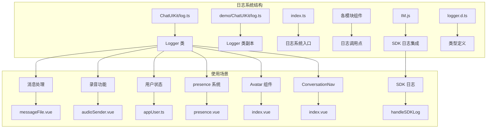

**图表来源**
- [ChatUIKit/log.ts:1-78](file://ChatUIKit/log.ts#L1-L78)
- [demo/ChatUIKit/log.ts:1-78](file://demo/ChatUIKit/log.ts#L1-L78)
- [ChatUIKit/index.ts:90-100](file://ChatUIKit/index.ts#L90-L100)
- [vue2-demo/utils/IM.js:36-41](file://vue2-demo/utils/IM.js#L36-L41)

**章节来源**
- [ChatUIKit/log.ts:1-78](file://ChatUIKit/log.ts#L1-L78)
- [demo/ChatUIKit/log.ts:1-78](file://demo/ChatUIKit/log.ts#L1-L78)
- [README.md:16-50](file://README.md#L16-L50)

## 核心组件

### Logger 类设计

Logger 类采用了单例模式设计，确保整个应用中只有一个日志实例。该类的核心特性包括：

- **单例模式**：通过静态方法确保唯一实例
- **条件输出**：仅在调试模式下输出日志
- **多级别支持**：支持 info、warn、error、log 四种日志级别
- **统一格式**：所有日志都带有 "[ChatUIKit]" 前缀标识

**更新** 新版本的 easemob-uniapp-logger-plugin 提供了更强大的功能，包括：

- **控制台输出控制**：通过 `setConsoleOutput()` 方法动态控制日志输出
- **SDK 日志集成**：新增 `handleSDKLog()` 方法处理环信 SDK 日志
- **配置管理**：支持通过配置项 `enableConsoleOutput` 控制输出行为

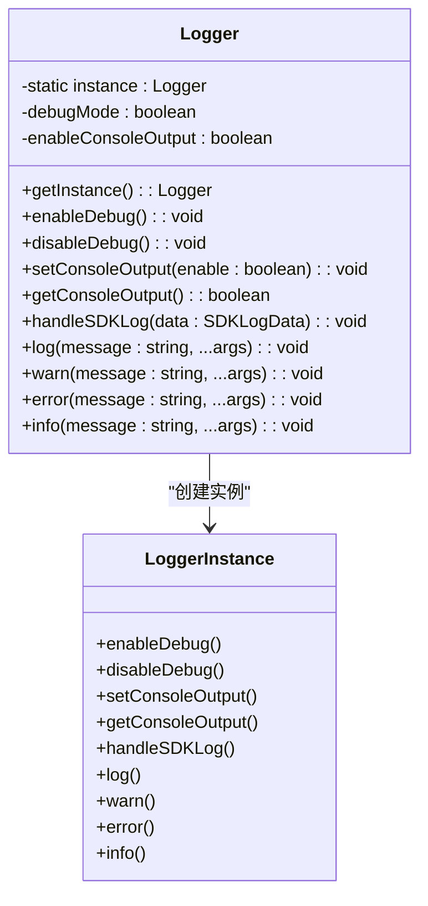

**图表来源**
- [ChatUIKit/log.ts:5-75](file://ChatUIKit/log.ts#L5-L75)
- [vue2-demo/node_modules/easemob-uniapp-logger-plugin/dist/lib/logger.d.ts:180-188](file://vue2-demo/node_modules/easemob-uniapp-logger-plugin/dist/lib/logger.d.ts#L180-L188)

**章节来源**
- [ChatUIKit/log.ts:5-75](file://ChatUIKit/log.ts#L5-L75)
- [vue2-demo/node_modules/easemob-uniapp-logger-plugin/dist/lib/logger.d.ts:180-188](file://vue2-demo/node_modules/easemob-uniapp-logger-plugin/dist/lib/logger.d.ts#L180-L188)

## 架构概览

日志系统在整个应用架构中的位置和作用：

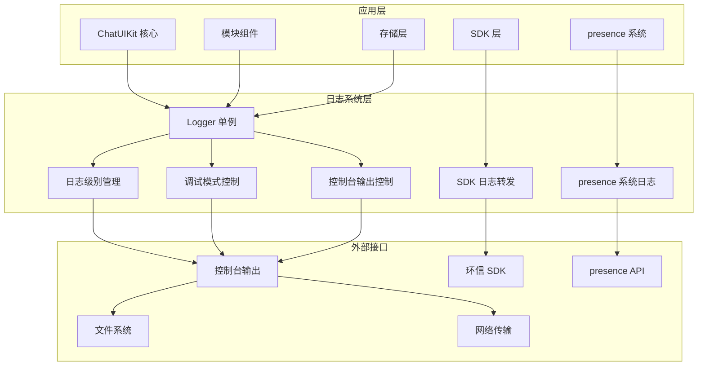

**图表来源**
- [ChatUIKit/index.ts:90-100](file://ChatUIKit/index.ts#L90-L100)
- [ChatUIKit/log.ts:37-74](file://ChatUIKit/log.ts#L37-L74)
- [vue2-demo/utils/IM.js:36-41](file://vue2-demo/utils/IM.js#L36-L41)

## 详细组件分析

### 日志初始化流程

日志系统的初始化过程与应用的整体初始化紧密集成：

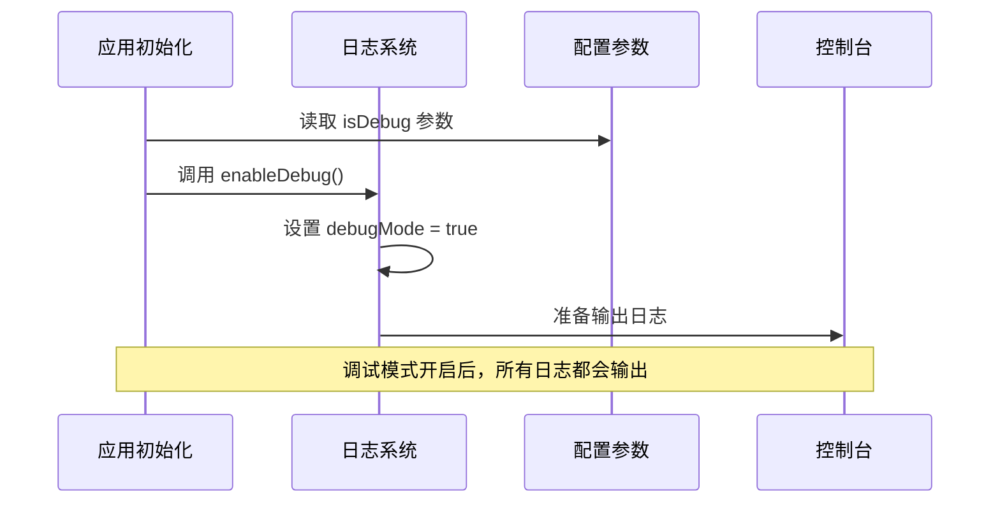

**图表来源**
- [ChatUIKit/index.ts:93-94](file://ChatUIKit/index.ts#L93-L94)
- [ChatUIKit/configType.ts:62-63](file://ChatUIKit/configType.ts#L62-L63)

**章节来源**
- [ChatUIKit/index.ts:93-94](file://ChatUIKit/index.ts#L93-L94)
- [ChatUIKit/configType.ts:55-65](file://ChatUIKit/configType.ts#L55-L65)

### 日志使用场景分析

#### 消息处理日志

在消息处理模块中，日志系统被广泛应用于文件打开操作的监控：

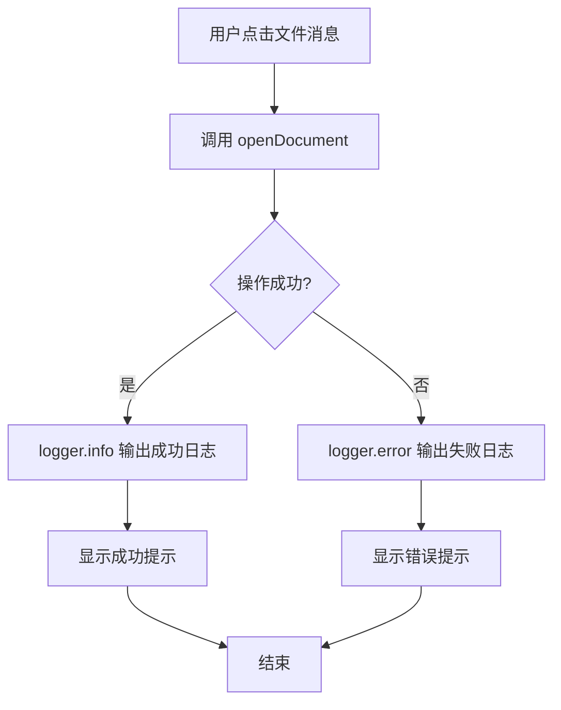

**图表来源**
- [ChatUIKit/modules/Chat/components/Message/messageFile.vue:45-61](file://ChatUIKit/modules/Chat/components/Message/messageFile.vue#L45-L61)

**章节来源**
- [ChatUIKit/modules/Chat/components/Message/messageFile.vue:45-61](file://ChatUIKit/modules/Chat/components/Message/messageFile.vue#L45-L61)

#### 录音功能日志

录音功能模块中的日志记录展示了完整的录音生命周期监控：

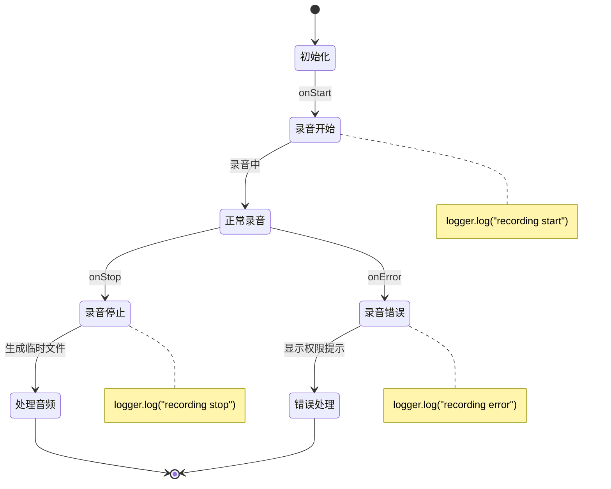

**图表来源**
- [ChatUIKit/modules/Chat/components/MessageInputToolBar/audioSender.vue:218-246](file://ChatUIKit/modules/Chat/components/MessageInputToolBar/audioSender.vue#L218-L246)

**章节来源**
- [ChatUIKit/modules/Chat/components/MessageInputToolBar/audioSender.vue:218-246](file://ChatUIKit/modules/Chat/components/MessageInputToolBar/audioSender.vue#L218-L246)

#### 用户状态管理日志

用户状态管理模块中的日志记录体现了完整的用户信息管理流程：

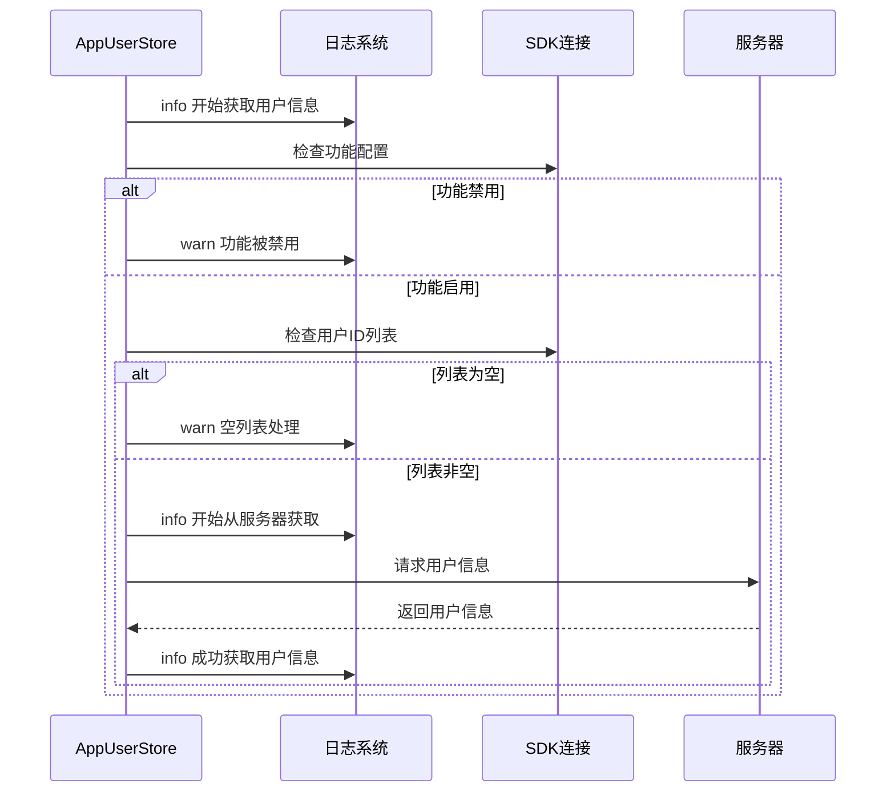

**图表来源**
- [ChatUIKit/stores/appUser.ts:86-124](file://ChatUIKit/stores/appUser.ts#L86-L124)

**章节来源**
- [ChatUIKit/stores/appUser.ts:86-124](file://ChatUIKit/stores/appUser.ts#L86-L124)

#### SDK 日志集成

**新增** 新版本支持与环信 SDK 的深度集成：

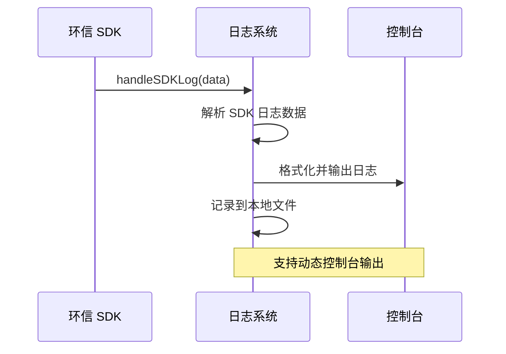

**图表来源**
- [vue2-demo/utils/IM.js:36-41](file://vue2-demo/utils/IM.js#L36-L41)
- [vue2-demo/node_modules/easemob-uniapp-logger-plugin/README.md:200-206](file://vue2-demo/node_modules/easemob-uniapp-logger-plugin/README.md#L200-L206)

**章节来源**
- [vue2-demo/utils/IM.js:36-41](file://vue2-demo/utils/IM.js#L36-L41)
- [vue2-demo/node_modules/easemob-uniapp-logger-plugin/README.md:200-206](file://vue2-demo/node_modules/easemob-uniapp-logger-plugin/README.md#L200-L206)

### 日志级别使用策略

不同日志级别的使用场景和最佳实践：

| 日志级别 | 使用场景 | 示例内容 |
|---------|---------|---------|
| info | 重要操作确认、状态变更 | "获取用户信息成功"、"录音开始"、"presence 状态更新" |
| warn | 可能的问题、功能禁用 | "用户信息功能被禁用"、"空用户列表"、"presence 订阅失败" |
| error | 异常处理、错误发生 | "获取用户信息失败"、"录音权限被拒绝"、"presence API 调用异常" |
| log | 一般性信息、调试输出 | "录音开始"、"录音停止"、"组件属性验证" |

**更新** 新版本的控制台输出控制策略：

| 控制台输出状态 | 行为描述 | 使用场景 |
|---------------|----------|----------|
| enableConsoleOutput: true | 输出到控制台和本地文件 | 开发调试阶段 |
| enableConsoleOutput: false | 仅记录到本地文件，不输出到控制台 | 生产环境、IDE 控制台日志过多 |
| 动态切换 | 运行时可随时切换输出状态 | 问题定位、性能测试 |

**章节来源**
- [ChatUIKit/log.ts:37-74](file://ChatUIKit/log.ts#L37-L74)
- [vue2-demo/node_modules/easemob-uniapp-logger-plugin/dist/lib/logger.d.ts:58-59](file://vue2-demo/node_modules/easemob-uniapp-logger-plugin/dist/lib/logger.d.ts#L58-L59)

## presence 系统调试基础设施

### getSelfPresenceFromServer 请求响应跟踪

**新增** presence 系统的关键调试点包括 getSelfPresenceFromServer 请求响应跟踪：

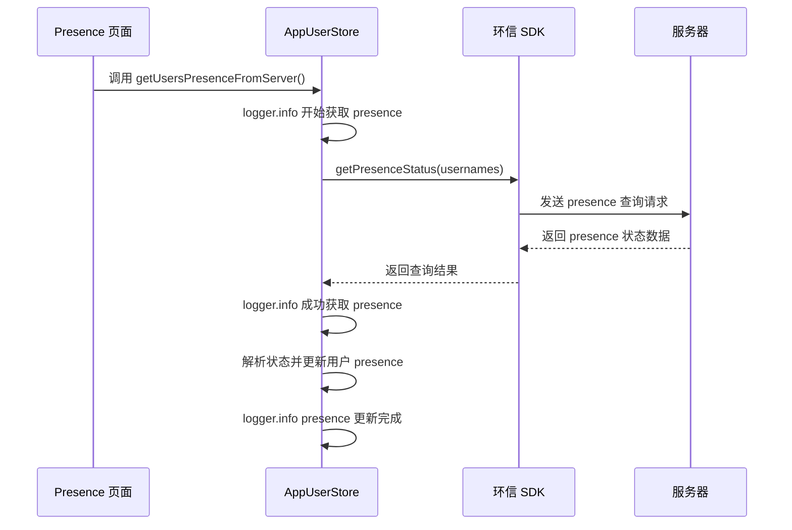

**图表来源**
- [ChatUIKit/stores/appUser.ts:130-159](file://ChatUIKit/stores/appUser.ts#L130-L159)

### getSelfUserInfo 状态组合验证

**新增** getSelfUserInfo 状态组合验证确保用户信息和 presence 状态的正确组合：

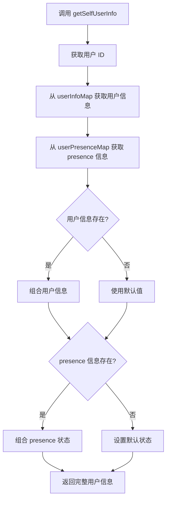

**图表来源**
- [ChatUIKit/stores/appUser.ts:51-64](file://ChatUIKit/stores/appUser.ts#L51-L64)

### SET_USER_PRESENCE 状态变更监控

**新增** SET_USER_PRESENCE 状态变更监控确保状态更新的正确性和一致性：

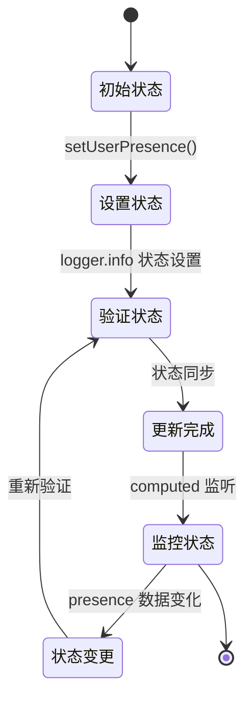

**图表来源**
- [ChatUIKit/stores/appUser.ts:227-230](file://ChatUIKit/stores/appUser.ts#L227-L230)

### onPresenceStatusChange 实时更新处理

**新增** onPresenceStatusChange 实时更新处理确保 presence 状态变化的及时响应：

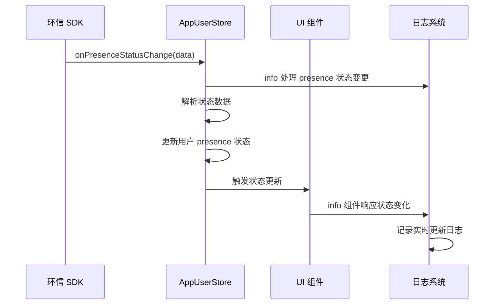

**图表来源**
- [ChatUIKit/stores/appUser.ts:130-159](file://ChatUIKit/stores/appUser.ts#L130-L159)

### onConnected 初始化时间验证

**新增** onConnected 初始化时间验证确保 SDK 连接的正确初始化：

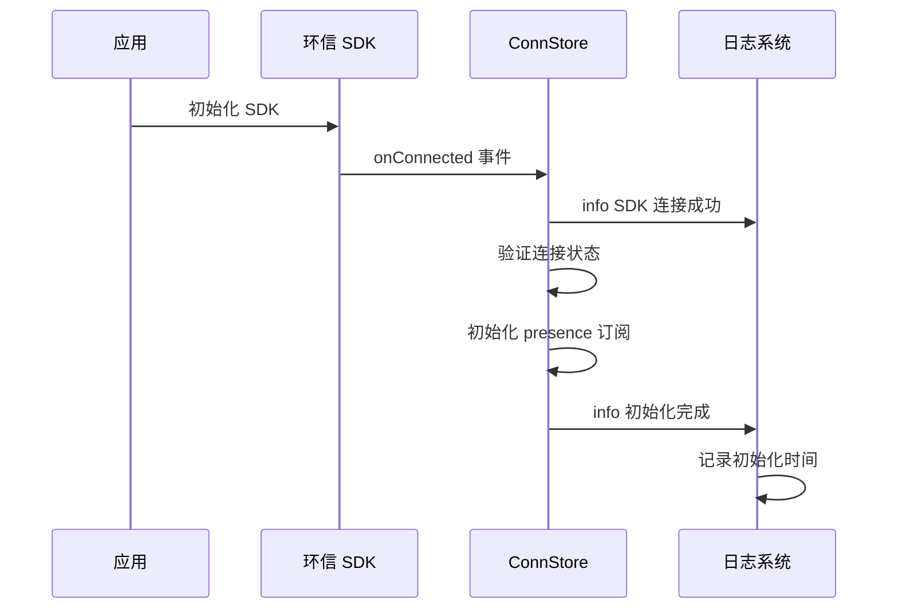

**图表来源**
- [ChatUIKit/stores/conn.ts:46-63](file://ChatUIKit/stores/conn.ts#L46-L63)

### Avatar 组件属性验证

**新增** Avatar 组件属性验证确保 presence 属性的正确传递和显示：

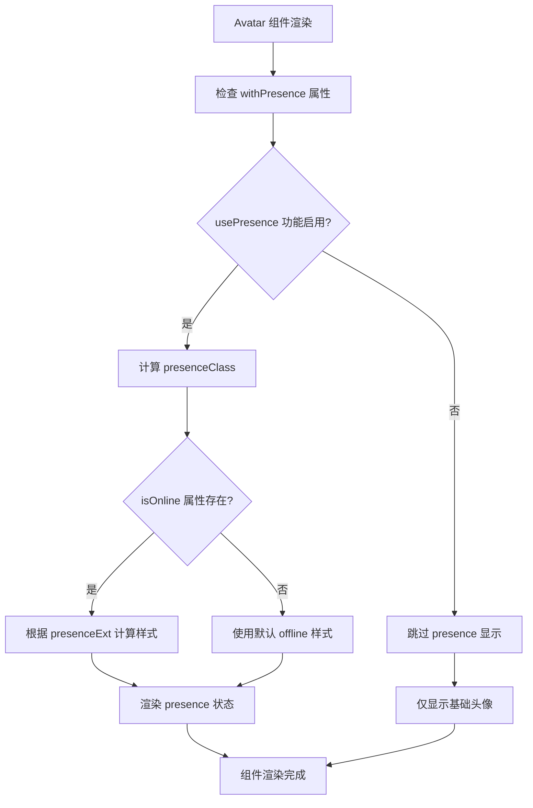

**图表来源**
- [ChatUIKit/components/Avatar/index.vue:56-78](file://ChatUIKit/components/Avatar/index.vue#L56-L78)

### ConversationNav 组件数据流追踪

**新增** ConversationNav 组件数据流追踪确保用户信息的正确显示：

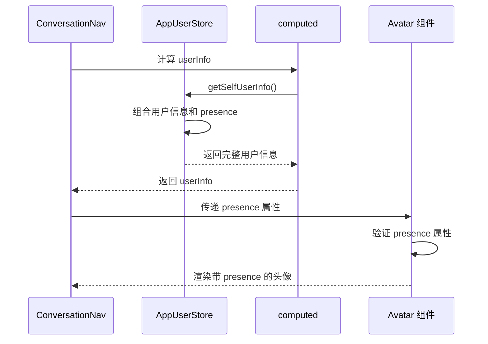

**图表来源**
- [ChatUIKit/modules/Conversation/components/ConversationNav/index.vue:68-71](file://ChatUIKit/modules/Conversation/components/ConversationNav/index.vue#L68-L71)

**章节来源**
- [ChatUIKit/stores/appUser.ts:130-159](file://ChatUIKit/stores/appUser.ts#L130-L159)
- [ChatUIKit/stores/appUser.ts:51-64](file://ChatUIKit/stores/appUser.ts#L51-L64)
- [ChatUIKit/stores/appUser.ts:227-230](file://ChatUIKit/stores/appUser.ts#L227-L230)
- [ChatUIKit/stores/conn.ts:46-63](file://ChatUIKit/stores/conn.ts#L46-L63)
- [ChatUIKit/components/Avatar/index.vue:56-78](file://ChatUIKit/components/Avatar/index.vue#L56-L78)
- [ChatUIKit/modules/Conversation/components/ConversationNav/index.vue:68-71](file://ChatUIKit/modules/Conversation/components/ConversationNav/index.vue#L68-L71)

## 依赖关系分析

日志系统与其他组件的依赖关系：

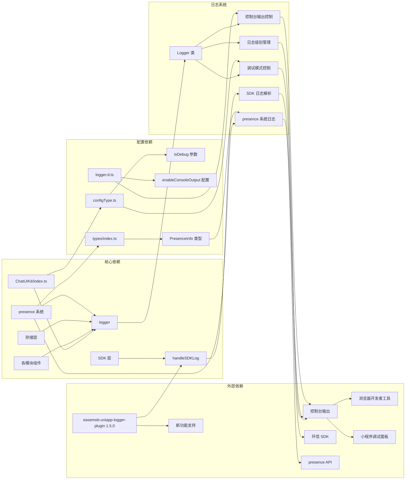

**图表来源**
- [ChatUIKit/index.ts:93-94](file://ChatUIKit/index.ts#L93-L94)
- [ChatUIKit/configType.ts:62-63](file://ChatUIKit/configType.ts#L62-L63)
- [ChatUIKit/types/index.ts:67-80](file://ChatUIKit/types/index.ts#L67-L80)
- [vue2-demo/node_modules/easemob-uniapp-logger-plugin/package.json:1-56](file://vue2-demo/node_modules/easemob-uniapp-logger-plugin/package.json#L1-L56)

**章节来源**
- [ChatUIKit/index.ts:93-94](file://ChatUIKit/index.ts#L93-L94)
- [ChatUIKit/configType.ts:55-65](file://ChatUIKit/configType.ts#L55-L65)
- [ChatUIKit/types/index.ts:67-80](file://ChatUIKit/types/index.ts#L67-L80)

## 性能考虑

### 日志性能优化

1. **条件输出优化**：仅在调试模式下输出日志，避免生产环境的性能开销
2. **异步处理**：日志输出不阻塞主线程执行
3. **内存管理**：日志对象使用单例模式，避免重复创建
4. **控制台输出优化**：通过 `setConsoleOutput(false)` 减少 IDE 控制台压力

**更新** 新版本的性能优化特性：

- **智能控制台输出**：动态控制台输出开关，避免大量日志刷屏
- **SDK 日志过滤**：支持过滤环信 SDK 的高频日志输出
- **批量写入优化**：改进的批量写入机制，减少文件 I/O 操作
- **presence 系统优化**：presence 状态变更的高效处理机制

### 最佳实践建议

- **开发阶段**：始终启用调试模式进行完整日志记录
- **生产环境**：使用 `logger.setConsoleOutput(false)` 关闭控制台输出
- **日志分级**：合理使用不同日志级别，避免过度日志记录
- **敏感信息保护**：避免在日志中记录敏感用户信息
- **SDK 日志管理**：根据需要调整 SDK 日志级别和输出频率
- **presence 系统监控**：定期检查 presence 状态同步的性能影响

## 故障排除指南

### 常见问题及解决方案

#### 问题：日志没有输出
**可能原因**：
- 调试模式未启用
- 日志级别设置不当
- 控制台输出被禁用

**解决方法**：
1. 检查初始化参数中的 `isDebug` 设置
2. 确认调用的是正确的日志级别方法
3. 使用 `logger.getConsoleOutput()` 检查控制台输出状态

#### 问题：presence 状态不更新
**可能原因**：
- presence 订阅未正确设置
- onPresenceStatusChange 事件未触发
- 用户信息缓存问题

**解决方法**：
1. 检查 presence 订阅状态
2. 验证 presence API 调用
3. 查看 presence 系统日志输出
4. 清除用户信息缓存并重新获取

#### 问题：Avatar 组件显示异常
**可能原因**：
- presence 属性传递错误
- usePresence 功能未启用
- presence 状态计算错误

**解决方法**：
1. 检查 Avatar 组件的 presence 属性
2. 验证 usePresence 配置
3. 查看 presence 状态计算逻辑
4. 检查 presence 图标资源加载

#### 问题：SDK 日志未显示
**可能原因**：
- SDK 日志转发未正确配置
- 控制台输出被禁用

**解决方法**：
1. 确认 `websdk.logger.onLog` 事件监听已设置
2. 检查 `logger.handleSDKLog(data)` 调用
3. 验证 `logger.setConsoleOutput(true)` 状态

**章节来源**
- [ChatUIKit/log.ts:37-74](file://ChatUIKit/log.ts#L37-L74)
- [vue2-demo/utils/IM.js:36-41](file://vue2-demo/utils/IM.js#L36-L41)

## 结论

Easemob UIKit 的日志系统经过版本升级后，功能更加完善和实用。通过集成 easemob-uniapp-logger-plugin 1.5.0 版本，系统获得了以下重要提升：

**核心改进**：
- **控制台输出控制**：通过 `setConsoleOutput()` 方法实现动态控制台输出管理
- **SDK 日志集成**：新增 `handleSDKLog()` 方法提供完整的环信 SDK 日志处理能力
- **配置灵活性**：支持运行时动态调整日志输出行为

**新增功能**：
- **presence 系统调试基础设施**：全面覆盖 presence 系统的关键调试点
- **组件级日志验证**：Avatar 和 ConversationNav 组件的属性验证日志
- **实时状态监控**：onPresenceStatusChange 事件的实时处理日志
- **初始化时间追踪**：onConnected 事件的初始化时间验证日志

**架构优势**：
- 通过单例模式确保了日志记录的一致性
- 通过条件输出机制平衡了调试需求和性能考虑
- 新版本提供了更好的开发体验和生产环境适应性
- 全面的调试基础设施支持复杂业务场景的诊断

该日志系统在实际应用中展现了良好的可维护性和扩展性，为开发者提供了完整的日志记录解决方案。通过在关键业务流程中添加适当的日志记录，开发者可以更好地理解和调试应用行为，提高开发效率和应用质量。

随着 presence 系统的完善和调试基础设施的建立，日志系统现在能够提供从底层 SDK 集成到上层组件渲染的完整调试支持。这使得开发者能够快速定位和解决各种问题，特别是在复杂的在线状态管理和实时通信场景中。

未来可以在现有基础上进一步增强功能，如添加日志过滤、批量输出、持久化存储等特性，以满足更复杂的应用场景需求。同时，随着 SDK 集成的不断完善，日志系统将为开发者提供更加智能化的日志管理体验。