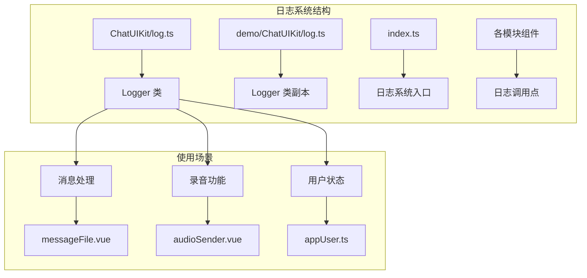
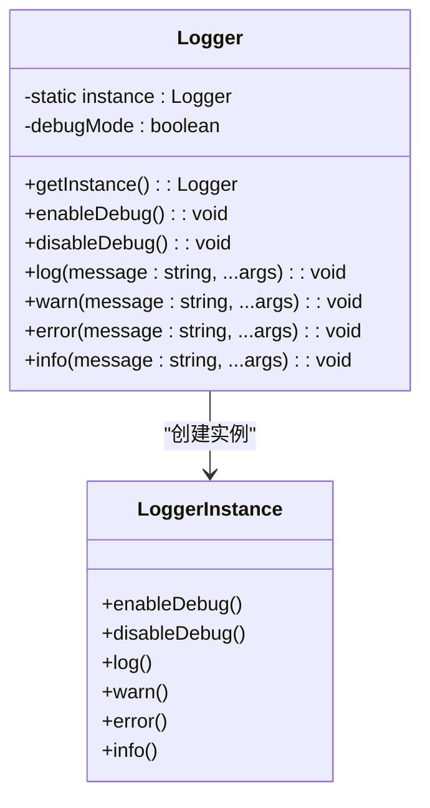
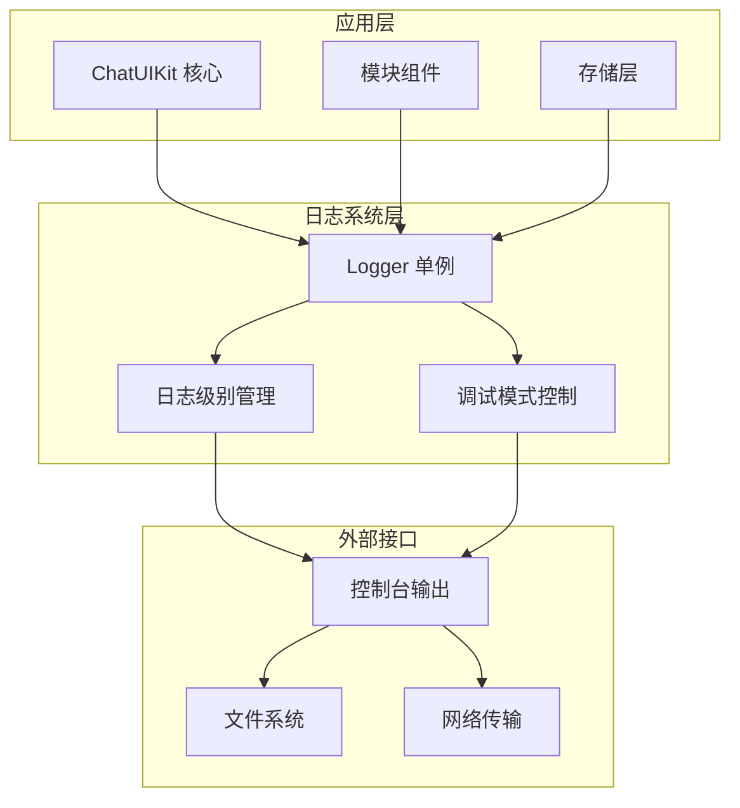
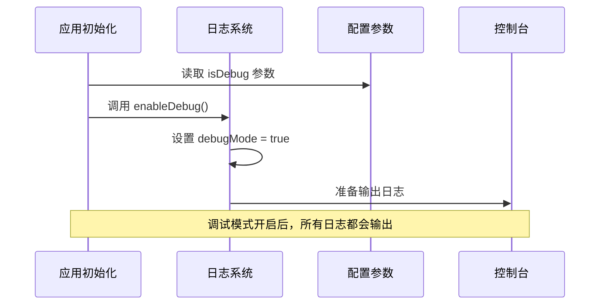
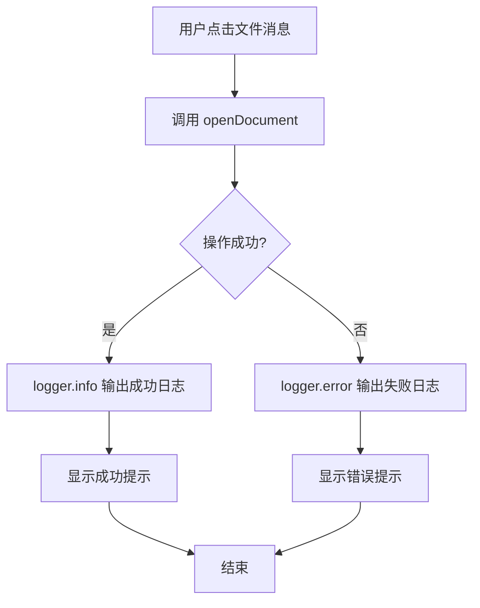
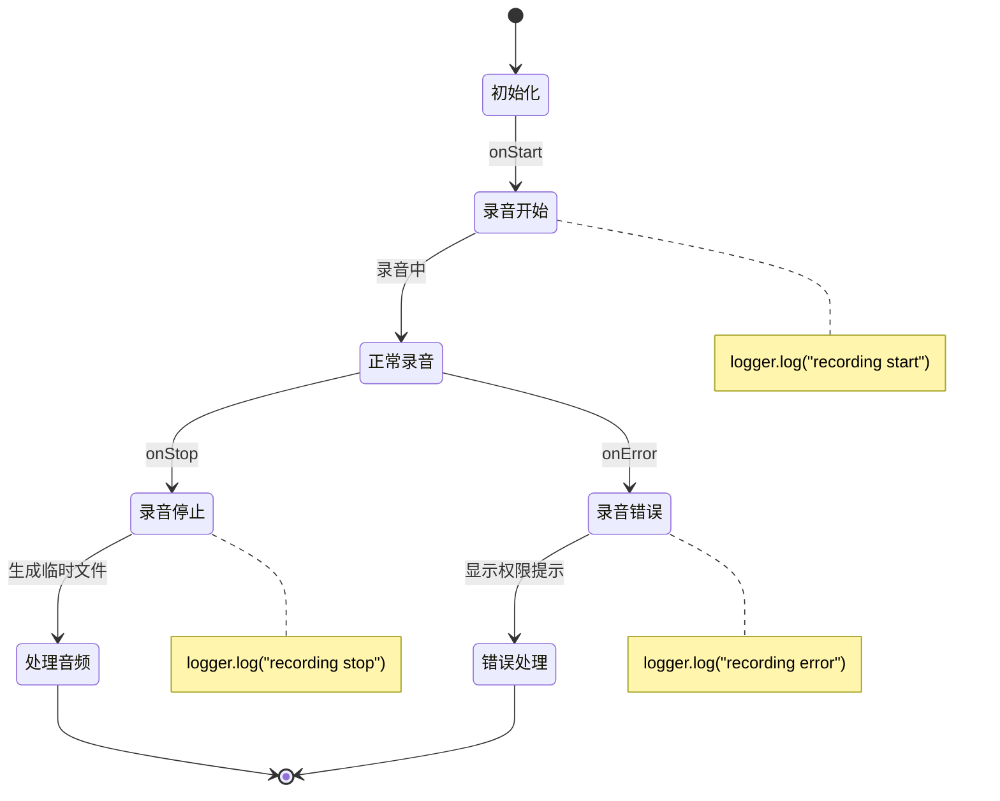
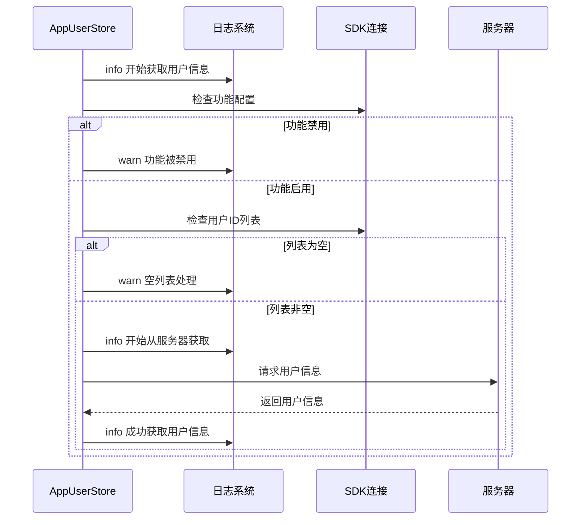
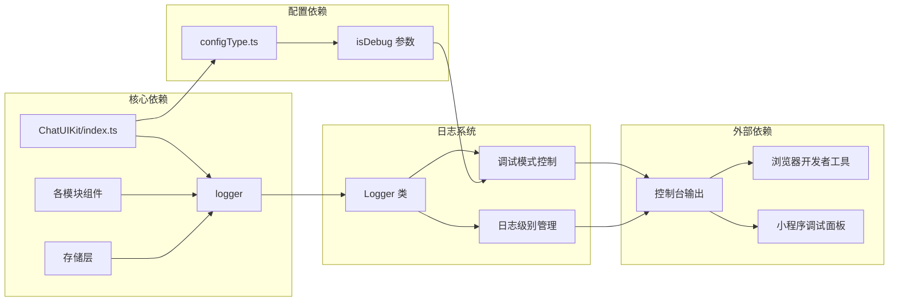

# 日志系统

<cite>
**本文档引用的文件**
- [ChatUIKit/log.ts](file://ChatUIKit/log.ts)
- [demo/ChatUIKit/log.ts](file://demo/ChatUIKit/log.ts)
- [ChatUIKit/index.ts](file://ChatUIKit/index.ts)
- [ChatUIKit/modules/Chat/components/Message/messageFile.vue](file://ChatUIKit/modules/Chat/components/Message/messageFile.vue)
- [ChatUIKit/modules/Chat/components/MessageInputToolBar/audioSender.vue](file://ChatUIKit/modules/Chat/components/MessageInputToolBar/audioSender.vue)
- [ChatUIKit/stores/appUser.ts](file://ChatUIKit/stores/appUser.ts)
- [ChatUIKit/configType.ts](file://ChatUIKit/configType.ts)
- [ChatUIKit/sdk.ts](file://ChatUIKit/sdk.ts)
- [README.md](file://README.md)
</cite>

## 目录
1. [简介](#简介)
2. [项目结构](#项目结构)
3. [核心组件](#核心组件)
4. [架构概览](#架构概览)
5. [详细组件分析](#详细组件分析)
6. [依赖关系分析](#依赖关系分析)
7. [性能考虑](#性能考虑)
8. [故障排除指南](#故障排除指南)
9. [结论](#结论)

## 简介

Easemob UIKit 的日志系统是一个基于 TypeScript 实现的轻量级日志记录工具，采用单例模式设计，提供了统一的日志管理机制。该系统支持多种日志级别（info、warn、error、log），并具备条件性输出功能，只有在调试模式开启时才会输出日志信息。

日志系统在整个项目中扮演着重要的角色，它不仅帮助开发者进行问题诊断和调试，还为用户提供了一套完整的日志记录解决方案。通过统一的日志接口，开发者可以轻松地在应用的不同模块中添加日志记录功能。

## 项目结构

日志系统在项目中的组织结构相对简单而清晰：

**图表来源**
- [ChatUIKit/log.ts](file://ChatUIKit/log.ts#L1-L78)
- [demo/ChatUIKit/log.ts](file://demo/ChatUIKit/log.ts#L1-L78)
- [ChatUIKit/index.ts](file://ChatUIKit/index.ts#L90-L100)

**章节来源**
- [ChatUIKit/log.ts](file://ChatUIKit/log.ts#L1-L78)
- [demo/ChatUIKit/log.ts](file://demo/ChatUIKit/log.ts#L1-L78)
- [README.md](file://README.md#L16-L50)

## 核心组件

### Logger 类设计

Logger 类采用了单例模式设计，确保整个应用中只有一个日志实例。该类的核心特性包括：

- **单例模式**：通过静态方法确保唯一实例
- **条件输出**：仅在调试模式下输出日志
- **多级别支持**：支持 info、warn、error、log 四种日志级别
- **统一格式**：所有日志都带有 "[ChatUIKit]" 前缀标识

**图表来源**
- [ChatUIKit/log.ts](file://ChatUIKit/log.ts#L5-L75)

**章节来源**
- [ChatUIKit/log.ts](file://ChatUIKit/log.ts#L5-L75)

## 架构概览

日志系统在整个应用架构中的位置和作用：

**图表来源**
- [ChatUIKit/index.ts](file://ChatUIKit/index.ts#L90-L100)
- [ChatUIKit/log.ts](file://ChatUIKit/log.ts#L37-L74)

## 详细组件分析

### 日志初始化流程

日志系统的初始化过程与应用的整体初始化紧密集成：

**图表来源**
- [ChatUIKit/index.ts](file://ChatUIKit/index.ts#L93-L94)
- [ChatUIKit/configType.ts](file://ChatUIKit/configType.ts#L62-L63)

**章节来源**
- [ChatUIKit/index.ts](file://ChatUIKit/index.ts#L93-L94)
- [ChatUIKit/configType.ts](file://ChatUIKit/configType.ts#L55-L65)

### 日志使用场景分析

#### 消息处理日志

在消息处理模块中，日志系统被广泛应用于文件打开操作的监控：

**图表来源**
- [ChatUIKit/modules/Chat/components/Message/messageFile.vue](file://ChatUIKit/modules/Chat/components/Message/messageFile.vue#L45-L61)

**章节来源**
- [ChatUIKit/modules/Chat/components/Message/messageFile.vue](file://ChatUIKit/modules/Chat/components/Message/messageFile.vue#L45-L61)

#### 录音功能日志

录音功能模块中的日志记录展示了完整的录音生命周期监控：

**图表来源**
- [ChatUIKit/modules/Chat/components/MessageInputToolBar/audioSender.vue](file://ChatUIKit/modules/Chat/components/MessageInputToolBar/audioSender.vue#L218-L246)

**章节来源**
- [ChatUIKit/modules/Chat/components/MessageInputToolBar/audioSender.vue](file://ChatUIKit/modules/Chat/components/MessageInputToolBar/audioSender.vue#L218-L246)

#### 用户状态管理日志

用户状态管理模块中的日志记录体现了完整的用户信息管理流程：

**图表来源**
- [ChatUIKit/stores/appUser.ts](file://ChatUIKit/stores/appUser.ts#L86-L124)

**章节来源**
- [ChatUIKit/stores/appUser.ts](file://ChatUIKit/stores/appUser.ts#L86-L124)

### 日志级别使用策略

不同日志级别的使用场景和最佳实践：

| 日志级别 | 使用场景 | 示例内容 |
|---------|---------|---------|
| info | 重要操作确认、状态变更 | "获取用户信息成功"、"录音开始" |
| warn | 可能的问题、功能禁用 | "用户信息功能被禁用"、"空用户列表" |
| error | 异常处理、错误发生 | "获取用户信息失败"、"录音权限被拒绝" |
| log | 一般性信息、调试输出 | "录音开始"、"录音停止" |

**章节来源**
- [ChatUIKit/log.ts](file://ChatUIKit/log.ts#L37-L74)

## 依赖关系分析

日志系统与其他组件的依赖关系：

**图表来源**
- [ChatUIKit/index.ts](file://ChatUIKit/index.ts#L93-L94)
- [ChatUIKit/configType.ts](file://ChatUIKit/configType.ts#L62-L63)

**章节来源**
- [ChatUIKit/index.ts](file://ChatUIKit/index.ts#L93-L94)
- [ChatUIKit/configType.ts](file://ChatUIKit/configType.ts#L55-L65)

## 性能考虑

### 日志性能优化

1. **条件输出优化**：仅在调试模式下输出日志，避免生产环境的性能开销
2. **异步处理**：日志输出不阻塞主线程执行
3. **内存管理**：日志对象使用单例模式，避免重复创建

### 最佳实践建议

- **开发阶段**：始终启用调试模式进行完整日志记录
- **生产环境**：保持调试模式关闭，减少不必要的日志输出
- **日志分级**：合理使用不同日志级别，避免过度日志记录
- **敏感信息保护**：避免在日志中记录敏感用户信息

## 故障排除指南

### 常见问题及解决方案

#### 问题：日志没有输出
**可能原因**：
- 调试模式未启用
- 日志级别设置不当

**解决方法**：
1. 检查初始化参数中的 `isDebug` 设置
2. 确认调用的是正确的日志级别方法

#### 问题：日志格式不符合预期
**可能原因**：
- 日志前缀格式固定
- 参数传递方式问题

**解决方法**：
1. 使用统一的 logger 实例
2. 按照方法签名正确传递参数

**章节来源**
- [ChatUIKit/log.ts](file://ChatUIKit/log.ts#L37-L74)

## 结论

Easemob UIKit 的日志系统虽然结构简洁，但设计合理且实用性强。通过单例模式确保了日志记录的一致性，通过条件输出机制平衡了调试需求和性能考虑。

该日志系统在实际应用中展现了良好的可维护性和扩展性，为开发者提供了完整的日志记录解决方案。通过在关键业务流程中添加适当的日志记录，开发者可以更好地理解和调试应用行为，提高开发效率和应用质量。

未来可以在现有基础上进一步增强功能，如添加日志过滤、批量输出、持久化存储等特性，以满足更复杂的应用场景需求。