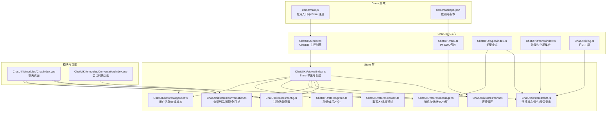
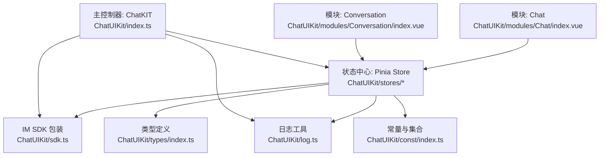
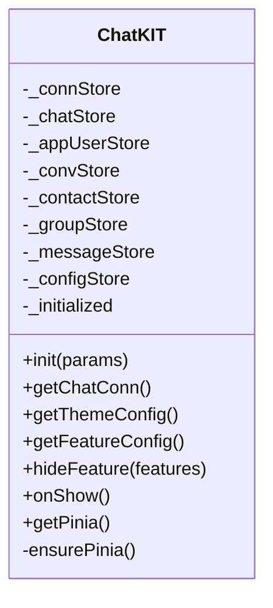
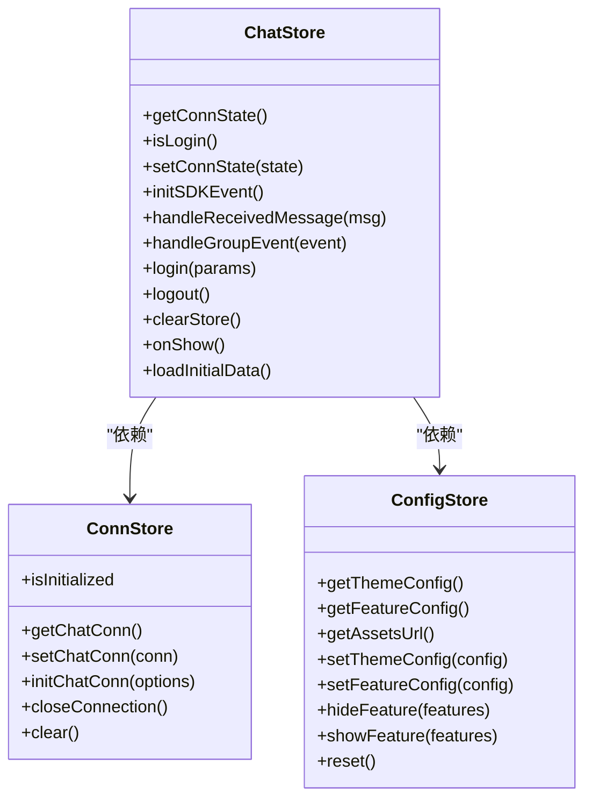
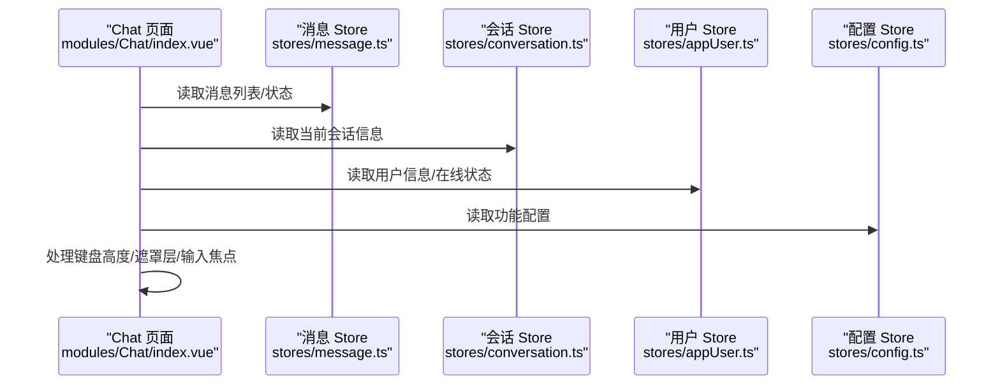
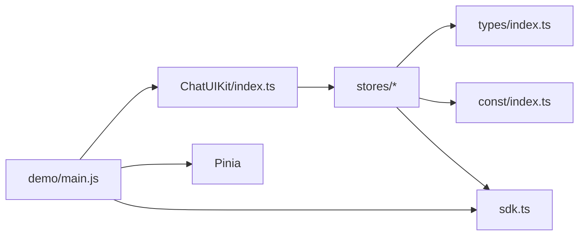
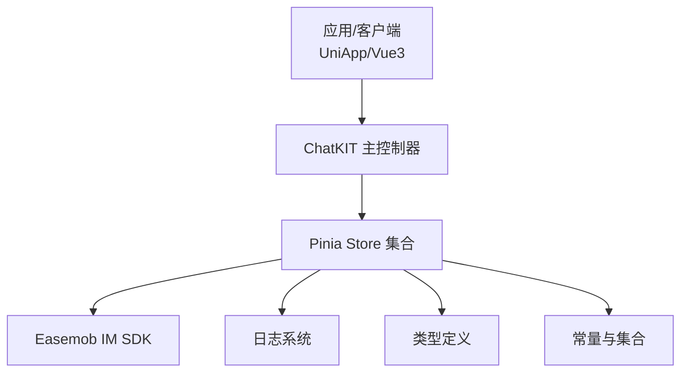
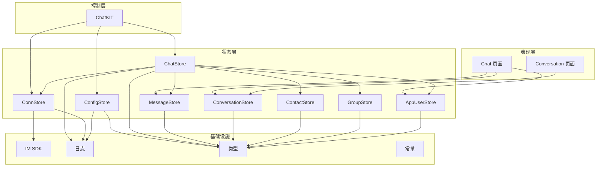

# 核心架构

<cite>
**本文引用的文件**
- [ChatUIKit/index.ts](file://ChatUIKit/index.ts)
- [ChatUIKit/stores/index.ts](file://ChatUIKit/stores/index.ts)
- [ChatUIKit/sdk.ts](file://ChatUIKit/sdk.ts)
- [ChatUIKit/configType.ts](file://ChatUIKit/configType.ts)
- [ChatUIKit/stores/chat.ts](file://ChatUIKit/stores/chat.ts)
- [ChatUIKit/stores/conn.ts](file://ChatUIKit/stores/conn.ts)
- [ChatUIKit/stores/config.ts](file://ChatUIKit/stores/config.ts)
- [ChatUIKit/types/index.ts](file://ChatUIKit/types/index.ts)
- [ChatUIKit/modules/Chat/index.vue](file://ChatUIKit/modules/Chat/index.vue)
- [ChatUIKit/modules/Conversation/index.vue](file://ChatUIKit/modules/Conversation/index.vue)
- [ChatUIKit/log.ts](file://ChatUIKit/log.ts)
- [ChatUIKit/const/index.ts](file://ChatUIKit/const/index.ts)
- [demo/main.js](file://demo/main.js)
- [demo/package.json](file://demo/package.json)
- [README.md](file://README.md)
</cite>

## 目录
1. [引言](#引言)
2. [项目结构](#项目结构)
3. [核心组件](#核心组件)
4. [架构总览](#架构总览)
5. [详细组件分析](#详细组件分析)
6. [依赖分析](#依赖分析)
7. [性能考量](#性能考量)
8. [故障排查指南](#故障排查指南)
9. [结论](#结论)
10. [附录](#附录)

## 引言
本文件面向 Easemob UIKit（UniApp/Vue3）项目的架构与实现，聚焦于整体设计模式、架构层次与系统边界；系统以 ChatKIT 主控制器为核心，围绕 Pinia Store 构建状态管理模式，并通过模块化组件承载 UI 功能。本文将系统化阐述：
- 设计模式与架构分层
- ChatKIT 主控制器职责与生命周期
- Store 系统的状态管理与数据流
- 组件间交互关系与控制流
- 技术决策、权衡与约束
- 基础设施要求、可扩展性与部署拓扑
- 安全性、监控与灾难恢复关注点
- 技术栈、第三方依赖与版本兼容性

## 项目结构
ChatUIKit 采用“模块化页面 + Pinia Store + 类型与常量”的组织方式，Demo 展示了在 UniApp/Vue3 场景下的集成与运行。

图表来源
- [ChatUIKit/index.ts](file://ChatUIKit/index.ts#L1-L139)
- [ChatUIKit/stores/index.ts](file://ChatUIKit/stores/index.ts#L1-L31)
- [ChatUIKit/sdk.ts](file://ChatUIKit/sdk.ts#L1-L13)
- [ChatUIKit/types/index.ts](file://ChatUIKit/types/index.ts#L1-L100)
- [ChatUIKit/const/index.ts](file://ChatUIKit/const/index.ts#L1-L37)
- [ChatUIKit/log.ts](file://ChatUIKit/log.ts#L1-L78)
- [ChatUIKit/modules/Chat/index.vue](file://ChatUIKit/modules/Chat/index.vue#L1-L200)
- [ChatUIKit/modules/Conversation/index.vue](file://ChatUIKit/modules/Conversation/index.vue#L1-L12)
- [demo/main.js](file://demo/main.js#L1-L28)
- [demo/package.json](file://demo/package.json#L1-L18)

章节来源
- [README.md](file://README.md#L14-L50)

## 核心组件
- ChatKIT 主控制器：集中管理 Store 实例、初始化 IM SDK、主题与功能配置、生命周期联动（onShow）、提供全局 Pinia 实例。
- Store 系统：以 Pinia 为核心，按域划分 Store（连接、配置、聊天、会话、消息、联系人、群组、用户），统一状态与副作用。
- 模块与页面：以功能模块拆分（聊天、会话列表等），通过 Store 解耦数据与视图。
- 类型与常量：统一类型定义与全局常量，保障跨模块一致性。
- 日志与 SDK 包装：统一日志开关与 IM SDK 类型导出，便于调试与维护。

章节来源
- [ChatUIKit/index.ts](file://ChatUIKit/index.ts#L18-L132)
- [ChatUIKit/stores/index.ts](file://ChatUIKit/stores/index.ts#L1-L31)
- [ChatUIKit/configType.ts](file://ChatUIKit/configType.ts#L1-L68)
- [ChatUIKit/types/index.ts](file://ChatUIKit/types/index.ts#L1-L100)
- [ChatUIKit/const/index.ts](file://ChatUIKit/const/index.ts#L1-L37)
- [ChatUIKit/log.ts](file://ChatUIKit/log.ts#L1-L78)
- [ChatUIKit/sdk.ts](file://ChatUIKit/sdk.ts#L1-L13)

## 架构总览
系统采用“主控制器 + Store 状态中心 + 模块化页面”的分层架构：
- 表现层：模块页面（如 Chat、Conversation）负责渲染与交互。
- 控制层：ChatKIT 主控制器协调初始化、生命周期与全局状态。
- 状态层：各 Store 管理各自领域的状态与副作用，通过 getters/actions 协同。
- 基础设施层：IM SDK、日志、类型与常量。

图表来源
- [ChatUIKit/modules/Chat/index.vue](file://ChatUIKit/modules/Chat/index.vue#L1-L200)
- [ChatUIKit/modules/Conversation/index.vue](file://ChatUIKit/modules/Conversation/index.vue#L1-L12)
- [ChatUIKit/index.ts](file://ChatUIKit/index.ts#L1-L139)
- [ChatUIKit/stores/index.ts](file://ChatUIKit/stores/index.ts#L1-L31)
- [ChatUIKit/sdk.ts](file://ChatUIKit/sdk.ts#L1-L13)
- [ChatUIKit/log.ts](file://ChatUIKit/log.ts#L1-L78)
- [ChatUIKit/types/index.ts](file://ChatUIKit/types/index.ts#L1-L100)
- [ChatUIKit/const/index.ts](file://ChatUIKit/const/index.ts#L1-L37)

## 详细组件分析

### ChatKIT 主控制器
职责与行为：
- 延迟初始化 Pinia 与各 Store，避免在未注册前访问状态。
- 初始化 IM SDK 连接与主题/功能配置，支持调试开关。
- 提供连接实例访问、主题与功能配置查询、功能隐藏/显示、生命周期 onShow 的连接有效性检测。
- 对外暴露全局 Pinia 实例，便于 Demo 应用统一注册。

图表来源
- [ChatUIKit/index.ts](file://ChatUIKit/index.ts#L18-L132)

章节来源
- [ChatUIKit/index.ts](file://ChatUIKit/index.ts#L18-L132)

### Store 系统与状态管理模式
- Store 导出与创建：集中导出各 Store 并提供 createStores，兼容旧版接口。
- 连接 Store（ConnStore）：封装 IM SDK 连接实例，提供初始化、获取与关闭能力。
- 配置 Store（ConfigStore）：统一管理主题与功能配置，支持默认值、覆盖、隐藏/显示与重置。
- 聊天 Store（ChatStore）：负责连接状态管理、SDK 事件监听、登录/登出、初始数据加载、跨 Store 协调（消息、联系人、群组、会话、用户）。
- 类型与常量：统一类型与全局常量，保证跨模块一致性与可维护性。
- 日志：统一日志开关与输出，便于调试与问题定位。

图表来源
- [ChatUIKit/stores/conn.ts](file://ChatUIKit/stores/conn.ts#L20-L83)
- [ChatUIKit/stores/config.ts](file://ChatUIKit/stores/config.ts#L59-L123)
- [ChatUIKit/stores/chat.ts](file://ChatUIKit/stores/chat.ts#L29-L398)

章节来源
- [ChatUIKit/stores/index.ts](file://ChatUIKit/stores/index.ts#L1-L31)
- [ChatUIKit/stores/conn.ts](file://ChatUIKit/stores/conn.ts#L1-L84)
- [ChatUIKit/stores/config.ts](file://ChatUIKit/stores/config.ts#L1-L124)
- [ChatUIKit/stores/chat.ts](file://ChatUIKit/stores/chat.ts#L1-L407)

### 模块与页面交互
- 聊天模块（Chat/index.vue）：承载消息列表、输入区、工具栏、表情选择器、提及列表、联系人卡片等，通过 Pinia 访问消息、会话、用户与配置状态，处理键盘高度变化与遮罩层逻辑。
- 会话模块（Conversation/index.vue）：作为会话列表页面的容器，引入 ConversationList 组件。

图表来源
- [ChatUIKit/modules/Chat/index.vue](file://ChatUIKit/modules/Chat/index.vue#L74-L200)
- [ChatUIKit/stores/index.ts](file://ChatUIKit/stores/index.ts#L1-L31)

章节来源
- [ChatUIKit/modules/Chat/index.vue](file://ChatUIKit/modules/Chat/index.vue#L1-L200)
- [ChatUIKit/modules/Conversation/index.vue](file://ChatUIKit/modules/Conversation/index.vue#L1-L12)

### 类型与常量
- 类型定义：统一连接状态、消息状态、提及类型、会话项扩展、Presence 信息、用户信息扩展等类型，确保 Store 与组件间的数据契约一致。
- 常量：包括群成员分页大小、提及关键字、资源 URL、头像 URL、最大消息数、Presence 状态列表等。

```mermaid
flowchart TD
T["类型定义<br/>types/index.ts"] --> S["Store 使用"]
C["常量与集合<br/>const/index.ts"] --> S
S --> M["模块页面使用"]
```

图表来源
- [ChatUIKit/types/index.ts](file://ChatUIKit/types/index.ts#L1-L100)
- [ChatUIKit/const/index.ts](file://ChatUIKit/const/index.ts#L1-L37)

章节来源
- [ChatUIKit/types/index.ts](file://ChatUIKit/types/index.ts#L1-L100)
- [ChatUIKit/const/index.ts](file://ChatUIKit/const/index.ts#L1-L37)

## 依赖分析
- 技术栈与版本：
  - Vue3 + UniApp 运行时
  - Pinia 作为状态管理
  - Easemob Web SDK（uniApp 版本）
  - pinyin-pro（拼音工具）
- 依赖关系：
  - ChatKIT 依赖 Store 导出与 SDK 包装
  - Store 依赖类型定义与常量
  - 模块页面依赖 Store 与类型
  - Demo 应用通过 ChatKIT 获取 Pinia 实例进行全局注册

图表来源
- [demo/main.js](file://demo/main.js#L1-L28)
- [demo/package.json](file://demo/package.json#L1-L18)
- [ChatUIKit/index.ts](file://ChatUIKit/index.ts#L1-L139)
- [ChatUIKit/stores/index.ts](file://ChatUIKit/stores/index.ts#L1-L31)
- [ChatUIKit/sdk.ts](file://ChatUIKit/sdk.ts#L1-L13)
- [ChatUIKit/types/index.ts](file://ChatUIKit/types/index.ts#L1-L100)
- [ChatUIKit/const/index.ts](file://ChatUIKit/const/index.ts#L1-L37)

章节来源
- [demo/package.json](file://demo/package.json#L12-L16)
- [demo/main.js](file://demo/main.js#L14-L27)

## 性能考量
- Store 分层与职责清晰：按域划分 Store，降低耦合并提升可维护性。
- 延迟初始化与懒加载：ChatKIT 与 Store Getter 延迟初始化，减少启动时开销。
- 事件驱动与去抖：SDK 事件集中处理，避免重复渲染与无效请求。
- 分页与上限：常量中设置每会话最大消息数，有助于控制内存占用。
- 调试日志：仅在调试模式下输出日志，避免生产环境性能损耗。

## 故障排查指南
- 连接未初始化：当访问连接实例但未初始化时会抛出异常，需先通过 ChatKIT 初始化连接或 ConnStore 的 initChatConn。
- 登录失败：检查 ChatStore.login 的参数与 IM 服务端返回；查看日志输出定位错误。
- 功能不可见：确认 ConfigStore 的功能配置与 hideFeature 的调用情况。
- 资源访问受限：静态资源托管在 OSS，建议迁移至自有服务器并更新 ASSETS_URL。
- 生命周期异常：onShow 中对连接有效性检测，若连接未建立则忽略。

章节来源
- [ChatUIKit/stores/conn.ts](file://ChatUIKit/stores/conn.ts#L25-L40)
- [ChatUIKit/stores/chat.ts](file://ChatUIKit/stores/chat.ts#L299-L328)
- [ChatUIKit/stores/config.ts](file://ChatUIKit/stores/config.ts#L98-L113)
- [ChatUIKit/const/index.ts](file://ChatUIKit/const/index.ts#L7-L8)
- [ChatUIKit/log.ts](file://ChatUIKit/log.ts#L21-L23)

## 结论
本架构以 ChatKIT 为中心，结合 Pinia Store 的域内自治与跨 Store 协作，实现了清晰的分层与高内聚低耦合。通过类型与常量统一契约，模块页面以声明式方式消费状态，具备良好的可扩展性与可维护性。配合日志与配置开关，满足开发与生产的差异化需求。

## 附录

### 系统上下文图

图表来源
- [ChatUIKit/index.ts](file://ChatUIKit/index.ts#L1-L139)
- [ChatUIKit/stores/index.ts](file://ChatUIKit/stores/index.ts#L1-L31)
- [ChatUIKit/sdk.ts](file://ChatUIKit/sdk.ts#L1-L13)
- [ChatUIKit/log.ts](file://ChatUIKit/log.ts#L1-L78)
- [ChatUIKit/types/index.ts](file://ChatUIKit/types/index.ts#L1-L100)
- [ChatUIKit/const/index.ts](file://ChatUIKit/const/index.ts#L1-L37)

### 组件分解图

图表来源
- [ChatUIKit/modules/Chat/index.vue](file://ChatUIKit/modules/Chat/index.vue#L1-L200)
- [ChatUIKit/modules/Conversation/index.vue](file://ChatUIKit/modules/Conversation/index.vue#L1-L12)
- [ChatUIKit/index.ts](file://ChatUIKit/index.ts#L1-L139)
- [ChatUIKit/stores/index.ts](file://ChatUIKit/stores/index.ts#L1-L31)
- [ChatUIKit/stores/chat.ts](file://ChatUIKit/stores/chat.ts#L1-L407)
- [ChatUIKit/stores/conn.ts](file://ChatUIKit/stores/conn.ts#L1-L84)
- [ChatUIKit/stores/config.ts](file://ChatUIKit/stores/config.ts#L1-L124)
- [ChatUIKit/types/index.ts](file://ChatUIKit/types/index.ts#L1-L100)
- [ChatUIKit/const/index.ts](file://ChatUIKit/const/index.ts#L1-L37)
- [ChatUIKit/log.ts](file://ChatUIKit/log.ts#L1-L78)

### 跨领域关注点
- 安全性：登录参数与 Token 管理由 IM SDK 负责；应用侧应避免明文存储敏感信息，日志在生产环境默认关闭。
- 监控：通过统一日志工具输出关键事件与错误；建议在应用层接入埋点上报。
- 灾难恢复：连接断开时 ChatStore 维护连接状态与重连流程；onShow 生命周期中检测连接有效性，必要时触发重连。

章节来源
- [ChatUIKit/stores/chat.ts](file://ChatUIKit/stores/chat.ts#L366-L371)
- [ChatUIKit/log.ts](file://ChatUIKit/log.ts#L21-L23)

### 基础设施要求与部署拓扑
- 运行环境：Vue3 + UniApp（Android/iOS/微信小程序/H5）。
- 依赖安装：通过包管理器安装 easemob-websdk、pinia、pinyin-pro。
- 静态资源：建议将资源迁移至自有服务器，更新 ASSETS_URL 以规避访问限制。
- 部署拓扑：前端应用打包后部署于 CDN 或静态服务器；IM 服务端由环信提供，SDK 通过网络与之通信。

章节来源
- [README.md](file://README.md#L7-L13)
- [README.md](file://README.md#L56-L58)
- [demo/package.json](file://demo/package.json#L12-L16)
- [ChatUIKit/const/index.ts](file://ChatUIKit/const/index.ts#L7-L8)