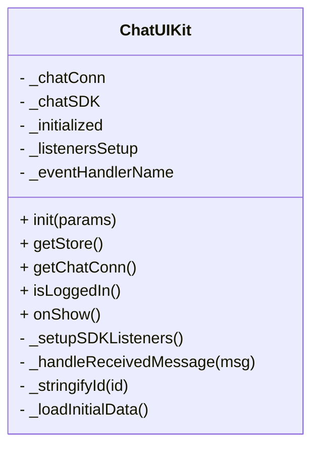
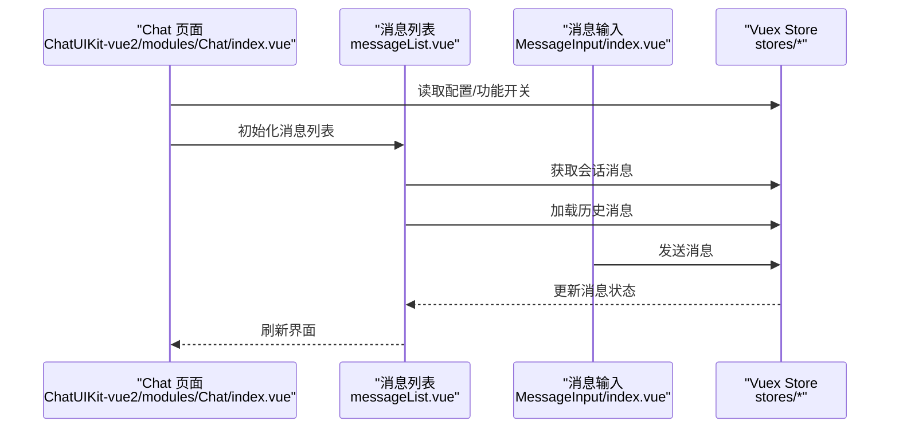
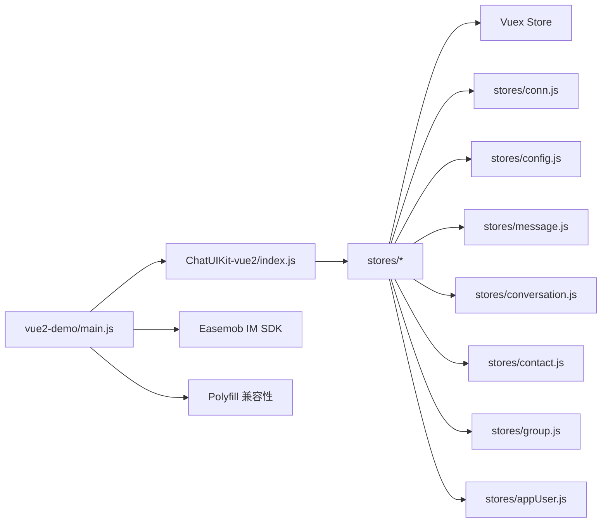
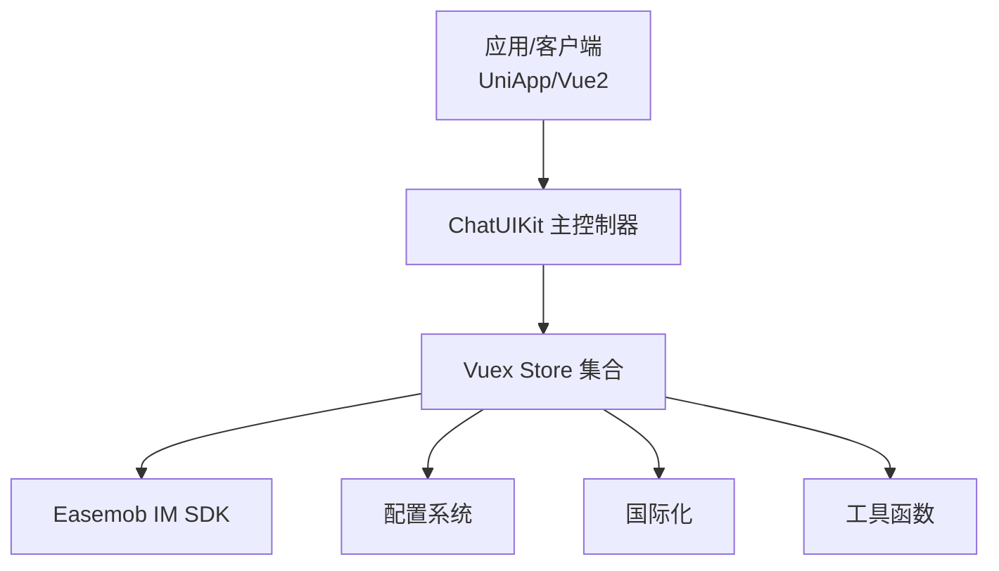
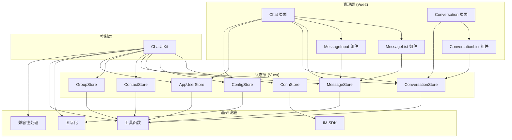

# 核心架构

<cite>
**本文档引用的文件**
- [ChatUIKit-vue2/index.js](file://ChatUIKit-vue2/index.js)
- [ChatUIKit-vue2/stores/index.js](file://ChatUIKit-vue2/stores/index.js)
- [ChatUIKit-vue2/stores/conn.js](file://ChatUIKit-vue2/stores/conn.js)
- [ChatUIKit-vue2/stores/config.js](file://ChatUIKit-vue2/stores/config.js)
- [ChatUIKit-vue2/stores/message.js](file://ChatUIKit-vue2/stores/message.js)
- [ChatUIKit-vue2/stores/conversation.js](file://ChatUIKit-vue2/stores/conversation.js)
- [ChatUIKit-vue2/stores/contact.js](file://ChatUIKit-vue2/stores/contact.js)
- [ChatUIKit-vue2/stores/group.js](file://ChatUIKit-vue2/stores/group.js)
- [ChatUIKit-vue2/stores/appUser.js](file://ChatUIKit-vue2/stores/appUser.js)
- [ChatUIKit-vue2/modules/Chat/index.vue](file://ChatUIKit-vue2/modules/Chat/index.vue)
- [ChatUIKit-vue2/modules/Chat/components/Message/messageList.vue](file://ChatUIKit-vue2/modules/Chat/components/Message/messageList.vue)
- [ChatUIKit-vue2/modules/Chat/components/MessageInput/index.vue](file://ChatUIKit-vue2/modules/Chat/components/MessageInput/index.vue)
- [ChatUIKit-vue2/modules/Conversation/index.vue](file://ChatUIKit-vue2/modules/Conversation/index.vue)
- [ChatUIKit-vue2/modules/Conversation/components/ConversationList/index.vue](file://ChatUIKit-vue2/modules/Conversation/components/ConversationList/index.vue)
- [vue2-demo/main.js](file://vue2-demo/main.js)
</cite>

## 目录
1. [引言](#引言)
2. [项目结构](#项目结构)
3. [核心组件](#核心组件)
4. [架构总览](#架构总览)
5. [详细组件分析](#详细组件分析)
6. [依赖分析](#依赖分析)
7. [性能考量](#性能考量)
8. [故障排查指南](#故障排查指南)
9. [结论](#结论)
10. [附录](#附录)

## 引言
本文件面向 Easemob UIKit（UniApp/Vue2）项目的架构与实现，聚焦于整体设计模式、架构层次与系统边界；系统以 ChatUIKit 主控制器为核心，围绕 Vuex Store 构建状态管理模式，并通过模块化组件承载 UI 功能。本文将系统化阐述：
- 设计模式与架构分层
- ChatUIKit 主控制器职责与生命周期
- Store 系统的状态管理与数据流
- 组件间交互关系与控制流
- 技术决策、权衡与约束
- 基础设施要求、可扩展性与部署拓扑
- 安全性、监控与灾难恢复关注点
- 技术栈、第三方依赖与版本兼容性

**更新** 本版本反映了从 Vue3 到 Vue2 的重大架构迁移，包括从 Pinia 到 Vuex 的状态管理替换、新的组件结构和状态管理模式。

## 项目结构
ChatUIKit-vue2 采用"模块化页面 + Vuex Store + 类型与常量"的组织方式，Demo 展示了在 UniApp/Vue2 场景下的集成与运行。

```mermaid
graph TB
subgraph "ChatUIKit-vue2 核心"
A_index["ChatUIKit-vue2/index.js<br/>ChatUIKit 主控制器"]
A_utils["ChatUIKit-vue2/utils/index.js<br/>工具函数"]
A_locales["ChatUIKit-vue2/locales/<br/>国际化配置"]
end
subgraph "Store 层 (Vuex)"
S_index["ChatUIKit-vue2/stores/index.js<br/>Vuex Store 导出与创建"]
S_conn["ChatUIKit-vue2/stores/conn.js<br/>连接管理"]
S_config["ChatUIKit-vue2/stores/config.js<br/>主题/功能配置"]
S_message["ChatUIKit-vue2/stores/message.js<br/>消息存储/状态/分页"]
S_conversation["ChatUIKit-vue2/stores/conversation.js<br/>会话列表/置顶/免打扰"]
S_contact["ChatUIKit-vue2/stores/contact.js<br/>联系人/请求通知"]
S_group["ChatUIKit-vue2/stores/group.js<br/>群组/成员/公告"]
S_appUser["ChatUIKit-vue2/stores/appUser.js<br/>用户信息/在线状态"]
end
subgraph "模块与页面 (Vue2)"
M_chat["ChatUIKit-vue2/modules/Chat/index.vue<br/>聊天页面"]
M_conv["ChatUIKit-vue2/modules/Conversation/index.vue<br/>会话列表页面"]
M_msgList["ChatUIKit-vue2/modules/Chat/components/Message/messageList.vue<br/>消息列表"]
M_msgInput["ChatUIKit-vue2/modules/Chat/components/MessageInput/index.vue<br/>消息输入"]
M_convList["ChatUIKit-vue2/modules/Conversation/components/ConversationList/index.vue<br/>会话列表"]
end
subgraph "Demo 集成 (Vue2)"
D_main["vue2-demo/main.js<br/>应用入口与 Vuex 注册"]
D_polyfill["Polyfill 兼容性处理"]
end
A_index --> S_index
A_utils --> S_message
A_locales --> A_index
S_index --> S_conn
S_index --> S_config
S_index --> S_message
S_index --> S_conversation
S_index --> S_contact
S_index --> S_group
S_index --> S_appUser
M_chat --> S_message
M_chat --> S_conversation
M_chat --> S_appUser
M_chat --> S_config
M_conv --> S_conversation
M_msgList --> S_message
M_msgInput --> S_message
M_convList --> S_conversation
D_main --> A_index
D_main --> D_polyfill
```



**图表来源**
- [ChatUIKit-vue2/index.js:1-405](file://ChatUIKit-vue2/index.js#L1-L405)
- [ChatUIKit-vue2/stores/index.js:1-27](file://ChatUIKit-vue2/stores/index.js#L1-L27)
- [ChatUIKit-vue2/stores/conn.js:1-121](file://ChatUIKit-vue2/stores/conn.js#L1-L121)
- [ChatUIKit-vue2/stores/config.js:1-196](file://ChatUIKit-vue2/stores/config.js#L1-L196)
- [ChatUIKit-vue2/stores/message.js:1-880](file://ChatUIKit-vue2/stores/message.js#L1-L880)
- [ChatUIKit-vue2/stores/conversation.js:1-340](file://ChatUIKit-vue2/stores/conversation.js#L1-L340)
- [ChatUIKit-vue2/stores/contact.js:1-222](file://ChatUIKit-vue2/stores/contact.js#L1-L222)
- [ChatUIKit-vue2/stores/group.js:1-212](file://ChatUIKit-vue2/stores/group.js#L1-L212)
- [ChatUIKit-vue2/stores/appUser.js:1-235](file://ChatUIKit-vue2/stores/appUser.js#L1-L235)
- [ChatUIKit-vue2/modules/Chat/index.vue:1-310](file://ChatUIKit-vue2/modules/Chat/index.vue#L1-L310)
- [ChatUIKit-vue2/modules/Chat/components/Message/messageList.vue:1-312](file://ChatUIKit-vue2/modules/Chat/components/Message/messageList.vue#L1-L312)
- [ChatUIKit-vue2/modules/Chat/components/MessageInput/index.vue:1-298](file://ChatUIKit-vue2/modules/Chat/components/MessageInput/index.vue#L1-L298)
- [ChatUIKit-vue2/modules/Conversation/index.vue:1-19](file://ChatUIKit-vue2/modules/Conversation/index.vue#L1-L19)
- [ChatUIKit-vue2/modules/Conversation/components/ConversationList/index.vue:1-198](file://ChatUIKit-vue2/modules/Conversation/components/ConversationList/index.vue#L1-L198)
- [vue2-demo/main.js:1-82](file://vue2-demo/main.js#L1-L82)

**章节来源**
- [ChatUIKit-vue2/index.js:1-405](file://ChatUIKit-vue2/index.js#L1-L405)
- [ChatUIKit-vue2/stores/index.js:1-27](file://ChatUIKit-vue2/stores/index.js#L1-L27)
- [vue2-demo/main.js:1-82](file://vue2-demo/main.js#L1-L82)

## 核心组件
- **ChatUIKit 主控制器**：集中管理 Store 实例、初始化 IM SDK、主题与功能配置、生命周期联动（onShow）、提供全局 Vuex 实例。
- **Store 系统**：以 Vuex 为核心，按域划分 Store（连接、配置、消息、会话、联系人、群组、用户），统一状态与副作用。
- **模块与页面**：以功能模块拆分（聊天、会话列表等），通过 Store 解耦数据与视图。
- **组件系统**：基于 Vue2 的单文件组件结构，包含聊天页面、消息列表、消息输入、会话列表等。
- **国际化与工具**：统一国际化配置与工具函数，便于多语言支持与通用功能。

**更新** 从 Vue3 的 Pinia 迁移到 Vue2 的 Vuex，状态管理模式发生根本性变化。

**章节来源**
- [ChatUIKit-vue2/index.js:6-398](file://ChatUIKit-vue2/index.js#L6-L398)
- [ChatUIKit-vue2/stores/index.js:1-27](file://ChatUIKit-vue2/stores/index.js#L1-L27)
- [ChatUIKit-vue2/stores/conn.js:1-121](file://ChatUIKit-vue2/stores/conn.js#L1-L121)
- [ChatUIKit-vue2/stores/config.js:1-196](file://ChatUIKit-vue2/stores/config.js#L1-L196)
- [ChatUIKit-vue2/stores/message.js:1-880](file://ChatUIKit-vue2/stores/message.js#L1-L880)
- [ChatUIKit-vue2/stores/conversation.js:1-340](file://ChatUIKit-vue2/stores/conversation.js#L1-L340)
- [ChatUIKit-vue2/stores/contact.js:1-222](file://ChatUIKit-vue2/stores/contact.js#L1-L222)
- [ChatUIKit-vue2/stores/group.js:1-212](file://ChatUIKit-vue2/stores/group.js#L1-L212)
- [ChatUIKit-vue2/stores/appUser.js:1-235](file://ChatUIKit-vue2/stores/appUser.js#L1-L235)

## 架构总览
系统采用"主控制器 + Vuex 状态中心 + 模块化页面"的分层架构：
- **表现层**：模块页面（如 Chat、Conversation）负责渲染与交互。
- **控制层**：ChatUIKit 主控制器协调初始化、生命周期与全局状态。
- **状态层**：各 Store 管理各自领域的状态与副作用，通过 mutations/actions 协同。
- **基础设施层**：IM SDK、国际化、工具函数与常量。

```mermaid
graph TB
UI_Chat["模块: Chat<br/>ChatUIKit-vue2/modules/Chat/index.vue"]
UI_MsgList["组件: MessageList<br/>ChatUIKit-vue2/modules/Chat/components/Message/messageList.vue"]
UI_MsgInput["组件: MessageInput<br/>ChatUIKit-vue2/modules/Chat/components/MessageInput/index.vue"]
UI_Conv["模块: Conversation<br/>ChatUIKit-vue2/modules/Conversation/index.vue"]
UI_ConvList["组件: ConversationList<br/>ChatUIKit-vue2/modules/Conversation/components/ConversationList/index.vue"]
KIT["主控制器: ChatUIKit<br/>ChatUIKit-vue2/index.js"]
VUEX["状态中心: Vuex Store<br/>ChatUIKit-vue2/stores/*"]
SDK["IM SDK 包装<br/>ChatUIKit-vue2/stores/conn.js"]
CONFIG["配置管理<br/>ChatUIKit-vue2/stores/config.js"]
MESSAGE["消息管理<br/>ChatUIKit-vue2/stores/message.js"]
CONVERSATION["会话管理<br/>ChatUIKit-vue2/stores/conversation.js"]
CONTACT["联系人管理<br/>ChatUIKit-vue2/stores/contact.js"]
GROUP["群组管理<br/>ChatUIKit-vue2/stores/group.js"]
APPUSER["用户管理<br/>ChatUIKit-vue2/stores/appUser.js"]
LOCALES["国际化<br/>ChatUIKit-vue2/locales/"]
UTILS["工具函数<br/>ChatUIKit-vue2/utils/index.js"]
UI_Chat --> MESSAGE
UI_Chat --> CONVERSATION
UI_Chat --> APPUSER
UI_Chat --> CONFIG
UI_MsgList --> MESSAGE
UI_MsgInput --> MESSAGE
UI_Conv --> CONVERSATION
UI_ConvList --> CONVERSATION
KIT --> VUEX
KIT --> SDK
KIT --> CONFIG
KIT --> LOCALES
KIT --> UTILS
VUEX --> SDK
VUEX --> CONFIG
VUEX --> MESSAGE
VUEX --> CONVERSATION
VUEX --> CONTACT
VUEX --> GROUP
VUEX --> APPUSER
```



**图表来源**
- [ChatUIKit-vue2/modules/Chat/index.vue:1-310](file://ChatUIKit-vue2/modules/Chat/index.vue#L1-L310)
- [ChatUIKit-vue2/modules/Chat/components/Message/messageList.vue:1-312](file://ChatUIKit-vue2/modules/Chat/components/Message/messageList.vue#L1-L312)
- [ChatUIKit-vue2/modules/Chat/components/MessageInput/index.vue:1-298](file://ChatUIKit-vue2/modules/Chat/components/MessageInput/index.vue#L1-L298)
- [ChatUIKit-vue2/modules/Conversation/index.vue:1-19](file://ChatUIKit-vue2/modules/Conversation/index.vue#L1-L19)
- [ChatUIKit-vue2/modules/Conversation/components/ConversationList/index.vue:1-198](file://ChatUIKit-vue2/modules/Conversation/components/ConversationList/index.vue#L1-L198)
- [ChatUIKit-vue2/index.js:1-405](file://ChatUIKit-vue2/index.js#L1-L405)
- [ChatUIKit-vue2/stores/index.js:1-27](file://ChatUIKit-vue2/stores/index.js#L1-L27)
- [ChatUIKit-vue2/stores/conn.js:1-121](file://ChatUIKit-vue2/stores/conn.js#L1-L121)
- [ChatUIKit-vue2/stores/config.js:1-196](file://ChatUIKit-vue2/stores/config.js#L1-L196)
- [ChatUIKit-vue2/stores/message.js:1-880](file://ChatUIKit-vue2/stores/message.js#L1-L880)
- [ChatUIKit-vue2/stores/conversation.js:1-340](file://ChatUIKit-vue2/stores/conversation.js#L1-L340)
- [ChatUIKit-vue2/stores/contact.js:1-222](file://ChatUIKit-vue2/stores/contact.js#L1-L222)
- [ChatUIKit-vue2/stores/group.js:1-212](file://ChatUIKit-vue2/stores/group.js#L1-L212)
- [ChatUIKit-vue2/stores/appUser.js:1-235](file://ChatUIKit-vue2/stores/appUser.js#L1-L235)

## 详细组件分析

### ChatUIKit 主控制器
职责与行为：
- **延迟初始化**：延迟初始化 Vuex Store 与各 Store，避免在未注册前访问状态。
- **SDK 集成**：初始化 IM SDK 连接与主题/功能配置，支持调试开关。
- **事件监听**：设置 SDK 事件监听器，处理连接、消息、联系人、群组等各种事件。
- **生命周期管理**：提供 onShow 方法，在应用生命周期中检测连接有效性。
- **全局访问**：提供 getStore 方法获取全局 Vuex 实例。

**更新** 主控制器现在使用 Vuex 而非 Pinia，事件处理机制更加复杂，包含大量 SDK 事件类型。



**图表来源**
- [ChatUIKit-vue2/index.js:6-398](file://ChatUIKit-vue2/index.js#L6-L398)

**章节来源**
- [ChatUIKit-vue2/index.js:22-398](file://ChatUIKit-vue2/index.js#L22-L398)

### Store 系统与状态管理模式
**更新** 从 Pinia 迁移到 Vuex，状态管理模式发生根本性变化：

#### Vuex Store 架构
- **模块化设计**：每个 Store 作为独立模块，使用 namespaced: true 实现命名空间隔离。
- **外部变量存储**：SDK 实例存储在外部变量中，避免 Vue 响应式系统影响。
- **mutations/actions**：使用传统 Vuex 的同步 mutations 和异步 actions 模式。

#### 核心 Store 功能
- **ConnStore**：封装 IM SDK 连接实例，提供初始化、获取与关闭能力。
- **ConfigStore**：统一管理主题与功能配置，支持默认值、覆盖、隐藏/显示与重置。
- **MessageStore**：负责消息存储、状态管理、分页加载、编辑、撤回等功能。
- **ConversationStore**：管理会话列表、置顶、免打扰、已读回执等。
- **ContactStore**：处理联系人列表、好友申请通知等。
- **GroupStore**：管理群组列表、成员、公告等。
- **AppUserStore**：管理用户信息、在线状态、个人资料等。

```mermaid
classDiagram
class VuexStore {
+ state
+ getters
+ mutations
+ actions
+ namespaced : true
}
class ConnStore {
+ SET_CHAT_CONN(state, conn)
+ SET_CHAT_SDK(state, sdk)
+ SET_LOGIN_STATUS(state, status)
+ SET_USER(state, user)
+ SET_CONNECTED(state, connected)
+ login({commit, dispatch}, params)
+ logout({commit})
+ onDisconnected({commit})
+ onConnected({commit})
}
class MessageStore {
+ ADD_MESSAGE_TO_MAP(state, msg)
+ UPDATE_MESSAGE_IN_MAP(state, updates)
+ GET_HISTORY_MESSAGES({commit, state}, params)
+ SEND_MESSAGE({commit, state}, params)
+ ON_MESSAGE({commit, state}, msg)
+ RECALL_MESSAGE({commit, state}, msg)
}
class ConversationStore {
+ SET_CONVERSATION_LIST(state, list)
+ ADD_CONVERSATION(state, conversation)
+ UPDATE_CONVERSATION(state, updates)
+ GET_SERVER_CONVERSATIONS({commit, state})
+ MARK_CONVERSATION_AS_READ({commit}, conversation)
}
ConnStore --> VuexStore
MessageStore --> VuexStore
ConversationStore --> VuexStore
```

**图表来源**
- [ChatUIKit-vue2/stores/conn.js:1-121](file://ChatUIKit-vue2/stores/conn.js#L1-L121)
- [ChatUIKit-vue2/stores/message.js:1-880](file://ChatUIKit-vue2/stores/message.js#L1-L880)
- [ChatUIKit-vue2/stores/conversation.js:1-340](file://ChatUIKit-vue2/stores/conversation.js#L1-L340)

**章节来源**
- [ChatUIKit-vue2/stores/index.js:1-27](file://ChatUIKit-vue2/stores/index.js#L1-L27)
- [ChatUIKit-vue2/stores/conn.js:1-121](file://ChatUIKit-vue2/stores/conn.js#L1-L121)
- [ChatUIKit-vue2/stores/config.js:1-196](file://ChatUIKit-vue2/stores/config.js#L1-L196)
- [ChatUIKit-vue2/stores/message.js:1-880](file://ChatUIKit-vue2/stores/message.js#L1-L880)
- [ChatUIKit-vue2/stores/conversation.js:1-340](file://ChatUIKit-vue2/stores/conversation.js#L1-L340)
- [ChatUIKit-vue2/stores/contact.js:1-222](file://ChatUIKit-vue2/stores/contact.js#L1-L222)
- [ChatUIKit-vue2/stores/group.js:1-212](file://ChatUIKit-vue2/stores/group.js#L1-L212)
- [ChatUIKit-vue2/stores/appUser.js:1-235](file://ChatUIKit-vue2/stores/appUser.js#L1-L235)

### 模块与页面交互
**更新** Vue2 组件结构更加复杂，包含多个子组件协作：

#### 聊天模块（Chat/index.vue）
- **组件层次**：包含导航、消息列表、输入框、工具栏、表情选择器、提及列表、联系人卡片等。
- **状态绑定**：通过 $store.getters 和 $store.state 访问消息、会话、用户与配置状态。
- **事件处理**：处理键盘高度变化、遮罩层逻辑、输入焦点管理。

#### 消息组件（MessageList/messageList.vue）
- **滚动优化**：智能滚动到底部，支持历史消息加载。
- **状态管理**：管理加载状态、滚动位置、选中消息等。
- **平台适配**：针对不同平台（微信小程序、APP、WEB）进行特殊处理。

#### 会话组件（ConversationList/index.vue）
- **列表渲染**：渲染会话列表，支持置顶、免打扰、删除等操作。
- **手势操作**：支持左滑菜单、长按选择等交互。
- **搜索功能**：提供会话搜索入口。



**图表来源**
- [ChatUIKit-vue2/modules/Chat/index.vue:1-310](file://ChatUIKit-vue2/modules/Chat/index.vue#L1-L310)
- [ChatUIKit-vue2/modules/Chat/components/Message/messageList.vue:1-312](file://ChatUIKit-vue2/modules/Chat/components/Message/messageList.vue#L1-L312)
- [ChatUIKit-vue2/modules/Chat/components/MessageInput/index.vue:1-298](file://ChatUIKit-vue2/modules/Chat/components/MessageInput/index.vue#L1-L298)

**章节来源**
- [ChatUIKit-vue2/modules/Chat/index.vue:1-310](file://ChatUIKit-vue2/modules/Chat/index.vue#L1-L310)
- [ChatUIKit-vue2/modules/Chat/components/Message/messageList.vue:1-312](file://ChatUIKit-vue2/modules/Chat/components/Message/messageList.vue#L1-L312)
- [ChatUIKit-vue2/modules/Chat/components/MessageInput/index.vue:1-298](file://ChatUIKit-vue2/modules/Chat/components/MessageInput/index.vue#L1-L298)
- [ChatUIKit-vue2/modules/Conversation/index.vue:1-19](file://ChatUIKit-vue2/modules/Conversation/index.vue#L1-L19)
- [ChatUIKit-vue2/modules/Conversation/components/ConversationList/index.vue:1-198](file://ChatUIKit-vue2/modules/Conversation/components/ConversationList/index.vue#L1-L198)

### 国际化与工具函数
**更新** 国际化系统更加完善，支持动态切换语言：

- **i18n 初始化**：在应用启动前初始化国际化系统。
- **语言切换**：支持运行时语言切换，自动同步到配置中心。
- **工具函数**：提供消息格式化、文本处理等通用工具。

**章节来源**
- [ChatUIKit-vue2/index.js:44-59](file://ChatUIKit-vue2/index.js#L44-L59)
- [vue2-demo/main.js:56-63](file://vue2-demo/main.js#L56-L63)

## 依赖分析
**更新** 依赖关系发生重大变化：

### 技术栈与版本
- **Vue2 + UniApp 运行时**：使用 Vue2.6.x + UniApp 3.x
- **Vuex 作为状态管理**：替代 Vue3 的 Pinia
- **Easemob Web SDK（uniApp 版本）**：IM SDK
- **polyfill 兼容性**：处理不同平台的兼容性问题

### 依赖关系
- **ChatUIKit 依赖**：Store 导出与 SDK 包装
- **Store 依赖**：类型定义与常量
- **模块页面依赖**：Store 与类型
- **Demo 应用依赖**：ChatUIKit 获取 Vuex 实例进行全局注册



**图表来源**
- [vue2-demo/main.js:1-82](file://vue2-demo/main.js#L1-L82)
- [ChatUIKit-vue2/index.js:1-405](file://ChatUIKit-vue2/index.js#L1-L405)
- [ChatUIKit-vue2/stores/index.js:1-27](file://ChatUIKit-vue2/stores/index.js#L1-L27)
- [ChatUIKit-vue2/stores/conn.js:1-121](file://ChatUIKit-vue2/stores/conn.js#L1-L121)
- [ChatUIKit-vue2/stores/config.js:1-196](file://ChatUIKit-vue2/stores/config.js#L1-L196)
- [ChatUIKit-vue2/stores/message.js:1-880](file://ChatUIKit-vue2/stores/message.js#L1-L880)
- [ChatUIKit-vue2/stores/conversation.js:1-340](file://ChatUIKit-vue2/stores/conversation.js#L1-L340)
- [ChatUIKit-vue2/stores/contact.js:1-222](file://ChatUIKit-vue2/stores/contact.js#L1-L222)
- [ChatUIKit-vue2/stores/group.js:1-212](file://ChatUIKit-vue2/stores/group.js#L1-L212)
- [ChatUIKit-vue2/stores/appUser.js:1-235](file://ChatUIKit-vue2/stores/appUser.js#L1-L235)

**章节来源**
- [vue2-demo/main.js:47-71](file://vue2-demo/main.js#L47-L71)

## 性能考量
**更新** Vue2 架构带来新的性能考量：

### Vuex 优化策略
- **模块化设计**：按域划分 Store，降低耦合并提升可维护性。
- **外部变量存储**：SDK 实例存储在外部变量中，避免 Vue 响应式系统影响。
- **深克隆机制**：消息和对象深克隆，避免 SDK 特殊对象导致的序列化问题。
- **防重机制**：会话列表获取增加时间戳防重，避免频繁请求。

### 组件性能优化
- **懒加载**：消息列表按需加载，支持分页。
- **虚拟滚动**：大量消息时的滚动优化。
- **平台适配**：针对不同平台进行特定优化。
- **状态缓存**：用户信息、群组信息等缓存机制。

### 内存管理
- **消息清理**：超过阈值的消息自动清理。
- **组件销毁**：组件销毁时清理相关状态。
- **事件解绑**：生命周期结束时解绑事件监听。

## 故障排查指南
**更新** Vue2 架构的故障排查要点：

### Vuex 相关问题
- **状态未更新**：检查 mutations 是否正确提交，actions 是否正确分发。
- **状态丢失**：确认模块命名空间使用正确，使用 root: true 访问根状态。
- **响应式问题**：避免直接修改 state，必须通过 mutations。

### 组件交互问题
- **事件传递**：检查组件间事件传递是否正确，特别是父子组件通信。
- **状态同步**：确认组件是否正确订阅了 store 变化。
- **生命周期**：注意 Vue2 生命周期钩子的使用。

### SDK 集成问题
- **连接失败**：检查 SDK 初始化参数，确认网络连接。
- **事件未触发**：确认事件监听器是否正确注册。
- **消息丢失**：检查消息存储和状态管理逻辑。

### 平台兼容性问题
- **小程序兼容**：检查 polyfill 是否正确加载。
- **平台差异**：针对不同平台的特殊处理。
- **API 差异**：不同平台 API 的差异处理。

**章节来源**
- [ChatUIKit-vue2/stores/conn.js:59-93](file://ChatUIKit-vue2/stores/conn.js#L59-L93)
- [ChatUIKit-vue2/stores/message.js:227-308](file://ChatUIKit-vue2/stores/message.js#L227-L308)
- [ChatUIKit-vue2/stores/conversation.js:158-227](file://ChatUIKit-vue2/stores/conversation.js#L158-L227)
- [vue2-demo/main.js:3-45](file://vue2-demo/main.js#L3-L45)

## 结论
**更新** Vue2 架构相比 Vue3 有显著差异，但同样实现了清晰的分层与高内聚低耦合：

本架构以 ChatUIKit 为中心，结合 Vuex Store 的域内自治与跨 Store 协作，实现了清晰的分层与高内聚低耦合。通过模块化组件结构和深克隆机制，有效解决了 Vue2 生态下的状态管理与性能优化问题。新的架构具备良好的可扩展性与可维护性，配合完善的国际化和兼容性处理，满足开发与生产的差异化需求。

## 附录

### 系统上下文图


**图表来源**
- [ChatUIKit-vue2/index.js:1-405](file://ChatUIKit-vue2/index.js#L1-L405)
- [ChatUIKit-vue2/stores/index.js:1-27](file://ChatUIKit-vue2/stores/index.js#L1-L27)
- [ChatUIKit-vue2/stores/conn.js:1-121](file://ChatUIKit-vue2/stores/conn.js#L1-L121)
- [ChatUIKit-vue2/stores/config.js:1-196](file://ChatUIKit-vue2/stores/config.js#L1-L196)

### 组件分解图


**图表来源**
- [ChatUIKit-vue2/modules/Chat/index.vue:1-310](file://ChatUIKit-vue2/modules/Chat/index.vue#L1-L310)
- [ChatUIKit-vue2/modules/Chat/components/Message/messageList.vue:1-312](file://ChatUIKit-vue2/modules/Chat/components/Message/messageList.vue#L1-L312)
- [ChatUIKit-vue2/modules/Chat/components/MessageInput/index.vue:1-298](file://ChatUIKit-vue2/modules/Chat/components/MessageInput/index.vue#L1-L298)
- [ChatUIKit-vue2/modules/Conversation/index.vue:1-19](file://ChatUIKit-vue2/modules/Conversation/index.vue#L1-L19)
- [ChatUIKit-vue2/modules/Conversation/components/ConversationList/index.vue:1-198](file://ChatUIKit-vue2/modules/Conversation/components/ConversationList/index.vue#L1-L198)
- [ChatUIKit-vue2/index.js:1-405](file://ChatUIKit-vue2/index.js#L1-L405)
- [ChatUIKit-vue2/stores/index.js:1-27](file://ChatUIKit-vue2/stores/index.js#L1-L27)
- [ChatUIKit-vue2/stores/conn.js:1-121](file://ChatUIKit-vue2/stores/conn.js#L1-L121)
- [ChatUIKit-vue2/stores/config.js:1-196](file://ChatUIKit-vue2/stores/config.js#L1-L196)
- [ChatUIKit-vue2/stores/message.js:1-880](file://ChatUIKit-vue2/stores/message.js#L1-L880)
- [ChatUIKit-vue2/stores/conversation.js:1-340](file://ChatUIKit-vue2/stores/conversation.js#L1-L340)
- [ChatUIKit-vue2/stores/contact.js:1-222](file://ChatUIKit-vue2/stores/contact.js#L1-L222)
- [ChatUIKit-vue2/stores/group.js:1-212](file://ChatUIKit-vue2/stores/group.js#L1-L212)
- [ChatUIKit-vue2/stores/appUser.js:1-235](file://ChatUIKit-vue2/stores/appUser.js#L1-L235)

### 跨领域关注点
**更新** Vue2 架构的安全性和监控考虑：

- **安全性**：登录参数与 Token 管理由 IM SDK 负责；应用侧应避免明文存储敏感信息，Vuex 状态在生产环境默认关闭调试模式。
- **监控**：通过统一日志系统输出关键事件与错误；建议在应用层接入埋点上报。
- **兼容性**：polyfill 处理不同平台的兼容性问题，确保在各种运行环境下正常工作。
- **性能监控**：Vuex 状态变更追踪，组件渲染性能监控。

**章节来源**
- [ChatUIKit-vue2/stores/conn.js:95-108](file://ChatUIKit-vue2/stores/conn.js#L95-L108)
- [ChatUIKit-vue2/index.js:82-98](file://ChatUIKit-vue2/index.js#L82-L98)
- [vue2-demo/main.js:3-45](file://vue2-demo/main.js#L3-L45)

### 基础设施要求与部署拓扑
**更新** Vue2 架构的基础设施要求：

- **运行环境**：Vue2 + UniApp（Android/iOS/微信小程序/H5/WEB）。
- **依赖安装**：通过包管理器安装 easemob-websdk、vuex、polyfill。
- **兼容性处理**：自动注入 polyfill，处理不同平台的 API 差异。
- **部署拓扑**：前端应用打包后部署于 CDN 或静态服务器；IM 服务端由环信提供，SDK 通过网络与之通信。

**章节来源**
- [vue2-demo/main.js:3-45](file://vue2-demo/main.js#L3-L45)
- [ChatUIKit-vue2/stores/conn.js:3-6](file://ChatUIKit-vue2/stores/conn.js#L3-L6)
- [ChatUIKit-vue2/stores/message.js:13-48](file://ChatUIKit-vue2/stores/message.js#L13-L48)