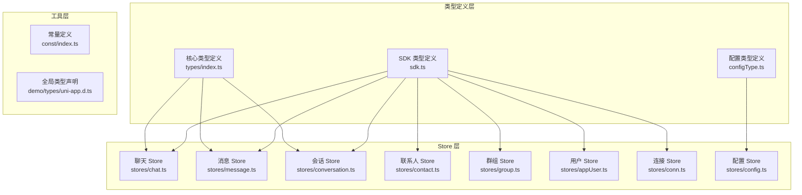
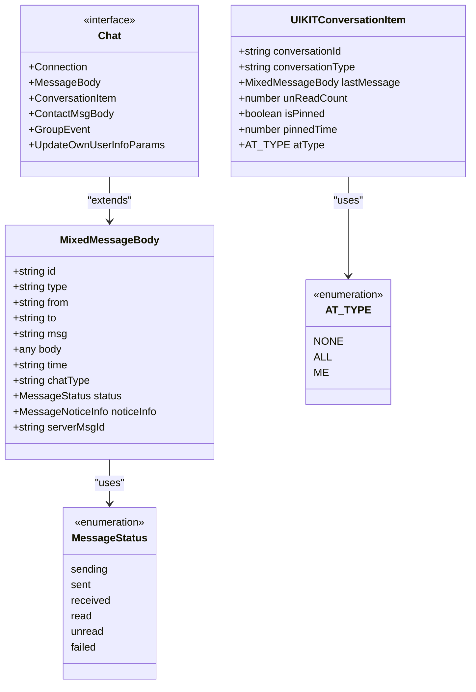
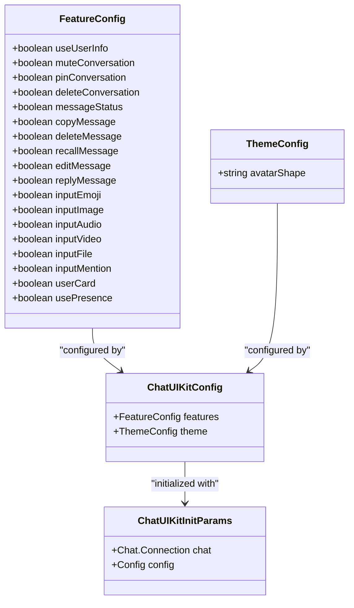
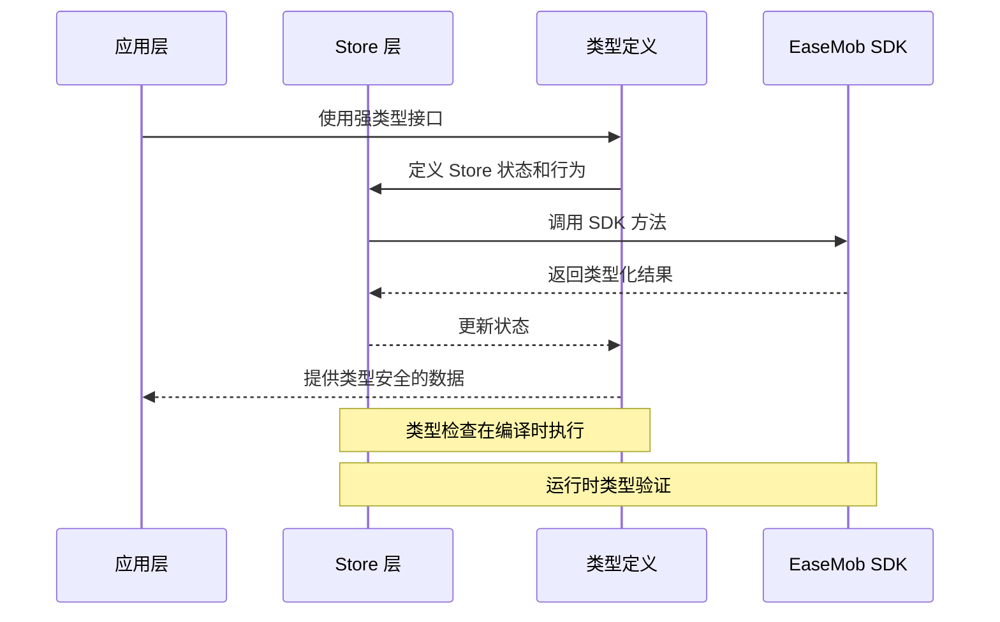
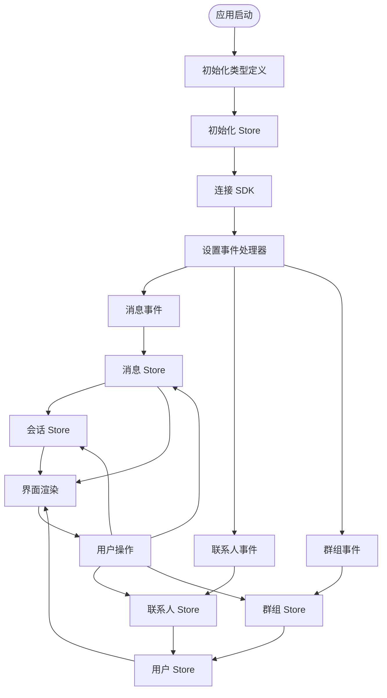
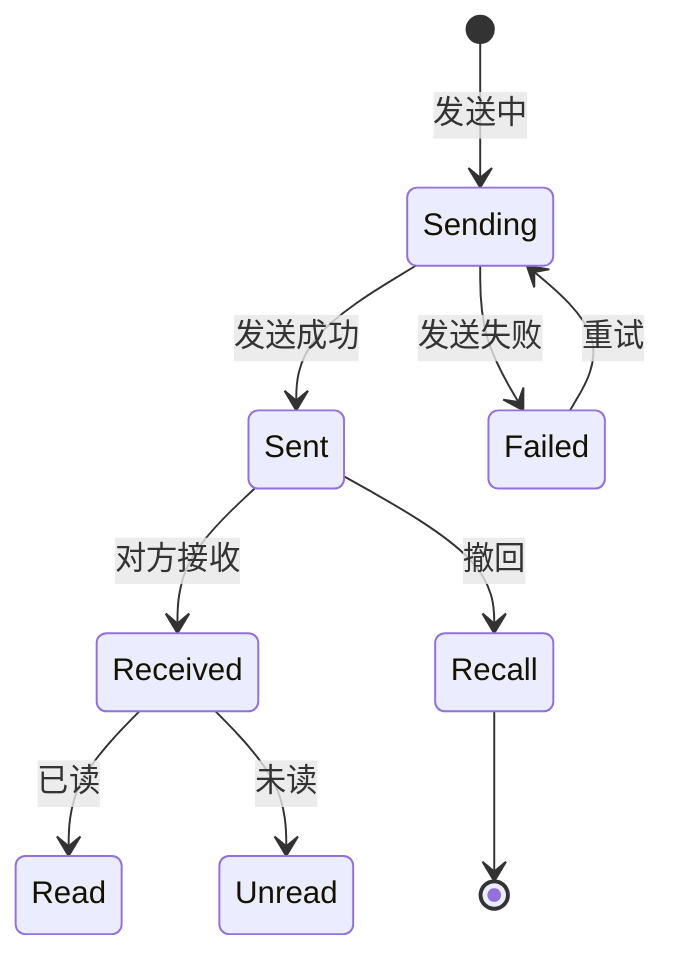
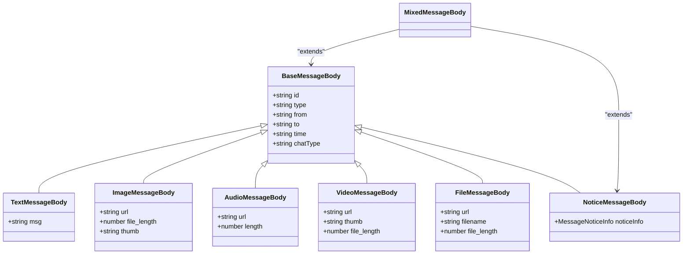
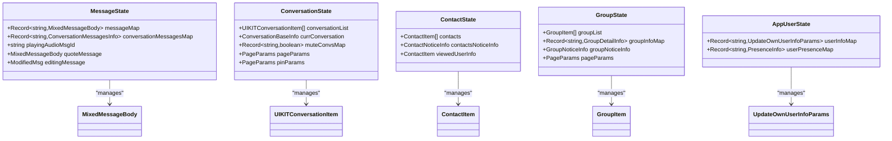
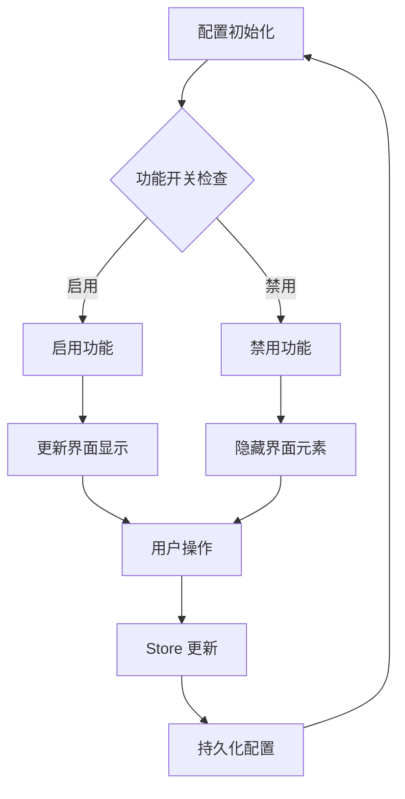
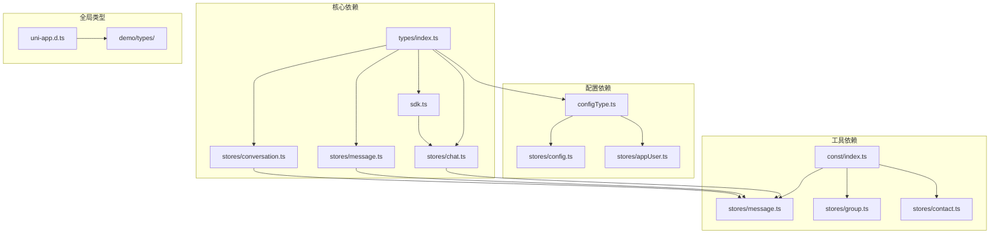

# 类型定义系统

<cite>
**本文档引用的文件**
- [ChatUIKit/types/index.ts](file://ChatUIKit/types/index.ts)
- [ChatUIKit/configType.ts](file://ChatUIKit/configType.ts)
- [ChatUIKit/sdk.ts](file://ChatUIKit/sdk.ts)
- [ChatUIKit/stores/index.ts](file://ChatUIKit/stores/index.ts)
- [ChatUIKit/stores/chat.ts](file://ChatUIKit/stores/chat.ts)
- [ChatUIKit/stores/message.ts](file://ChatUIKit/stores/message.ts)
- [ChatUIKit/stores/conversation.ts](file://ChatUIKit/stores/conversation.ts)
- [ChatUIKit/stores/contact.ts](file://ChatUIKit/stores/contact.ts)
- [ChatUIKit/stores/group.ts](file://ChatUIKit/stores/group.ts)
- [ChatUIKit/stores/appUser.ts](file://ChatUIKit/stores/appUser.ts)
- [ChatUIKit/stores/conn.ts](file://ChatUIKit/stores/conn.ts)
- [ChatUIKit/stores/config.ts](file://ChatUIKit/stores/config.ts)
- [ChatUIKit/const/index.ts](file://ChatUIKit/const/index.ts)
- [demo/types/uni-app.d.ts](file://demo/types/uni-app.d.ts)
</cite>

## 目录
1. [简介](#简介)
2. [项目结构](#项目结构)
3. [核心组件](#核心组件)
4. [架构概览](#架构概览)
5. [详细组件分析](#详细组件分析)
6. [依赖分析](#依赖分析)
7. [性能考虑](#性能考虑)
8. [故障排除指南](#故障排除指南)
9. [结论](#结论)

## 简介

这是一个基于 TypeScript 的类型定义系统，为聊天应用提供了完整的类型安全保障。系统采用模块化设计，通过接口扩展、类型别名和泛型约束实现了高度的类型安全性和可维护性。

该类型定义系统主要包含以下核心特性：
- 完整的消息类型体系，涵盖文本、图片、音频、视频等多种消息类型
- 配置类型系统，支持主题和功能配置的强类型约束
- 用户状态管理和 Presence 系统的类型定义
- Store 架构的类型安全实现
- 与 EaseMob Web SDK 的深度集成类型定义

## 项目结构

类型定义系统采用分层架构，按照功能模块进行组织：



**图表来源**
- [ChatUIKit/types/index.ts](file://ChatUIKit/types/index.ts#L1-L100)
- [ChatUIKit/configType.ts](file://ChatUIKit/configType.ts#L1-L68)
- [ChatUIKit/sdk.ts](file://ChatUIKit/sdk.ts#L1-L13)

**章节来源**
- [ChatUIKit/types/index.ts](file://ChatUIKit/types/index.ts#L1-L100)
- [ChatUIKit/configType.ts](file://ChatUIKit/configType.ts#L1-L68)
- [ChatUIKit/sdk.ts](file://ChatUIKit/sdk.ts#L1-L13)

## 核心组件

### 类型定义系统架构

系统的核心类型定义位于 `types/index.ts` 文件中，提供了以下关键类型：

#### 基础类型定义



**图表来源**
- [ChatUIKit/types/index.ts](file://ChatUIKit/types/index.ts#L46-L65)

#### 配置类型系统

配置类型系统提供了完整的功能开关和主题定制能力：



**图表来源**
- [ChatUIKit/configType.ts](file://ChatUIKit/configType.ts#L3-L53)

**章节来源**
- [ChatUIKit/types/index.ts](file://ChatUIKit/types/index.ts#L1-L100)
- [ChatUIKit/configType.ts](file://ChatUIKit/configType.ts#L1-L68)

## 架构概览

### 类型安全架构

系统通过多重类型保护确保代码的类型安全性：



**图表来源**
- [ChatUIKit/stores/chat.ts](file://ChatUIKit/stores/chat.ts#L226-L242)
- [ChatUIKit/stores/message.ts](file://ChatUIKit/stores/message.ts#L223-L336)

### 数据流架构



**图表来源**
- [ChatUIKit/stores/chat.ts](file://ChatUIKit/stores/chat.ts#L67-L221)
- [ChatUIKit/stores/message.ts](file://ChatUIKit/stores/message.ts#L341-L388)

**章节来源**
- [ChatUIKit/stores/chat.ts](file://ChatUIKit/stores/chat.ts#L1-L407)
- [ChatUIKit/stores/message.ts](file://ChatUIKit/stores/message.ts#L1-L581)

## 详细组件分析

### 消息类型系统

消息类型系统是整个类型定义系统的核心，提供了完整的消息生命周期管理：

#### 消息状态管理



**图表来源**
- [ChatUIKit/types/index.ts](file://ChatUIKit/types/index.ts#L46-L52)

#### 消息体扩展机制

系统通过接口扩展实现了灵活的消息体定义：



**图表来源**
- [ChatUIKit/types/index.ts](file://ChatUIKit/types/index.ts#L56-L61)

**章节来源**
- [ChatUIKit/types/index.ts](file://ChatUIKit/types/index.ts#L33-L61)

### Store 类型系统

每个 Store 都定义了完整的类型接口，确保状态管理的类型安全：

#### Store 状态接口



**图表来源**
- [ChatUIKit/stores/message.ts](file://ChatUIKit/stores/message.ts#L33-L44)
- [ChatUIKit/stores/conversation.ts](file://ChatUIKit/stores/conversation.ts#L27-L38)
- [ChatUIKit/stores/contact.ts](file://ChatUIKit/stores/contact.ts#L16-L23)
- [ChatUIKit/stores/group.ts](file://ChatUIKit/stores/group.ts#L16-L25)
- [ChatUIKit/stores/appUser.ts](file://ChatUIKit/stores/appUser.ts#L17-L22)

**章节来源**
- [ChatUIKit/stores/message.ts](file://ChatUIKit/stores/message.ts#L1-L581)
- [ChatUIKit/stores/conversation.ts](file://ChatUIKit/stores/conversation.ts#L1-L421)
- [ChatUIKit/stores/contact.ts](file://ChatUIKit/stores/contact.ts#L1-L282)
- [ChatUIKit/stores/group.ts](file://ChatUIKit/stores/group.ts#L1-L317)
- [ChatUIKit/stores/appUser.ts](file://ChatUIKit/stores/appUser.ts#L1-L242)

### 配置类型系统

配置类型系统提供了灵活的功能开关和主题定制能力：

#### 功能配置流程



**图表来源**
- [ChatUIKit/stores/config.ts](file://ChatUIKit/stores/config.ts#L82-L122)

**章节来源**
- [ChatUIKit/stores/config.ts](file://ChatUIKit/stores/config.ts#L1-L124)
- [ChatUIKit/configType.ts](file://ChatUIKit/configType.ts#L1-L68)

## 依赖分析

### 类型依赖关系



**图表来源**
- [ChatUIKit/types/index.ts](file://ChatUIKit/types/index.ts#L1-L100)
- [ChatUIKit/configType.ts](file://ChatUIKit/configType.ts#L1-L68)
- [ChatUIKit/sdk.ts](file://ChatUIKit/sdk.ts#L1-L13)

### 循环依赖检测

系统采用了良好的模块化设计，避免了循环依赖：

```mermaid
flowchart LR
Types[类型定义] --> Stores[Store 层]
Stores --> SDK[SDK 接口]
SDK --> Types
Note: 实际上 SDK 依赖 Types，但 Types 不依赖 SDK
Note: 这形成了单向依赖链，避免循环依赖
```

**图表来源**
- [ChatUIKit/types/index.ts](file://ChatUIKit/types/index.ts#L1-L100)
- [ChatUIKit/sdk.ts](file://ChatUIKit/sdk.ts#L1-L13)

**章节来源**
- [ChatUIKit/stores/index.ts](file://ChatUIKit/stores/index.ts#L1-L31)

## 性能考虑

### 类型检查优化

1. **编译时类型检查**：所有类型定义在编译时进行检查，运行时无额外开销
2. **接口扩展优化**：通过接口扩展而非继承，减少类型检查复杂度
3. **泛型约束**：合理使用泛型约束，提高类型推导效率

### 运行时性能

1. **Store 状态管理**：使用对象存储替代 Map，提升访问性能
2. **响应式更新**：通过 Pinia 的响应式系统，优化状态更新性能
3. **缓存策略**：用户信息和群组信息的缓存机制，减少重复请求

## 故障排除指南

### 常见类型错误

#### 类型不匹配错误

当遇到类型不匹配错误时，检查以下方面：

1. **消息类型转换**：确保消息体正确转换为目标类型
2. **接口实现**：确认自定义类型正确实现接口
3. **泛型参数**：检查泛型参数是否正确传递

#### 配置类型错误

配置类型错误通常出现在以下情况：

1. **配置项缺失**：检查配置项是否完整
2. **类型不兼容**：确认配置值类型正确
3. **默认值处理**：检查默认配置是否正确设置

**章节来源**
- [ChatUIKit/stores/chat.ts](file://ChatUIKit/stores/chat.ts#L324-L327)
- [ChatUIKit/stores/message.ts](file://ChatUIKit/stores/message.ts#L332-L335)

## 结论

这个类型定义系统展现了现代 TypeScript 开发的最佳实践：

### 设计优势

1. **模块化设计**：清晰的模块边界和职责分离
2. **类型安全**：完整的类型定义确保编译时错误检测
3. **扩展性**：灵活的接口扩展机制支持功能扩展
4. **性能优化**：合理的类型设计不影响运行时性能

### 最佳实践总结

1. **接口优先**：优先使用接口定义抽象类型
2. **类型别名**：合理使用类型别名简化复杂类型
3. **泛型约束**：通过泛型约束提高类型复用性
4. **模块化组织**：按功能模块组织类型定义
5. **文档注释**：为复杂类型提供详细的文档说明

该类型定义系统为大型聊天应用提供了坚实的类型基础，确保了代码质量和开发效率。