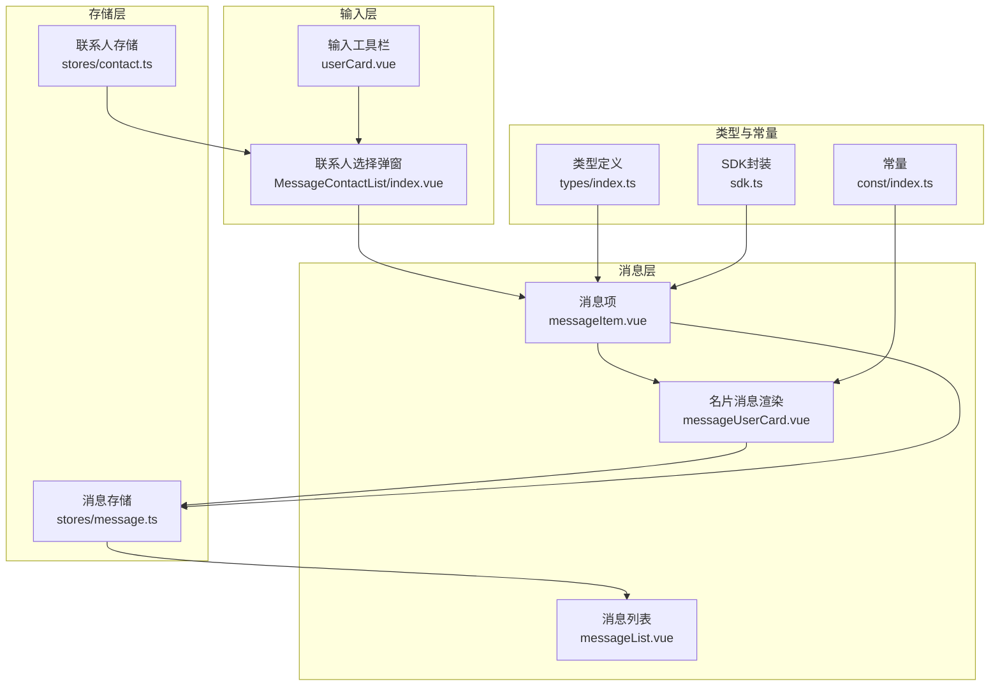
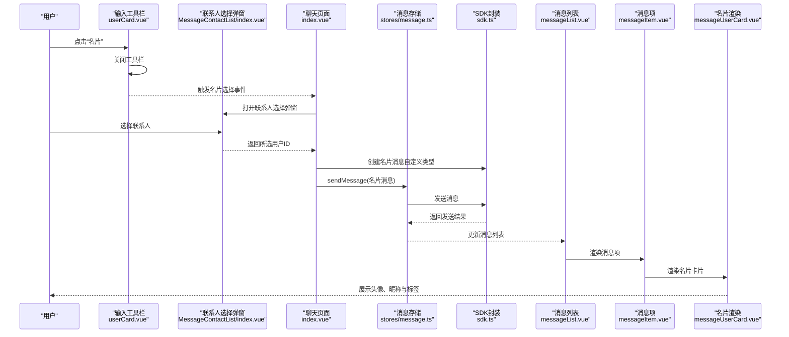
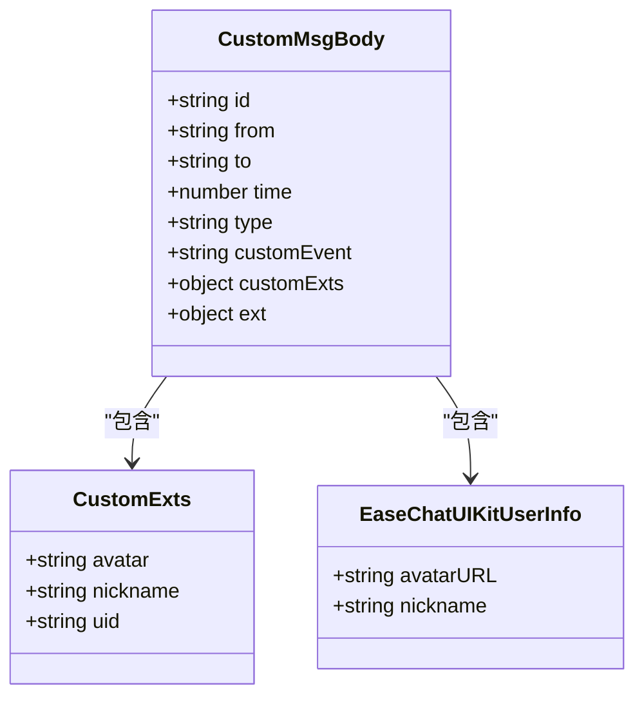
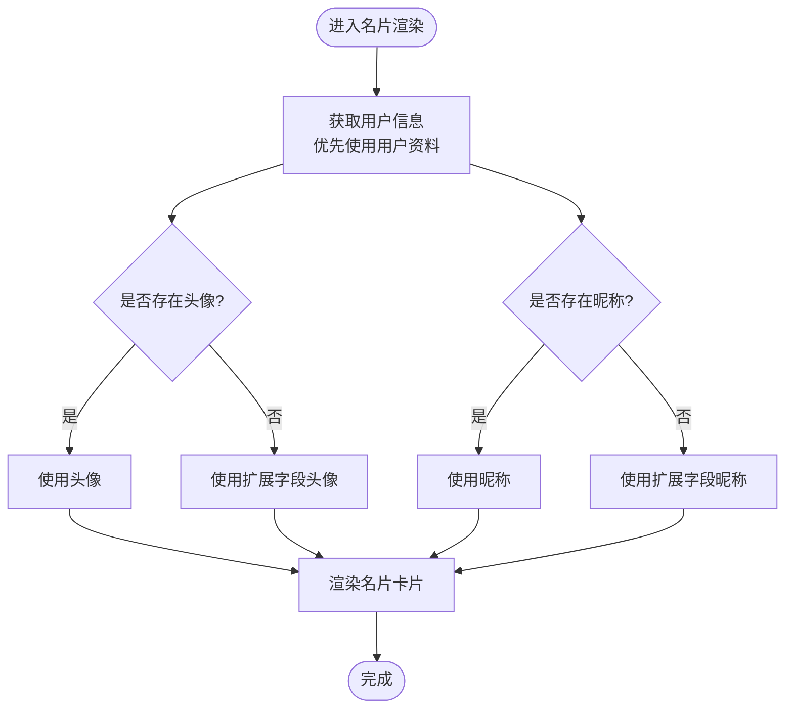
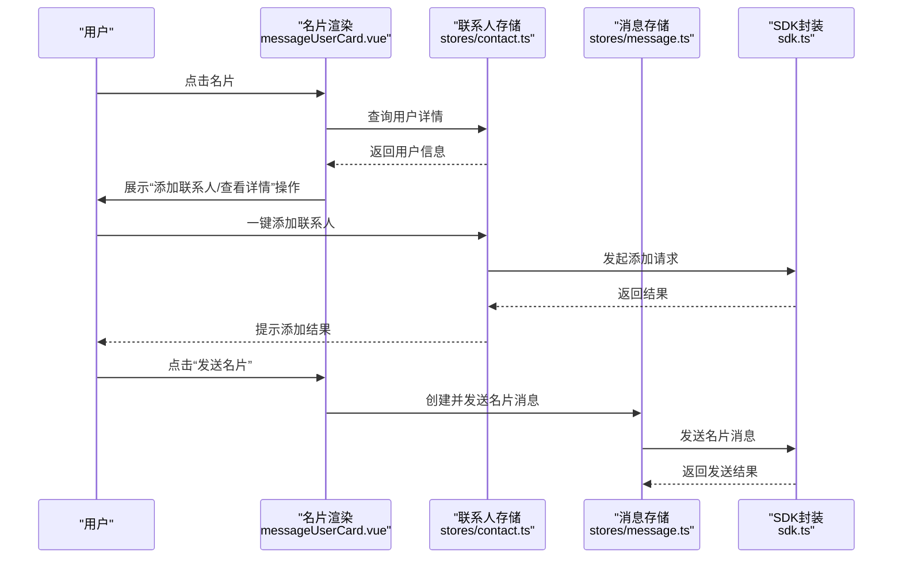
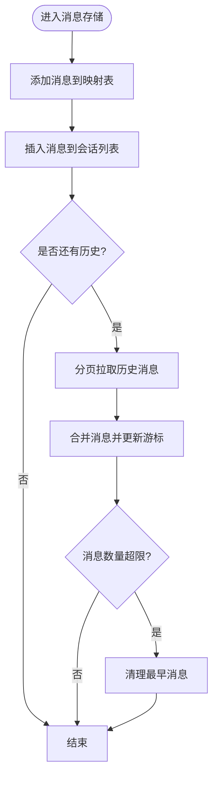
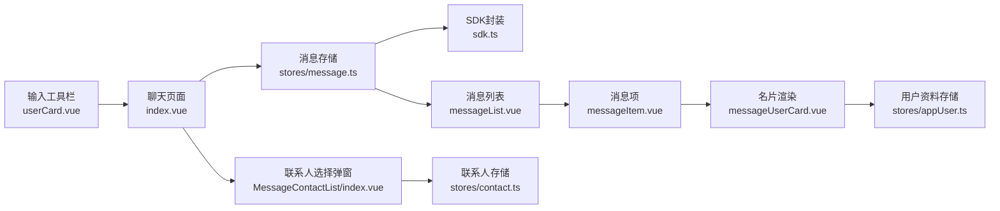

# 名片消息

<cite>
**本文档引用的文件**
- [messageUserCard.vue](file://ChatUIKit/modules/Chat/components/Message/messageUserCard.vue)
- [messageItem.vue](file://ChatUIKit/modules/Chat/components/Message/messageItem.vue)
- [userCard.vue](file://ChatUIKit/modules/Chat/components/MessageInputToolBar/userCard.vue)
- [index.vue](file://ChatUIKit/modules/Chat/index.vue)
- [messageList.vue](file://ChatUIKit/modules/Chat/components/Message/messageList.vue)
- [message.ts](file://ChatUIKit/stores/message.ts)
- [contact.ts](file://ChatUIKit/stores/contact.ts)
- [index.ts](file://ChatUIKit/types/index.ts)
- [index.ts](file://ChatUIKit/const/index.ts)
- [sdk.ts](file://ChatUIKit/sdk.ts)
- [messageQuote.vue](file://ChatUIKit/modules/Chat/components/Message/messageQuote.vue)
- [messageQuotePanel.vue](file://ChatUIKit/modules/Chat/components/Message/messageQuotePanel.vue)
- [messageActions.vue](file://ChatUIKit/modules/Chat/components/Message/messageActions.vue)
- [index.vue](file://ChatUIKit/modules/Chat/components/MessageContactList/index.vue)
</cite>

## 目录
1. [简介](#简介)
2. [项目结构](#项目结构)
3. [核心组件](#核心组件)
4. [架构总览](#架构总览)
5. [详细组件分析](#详细组件分析)
6. [依赖关系分析](#依赖关系分析)
7. [性能考虑](#性能考虑)
8. [故障排查指南](#故障排查指南)
9. [结论](#结论)

## 简介
名片消息是一种特殊的自定义消息类型，用于在聊天中快速分享联系人信息。本文档系统性地解析名片消息的数据结构、渲染逻辑、交互功能、样式定制与主题适配、安全验证与隐私保护，以及数据同步、缓存管理与性能优化策略。

## 项目结构
名片消息功能涉及以下关键模块与文件：
- 输入工具栏：提供“名片”入口，触发选择联系人弹窗
- 联系人选择弹窗：展示联系人列表，支持索引导航
- 名片消息渲染：名片卡片的UI与数据绑定
- 消息列表：承载名片消息的展示与交互
- 消息存储：名片消息的发送、接收与本地缓存
- 联系人存储：联系人列表与好友关系管理
- SDK与类型：消息体结构、自定义事件与扩展字段

**图表来源**
- [userCard.vue](file://ChatUIKit/modules/Chat/components/MessageInputToolBar/userCard.vue#L1-L32)
- [index.vue](file://ChatUIKit/modules/Chat/components/MessageContactList/index.vue#L1-L123)
- [messageItem.vue](file://ChatUIKit/modules/Chat/components/Message/messageItem.vue#L1-L264)
- [messageUserCard.vue](file://ChatUIKit/modules/Chat/components/Message/messageUserCard.vue#L1-L80)
- [messageList.vue](file://ChatUIKit/modules/Chat/components/Message/messageList.vue#L1-L284)
- [message.ts](file://ChatUIKit/stores/message.ts#L1-L581)
- [contact.ts](file://ChatUIKit/stores/contact.ts#L1-L282)
- [index.ts](file://ChatUIKit/types/index.ts#L1-L100)
- [index.ts](file://ChatUIKit/const/index.ts#L1-L37)
- [sdk.ts](file://ChatUIKit/sdk.ts#L1-L13)

**章节来源**
- [userCard.vue](file://ChatUIKit/modules/Chat/components/MessageInputToolBar/userCard.vue#L1-L32)
- [index.vue](file://ChatUIKit/modules/Chat/components/MessageContactList/index.vue#L1-L123)
- [messageItem.vue](file://ChatUIKit/modules/Chat/components/Message/messageItem.vue#L1-L264)
- [messageUserCard.vue](file://ChatUIKit/modules/Chat/components/Message/messageUserCard.vue#L1-L80)
- [messageList.vue](file://ChatUIKit/modules/Chat/components/Message/messageList.vue#L1-L284)
- [message.ts](file://ChatUIKit/stores/message.ts#L1-L581)
- [contact.ts](file://ChatUIKit/stores/contact.ts#L1-L282)
- [index.ts](file://ChatUIKit/types/index.ts#L1-L100)
- [index.ts](file://ChatUIKit/const/index.ts#L1-L37)
- [sdk.ts](file://ChatUIKit/sdk.ts#L1-L13)

## 核心组件
- 名片消息渲染组件：负责名片卡片的头像、昵称与标签展示
- 消息项组件：根据消息类型路由到对应渲染器，名片消息通过自定义事件识别
- 输入工具栏名片按钮：打开联系人选择弹窗
- 联系人选择弹窗：展示联系人列表，支持索引导航与选择回调
- 消息存储：名片消息的发送、接收、本地缓存与历史消息拉取
- 联系人存储：联系人列表、好友关系与通知管理
- 类型与常量：消息体结构、自定义事件、扩展字段与资源路径
- SDK封装：统一接入聊天SDK，创建名片消息

**章节来源**
- [messageUserCard.vue](file://ChatUIKit/modules/Chat/components/Message/messageUserCard.vue#L1-L80)
- [messageItem.vue](file://ChatUIKit/modules/Chat/components/Message/messageItem.vue#L1-L264)
- [userCard.vue](file://ChatUIKit/modules/Chat/components/MessageInputToolBar/userCard.vue#L1-L32)
- [index.vue](file://ChatUIKit/modules/Chat/components/MessageContactList/index.vue#L1-L123)
- [message.ts](file://ChatUIKit/stores/message.ts#L1-L581)
- [contact.ts](file://ChatUIKit/stores/contact.ts#L1-L282)
- [index.ts](file://ChatUIKit/types/index.ts#L1-L100)
- [index.ts](file://ChatUIKit/const/index.ts#L1-L37)
- [sdk.ts](file://ChatUIKit/sdk.ts#L1-L13)

## 架构总览
名片消息的端到端流程如下：
- 用户点击输入工具栏的名片按钮，关闭工具栏并触发名片选择事件
- 打开联系人选择弹窗，用户选择目标联系人
- 应用使用SDK创建名片消息（自定义类型），填充扩展字段（头像、昵称、UID）与发送方信息
- 将名片消息通过消息存储发送至SDK，并更新本地消息列表
- 接收端的消息项根据自定义事件渲染名片卡片
- 名片卡片展示头像、昵称与标签；支持查看详情、一键加联系人等交互（由上层业务扩展）

**图表来源**
- [userCard.vue](file://ChatUIKit/modules/Chat/components/MessageInputToolBar/userCard.vue#L1-L32)
- [index.vue](file://ChatUIKit/modules/Chat/components/MessageContactList/index.vue#L1-L123)
- [index.vue](file://ChatUIKit/modules/Chat/index.vue#L155-L209)
- [message.ts](file://ChatUIKit/stores/message.ts#L223-L336)
- [sdk.ts](file://ChatUIKit/sdk.ts#L1-L13)
- [messageList.vue](file://ChatUIKit/modules/Chat/components/Message/messageList.vue#L1-L284)
- [messageItem.vue](file://ChatUIKit/modules/Chat/components/Message/messageItem.vue#L1-L264)
- [messageUserCard.vue](file://ChatUIKit/modules/Chat/components/Message/messageUserCard.vue#L1-L80)

## 详细组件分析

### 数据结构与字段定义
名片消息采用自定义消息类型，包含以下关键字段：
- 消息基础字段：消息ID、发送者、接收者、时间戳、消息状态
- 自定义事件：用于识别名片消息的事件名
- 扩展字段（customExts）：包含被分享用户的头像、昵称、用户ID
- 扩展信息（ext.ease_chat_uikit_user_info）：包含发送方的头像与昵称，用于名片展示

**图表来源**
- [index.ts](file://ChatUIKit/types/index.ts#L1-L100)
- [index.vue](file://ChatUIKit/modules/Chat/index.vue#L185-L209)

**章节来源**
- [index.ts](file://ChatUIKit/types/index.ts#L1-L100)
- [index.vue](file://ChatUIKit/modules/Chat/index.vue#L185-L209)

### 渲染逻辑与展示格式
- 名片卡片容器：固定宽度，包含头像与昵称区域，底部带标签
- 头像处理：优先使用用户资料中的头像，否则回退到扩展字段中的头像
- 昵称处理：优先使用用户资料中的昵称，否则回退到扩展字段中的昵称
- 样式区分：根据消息来源（自己/他人）设置不同的边框色，提升可读性
- 标签显示：展示“联系人”标签，提示消息类型

**图表来源**
- [messageUserCard.vue](file://ChatUIKit/modules/Chat/components/Message/messageUserCard.vue#L35-L41)

**章节来源**
- [messageUserCard.vue](file://ChatUIKit/modules/Chat/components/Message/messageUserCard.vue#L1-L80)

### 交互功能
- 一键添加联系人：名片渲染组件可作为入口，触发联系人存储的添加流程
- 查看详情：名片渲染组件可作为入口，触发联系人详情展示
- 发送名片：输入工具栏名片按钮打开联系人选择弹窗，选择后通过SDK创建并发送名片消息
- 引用与回复：名片消息可被引用与回复，引用面板与引用渲染组件协同工作

**图表来源**
- [messageUserCard.vue](file://ChatUIKit/modules/Chat/components/Message/messageUserCard.vue#L1-L80)
- [contact.ts](file://ChatUIKit/stores/contact.ts#L135-L147)
- [message.ts](file://ChatUIKit/stores/message.ts#L223-L336)
- [sdk.ts](file://ChatUIKit/sdk.ts#L1-L13)

**章节来源**
- [messageUserCard.vue](file://ChatUIKit/modules/Chat/components/Message/messageUserCard.vue#L1-L80)
- [contact.ts](file://ChatUIKit/stores/contact.ts#L135-L147)
- [message.ts](file://ChatUIKit/stores/message.ts#L223-L336)
- [sdk.ts](file://ChatUIKit/sdk.ts#L1-L13)

### 样式定制与主题适配
- 固定宽度：名片卡片容器具有固定宽度，保证在不同屏幕下的统一展示
- 边框与背景：根据消息来源（自己/他人）设置不同的边框色，增强视觉区分
- 字体与间距：字号、行高与间距遵循统一规范，提升可读性
- 主题适配：通过SCSS变量与类名控制，可在主题配置中调整颜色与尺寸

**章节来源**
- [messageUserCard.vue](file://ChatUIKit/modules/Chat/components/Message/messageUserCard.vue#L44-L79)

### 安全验证与隐私保护
- 发送方信息：名片消息扩展信息包含发送方头像与昵称，避免直接暴露敏感字段
- 用户信息来源：优先使用应用内用户资料，减少对外部数据的直接依赖
- 权限控制：名片消息的发送与接收需基于有效的会话权限与好友关系
- 隐私提示：名片卡片仅展示必要信息（头像、昵称、标签），不展示其他隐私字段

**章节来源**
- [index.vue](file://ChatUIKit/modules/Chat/index.vue#L195-L200)
- [messageUserCard.vue](file://ChatUIKit/modules/Chat/components/Message/messageUserCard.vue#L35-L41)

### 数据同步、缓存管理与性能优化
- 消息存储：使用对象映射存储消息，数组维护消息ID顺序，支持高效查询与插入
- 历史消息拉取：分页拉取历史消息，避免一次性加载过多数据
- 缓存清理：当消息数量超过阈值时，清理最早的消息，释放内存
- 性能优化：消息列表监听长度变化自动滚动到底部，减少重绘；加载动画与闪烁效果提升用户体验

**图表来源**
- [message.ts](file://ChatUIKit/stores/message.ts#L108-L197)
- [message.ts](file://ChatUIKit/stores/message.ts#L529-L554)

**章节来源**
- [message.ts](file://ChatUIKit/stores/message.ts#L108-L197)
- [message.ts](file://ChatUIKit/stores/message.ts#L529-L554)

## 依赖关系分析
名片消息功能的关键依赖关系如下：
- 输入工具栏依赖注入与事件通信，触发名片选择
- 聊天页面负责创建名片消息并调用消息存储发送
- 消息存储负责与SDK交互、本地缓存与历史消息管理
- 名片渲染组件依赖用户资料存储与消息存储，计算头像与昵称
- 联系人选择弹窗依赖联系人存储，提供用户列表与选择回调

**图表来源**
- [userCard.vue](file://ChatUIKit/modules/Chat/components/MessageInputToolBar/userCard.vue#L1-L32)
- [index.vue](file://ChatUIKit/modules/Chat/index.vue#L185-L209)
- [message.ts](file://ChatUIKit/stores/message.ts#L223-L336)
- [sdk.ts](file://ChatUIKit/sdk.ts#L1-L13)
- [messageList.vue](file://ChatUIKit/modules/Chat/components/Message/messageList.vue#L1-L284)
- [messageItem.vue](file://ChatUIKit/modules/Chat/components/Message/messageItem.vue#L1-L264)
- [messageUserCard.vue](file://ChatUIKit/modules/Chat/components/Message/messageUserCard.vue#L1-L80)
- [index.vue](file://ChatUIKit/modules/Chat/components/MessageContactList/index.vue#L1-L123)
- [contact.ts](file://ChatUIKit/stores/contact.ts#L1-L282)

**章节来源**
- [userCard.vue](file://ChatUIKit/modules/Chat/components/MessageInputToolBar/userCard.vue#L1-L32)
- [index.vue](file://ChatUIKit/modules/Chat/index.vue#L185-L209)
- [message.ts](file://ChatUIKit/stores/message.ts#L223-L336)
- [sdk.ts](file://ChatUIKit/sdk.ts#L1-L13)
- [messageList.vue](file://ChatUIKit/modules/Chat/components/Message/messageList.vue#L1-L284)
- [messageItem.vue](file://ChatUIKit/modules/Chat/components/Message/messageItem.vue#L1-L264)
- [messageUserCard.vue](file://ChatUIKit/modules/Chat/components/Message/messageUserCard.vue#L1-L80)
- [index.vue](file://ChatUIKit/modules/Chat/components/MessageContactList/index.vue#L1-L123)
- [contact.ts](file://ChatUIKit/stores/contact.ts#L1-L282)

## 性能考虑
- 消息分页：历史消息按页拉取，避免一次性加载大量数据
- 内存清理：超过阈值时清理最早消息，防止内存膨胀
- 渲染优化：消息列表自动滚动到底部，减少不必要的重绘
- 动画与反馈：加载动画与闪烁效果提升交互体验

[本节为通用性能建议，不直接分析具体文件]

## 故障排查指南
- 名片消息未显示：检查消息类型是否为自定义且事件名为名片事件；确认名片渲染组件是否正确挂载
- 头像或昵称为空：检查用户资料存储是否已获取用户信息；确认扩展字段是否正确传递
- 发送失败：检查消息存储的发送流程与SDK返回；查看日志输出定位错误
- 联系人列表异常：检查联系人存储的获取与分页逻辑；确认网络请求与错误处理

**章节来源**
- [messageItem.vue](file://ChatUIKit/modules/Chat/components/Message/messageItem.vue#L53-L55)
- [messageUserCard.vue](file://ChatUIKit/modules/Chat/components/Message/messageUserCard.vue#L35-L41)
- [message.ts](file://ChatUIKit/stores/message.ts#L223-L336)
- [contact.ts](file://ChatUIKit/stores/contact.ts#L112-L130)

## 结论
名片消息通过自定义消息类型实现，结合输入工具栏、联系人选择弹窗与消息渲染组件，形成完整的发送与展示闭环。其设计注重数据结构清晰、渲染逻辑简洁、交互功能完备，并在消息存储与缓存管理方面具备良好的性能与可维护性。配合安全与隐私保护机制，名片消息在易用性与安全性之间取得平衡。