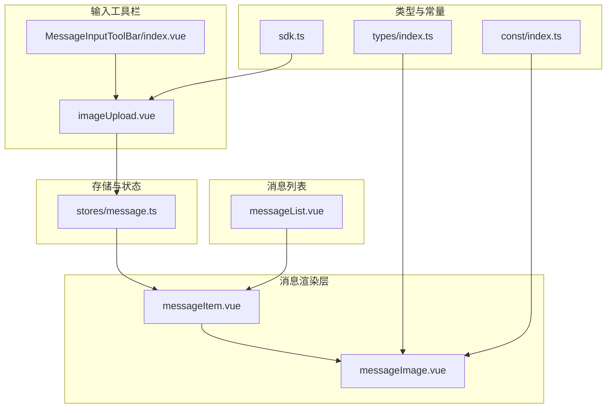
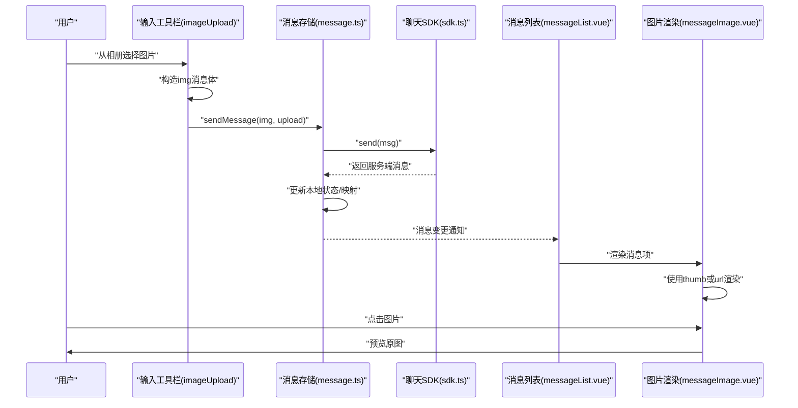
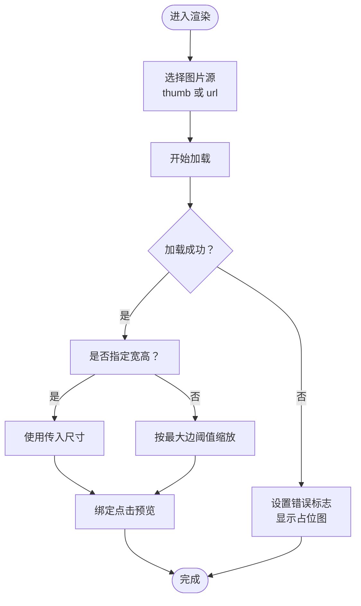
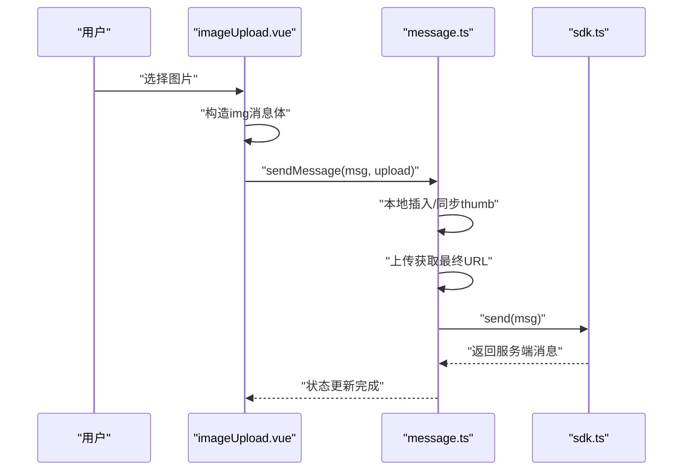
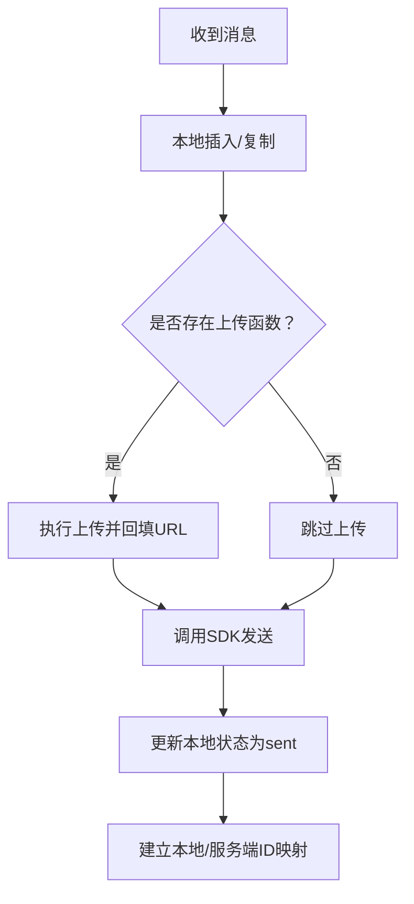
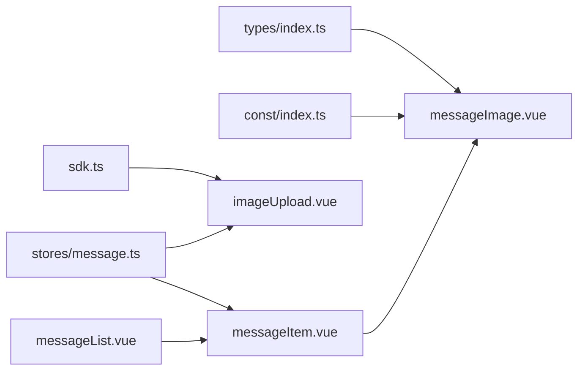

# 图片消息

<cite>
**本文档引用的文件**
- [messageImage.vue](file://ChatUIKit/modules/Chat/components/Message/messageImage.vue)
- [messageImage.vue](file://demo/ChatUIKit/modules/Chat/components/Message/messageImage.vue)
- [imageUpload.vue](file://ChatUIKit/modules/Chat/components/MessageInputToolBar/imageUpload.vue)
- [imageUpload.vue](file://demo/ChatUIKit/modules/Chat/components/MessageInputToolBar/imageUpload.vue)
- [message.ts](file://ChatUIKit/stores/message.ts)
- [message.ts](file://demo/ChatUIKit/stores/message.ts)
- [messageItem.vue](file://ChatUIKit/modules/Chat/components/Message/messageItem.vue)
- [index.vue](file://ChatUIKit/modules/Chat/components/MessageInputToolBar/index.vue)
- [index.vue](file://demo/ChatUIKit/modules/Chat/components/MessageInputToolBar/index.vue)
- [index.ts](file://ChatUIKit/types/index.ts)
- [index.ts](file://demo/ChatUIKit/types/index.ts)
- [index.ts](file://ChatUIKit/const/index.ts)
- [sdk.ts](file://ChatUIKit/sdk.ts)
- [messageList.vue](file://ChatUIKit/modules/Chat/components/Message/messageList.vue)
</cite>

## 目录
1. [简介](#简介)
2. [项目结构](#项目结构)
3. [核心组件](#核心组件)
4. [架构总览](#架构总览)
5. [详细组件分析](#详细组件分析)
6. [依赖关系分析](#依赖关系分析)
7. [性能考虑](#性能考虑)
8. [故障排查指南](#故障排查指南)
9. [结论](#结论)

## 简介
本章节面向图片消息功能，系统性阐述其加载机制、缩略图生成与原图显示逻辑，覆盖格式支持、尺寸限制与质量控制，状态管理、加载进度与错误处理，以及点击放大、滑动浏览与长按保存等交互能力。同时给出缓存策略、内存管理与性能优化建议，并针对大图处理、网络传输与存储空间问题提出解决方案，实现加载失败的降级与占位符显示。

## 项目结构
图片消息相关代码主要分布在以下模块：
- 消息渲染层：消息项容器与图片消息子组件
- 输入工具栏：图片选择与上传入口
- 存储与状态：消息发送流程与状态更新
- 类型与常量：消息体结构与资源路径
- SDK：统一聊天能力封装

图表来源
- [messageItem.vue](file://ChatUIKit/modules/Chat/components/Message/messageItem.vue#L1-L264)
- [messageImage.vue](file://ChatUIKit/modules/Chat/components/Message/messageImage.vue#L1-L84)
- [index.vue](file://ChatUIKit/modules/Chat/components/MessageInputToolBar/index.vue#L1-L68)
- [imageUpload.vue](file://ChatUIKit/modules/Chat/components/MessageInputToolBar/imageUpload.vue#L1-L85)
- [message.ts](file://ChatUIKit/stores/message.ts#L242-L312)
- [index.ts](file://ChatUIKit/types/index.ts#L1-L100)
- [index.ts](file://ChatUIKit/const/index.ts#L1-L37)
- [sdk.ts](file://ChatUIKit/sdk.ts#L1-L13)
- [messageList.vue](file://ChatUIKit/modules/Chat/components/Message/messageList.vue#L1-L284)

章节来源
- [messageItem.vue](file://ChatUIKit/modules/Chat/components/Message/messageItem.vue#L1-L264)
- [messageImage.vue](file://ChatUIKit/modules/Chat/components/Message/messageImage.vue#L1-L84)
- [index.vue](file://ChatUIKit/modules/Chat/components/MessageInputToolBar/index.vue#L1-L68)
- [imageUpload.vue](file://ChatUIKit/modules/Chat/components/MessageInputToolBar/imageUpload.vue#L1-L85)
- [message.ts](file://ChatUIKit/stores/message.ts#L242-L312)
- [index.ts](file://ChatUIKit/types/index.ts#L1-L100)
- [index.ts](file://ChatUIKit/const/index.ts#L1-L37)
- [sdk.ts](file://ChatUIKit/sdk.ts#L1-L13)
- [messageList.vue](file://ChatUIKit/modules/Chat/components/Message/messageList.vue#L1-L284)

## 核心组件
- 图片消息渲染组件：负责根据消息体渲染图片，支持缩略图优先、加载完成自适应尺寸、错误降级与预览触发。
- 图片输入上传组件：负责从相册选择图片、构造消息体、调用上传并发送。
- 消息存储与状态：负责消息本地化、上传后URL回填、发送状态更新与服务端消息映射。
- 类型与常量：定义消息体结构、状态枚举、资源路径等。
- SDK封装：提供统一的聊天能力接口。

章节来源
- [messageImage.vue](file://ChatUIKit/modules/Chat/components/Message/messageImage.vue#L1-L84)
- [imageUpload.vue](file://ChatUIKit/modules/Chat/components/MessageInputToolBar/imageUpload.vue#L1-L85)
- [message.ts](file://ChatUIKit/stores/message.ts#L242-L312)
- [index.ts](file://ChatUIKit/types/index.ts#L1-L100)
- [index.ts](file://ChatUIKit/const/index.ts#L1-L37)
- [sdk.ts](file://ChatUIKit/sdk.ts#L1-L13)

## 架构总览
图片消息从“选择图片”到“渲染显示”的完整链路如下：

图表来源
- [imageUpload.vue](file://ChatUIKit/modules/Chat/components/MessageInputToolBar/imageUpload.vue#L41-L76)
- [message.ts](file://ChatUIKit/stores/message.ts#L242-L312)
- [sdk.ts](file://ChatUIKit/sdk.ts#L1-L13)
- [messageList.vue](file://ChatUIKit/modules/Chat/components/Message/messageList.vue#L77-L80)
- [messageImage.vue](file://ChatUIKit/modules/Chat/components/Message/messageImage.vue#L44-L51)

## 详细组件分析

### 图片消息渲染组件（messageImage.vue）
职责与行为
- 渲染逻辑：优先使用缩略图（thumb），若不存在则回退到原图（url）；加载失败时显示占位图。
- 尺寸控制：支持传入固定宽高；未传入时根据原始尺寸按最大边不超过阈值进行等比缩放。
- 事件处理：加载完成回调用于动态计算缩放尺寸；错误回调用于标记加载失败；点击触发原图预览。
- 预览控制：可禁用预览模式，避免误触。

关键点
- 占位图：通过常量资源拼接得到默认占位图地址。
- 缩放策略：以较大边为基准，另一侧按比例缩放，保证不超出设定上限。
- 预览触发：调用平台预览接口，传入原图URL。

图表来源
- [messageImage.vue](file://ChatUIKit/modules/Chat/components/Message/messageImage.vue#L10-L11)
- [messageImage.vue](file://ChatUIKit/modules/Chat/components/Message/messageImage.vue#L31-L42)
- [messageImage.vue](file://ChatUIKit/modules/Chat/components/Message/messageImage.vue#L53-L76)
- [messageImage.vue](file://ChatUIKit/modules/Chat/components/Message/messageImage.vue#L44-L51)
- [index.ts](file://ChatUIKit/const/index.ts#L7-L8)

章节来源
- [messageImage.vue](file://ChatUIKit/modules/Chat/components/Message/messageImage.vue#L1-L84)
- [index.ts](file://ChatUIKit/const/index.ts#L7-L8)

### 图片输入上传组件（imageUpload.vue）
职责与行为
- 选择图片：调用平台选择器从相册选取单张图片。
- 构造消息：使用SDK创建img类型消息，目标与会话类型来自当前会话信息。
- 上传与发送：将临时文件路径作为消息URL，随后调用上传函数获取最终URL，再通过SDK发送消息。
- 关闭工具栏：发送完成后关闭输入工具栏。

关键点
- 上传参数：包含目标URL、文件路径、请求头（含认证令牌）。
- 消息扩展：附加发送者头像与昵称信息。
- 发送流程：先本地插入消息，再上传，最后发送SDK并更新状态。

图表来源
- [imageUpload.vue](file://ChatUIKit/modules/Chat/components/MessageInputToolBar/imageUpload.vue#L31-L76)
- [message.ts](file://ChatUIKit/stores/message.ts#L242-L312)
- [sdk.ts](file://ChatUIKit/sdk.ts#L1-L13)

章节来源
- [imageUpload.vue](file://ChatUIKit/modules/Chat/components/MessageInputToolBar/imageUpload.vue#L1-L85)
- [message.ts](file://ChatUIKit/stores/message.ts#L242-L312)
- [sdk.ts](file://ChatUIKit/sdk.ts#L1-L13)

### 消息存储与状态（stores/message.ts）
职责与行为
- 本地化：将消息复制一份到本地消息映射，便于即时渲染。
- 上传回填：若存在上传函数，则在上传完成后将最终URL写回到消息体。
- 发送与状态：调用SDK发送消息，更新本地消息状态为已发送，并建立本地ID与服务端ID的映射。
- 特殊处理：对图片与视频消息，保留thumb与url字段，确保渲染一致。

关键点
- 上传时机：在本地插入消息后、发送前执行。
- 状态更新：发送成功后，本地消息状态置为sent，并补充服务端消息ID。
- 映射关系：同一消息可能同时存在本地ID与服务端ID两条记录，便于后续操作。

图表来源
- [message.ts](file://ChatUIKit/stores/message.ts#L242-L312)

章节来源
- [message.ts](file://ChatUIKit/stores/message.ts#L242-L312)

### 类型与常量（types/index.ts、const/index.ts）
- 类型定义：包含消息状态枚举、混合消息体结构等，确保图片消息体字段与渲染组件一致。
- 常量定义：提供资源基础URL，用于占位图与图标拼接。

章节来源
- [index.ts](file://ChatUIKit/types/index.ts#L46-L61)
- [index.ts](file://ChatUIKit/const/index.ts#L7-L8)

### 消息项与长按交互（messageItem.vue）
- 渲染路由：根据消息类型选择对应子组件，图片消息由messageImage.vue渲染。
- 长按交互：内置长按检测逻辑，支持触发长按菜单或动作面板。
- 头像与气泡样式：根据消息方向切换气泡背景与箭头方向。

章节来源
- [messageItem.vue](file://ChatUIKit/modules/Chat/components/Message/messageItem.vue#L44-L46)
- [messageItem.vue](file://ChatUIKit/modules/Chat/components/Message/messageItem.vue#L136-L180)

### 输入工具栏（MessageInputToolBar/index.vue）
- 功能开关：根据特性配置决定是否显示图片上传入口。
- 布局组织：使用轮播与网格布局承载各类输入项。

章节来源
- [index.vue](file://ChatUIKit/modules/Chat/components/MessageInputToolBar/index.vue#L6-L19)

## 依赖关系分析
- 渲染组件依赖类型定义与常量资源，确保字段与占位图可用。
- 输入组件依赖SDK与存储层，负责消息构造、上传与发送。
- 存储层依赖SDK与会话上下文，负责消息生命周期管理。
- 列表组件依赖存储层，驱动消息渲染与滚动行为。

图表来源
- [index.ts](file://ChatUIKit/types/index.ts#L1-L100)
- [index.ts](file://ChatUIKit/const/index.ts#L1-L37)
- [sdk.ts](file://ChatUIKit/sdk.ts#L1-L13)
- [message.ts](file://ChatUIKit/stores/message.ts#L242-L312)
- [messageItem.vue](file://ChatUIKit/modules/Chat/components/Message/messageItem.vue#L1-L264)
- [messageImage.vue](file://ChatUIKit/modules/Chat/components/Message/messageImage.vue#L1-L84)
- [messageList.vue](file://ChatUIKit/modules/Chat/components/Message/messageList.vue#L1-L284)

章节来源
- [index.ts](file://ChatUIKit/types/index.ts#L1-L100)
- [index.ts](file://ChatUIKit/const/index.ts#L1-L37)
- [sdk.ts](file://ChatUIKit/sdk.ts#L1-L13)
- [message.ts](file://ChatUIKit/stores/message.ts#L242-L312)
- [messageItem.vue](file://ChatUIKit/modules/Chat/components/Message/messageItem.vue#L1-L264)
- [messageImage.vue](file://ChatUIKit/modules/Chat/components/Message/messageImage.vue#L1-L84)
- [messageList.vue](file://ChatUIKit/modules/Chat/components/Message/messageList.vue#L1-L284)

## 性能考虑
- 渲染性能
  - 缩放策略：按最大边阈值缩放，避免超大图片直接渲染导致的重排与重绘。
  - 固定尺寸：当明确指定宽高时，可减少布局抖动。
- 加载与缓存
  - 缩略图优先：优先使用thumb，降低首屏渲染压力。
  - 错误降级：加载失败快速回退至占位图，避免长时间空白。
- 内存管理
  - 预览原图：仅在用户主动触发时才加载原图，避免无谓占用。
  - 列表复用：消息列表采用虚拟滚动与按需渲染，减少DOM节点数量。
- 上传与网络
  - 上传分离：消息先本地插入，再异步上传，提升交互流畅度。
  - 断点续传：建议在上层接入断点续传能力，提高大图上传成功率。
- 存储与持久化
  - 本地映射：维护本地ID与服务端ID映射，便于快速定位与更新。
  - 分页加载：消息列表分页拉取，避免一次性加载过多数据。

## 故障排查指南
- 图片不显示或一直空白
  - 检查消息体是否包含thumb或url字段。
  - 确认占位图资源可访问。
  - 观察加载错误回调是否被触发。
- 点击无法预览
  - 确认未启用禁用预览属性。
  - 检查URL是否为空。
- 上传后仍显示缩略图
  - 确认上传流程已完成且URL已回填。
  - 检查发送后状态是否更新为sent。
- 长按无响应
  - 检查长按事件绑定与触摸事件处理逻辑。
  - 确认未在移动过程中触发长按。

章节来源
- [messageImage.vue](file://ChatUIKit/modules/Chat/components/Message/messageImage.vue#L40-L51)
- [message.ts](file://ChatUIKit/stores/message.ts#L242-L312)
- [messageItem.vue](file://ChatUIKit/modules/Chat/components/Message/messageItem.vue#L136-L180)

## 结论
图片消息功能通过“输入上传—本地插入—异步上传—发送—渲染预览”的闭环实现，具备良好的加载控制、错误降级与交互体验。结合缩放策略、占位图与预览机制，可在多端环境下稳定运行。建议进一步完善断点续传、缓存策略与内存回收，以应对大图与高并发场景。