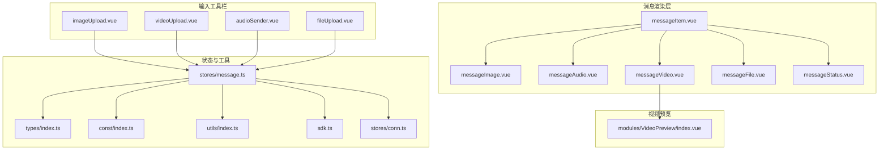
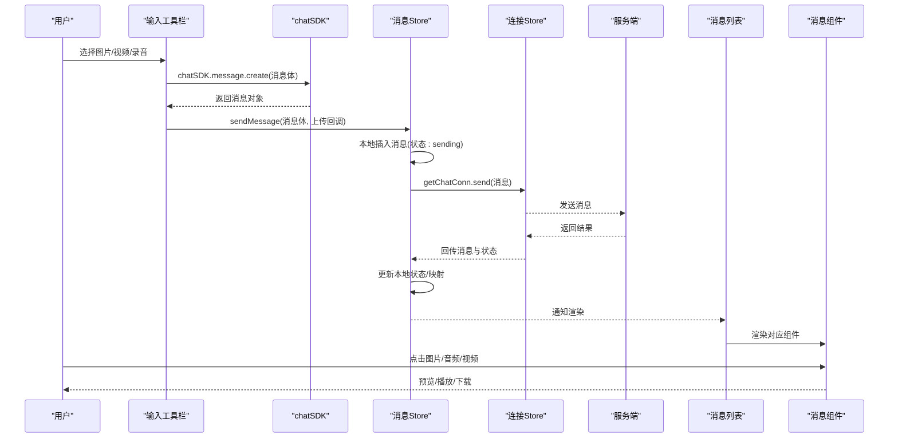
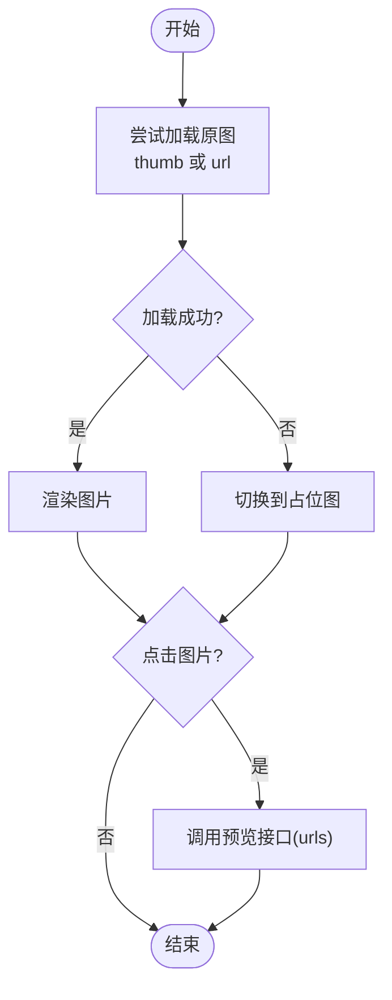
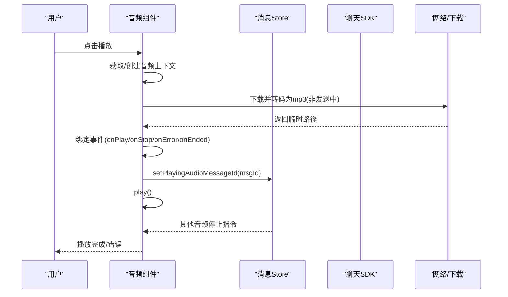
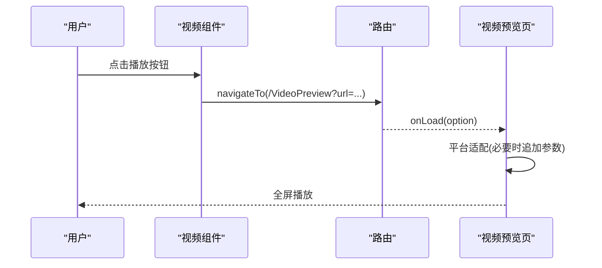
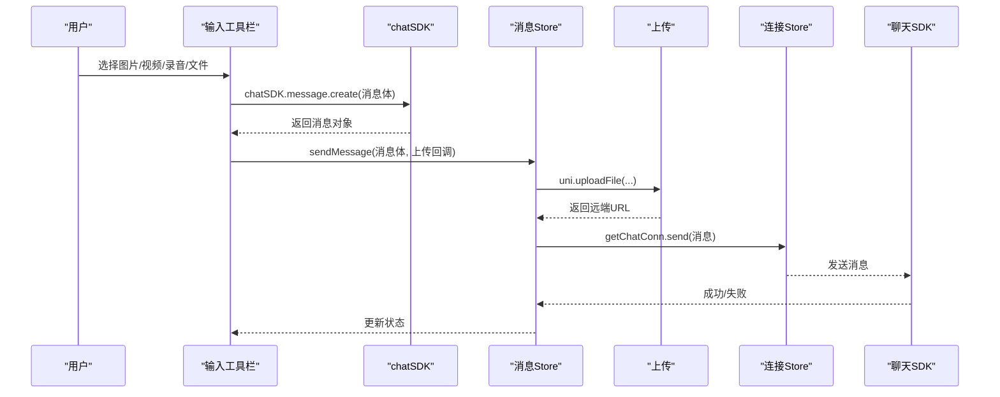
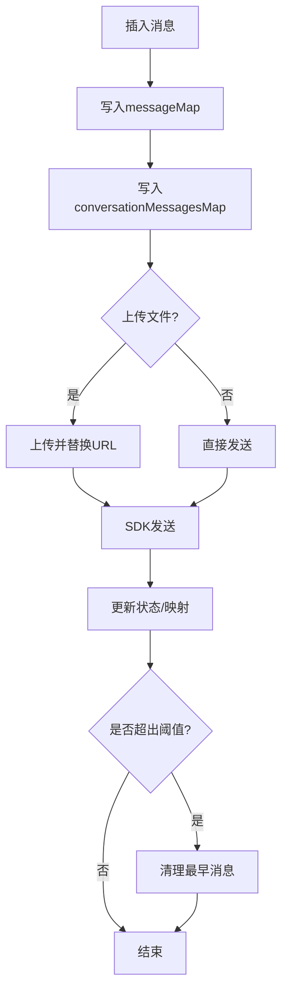
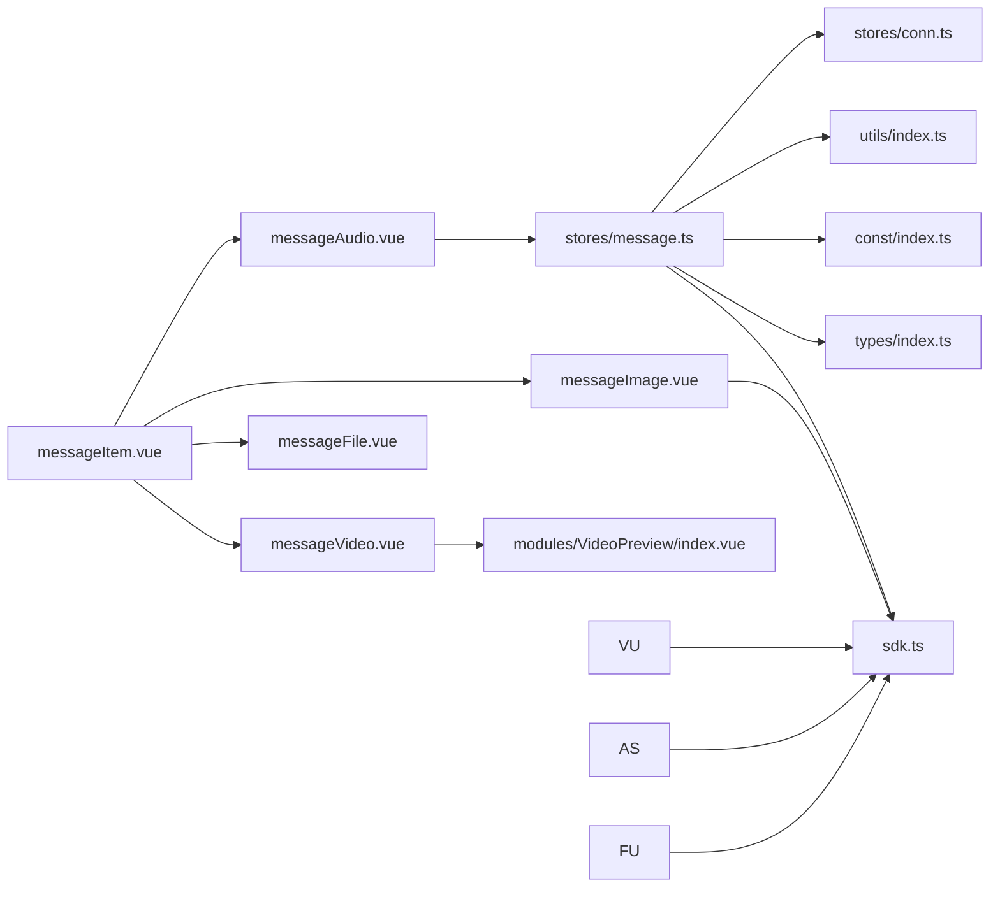

# 多媒体消息

<cite>
**本文档引用的文件**
- [messageImage.vue](file://ChatUIKit/modules/Chat/components/Message/messageImage.vue)
- [messageAudio.vue](file://ChatUIKit/modules/Chat/components/Message/messageAudio.vue)
- [messageVideo.vue](file://ChatUIKit/modules/Chat/components/Message/messageVideo.vue)
- [messageFile.vue](file://ChatUIKit/modules/Chat/components/Message/messageFile.vue)
- [messageItem.vue](file://ChatUIKit/modules/Chat/components/Message/messageItem.vue)
- [messageStatus.vue](file://ChatUIKit/modules/Chat/components/Message/messageStatus.vue)
- [message.ts](file://ChatUIKit/stores/message.ts)
- [index.ts](file://ChatUIKit/types/index.ts)
- [index.ts](file://ChatUIKit/const/index.ts)
- [index.vue](file://ChatUIKit/modules/VideoPreview/index.vue)
- [index.ts](file://ChatUIKit/utils/index.ts)
- [imageUpload.vue](file://ChatUIKit/modules/Chat/components/MessageInputToolBar/imageUpload.vue)
- [videoUpload.vue](file://ChatUIKit/modules/Chat/components/MessageInputToolBar/videoUpload.vue)
- [audioSender.vue](file://ChatUIKit/modules/Chat/components/MessageInputToolBar/audioSender.vue)
- [fileUpload.vue](file://ChatUIKit/modules/Chat/components/MessageInputToolBar/fileUpload.vue)
- [messageActions.vue](file://ChatUIKit/modules/Chat/components/Message/messageActions.vue)
- [sdk.ts](file://ChatUIKit/sdk.ts)
- [conn.ts](file://ChatUIKit/stores/conn.ts)
</cite>

## 更新摘要
**所做更改**
- 更新了多媒体上传组件的 SDK 使用方式，从 `chatConn.message.create` 迁移到 `chatSDK.message.create`
- 增强了 SDK 初始化验证和错误处理机制
- 更新了相关组件的实现细节和错误处理逻辑

## 目录
1. [简介](#简介)
2. [项目结构](#项目结构)
3. [核心组件](#核心组件)
4. [架构总览](#架构总览)
5. [详细组件分析](#详细组件分析)
6. [依赖关系分析](#依赖关系分析)
7. [性能与优化](#性能与优化)
8. [故障排查指南](#故障排查指南)
9. [结论](#结论)
10. [附录](#附录)

## 简介
本文件面向多媒体消息系统，围绕图片、音频、视频消息的加载、预览与播放机制进行深入解析；同时覆盖缓存策略、压缩与格式转换、状态管理与错误处理、尺寸适配与响应式显示、触摸手势支持，以及下载、保存与分享能力。文档还针对大文件传输、网络优化与存储空间管理提出实践建议。

**更新** 本版本重点更新了多媒体上传组件的 SDK 使用方式，采用 `chatSDK.message.create` 替代原有的 `chatConn.message.create`，增强了 SDK 初始化验证和错误处理机制。

## 项目结构
多媒体消息相关代码主要集中在聊天模块的 Message 子目录与输入工具栏子目录，并通过 Pinia Store 进行消息状态与业务流程编排。视频预览页面独立于消息列表，采用路由参数传递 URL。

**图表来源**
- [messageItem.vue](file://ChatUIKit/modules/Chat/components/Message/messageItem.vue#L1-L264)
- [messageImage.vue](file://ChatUIKit/modules/Chat/components/Message/messageImage.vue#L1-L84)
- [messageAudio.vue](file://ChatUIKit/modules/Chat/components/Message/messageAudio.vue#L1-L194)
- [messageVideo.vue](file://ChatUIKit/modules/Chat/components/Message/messageVideo.vue#L1-L109)
- [messageFile.vue](file://ChatUIKit/modules/Chat/components/Message/messageFile.vue#L1-L130)
- [imageUpload.vue](file://ChatUIKit/modules/Chat/components/MessageInputToolBar/imageUpload.vue#L1-L85)
- [videoUpload.vue](file://ChatUIKit/modules/Chat/components/MessageInputToolBar/videoUpload.vue#L1-L87)
- [audioSender.vue](file://ChatUIKit/modules/Chat/components/MessageInputToolBar/audioSender.vue#L1-L350)
- [fileUpload.vue](file://ChatUIKit/modules/Chat/components/MessageInputToolBar/fileUpload.vue#L1-L104)
- [message.ts](file://ChatUIKit/stores/message.ts#L1-L581)
- [index.ts](file://ChatUIKit/types/index.ts#L1-L100)
- [index.ts](file://ChatUIKit/const/index.ts#L1-L37)
- [index.vue](file://ChatUIKit/modules/VideoPreview/index.vue#L1-L51)
- [sdk.ts](file://ChatUIKit/sdk.ts#L1-L13)
- [conn.ts](file://ChatUIKit/stores/conn.ts#L1-L84)

**章节来源**
- [messageItem.vue](file://ChatUIKit/modules/Chat/components/Message/messageItem.vue#L1-L264)
- [message.ts](file://ChatUIKit/stores/message.ts#L1-L581)

## 核心组件
- 图片消息组件：负责图片加载、错误兜底、尺寸计算与预览。
- 音频消息组件：负责录音、播放、跨平台兼容、状态同步与并发控制。
- 视频消息组件：负责封面图、播放按钮、预览跳转与平台适配。
- 文件消息组件：负责文档类文件的下载与打开。
- 视频预览页面：负责视频播放与平台差异处理。
- 输入工具栏：负责图片/视频/音频的采集与上传，现使用 `chatSDK.message.create` 创建消息体。
- 消息状态组件：负责发送状态的可视化反馈。
- 消息 Store：负责消息生命周期、历史拉取、状态变更与清理。

**更新** 所有输入工具栏组件现已统一使用 `chatSDK.message.create` 方法创建消息体，替代原有的 `chatConn.message.create` 方式。

**章节来源**
- [messageImage.vue](file://ChatUIKit/modules/Chat/components/Message/messageImage.vue#L1-L84)
- [messageAudio.vue](file://ChatUIKit/modules/Chat/components/Message/messageAudio.vue#L1-L194)
- [messageVideo.vue](file://ChatUIKit/modules/Chat/components/Message/messageVideo.vue#L1-L109)
- [messageFile.vue](file://ChatUIKit/modules/Chat/components/Message/messageFile.vue#L1-L130)
- [index.vue](file://ChatUIKit/modules/VideoPreview/index.vue#L1-L51)
- [imageUpload.vue](file://ChatUIKit/modules/Chat/components/MessageInputToolBar/imageUpload.vue#L59)
- [videoUpload.vue](file://ChatUIKit/modules/Chat/components/MessageInputToolBar/videoUpload.vue#L58)
- [audioSender.vue](file://ChatUIKit/modules/Chat/components/MessageInputToolBar/audioSender.vue#L192)
- [fileUpload.vue](file://ChatUIKit/modules/Chat/components/MessageInputToolBar/fileUpload.vue#L73)
- [messageStatus.vue](file://ChatUIKit/modules/Chat/components/Message/messageStatus.vue#L1-L95)
- [message.ts](file://ChatUIKit/stores/message.ts#L1-L581)

## 架构总览
多媒体消息的端到端流程如下：
- 发送侧：输入工具栏采集图片/视频/音频，使用 `chatSDK.message.create` 创建消息体，Store 统一处理上传与发送，更新本地状态。
- 接收侧：Store 接收消息并写入本地映射与会话列表，消息项根据类型渲染对应组件。
- 渲染侧：图片/音频/视频组件分别负责加载、预览、播放与状态反馈；视频消息通过路由跳转至视频预览页。
- 状态侧：Store 维护播放中的音频 ID、消息计数与清理策略，组件通过 Store 的 getter 与 action 协同。

**图表来源**
- [imageUpload.vue](file://ChatUIKit/modules/Chat/components/MessageInputToolBar/imageUpload.vue#L59)
- [videoUpload.vue](file://ChatUIKit/modules/Chat/components/MessageInputToolBar/videoUpload.vue#L58)
- [audioSender.vue](file://ChatUIKit/modules/Chat/components/MessageInputToolBar/audioSender.vue#L192)
- [fileUpload.vue](file://ChatUIKit/modules/Chat/components/MessageInputToolBar/fileUpload.vue#L73)
- [message.ts](file://ChatUIKit/stores/message.ts#L223-L336)
- [messageItem.vue](file://ChatUIKit/modules/Chat/components/Message/messageItem.vue#L41-L58)

## 详细组件分析

### 图片消息组件（messageImage.vue）
- 加载与错误处理：监听图片加载失败事件，切换到占位图；支持点击预览。
- 尺寸适配：若未显式传入宽高，依据原始尺寸按等比缩放至最大边长；否则按传入尺寸渲染。
- 预览：调用平台预览接口，支持禁用预览开关。
- 样式：圆角与自适应布局。

**图表来源**
- [messageImage.vue](file://ChatUIKit/modules/Chat/components/Message/messageImage.vue#L40-L51)
- [messageImage.vue](file://ChatUIKit/modules/Chat/components/Message/messageImage.vue#L53-L76)

**章节来源**
- [messageImage.vue](file://ChatUIKit/modules/Chat/components/Message/messageImage.vue#L1-L84)

### 音频消息组件（messageAudio.vue）
- 录音与播放：录音管理器与内部音频上下文；支持震动提示与最大时长限制；跨平台静音开关。
- 播放控制：同一时刻仅允许一个音频播放，Store 维护当前播放 ID；其他音频自动停止。
- 下载与格式转换：接收消息时若非发送中，优先下载并转为 mp3；失败时提示并保持不可播放。
- UI 反馈：根据发送方与播放状态切换图标与宽度。

**图表来源**
- [messageAudio.vue](file://ChatUIKit/modules/Chat/components/Message/messageAudio.vue#L59-L74)
- [messageAudio.vue](file://ChatUIKit/modules/Chat/components/Message/messageAudio.vue#L76-L106)
- [messageAudio.vue](file://ChatUIKit/modules/Chat/components/Message/messageAudio.vue#L108-L135)
- [messageAudio.vue](file://ChatUIKit/modules/Chat/components/Message/messageAudio.vue#L158-L166)
- [message.ts](file://ChatUIKit/stores/message.ts#L523-L525)

**章节来源**
- [messageAudio.vue](file://ChatUIKit/modules/Chat/components/Message/messageAudio.vue#L1-L194)
- [message.ts](file://ChatUIKit/stores/message.ts#L1-L581)

### 视频消息组件（messageVideo.vue）
- 封面图与播放按钮：根据传入尺寸计算按钮大小；错误时显示占位图。
- 预览：跳转至视频预览页面，传递 URL 参数；支持禁用预览开关。
- 平台适配：预览页在 Safari/微信 iOS 场景下追加参数以提升兼容性。

**图表来源**
- [messageVideo.vue](file://ChatUIKit/modules/Chat/components/Message/messageVideo.vue#L69-L76)
- [index.vue](file://ChatUIKit/modules/VideoPreview/index.vue#L21-L37)

**章节来源**
- [messageVideo.vue](file://ChatUIKit/modules/Chat/components/Message/messageVideo.vue#L1-L109)
- [index.vue](file://ChatUIKit/modules/VideoPreview/index.vue#L1-L51)

### 文件消息组件（messageFile.vue）
- 文档打开：在 Web 环境直接新开窗口；在移动端通过下载后 openDocument 打开。
- 错误处理：打开失败时提示并隐藏加载层。

**章节来源**
- [messageFile.vue](file://ChatUIKit/modules/Chat/components/Message/messageFile.vue#L1-L130)

### 视频预览页面（modules/VideoPreview/index.vue）
- 延迟显示：避免频繁进入导致播放器偏移与卡顿。
- 平台适配：Safari 与微信 iOS 场景追加参数以提升兼容性。

**章节来源**
- [index.vue](file://ChatUIKit/modules/VideoPreview/index.vue#L1-L51)

### 输入工具栏（图片/视频/音频/文件）
- 图片上传：从相册选择，使用 `chatSDK.message.create` 构造图片消息并上传。
- 视频上传：支持相机与相册，使用 `chatSDK.message.create` 构造视频消息并上传。
- 音频发送：录音管理器采集，使用 `chatSDK.message.create` 创建音频消息，本地播放预览，上传后发送。
- 文件上传：使用 `chatSDK.message.create` 构造文件消息并上传。

**更新** 所有输入工具栏组件现已统一使用 `chatSDK.message.create` 方法创建消息体，替代原有的 `chatConn.message.create` 方式。这提供了更好的 SDK 初始化验证和错误处理机制。

**图表来源**
- [imageUpload.vue](file://ChatUIKit/modules/Chat/components/MessageInputToolBar/imageUpload.vue#L59)
- [videoUpload.vue](file://ChatUIKit/modules/Chat/components/MessageInputToolBar/videoUpload.vue#L58)
- [audioSender.vue](file://ChatUIKit/modules/Chat/components/MessageInputToolBar/audioSender.vue#L192)
- [fileUpload.vue](file://ChatUIKit/modules/Chat/components/MessageInputToolBar/fileUpload.vue#L73)
- [message.ts](file://ChatUIKit/stores/message.ts#L223-L336)

**章节来源**
- [imageUpload.vue](file://ChatUIKit/modules/Chat/components/MessageInputToolBar/imageUpload.vue#L1-L85)
- [videoUpload.vue](file://ChatUIKit/modules/Chat/components/MessageInputToolBar/videoUpload.vue#L1-L87)
- [audioSender.vue](file://ChatUIKit/modules/Chat/components/MessageInputToolBar/audioSender.vue#L1-L350)
- [fileUpload.vue](file://ChatUIKit/modules/Chat/components/MessageInputToolBar/fileUpload.vue#L1-L104)

### 消息状态组件（messageStatus.vue）
- 状态枚举：发送中、已发送、失败、已送达、已读。
- UI 动画：旋转指示器、勾选、失败、送达、已读图标。

**章节来源**
- [messageStatus.vue](file://ChatUIKit/modules/Chat/components/Message/messageStatus.vue#L1-L95)
- [index.ts](file://ChatUIKit/types/index.ts#L46-L52)

### 消息 Store（stores/message.ts）
- 数据模型：消息映射与会话消息 ID 列表；当前播放音频 ID；引用/编辑中的消息。
- 历史消息：分页拉取、去重合并、游标与末尾标记。
- 发送流程：本地插入、上传、发送 SDK、更新状态与服务器消息映射。
- 接收流程：新增消息、更新会话、标记已读、清理非当前会话消息。
- 撤回/删除：服务端操作与本地映射清理。
- 清理策略：超过阈值时清理最早消息，释放内存与映射。

**图表来源**
- [message.ts](file://ChatUIKit/stores/message.ts#L112-L118)
- [message.ts](file://ChatUIKit/stores/message.ts#L129-L197)
- [message.ts](file://ChatUIKit/stores/message.ts#L223-L336)
- [message.ts](file://ChatUIKit/stores/message.ts#L529-L554)

**章节来源**
- [message.ts](file://ChatUIKit/stores/message.ts#L1-L581)

### SDK 初始化与错误处理（新增）
- chatSDK 导出：通过 `sdk.ts` 统一导出 `chatSDK` 实例，确保类型安全。
- 初始化验证：`conn.ts` 中的 `getChatConn` getter 提供 SDK 初始化验证，未初始化时抛出明确错误。
- 错误处理：所有多媒体上传组件都包含完整的错误处理逻辑，包括权限检查、网络错误和 SDK 初始化错误。

**新增章节来源**
- [sdk.ts](file://ChatUIKit/sdk.ts#L1-L13)
- [conn.ts](file://ChatUIKit/stores/conn.ts#L25-L40)

## 依赖关系分析
- 组件间依赖：messageItem 作为容器，按消息类型动态渲染具体组件；音频组件依赖 Store 的播放状态；视频组件依赖视频预览页。
- Store 依赖：消息 Store 依赖连接 Store、会话 Store、应用用户 Store 与聊天 SDK；类型定义与常量提供统一约束。
- 工具依赖：工具模块提供时间格式化、平台判断、节流等通用能力。
- SDK 依赖：输入工具栏组件统一依赖 `chatSDK` 实例，通过 `sdk.ts` 导出，确保类型安全和初始化验证。

**图表来源**
- [messageItem.vue](file://ChatUIKit/modules/Chat/components/Message/messageItem.vue#L41-L58)
- [message.ts](file://ChatUIKit/stores/message.ts#L1-L581)
- [index.ts](file://ChatUIKit/types/index.ts#L1-L100)
- [index.ts](file://ChatUIKit/const/index.ts#L1-L37)
- [index.vue](file://ChatUIKit/modules/VideoPreview/index.vue#L1-L51)
- [sdk.ts](file://ChatUIKit/sdk.ts#L1-L13)
- [conn.ts](file://ChatUIKit/stores/conn.ts#L1-L84)

**章节来源**
- [messageItem.vue](file://ChatUIKit/modules/Chat/components/Message/messageItem.vue#L1-L264)
- [message.ts](file://ChatUIKit/stores/message.ts#L1-L581)

## 性能与优化
- 图片加载与尺寸
  - 优先使用缩略图（thumb）减少首屏压力；未传入尺寸时按等比缩放，避免过度绘制。
  - 失败时快速回退占位图，降低重复渲染成本。
- 音频播放并发控制
  - 通过 Store 维护单一播放上下文，避免多音频竞态；播放前先绑定事件再设置 src，确保事件触发。
  - 跨平台静音开关与震动提示，改善用户体验。
- 视频预览延迟显示
  - 预览页延时显示，规避多次进入导致的播放器偏移与卡顿。
- 网络与存储
  - 发送侧统一走上传接口，完成后替换本地 URL；接收侧按需下载并缓存临时文件。
  - 历史消息按阈值清理，防止内存膨胀。
- 响应式与手势
  - 消息气泡根据方向调整背景与箭头；长按手势触发操作菜单，自动定位菜单位置。
- SDK 初始化优化（新增）
  - 通过 `conn.ts` 的 `getChatConn` getter 提供即时的 SDK 初始化验证，避免运行时错误。
  - 统一的错误处理机制，提供清晰的错误信息和恢复建议。

**章节来源**
- [messageImage.vue](file://ChatUIKit/modules/Chat/components/Message/messageImage.vue#L29-L38)
- [messageAudio.vue](file://ChatUIKit/modules/Chat/components/Message/messageAudio.vue#L64-L74)
- [index.vue](file://ChatUIKit/modules/VideoPreview/index.vue#L32-L36)
- [message.ts](file://ChatUIKit/stores/message.ts#L529-L554)
- [messageItem.vue](file://ChatUIKit/modules/Chat/components/Message/messageItem.vue#L136-L180)
- [conn.ts](file://ChatUIKit/stores/conn.ts#L25-L40)

## 故障排查指南
- 图片无法显示
  - 检查 thumb/url 是否有效；确认错误回调是否触发并切换占位图。
  - 若尺寸异常，确认传入宽高或自动计算逻辑。
- 音频无法播放
  - 确认下载转码是否成功；检查权限与平台静音开关；查看事件回调日志。
  - 若多个音频同时播放，确认 Store 的播放 ID 同步是否正确。
- 视频无法预览
  - 检查路由参数 URL 是否正确；Safari/微信 iOS 场景是否追加了兼容参数。
  - 预览页是否延迟显示生效。
- 文件打开失败
  - 移动端下载后 openDocument 失败时，确认文件类型与扩展名；提示用户重试。
- 发送失败
  - 查看 Store 的状态更新与失败回调；检查上传与 SDK 发送流程。
- SDK 初始化错误（新增）
  - 检查 `conn.ts` 中的 `getChatConn` 调用是否抛出 "Chat connection not initialized" 错误。
  - 确认 `chatSDK.connection` 实例是否正确初始化。
  - 验证 `sdk.ts` 中的 `chatSDK` 导出是否正常。

**章节来源**
- [messageImage.vue](file://ChatUIKit/modules/Chat/components/Message/messageImage.vue#L40-L42)
- [messageAudio.vue](file://ChatUIKit/modules/Chat/components/Message/messageAudio.vue#L96-L103)
- [index.vue](file://ChatUIKit/modules/VideoPreview/index.vue#L23-L31)
- [messageFile.vue](file://ChatUIKit/modules/Chat/components/Message/messageFile.vue#L63-L75)
- [message.ts](file://ChatUIKit/stores/message.ts#L332-L335)
- [conn.ts](file://ChatUIKit/stores/conn.ts#L30-L33)

## 结论
该多媒体消息系统以组件化与 Store 驱动为核心，实现了图片、音频、视频与文件消息的完整链路：从采集、上传、发送、接收、渲染到播放/预览。通过严格的播放并发控制、平台适配与状态管理，系统在可用性与性能之间取得平衡。

**更新** 本次更新将多媒体上传组件的 SDK 使用方式从 `chatConn.message.create` 迁移到 `chatSDK.message.create`，增强了 SDK 初始化验证和错误处理机制。新的实现提供了更好的类型安全性和运行时错误处理，提升了系统的稳定性和可维护性。

建议在生产环境中结合业务场景进一步完善缓存策略、大文件分片与断点续传、以及更细粒度的错误上报与重试机制。

## 附录
- 状态枚举与消息类型定义参考：[types/index.ts](file://ChatUIKit/types/index.ts#L46-L99)
- 常量与资源地址：[const/index.ts](file://ChatUIKit/const/index.ts#L7-L15)
- 工具方法（时间、平台、节流等）：[utils/index.ts](file://ChatUIKit/utils/index.ts#L31-L134)
- SDK 导出与初始化：[sdk.ts](file://ChatUIKit/sdk.ts#L1-L13)
- 连接状态管理与验证：[conn.ts](file://ChatUIKit/stores/conn.ts#L1-L84)