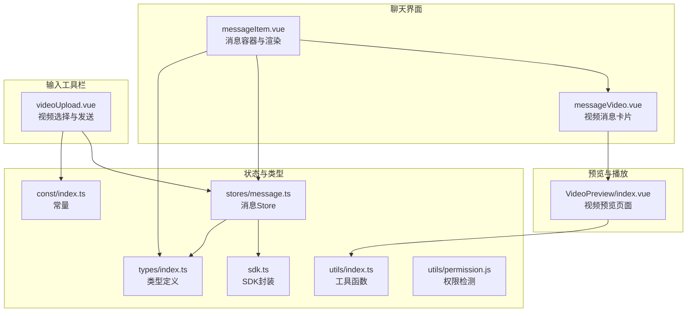
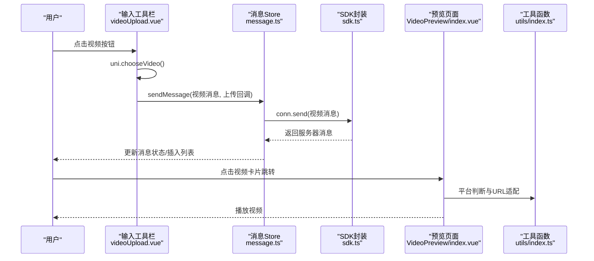
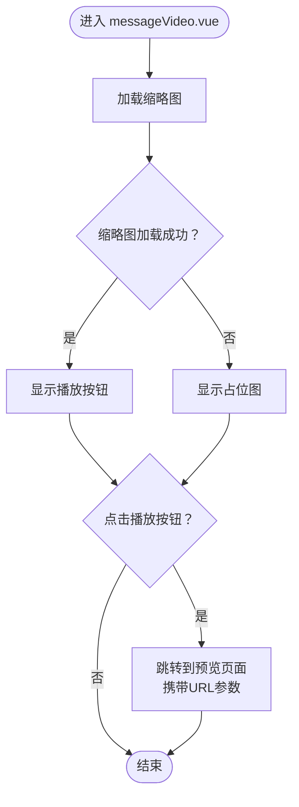
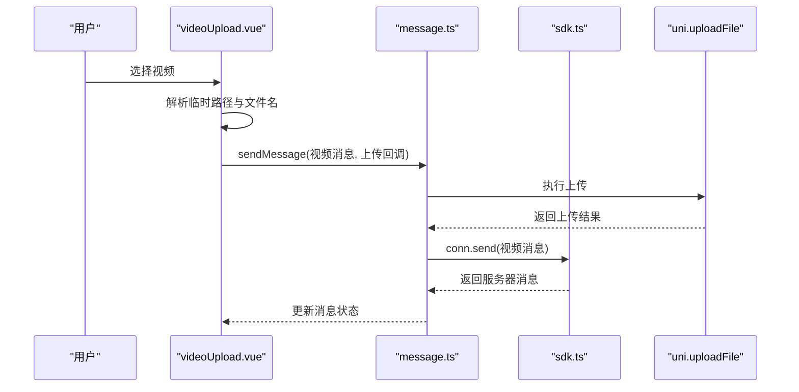
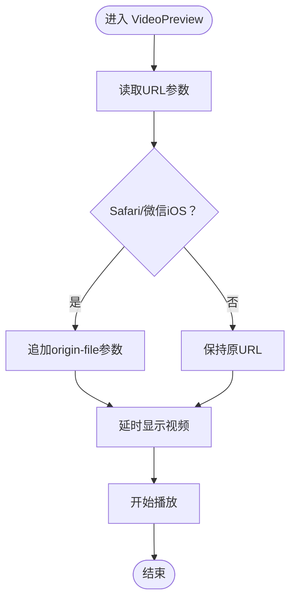
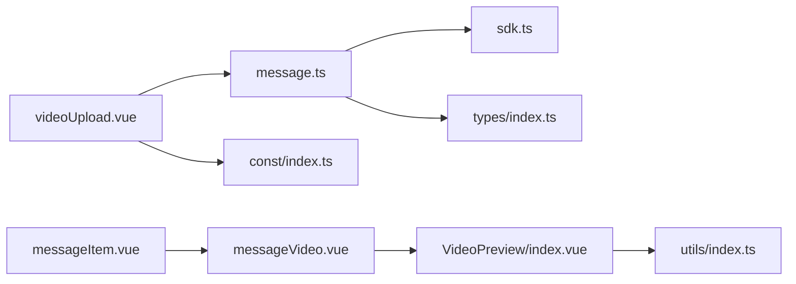

# 视频消息

<cite>
**本文档引用的文件**
- [messageVideo.vue](file://ChatUIKit/modules/Chat/components/Message/messageVideo.vue)
- [messageItem.vue](file://ChatUIKit/modules/Chat/components/Message/messageItem.vue)
- [videoUpload.vue](file://ChatUIKit/modules/Chat/components/MessageInputToolBar/videoUpload.vue)
- [index.vue](file://ChatUIKit/modules/VideoPreview/index.vue)
- [message.ts](file://ChatUIKit/stores/message.ts)
- [index.ts](file://ChatUIKit/types/index.ts)
- [sdk.ts](file://ChatUIKit/sdk.ts)
- [index.ts](file://ChatUIKit/const/index.ts)
- [index.ts](file://ChatUIKit/utils/index.ts)
- [permission.js](file://ChatUIKit/utils/permission.js)
</cite>

## 目录
1. [简介](#简介)
2. [项目结构](#项目结构)
3. [核心组件](#核心组件)
4. [架构总览](#架构总览)
5. [详细组件分析](#详细组件分析)
6. [依赖关系分析](#依赖关系分析)
7. [性能考虑](#性能考虑)
8. [故障排除指南](#故障排除指南)
9. [结论](#结论)

## 简介
本章节概述视频消息功能的整体设计目标与实现范围，涵盖从录制、预览到播放的完整链路，并说明当前仓库中已实现的功能点与缺失点，帮助读者快速理解系统边界。

- 录制与上传：通过输入工具栏触发系统选择器，支持从相册或摄像头选择视频并上传至服务端，随后以消息形式发送。
- 预览与播放：消息卡片点击后跳转到独立的视频预览页面，使用原生 video 组件进行播放；针对 Safari 和微信 iOS 场景做了特殊处理。
- 状态管理：消息状态（发送中、已发送、失败）由消息 Store 统一维护，视频消息在发送流程中保留缩略图与原始 URL。
- 权限与兼容性：提供 iOS 相机/录音/相册等权限检测与跳转设置页能力；对 Safari/微信 iOS 的播放兼容性进行了适配。
- 缺失能力：当前未实现视频录制权限申请、自动暂停/恢复、全屏模式、进度控制、手势操作、截图、下载与分享等高级特性。后续可基于现有架构扩展。

## 项目结构
视频消息相关模块分布于聊天界面、输入工具栏、消息渲染与预览页面之间，配合消息 Store 完成状态流转与数据持久化。

**图表来源**
- [messageItem.vue](file://ChatUIKit/modules/Chat/components/Message/messageItem.vue#L1-L264)
- [messageVideo.vue](file://ChatUIKit/modules/Chat/components/Message/messageVideo.vue#L1-L109)
- [videoUpload.vue](file://ChatUIKit/modules/Chat/components/MessageInputToolBar/videoUpload.vue#L1-L87)
- [index.vue](file://ChatUIKit/modules/VideoPreview/index.vue#L1-L51)
- [message.ts](file://ChatUIKit/stores/message.ts#L1-L581)
- [index.ts](file://ChatUIKit/types/index.ts#L1-L100)
- [sdk.ts](file://ChatUIKit/sdk.ts#L1-L13)
- [index.ts](file://ChatUIKit/const/index.ts#L1-L37)
- [index.ts](file://ChatUIKit/utils/index.ts#L1-L344)
- [permission.js](file://ChatUIKit/utils/permission.js#L43-L232)

**章节来源**
- [messageItem.vue](file://ChatUIKit/modules/Chat/components/Message/messageItem.vue#L1-L264)
- [messageVideo.vue](file://ChatUIKit/modules/Chat/components/Message/messageVideo.vue#L1-L109)
- [videoUpload.vue](file://ChatUIKit/modules/Chat/components/MessageInputToolBar/videoUpload.vue#L1-L87)
- [index.vue](file://ChatUIKit/modules/VideoPreview/index.vue#L1-L51)
- [message.ts](file://ChatUIKit/stores/message.ts#L1-L581)
- [index.ts](file://ChatUIKit/types/index.ts#L1-L100)
- [sdk.ts](file://ChatUIKit/sdk.ts#L1-L13)
- [index.ts](file://ChatUIKit/const/index.ts#L1-L37)
- [index.ts](file://ChatUIKit/utils/index.ts#L1-L344)
- [permission.js](file://ChatUIKit/utils/permission.js#L43-L232)

## 核心组件
- 视频消息卡片：负责渲染视频缩略图、播放按钮与错误占位图，点击后跳转到预览页面。
- 视频上传工具：提供从相册/摄像头选择视频的能力，构造视频消息并通过 Store 发送，同时上传文件。
- 视频预览页面：接收 URL 参数，针对 Safari/微信 iOS 做兼容处理，延时显示避免页面抖动。
- 消息 Store：统一管理消息状态、插入/清理消息、发送与回执处理，视频消息在发送后保留缩略图与原始 URL。
- 类型与 SDK：定义混合消息体、消息状态等类型，封装 SDK 访问入口。
- 工具与常量：提供平台判断、节流等通用工具，以及资源路径与最大消息数等常量。
- 权限检测：提供 iOS 相机/录音/相册等权限检测与跳转设置页能力。

**章节来源**
- [messageVideo.vue](file://ChatUIKit/modules/Chat/components/Message/messageVideo.vue#L1-L109)
- [videoUpload.vue](file://ChatUIKit/modules/Chat/components/MessageInputToolBar/videoUpload.vue#L1-L87)
- [index.vue](file://ChatUIKit/modules/VideoPreview/index.vue#L1-L51)
- [message.ts](file://ChatUIKit/stores/message.ts#L1-L581)
- [index.ts](file://ChatUIKit/types/index.ts#L1-L100)
- [sdk.ts](file://ChatUIKit/sdk.ts#L1-L13)
- [index.ts](file://ChatUIKit/const/index.ts#L1-L37)
- [index.ts](file://ChatUIKit/utils/index.ts#L1-L344)
- [permission.js](file://ChatUIKit/utils/permission.js#L43-L232)

## 架构总览
视频消息从“选择视频”到“发送/预览/播放”的端到端流程如下：

**图表来源**
- [videoUpload.vue](file://ChatUIKit/modules/Chat/components/MessageInputToolBar/videoUpload.vue#L31-L78)
- [message.ts](file://ChatUIKit/stores/message.ts#L223-L336)
- [sdk.ts](file://ChatUIKit/sdk.ts#L1-L13)
- [index.vue](file://ChatUIKit/modules/VideoPreview/index.vue#L21-L37)
- [index.ts](file://ChatUIKit/utils/index.ts#L80-L97)

**章节来源**
- [videoUpload.vue](file://ChatUIKit/modules/Chat/components/MessageInputToolBar/videoUpload.vue#L1-L87)
- [message.ts](file://ChatUIKit/stores/message.ts#L1-L581)
- [sdk.ts](file://ChatUIKit/sdk.ts#L1-L13)
- [index.vue](file://ChatUIKit/modules/VideoPreview/index.vue#L1-L51)
- [index.ts](file://ChatUIKit/utils/index.ts#L1-L344)

## 详细组件分析

### 视频消息卡片（messageVideo.vue）
- 功能要点
  - 渲染缩略图，错误时显示占位图。
  - 居中显示播放按钮，点击后跳转到预览页面。
  - 支持禁用预览开关，便于在特定场景下屏蔽跳转。
  - 可配置宽高与裁剪模式。
- 关键行为
  - 错误回调切换到占位图。
  - 导航携带 URL 参数，预览页面据此加载视频源。
- 交互与样式
  - 使用绝对定位居中播放按钮，圆角背景增强视觉效果。
  - 容器设置圆角与溢出隐藏，保证缩略图显示一致性。

**图表来源**
- [messageVideo.vue](file://ChatUIKit/modules/Chat/components/Message/messageVideo.vue#L63-L76)

**章节来源**
- [messageVideo.vue](file://ChatUIKit/modules/Chat/components/Message/messageVideo.vue#L1-L109)

### 视频上传与发送（videoUpload.vue）
- 功能要点
  - 通过 uni.chooseVideo 提供“相册/摄像头”两种来源。
  - 构造视频消息体，填充目标会话、消息类型与文件名。
  - 调用 Store 的 sendMessage，传入上传文件的 Promise 回调。
  - 上传完成后，SDK 发送消息并更新本地状态。
- 关键流程
  - 选择视频 -> 创建消息 -> 调用 Store 发送 -> 上传文件 -> 发送消息 -> 更新 UI。

**图表来源**
- [videoUpload.vue](file://ChatUIKit/modules/Chat/components/MessageInputToolBar/videoUpload.vue#L31-L78)
- [message.ts](file://ChatUIKit/stores/message.ts#L223-L336)
- [sdk.ts](file://ChatUIKit/sdk.ts#L1-L13)

**章节来源**
- [videoUpload.vue](file://ChatUIKit/modules/Chat/components/MessageInputToolBar/videoUpload.vue#L1-L87)
- [message.ts](file://ChatUIKit/stores/message.ts#L1-L581)
- [sdk.ts](file://ChatUIKit/sdk.ts#L1-L13)

### 视频预览与播放（VideoPreview/index.vue）
- 功能要点
  - 接收 URL 参数，针对 Safari 与微信 iOS 做特殊处理（追加 origin-file 参数）。
  - 延迟显示视频，避免多次进入导致的偏移与卡顿。
  - 全屏播放由原生 video 控件提供，无需额外实现。
- 兼容性
  - 平台判断函数用于区分 Safari、iOS、微信环境，确保播放体验稳定。

**图表来源**
- [index.vue](file://ChatUIKit/modules/VideoPreview/index.vue#L21-L37)
- [index.ts](file://ChatUIKit/utils/index.ts#L80-L97)

**章节来源**
- [index.vue](file://ChatUIKit/modules/VideoPreview/index.vue#L1-L51)
- [index.ts](file://ChatUIKit/utils/index.ts#L1-L344)

### 消息渲染与容器（messageItem.vue）
- 功能要点
  - 根据消息类型渲染不同组件，视频消息由 messageVideo.vue 处理。
  - 支持长按、触摸开始/结束/移动等手势事件，用于弹出操作菜单。
  - 根据消息方向设置气泡样式与头像位置。
- 与视频消息的关系
  - 在消息列表中，视频消息被包裹在消息容器内，统一处理状态与交互。

**章节来源**
- [messageItem.vue](file://ChatUIKit/modules/Chat/components/Message/messageItem.vue#L1-L264)
- [messageVideo.vue](file://ChatUIKit/modules/Chat/components/Message/messageVideo.vue#L1-L109)

### 类型与状态（types/index.ts、stores/message.ts）
- 类型定义
  - MixedMessageBody：混合消息体，包含状态与服务端 ID 等扩展字段。
  - MessageStatus：消息状态枚举，覆盖发送中、已发送、失败等。
- 消息 Store
  - 维护消息映射与会话消息 ID 列表，插入/清理消息。
  - 发送流程中处理视频消息的缩略图与 URL 更新。
  - 提供播放音频消息的上下文（虽与视频无关，但体现 Store 的消息管理职责）。

**章节来源**
- [index.ts](file://ChatUIKit/types/index.ts#L1-L100)
- [message.ts](file://ChatUIKit/stores/message.ts#L1-L581)

### SDK 与常量（sdk.ts、const/index.ts）
- SDK 封装
  - 对外暴露 chatSDK，内部使用 Easemob Web SDK 的 uniApp 版本。
- 常量
  - 资源路径、最大消息数等常量，影响资源加载与内存占用。

**章节来源**
- [sdk.ts](file://ChatUIKit/sdk.ts#L1-L13)
- [index.ts](file://ChatUIKit/const/index.ts#L1-L37)

### 工具与权限（utils/index.ts、utils/permission.js）
- 工具函数
  - 平台判断（Safari、iOS、微信）、节流等通用能力。
- 权限检测
  - 提供 iOS 相机/录音/相册等权限检测与跳转设置页能力，为后续视频录制权限申请提供参考。

**章节来源**
- [index.ts](file://ChatUIKit/utils/index.ts#L80-L103)
- [permission.js](file://ChatUIKit/utils/permission.js#L43-L232)

## 依赖关系分析
- 组件耦合
  - messageItem.vue 依赖 messageVideo.vue 进行视频消息渲染。
  - videoUpload.vue 依赖 message.ts 与 sdk.ts 完成发送与上传。
  - messageVideo.vue 依赖 index.vue 进行预览跳转。
- 数据流
  - 输入工具栏 -> Store -> SDK -> 服务器 -> Store -> UI 更新。
  - 预览页面依赖工具函数进行平台判断与 URL 适配。
- 外部依赖
  - Easemob Web SDK（uniApp 版本），提供消息发送与历史拉取能力。
  - uniApp API（chooseVideo、uploadFile、navigateTo 等）。

**图表来源**
- [videoUpload.vue](file://ChatUIKit/modules/Chat/components/MessageInputToolBar/videoUpload.vue#L1-L87)
- [message.ts](file://ChatUIKit/stores/message.ts#L1-L581)
- [sdk.ts](file://ChatUIKit/sdk.ts#L1-L13)
- [messageVideo.vue](file://ChatUIKit/modules/Chat/components/Message/messageVideo.vue#L1-L109)
- [index.vue](file://ChatUIKit/modules/VideoPreview/index.vue#L1-L51)
- [index.ts](file://ChatUIKit/utils/index.ts#L1-L344)
- [index.ts](file://ChatUIKit/const/index.ts#L1-L37)
- [messageItem.vue](file://ChatUIKit/modules/Chat/components/Message/messageItem.vue#L1-L264)
- [index.ts](file://ChatUIKit/types/index.ts#L1-L100)

**章节来源**
- [videoUpload.vue](file://ChatUIKit/modules/Chat/components/MessageInputToolBar/videoUpload.vue#L1-L87)
- [message.ts](file://ChatUIKit/stores/message.ts#L1-L581)
- [sdk.ts](file://ChatUIKit/sdk.ts#L1-L13)
- [messageVideo.vue](file://ChatUIKit/modules/Chat/components/Message/messageVideo.vue#L1-L109)
- [index.vue](file://ChatUIKit/modules/VideoPreview/index.vue#L1-L51)
- [index.ts](file://ChatUIKit/utils/index.ts#L1-L344)
- [index.ts](file://ChatUIKit/const/index.ts#L1-L37)
- [messageItem.vue](file://ChatUIKit/modules/Chat/components/Message/messageItem.vue#L1-L264)
- [index.ts](file://ChatUIKit/types/index.ts#L1-L100)

## 性能考虑
- 页面延迟显示：预览页面采用延时显示策略，减少多次进入导致的布局抖动与播放卡顿。
- 消息上限：通过常量限制每个会话的消息数量，避免内存膨胀。
- 上传与发送：上传与发送分离，先上传再发送，降低 UI 阻塞风险。
- 平台适配：针对 Safari/微信 iOS 做 URL 适配，提升首帧与播放稳定性。

**章节来源**
- [index.vue](file://ChatUIKit/modules/VideoPreview/index.vue#L32-L37)
- [index.ts](file://ChatUIKit/const/index.ts#L14-L15)
- [message.ts](file://ChatUIKit/stores/message.ts#L529-L554)

## 故障排除指南
- 视频无法播放
  - 检查 URL 是否正确传递到预览页面。
  - Safari/微信 iOS 场景确认是否追加了 origin-file 参数。
  - 确认网络环境与跨域策略。
- 缩略图不显示
  - 确认消息中 thumb 字段是否正确设置。
  - 错误回调会切换到占位图，检查网络与资源路径。
- 发送失败
  - 查看 Store 的发送流程日志，确认上传与发送阶段的错误信息。
  - 检查 Token 与 API 地址是否正确。
- 权限问题
  - iOS 相机/录音/相册权限未开启会导致无法选择或录制视频。
  - 可使用权限检测工具跳转到系统设置页进行授权。

**章节来源**
- [index.vue](file://ChatUIKit/modules/VideoPreview/index.vue#L21-L31)
- [messageVideo.vue](file://ChatUIKit/modules/Chat/components/Message/messageVideo.vue#L63-L67)
- [message.ts](file://ChatUIKit/stores/message.ts#L332-L336)
- [permission.js](file://ChatUIKit/utils/permission.js#L82-L111)

## 结论
当前仓库实现了视频消息从“选择/上传/发送”到“预览/播放”的完整闭环，具备良好的平台适配与状态管理能力。对于视频录制权限、自动暂停/恢复、全屏模式、进度控制、手势操作、截图/下载/分享等高级特性，可在现有架构基础上逐步扩展，优先利用现有的 Store、SDK 封装与工具函数，确保与整体代码风格一致。