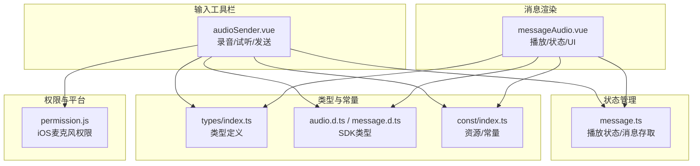
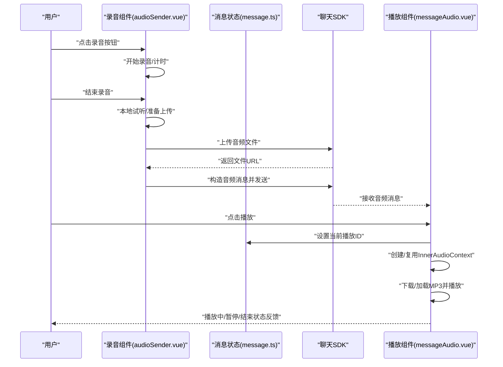
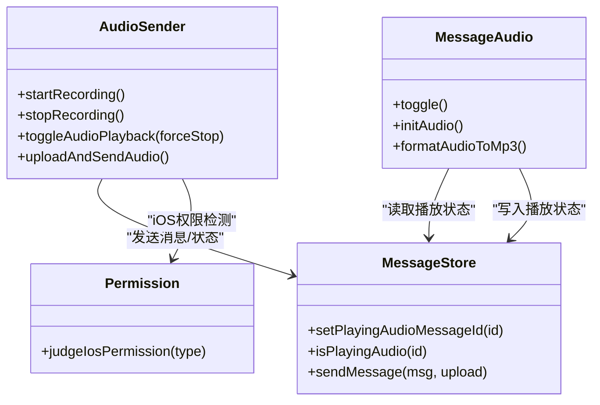

# 音频消息

<cite>
**本文档引用的文件**
- [messageAudio.vue](file://ChatUIKit/modules/Chat/components/Message/messageAudio.vue)
- [audioSender.vue](file://ChatUIKit/modules/Chat/components/MessageInputToolBar/audioSender.vue)
- [message.ts](file://ChatUIKit/stores/message.ts)
- [permission.js](file://ChatUIKit/utils/permission.js)
- [index.ts](file://ChatUIKit/types/index.ts)
- [audio.d.ts](file://demo/node_modules/easemob-websdk/message/audio.d.ts)
- [message.d.ts](file://demo/node_modules/easemob-websdk/types/message.d.ts)
- [index.ts](file://ChatUIKit/const/index.ts)
</cite>

## 目录
1. [简介](#简介)
2. [项目结构](#项目结构)
3. [核心组件](#核心组件)
4. [架构总览](#架构总览)
5. [详细组件分析](#详细组件分析)
6. [依赖关系分析](#依赖关系分析)
7. [性能考虑](#性能考虑)
8. [故障排查指南](#故障排查指南)
9. [结论](#结论)

## 简介
本文件面向“音频消息”功能，系统性梳理从录制、播放到播放控制的完整链路，覆盖格式支持、时长限制与音质控制、状态管理与UI反馈、进度与时间显示、手势控制、下载/保存/分享能力、权限与兼容性问题，以及节流与内存管理等工程实践。目标是帮助开发者快速理解并高效维护音频消息模块。

## 项目结构
音频消息涉及以下关键文件：
- 录音与预览：MessageInputToolBar/audioSender.vue
- 播放与渲染：Message/messageAudio.vue
- 状态与消息生命周期：stores/message.ts
- 权限与平台差异：utils/permission.js
- 类型定义：types/index.ts、node_modules 中的 SDK 类型
- 常量与资源：const/index.ts

图表来源
- [audioSender.vue](file://ChatUIKit/modules/Chat/components/MessageInputToolBar/audioSender.vue#L1-L350)
- [messageAudio.vue](file://ChatUIKit/modules/Chat/components/Message/messageAudio.vue#L1-L194)
- [message.ts](file://ChatUIKit/stores/message.ts#L33-L106)
- [permission.js](file://ChatUIKit/utils/permission.js#L64-L79)
- [index.ts](file://ChatUIKit/types/index.ts#L46-L100)
- [audio.d.ts](file://demo/node_modules/easemob-websdk/message/audio.d.ts#L72-L104)
- [message.d.ts](file://demo/node_modules/easemob-websdk/types/message.d.ts#L447-L467)
- [index.ts](file://ChatUIKit/const/index.ts#L7-L8)

章节来源
- [audioSender.vue](file://ChatUIKit/modules/Chat/components/MessageInputToolBar/audioSender.vue#L1-L350)
- [messageAudio.vue](file://ChatUIKit/modules/Chat/components/Message/messageAudio.vue#L1-L194)
- [message.ts](file://ChatUIKit/stores/message.ts#L33-L106)
- [permission.js](file://ChatUIKit/utils/permission.js#L64-L79)
- [index.ts](file://ChatUIKit/types/index.ts#L46-L100)
- [audio.d.ts](file://demo/node_modules/easemob-websdk/message/audio.d.ts#L72-L104)
- [message.d.ts](file://demo/node_modules/easemob-websdk/types/message.d.ts#L447-L467)
- [index.ts](file://ChatUIKit/const/index.ts#L7-L8)

## 核心组件
- 录音与试听组件：负责录音开始/停止、时长计数、本地试听、上传与发送。
- 消息播放组件：负责音频消息点击播放、播放状态同步、UI图标与宽度随时长变化。
- 消息状态管理：统一维护“当前播放音频消息ID”，确保同一时刻只有一个音频在播放。
- 权限与平台适配：在 iOS 平台检测麦克风权限，必要时引导用户授权。
- 类型与常量：明确音频消息体结构、状态枚举、资源路径等。

章节来源
- [audioSender.vue](file://ChatUIKit/modules/Chat/components/MessageInputToolBar/audioSender.vue#L92-L118)
- [messageAudio.vue](file://ChatUIKit/modules/Chat/components/Message/messageAudio.vue#L59-L74)
- [message.ts](file://ChatUIKit/stores/message.ts#L523-L525)
- [permission.js](file://ChatUIKit/utils/permission.js#L64-L79)
- [index.ts](file://ChatUIKit/types/index.ts#L46-L100)

## 架构总览
音频消息的端到端流程如下：

图表来源
- [audioSender.vue](file://ChatUIKit/modules/Chat/components/MessageInputToolBar/audioSender.vue#L176-L215)
- [message.ts](file://ChatUIKit/stores/message.ts#L523-L525)
- [messageAudio.vue](file://ChatUIKit/modules/Chat/components/Message/messageAudio.vue#L59-L106)

## 详细组件分析

### 录音与试听组件（audioSender.vue）
- 录制状态机
  - record：初始态，点击进入 recording
  - recording：录音中，定时器累计时长，达到上限自动停止
  - recordEnd：录音结束，可试听或发送
- 录制参数与格式
  - 录制格式为 mp3（format: "mp3"）
  - 时长上限通过定时器与最大时长常量控制
- 本地试听
  - 使用 InnerAudioContext 播放本地录音文件
  - 支持播放/暂停/停止事件监听
- 上传与发送
  - 通过 uni.uploadFile 上传至服务端
  - 使用 SDK 的 create 接口构造音频消息，包含长度、文件名、类型等
  - 调用 messageStore.sendMessage 完成发送与本地状态更新
- 权限处理（iOS）
  - 录音错误回调中检测麦克风权限，若未授权则提示并关闭弹窗
- 资源与样式
  - 使用常量 ASSETS_URL 提供图标资源
  - 通过类名控制波纹动画与按钮布局

章节来源
- [audioSender.vue](file://ChatUIKit/modules/Chat/components/MessageInputToolBar/audioSender.vue#L77-L108)
- [audioSender.vue](file://ChatUIKit/modules/Chat/components/MessageInputToolBar/audioSender.vue#L143-L174)
- [audioSender.vue](file://ChatUIKit/modules/Chat/components/MessageInputToolBar/audioSender.vue#L176-L215)
- [audioSender.vue](file://ChatUIKit/modules/Chat/components/MessageInputToolBar/audioSender.vue#L223-L246)
- [permission.js](file://ChatUIKit/utils/permission.js#L64-L79)
- [index.ts](file://ChatUIKit/const/index.ts#L7-L8)

### 消息播放组件（messageAudio.vue）
- 点击切换播放/暂停
  - 首次点击创建 InnerAudioContext，绑定事件后设置 src
  - 通过 messageStore.setPlayingAudioMessageId 维护全局播放状态
- 下载与播放
  - 若消息状态为 sending，直接使用本地 url
  - 否则通过 uni.downloadFile 下载并缓存临时文件
  - 成功后设置 src 并播放
- UI 反馈
  - 根据是否自己发送，动态计算宽度以展示时长
  - 图标随播放状态切换动效
- 全局状态同步
  - 监听 playingAudioMsgId，若非当前消息则停止播放并重置状态
- 生命周期清理
  - 组件卸载时停止播放并销毁 InnerAudioContext

章节来源
- [messageAudio.vue](file://ChatUIKit/modules/Chat/components/Message/messageAudio.vue#L59-L106)
- [messageAudio.vue](file://ChatUIKit/modules/Chat/components/Message/messageAudio.vue#L108-L135)
- [messageAudio.vue](file://ChatUIKit/modules/Chat/components/Message/messageAudio.vue#L137-L156)
- [messageAudio.vue](file://ChatUIKit/modules/Chat/components/Message/messageAudio.vue#L158-L175)

### 消息状态管理（message.ts）
- 关键状态
  - playingAudioMsgId：当前播放的音频消息ID
- 行为
  - setPlayingAudioMessageId：切换播放目标
  - isPlayingAudio：判断某消息是否正在播放
  - sendMessage：发送音频消息时同步 length/url 等字段
- 作用
  - 保证同一时刻只有一个音频在播放
  - 为播放组件提供统一的状态入口

章节来源
- [message.ts](file://ChatUIKit/stores/message.ts#L33-L106)
- [message.ts](file://ChatUIKit/stores/message.ts#L523-L525)
- [message.ts](file://ChatUIKit/stores/message.ts#L243-L251)

### 类型与格式支持
- 音频消息体结构
  - 包含 id、type、body（url/type/filename）、length、time 等字段
- 发送参数
  - CreateAudioMsgParameters 指定 chatType、to、filename、length、file 等
- 状态枚举
  - MessageStatus：包含 sending/sent/received/read/unread/failed 等

章节来源
- [audio.d.ts](file://demo/node_modules/easemob-websdk/message/audio.d.ts#L72-L104)
- [audio.d.ts](file://demo/node_modules/easemob-websdk/message/audio.d.ts#L105-L158)
- [message.d.ts](file://demo/node_modules/easemob-websdk/types/message.d.ts#L447-L467)
- [index.ts](file://ChatUIKit/types/index.ts#L46-L52)

### 进度条、时间显示与手势控制
- 时间显示
  - 录音组件展示已录制时长（秒）
  - 消息组件根据 length 展示时长文本
- 进度条与手势
  - 当前实现未包含滑动拖拽进度条交互
  - 可基于 InnerAudioContext 的进度事件扩展进度条与拖拽控制

章节来源
- [audioSender.vue](file://ChatUIKit/modules/Chat/components/MessageInputToolBar/audioSender.vue#L81-L81)
- [messageAudio.vue](file://ChatUIKit/modules/Chat/components/Message/messageAudio.vue#L7-L26)

### 下载、保存与分享
- 下载
  - 播放组件在非发送中状态下通过 uni.downloadFile 下载音频
- 保存
  - 通过 uni.saveFile 将临时文件保存到本地（建议在播放组件中增加保存入口）
- 分享
  - 通过 uni.share 或 uni.saveFile 后唤起系统分享面板（建议在播放组件中增加分享入口）

章节来源
- [messageAudio.vue](file://ChatUIKit/modules/Chat/components/Message/messageAudio.vue#L82-L105)

### 权限与兼容性
- 录音权限（iOS）
  - 录音错误回调中调用 permission.judgeIosPermission("record") 判断麦克风权限
  - 未授权时提示并关闭弹窗
- 平台差异
  - InnerAudioOption 在小程序平台设置 obeyMuteSwitch=false，避免受系统静音开关影响
- 浏览器/WebView
  - 建议在浏览器环境检测媒体权限与自动播放策略

章节来源
- [audioSender.vue](file://ChatUIKit/modules/Chat/components/MessageInputToolBar/audioSender.vue#L223-L246)
- [permission.js](file://ChatUIKit/utils/permission.js#L64-L79)
- [audioSender.vue](file://ChatUIKit/modules/Chat/components/MessageInputToolBar/audioSender.vue#L160-L164)

### 性能优化与内存管理
- 节流与并发
  - 通过 playingAudioMsgId 限制同一时刻仅有一个音频播放
  - 录音/播放组件在卸载时销毁 InnerAudioContext，避免资源泄漏
- 内存管理
  - 播放组件使用 Map 缓存 InnerAudioContext，首次点击创建并复用
  - 卸载时 stop 并 destroy，删除缓存
- 传输与缓存
  - 下载完成后使用临时文件路径，减少重复下载
  - 发送成功后及时更新本地消息状态，避免重复处理

章节来源
- [message.ts](file://ChatUIKit/stores/message.ts#L523-L525)
- [messageAudio.vue](file://ChatUIKit/modules/Chat/components/Message/messageAudio.vue#L56-L57)
- [messageAudio.vue](file://ChatUIKit/modules/Chat/components/Message/messageAudio.vue#L168-L175)

## 依赖关系分析

图表来源
- [audioSender.vue](file://ChatUIKit/modules/Chat/components/MessageInputToolBar/audioSender.vue#L92-L118)
- [messageAudio.vue](file://ChatUIKit/modules/Chat/components/Message/messageAudio.vue#L59-L74)
- [message.ts](file://ChatUIKit/stores/message.ts#L523-L525)
- [permission.js](file://ChatUIKit/utils/permission.js#L64-L79)

章节来源
- [audioSender.vue](file://ChatUIKit/modules/Chat/components/MessageInputToolBar/audioSender.vue#L92-L118)
- [messageAudio.vue](file://ChatUIKit/modules/Chat/components/Message/messageAudio.vue#L59-L74)
- [message.ts](file://ChatUIKit/stores/message.ts#L523-L525)
- [permission.js](file://ChatUIKit/utils/permission.js#L64-L79)

## 性能考虑
- 播放并发控制：通过 playingAudioMsgId 严格限制单一播放，避免资源竞争
- 资源释放：组件卸载时销毁 InnerAudioContext，防止内存泄漏
- 下载缓存：下载完成后使用临时文件路径，减少重复网络请求
- 事件绑定时机：先绑定事件再设置 src，确保事件回调正常触发
- 平台适配：小程序平台关闭静音开关，提升用户体验

章节来源
- [message.ts](file://ChatUIKit/stores/message.ts#L523-L525)
- [messageAudio.vue](file://ChatUIKit/modules/Chat/components/Message/messageAudio.vue#L69-L71)
- [messageAudio.vue](file://ChatUIKit/modules/Chat/components/Message/messageAudio.vue#L168-L175)

## 故障排查指南
- 录音无声音或无法开始
  - 检查 iOS 麦克风权限是否开启
  - 查看录音错误回调中的权限判断结果
- 播放无声或报错
  - 确认下载是否成功，临时文件是否存在
  - 检查 InnerAudioContext 事件回调中的错误信息
- 无法同时播放多个音频
  - 确认 playingAudioMsgId 是否被正确更新
  - 检查其他消息组件是否在监听并停止播放
- 上传失败
  - 检查上传接口返回与 token 有效性
  - 确认文件类型与长度字段是否正确传入

章节来源
- [audioSender.vue](file://ChatUIKit/modules/Chat/components/MessageInputToolBar/audioSender.vue#L223-L246)
- [messageAudio.vue](file://ChatUIKit/modules/Chat/components/Message/messageAudio.vue#L96-L105)
- [message.ts](file://ChatUIKit/stores/message.ts#L523-L525)

## 结论
音频消息模块围绕“录音—上传—发送—播放—状态同步—资源释放”的闭环构建，具备清晰的状态管理与平台适配能力。建议后续增强：
- 播放进度条与手势拖拽
- 保存与分享入口
- 更完善的错误提示与重试机制
- 对浏览器/WebView 的自动播放策略适配