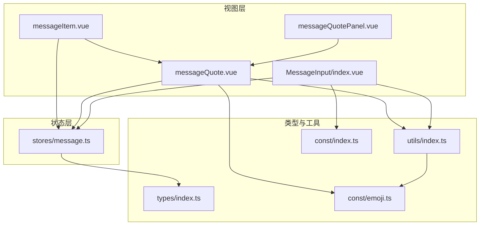
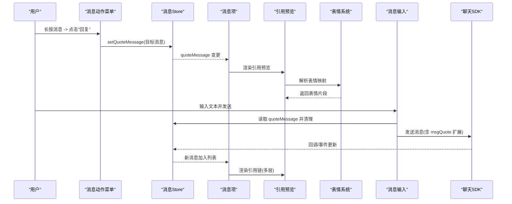
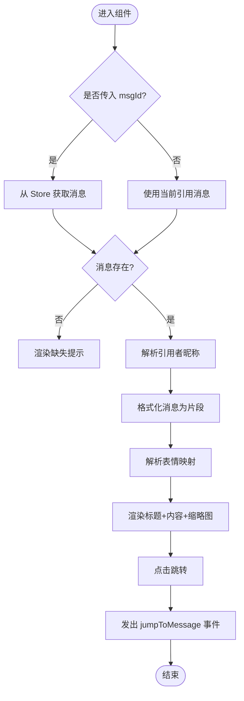
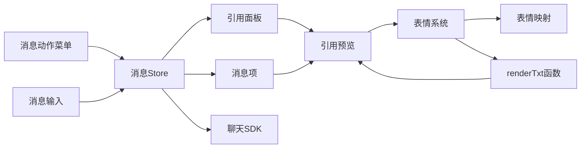
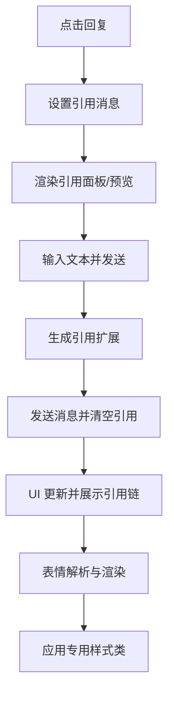

# 引用回复消息

<cite>
**本文档引用的文件**
- [messageQuote.vue](file://ChatUIKit/modules/Chat/components/Message/messageQuote.vue)
- [messageQuotePanel.vue](file://ChatUIKit/modules/Chat/components/Message/messageQuotePanel.vue)
- [messageItem.vue](file://ChatUIKit/modules/Chat/components/Message/messageItem.vue)
- [messageActions.vue](file://ChatUIKit/modules/Chat/components/Message/messageActions.vue)
- [index.vue](file://ChatUIKit/modules/Chat/components/MessageInput/index.vue)
- [message.ts](file://ChatUIKit/stores/message.ts)
- [index.ts](file://ChatUIKit/types/index.ts)
- [index.ts](file://ChatUIKit/utils/index.ts)
- [index.ts](file://ChatUIKit/const/index.ts)
- [emoji.ts](file://ChatUIKit/const/emoji.ts)
</cite>

## 更新摘要
**所做更改**
- 新增表情解析系统的详细说明，包括文本和表情混合内容的智能渲染机制
- 添加 quote-emoji-list、quote-emoji-item、quote-emoji-img CSS 类的样式规范
- 更新引用预览组件的表情渲染优化，支持更丰富的表情显示效果
- 增强引用消息的视觉呈现，提供更好的用户体验

## 目录
1. [简介](#简介)
2. [项目结构](#项目结构)
3. [核心组件](#核心组件)
4. [架构总览](#架构总览)
5. [组件详细分析](#组件详细分析)
6. [表情解析系统增强](#表情解析系统增强)
7. [依赖关系分析](#依赖关系分析)
8. [性能考虑](#性能考虑)
9. [故障排查指南](#故障排查指南)
10. [结论](#结论)
11. [附录](#附录)

## 简介
本文件系统性阐述引用回复功能的实现机制，覆盖引用链构建、层级显示、消息截取与预览、跳转逻辑、引用面板的展开收起与样式控制、交互行为、嵌套引用处理、循环引用检测与性能优化策略，并补充引用消息的编辑、删除与重新引用能力，以及数据持久化、状态同步与用户体验优化建议。

**更新** 本次更新重点增强了表情解析系统，新增了专门针对引用消息的表情渲染样式类，支持文本和表情混合内容的智能渲染，提供更丰富的视觉体验。

## 项目结构
围绕引用回复的关键文件组织如下：
- 视图层：消息项渲染、引用预览、引用面板、消息输入
- 状态层：Pinia 消息 Store（引用状态、编辑状态、播放状态等）
- 类型与工具：消息扩展类型、格式化工具、常量
- 表情系统：表情映射、渲染工具、样式类

**图表来源**
- [messageItem.vue](file://ChatUIKit/modules/Chat/components/Message/messageItem.vue#L1-L264)
- [messageQuote.vue](file://ChatUIKit/modules/Chat/components/Message/messageQuote.vue#L1-L169)
- [messageQuotePanel.vue](file://ChatUIKit/modules/Chat/components/Message/messageQuotePanel.vue#L1-L55)
- [index.vue](file://ChatUIKit/modules/Chat/components/MessageInput/index.vue#L1-L217)
- [message.ts](file://ChatUIKit/stores/message.ts#L1-L581)
- [index.ts](file://ChatUIKit/types/index.ts#L1-L100)
- [index.ts](file://ChatUIKit/utils/index.ts#L1-L200)
- [index.ts](file://ChatUIKit/const/index.ts#L1-L37)
- [emoji.ts](file://ChatUIKit/const/emoji.ts#L1-L127)

**章节来源**
- [messageItem.vue](file://ChatUIKit/modules/Chat/components/Message/messageItem.vue#L1-L264)
- [messageQuote.vue](file://ChatUIKit/modules/Chat/components/Message/messageQuote.vue#L1-L169)
- [messageQuotePanel.vue](file://ChatUIKit/modules/Chat/components/Message/messageQuotePanel.vue#L1-L55)
- [index.vue](file://ChatUIKit/modules/Chat/components/MessageInput/index.vue#L1-L217)
- [message.ts](file://ChatUIKit/stores/message.ts#L1-L581)
- [index.ts](file://ChatUIKit/types/index.ts#L1-L100)
- [index.ts](file://ChatUIKit/utils/index.ts#L1-L200)
- [index.ts](file://ChatUIKit/const/index.ts#L1-L37)
- [emoji.ts](file://ChatUIKit/const/emoji.ts#L1-L127)

## 核心组件
- 引用预览组件：负责渲染被引用消息的简要信息、预览内容与缩略图，支持点击跳转至原消息
- 引用面板：位于输入区域顶部，展示当前引用消息并提供取消引用操作
- 消息项组件：在消息气泡上方渲染引用容器，支持从消息扩展中解析引用链
- 消息动作菜单：提供"回复"入口，设置当前引用消息
- 消息输入组件：在发送文本消息时写入引用扩展，清空引用状态
- 消息 Store：集中管理引用状态、消息映射与会话消息列表
- 表情系统：提供表情映射、渲染工具和专门的引用消息表情样式类

**章节来源**
- [messageQuote.vue](file://ChatUIKit/modules/Chat/components/Message/messageQuote.vue#L1-L169)
- [messageQuotePanel.vue](file://ChatUIKit/modules/Chat/components/Message/messageQuotePanel.vue#L1-L55)
- [messageItem.vue](file://ChatUIKit/modules/Chat/components/Message/messageItem.vue#L1-L264)
- [messageActions.vue](file://ChatUIKit/modules/Chat/components/Message/messageActions.vue#L1-L335)
- [index.vue](file://ChatUIKit/modules/Chat/components/MessageInput/index.vue#L1-L217)
- [message.ts](file://ChatUIKit/stores/message.ts#L1-L581)
- [emoji.ts](file://ChatUIKit/const/emoji.ts#L1-L127)

## 架构总览
引用回复的端到端流程包括：选择引用 -> 写入引用扩展 -> 渲染引用预览 -> 发送消息 -> 展示引用链。

**图表来源**
- [messageActions.vue](file://ChatUIKit/modules/Chat/components/Message/messageActions.vue#L223-L226)
- [message.ts](file://ChatUIKit/stores/message.ts#L509-L511)
- [messageItem.vue](file://ChatUIKit/modules/Chat/components/Message/messageItem.vue#L19-L28)
- [messageQuote.vue](file://ChatUIKit/modules/Chat/components/Message/messageQuote.vue#L69-L98)
- [emoji.ts](file://ChatUIKit/const/emoji.ts#L55-L109)
- [index.vue](file://ChatUIKit/modules/Chat/components/MessageInput/index.vue#L147-L173)
- [message.ts](file://ChatUIKit/stores/message.ts#L341-L388)

## 组件详细分析

### 引用预览组件（messageQuote.vue）
职责与特性：
- 接收两种来源的消息：通过 msgId 查询或使用当前引用状态
- 解析引用者昵称（优先从用户信息存储获取，否则使用扩展中的发送者）
- 将消息体格式化为可渲染片段（文本/表情），并截断显示
- 支持图片/视频缩略图展示（禁用预览以避免循环引用）
- 提供点击跳转事件，触发父级路由到原消息位置

**更新** 新增专门的表情渲染样式类，包括 quote-emoji-list、quote-emoji-item、quote-emoji-img，提供更精细的表情显示控制。

交互与样式：
- 标题区包含"你/回复/昵称"，内容区展示预览文本
- 引用块背景与圆角，内容最大宽度与换行控制
- 缩略图区域与主内容区分离布局
- 表情片段使用 quote-emoji-list 和 quote-emoji-item 进行容器化管理
- 单个表情使用 quote-emoji-img 进行精确尺寸控制

**图表来源**
- [messageQuote.vue](file://ChatUIKit/modules/Chat/components/Message/messageQuote.vue#L69-L98)
- [emoji.ts](file://ChatUIKit/const/emoji.ts#L55-L109)

**章节来源**
- [messageQuote.vue](file://ChatUIKit/modules/Chat/components/Message/messageQuote.vue#L1-L169)
- [emoji.ts](file://ChatUIKit/const/emoji.ts#L1-L127)

### 引用面板（messageQuotePanel.vue）
职责与特性：
- 顶部固定显示当前引用消息的简要预览
- 提供"×"按钮取消引用，清空引用状态
- 与输入面板联动，当存在引用时显示面板

交互与样式：
- 左侧为引用预览，右侧为取消按钮
- 面板背景与引用预览一致，便于识别

**章节来源**
- [messageQuotePanel.vue](file://ChatUIKit/modules/Chat/components/Message/messageQuotePanel.vue#L1-L55)

### 消息项组件（messageItem.vue）
职责与特性：
- 在消息气泡上方渲染引用容器，仅当消息扩展包含引用信息时显示
- 传递 msgId、扩展信息与标题样式给引用预览组件
- 接收跳转事件并向外冒泡，由上层路由定位

渲染细节：
- 引用容器类名与间距控制
- 根据消息方向动态调整标题对齐方式

**章节来源**
- [messageItem.vue](file://ChatUIKit/modules/Chat/components/Message/messageItem.vue#L19-L28)
- [messageItem.vue](file://ChatUIKit/modules/Chat/components/Message/messageItem.vue#L105-L107)

### 消息动作菜单（messageActions.vue）
职责与特性：
- 提供"回复"入口，调用 Store 设置当前引用消息
- 条件显示"回复"按钮（非发送中/失败且启用回复功能）
- 长按手势计算菜单位置，适配上下边界

引用设置：
- 调用 setQuoteMessage 将目标消息置为当前引用

**章节来源**
- [messageActions.vue](file://ChatUIKit/modules/Chat/components/Message/messageActions.vue#L114-L121)
- [messageActions.vue](file://ChatUIKit/modules/Chat/components/Message/messageActions.vue#L223-L226)

### 消息输入组件（MessageInput/index.vue）
职责与特性：
- 发送文本消息时，读取当前引用消息并生成引用扩展
- 引用扩展包含：被引消息ID、预览文本、发送者昵称、消息类型
- 发送后清空引用状态，避免误发

引用扩展结构：
- 定义于类型文件，包含 msgID、msgPreview、msgSender、msgType

**章节来源**
- [index.vue](file://ChatUIKit/modules/Chat/components/MessageInput/index.vue#L147-L173)
- [index.ts](file://ChatUIKit/types/index.ts#L39-L44)

### 消息 Store（stores/message.ts）
职责与特性：
- 维护引用消息状态（quoteMessage）与编辑状态（editingMessage）
- 提供 setQuoteMessage/setEditingMessage 等动作
- 管理消息映射与会话消息列表，支持历史消息拉取与清理

引用状态管理：
- setQuoteMessage 用于设置/清空引用
- 通过 computed 与事件驱动，确保引用预览与面板实时更新

消息生命周期：
- onMessage/onRecallMessage/deleteMessage 等事件处理，保证引用链一致性

**章节来源**
- [message.ts](file://ChatUIKit/stores/message.ts#L509-L511)
- [message.ts](file://ChatUIKit/stores/message.ts#L341-L388)
- [message.ts](file://ChatUIKit/stores/message.ts#L462-L494)

### 类型与工具（types/index.ts、utils/index.ts、const/index.ts）
- 引用扩展类型：MessageQuoteExt，定义 msgID、msgPreview、msgSender、msgType
- 消息格式化工具：formatMessage/renderTxt 等，用于预览文本生成与表情替换
- 常量：ASSETS_URL、MAX_MESSAGES_PER_CONVERSATION 等

**章节来源**
- [index.ts](file://ChatUIKit/types/index.ts#L39-L44)
- [index.ts](file://ChatUIKit/utils/index.ts#L1-L200)
- [index.ts](file://ChatUIKit/const/index.ts#L1-L37)

## 表情解析系统增强

### 表情映射系统
表情系统提供了完整的 Unicode 表情到图片资源的映射，支持 52 种常用表情：

- **Unicode 表情支持**：包含各种表情符号如 😀、😄、😉、😮 等
- **表情别名映射**：每个表情都有对应的文本别名，如 "[哈哈]"、"[笑]" 等
- **资源路径管理**：表情图片资源通过相对路径导入和管理

### 智能渲染机制
renderTxt 函数实现了智能的表情解析和渲染：

- **正则表达式匹配**：使用复杂的正则表达式同时匹配 Unicode 表情和 U+ 前缀格式
- **混合内容处理**：能够正确处理文本和表情混合的内容，逐段解析
- **类型化输出**：返回包含 type 和 value 的结构化数组，便于后续渲染

### 引用消息专用样式类
新增的表情样式类专门为引用消息的视觉呈现而设计：

- **quote-emoji-list**：表情列表容器，支持内联弹性布局和溢出处理
- **quote-emoji-item**：单个表情项容器，提供精确的高度和行高控制
- **quote-emoji-img**：表情图片样式，设置固定的 16x16 尺寸和垂直对齐

这些样式类确保引用消息中的表情显示既美观又高效，避免了表情过大或过小的问题。

**章节来源**
- [emoji.ts](file://ChatUIKit/const/emoji.ts#L1-L127)
- [index.ts](file://ChatUIKit/utils/index.ts#L226-L265)
- [messageQuote.vue](file://ChatUIKit/modules/Chat/components/Message/messageQuote.vue#L103-L127)

## 依赖关系分析
- 组件耦合
  - messageItem 依赖 messageQuote 与 Store 的 quoteMessage
  - messageQuote 依赖 Store 的消息查询与用户信息，以及表情系统
  - messageQuotePanel 依赖 messageQuote 与 Store 的 quoteMessage
  - MessageInput 依赖 Store 的 quoteMessage 与用户信息
- 数据流
  - 动作菜单 -> Store.setQuoteMessage -> 面板/预览更新 -> 输入组件读取 -> 发送消息
  - 表情系统 -> renderTxt -> 引用预览 -> 渲染表情片段
- 外部依赖
  - SDK 事件回调更新 Store，进而驱动 UI 刷新
  - 表情资源通过相对路径导入，确保跨平台兼容性

**图表来源**
- [messageActions.vue](file://ChatUIKit/modules/Chat/components/Message/messageActions.vue#L223-L226)
- [message.ts](file://ChatUIKit/stores/message.ts#L509-L511)
- [messageItem.vue](file://ChatUIKit/modules/Chat/components/Message/messageItem.vue#L19-L28)
- [messageQuote.vue](file://ChatUIKit/modules/Chat/components/Message/messageQuote.vue#L69-L98)
- [messageQuotePanel.vue](file://ChatUIKit/modules/Chat/components/Message/messageQuotePanel.vue#L19-L23)
- [index.vue](file://ChatUIKit/modules/Chat/components/MessageInput/index.vue#L147-L173)
- [emoji.ts](file://ChatUIKit/const/emoji.ts#L55-L109)
- [index.ts](file://ChatUIKit/utils/index.ts#L226-L265)

**章节来源**
- [messageActions.vue](file://ChatUIKit/modules/Chat/components/Message/messageActions.vue#L1-L335)
- [message.ts](file://ChatUIKit/stores/message.ts#L1-L581)
- [messageItem.vue](file://ChatUIKit/modules/Chat/components/Message/messageItem.vue#L1-L264)
- [messageQuote.vue](file://ChatUIKit/modules/Chat/components/Message/messageQuote.vue#L1-L169)
- [messageQuotePanel.vue](file://ChatUIKit/modules/Chat/components/Message/messageQuotePanel.vue#L1-L55)
- [index.vue](file://ChatUIKit/modules/Chat/components/MessageInput/index.vue#L1-L217)
- [emoji.ts](file://ChatUIKit/const/emoji.ts#L1-L127)
- [index.ts](file://ChatUIKit/utils/index.ts#L1-L200)

## 性能考虑
- 渲染优化
  - 引用预览采用 computed 依赖 Store 的 quoteMessage，避免不必要的重渲染
  - 文本预览使用片段化渲染，减少 DOM 节点数量
  - 表情解析使用高效的正则表达式，避免重复匹配
- 图片/视频缩略图
  - 缩略图尺寸固定，禁用预览以降低二次渲染成本
- 状态同步
  - Store 通过事件回调统一更新，避免多处分散更新导致的抖动
- 历史消息清理
  - 超出阈值自动清理旧消息，防止内存膨胀影响引用链渲染
- 表情系统优化
  - 表情映射缓存，避免重复查找
  - 引用消息专用样式类减少样式计算开销

## 故障排查指南
- 引用预览为空
  - 检查目标消息是否存在（msgId 是否正确）
  - 确认 Store 中 quoteMessage 是否被正确设置
- 点击无法跳转
  - 确认 jumpToMessage 事件是否正确发出与接收
  - 检查上层路由是否实现对应跳转逻辑
- 引用面板不消失
  - 确认发送后是否调用清空引用状态
  - 检查 Store 的引用状态是否被重置
- 嵌套引用异常
  - 发送时应仅写入一次引用扩展，避免重复引用
  - UI 层按扩展链逐层渲染，避免无限递归
- 表情显示异常
  - 检查表情映射是否正确加载
  - 确认 quote-emoji-* 样式类是否正确应用
  - 验证表情图片资源路径是否有效

**章节来源**
- [messageQuote.vue](file://ChatUIKit/modules/Chat/components/Message/messageQuote.vue#L94-L98)
- [index.vue](file://ChatUIKit/modules/Chat/components/MessageInput/index.vue#L157-L158)
- [message.ts](file://ChatUIKit/stores/message.ts#L509-L511)
- [emoji.ts](file://ChatUIKit/const/emoji.ts#L55-L109)

## 结论
引用回复功能通过"动作菜单设置引用 -> 面板/预览渲染 -> 输入写入扩展 -> 发送并清理"的闭环实现，具备清晰的状态流转与良好的用户体验。本次更新增强了表情解析系统，新增了专门的引用消息表情样式类，提供了更丰富和精确的表情显示控制。建议在复杂场景下加强嵌套与循环引用的检测与限制，并持续优化渲染与状态同步以提升性能与稳定性。

## 附录

### 引用扩展字段说明
- msgID：被引用消息的服务端ID或本地ID
- msgPreview：被引用消息的预览文本
- msgSender：发送者的昵称
- msgType：被引用消息的类型

**章节来源**
- [index.ts](file://ChatUIKit/types/index.ts#L39-L44)

### 表情系统配置
- **表情总数**：52 种常用表情
- **支持格式**：Unicode 表情和 U+ 前缀格式
- **样式类**：quote-emoji-list、quote-emoji-item、quote-emoji-img
- **渲染函数**：renderTxt、formatTextMessage

**章节来源**
- [emoji.ts](file://ChatUIKit/const/emoji.ts#L1-L127)
- [index.ts](file://ChatUIKit/utils/index.ts#L226-L265)

### 关键流程图（发送路径）

**图表来源**
- [messageActions.vue](file://ChatUIKit/modules/Chat/components/Message/messageActions.vue#L223-L226)
- [index.vue](file://ChatUIKit/modules/Chat/components/MessageInput/index.vue#L147-L173)
- [message.ts](file://ChatUIKit/stores/message.ts#L509-L511)
- [emoji.ts](file://ChatUIKit/const/emoji.ts#L55-L109)