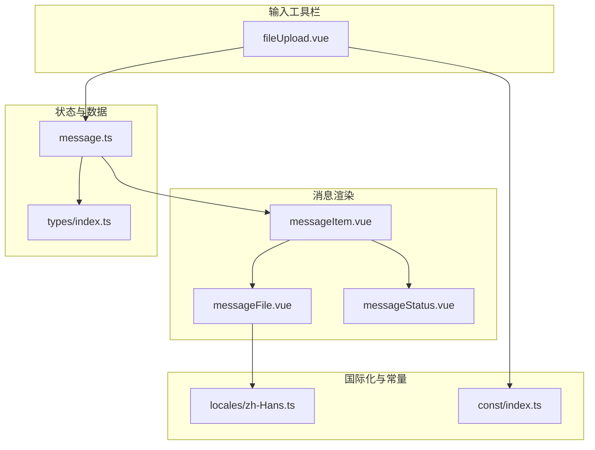
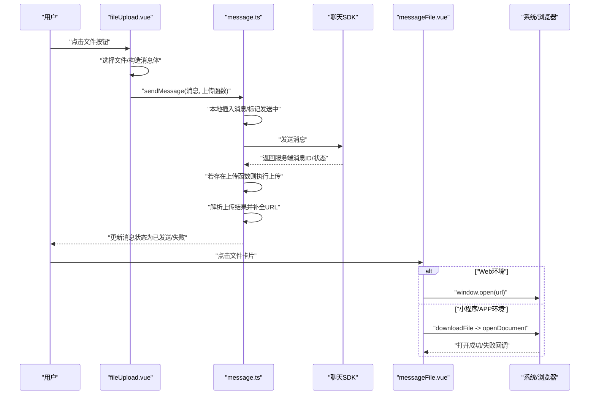
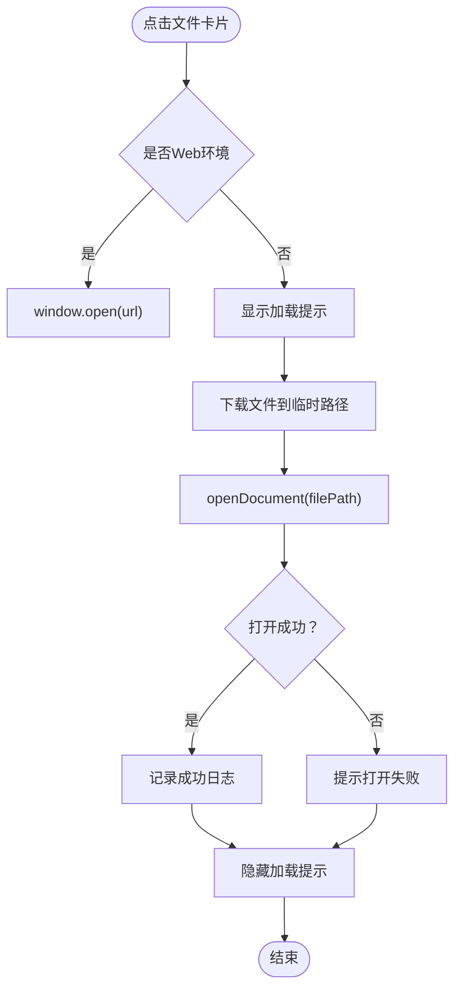
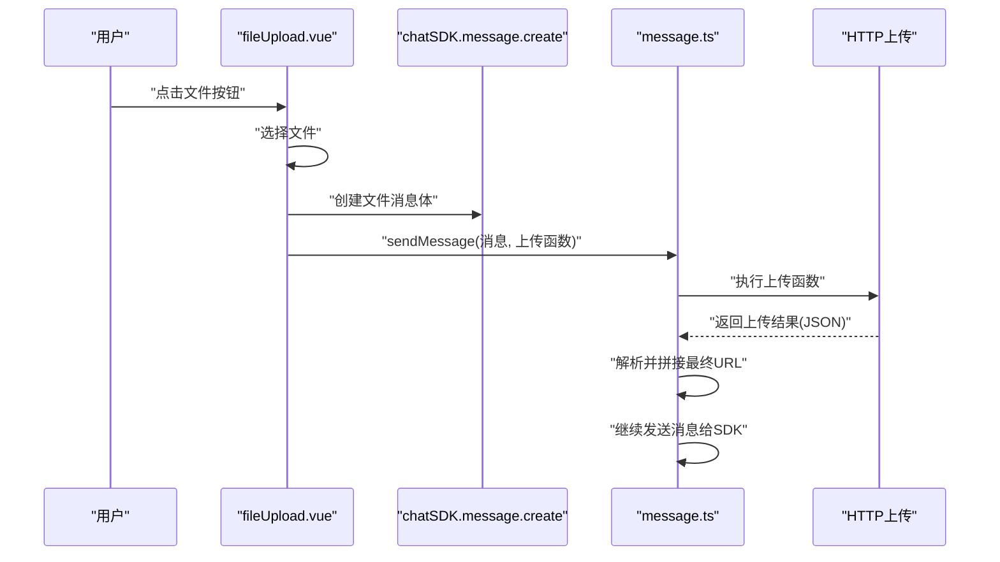
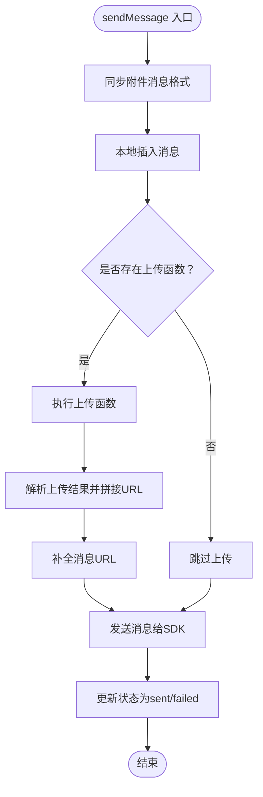
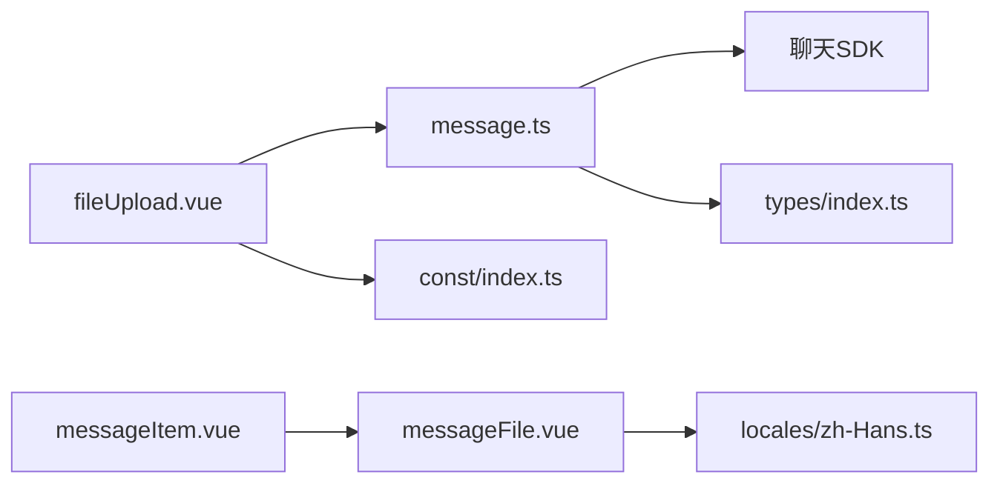

# 文件消息

<cite>
**本文引用的文件**
- [messageFile.vue](file://ChatUIKit/modules/Chat/components/Message/messageFile.vue)
- [fileUpload.vue](file://ChatUIKit/modules/Chat/components/MessageInputToolBar/fileUpload.vue)
- [message.ts](file://ChatUIKit/stores/message.ts)
- [messageItem.vue](file://ChatUIKit/modules/Chat/components/Message/messageItem.vue)
- [messageStatus.vue](file://ChatUIKit/modules/Chat/components/Message/messageStatus.vue)
- [index.ts](file://ChatUIKit/types/index.ts)
- [zh-Hans.ts](file://ChatUIKit/locales/zh-Hans.ts)
- [index.ts](file://ChatUIKit/const/index.ts)
</cite>

## 目录
1. [简介](#简介)
2. [项目结构](#项目结构)
3. [核心组件](#核心组件)
4. [架构总览](#架构总览)
5. [详细组件分析](#详细组件分析)
6. [依赖分析](#依赖分析)
7. [性能考虑](#性能考虑)
8. [故障排查指南](#故障排查指南)
9. [结论](#结论)
10. [附录](#附录)

## 简介
本章节面向“文件消息”能力，系统性阐述从选择文件、上传、发送、到接收方预览与下载的完整流程；同时覆盖文件类型识别、大小限制、格式校验、状态管理、上传进度、错误处理、文件图标与信息展示、下载链接生成、安全检查与访问控制等主题，并对大文件传输、断点续传与存储空间管理提出实践建议。

## 项目结构
文件消息功能主要分布在以下模块：
- 输入工具栏：提供“文件”入口，触发系统或浏览器文件选择器，构造文件消息并调用上传。
- 消息渲染：以卡片形式展示文件名与大小，支持点击预览或下载。
- 状态展示：在发送者侧显示“发送中/已发送/失败”等状态。
- 存储与发送：统一通过消息存储层完成本地落盘、上传回调后补全URL、再向SDK发送。

图表来源
- [fileUpload.vue](file://ChatUIKit/modules/Chat/components/MessageInputToolBar/fileUpload.vue#L31-L95)
- [message.ts](file://ChatUIKit/stores/message.ts#L242-L336)
- [messageItem.vue](file://ChatUIKit/modules/Chat/components/Message/messageItem.vue#L44-L58)
- [messageFile.vue](file://ChatUIKit/modules/Chat/components/Message/messageFile.vue#L31-L76)
- [messageStatus.vue](file://ChatUIKit/modules/Chat/components/Message/messageStatus.vue#L1-L33)
- [zh-Hans.ts](file://ChatUIKit/locales/zh-Hans.ts#L63-L152)
- [index.ts](file://ChatUIKit/const/index.ts#L7-L8)

章节来源
- [fileUpload.vue](file://ChatUIKit/modules/Chat/components/MessageInputToolBar/fileUpload.vue#L1-L104)
- [messageFile.vue](file://ChatUIKit/modules/Chat/components/Message/messageFile.vue#L1-L130)
- [message.ts](file://ChatUIKit/stores/message.ts#L240-L336)
- [messageItem.vue](file://ChatUIKit/modules/Chat/components/Message/messageItem.vue#L1-L264)
- [messageStatus.vue](file://ChatUIKit/modules/Chat/components/Message/messageStatus.vue#L1-L70)
- [index.ts](file://ChatUIKit/types/index.ts#L46-L52)
- [zh-Hans.ts](file://ChatUIKit/locales/zh-Hans.ts#L63-L152)
- [index.ts](file://ChatUIKit/const/index.ts#L7-L8)

## 核心组件
- 文件消息渲染组件：负责展示文件名、大小、图标，并在点击时触发预览或下载。
- 文件上传组件：负责选择文件、构造消息体、调用上传接口并交由消息存储层完成后续流程。
- 消息存储层：统一对消息进行本地落盘、上传回调后补全URL、发送至SDK，并维护消息状态。
- 状态指示组件：在发送者侧显示“发送中/已发送/失败”等状态。
- 类型与状态：统一定义消息状态枚举、混合消息体类型等。

章节来源
- [messageFile.vue](file://ChatUIKit/modules/Chat/components/Message/messageFile.vue#L18-L29)
- [fileUpload.vue](file://ChatUIKit/modules/Chat/components/MessageInputToolBar/fileUpload.vue#L56-L95)
- [message.ts](file://ChatUIKit/stores/message.ts#L242-L336)
- [messageStatus.vue](file://ChatUIKit/modules/Chat/components/Message/messageStatus.vue#L4-L22)
- [index.ts](file://ChatUIKit/types/index.ts#L46-L61)

## 架构总览
下图展示了从选择文件到接收方预览的关键交互路径，以及消息状态流转。

图表来源
- [fileUpload.vue](file://ChatUIKit/modules/Chat/components/MessageInputToolBar/fileUpload.vue#L31-L95)
- [message.ts](file://ChatUIKit/stores/message.ts#L263-L279)
- [messageFile.vue](file://ChatUIKit/modules/Chat/components/Message/messageFile.vue#L31-L76)

## 详细组件分析

### 文件消息渲染组件（messageFile.vue）
- 功能要点
  - 展示文件名与大小（KB），支持左右布局区分发送/接收。
  - 点击触发预览：Web端直接打开URL；移动端/小程序先下载再使用系统文档打开器打开。
  - 图标使用统一资源路径，确保跨平台一致。
- 关键行为
  - 计算文件大小：基于file_length或body.file_length，转换为KB并保留两位小数。
  - 预览逻辑：条件编译区分WEB与非WEB环境；非WEB环境使用下载+打开文档流程，并在失败时提示“打开失败”。

图表来源
- [messageFile.vue](file://ChatUIKit/modules/Chat/components/Message/messageFile.vue#L31-L76)

章节来源
- [messageFile.vue](file://ChatUIKit/modules/Chat/components/Message/messageFile.vue#L18-L29)
- [messageFile.vue](file://ChatUIKit/modules/Chat/components/Message/messageFile.vue#L31-L76)
- [messageFile.vue](file://ChatUIKit/modules/Chat/components/Message/messageFile.vue#L101-L128)

### 文件上传组件（fileUpload.vue）
- 功能要点
  - 调用平台选择器：微信小程序使用wx.chooseMessageFile；H5使用uni.chooseFile。
  - 构造文件消息体：包含文件名、大小、本地路径等。
  - 组装上传参数：目标URL、文件字段名、Authorization头等。
  - 调用消息存储层发送：将消息与上传函数一并提交，等待上传回调后补全URL并继续发送。
- 平台差异
  - 微信小程序：使用原生接口选择文件。
  - H5：使用uni.chooseFile选择文件。
  - 上传：统一使用uni.uploadFile发起HTTP上传。

图表来源
- [fileUpload.vue](file://ChatUIKit/modules/Chat/components/MessageInputToolBar/fileUpload.vue#L31-L95)
- [message.ts](file://ChatUIKit/stores/message.ts#L263-L279)

章节来源
- [fileUpload.vue](file://ChatUIKit/modules/Chat/components/MessageInputToolBar/fileUpload.vue#L31-L54)
- [fileUpload.vue](file://ChatUIKit/modules/Chat/components/MessageInputToolBar/fileUpload.vue#L56-L95)
- [index.ts](file://ChatUIKit/const/index.ts#L7-L8)

### 消息存储层（message.ts）
- 功能要点
  - 同步附件消息格式：针对file/audio/video/img等消息类型，统一映射body中的字段。
  - 插入本地消息：先插入本地，再执行上传（如存在）。
  - 上传回调：解析上传响应，拼接最终URL并写回到消息体（img/file/audio/video）。
  - 发送消息：调用SDK发送；成功后更新本地消息状态为sent，并写入服务端消息ID。
  - 错误处理：捕获异常，更新消息状态为failed。
- 状态管理
  - 定义消息状态枚举：sending/sent/received/read/unread/failed。
  - 发送者侧状态指示：通过messageStatus.vue展示不同状态图标。

图表来源
- [message.ts](file://ChatUIKit/stores/message.ts#L242-L336)
- [messageStatus.vue](file://ChatUIKit/modules/Chat/components/Message/messageStatus.vue#L4-L22)

章节来源
- [message.ts](file://ChatUIKit/stores/message.ts#L242-L336)
- [index.ts](file://ChatUIKit/types/index.ts#L46-L52)
- [messageStatus.vue](file://ChatUIKit/modules/Chat/components/Message/messageStatus.vue#L1-L70)

### 文件消息在消息列表中的集成（messageItem.vue）
- 功能要点
  - 根据消息类型渲染对应子组件，文件消息使用FileMessage。
  - 支持引用消息的气泡展示与跳转。
  - 发送者侧显示消息状态指示（发送中/已发送/失败）。
- 与文件消息的关系
  - 当消息类型为file时，渲染messageFile.vue组件。

章节来源
- [messageItem.vue](file://ChatUIKit/modules/Chat/components/Message/messageItem.vue#L44-L58)
- [messageFile.vue](file://ChatUIKit/modules/Chat/components/Message/messageFile.vue#L1-L130)

### 国际化与本地化（locales/zh-Hans.ts）
- 提供“文件”、“上传失败”、“打开失败”等文案，用于文件消息相关提示。

章节来源
- [zh-Hans.ts](file://ChatUIKit/locales/zh-Hans.ts#L6-L7)
- [zh-Hans.ts](file://ChatUIKit/locales/zh-Hans.ts#L63-L152)

## 依赖分析
- 组件耦合
  - fileUpload.vue依赖连接信息（token、apiUrl）、会话信息、用户信息，以及消息存储层的sendMessage。
  - messageFile.vue依赖消息存储层判断消息来源（是否本人发送），并依赖国际化与日志。
  - message.ts作为核心枢纽，依赖SDK、连接状态、会话状态、消息状态枚举。
- 外部依赖
  - 平台API：微信小程序选择器、uni.uploadFile、uni.downloadFile、uni.openDocument。
  - 资源路径：统一的ASSETS_URL用于图标资源。

图表来源
- [fileUpload.vue](file://ChatUIKit/modules/Chat/components/MessageInputToolBar/fileUpload.vue#L13-L26)
- [message.ts](file://ChatUIKit/stores/message.ts#L240-L336)
- [messageItem.vue](file://ChatUIKit/modules/Chat/components/Message/messageItem.vue#L81-L87)
- [messageFile.vue](file://ChatUIKit/modules/Chat/components/Message/messageFile.vue#L12-L16)
- [index.ts](file://ChatUIKit/const/index.ts#L7-L8)
- [index.ts](file://ChatUIKit/types/index.ts#L46-L52)

章节来源
- [fileUpload.vue](file://ChatUIKit/modules/Chat/components/MessageInputToolBar/fileUpload.vue#L13-L26)
- [message.ts](file://ChatUIKit/stores/message.ts#L240-L336)
- [messageItem.vue](file://ChatUIKit/modules/Chat/components/Message/messageItem.vue#L81-L87)
- [messageFile.vue](file://ChatUIKit/modules/Chat/components/Message/messageFile.vue#L12-L16)
- [index.ts](file://ChatUIKit/const/index.ts#L7-L8)
- [index.ts](file://ChatUIKit/types/index.ts#L46-L52)

## 性能考虑
- 上传并发与队列
  - 建议对多文件上传采用串行或有限并发策略，避免带宽拥塞与服务端限流。
- 进度上报
  - 当前实现未显式上报上传进度；可在上传函数中监听进度并更新消息状态或UI。
- 缓存与复用
  - 已成功上传的文件可缓存其最终URL，避免重复上传。
- 大文件优化
  - 推荐分片上传与断点续传（见“解决方案建议”），以提升稳定性与速度。
- 内存与IO
  - 下载到临时目录后再打开，避免长时间占用内存；打开失败时及时清理临时文件。

## 故障排查指南
- 打开文档失败
  - 现象：移动端/小程序打开文档失败并提示“打开失败”。
  - 可能原因：文件类型不被系统文档打开器支持、下载失败、文件损坏。
  - 处理建议：检查filetype或从文件名推导扩展名；增加重试与失败日志；引导用户更换文件类型或稍后重试。
- 上传失败
  - 现象：消息状态停留在“发送中”或变为“失败”。
  - 可能原因：网络异常、鉴权失败、服务端限制。
  - 处理建议：检查Authorization头、网络状态与服务端返回；在消息存储层捕获异常并更新状态。
- 预览空白或无法定位
  - 现象：Web端打开空白或移动端无法打开。
  - 可能原因：URL失效、权限不足、跨域。
  - 处理建议：确认上传成功且URL有效；检查访问控制策略；必要时生成带有效期的直链。

章节来源
- [messageFile.vue](file://ChatUIKit/modules/Chat/components/Message/messageFile.vue#L52-L60)
- [message.ts](file://ChatUIKit/stores/message.ts#L332-L335)
- [zh-Hans.ts](file://ChatUIKit/locales/zh-Hans.ts#L63-L152)

## 结论
文件消息在当前实现中具备完整的“选择—上传—发送—预览/下载”闭环：输入工具栏负责选择与上传，消息存储层负责状态管理与URL补全，渲染组件负责展示与交互。对于大文件、断点续传与存储空间管理，建议引入分片上传与断点续传机制，并结合服务端策略进行配额与清理。同时完善上传进度上报与失败重试，提升用户体验与系统鲁棒性。

## 附录

### 文件类型识别与格式校验
- 类型识别
  - Web端：优先使用filetype字段；若缺失，则从filename后缀推导。
  - 移动端/小程序：同样优先filetype，否则从后缀推导。
- 格式校验建议
  - 在上传前对文件后缀与MIME进行白名单校验，避免不安全或不受支持的类型。
  - 对图片/视频等媒体文件，可额外校验尺寸与分辨率上限。

章节来源
- [messageFile.vue](file://ChatUIKit/modules/Chat/components/Message/messageFile.vue#L48-L48)

### 大文件传输、断点续传与存储空间管理
- 分片上传与断点续传
  - 将大文件切分为固定大小的块，逐块上传并记录进度；断点续传时仅上传未完成的块。
- 存储空间管理
  - 服务端对单用户/群组/租户设置上传配额；超限时提示并阻断。
  - 定期清理过期或低频访问的文件，释放存储空间。
- 传输优化
  - 使用CDN加速下载；对热点文件进行缓存；在弱网环境下自动降低分片大小。

### 访问控制与安全检查
- 访问控制
  - 上传与下载均需携带有效的Authorization；服务端校验用户身份与会话权限。
  - 对私聊与群聊分别校验成员资格；对只读会话禁止上传。
- 安全检查
  - 上传前进行病毒扫描与敏感内容检测；对高风险文件拒绝上传或隔离。
  - 生成带有效期的直链下载地址，避免长期暴露原始URL。