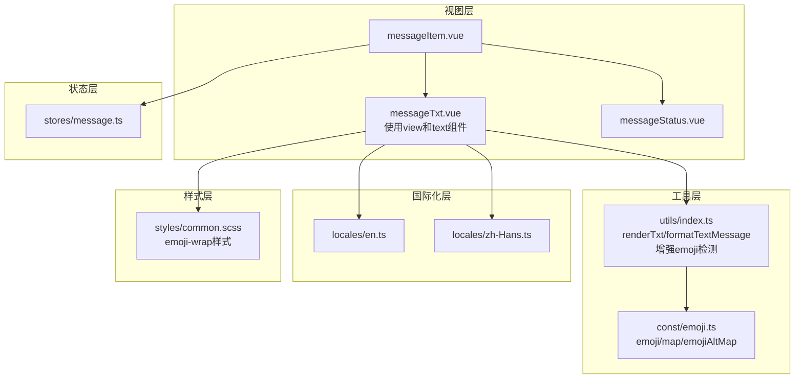
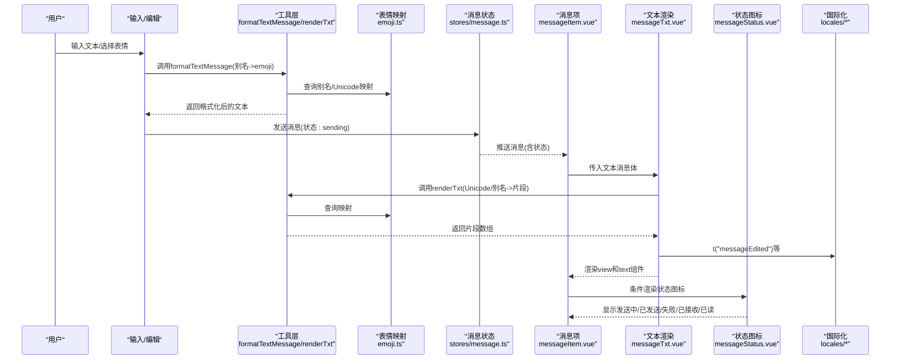
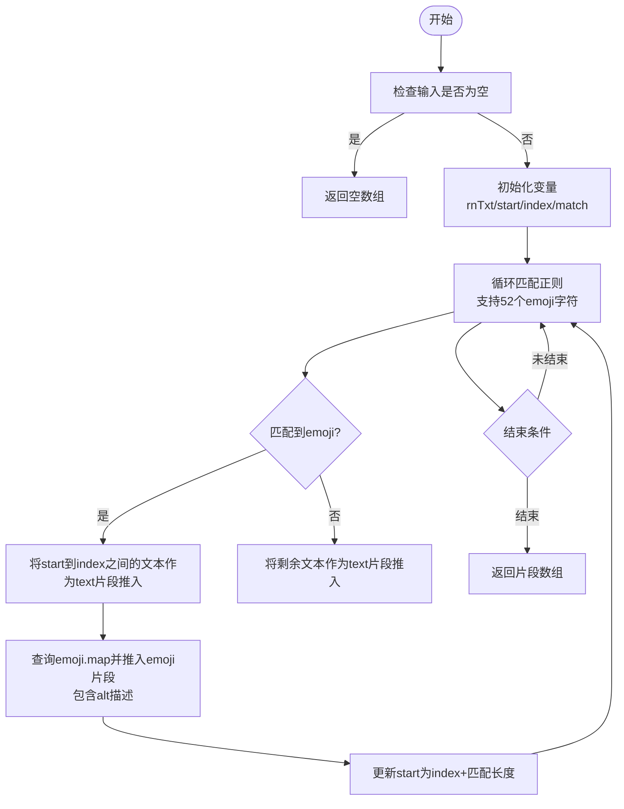
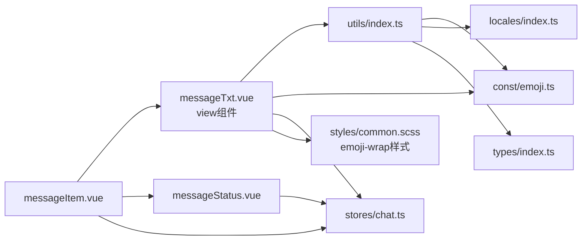

# 文本消息

<cite>
**本文档引用的文件**
- [messageTxt.vue](file://ChatUIKit/modules/Chat/components/Message/messageTxt.vue)
- [index.ts（utils）](file://ChatUIKit/utils/index.ts)
- [emoji.ts](file://ChatUIKit/const/emoji.ts)
- [en.ts（locales）](file://ChatUIKit/locales/en.ts)
- [zh-Hans.ts（locales）](file://ChatUIKit/locales/zh-Hans.ts)
- [message.ts（store）](file://ChatUIKit/stores/message.ts)
- [common.scss](file://ChatUIKit/styles/common.scss)
- [index.ts（types）](file://ChatUIKit/types/index.ts)
- [messageStatus.vue](file://ChatUIKit/modules/Chat/components/Message/messageStatus.vue)
- [messageItem.vue](file://ChatUIKit/modules/Chat/components/Message/messageItem.vue)
- [index.ts（const）](file://ChatUIKit/const/index.ts)
</cite>

## 更新摘要
**变更内容**
- 模板结构从span改为view和text组件，提升跨平台兼容性
- 增强emoji样式和垂直对齐，优化视觉效果
- renderTxt函数增强emoji检测逻辑，支持更多emoji字符
- 改进emoji包装容器样式，提升渲染性能

## 目录
1. [简介](#简介)
2. [项目结构](#项目结构)
3. [核心组件](#核心组件)
4. [架构总览](#架构总览)
5. [组件详细分析](#组件详细分析)
6. [依赖关系分析](#依赖关系分析)
7. [性能与内存优化](#性能与内存优化)
8. [国际化与本地化](#国际化与本地化)
9. [响应式布局与样式](#响应式布局与样式)
10. [故障排查指南](#故障排查指南)
11. [结论](#结论)

## 简介
本章节面向文本消息功能，系统性阐述其渲染机制、表情符号解析、文本格式化与emoji处理逻辑；详解renderTxt工具函数的工作原理、文本分段与特殊字符处理策略；记录文本消息的状态显示（发送中、已发送、失败、已接收、已读）与样式定制；覆盖响应式布局、换行与溢出控制；提供国际化与本地化方案；并给出长文本处理、性能优化与内存管理建议。

**更新** 本次更新优化了文本消息渲染组件的模板结构，从span改为view和text组件，提升了跨平台兼容性和渲染性能，同时增强了emoji样式的垂直对齐效果。

## 项目结构
文本消息功能主要由以下模块协作完成：
- 视图层：messageTxt.vue负责将文本内容渲染为可显示的片段序列（文本与emoji交替），并在需要时显示"已编辑"标记。
- 工具层：utils/index.ts提供renderTxt、formatTextMessage等工具函数，负责文本解析与格式化。
- 资源层：const/emoji.ts提供表情映射与别名映射，支持Unicode与别名两种形式的表情识别。
- 国际化层：locales/en.ts与locales/zh-Hans.ts提供多语言文案，包括"已编辑"等状态提示。
- 状态层：stores/message.ts维护消息状态（发送中、已发送、失败、已接收、已读），messageStatus.vue负责状态图标渲染。
- 样式层：common.scss与组件内样式共同控制文本换行、溢出与emoji尺寸等。

**图表来源**
- [messageTxt.vue](file://ChatUIKit/modules/Chat/components/Message/messageTxt.vue#L1-L74)
- [index.ts（utils）](file://ChatUIKit/utils/index.ts#L226-L265)
- [emoji.ts](file://ChatUIKit/const/emoji.ts#L55-L127)
- [en.ts（locales）](file://ChatUIKit/locales/en.ts#L119-L119)
- [zh-Hans.ts（locales）](file://ChatUIKit/locales/zh-Hans.ts#L119-L119)
- [messageStatus.vue](file://ChatUIKit/modules/Chat/components/Message/messageStatus.vue#L1-L95)
- [messageItem.vue](file://ChatUIKit/modules/Chat/components/Message/messageItem.vue#L1-L200)
- [common.scss](file://ChatUIKit/styles/common.scss#L1-L18)

**章节来源**
- [messageTxt.vue](file://ChatUIKit/modules/Chat/components/Message/messageTxt.vue#L1-L74)
- [index.ts（utils）](file://ChatUIKit/utils/index.ts#L226-L265)
- [emoji.ts](file://ChatUIKit/const/emoji.ts#L55-L127)
- [en.ts（locales）](file://ChatUIKit/locales/en.ts#L119-L119)
- [zh-Hans.ts（locales）](file://ChatUIKit/locales/zh-Hans.ts#L119-L119)
- [messageStatus.vue](file://ChatUIKit/modules/Chat/components/Message/messageStatus.vue#L1-L95)
- [messageItem.vue](file://ChatUIKit/modules/Chat/components/Message/messageItem.vue#L1-L200)
- [common.scss](file://ChatUIKit/styles/common.scss#L1-L18)

## 核心组件
- 文本消息渲染组件：messageTxt.vue
  - 接收文本消息体，通过renderTxt将其拆分为文本片段与emoji片段，分别渲染。
  - 若消息带有修改信息，则显示"已编辑"标签。
  - 判断消息是否来自当前用户，以决定样式类名。
  - **更新** 使用view和text组件替代span，提升跨平台兼容性。
- 工具函数：utils/index.ts
  - renderTxt：基于正则表达式扫描文本，识别Unicode与别名两种形式的emoji，输出统一的片段数组。
  - **更新** 增强emoji检测逻辑，支持更多emoji字符，正则表达式包含52个常用emoji。
  - formatTextMessage：将输入文本中的别名形式（如[哈哈]）转换为对应emoji字符，便于发送。
- 表情映射：const/emoji.ts
  - 提供emoji.map（Unicode/别名到图片资源与alt描述）、emojiAltMap（别名到Unicode）。
- 状态显示：messageStatus.vue
  - 根据消息状态渲染不同图标（发送中、已发送、失败、已接收、已读）。
- 状态管理：stores/message.ts
  - 维护消息状态流转，支持更新消息状态、修改消息、撤回消息等。
- 国际化：locales/en.ts、locales/zh-Hans.ts
  - 提供"已编辑"等文案键值，messageTxt.vue通过t函数进行本地化显示。

**章节来源**
- [messageTxt.vue](file://ChatUIKit/modules/Chat/components/Message/messageTxt.vue#L22-L44)
- [index.ts（utils）](file://ChatUIKit/utils/index.ts#L226-L265)
- [emoji.ts](file://ChatUIKit/const/emoji.ts#L55-L127)
- [messageStatus.vue](file://ChatUIKit/modules/Chat/components/Message/messageStatus.vue#L1-L95)
- [message.ts（store）](file://ChatUIKit/stores/message.ts#L519-L533)
- [en.ts（locales）](file://ChatUIKit/locales/en.ts#L119-L119)
- [zh-Hans.ts（locales）](file://ChatUIKit/locales/zh-Hans.ts#L119-L119)

## 架构总览
文本消息从"输入/接收"到"渲染/显示"的整体流程如下：

**图表来源**
- [messageItem.vue](file://ChatUIKit/modules/Chat/components/Message/messageItem.vue#L41-L59)
- [messageTxt.vue](file://ChatUIKit/modules/Chat/components/Message/messageTxt.vue#L37-L39)
- [index.ts（utils）](file://ChatUIKit/utils/index.ts#L200-L224)
- [index.ts（utils）](file://ChatUIKit/utils/index.ts#L226-L265)
- [emoji.ts](file://ChatUIKit/const/emoji.ts#L55-L127)
- [messageStatus.vue](file://ChatUIKit/modules/Chat/components/Message/messageStatus.vue#L1-L95)
- [en.ts（locales）](file://ChatUIKit/locales/en.ts#L119-L119)
- [zh-Hans.ts（locales）](file://ChatUIKit/locales/zh-Hans.ts#L119-L119)

## 组件详细分析

### 文本消息渲染组件 messageTxt.vue
- 数据来源
  - props.msg：文本消息体，包含原始文本msg与可能的修改信息modifiedInfo。
  - 通过computed计算data，调用renderTxt对msg进行解析。
- 渲染逻辑
  - **更新** 使用view容器替代span，提供更好的跨平台兼容性。
  - 遍历data中的每个片段，若type为text则渲染为纯文本，否则渲染为emoji图片。
  - **更新** 为非文本片段添加emoji-wrap类，支持垂直居中对齐。
  - 若消息带修改信息，则显示"已编辑"标签，且根据是否来自当前用户应用不同的样式类。
- 关键点
  - isSelf用于区分"我方"与"他人"消息，影响编辑标记的颜色等样式。
  - 本地化文案通过t函数从locales中取值。
  - **更新** 增加emoji-wrap样式类，支持vertical-align: middle实现垂直居中。

**章节来源**
- [messageTxt.vue](file://ChatUIKit/modules/Chat/components/Message/messageTxt.vue#L1-L74)

### 工具函数 renderTxt 与 formatTextMessage
- renderTxt
  - 输入：字符串（可能为undefined/null）。
  - 输出：片段数组，每个元素包含type（text或emoji）与value（文本或图片路径）。
  - **更新** 增强正则表达式，支持52个常用emoji字符，包括各种表情符号。
  - 分段策略：遇到匹配到的emoji时，将之前的文本作为type=text片段推入结果，再将emoji作为type=emoji片段推入，最后追加剩余文本。
- formatTextMessage
  - 输入：原始文本（可能包含别名，如[哈哈]）。
  - 输出：将别名替换为对应emoji字符，便于发送。
  - 匹配策略：使用正则匹配[...]，在emojiAltMap中查找对应Unicode，找不到则保留原别名。

**图表来源**
- [index.ts（utils）](file://ChatUIKit/utils/index.ts#L226-L265)

**章节来源**
- [index.ts（utils）](file://ChatUIKit/utils/index.ts#L226-L265)
- [index.ts（utils）](file://ChatUIKit/utils/index.ts#L200-L224)

### 表情映射与别名处理
- emoji.map：Unicode/别名到图片资源与alt描述的映射。
- emojiAltMap：别名到Unicode的反向映射，用于formatTextMessage。
- emojiList：从map生成的列表，可用于表情选择器等场景。

**章节来源**
- [emoji.ts](file://ChatUIKit/const/emoji.ts#L55-L127)

### 文本消息状态显示与样式
- 状态来源：stores/message.ts维护消息状态（sending/sent/received/read/failed），messageStatus.vue根据状态渲染不同图标。
- messageTxt.vue中"已编辑"标记仅在消息带修改信息时显示，颜色样式通过isSelf切换。
- messageItem.vue根据消息类型与方向（我方/他人）设置气泡背景与对齐方式。

**章节来源**
- [messageStatus.vue](file://ChatUIKit/modules/Chat/components/Message/messageStatus.vue#L1-L95)
- [message.ts（store）](file://ChatUIKit/stores/message.ts#L519-L533)
- [messageTxt.vue](file://ChatUIKit/modules/Chat/components/Message/messageTxt.vue#L13-L18)
- [messageItem.vue](file://ChatUIKit/modules/Chat/components/Message/messageItem.vue#L118-L134)

### 文本消息的国际化与本地化
- "已编辑"文案键值messageEdited在locales/en.ts与locales/zh-Hans.ts中均有定义。
- messageTxt.vue通过t函数获取当前语言下的文案，保证多语言一致性。

**章节来源**
- [en.ts（locales）](file://ChatUIKit/locales/en.ts#L119-L119)
- [zh-Hans.ts（locales）](file://ChatUIKit/locales/zh-Hans.ts#L119-L119)
- [messageTxt.vue](file://ChatUIKit/modules/Chat/components/Message/messageTxt.vue#L17-L17)

## 依赖关系分析
- messageTxt.vue依赖：
  - utils/index.ts：renderTxt、t（国际化）
  - const/emoji.ts：emoji.map、emojiAltMap（用于渲染与格式化）
  - stores/chat.ts：useConnStore判断消息来源（isSelf）
  - styles/common.scss：公共样式（如.ellipsis、.msg-emoji、.emoji-wrap）
- utils/index.ts依赖：
  - const/emoji.ts：emoji.map、emojiAltMap
  - locales/index.ts：t函数（国际化）
  - types/index.ts：MixedMessageBody等类型
- stores/message.ts：
  - 维护消息状态，提供更新状态、修改消息、撤回消息等动作。

**图表来源**
- [messageTxt.vue](file://ChatUIKit/modules/Chat/components/Message/messageTxt.vue#L22-L28)
- [index.ts（utils）](file://ChatUIKit/utils/index.ts#L1-L5)
- [emoji.ts](file://ChatUIKit/const/emoji.ts#L1-L2)
- [common.scss](file://ChatUIKit/styles/common.scss#L14-L17)
- [messageStatus.vue](file://ChatUIKit/modules/Chat/components/Message/messageStatus.vue#L1-L33)
- [messageItem.vue](file://ChatUIKit/modules/Chat/components/Message/messageItem.vue#L74-L89)

**章节来源**
- [messageTxt.vue](file://ChatUIKit/modules/Chat/components/Message/messageTxt.vue#L22-L28)
- [index.ts（utils）](file://ChatUIKit/utils/index.ts#L1-L5)
- [emoji.ts](file://ChatUIKit/const/emoji.ts#L1-L2)
- [common.scss](file://ChatUIKit/styles/common.scss#L14-L17)
- [messageStatus.vue](file://ChatUIKit/modules/Chat/components/Message/messageStatus.vue#L1-L33)
- [messageItem.vue](file://ChatUIKit/modules/Chat/components/Message/messageItem.vue#L74-L89)

## 性能与内存优化
- 渲染性能
  - renderTxt采用单次正则扫描与线性遍历，时间复杂度O(n)，n为文本长度；对长文本仍具备良好性能。
  - **更新** 增强的emoji检测逻辑支持更多字符，但保持相同的算法复杂度。
  - 对于超长文本，建议在上层进行分段或节流渲染，避免一次性渲染过多DOM节点。
  - **更新** 使用view组件替代span，提升跨平台渲染性能。
- 内存管理
  - utils/index.ts中的renderTxt返回片段数组，生命周期由Vue响应式系统管理；注意避免在组件外长期持有大量片段引用。
  - stores/message.ts对会话消息数量有限制（MAX_MESSAGES_PER_CONVERSATION），超出后自动清理，防止内存膨胀。
- 传输与格式化
  - formatTextMessage在发送前将别名转换为emoji字符，减少服务端解析成本。
- 图片资源
  - emoji图片资源通过const/emoji.ts集中导入，打包时可被tree-shaking优化；建议按需加载或懒加载。

**章节来源**
- [index.ts（utils）](file://ChatUIKit/utils/index.ts#L226-L265)
- [index.ts（utils）](file://ChatUIKit/utils/index.ts#L200-L224)
- [index.ts（const）](file://ChatUIKit/const/index.ts#L14-L15)
- [message.ts（store）](file://ChatUIKit/stores/message.ts#L597-L609)

## 国际化与本地化
- 文案键值
  - messageEdited：用于"已编辑"标记的本地化文案。
- 多语言支持
  - en.ts与zh-Hans.ts均提供messageEdited键值，messageTxt.vue通过t函数动态获取当前语言文案。
- 建议
  - 如需扩展更多文案键值（如"编辑中"、"已撤回"等），可在locales/*中新增键值并在组件中统一使用t函数。

**章节来源**
- [en.ts（locales）](file://ChatUIKit/locales/en.ts#L119-L119)
- [zh-Hans.ts（locales）](file://ChatUIKit/locales/zh-Hans.ts#L119-L119)
- [messageTxt.vue](file://ChatUIKit/modules/Chat/components/Message/messageTxt.vue#L17-L17)

## 响应式布局与样式
- 文本容器
  - messageTxt.vue的.msg-text使用word-break: break-all、word-wrap: break-word、white-space: break-spaces，确保长单词与长文本正确换行。
  - overflow-y: auto允许内容溢出时出现滚动。
  - **更新** 使用view组件替代span，提升跨平台兼容性。
- Emoji尺寸
  - styles/common.scss定义.msg-emoji宽高为20px，保持统一视觉比例。
  - **更新** 增加.emoji-wrap样式类，支持vertical-align: middle实现垂直居中对齐。
- 编辑标记
  - .msg-edited-tag设置字号、行高与右对齐，margin-top提供与正文的间距。
  - .self类用于区分"我方"消息的编辑标记颜色。
- 方向与对齐
  - messageItem.vue根据isSelf切换flexDirection与text-align，使"我方"消息右对齐，"他人"消息左对齐。

**章节来源**
- [messageTxt.vue](file://ChatUIKit/modules/Chat/components/Message/messageTxt.vue#L53-L72)
- [common.scss](file://ChatUIKit/styles/common.scss#L14-L17)
- [messageItem.vue](file://ChatUIKit/modules/Chat/components/Message/messageItem.vue#L118-L120)

## 故障排查指南
- 表情未显示
  - 检查renderTxt是否正确识别emoji（Unicode或别名），确认emoji.map与emojiAltMap是否包含对应键。
  - **更新** 确认messageTxt.vue中v-if/else分支是否正确渲染emoji图片，特别是emoji-wrap类的应用。
- 文本渲染异常
  - 若文本中包含特殊字符或不可见字符，建议在发送前通过formatTextMessage进行预处理。
  - 长文本导致渲染卡顿，考虑分段渲染或限制单次渲染片段数量。
  - **更新** 检查view组件的渲染性能，确保跨平台兼容性。
- 状态图标不显示
  - 确认消息状态已在stores/message.ts中更新，messageStatus.vue是否被messageItem.vue条件渲染。
- "已编辑"标记不出现
  - 确认消息体是否包含modifiedInfo，以及t函数是否能正确解析messageEdited键值。
- **更新** 垂直对齐问题
  - 检查emoji-wrap类是否正确应用，确保vertical-align: middle生效。
  - 确认.msg-emoji样式是否正确应用到emoji图片。

**章节来源**
- [index.ts（utils）](file://ChatUIKit/utils/index.ts#L226-L265)
- [emoji.ts](file://ChatUIKit/const/emoji.ts#L55-L127)
- [messageStatus.vue](file://ChatUIKit/modules/Chat/components/Message/messageStatus.vue#L1-L95)
- [message.ts（store）](file://ChatUIKit/stores/message.ts#L519-L533)
- [messageTxt.vue](file://ChatUIKit/modules/Chat/components/Message/messageTxt.vue#L13-L18)

## 结论
文本消息功能通过renderTxt实现高效的文本与emoji混合渲染，配合formatTextMessage完成输入期的表情别名转换；借助stores/message.ts的状态管理与messageStatus.vue的图标渲染，形成完整的消息生命周期可视化；在样式层面，通过break-spaces与emoji尺寸控制实现良好的可读性与一致性；国际化方面，messageTxt.vue通过t函数统一获取本地化文案。

**更新** 本次更新优化了模板结构，从span改为view和text组件，提升了跨平台兼容性和渲染性能；增强了emoji样式系统，通过emoji-wrap类和vertical-align: middle实现了更好的垂直对齐效果；renderTxt函数支持更多emoji字符，提升了表情符号的识别能力。针对长文本与性能问题，建议结合分段渲染与内存清理策略，确保在移动端与小程序环境下稳定运行。