# 消息类型系统

<cite>
**本文档引用的文件**
- [ChatUIKit/modules/Chat/index.vue](file://ChatUIKit/modules/Chat/index.vue)
- [ChatUIKit/stores/message.ts](file://ChatUIKit/stores/message.ts)
- [ChatUIKit/types/index.ts](file://ChatUIKit/types/index.ts)
- [ChatUIKit/modules/Chat/components/Message/messageItem.vue](file://ChatUIKit/modules/Chat/components/Message/messageItem.vue)
- [ChatUIKit/modules/Chat/components/Message/messageList.vue](file://ChatUIKit/modules/Chat/components/Message/messageList.vue)
- [ChatUIKit/modules/Chat/components/Message/messageTxt.vue](file://ChatUIKit/modules/Chat/components/Message/messageTxt.vue)
- [ChatUIKit/modules/Chat/components/Message/messageImage.vue](file://ChatUIKit/modules/Chat/components/Message/messageImage.vue)
- [ChatUIKit/modules/Chat/components/Message/messageAudio.vue](file://ChatUIKit/modules/Chat/components/Message/messageAudio.vue)
- [ChatUIKit/modules/Chat/components/Message/messageVideo.vue](file://ChatUIKit/modules/Chat/components/Message/messageVideo.vue)
- [ChatUIKit/modules/Chat/components/Message/messageFile.vue](file://ChatUIKit/modules/Chat/components/Message/messageFile.vue)
- [ChatUIKit/modules/Chat/components/Message/messageUserCard.vue](file://ChatUIKit/modules/Chat/components/Message/messageUserCard.vue)
- [ChatUIKit/modules/Chat/components/Message/messageQuote.vue](file://ChatUIKit/modules/Chat/components/Message/messageQuote.vue)
- [ChatUIKit/modules/Chat/components/Message/messageQuotePanel.vue](file://ChatUIKit/modules/Chat/components/Message/messageQuotePanel.vue)
- [ChatUIKit/modules/Chat/components/MessageInputToolBar/emojiPicker.vue](file://ChatUIKit/modules/Chat/components/MessageInputToolBar/emojiPicker.vue)
- [ChatUIKit/modules/Chat/components/MessageMentionList/index.vue](file://ChatUIKit/modules/Chat/components/MessageMentionList/index.vue)
- [ChatUIKit/const/emoji.ts](file://ChatUIKit/const/emoji.ts)
- [ChatUIKit/utils/index.ts](file://ChatUIKit/utils/index.ts)
</cite>

## 更新摘要
**所做更改**
- 更新表情包渲染机制部分，反映renderTxt工具函数的增强和emojiAltMap映射优化
- 新增表情包渲染性能优化说明
- 完善表情包映射机制的技术细节
- 更新表情包选择器与渲染系统的集成方式

## 目录
1. [引言](#引言)
2. [项目结构](#项目结构)
3. [核心组件](#核心组件)
4. [架构总览](#架构总览)
5. [详细组件分析](#详细组件分析)
6. [依赖关系分析](#依赖关系分析)
7. [性能考虑](#性能考虑)
8. [故障排查指南](#故障排查指南)
9. [结论](#结论)
10. [附录](#附录)

## 引言
本文件系统性梳理消息类型系统的实现与交互机制，覆盖文本、图片、音频、视频、文件、名片等消息类型的渲染与处理；解释消息格式解析、多媒体内容处理与预览机制；说明消息状态管理、发送接收流程与错误处理；涵盖消息引用回复、@提及与表情包支持；并提供扩展机制与自定义消息类型的开发指南，以及大文件传输、多媒体格式兼容性与性能优化建议。

## 项目结构
消息系统围绕"聊天页面"组织，核心由以下层次构成：
- 页面容器：聊天页负责会话上下文、输入工具栏、表情选择器、@提及列表、引用面板等
- 消息列表：负责历史消息加载、滚动定位、闪烁高亮与通知消息渲染
- 消息项：统一入口，按消息类型分发到具体渲染组件
- 具体消息组件：文本、图片、音频、视频、文件、名片等
- 状态管理：消息Store集中管理会话消息、播放状态、引用与编辑状态
- 工具与常量：文本解析、表情映射、时间格式化、常量配置

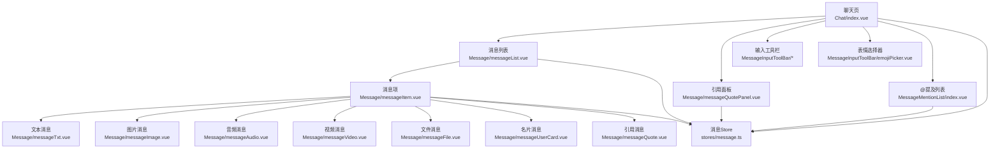

**图表来源**
- [ChatUIKit/modules/Chat/index.vue](file://ChatUIKit/modules/Chat/index.vue#L1-L255)
- [ChatUIKit/modules/Chat/components/Message/messageList.vue](file://ChatUIKit/modules/Chat/components/Message/messageList.vue#L1-L282)
- [ChatUIKit/modules/Chat/components/Message/messageItem.vue](file://ChatUIKit/modules/Chat/components/Message/messageItem.vue#L1-L264)
- [ChatUIKit/stores/message.ts](file://ChatUIKit/stores/message.ts#L1-L688)

**章节来源**
- [ChatUIKit/modules/Chat/index.vue](file://ChatUIKit/modules/Chat/index.vue#L1-L255)
- [ChatUIKit/modules/Chat/components/Message/messageList.vue](file://ChatUIKit/modules/Chat/components/Message/messageList.vue#L1-L282)

## 核心组件
- 聊天页容器：承载会话上下文、输入区、工具栏、表情与@提及弹窗、引用面板，并通过Provide/Inject向子组件传递事件回调
- 消息Store：集中管理会话消息、历史加载、发送/接收/撤回/删除、状态更新、播放音频消息ID、引用与编辑状态
- 消息列表：负责首次加载、分页加载历史、滚动到底部、闪烁高亮、通知消息渲染
- 消息项：统一渲染入口，按消息类型分发到对应组件，处理长按菜单、时间显示、引用气泡
- 具体消息组件：文本、图片、音频、视频、文件、名片的渲染与交互
- 引用与@提及：引用面板与引用气泡联动；@提及列表支持全体与单人@，并生成提及占位符
- 表情包：表情选择器提供九宫格展示与插入，支持表情别名与Unicode的高效映射

**章节来源**
- [ChatUIKit/modules/Chat/index.vue](file://ChatUIKit/modules/Chat/index.vue#L74-L250)
- [ChatUIKit/stores/message.ts](file://ChatUIKit/stores/message.ts#L41-L688)
- [ChatUIKit/modules/Chat/components/Message/messageList.vue](file://ChatUIKit/modules/Chat/components/Message/messageList.vue#L52-L200)
- [ChatUIKit/modules/Chat/components/Message/messageItem.vue](file://ChatUIKit/modules/Chat/components/Message/messageItem.vue#L74-L181)

## 架构总览
消息系统采用"页面容器 + 列表 + 项 + 组件 + Store"的分层设计，消息Store作为数据中枢，页面与组件通过Pinia进行状态读写与事件交互。

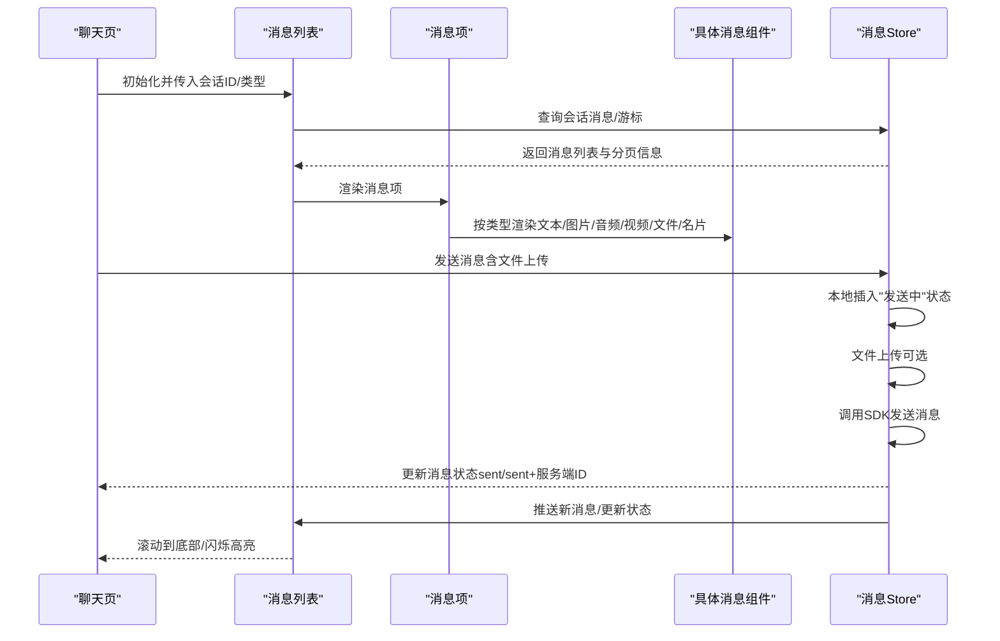

**图表来源**
- [ChatUIKit/modules/Chat/index.vue](file://ChatUIKit/modules/Chat/index.vue#L306-L427)
- [ChatUIKit/stores/message.ts](file://ChatUIKit/stores/message.ts#L210-L427)
- [ChatUIKit/modules/Chat/components/Message/messageList.vue](file://ChatUIKit/modules/Chat/components/Message/messageList.vue#L116-L177)

## 详细组件分析

### 文本消息
- 解析与渲染：将文本中的表情别名转换为Unicode或图片URL，逐段渲染，支持表情与文本混合
- 编辑标识：若消息被修改，显示"已编辑"标签
- 适配样式：左/右对齐、气泡背景、最大宽度限制

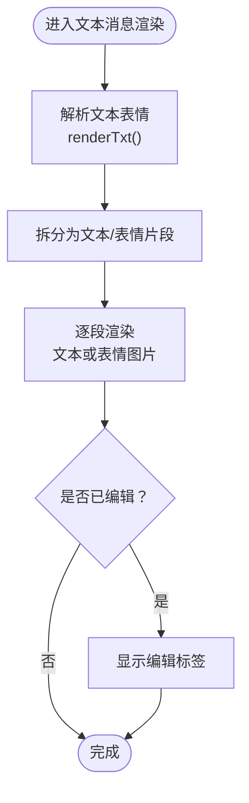

**图表来源**
- [ChatUIKit/modules/Chat/components/Message/messageTxt.vue](file://ChatUIKit/modules/Chat/components/Message/messageTxt.vue#L22-L74)
- [ChatUIKit/utils/index.ts](file://ChatUIKit/utils/index.ts#L226-L265)

**章节来源**
- [ChatUIKit/modules/Chat/components/Message/messageTxt.vue](file://ChatUIKit/modules/Chat/components/Message/messageTxt.vue#L1-L74)
- [ChatUIKit/utils/index.ts](file://ChatUIKit/utils/index.ts#L226-L265)

### 图片消息
- 渲染策略：优先缩略图thumb，加载失败回退至原图url；支持点击预览
- 尺寸适配：根据原始宽高计算最大尺寸，保证最佳显示效果
- 错误处理：加载失败显示占位图

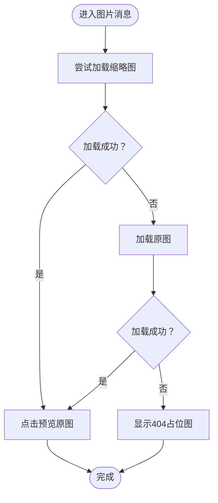

**图表来源**
- [ChatUIKit/modules/Chat/components/Message/messageImage.vue](file://ChatUIKit/modules/Chat/components/Message/messageImage.vue#L15-L84)

**章节来源**
- [ChatUIKit/modules/Chat/components/Message/messageImage.vue](file://ChatUIKit/modules/Chat/components/Message/messageImage.vue#L1-L84)

### 音频消息
- 播放控制：根据消息方向切换不同图标；播放/暂停受Store中当前播放ID控制
- 下载与格式：下载时携带鉴权头，必要时转码为MP3；播放前初始化InnerAudioContext并绑定事件
- 平台差异：小程序下禁用系统静音开关影响

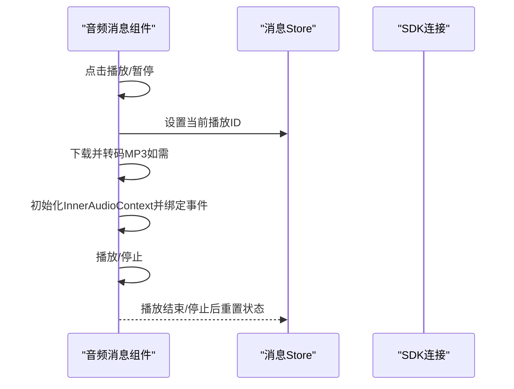

**图表来源**
- [ChatUIKit/modules/Chat/components/Message/messageAudio.vue](file://ChatUIKit/modules/Chat/components/Message/messageAudio.vue#L32-L194)
- [ChatUIKit/stores/message.ts](file://ChatUIKit/stores/message.ts#L649-L651)

**章节来源**
- [ChatUIKit/modules/Chat/components/Message/messageAudio.vue](file://ChatUIKit/modules/Chat/components/Message/messageAudio.vue#L1-L194)
- [ChatUIKit/stores/message.ts](file://ChatUIKit/stores/message.ts#L591-L651)

### 视频消息
- 封面渲染：优先thumb，加载失败显示占位图；居中播放按钮
- 预览机制：点击播放按钮跳转到视频预览页（独立路由）

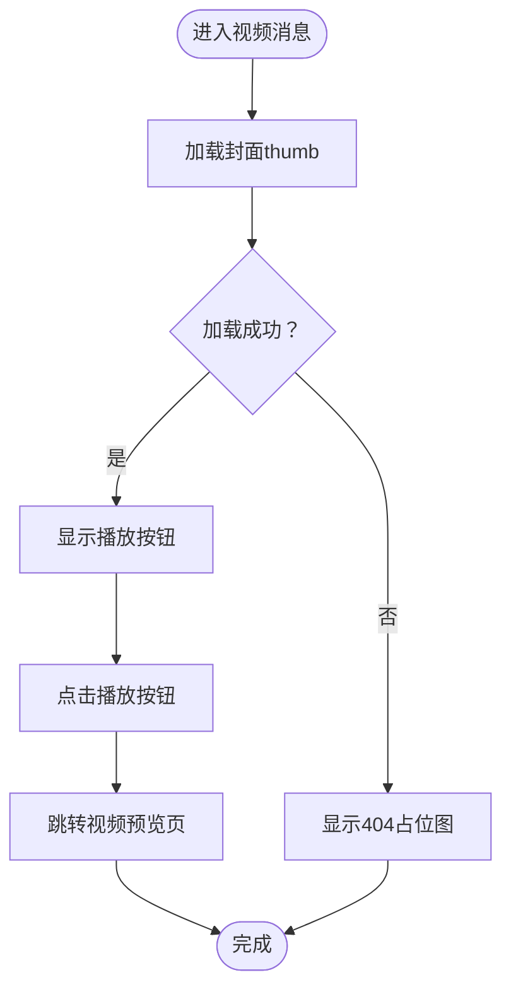

**图表来源**
- [ChatUIKit/modules/Chat/components/Message/messageVideo.vue](file://ChatUIKit/modules/Chat/components/Message/messageVideo.vue#L23-L109)

**章节来源**
- [ChatUIKit/modules/Chat/components/Message/messageVideo.vue](file://ChatUIKit/modules/Chat/components/Message/messageVideo.vue#L1-L109)

### 文件消息
- 展示：文件名与大小（KB），左右布局区分发送方
- 预览：WEB端直接打开；移动端下载后调用系统文档打开，失败提示

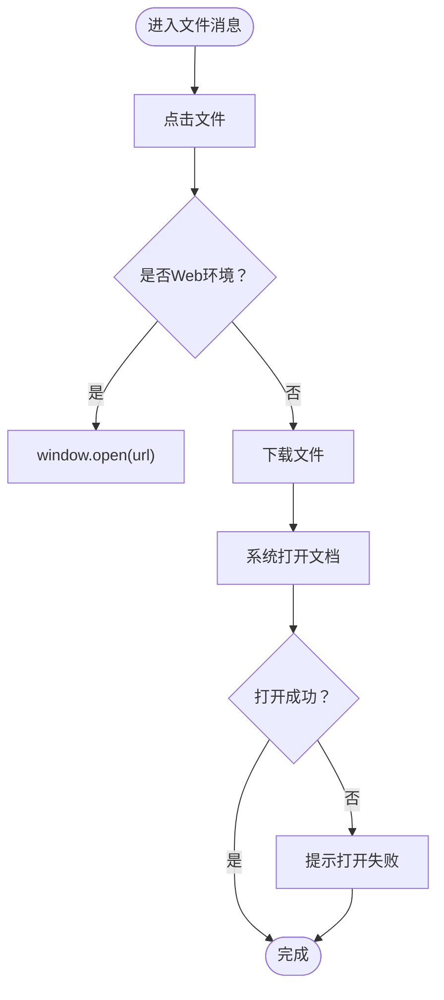

**图表来源**
- [ChatUIKit/modules/Chat/components/Message/messageFile.vue](file://ChatUIKit/modules/Chat/components/Message/messageFile.vue#L11-L130)

**章节来源**
- [ChatUIKit/modules/Chat/components/Message/messageFile.vue](file://ChatUIKit/modules/Chat/components/Message/messageFile.vue#L1-L130)

### 名片消息（custom）
- 结构：通过customEvent=userCard识别名片；customExts包含目标用户头像、昵称、UID
- 渲染：头像+昵称+标签，区分发送方样式

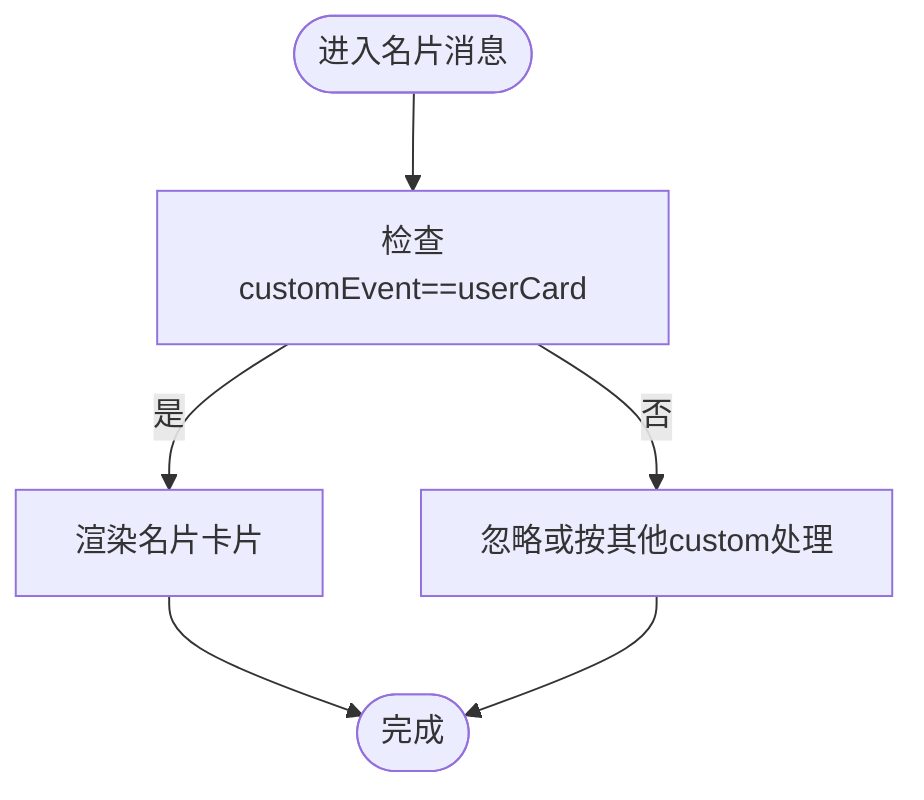

**图表来源**
- [ChatUIKit/modules/Chat/components/Message/messageUserCard.vue](file://ChatUIKit/modules/Chat/components/Message/messageUserCard.vue#L16-L80)
- [ChatUIKit/modules/Chat/index.vue](file://ChatUIKit/modules/Chat/index.vue#L190-L209)

**章节来源**
- [ChatUIKit/modules/Chat/components/Message/messageUserCard.vue](file://ChatUIKit/modules/Chat/components/Message/messageUserCard.vue#L1-L80)
- [ChatUIKit/modules/Chat/index.vue](file://ChatUIKit/modules/Chat/index.vue#L190-L209)

### 引用回复
- 引用面板：顶部显示当前引用消息摘要，支持取消
- 引用气泡：消息内嵌引用气泡，支持点击跳转到被引用消息
- 数据来源：引用消息可来自Store中的quoteMessage或通过msgId查询

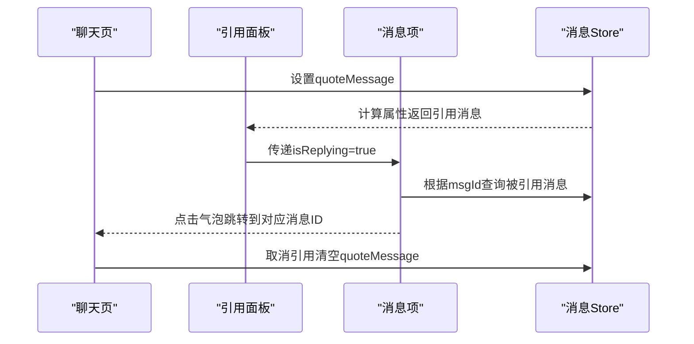

**图表来源**
- [ChatUIKit/modules/Chat/components/Message/messageQuotePanel.vue](file://ChatUIKit/modules/Chat/components/Message/messageQuotePanel.vue#L10-L26)
- [ChatUIKit/modules/Chat/components/Message/messageQuote.vue](file://ChatUIKit/modules/Chat/components/Message/messageQuote.vue#L45-L104)
- [ChatUIKit/modules/Chat/components/Message/messageItem.vue](file://ChatUIKit/modules/Chat/components/Message/messageItem.vue#L19-L28)

**章节来源**
- [ChatUIKit/modules/Chat/components/Message/messageQuotePanel.vue](file://ChatUIKit/modules/Chat/components/Message/messageQuotePanel.vue#L1-L55)
- [ChatUIKit/modules/Chat/components/Message/messageQuote.vue](file://ChatUIKit/modules/Chat/components/Message/messageQuote.vue#L1-L169)
- [ChatUIKit/modules/Chat/components/Message/messageItem.vue](file://ChatUIKit/modules/Chat/components/Message/messageItem.vue#L1-L72)

### @提及
- @列表：弹窗展示群成员，支持"@全部"与单人@；过滤当前用户自身
- 插入逻辑：聊天输入框追加@占位符与用户昵称，同时记录被@用户ID集合

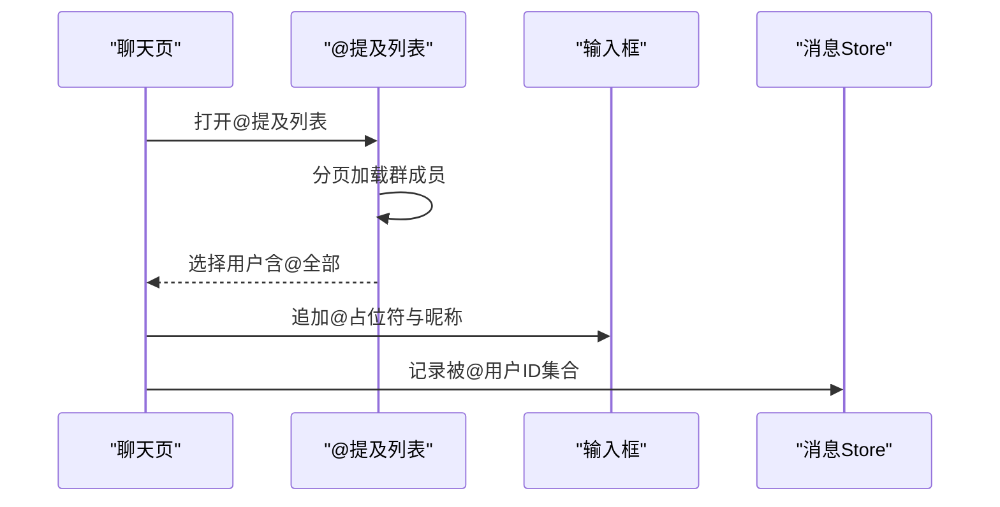

**图表来源**
- [ChatUIKit/modules/Chat/components/MessageMentionList/index.vue](file://ChatUIKit/modules/Chat/components/MessageMentionList/index.vue#L42-L112)
- [ChatUIKit/modules/Chat/index.vue](file://ChatUIKit/modules/Chat/index.vue#L160-L183)
- [ChatUIKit/const/index.ts](file://ChatUIKit/const/index.ts#L5-L6)

**章节来源**
- [ChatUIKit/modules/Chat/components/MessageMentionList/index.vue](file://ChatUIKit/modules/Chat/components/MessageMentionList/index.vue#L1-L158)
- [ChatUIKit/modules/Chat/index.vue](file://ChatUIKit/modules/Chat/index.vue#L160-L183)
- [ChatUIKit/const/index.ts](file://ChatUIKit/const/index.ts#L5-L6)

### 表情包
- 表情选择器：九宫格展示，点击插入表情别名
- 文本渲染：渲染阶段将表情别名转换为图片或Unicode
- **更新** 表情包渲染机制改进：采用优化的正则表达式匹配和映射机制，提升渲染性能和一致性

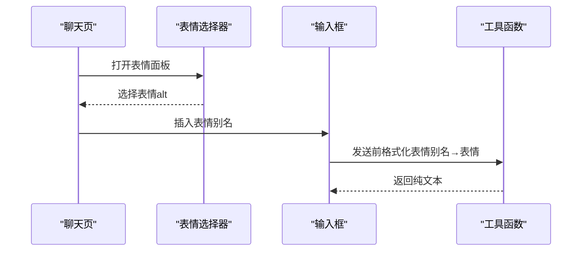

**图表来源**
- [ChatUIKit/modules/Chat/components/MessageInputToolBar/emojiPicker.vue](file://ChatUIKit/modules/Chat/components/MessageInputToolBar/emojiPicker.vue#L29-L42)
- [ChatUIKit/utils/index.ts](file://ChatUIKit/utils/index.ts#L200-L224)

**章节来源**
- [ChatUIKit/modules/Chat/components/MessageInputToolBar/emojiPicker.vue](file://ChatUIKit/modules/Chat/components/MessageInputToolBar/emojiPicker.vue#L1-L83)
- [ChatUIKit/utils/index.ts](file://ChatUIKit/utils/index.ts#L200-L224)

## 依赖关系分析
- 组件耦合
  - 聊天页与消息Store强耦合，负责会话上下文与输入交互
  - 消息列表与Store双向依赖：读取消息、写入分页游标、滚动控制
  - 消息项与各具体消息组件弱耦合，通过props传参
- 外部依赖
  - SDK：发送/接收/撤回/删除/修改消息
  - uni-app：预览图片/视频、下载文件、打开文档、InnerAudioContext
  - Pinia：状态持久化与响应式更新

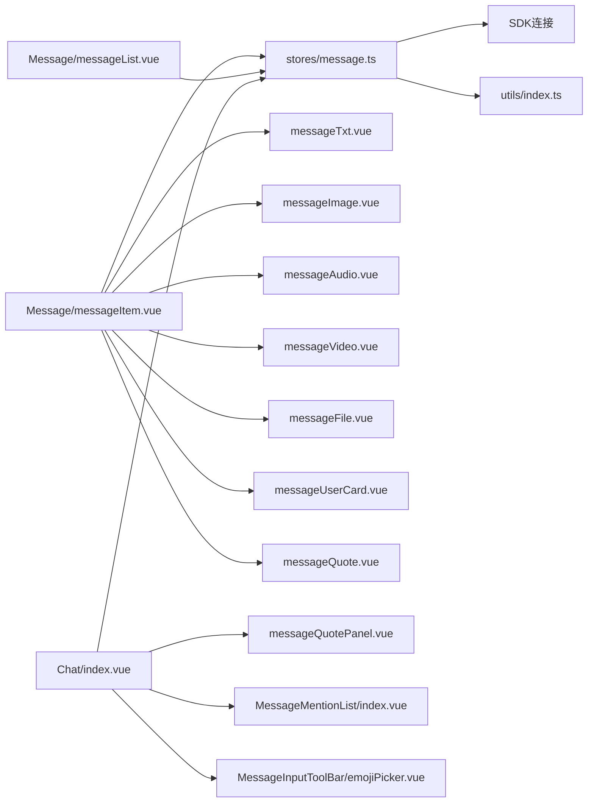

**图表来源**
- [ChatUIKit/modules/Chat/index.vue](file://ChatUIKit/modules/Chat/index.vue#L74-L250)
- [ChatUIKit/stores/message.ts](file://ChatUIKit/stores/message.ts#L1-L688)
- [ChatUIKit/modules/Chat/components/Message/messageItem.vue](file://ChatUIKit/modules/Chat/components/Message/messageItem.vue#L74-L87)

**章节来源**
- [ChatUIKit/stores/message.ts](file://ChatUIKit/stores/message.ts#L1-L688)
- [ChatUIKit/modules/Chat/components/Message/messageItem.vue](file://ChatUIKit/modules/Chat/components/Message/messageItem.vue#L74-L87)

## 性能考虑
- 消息分页与去重
  - 历史消息分页加载，避免一次性渲染过多DOM
  - 合并本地与服务器消息，避免重复渲染
- 滚动与闪烁
  - 新消息到达后自动滚动到底部，完成后降低透明度
  - 引用跳转时闪烁高亮，短暂动画提升可发现性
- 媒体资源
  - 图片优先缩略图，失败回退原图；视频封面懒加载
  - 音频播放仅允许一个实例，避免并发占用
- 内存与清理
  - 会话消息上限裁剪，防止内存膨胀
  - 组件卸载时销毁音频上下文，释放资源
- **更新** 表情包渲染性能优化
  - 采用优化的正则表达式匹配算法，减少不必要的字符串操作
  - 通过emojiAltMap建立表情别名到Unicode的直接映射，提升查找效率
  - renderTxt函数优化了表情与文本的混合渲染逻辑，提升渲染性能

**章节来源**
- [ChatUIKit/modules/Chat/components/Message/messageList.vue](file://ChatUIKit/modules/Chat/components/Message/messageList.vue#L100-L177)
- [ChatUIKit/stores/message.ts](file://ChatUIKit/stores/message.ts#L656-L668)
- [ChatUIKit/modules/Chat/components/Message/messageAudio.vue](file://ChatUIKit/modules/Chat/components/Message/messageAudio.vue#L168-L175)
- [ChatUIKit/utils/index.ts](file://ChatUIKit/utils/index.ts#L226-L265)

## 故障排查指南
- 发送失败
  - 现象：消息状态停留在"发送中"
  - 排查：检查网络与鉴权头；查看Store中失败状态更新
- 音频播放异常
  - 现象：无法播放或无声音
  - 排查：确认下载与转码流程；小程序平台禁用静音开关；确保事件绑定在src赋值前
- 图片/视频加载失败
  - 现象：显示404占位图
  - 排查：检查thumb/url可用性；确认预览入口未被禁用
- 文件打开失败
  - 现象：移动端打开文档失败
  - 排查：确认下载成功与文件类型；查看系统文档打开权限
- 引用跳转无效
  - 现象：点击引用气泡无反应
  - 排查：确认被引用消息存在且msgId有效；检查Store中quoteMessage状态
- **更新** 表情包渲染问题
  - 现象：表情显示异常或渲染缓慢
  - 排查：检查emojiAltMap映射是否正确；确认表情别名格式；验证正则表达式匹配逻辑

**章节来源**
- [ChatUIKit/stores/message.ts](file://ChatUIKit/stores/message.ts#L423-L427)
- [ChatUIKit/modules/Chat/components/Message/messageAudio.vue](file://ChatUIKit/modules/Chat/components/Message/messageAudio.vue#L76-L106)
- [ChatUIKit/modules/Chat/components/Message/messageImage.vue](file://ChatUIKit/modules/Chat/components/Message/messageImage.vue#L40-L51)
- [ChatUIKit/modules/Chat/components/Message/messageVideo.vue](file://ChatUIKit/modules/Chat/components/Message/messageVideo.vue#L69-L76)
- [ChatUIKit/modules/Chat/components/Message/messageFile.vue](file://ChatUIKit/modules/Chat/components/Message/messageFile.vue#L31-L76)
- [ChatUIKit/modules/Chat/components/Message/messageQuote.vue](file://ChatUIKit/modules/Chat/components/Message/messageQuote.vue#L94-L98)

## 结论
该消息类型系统以Store为核心，结合页面容器与多类消息组件，实现了文本、图片、音频、视频、文件与名片消息的完整渲染与交互；配合引用回复、@提及与表情包，满足常见即时通讯场景需求。通过分页加载、媒体资源优化与状态管理，兼顾性能与稳定性。扩展方面，可通过custom消息类型与Store动作扩展新的消息形态与业务流程。

## 附录

### 消息状态与生命周期
- 状态枚举：发送中、已发送、已送达、已读、未读、失败
- 生命周期：本地插入→上传（可选）→SDK发送→状态更新→会话最后消息更新→滚动与高亮

**章节来源**
- [ChatUIKit/types/index.ts](file://ChatUIKit/types/index.ts#L46-L52)
- [ChatUIKit/stores/message.ts](file://ChatUIKit/stores/message.ts#L306-L427)

### 大文件传输与兼容性
- 大文件上传：先上传到业务服务器，Store中回填url；发送时使用body.url
- 多媒体格式：音频下载转MP3；图片/视频thumb优先；文件打开依赖系统能力
- 平台差异：小程序禁用静音开关；WEB直链打开；移动端下载后打开

**章节来源**
- [ChatUIKit/stores/message.ts](file://ChatUIKit/stores/message.ts#L360-L372)
- [ChatUIKit/modules/Chat/components/Message/messageAudio.vue](file://ChatUIKit/modules/Chat/components/Message/messageAudio.vue#L76-L106)
- [ChatUIKit/modules/Chat/components/Message/messageFile.vue](file://ChatUIKit/modules/Chat/components/Message/messageFile.vue#L31-L76)

### 自定义消息类型开发指南
- 创建custom消息：设置type=custom，定义customEvent与customExts
- 渲染组件：在消息项中新增分支，渲染自定义UI
- Store集成：在sendMessage中处理自定义字段；在onMessage中识别并入库
- 示例参考：名片消息（userCard）的创建与渲染

**章节来源**
- [ChatUIKit/modules/Chat/index.vue](file://ChatUIKit/modules/Chat/index.vue#L190-L209)
- [ChatUIKit/modules/Chat/components/Message/messageItem.vue](file://ChatUIKit/modules/Chat/components/Message/messageItem.vue#L53-L55)
- [ChatUIKit/modules/Chat/components/Message/messageUserCard.vue](file://ChatUIKit/modules/Chat/components/Message/messageUserCard.vue#L16-L41)

### 表情包渲染机制技术细节
- **更新** 表情包渲染机制改进
  - renderTxt函数采用优化的正则表达式匹配，支持完整的Unicode表情集
  - emojiAltMap提供表情别名到Unicode的直接映射，提升查找效率
  - 表情渲染采用分段处理机制，避免重复字符串操作
  - 支持表情与文本的混合渲染，保持渲染性能与一致性

**章节来源**
- [ChatUIKit/utils/index.ts](file://ChatUIKit/utils/index.ts#L226-L265)
- [ChatUIKit/const/emoji.ts](file://ChatUIKit/const/emoji.ts#L121-L125)