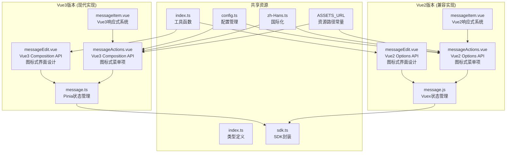
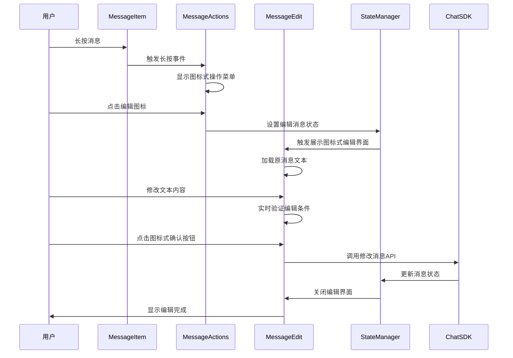
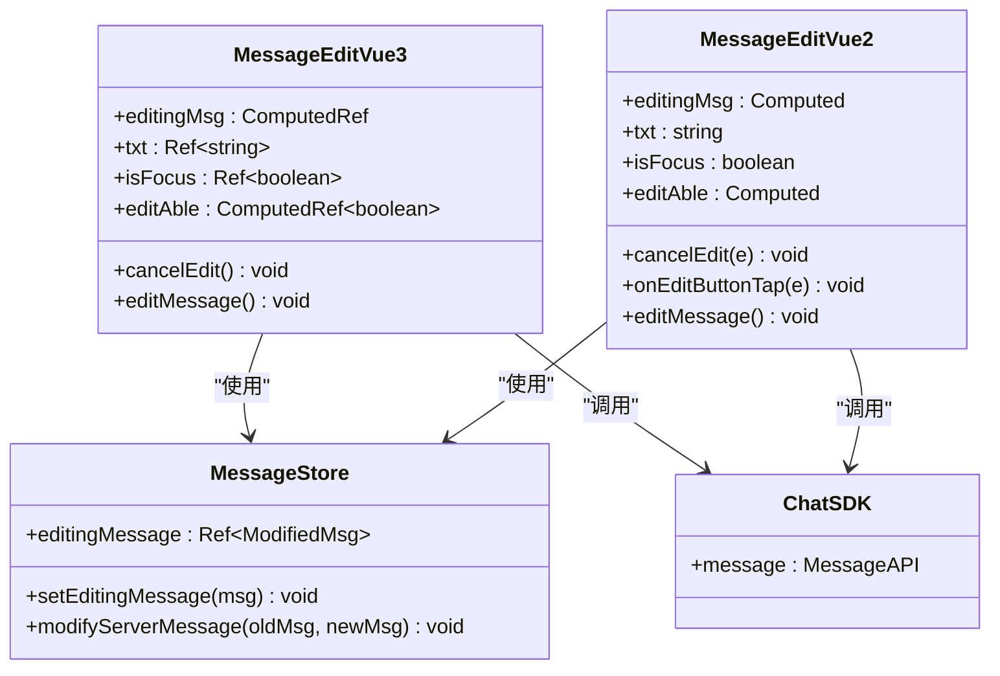
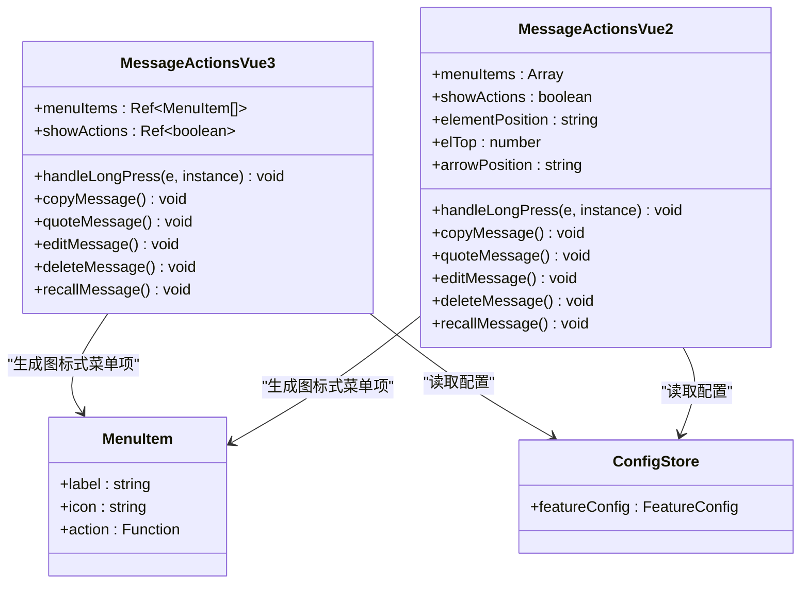
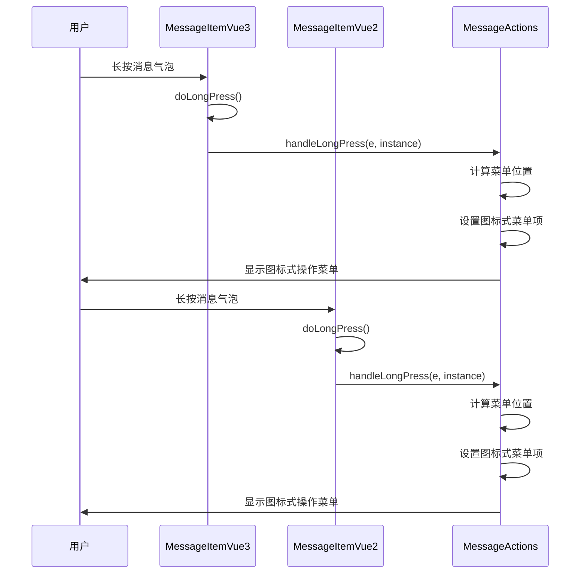
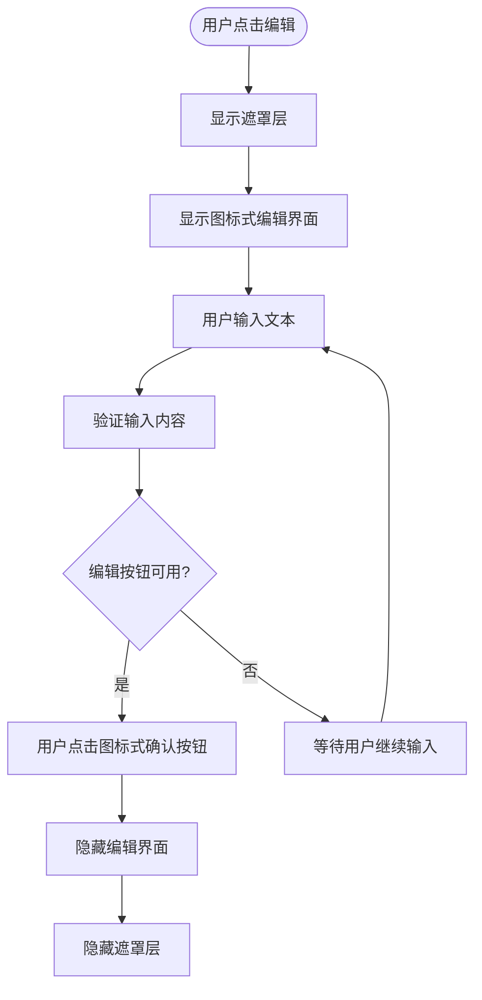
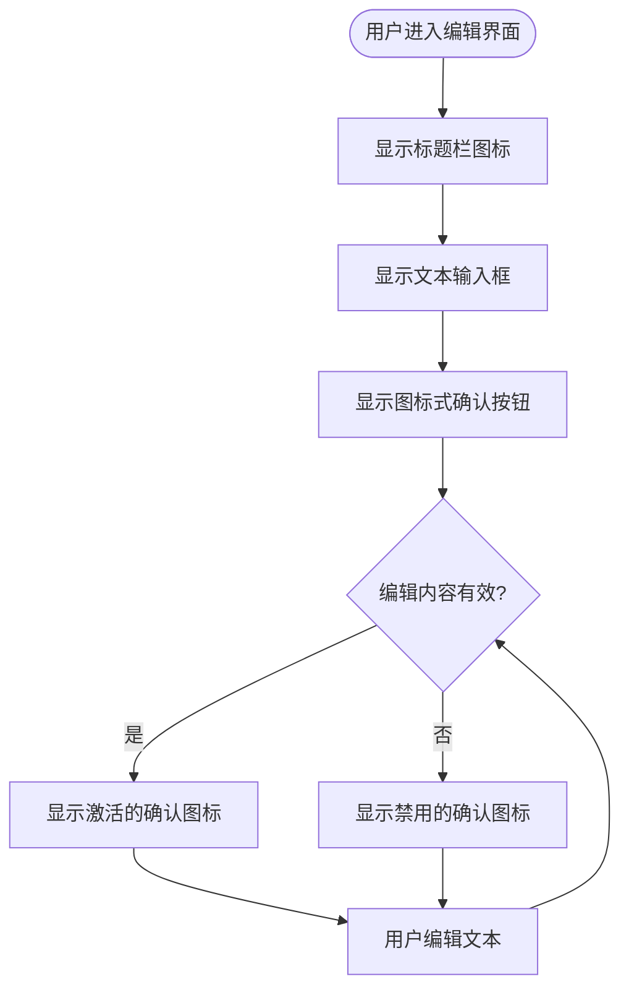
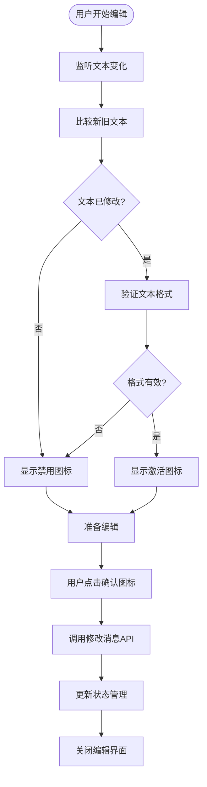

# 消息编辑功能

<cite>
**本文档引用的文件**
- [messageEdit.vue](file://ChatUIKit/modules/Chat/components/Message/messageEdit.vue)
- [messageEdit.vue](file://ChatUIKit-vue2/modules/Chat/components/Message/messageEdit.vue)
- [messageActions.vue](file://ChatUIKit/modules/Chat/components/Message/messageActions.vue)
- [messageActions.vue](file://ChatUIKit-vue2/modules/Chat/components/Message/messageActions.vue)
- [messageItem.vue](file://ChatUIKit/modules/Chat/components/Message/messageItem.vue)
- [messageItem.vue](file://ChatUIKit-vue2/modules/Chat/components/Message/messageItem.vue)
- [messageList.vue](file://ChatUIKit/modules/Chat/components/Message/messageList.vue)
- [message.ts](file://ChatUIKit/stores/message.ts)
- [message.js](file://ChatUIKit-vue2/stores/message.js)
- [config.ts](file://ChatUIKit/stores/config.ts)
- [index.ts](file://ChatUIKit/types/index.ts)
- [index.ts](file://ChatUIKit/utils/index.ts)
- [zh-Hans.ts](file://ChatUIKit/locales/zh-Hans.ts)
- [sdk.ts](file://ChatUIKit/sdk.ts)
- [configType.ts](file://ChatUIKit/configType.ts)
- [index.ts](file://ChatUIKit/const/index.ts)
</cite>

## 更新摘要
**变更内容**
- 消息编辑界面从按钮式设计完全重设计为图标式界面
- 新增checked.png和unchecked.png图标资源，替代原有的按钮式确认按钮
- 重构messageEdit.vue组件，优化遮罩覆盖系统的事件处理机制
- 消息操作菜单从文本按钮改为图标式菜单项
- 增强编辑界面的视觉反馈和用户体验

## 目录
1. [简介](#简介)
2. [项目结构](#项目结构)
3. [核心组件](#核心组件)
4. [架构概览](#架构概览)
5. [详细组件分析](#详细组件分析)
6. [Vue2兼容实现](#vue2兼容实现)
7. [遮罩层系统](#遮罩层系统)
8. [图标式界面设计](#图标式界面设计)
9. [实时编辑验证](#实时编辑验证)
10. [增强调试能力](#增强调试能力)
11. [依赖关系分析](#依赖关系分析)
12. [性能考虑](#性能考虑)
13. [故障排除指南](#故障排除指南)
14. [结论](#结论)

## 简介

消息编辑功能是Easemob UIKit聊天组件中的重要特性，允许用户对已发送的文本消息进行修改和编辑。该功能经过重大架构重构，现在提供Vue2和Vue3双重支持，包括全新的图标式界面设计、增强的遮罩层事件处理机制、实时编辑验证、增强的调试能力和改进的用户交互体验。

## 项目结构

消息编辑功能现在支持双版本架构，涵盖Vue3和Vue2两个版本：



**图表来源**
- [messageEdit.vue:1-147](file://ChatUIKit/modules/Chat/components/Message/messageEdit.vue#L1-L147)
- [messageEdit.vue:1-154](file://ChatUIKit-vue2/modules/Chat/components/Message/messageEdit.vue#L1-L154)
- [messageActions.vue:1-335](file://ChatUIKit/modules/Chat/components/Message/messageActions.vue#L1-L335)
- [messageActions.vue:1-335](file://ChatUIKit-vue2/modules/Chat/components/Message/messageActions.vue#L1-L335)
- [index.ts:7-8](file://ChatUIKit/const/index.ts#L7-L8)

## 核心组件

消息编辑功能现在提供双版本实现，核心组件包括：

### Vue3版本组件
- **messageEdit.vue**: Vue3 Composition API实现，提供现代化的图标式编辑界面
- **messageActions.vue**: Vue3组件，实现增强的消息长按操作菜单，采用图标式设计
- **messageItem.vue**: Vue3响应式系统，支持精确的长按检测
- **message.ts**: Pinia状态管理，提供高性能的状态共享

### Vue2版本组件
- **messageEdit.vue**: Vue2 Options API实现，确保向后兼容性，采用图标式界面设计
- **messageActions.vue**: Vue2组件，包含详细的调试日志，支持图标式菜单项
- **messageItem.vue**: Vue2响应式系统，提供稳定的长按检测
- **message.js**: Vuex状态管理，维持传统状态管理模式

### 状态管理
- **message.ts**: Vue3 Pinia实现，支持现代化状态管理
- **message.js**: Vue2 Vuex实现，确保兼容性

### 类型定义和工具
- **types/index.ts**: 统一的类型定义，支持双版本
- **utils/index.ts**: 工具函数库，提供文本格式化等功能
- **sdk.ts**: SDK封装，支持双版本API调用
- **const/index.ts**: 常量定义，包含ASSETS_URL资源路径

**章节来源**
- [messageEdit.vue:1-147](file://ChatUIKit/modules/Chat/components/Message/messageEdit.vue#L1-L147)
- [messageEdit.vue:1-154](file://ChatUIKit-vue2/modules/Chat/components/Message/messageEdit.vue#L1-L154)
- [messageActions.vue:1-335](file://ChatUIKit/modules/Chat/components/Message/messageActions.vue#L1-L335)

## 架构概览

消息编辑功能采用双架构设计，通过Pinia/Vuex状态管理实现数据流控制：



**图表来源**
- [messageItem.vue:140-180](file://ChatUIKit/modules/Chat/components/Message/messageItem.vue#L140-L180)
- [messageActions.vue:178-250](file://ChatUIKit/modules/Chat/components/Message/messageActions.vue#L178-L250)
- [messageEdit.vue:58-73](file://ChatUIKit/modules/Chat/components/Message/messageEdit.vue#L58-L73)

## 详细组件分析

### 编辑界面组件 (messageEdit.vue)

Vue3版本的编辑界面组件提供了一个完整的消息编辑UI，包含遮罩层系统和实时验证，现已完全重设计为图标式界面：



**图表来源**
- [messageEdit.vue:26-76](file://ChatUIKit/modules/Chat/components/Message/messageEdit.vue#L26-L76)
- [messageEdit.vue:33-121](file://ChatUIKit-vue2/modules/Chat/components/Message/messageEdit.vue#L33-L121)

#### Vue3版本图标式界面特性

1. **图标式确认按钮**: 使用checked.png和unchecked.png图标替代原有按钮
2. **响应式编辑状态**: 使用Vue 3的computed和watch实现编辑状态的响应式管理
3. **遮罩层系统**: 完整的遮罩层实现，提供更好的用户体验
4. **文本验证机制**: 通过formatTextMessage函数确保编辑内容的有效性
5. **焦点管理**: 自动聚焦到编辑输入框，提升用户体验
6. **条件渲染**: 仅在满足编辑条件时显示激活的确认图标

#### Vue2版本图标式界面特性

1. **图标式确认按钮**: 使用checked.png和unchecked.png图标替代原有按钮
2. **Options API实现**: 使用传统的Vue2 Options API模式
3. **详细调试日志**: 包含丰富的console.log输出用于调试
4. **强制编辑执行**: 不依赖editAble计算属性，直接执行编辑操作
5. **按钮点击处理**: 提供独立的编辑按钮点击处理
6. **状态管理兼容**: 与Vuex状态管理完全兼容

**章节来源**
- [messageEdit.vue:1-147](file://ChatUIKit/modules/Chat/components/Message/messageEdit.vue#L1-L147)
- [messageEdit.vue:1-154](file://ChatUIKit-vue2/modules/Chat/components/Message/messageEdit.vue#L1-L154)

### 消息操作菜单 (messageActions.vue)

消息操作菜单组件实现了消息的上下文操作，现在支持双版本实现，已完全重设计为图标式界面：



**图表来源**
- [messageActions.vue:30-144](file://ChatUIKit/modules/Chat/components/Message/messageActions.vue#L30-L144)
- [messageActions.vue:30-178](file://ChatUIKit-vue2/modules/Chat/components/Message/messageActions.vue#L30-L178)

#### Vue3版本图标式菜单项生成逻辑

消息操作菜单根据消息状态和功能配置动态生成图标式菜单项：

1. **复制消息**: 仅对文本消息启用，使用copy.png图标
2. **编辑消息**: 仅对当前用户发送的文本消息且状态正常时启用，使用edit.png图标
3. **回复消息**: 对所有非发送中状态的消息启用，使用reply.png图标
4. **删除消息**: 根据配置决定是否启用，使用delete.png图标
5. **撤回消息**: 仅对发送状态且在时间限制内的消息启用，使用recall.png图标

#### Vue2版本图标式菜单增强功能

1. **服务器消息ID检查**: 新增serverMsgId验证，确保消息已同步到服务器
2. **详细状态日志**: 包含完整的编辑状态检查日志
3. **Toast提示**: 提供用户友好的状态反馈
4. **兼容性处理**: 确保与Vue2生态系统的完全兼容

**章节来源**
- [messageActions.vue:78-144](file://ChatUIKit/modules/Chat/components/Message/messageActions.vue#L78-L144)
- [messageActions.vue:108-178](file://ChatUIKit-vue2/modules/Chat/components/Message/messageActions.vue#L108-L178)

### 消息项组件 (messageItem.vue)

消息项组件提供了长按事件的监听和处理，支持双版本实现：



**图表来源**
- [messageItem.vue:140-180](file://ChatUIKit/modules/Chat/components/Message/messageItem.vue#L140-L180)
- [messageItem.vue:196-235](file://ChatUIKit-vue2/modules/Chat/components/Message/messageItem.vue#L196-L235)

#### Vue3版本长按检测机制

组件实现了两种长按检测方式：

1. **原生长按事件**: 使用`@longpress`监听器
2. **触摸事件检测**: 使用`@touchstart`、`@touchend`、`@touchmove`组合实现

#### Vue2版本增强功能

1. **净化消息对象**: 排除SDK方法，避免Vue响应式警告
2. **详细日志输出**: 提供完整的长按检测过程日志
3. **状态管理兼容**: 确保与Vue2状态管理系统的兼容性

**章节来源**
- [messageItem.vue:136-180](file://ChatUIKit/modules/Chat/components/Message/messageItem.vue#L136-L180)
- [messageItem.vue:178-235](file://ChatUIKit-vue2/modules/Chat/components/Message/messageItem.vue#L178-L235)

### 状态管理 (message.ts & message.js)

消息状态管理组件提供了完整的编辑功能支持，现在支持双版本实现：

```mermaid
classDiagram
class MessageStoreVue3 {
+editingMessage : Ref~ModifiedMsg~
+messageMap : Record~string, MixedMessageBody~
+conversationMessagesMap : Record~string, ConversationInfo~
+setEditingMessage(msg) void
+modifyServerMessage(oldMsg, newMsg) void
+addMessageToMap(msg) boolean
+removeMessageFromMap(msgId) void
}
class MessageStoreVue2 {
+editingMessage : null
+messageMap : Object
+conversationMessagesMap : Object
+SET_EDITING_MESSAGE(state, msg) void
+UPDATE_MESSAGE_IN_MAP(state, { msgId, updates }) void
+ADD_MESSAGE_TO_MAP(state, msg) void
+REMOVE_MESSAGE_FROM_MAP(state, msgId) void
}
class ConversationInfo {
+messageIds : string[]
+cursor : string
+isLast : boolean
+isGetHistoryMessage : boolean
}
MessageStoreVue3 --> ConversationInfo : "管理会话消息"
MessageStoreVue2 --> ConversationInfo : "管理会话消息"
```

**图表来源**
- [message.ts:33-55](file://ChatUIKit/stores/message.ts#L33-L55)
- [message.js:10-21](file://ChatUIKit-vue2/stores/message.js#L10-L21)

#### Vue3版本编辑状态管理

状态管理器维护了编辑消息的状态：

1. **editingMessage**: 当前正在编辑的消息对象
2. **响应式更新**: 通过Vue 3的响应式系统自动更新UI
3. **状态同步**: 确保编辑状态与消息列表保持一致

#### Vue2版本兼容性

1. **Vuex兼容**: 使用传统的mutations和actions模式
2. **状态持久化**: 确保消息状态的正确持久化
3. **向后兼容**: 完全兼容Vue2生态系统

**章节来源**
- [message.ts:48-106](file://ChatUIKit/stores/message.ts#L48-L106)
- [message.js:151-171](file://ChatUIKit-vue2/stores/message.js#L151-L171)

## Vue2兼容实现

Vue2版本的消息编辑功能提供了完整的向后兼容性支持：

### 主要特性

1. **Options API实现**: 使用Vue2的传统Options API模式
2. **Vuex状态管理**: 保持与Vue2生态系统的兼容性
3. **详细调试日志**: 包含丰富的console.log输出
4. **增强的用户反馈**: 提供Toast提示和状态检查

### 关键差异

1. **状态管理**: Vue2使用Vuex，Vue3使用Pinia
2. **响应式系统**: Vue2使用data/computed/watch，Vue3使用ref/computed/watch
3. **生命周期**: Vue2使用mounted/mounted等，Vue3使用onMounted等
4. **事件处理**: Vue2使用methods，Vue3使用setup函数

**章节来源**
- [messageEdit.vue:33-121](file://ChatUIKit-vue2/modules/Chat/components/Message/messageEdit.vue#L33-L121)
- [messageActions.vue:30-178](file://ChatUIKit-vue2/modules/Chat/components/Message/messageActions.vue#L30-L178)

## 遮罩层系统

遮罩层系统是消息编辑功能的重要组成部分，提供了更好的用户体验：

### Vue3版本遮罩层



**图表来源**
- [messageEdit.vue:81-96](file://ChatUIKit/modules/Chat/components/Message/messageEdit.vue#L81-L96)

### Vue2版本遮罩层

Vue2版本的遮罩层系统更加完善：

1. **事件冒泡处理**: 使用`@tap.stop`和`@click.stop`防止事件冒泡
2. **调试信息显示**: 在编辑界面顶部显示editAble状态
3. **按钮样式增强**: 提供更直观的图标式编辑按钮样式

**章节来源**
- [messageEdit.vue:1-24](file://ChatUIKit/modules/Chat/components/Message/messageEdit.vue#L1-L24)
- [messageEdit.vue:1-31](file://ChatUIKit-vue2/modules/Chat/components/Message/messageEdit.vue#L1-L31)

## 图标式界面设计

消息编辑系统已完全重设计为图标式界面，提供更直观的用户体验：

### 图标资源

系统现在使用以下图标资源：
- **checked.png**: 激活状态的确认图标，用于表示可编辑状态
- **unchecked.png**: 禁用状态的确认图标，用于表示不可编辑状态
- **msg-edit.png**: 编辑界面标题图标，显示在编辑界面顶部标题栏

### Vue3版本图标式设计



**图表来源**
- [messageEdit.vue:112-145](file://ChatUIKit/modules/Chat/components/Message/messageEdit.vue#L112-L145)

### Vue2版本图标式设计

Vue2版本同样采用图标式设计：

1. **图标式确认按钮**: 使用checked.png和unchecked.png图标
2. **事件处理增强**: 使用@tap.stop和@click.stop防止事件冒泡
3. **状态可视化**: 通过图标颜色和状态显示编辑有效性

**章节来源**
- [messageEdit.vue:136-152](file://ChatUIKit/modules/Chat/components/Message/messageEdit.vue#L136-L152)
- [messageEdit.vue:140-152](file://ChatUIKit-vue2/modules/Chat/components/Message/messageEdit.vue#L140-L152)

## 实时编辑验证

实时编辑验证机制确保用户输入的有效性和编辑操作的准确性：

### Vue3版本验证机制



**图表来源**
- [messageEdit.vue:52-56](file://ChatUIKit/modules/Chat/components/Message/messageEdit.vue#L52-L56)

### Vue2版本验证机制

Vue2版本提供了更强大的验证能力：

1. **实时状态显示**: 在编辑界面顶部显示editAble状态
2. **详细日志输出**: 包含完整的编辑过程日志
3. **强制执行机制**: 即使editAble为false也能执行编辑操作
4. **异常处理**: 完善的错误处理和异常捕获

**章节来源**
- [messageEdit.vue:52-56](file://ChatUIKit/modules/Chat/components/Message/messageEdit.vue#L52-L56)
- [messageEdit.vue:53-58](file://ChatUIKit-vue2/modules/Chat/components/Message/messageEdit.vue#L53-L58)

## 增强调试能力

Vue2版本显著增强了调试能力，提供了详细的日志输出和状态跟踪：

### 调试功能特性

1. **编辑状态日志**: 显示当前编辑消息的详细信息
2. **验证过程日志**: 跟踪editAble计算过程
3. **事件处理日志**: 记录所有用户交互事件
4. **状态管理日志**: 跟踪状态变化和API调用

### 日志输出示例

```javascript
// 编辑状态日志
console.log('[MessageEdit] editingMsg computed, id:', msg?.id)
console.log('[MessageEdit] editAble computed:', result)

// 事件处理日志
console.log('[MessageEdit] onEditButtonTap called')
console.log('[MessageEdit] editMessage called')

// 错误处理日志
console.error('[MessageEdit] Failed to modify message:', err)
```

### 用户反馈机制

Vue2版本提供了更好的用户反馈：

1. **Toast提示**: 编辑成功或失败时的用户提示
2. **状态检查**: 编辑前的状态验证和提示
3. **异常处理**: 完善的错误处理和用户引导

**章节来源**
- [messageEdit.vue:17-119](file://ChatUIKit-vue2/modules/Chat/components/Message/messageEdit.vue#L17-L119)
- [messageActions.vue:108-178](file://ChatUIKit-vue2/modules/Chat/components/Message/messageActions.vue#L108-L178)

## 依赖关系分析

消息编辑功能的依赖关系现在支持双版本架构：

```mermaid
graph TB
subgraph "Vue3外部依赖"
SDK[Easemob SDK]
PINIA[Pinia状态管理]
VUE3[Vue 3响应式系统]
END
subgraph "Vue2外部依赖"
SDK2[Easemob SDK]
VUEX[Vuex状态管理]
VUE2[Vue 2响应式系统]
END
subgraph "Vue3内部模块"
ME3[messageEdit.vue]
MA3[messageActions.vue]
MI3[messageItem.vue]
MS3[message.ts]
CS[config.ts]
UT[utils/index.ts]
TY[types/index.ts]
LO[locales/zh-Hans.ts]
AS[const/index.ts]
end
subgraph "Vue2内部模块"
ME2[messageEdit.vue]
MA2[messageActions.vue]
MI2[messageItem.vue]
MS2[message.js]
CS[config.ts]
UT[utils/index.ts]
TY[types/index.ts]
LO[locales/zh-Hans.ts]
AS[const/index.ts]
end
ME3 --> MS3
MA3 --> MS3
MI3 --> MA3
MS3 --> SDK
MS3 --> PINIA
ME3 --> VUE3
MA3 --> VUE3
MI3 --> VUE3
MA3 --> CS
ME3 --> UT
MA3 --> LO
ME3 --> AS
ME2 --> MS2
MA2 --> MS2
MI2 --> MA2
MS2 --> SDK
MS2 --> VUEX
ME2 --> VUE2
MA2 --> VUE2
MI2 --> VUE2
MA2 --> CS
ME2 --> UT
MA2 --> LO
ME2 --> AS
```

**图表来源**
- [sdk.ts:1-13](file://ChatUIKit/sdk.ts#L1-13)
- [config.ts:1-124](file://ChatUIKit/stores/config.ts#L1-124)
- [index.ts:7-8](file://ChatUIKit/const/index.ts#L7-8)

### 关键依赖关系

1. **SDK集成**: 通过chatSDK调用底层的修改消息API
2. **状态管理**: Vue3使用Pinia，Vue2使用Vuex
3. **响应式系统**: Vue3使用Composition API，Vue2使用Options API
4. **类型安全**: TypeScript提供完整的类型定义和验证
5. **资源管理**: ASSETS_URL常量统一管理图标资源路径

**章节来源**
- [sdk.ts:1-13](file://ChatUIKit/sdk.ts#L1-13)
- [config.ts:1-124](file://ChatUIKit/stores/config.ts#L1-124)
- [index.ts:7-8](file://ChatUIKit/const/index.ts#L7-8)

## 性能考虑

消息编辑功能在设计时充分考虑了性能优化，现在支持双版本架构：

### Vue3版本性能优化

### 内存管理
- **消息缓存**: 使用messageMap避免重复创建消息对象
- **状态清理**: 编辑完成后及时清理编辑状态
- **批量更新**: 通过响应式系统减少不必要的DOM更新

### Vue2版本性能优化

### 内存管理
- **消息缓存**: 使用messageMap避免重复创建消息对象
- **状态清理**: 编辑完成后及时清理编辑状态
- **批量更新**: 通过Vue.set/Vue.delete优化响应式更新

### 网络优化
- **条件请求**: 仅在必要时调用修改消息API
- **错误处理**: 完善的错误处理机制避免重复请求
- **状态回滚**: 网络异常时自动回滚到原始状态

### 用户体验
- **即时反馈**: 编辑状态变化时提供即时视觉反馈
- **防抖处理**: 避免频繁的编辑操作触发过多API调用
- **焦点管理**: 自动管理输入焦点提升编辑效率

## 故障排除指南

### 常见问题及解决方案

#### 编辑功能不可用
**问题**: 编辑图标灰色不可点击
**原因**: 
- 消息类型不是文本消息
- 消息状态异常（发送中、失败）
- 非当前用户发送的消息
- 功能配置被禁用
- Vue2版本消息未同步到服务器
- 图标资源加载失败

**解决方法**:
1. 检查消息类型是否为文本消息
2. 验证消息状态是否正常
3. 确认消息是否由当前用户发送
4. 检查配置中editMessage功能是否启用
5. Vue2版本检查消息是否有serverMsgId
6. 验证checked.png和unchecked.png图标资源是否正确加载

#### 编辑保存失败
**问题**: 点击确认图标后编辑无效
**原因**:
- 网络连接异常
- 消息尚未同步到服务器
- 服务器端修改权限不足
- Vue2版本编辑状态检查失败
- 图标事件处理异常

**解决方法**:
1. 检查网络连接状态
2. 等待消息完全发送后再编辑
3. 确认用户具有修改消息的权限
4. Vue2版本检查editAble状态和日志输出
5. 验证图标点击事件是否正确处理

#### 编辑界面不显示
**问题**: 长按消息后编辑界面不出现
**原因**:
- 消息操作菜单配置问题
- 长按事件监听异常
- 编辑状态管理器异常
- Vue2版本事件冒泡问题
- 图标式菜单项生成异常

**解决方法**:
1. 检查消息操作菜单的配置
2. 验证长按事件绑定
3. 重启应用或检查状态管理器
4. Vue2版本检查@tap.stop和@click.stop事件处理
5. 验证图标式菜单项的生成逻辑

#### Vue2版本特殊问题
**问题**: Vue2版本编辑功能异常
**原因**:
- 事件冒泡处理不当
- 状态管理兼容性问题
- 缺少必要的调试日志
- Toast提示未正确显示
- 图标资源路径配置错误

**解决方法**:
1. 检查@tap.stop和@click.stop事件处理
2. 验证Vuex状态管理器配置
3. 查看console.log输出的调试信息
4. 确认Toast提示的正确显示
5. 检查ASSETS_URL常量配置和图标资源路径

**章节来源**
- [messageActions.vue:78-144](file://ChatUIKit/modules/Chat/components/Message/messageActions.vue#L78-L144)
- [messageActions.vue:108-178](file://ChatUIKit-vue2/modules/Chat/components/Message/messageActions.vue#L108-L178)
- [messageEdit.vue:52-73](file://ChatUIKit/modules/Chat/components/Message/messageEdit.vue#L52-L73)
- [messageEdit.vue:74-119](file://ChatUIKit-vue2/modules/Chat/components/Message/messageEdit.vue#L74-L119)

## 结论

消息编辑功能经过重大架构重构，现在提供了完整的双版本支持，包括Vue2和Vue3两个版本。该功能具备以下特点：

1. **完整的功能链路**: 从消息长按到编辑确认的完整流程
2. **图标式界面设计**: 全面采用图标式界面，提供更直观的用户体验
3. **灵活的配置选项**: 通过功能配置控制编辑功能的可用性
4. **健壮的错误处理**: 完善的异常处理和状态回滚机制
5. **良好的性能表现**: 通过响应式系统和状态管理优化性能
6. **增强的用户体验**: 遮罩层系统、实时验证和详细调试
7. **向后兼容性**: Vue2版本确保与现有项目的兼容性
8. **图标资源管理**: 统一的图标资源管理和路径配置

该实现为开发者提供了可扩展的基础框架，可以根据具体需求选择合适的版本进行集成和扩展。图标式界面设计不仅提升了用户体验，还为未来的功能扩展奠定了良好的基础。