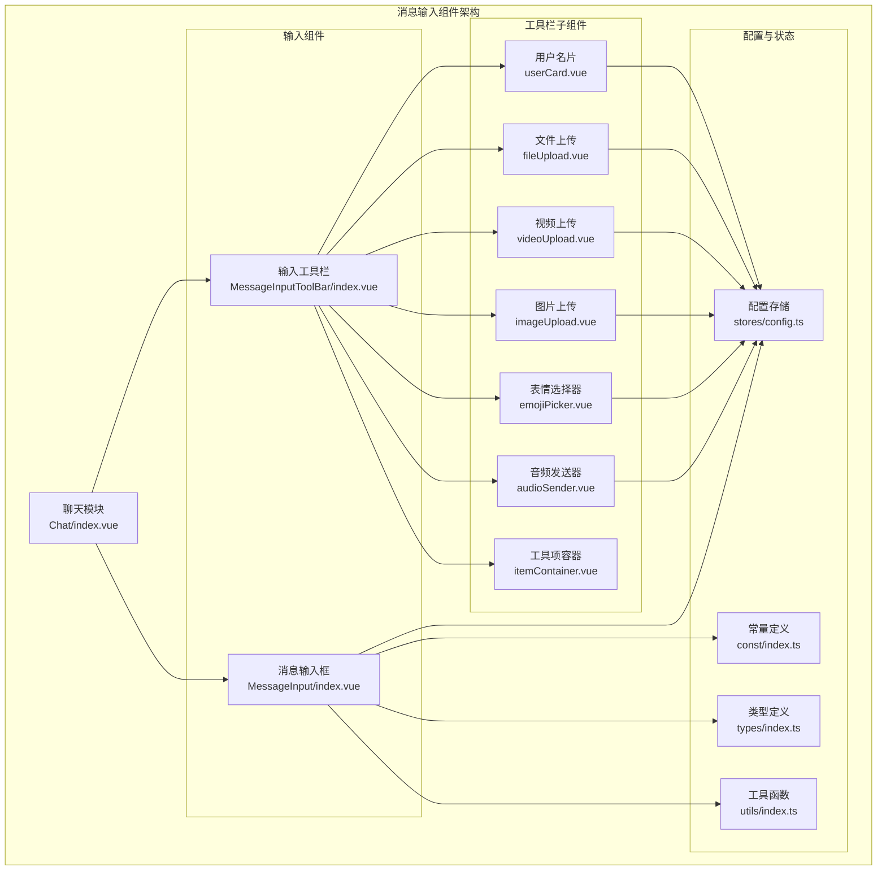
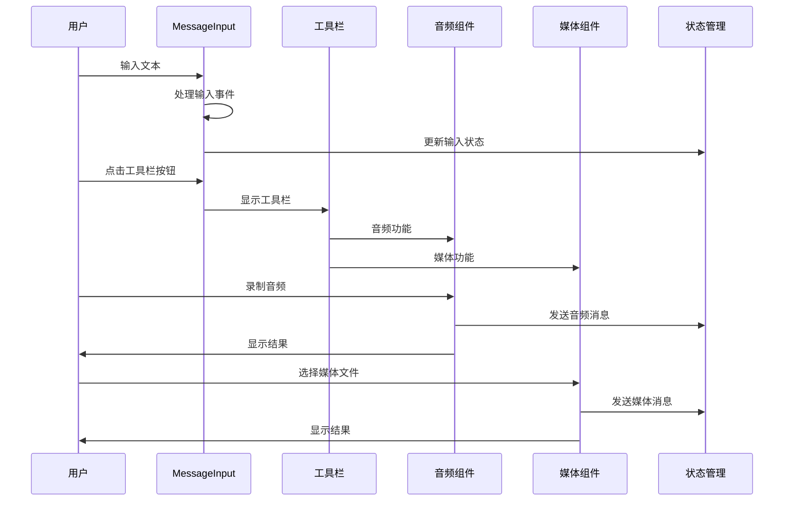
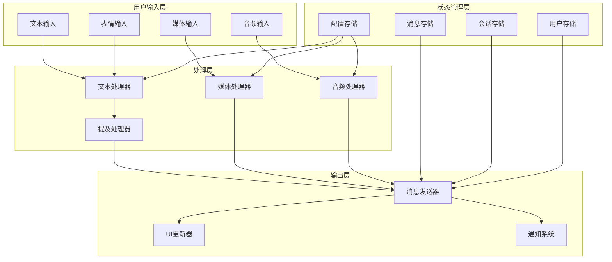
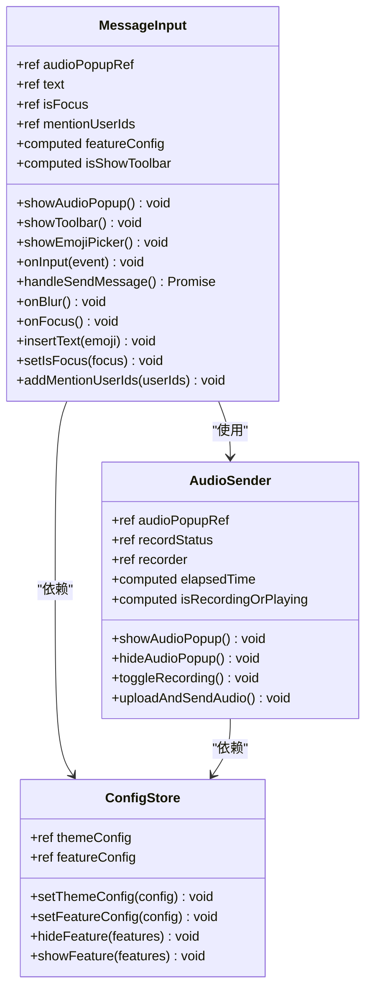
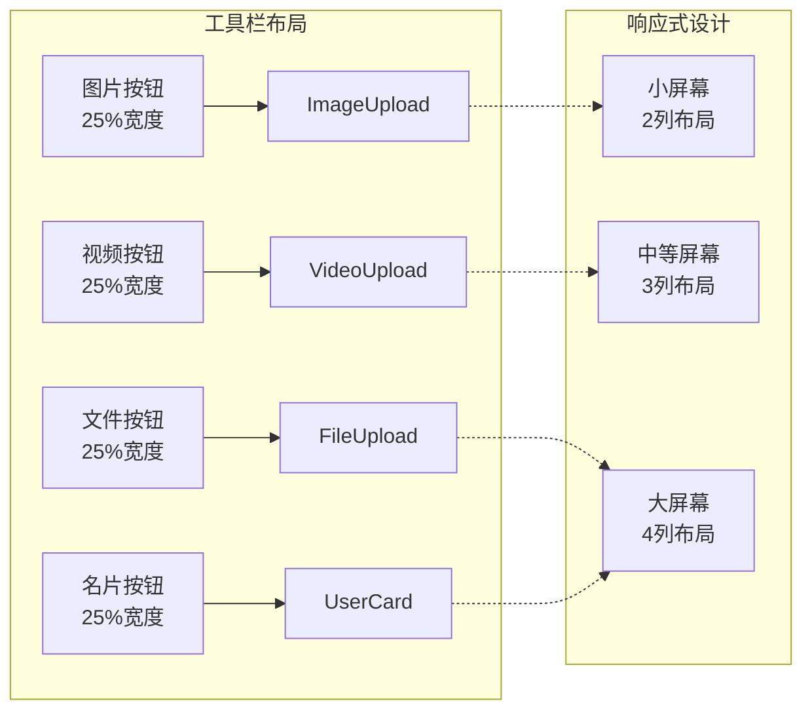
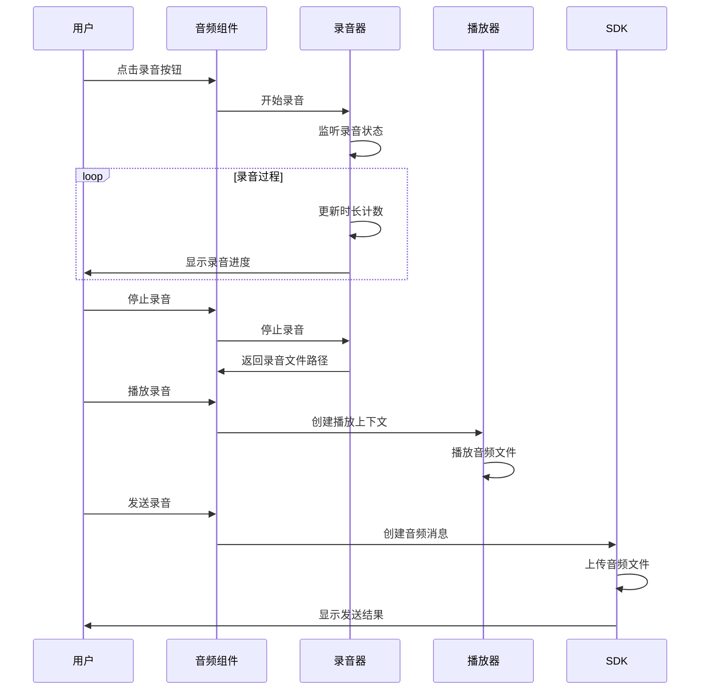
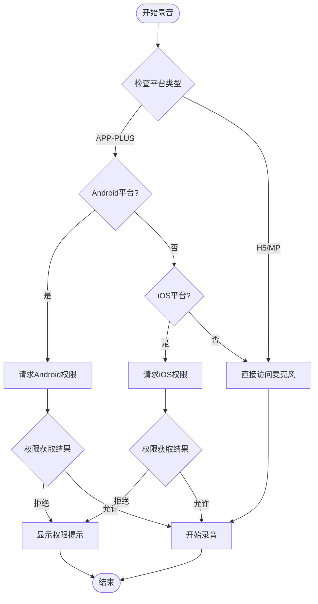
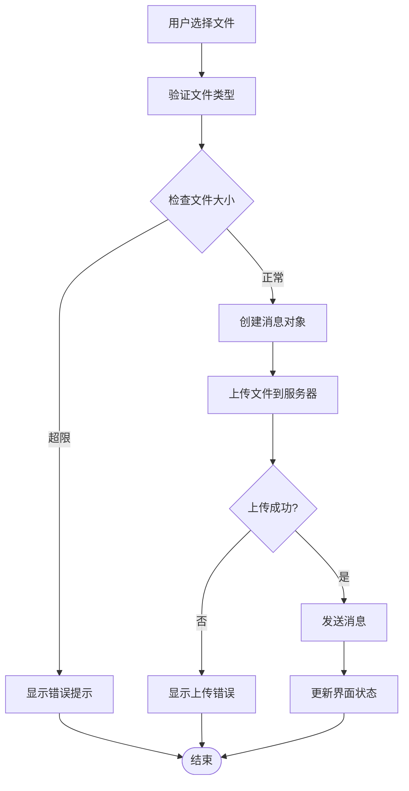
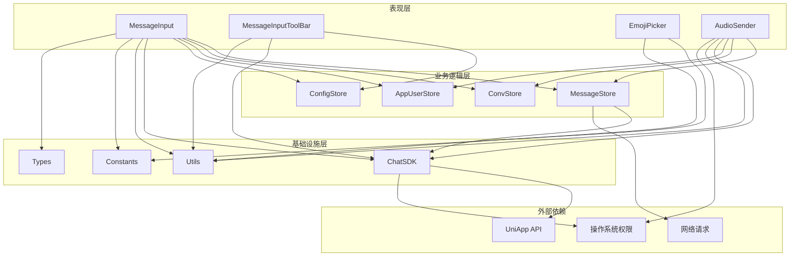
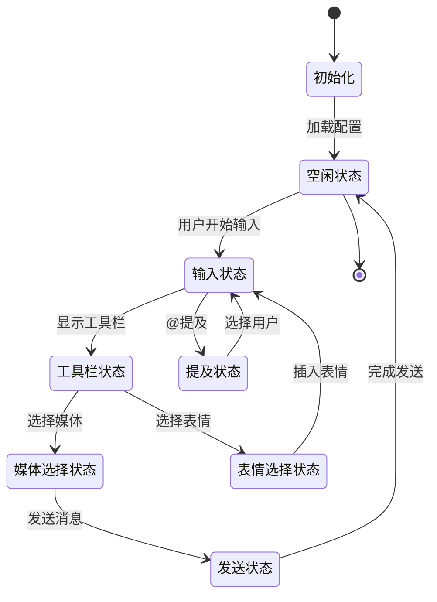

# 消息输入组件

<cite>
**本文档引用的文件**
- [ChatUIKit/modules/Chat/components/MessageInput/index.vue](file://ChatUIKit/modules/Chat/components/MessageInput/index.vue)
- [ChatUIKit/modules/Chat/components/MessageInput/style.scss](file://ChatUIKit/modules/Chat/components/MessageInput/style.scss)
- [ChatUIKit/modules/Chat/components/MessageInputToolBar/index.vue](file://ChatUIKit/modules/Chat/components/MessageInputToolBar/index.vue)
- [ChatUIKit/modules/Chat/components/MessageInputToolBar/itemContainer.vue](file://ChatUIKit/modules/Chat/components/MessageInputToolBar/itemContainer.vue)
- [ChatUIKit/modules/Chat/components/MessageInputToolBar/audioSender.vue](file://ChatUIKit/modules/Chat/components/MessageInputToolBar/audioSender.vue)
- [ChatUIKit/modules/Chat/components/MessageInputToolBar/emojiPicker.vue](file://ChatUIKit/modules/Chat/components/MessageInputToolBar/emojiPicker.vue)
- [ChatUIKit/modules/Chat/components/MessageInputToolBar/imageUpload.vue](file://ChatUIKit/modules/Chat/components/MessageInputToolBar/imageUpload.vue)
- [ChatUIKit/modules/Chat/components/MessageInputToolBar/videoUpload.vue](file://ChatUIKit/modules/Chat/components/MessageInputToolBar/videoUpload.vue)
- [ChatUIKit/modules/Chat/components/MessageInputToolBar/fileUpload.vue](file://ChatUIKit/modules/Chat/components/MessageInputToolBar/fileUpload.vue)
- [ChatUIKit/modules/Chat/components/MessageInputToolBar/userCard.vue](file://ChatUIKit/modules/Chat/components/MessageInputToolBar/userCard.vue)
- [ChatUIKit/modules/Chat/index.vue](file://ChatUIKit/modules/Chat/index.vue)
- [ChatUIKit/stores/config.ts](file://ChatUIKit/stores/config.ts)
- [ChatUIKit/const/index.ts](file://ChatUIKit/const/index.ts)
- [ChatUIKit/types/index.ts](file://ChatUIKit/types/index.ts)
- [ChatUIKit/utils/index.ts](file://ChatUIKit/utils/index.ts)
</cite>

## 目录
1. [简介](#简介)
2. [项目结构](#项目结构)
3. [核心组件](#核心组件)
4. [架构概览](#架构概览)
5. [详细组件分析](#详细组件分析)
6. [依赖关系分析](#依赖关系分析)
7. [性能考虑](#性能考虑)
8. [故障排除指南](#故障排除指南)
9. [结论](#结论)

## 简介

消息输入组件是 Easemob UIKIT 中聊天界面的核心组成部分，负责处理用户的各种消息输入需求。该组件提供了完整的消息输入解决方案，包括文本输入、表情选择、多媒体内容发送等功能。

该组件采用模块化设计，将不同的输入功能分离到独立的子组件中，实现了高内聚、低耦合的架构模式。通过 Pinia 状态管理实现组件间的数据共享，通过事件机制实现组件间的通信。

## 项目结构

消息输入组件位于 ChatUIKit 的模块化架构中，采用层次化的文件组织方式：



**图表来源**
- [ChatUIKit/modules/Chat/index.vue](file://ChatUIKit/modules/Chat/index.vue#L1-L255)
- [ChatUIKit/modules/Chat/components/MessageInput/index.vue](file://ChatUIKit/modules/Chat/components/MessageInput/index.vue#L1-L217)

**章节来源**
- [ChatUIKit/modules/Chat/index.vue](file://ChatUIKit/modules/Chat/index.vue#L1-L255)
- [ChatUIKit/modules/Chat/components/MessageInput/index.vue](file://ChatUIKit/modules/Chat/components/MessageInput/index.vue#L1-L217)

## 核心组件

消息输入组件系统由多个相互协作的组件构成，每个组件都有明确的职责分工：

### 主要组件职责

1. **MessageInput** - 主输入组件，处理文本输入和基本交互
2. **MessageInputToolBar** - 工具栏容器，管理各种输入功能
3. **AudioSender** - 音频录制和发送功能
4. **EmojiPicker** - 表情符号选择器
5. **媒体上传组件** - 图片、视频、文件上传处理
6. **UserCard** - 用户名片发送功能

### 组件间通信机制



**图表来源**
- [ChatUIKit/modules/Chat/components/MessageInput/index.vue](file://ChatUIKit/modules/Chat/components/MessageInput/index.vue#L137-L189)
- [ChatUIKit/modules/Chat/components/MessageInputToolBar/index.vue](file://ChatUIKit/modules/Chat/components/MessageInputToolBar/index.vue#L1-L69)

**章节来源**
- [ChatUIKit/modules/Chat/components/MessageInput/index.vue](file://ChatUIKit/modules/Chat/components/MessageInput/index.vue#L1-L217)
- [ChatUIKit/modules/Chat/components/MessageInputToolBar/index.vue](file://ChatUIKit/modules/Chat/components/MessageInputToolBar/index.vue#L1-L69)

## 架构概览

消息输入组件采用了响应式架构设计，结合了现代前端开发的最佳实践：

### 架构设计原则

1. **模块化设计** - 功能按模块划分，便于维护和扩展
2. **响应式编程** - 使用 Vue 3 Composition API 实现响应式数据绑定
3. **状态管理** - 通过 Pinia 实现全局状态管理
4. **事件驱动** - 组件间通过事件机制进行通信
5. **配置驱动** - 功能开关通过配置文件控制

### 数据流架构



**图表来源**
- [ChatUIKit/stores/config.ts](file://ChatUIKit/stores/config.ts#L1-L124)
- [ChatUIKit/modules/Chat/components/MessageInput/index.vue](file://ChatUIKit/modules/Chat/components/MessageInput/index.vue#L137-L189)

**章节来源**
- [ChatUIKit/stores/config.ts](file://ChatUIKit/stores/config.ts#L1-L124)
- [ChatUIKit/modules/Chat/components/MessageInput/index.vue](file://ChatUIKit/modules/Chat/components/MessageInput/index.vue#L1-L217)

## 详细组件分析

### MessageInput 组件分析

MessageInput 是消息输入的核心组件，负责处理用户的基本输入操作：

#### 组件特性

1. **多平台适配** - 支持 H5、小程序、APP 等多种平台
2. **功能可配置** - 通过配置文件控制功能开关
3. **事件驱动** - 提供丰富的事件回调机制
4. **国际化支持** - 内置多语言支持

#### 核心功能实现



**图表来源**
- [ChatUIKit/modules/Chat/components/MessageInput/index.vue](file://ChatUIKit/modules/Chat/components/MessageInput/index.vue#L43-L212)
- [ChatUIKit/modules/Chat/components/MessageInputToolBar/audioSender.vue](file://ChatUIKit/modules/Chat/components/MessageInputToolBar/audioSender.vue#L40-L261)
- [ChatUIKit/stores/config.ts](file://ChatUIKit/stores/config.ts#L59-L124)

#### 输入处理流程

```mermaid
flowchart TD
Start([用户开始输入]) --> CheckInput[检查输入内容]
CheckInput --> HasText{是否有文本?}
HasText --> |否| WaitInput[等待输入]
HasText --> |是| CheckMention[检查@提及]
CheckMention --> IsMention{是否@提及?}
IsMention --> |是| ShowMentionList[显示提及列表]
IsMention --> |否| CheckMedia{检查媒体类型}
CheckMedia --> IsImage{图片?}
IsImage --> |是| SendImage[发送图片消息]
IsImage --> |否| IsVideo{视频?}
IsVideo --> |是| SendVideo[发送视频消息]
IsVideo --> |否| IsFile{文件?}
IsFile --> |是| SendFile[发送文件消息]
IsFile --> |否| IsAudio{音频?}
IsAudio --> |是| ShowAudioPopup[显示音频弹窗]
IsAudio --> |否| SendText[发送文本消息]
SendText --> ClearInput[清空输入框]
SendImage --> ClearInput
SendVideo --> ClearInput
SendFile --> ClearInput
ShowAudioPopup --> RecordAudio[开始录音]
RecordAudio --> UploadAudio[上传音频]
UploadAudio --> SendAudioMsg[发送音频消息]
SendAudioMsg --> ClearInput
ClearInput --> End([完成])
WaitInput --> End
```

**图表来源**
- [ChatUIKit/modules/Chat/components/MessageInput/index.vue](file://ChatUIKit/modules/Chat/components/MessageInput/index.vue#L137-L189)
- [ChatUIKit/modules/Chat/components/MessageInputToolBar/audioSender.vue](file://ChatUIKit/modules/Chat/components/MessageInputToolBar/audioSender.vue#L177-L215)

**章节来源**
- [ChatUIKit/modules/Chat/components/MessageInput/index.vue](file://ChatUIKit/modules/Chat/components/MessageInput/index.vue#L1-L217)
- [ChatUIKit/modules/Chat/components/MessageInputToolBar/audioSender.vue](file://ChatUIKit/modules/Chat/components/MessageInputToolBar/audioSender.vue#L1-L350)

### MessageInputToolBar 组件分析

工具栏组件负责管理各种输入功能的入口：

#### 功能模块

1. **图片上传** - 支持从相册选择图片
2. **视频上传** - 支持摄像头拍摄和相册选择
3. **文件上传** - 支持多种文件格式
4. **用户名片** - 发送联系人信息
5. **表情选择** - 内置表情符号库

#### 工具栏布局设计



**图表来源**
- [ChatUIKit/modules/Chat/components/MessageInputToolBar/index.vue](file://ChatUIKit/modules/Chat/components/MessageInputToolBar/index.vue#L1-L69)
- [ChatUIKit/modules/Chat/components/MessageInputToolBar/itemContainer.vue](file://ChatUIKit/modules/Chat/components/MessageInputToolBar/itemContainer.vue#L1-L46)

**章节来源**
- [ChatUIKit/modules/Chat/components/MessageInputToolBar/index.vue](file://ChatUIKit/modules/Chat/components/MessageInputToolBar/index.vue#L1-L69)
- [ChatUIKit/modules/Chat/components/MessageInputToolBar/itemContainer.vue](file://ChatUIKit/modules/Chat/components/MessageInputToolBar/itemContainer.vue#L1-L46)

### 音频输入组件分析

音频输入组件提供了完整的录音和播放功能：

#### 音频处理流程



**图表来源**
- [ChatUIKit/modules/Chat/components/MessageInputToolBar/audioSender.vue](file://ChatUIKit/modules/Chat/components/MessageInputToolBar/audioSender.vue#L92-L215)

#### 音频权限处理

组件实现了跨平台的音频权限管理：



**图表来源**
- [ChatUIKit/modules/Chat/components/MessageInputToolBar/audioSender.vue](file://ChatUIKit/modules/Chat/components/MessageInputToolBar/audioSender.vue#L223-L242)

**章节来源**
- [ChatUIKit/modules/Chat/components/MessageInputToolBar/audioSender.vue](file://ChatUIKit/modules/Chat/components/MessageInputToolBar/audioSender.vue#L1-L350)

### 媒体上传组件分析

媒体上传组件支持多种文件类型的上传和发送：

#### 文件上传流程



**图表来源**
- [ChatUIKit/modules/Chat/components/MessageInputToolBar/imageUpload.vue](file://ChatUIKit/modules/Chat/components/MessageInputToolBar/imageUpload.vue#L41-L76)
- [ChatUIKit/modules/Chat/components/MessageInputToolBar/videoUpload.vue](file://ChatUIKit/modules/Chat/components/MessageInputToolBar/videoUpload.vue#L40-L78)
- [ChatUIKit/modules/Chat/components/MessageInputToolBar/fileUpload.vue](file://ChatUIKit/modules/Chat/components/MessageInputToolBar/fileUpload.vue#L56-L95)

**章节来源**
- [ChatUIKit/modules/Chat/components/MessageInputToolBar/imageUpload.vue](file://ChatUIKit/modules/Chat/components/MessageInputToolBar/imageUpload.vue#L1-L85)
- [ChatUIKit/modules/Chat/components/MessageInputToolBar/videoUpload.vue](file://ChatUIKit/modules/Chat/components/MessageInputToolBar/videoUpload.vue#L1-L87)
- [ChatUIKit/modules/Chat/components/MessageInputToolBar/fileUpload.vue](file://ChatUIKit/modules/Chat/components/MessageInputToolBar/fileUpload.vue#L1-L104)

## 依赖关系分析

消息输入组件的依赖关系体现了清晰的分层架构：

### 核心依赖关系



**图表来源**
- [ChatUIKit/modules/Chat/components/MessageInput/index.vue](file://ChatUIKit/modules/Chat/components/MessageInput/index.vue#L43-L56)
- [ChatUIKit/modules/Chat/components/MessageInputToolBar/audioSender.vue](file://ChatUIKit/modules/Chat/components/MessageInputToolBar/audioSender.vue#L40-L48)

### 状态管理依赖

组件通过 Pinia 实现状态管理，确保数据的一致性和可预测性：



**图表来源**
- [ChatUIKit/stores/config.ts](file://ChatUIKit/stores/config.ts#L59-L124)

**章节来源**
- [ChatUIKit/stores/config.ts](file://ChatUIKit/stores/config.ts#L1-L124)
- [ChatUIKit/modules/Chat/components/MessageInput/index.vue](file://ChatUIKit/modules/Chat/components/MessageInput/index.vue#L1-L217)

## 性能考虑

消息输入组件在设计时充分考虑了性能优化：

### 性能优化策略

1. **懒加载机制** - 工具栏和表情面板按需加载
2. **虚拟滚动** - 大量表情时使用分块渲染
3. **事件节流** - 输入事件进行防抖处理
4. **内存管理** - 及时清理音频播放资源

### 性能监控指标

| 指标类型 | 优化目标 | 实现方式 |
|---------|---------|----------|
| 组件渲染 | < 100ms | 懒加载、虚拟滚动 |
| 输入响应 | < 50ms | 防抖处理、异步更新 |
| 媒体上传 | < 2s | 进度反馈、断点续传 |
| 音频录制 | 实时响应 | 流式处理、缓冲区管理 |

## 故障排除指南

### 常见问题及解决方案

#### 权限相关问题

**问题描述**: 音频录制权限被拒绝
**解决方案**: 
1. 检查平台权限设置
2. 引导用户手动授权
3. 提供权限说明和帮助文档

#### 网络连接问题

**问题描述**: 媒体文件上传失败
**解决方案**:
1. 检查网络连接状态
2. 验证文件大小限制
3. 重新发起上传请求

#### 平台兼容性问题

**问题描述**: 不同平台表现不一致
**解决方案**:
1. 使用条件编译处理平台差异
2. 提供降级方案
3. 进行多平台测试验证

**章节来源**
- [ChatUIKit/modules/Chat/components/MessageInputToolBar/audioSender.vue](file://ChatUIKit/modules/Chat/components/MessageInputToolBar/audioSender.vue#L223-L242)
- [ChatUIKit/modules/Chat/components/MessageInputToolBar/imageUpload.vue](file://ChatUIKit/modules/Chat/components/MessageInputToolBar/imageUpload.vue#L31-L39)

## 结论

消息输入组件展现了现代前端开发的最佳实践，通过模块化设计、响应式架构和完善的错误处理机制，为用户提供了流畅的消息输入体验。

### 设计优势

1. **高度模块化** - 功能分离清晰，便于维护和扩展
2. **跨平台兼容** - 统一的接口设计支持多平台部署
3. **性能优化** - 多种优化策略确保良好的用户体验
4. **可配置性强** - 通过配置文件灵活控制功能开关

### 技术亮点

1. **响应式编程** - 使用 Vue 3 Composition API 实现现代化开发
2. **状态管理** - 通过 Pinia 实现全局状态管理
3. **事件驱动** - 组件间通过事件机制进行松耦合通信
4. **国际化支持** - 内置多语言支持，便于全球化部署

该组件为聊天应用提供了坚实的基础，其设计理念和实现方式值得在类似的即时通讯应用中借鉴和应用。