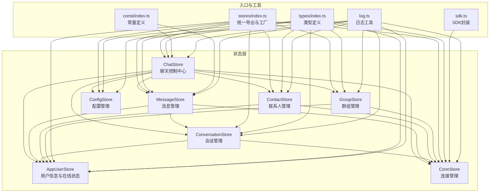
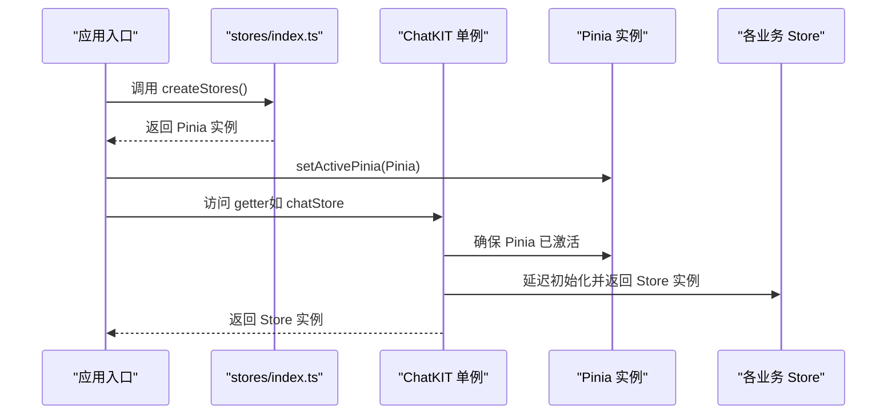
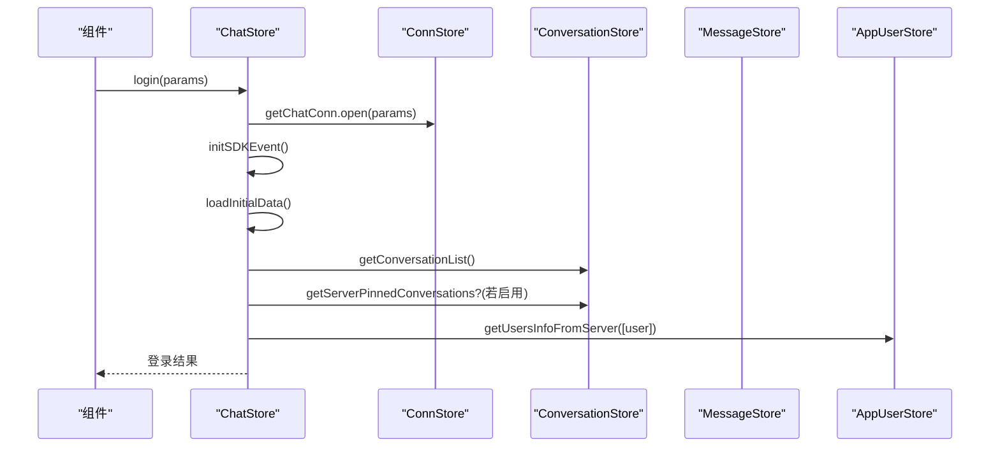
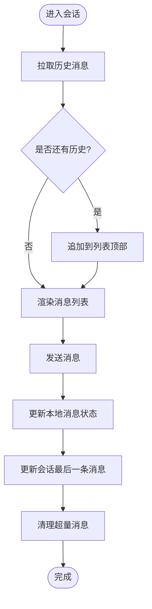
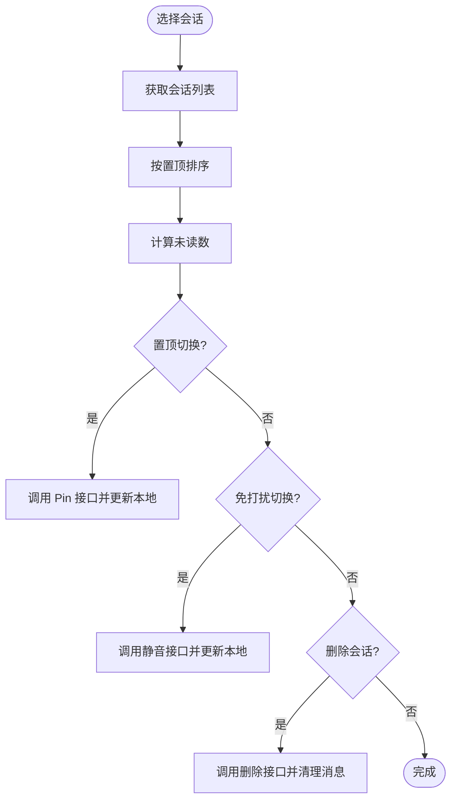
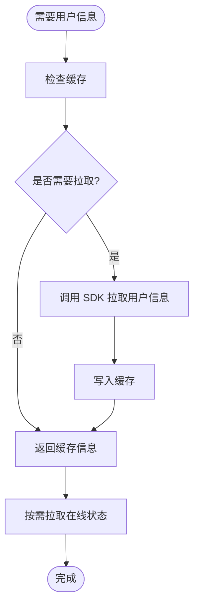
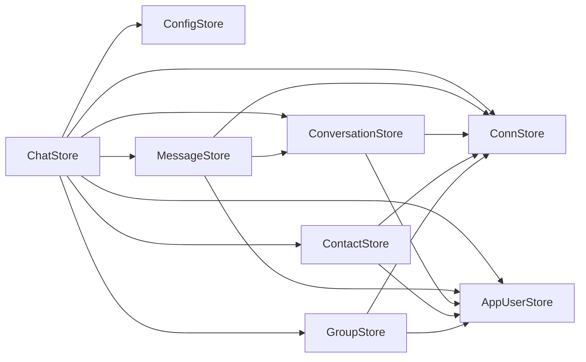

# Store架构概览

<cite>
**本文档引用的文件**
- [ChatUIKit/stores/index.ts](file://ChatUIKit/stores/index.ts)
- [demo/ChatUIKit/stores/index.ts](file://demo/ChatUIKit/stores/index.ts)
- [ChatUIKit/stores/appUser.ts](file://ChatUIKit/stores/appUser.ts)
- [ChatUIKit/stores/chat.ts](file://ChatUIKit/stores/chat.ts)
- [ChatUIKit/stores/conversation.ts](file://ChatUIKit/stores/conversation.ts)
- [ChatUIKit/stores/message.ts](file://ChatUIKit/stores/message.ts)
- [ChatUIKit/stores/contact.ts](file://ChatUIKit/stores/contact.ts)
- [ChatUIKit/stores/group.ts](file://ChatUIKit/stores/group.ts)
- [ChatUIKit/stores/config.ts](file://ChatUIKit/stores/config.ts)
- [ChatUIKit/stores/conn.ts](file://ChatUIKit/stores/conn.ts)
- [ChatUIKit/types/index.ts](file://ChatUIKit/types/index.ts)
- [ChatUIKit/const/index.ts](file://ChatUIKit/const/index.ts)
- [ChatUIKit/sdk.ts](file://ChatUIKit/sdk.ts)
- [ChatUIKit/log.ts](file://ChatUIKit/log.ts)
- [ChatUIKit/modules/Chat/index.vue](file://ChatUIKit/modules/Chat/index.vue)
- [ChatUIKit/index.ts](file://ChatUIKit/index.ts)
- [demo/ChatUIKit/index.ts](file://demo/ChatUIKit/index.ts)
</cite>

## 目录
1. [简介](#简介)
2. [项目结构](#项目结构)
3. [核心组件](#核心组件)
4. [架构总览](#架构总览)
5. [详细组件分析](#详细组件分析)
6. [依赖分析](#依赖分析)
7. [性能考虑](#性能考虑)
8. [故障排查指南](#故障排查指南)
9. [结论](#结论)
10. [附录](#附录)

## 简介
本文件系统性梳理 Easemob UIKit 的 Pinia 状态管理架构，覆盖以下方面：
- 基于 Pinia 的整体架构设计与 Store 创建/注册机制
- Store 间的依赖关系、数据流向与组件间通信模式
- Pinia 迁移带来的优势、响应式更新机制与状态持久化策略
- Store 初始化流程、命名规范与最佳实践
- 单例模式的应用与兼容性处理方案

## 项目结构
Easemob UIKit 的状态管理采用模块化的 Store 设计，每个业务域独立维护一个 Store，并通过统一入口导出与创建。核心目录与文件如下：
- stores 目录：存放各业务 Store（用户、聊天、会话、消息、联系人、群组、配置、连接）
- stores/index.ts：统一导出所有 Store 并提供 createStores 工厂方法
- 类型与常量：types/index.ts 定义跨 Store 的通用类型；const/index.ts 定义常量
- SDK 与日志：sdk.ts 提供 SDK 访问；log.ts 提供统一日志工具
- 组件使用：modules/Chat/index.vue 展示了如何在组件中消费 Store

图表来源
- [ChatUIKit/stores/index.ts](file://ChatUIKit/stores/index.ts#L1-L31)
- [ChatUIKit/stores/appUser.ts](file://ChatUIKit/stores/appUser.ts#L1-L242)
- [ChatUIKit/stores/chat.ts](file://ChatUIKit/stores/chat.ts#L1-L407)
- [ChatUIKit/stores/conversation.ts](file://ChatUIKit/stores/conversation.ts#L1-L421)
- [ChatUIKit/stores/message.ts](file://ChatUIKit/stores/message.ts#L1-L716)
- [ChatUIKit/stores/contact.ts](file://ChatUIKit/stores/contact.ts#L1-L282)
- [ChatUIKit/stores/group.ts](file://ChatUIKit/stores/group.ts#L1-L317)
- [ChatUIKit/stores/config.ts](file://ChatUIKit/stores/config.ts#L1-L124)
- [ChatUIKit/stores/conn.ts](file://ChatUIKit/stores/conn.ts#L1-L84)
- [ChatUIKit/types/index.ts](file://ChatUIKit/types/index.ts#L1-L100)
- [ChatUIKit/const/index.ts](file://ChatUIKit/const/index.ts#L1-L37)
- [ChatUIKit/sdk.ts](file://ChatUIKit/sdk.ts#L1-L13)
- [ChatUIKit/log.ts](file://ChatUIKit/log.ts#L1-L78)

章节来源
- [ChatUIKit/stores/index.ts](file://ChatUIKit/stores/index.ts#L1-L31)
- [demo/ChatUIKit/stores/index.ts](file://demo/ChatUIKit/stores/index.ts#L1-L31)

## 核心组件
本节概述各 Store 的职责与关键能力：
- AppUserStore：用户信息与在线状态管理，提供用户信息缓存、在线状态订阅与发布、自我信息更新等能力
- ChatStore：聊天控制中心，负责 SDK 事件监听、登录/登出、初始数据加载、全局状态协调
- ConversationStore：会话管理，提供会话列表、置顶、免打扰、@ 类型识别、已读标记等
- MessageStore：消息管理，按会话分块存储消息、历史消息拉取、消息发送/撤回/修改、播放音频状态等
- ContactStore：联系人管理，提供联系人列表、好友申请通知、递归获取用户信息等
- GroupStore：群组管理，提供群组列表、详情缓存、创建/解散/退出、通知管理等
- ConfigStore：配置管理，主题与功能开关统一管理
- ConnStore：连接管理，提供 SDK 连接实例的创建、访问与关闭

章节来源
- [ChatUIKit/stores/appUser.ts](file://ChatUIKit/stores/appUser.ts#L1-L242)
- [ChatUIKit/stores/chat.ts](file://ChatUIKit/stores/chat.ts#L1-L407)
- [ChatUIKit/stores/conversation.ts](file://ChatUIKit/stores/conversation.ts#L1-L421)
- [ChatUIKit/stores/message.ts](file://ChatUIKit/stores/message.ts#L1-L716)
- [ChatUIKit/stores/contact.ts](file://ChatUIKit/stores/contact.ts#L1-L282)
- [ChatUIKit/stores/group.ts](file://ChatUIKit/stores/group.ts#L1-L317)
- [ChatUIKit/stores/config.ts](file://ChatUIKit/stores/config.ts#L1-L124)
- [ChatUIKit/stores/conn.ts](file://ChatUIKit/stores/conn.ts#L1-L84)

## 架构总览
Pinia 迁移的核心优势包括：
- 更好的 Vue 生态支持与响应式体验
- 更清晰的模块化与可测试性
- 更直观的开发体验与类型推断

初始化流程与注册机制：
- stores/index.ts 统一导出所有 Store 并提供 createStores 工厂方法
- ChatUIKit/index.ts 与 demo/ChatUIKit/index.ts 提供单例包装类，内部通过延迟初始化确保 Pinia 已激活后再访问 Store
- 组件通过组合式 API 直接使用 useXxxStore() 访问 Store

图表来源
- [ChatUIKit/stores/index.ts](file://ChatUIKit/stores/index.ts#L18-L21)
- [ChatUIKit/index.ts](file://ChatUIKit/index.ts#L31-L36)
- [ChatUIKit/index.ts](file://ChatUIKit/index.ts#L38-L78)
- [demo/ChatUIKit/index.ts](file://demo/ChatUIKit/index.ts#L31-L36)
- [demo/ChatUIKit/index.ts](file://demo/ChatUIKit/index.ts#L38-L78)

## 详细组件分析

### ChatStore：聊天控制中心
职责与关键流程：
- SDK 事件监听：在首次初始化时注册多种事件处理器（连接、消息、联系人、群组、会话等）
- 登录/登出：调用 ConnStore 连接 SDK，初始化事件与初始数据；登出时清理所有 Store
- 初始数据加载：登录成功后加载会话列表、联系人、群组等
- 消息与事件处理：统一协调消息到达、群组事件、联系人事件等

图表来源
- [ChatUIKit/stores/chat.ts](file://ChatUIKit/stores/chat.ts#L299-L328)
- [ChatUIKit/stores/chat.ts](file://ChatUIKit/stores/chat.ts#L377-L396)
- [ChatUIKit/stores/chat.ts](file://ChatUIKit/stores/chat.ts#L67-L221)

章节来源
- [ChatUIKit/stores/chat.ts](file://ChatUIKit/stores/chat.ts#L1-L407)

### MessageStore：消息管理
关键能力：
- 按会话分块存储消息，避免大列表导致的性能问题
- 支持历史消息拉取、消息发送、撤回、修改、删除
- 响应式更新：通过创建新数组/对象的方式确保响应式触发
- 语音播放状态管理与引用/编辑消息状态

图表来源
- [ChatUIKit/stores/message.ts](file://ChatUIKit/stores/message.ts#L214-L284)
- [ChatUIKit/stores/message.ts](file://ChatUIKit/stores/message.ts#L311-L432)
- [ChatUIKit/stores/message.ts](file://ChatUIKit/stores/message.ts#L679-L696)

章节来源
- [ChatUIKit/stores/message.ts](file://ChatUIKit/stores/message.ts#L1-L716)

### ConversationStore：会话管理
关键能力：
- 会话列表与排序（置顶优先）
- 未读数统计（排除免打扰）
- 置顶/取消置顶、免打扰设置、删除会话
- @ 类型识别与已读标记

图表来源
- [ChatUIKit/stores/conversation.ts](file://ChatUIKit/stores/conversation.ts#L126-L160)
- [ChatUIKit/stores/conversation.ts](file://ChatUIKit/stores/conversation.ts#L218-L241)
- [ChatUIKit/stores/conversation.ts](file://ChatUIKit/stores/conversation.ts#L246-L276)
- [ChatUIKit/stores/conversation.ts](file://ChatUIKit/stores/conversation.ts#L281-L309)

章节来源
- [ChatUIKit/stores/conversation.ts](file://ChatUIKit/stores/conversation.ts#L1-L421)

### AppUserStore：用户信息与在线状态
关键能力：
- 用户信息缓存与按需拉取
- 在线状态订阅、取消订阅与发布
- 自我信息更新与清空

图表来源
- [ChatUIKit/stores/appUser.ts](file://ChatUIKit/stores/appUser.ts#L86-L125)
- [ChatUIKit/stores/appUser.ts](file://ChatUIKit/stores/appUser.ts#L130-L159)
- [ChatUIKit/stores/appUser.ts](file://ChatUIKit/stores/appUser.ts#L164-L182)

章节来源
- [ChatUIKit/stores/appUser.ts](file://ChatUIKit/stores/appUser.ts#L1-L242)

### 其他 Store：ContactStore、GroupStore、ConfigStore、ConnStore
- ContactStore：联系人列表、好友申请通知、递归获取用户信息
- GroupStore：群组列表、详情缓存、创建/解散/退出、通知管理
- ConfigStore：主题与功能开关统一管理
- ConnStore：SDK 连接实例的创建、访问与关闭

章节来源
- [ChatUIKit/stores/contact.ts](file://ChatUIKit/stores/contact.ts#L1-L282)
- [ChatUIKit/stores/group.ts](file://ChatUIKit/stores/group.ts#L1-L317)
- [ChatUIKit/stores/config.ts](file://ChatUIKit/stores/config.ts#L1-L124)
- [ChatUIKit/stores/conn.ts](file://ChatUIKit/stores/conn.ts#L1-L84)

## 依赖分析
Store 之间的耦合与协作：
- ChatStore 作为控制中心，协调 ConnStore、ConfigStore、AppUserStore、ContactStore、ConversationStore、GroupStore、MessageStore
- MessageStore 与 ConversationStore 双向协作：消息变更驱动会话更新，会话变更影响消息渲染
- AppUserStore 为多个 Store 提供用户信息与在线状态支撑
- ConfigStore 为各 Store 提供功能开关与主题配置

图表来源
- [ChatUIKit/stores/chat.ts](file://ChatUIKit/stores/chat.ts#L10-L20)
- [ChatUIKit/stores/message.ts](file://ChatUIKit/stores/message.ts#L13-L18)
- [ChatUIKit/stores/conversation.ts](file://ChatUIKit/stores/conversation.ts#L19-L25)

章节来源
- [ChatUIKit/stores/chat.ts](file://ChatUIKit/stores/chat.ts#L1-L407)
- [ChatUIKit/stores/message.ts](file://ChatUIKit/stores/message.ts#L1-L716)
- [ChatUIKit/stores/conversation.ts](file://ChatUIKit/stores/conversation.ts#L1-L421)

## 性能考虑
- 按会话分块存储消息，限制每会话最大消息数，避免内存膨胀
- 使用新数组/对象替换确保响应式更新，减少不必要的重渲染
- 按需拉取用户信息与在线状态，避免一次性请求过多数据
- 使用计算属性缓存未读数、排序结果等派生状态
- 事件处理中对重复消息进行去重与增量更新

## 故障排查指南
常见问题与定位建议：
- 连接未初始化：检查 ConnStore 是否已 setChatConn 或 initChatConn
- 事件未触发：确认 ChatStore.initSDKEvent 是否执行且未重复初始化
- 用户信息缺失：检查 AppUserStore.getUsersInfoFromServer 的调用与过滤逻辑
- 消息未渲染：检查 MessageStore.addMessageToMap 与 ConversationStore.updateConversationLastMessage 的调用链
- 功能开关失效：检查 ConfigStore.getFeatureConfig 的读取与更新

章节来源
- [ChatUIKit/stores/conn.ts](file://ChatUIKit/stores/conn.ts#L25-L40)
- [ChatUIKit/stores/chat.ts](file://ChatUIKit/stores/chat.ts#L67-L221)
- [ChatUIKit/stores/appUser.ts](file://ChatUIKit/stores/appUser.ts#L86-L125)
- [ChatUIKit/stores/message.ts](file://ChatUIKit/stores/message.ts#L164-L193)
- [ChatUIKit/stores/conversation.ts](file://ChatUIKit/stores/conversation.ts#L344-L354)
- [ChatUIKit/stores/config.ts](file://ChatUIKit/stores/config.ts#L65-L80)

## 结论
Easemob UIKit 的 Pinia 架构通过清晰的模块划分与统一入口，实现了高内聚、低耦合的状态管理。ChatStore 作为控制中心协调各 Store，配合响应式更新与按需加载策略，有效提升了性能与可维护性。单例包装类与延迟初始化机制保证了在不同运行环境下的兼容性。

## 附录

### Store 初始化流程与命名规范
- 初始化流程
  - 在应用入口调用 stores/index.ts 的 createStores() 创建 Pinia 实例
  - 通过 setActivePinia 将实例设为全局活跃状态
  - 通过 ChatKIT 单例的 getter 延迟初始化各 Store
- 命名规范
  - Store 文件：小驼峰，如 appUser.ts、conversation.ts、message.ts
  - Store 导出：useXxxStore，如 useAppUserStore、useConversationStore
  - Store 名称：defineStore('xxx', ...)，如 'appUser'、'conversation'、'message'

章节来源
- [ChatUIKit/stores/index.ts](file://ChatUIKit/stores/index.ts#L18-L31)
- [ChatUIKit/index.ts](file://ChatUIKit/index.ts#L31-L36)
- [ChatUIKit/index.ts](file://ChatUIKit/index.ts#L38-L78)

### 组件间通信模式
- 组合式 API：在组件中直接导入并使用 useXxxStore()
- 计算属性与侦听器：computed/watch 监听 Store 状态变化
- 事件与回调：通过组件事件传递 Store 状态与动作

章节来源
- [ChatUIKit/modules/Chat/index.vue](file://ChatUIKit/modules/Chat/index.vue#L88-L101)
- [ChatUIKit/modules/Chat/index.vue](file://ChatUIKit/modules/Chat/index.vue#L121-L134)

### 类型与常量
- 类型定义：集中于 types/index.ts，涵盖消息体、会话、联系人、群组、状态等
- 常量定义：集中于 const/index.ts，包含资源 URL、最大消息数、@ 标识等

章节来源
- [ChatUIKit/types/index.ts](file://ChatUIKit/types/index.ts#L1-L100)
- [ChatUIKit/const/index.ts](file://ChatUIKit/const/index.ts#L1-L37)