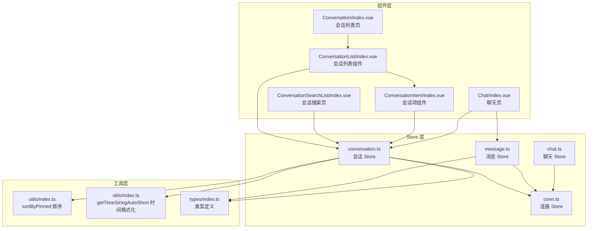
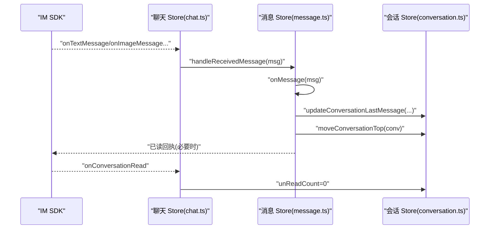
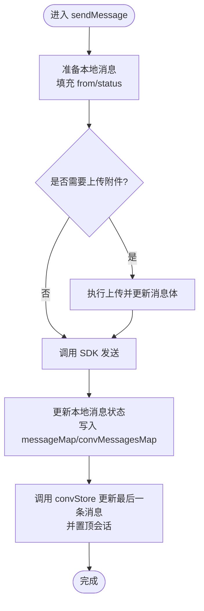
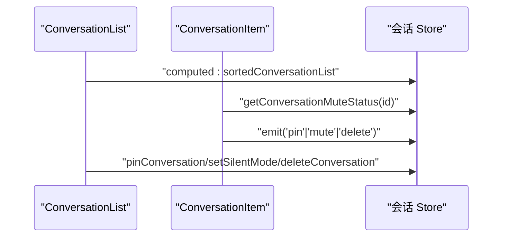
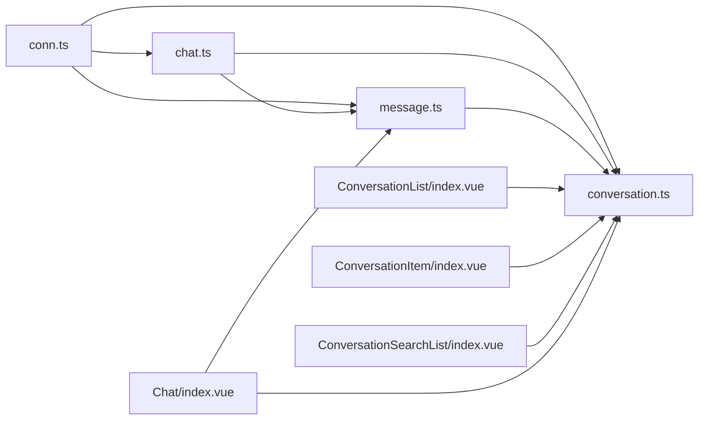

# 会话状态管理

<cite>
**本文档引用的文件**
- [conversation.ts](file://ChatUIKit/stores/conversation.ts)
- [index.vue](file://ChatUIKit/modules/Conversation/index.vue)
- [ConversationList/index.vue](file://ChatUIKit/modules/Conversation/components/ConversationList/index.vue)
- [ConversationItem/index.vue](file://ChatUIKit/modules/Conversation/components/ConversationItem/index.vue)
- [ConversationSearchList/index.vue](file://ChatUIKit/modules/ConversationSearchList/index.vue)
- [message.ts](file://ChatUIKit/stores/message.ts)
- [conn.ts](file://ChatUIKit/stores/conn.ts)
- [chat.ts](file://ChatUIKit/stores/chat.ts)
- [index.vue](file://ChatUIKit/modules/Chat/index.vue)
- [index.ts](file://ChatUIKit/types/index.ts)
- [index.ts](file://ChatUIKit/utils/index.ts)
</cite>

## 更新摘要
**变更内容**
- 修正了 `setSilentModeForConversation` 方法的 SDK 参数格式，采用标准的 `{ conversationId, type, options }` 结构
- 修正了 `pinConversation` 方法的 SDK 参数格式，采用标准的 `{ conversationId, conversationType, isPinned }` 结构
- 简化了置顶功能实现，移除了复杂的置顶状态管理逻辑
- 优化了免打扰设置的 SDK 调用，区分单聊和群聊的不同参数格式

## 目录
1. [简介](#简介)
2. [项目结构](#项目结构)
3. [核心组件](#核心组件)
4. [架构概览](#架构概览)
5. [详细组件分析](#详细组件分析)
6. [依赖关系分析](#依赖关系分析)
7. [性能考虑](#性能考虑)
8. [故障排查指南](#故障排查指南)
9. [结论](#结论)

## 简介
本文件系统性阐述 Easemob UIKit 的会话状态管理机制，涵盖会话列表的存储与管理、会话状态的维护与更新流程、会话的创建/排序/置顶/删除功能、未读消息统计、会话最后一条消息管理、会话搜索、响应式更新与实时同步、会话配置与免打扰设置以及会话清理策略。目标是帮助开发者快速理解并高效使用会话状态管理模块。

## 项目结构
会话状态管理主要由以下层次构成：
- Store 层：会话 Store、消息 Store、连接 Store、聊天 Store
- 组件层：会话列表页面、会话项组件、会话搜索页面
- 工具层：排序工具、时间格式化工具、类型定义
- 类型层：统一的消息与会话类型定义



**图表来源**
- [conversation.ts](file://ChatUIKit/stores/conversation.ts#L1-L421)
- [message.ts](file://ChatUIKit/stores/message.ts#L1-L581)
- [conn.ts](file://ChatUIKit/stores/conn.ts#L1-L84)
- [chat.ts](file://ChatUIKit/stores/chat.ts#L1-L407)
- [ConversationList/index.vue](file://ChatUIKit/modules/Conversation/components/ConversationList/index.vue#L1-L158)
- [ConversationItem/index.vue](file://ChatUIKit/modules/Conversation/components/ConversationItem/index.vue#L1-L260)
- [ConversationSearchList/index.vue](file://ChatUIKit/modules/ConversationSearchList/index.vue#L1-L121)
- [Chat/index.vue](file://ChatUIKit/modules/Chat/index.vue#L1-L255)
- [index.ts](file://ChatUIKit/utils/index.ts#L184-L197)
- [index.ts](file://ChatUIKit/types/index.ts#L1-L100)

**章节来源**
- [conversation.ts](file://ChatUIKit/stores/conversation.ts#L1-L421)
- [message.ts](file://ChatUIKit/stores/message.ts#L1-L581)
- [conn.ts](file://ChatUIKit/stores/conn.ts#L1-L84)
- [chat.ts](file://ChatUIKit/stores/chat.ts#L1-L407)
- [ConversationList/index.vue](file://ChatUIKit/modules/Conversation/components/ConversationList/index.vue#L1-L158)
- [ConversationItem/index.vue](file://ChatUIKit/modules/Conversation/components/ConversationItem/index.vue#L1-L260)
- [ConversationSearchList/index.vue](file://ChatUIKit/modules/ConversationSearchList/index.vue#L1-L121)
- [Chat/index.vue](file://ChatUIKit/modules/Chat/index.vue#L1-L255)
- [index.ts](file://ChatUIKit/utils/index.ts#L184-L197)
- [index.ts](file://ChatUIKit/types/index.ts#L1-L100)

## 核心组件
- 会话 Store（conversation.ts）：负责会话列表的存储、排序、置顶、免打扰、删除、最后一条消息更新、@ 类型标记、总未读数计算等。
- 消息 Store（message.ts）：负责消息的存储、历史消息拉取、消息发送/接收处理、消息状态更新、会话最后一条消息联动更新。
- 连接 Store（conn.ts）：提供 IM SDK 连接实例的安全访问与生命周期管理。
- 聊天 Store（chat.ts）：协调 SDK 事件监听、登录登出、初始数据加载、会话相关事件处理（置顶/取消置顶、免打扰/取消免打扰、会话删除、已读回执）。
- 会话组件（ConversationList/Item）：负责 UI 呈现、交互操作（置顶/免打扰/删除）、滑动菜单、搜索入口。
- 会话搜索（ConversationSearchList）：基于会话列表进行名称过滤搜索。
- 工具函数（utils/index.ts）：提供会话排序、时间格式化等工具。
- 类型定义（types/index.ts）：统一的消息体、会话项、@ 类型等类型声明。

**章节来源**
- [conversation.ts](file://ChatUIKit/stores/conversation.ts#L27-L47)
- [message.ts](file://ChatUIKit/stores/message.ts#L25-L55)
- [conn.ts](file://ChatUIKit/stores/conn.ts#L15-L40)
- [chat.ts](file://ChatUIKit/stores/chat.ts#L22-L52)
- [ConversationList/index.vue](file://ChatUIKit/modules/Conversation/components/ConversationList/index.vue#L33-L106)
- [ConversationItem/index.vue](file://ChatUIKit/modules/Conversation/components/ConversationItem/index.vue#L94-L255)
- [ConversationSearchList/index.vue](file://ChatUIKit/modules/ConversationSearchList/index.vue#L35-L89)
- [index.ts](file://ChatUIKit/utils/index.ts#L184-L197)
- [index.ts](file://ChatUIKit/types/index.ts#L63-L65)

## 架构概览
会话状态管理采用 Pinia Store + Vue 组件的响应式架构：
- Store 之间通过依赖注入协作：会话 Store 依赖连接 Store 获取 SDK 实例；消息 Store 在发送/接收消息时联动更新会话 Store 的最后一条消息与未读数；聊天 Store 统一注册 SDK 事件并分发到各 Store。
- 组件层通过 computed/computed/watch 管理响应式状态，避免手动订阅/取消订阅。
- 工具层提供稳定的排序与格式化能力，保证 UI 表现一致性。



**图表来源**
- [chat.ts](file://ChatUIKit/stores/chat.ts#L90-L130)
- [message.ts](file://ChatUIKit/stores/message.ts#L341-L388)
- [conversation.ts](file://ChatUIKit/stores/conversation.ts#L344-L354)

**章节来源**
- [chat.ts](file://ChatUIKit/stores/chat.ts#L67-L221)
- [message.ts](file://ChatUIKit/stores/message.ts#L341-L388)
- [conversation.ts](file://ChatUIKit/stores/conversation.ts#L344-L354)

## 详细组件分析

### 会话 Store（conversation.ts）
- 状态结构
  - 会话列表：UIKITConversationItem[]
  - 当前会话：ConversationBaseInfo | null
  - 免打扰映射：Record<string, boolean>
  - 分页参数：pageParams/pinParams
- 计算属性
  - 总未读数：排除免打扰会话的未读数累加
  - 排序后的会话列表：置顶优先，再按最后消息时间降序
  - 按 ID 获取会话、获取免打扰状态、当前会话 ID、格式化时间
- 动作方法
  - 从消息推导会话 ID（单聊区分方向）
  - 设置当前会话
  - 获取会话列表（含空会话）
  - 获取置顶会话列表（标记 isPinned）
  - 合并会话列表（保留本地置顶/时间）
  - 置顶/取消置顶（调用 SDK 并更新本地）
  - 设置免打扰（调用 SDK 并更新本地映射）
  - 删除会话（调用 SDK，移除列表并清理消息）
  - 标记已读（发送已读回执并清零未读）
  - 更新最后一条消息（lastMessage/unReadCount）
  - 移动到顶部（提升优先级）
  - 创建新会话（首次消息触发）
  - 设置 @ 类型（根据消息内容识别 ALL/ME/NONE）
  - 清空数据

```mermaid
classDiagram
class ConversationStore {
+conversationList : UIKITConversationItem[]
+currConversation : ConversationBaseInfo|null
+muteConvsMap : Record<string, boolean>
+pageParams : {pageSize, cursor}
+pinParams : {pageSize, cursor}
+totalUnreadCount() : number
+sortedConversationList() : UIKITConversationItem[]
+getConversationById(id) : UIKITConversationItem
+getConversationMuteStatus(id) : boolean
+getCurrentConversationId() : string
+getConversationTime(message?) : string
+getCvsIdFromMessage(msg) : string
+setCurrentConversation(conv) : void
+getConversationList(cursor?) : Promise
+getServerPinnedConversations(cursor?) : Promise
+mergeConversations(list) : void
+pinConversation(conv, isPinned) : Promise
+setSilentModeForConversation(conv, isMute) : Promise
+deleteConversation(conv) : Promise
+markConversationRead(conv) : Promise
+updateConversationLastMessage(conv, msg, unReadCount) : void
+moveConversationTop(conv) : void
+createConversation(conv, msg, unReadCount) : UIKITConversationItem
+setAtTypeByMessage(msg) : void
+clear() : void
}
```

**图表来源**
- [conversation.ts](file://ChatUIKit/stores/conversation.ts#L27-L421)

**章节来源**
- [conversation.ts](file://ChatUIKit/stores/conversation.ts#L27-L421)

### 消息 Store（message.ts）
- 状态结构
  - messageMap：消息 ID -> MixedMessageBody
  - conversationMessagesMap：会话 ID -> {messageIds[], cursor, isLast, isGetHistoryMessage?}
  - 播放语音消息 ID、引用消息、编辑消息
- 动作方法
  - 添加/移除消息到映射表
  - 获取历史消息（分页、合并、游标）
  - 插入新消息到会话消息列表
  - 发送消息（本地预存、上传附件、发送、更新状态、更新会话）
  - 处理接收到的消息（@ 类型、未读数、置顶、已读回执）
  - 撤回消息（本地标记、更新会话最后一条消息）
  - 删除消息（远端删除、本地清理）
  - 更新消息状态（发送中/已发送/已读/失败）
  - 清理超量消息（按最大条数限制）
  - 清空会话消息/清空所有数据



**图表来源**
- [message.ts](file://ChatUIKit/stores/message.ts#L223-L336)
- [conversation.ts](file://ChatUIKit/stores/conversation.ts#L314-L339)

**章节来源**
- [message.ts](file://ChatUIKit/stores/message.ts#L108-L581)

### 连接 Store（conn.ts）
- 提供 SDK 连接实例的安全访问
- 初始化/关闭连接
- 清空状态

**章节来源**
- [conn.ts](file://ChatUIKit/stores/conn.ts#L15-L84)

### 聊天 Store（chat.ts）
- 初始化 SDK 事件监听（连接状态、消息类型、撤回、已读、联系人、群组、会话）
- 处理接收到的消息（委派给消息 Store，并异步获取用户信息）
- 处理群组事件（成员变化、群信息更新、解散/移出等）
- 登录/登出（初始化事件、加载初始数据、清空 Store）
- 初始数据加载（会话列表 + 置顶会话 + 联系人 + 群组）

**章节来源**
- [chat.ts](file://ChatUIKit/stores/chat.ts#L67-L221)
- [chat.ts](file://ChatUIKit/stores/chat.ts#L299-L396)

### 会话组件（ConversationList/Item）
- 会话列表组件
  - 使用 computed 引用会话 Store 的排序列表
  - 提供置顶/免打扰/删除操作回调
  - 左滑菜单控制与确认删除
  - 搜索入口跳转
- 会话项组件
  - 显示头像、名称、@ 标签、最后一条消息、时间、未读数
  - 免打扰图标显示
  - 滑动菜单（免打扰/置顶/删除）
  - 跳转聊天页



**图表来源**
- [ConversationList/index.vue](file://ChatUIKit/modules/Conversation/components/ConversationList/index.vue#L33-L106)
- [ConversationItem/index.vue](file://ChatUIKit/modules/Conversation/components/ConversationItem/index.vue#L94-L255)
- [conversation.ts](file://ChatUIKit/stores/conversation.ts#L218-L276)

**章节来源**
- [ConversationList/index.vue](file://ChatUIKit/modules/Conversation/components/ConversationList/index.vue#L33-L106)
- [ConversationItem/index.vue](file://ChatUIKit/modules/Conversation/components/ConversationItem/index.vue#L94-L255)

### 会话搜索（ConversationSearchList）
- 基于输入值过滤会话列表
- 单聊匹配用户昵称，群聊匹配群名称
- 点击跳转聊天页

**章节来源**
- [ConversationSearchList/index.vue](file://ChatUIKit/modules/ConversationSearchList/index.vue#L35-L89)

### 工具与类型
- 排序：sortByPinned（置顶优先，再按最后消息时间降序）
- 时间格式化：getTimeStringAutoShort（人性化时间显示）
- 类型：UIKITConversationItem、MixedMessageBody、AT_TYPE 等

**章节来源**
- [index.ts](file://ChatUIKit/utils/index.ts#L184-L197)
- [index.ts](file://ChatUIKit/utils/index.ts#L31-L78)
- [index.ts](file://ChatUIKit/types/index.ts#L54-L65)

## 依赖关系分析
- 会话 Store 依赖连接 Store 获取 SDK 实例，用于调用服务器接口（获取会话、置顶、免打扰、删除、已读回执）。
- 消息 Store 在发送/接收消息时更新会话 Store 的 lastMessage 与 unReadCount，并将会话置顶。
- 聊天 Store 注册 SDK 事件，将事件分发到会话/消息/联系人/群组 Store，实现全局状态同步。
- 组件层通过 Pinia 的 computed/watch 自动追踪依赖，无需手动订阅/取消订阅。



**图表来源**
- [conn.ts](file://ChatUIKit/stores/conn.ts#L29-L34)
- [conversation.ts](file://ChatUIKit/stores/conversation.ts#L19-L22)
- [message.ts](file://ChatUIKit/stores/message.ts#L18-L21)
- [chat.ts](file://ChatUIKit/stores/chat.ts#L12-L18)
- [ConversationList/index.vue](file://ChatUIKit/modules/Conversation/components/ConversationList/index.vue#L40-L46)
- [ConversationItem/index.vue](file://ChatUIKit/modules/Conversation/components/ConversationItem/index.vue#L98-L122)
- [ConversationSearchList/index.vue](file://ChatUIKit/modules/ConversationSearchList/index.vue#L42-L51)
- [Chat/index.vue](file://ChatUIKit/modules/Chat/index.vue#L98-L101)

**章节来源**
- [conn.ts](file://ChatUIKit/stores/conn.ts#L29-L34)
- [conversation.ts](file://ChatUIKit/stores/conversation.ts#L19-L22)
- [message.ts](file://ChatUIKit/stores/message.ts#L18-L21)
- [chat.ts](file://ChatUIKit/stores/chat.ts#L12-L18)
- [ConversationList/index.vue](file://ChatUIKit/modules/Conversation/components/ConversationList/index.vue#L40-L46)
- [ConversationItem/index.vue](file://ChatUIKit/modules/Conversation/components/ConversationItem/index.vue#L98-L122)
- [ConversationSearchList/index.vue](file://ChatUIKit/modules/ConversationSearchList/index.vue#L42-L51)
- [Chat/index.vue](file://ChatUIKit/modules/Chat/index.vue#L98-L101)

## 性能考虑
- 计算属性缓存：会话总未读数与排序列表通过计算属性缓存，避免重复计算。
- 响应式优化：组件使用 computed/watch 自动追踪依赖，减少手动订阅开销。
- 分页与游标：会话列表与置顶会话列表采用分页游标，降低一次性加载压力。
- 消息清理：超过阈值的消息会被清理，防止内存膨胀。
- 排序算法：sortByPinned 仅比较置顶状态与最后消息时间，时间复杂度 O(n log n)，满足移动端性能要求。

## 故障排查指南
- 无法获取会话列表
  - 检查连接 Store 是否已初始化 SDK 实例
  - 确认聊天 Store 是否已初始化 SDK 事件
  - 查看会话 Store 的 getConversationList 是否抛错
- 置顶/免打扰无效
  - 确认 SDK 事件已初始化
  - 检查 onConversationPinned/onMuted/onUnMuted 回调是否被触发
  - 核对本地状态更新逻辑（isPinned/pinnedTime/muteConvsMap）
- 未读数不更新
  - 检查消息 Store 的 onMessage 是否正确累加未读数
  - 确认聊天 Store 的 onConversationRead 是否将 unReadCount 置零
- 已读回执未生效
  - 检查 markConversationRead 是否发送了已读回执
  - 确认 SDK 回调 onReadMessage 是否更新消息状态
- 搜索无结果
  - 确认输入值存在且会话列表已渲染
  - 检查单聊/群聊的匹配逻辑（用户昵称/群名称）

**章节来源**
- [conn.ts](file://ChatUIKit/stores/conn.ts#L29-L34)
- [chat.ts](file://ChatUIKit/stores/chat.ts#L67-L221)
- [message.ts](file://ChatUIKit/stores/message.ts#L341-L388)
- [conversation.ts](file://ChatUIKit/stores/conversation.ts#L314-L339)
- [ConversationSearchList/index.vue](file://ChatUIKit/modules/ConversationSearchList/index.vue#L57-L72)

## 结论
Easemob UIKit 的会话状态管理以 Pinia 为核心，结合 Vue 响应式系统与 SDK 事件驱动，实现了会话列表的高效存储与实时同步。通过计算属性缓存、分页游标、消息清理与工具函数的标准化，系统在保证功能完整性的同时兼顾了性能与可维护性。开发者可基于此架构扩展更多会话特性，如会话标签、多设备同步、离线消息等。

**更新** 本次更新反映了 SDK 参数格式的标准化改进，包括：
- `setSilentModeForConversation` 方法现在使用标准的 `{ conversationId, type, options }` 参数结构
- `pinConversation` 方法现在使用标准的 `{ conversationId, conversationType, isPinned }` 参数结构
- 免打扰设置针对单聊和群聊采用了不同的参数格式（单聊使用 `type: 'chat'`，群聊使用 `type: 'groupchat'`）
- 置顶功能实现得到简化，移除了复杂的置顶状态管理逻辑，直接通过 SDK 接口进行置顶操作