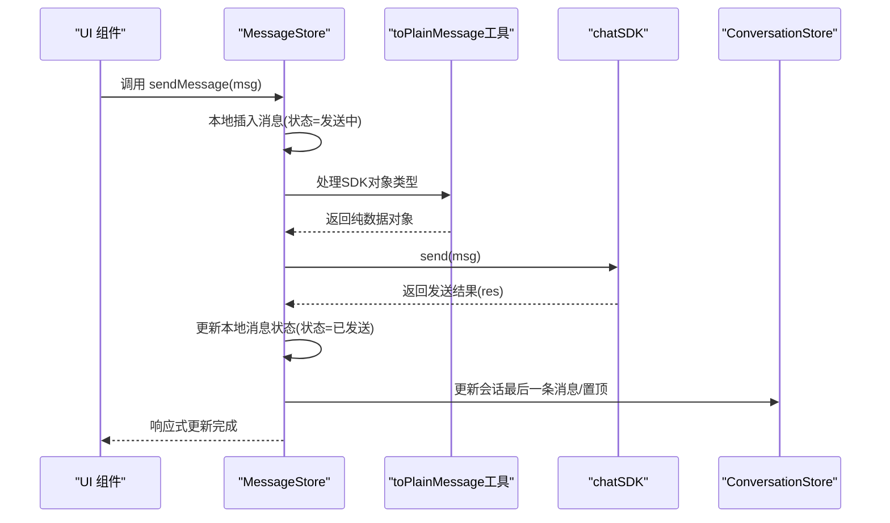
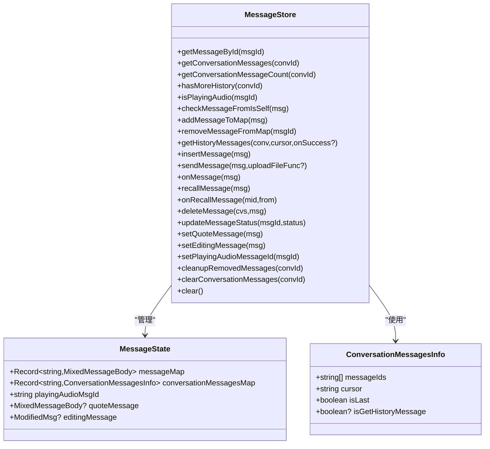
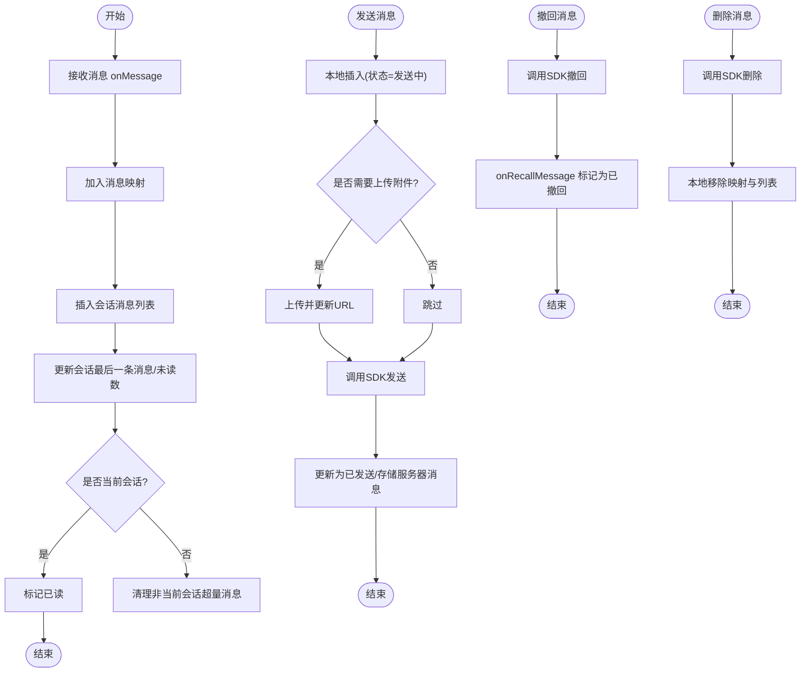
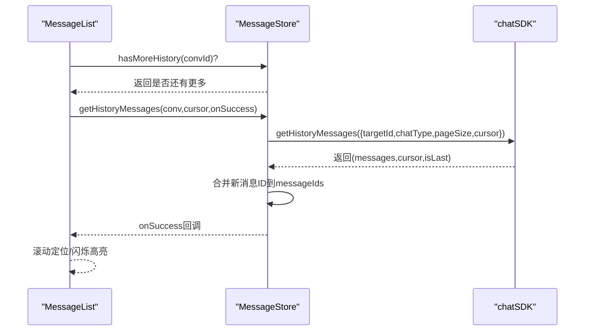
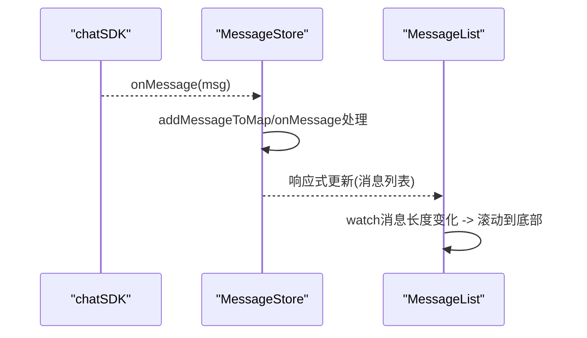
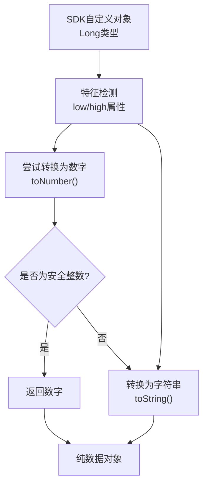
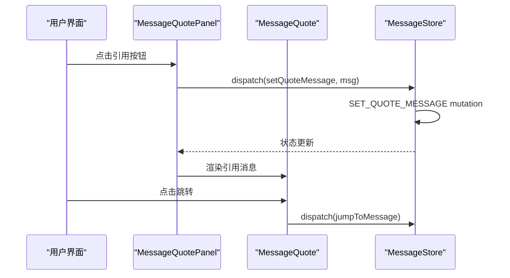
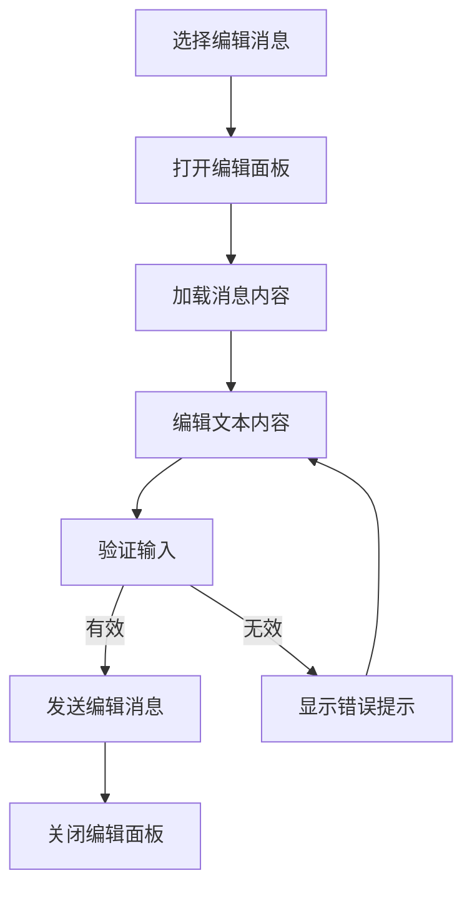
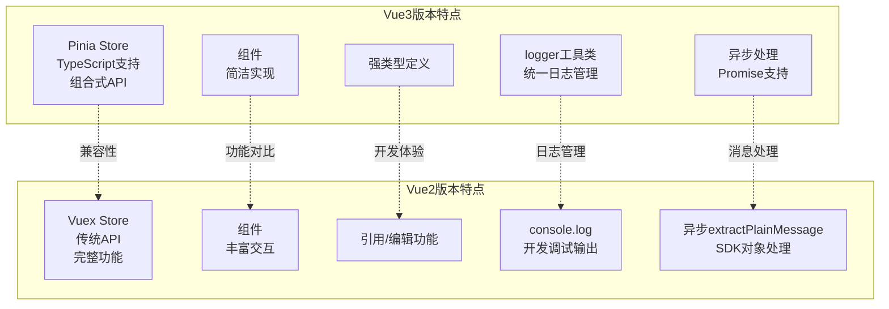
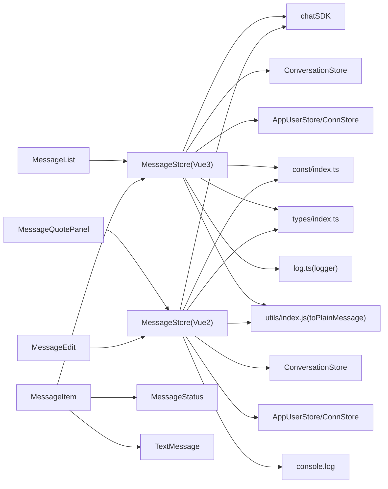

# 消息状态管理

<cite>
**本文档引用的文件**
- [ChatUIKit/stores/message.ts](file://ChatUIKit/stores/message.ts)
- [demo/ChatUIKit/stores/message.ts](file://demo/ChatUIKit/stores/message.ts)
- [ChatUIKit-vue2/stores/message.js](file://ChatUIKit-vue2/stores/message.js)
- [vue2-demo/ChatUIKit/stores/message.js](file://vue2-demo/ChatUIKit/stores/message.js)
- [ChatUIKit/modules/Chat/components/Message/messageStatus.vue](file://ChatUIKit/modules/Chat/components/Message/messageStatus.vue)
- [demo/ChatUIKit/modules/Chat/components/Message/messageStatus.vue](file://demo/ChatUIKit/modules/Chat/components/Message/messageStatus.vue)
- [ChatUIKit-vue2/modules/Chat/components/Message/messageStatus.vue](file://ChatUIKit-vue2/modules/Chat/components/Message/messageStatus.vue)
- [ChatUIKit/modules/Chat/components/Message/messageItem.vue](file://ChatUIKit/modules/Chat/components/Message/messageItem.vue)
- [demo/ChatUIKit/modules/Chat/components/Message/messageItem.vue](file://demo/ChatUIKit/modules/Chat/components/Message/messageItem.vue)
- [ChatUIKit-vue2/modules/Chat/components/Message/messageItem.vue](file://ChatUIKit-vue2/modules/Chat/components/Message/messageItem.vue)
- [ChatUIKit/modules/Chat/components/Message/messageList.vue](file://ChatUIKit/modules/Chat/components/Message/messageList.vue)
- [demo/ChatUIKit/modules/Chat/components/Message/messageList.vue](file://demo/ChatUIKit/modules/Chat/components/Message/messageList.vue)
- [ChatUIKit-vue2/modules/Chat/components/Message/messageList.vue](file://ChatUIKit-vue2/modules/Chat/components/Message/messageList.vue)
- [ChatUIKit/modules/Chat/components/Message/messageTxt.vue](file://ChatUIKit/modules/Chat/components/Message/messageTxt.vue)
- [demo/ChatUIKit/modules/Chat/components/Message/messageTxt.vue](file://demo/ChatUIKit/modules/Chat/components/Message/messageTxt.vue)
- [ChatUIKit-vue2/modules/Chat/components/Message/messageTxt.vue](file://ChatUIKit-vue2/modules/Chat/components/Message/messageTxt.vue)
- [ChatUIKit/modules/Chat/components/Message/messageQuote.vue](file://ChatUIKit/modules/Chat/components/Message/messageQuote.vue)
- [ChatUIKit-vue2/modules/Chat/components/Message/messageQuote.vue](file://ChatUIKit-vue2/modules/Chat/components/Message/messageQuote.vue)
- [ChatUIKit/modules/Chat/components/Message/messageQuotePanel.vue](file://ChatUIKit/modules/Chat/components/Message/messageQuotePanel.vue)
- [ChatUIKit-vue2/modules/Chat/components/Message/messageQuotePanel.vue](file://ChatUIKit-vue2/modules/Chat/components/Message/messageQuotePanel.vue)
- [ChatUIKit/modules/Chat/components/Message/messageEdit.vue](file://ChatUIKit/modules/Chat/components/Message/messageEdit.vue)
- [ChatUIKit-vue2/modules/Chat/components/Message/messageEdit.vue](file://ChatUIKit-vue2/modules/Chat/components/Message/messageEdit.vue)
- [ChatUIKit/types/index.ts](file://ChatUIKit/types/index.ts)
- [demo/ChatUIKit/types/index.ts](file://demo/ChatUIKit/types/index.ts)
- [ChatUIKit/const/index.ts](file://ChatUIKit/const/index.ts)
- [demo/ChatUIKit/const/index.ts](file://demo/ChatUIKit/const/index.ts)
- [ChatUIKit/sdk.ts](file://ChatUIKit/sdk.ts)
- [demo/ChatUIKit/sdk.ts](file://demo/ChatUIKit/sdk.ts)
- [ChatUIKit/log.ts](file://ChatUIKit/log.ts)
- [demo/ChatUIKit/log.ts](file://demo/ChatUIKit/log.ts)
- [ChatUIKit-vue2/utils/index.js](file://ChatUIKit-vue2/utils/index.js)
- [ChatUIKit/utils/index.ts](file://ChatUIKit/utils/index.ts)
- [ChatUIKit-vue2/stores/conversation.js](file://ChatUIKit-vue2/stores/conversation.js)
- [vue2-demo/ChatUIKit/stores/conversation.js](file://vue2-demo/ChatUIKit/stores/conversation.js)
</cite>

## 更新摘要
**所做更改**
- extractPlainMessage函数转换为异步函数，增强SDK对象类型处理能力
- 改进SDK对象类型处理，新增toPlainMessage工具函数处理Long类型等SDK自定义对象
- 增强消息发送错误处理和日志记录机制
- 改进消息插入可靠性，优化消息状态更新流程
- 完善消息发送过程中的服务器消息ID提取逻辑

## 目录
1. [简介](#简介)
2. [项目结构](#项目结构)
3. [核心组件](#核心组件)
4. [架构总览](#架构总览)
5. [详细组件分析](#详细组件分析)
6. [Vue2版本特有功能](#vue2版本特有功能)
7. [跨版本对比分析](#跨版本对比分析)
8. [依赖关系分析](#依赖关系分析)
9. [性能考虑](#性能考虑)
10. [故障排除指南](#故障排除指南)
11. [结论](#结论)

## 简介
本文件系统性阐述 Easemob UIKit 的消息状态管理机制，覆盖消息存储结构、消息状态跟踪、消息生命周期管理、接收/发送/状态更新/删除流程、排序与分页加载、缓存策略、响应式更新与实时同步、冲突解决、消息类型处理、附件管理以及消息搜索能力。特别针对新增的 Vue2 版本，详细分析其完整的消息状态管理实现，包括消息存储、历史消息获取、消息编辑状态、引用消息状态等核心功能。

**更新** 本次更新重点增强了消息处理能力，包括extractPlainMessage函数的异步化、SDK对象类型处理的改进、消息发送错误处理的增强以及消息插入可靠性的提升。

## 项目结构
围绕消息状态管理的关键目录与文件如下：
- 存储层：Pinia Store（Vue3）与 Vuex Store（Vue2）消息与会话状态集中管理
- 视图层：消息项、消息列表、状态指示器等组件
- 类型与常量：统一的消息状态枚举、混合消息体类型、最大消息数常量
- SDK 封装：对底层聊天 SDK 的统一封装与调用入口
- 日志工具：统一的日志管理工具类，支持调试模式控制
- 工具函数：SDK对象类型处理工具，解决微信小程序中JSON序列化问题

```mermaid
graph TB
subgraph "Vue3版本存储层"
MS["MessageStore<br/>Pinia Store<br/>消息状态管理"]
CS["ConversationStore<br/>会话状态管理"]
US["UserStore/AppUserStore<br/>用户信息"]
end
subgraph "Vue2版本存储层"
VMS["MessageStore<br/>Vuex Store<br/>消息状态管理"]
VCS["ConversationStore<br/>会话状态管理"]
VUS["UserStore/AppUserStore<br/>用户信息"]
end
subgraph "视图层"
ML["MessageList<br/>消息列表"]
MI["MessageItem<br/>单条消息项"]
ST["MessageStatus<br/>状态指示器"]
TX["TextMessage<br/>文本消息渲染"]
QE["MessageQuotePanel<br/>引用面板"]
ED["MessageEdit<br/>编辑面板"]
end
subgraph "类型与常量"
T["types/index.ts<br/>MixedMessageBody/MessageStatus"]
C["const/index.ts<br/>MAX_MESSAGES_PER_CONVERSATION"]
L["log.ts<br/>Logger工具类"]
TM["utils/index.js<br/>toPlainMessage工具函数"]
end
subgraph "SDK"
SDK["sdk.ts<br/>chatSDK 封装"]
end
ML --> MI
MI --> ST
MI --> TX
QE --> VMS
ED --> VMS
ML --> MS
MI --> MS
MS --> CS
MS --> US
MS --> SDK
MS --> L
MS --> TM
VMS --> VCS
VMS --> VUS
VMS --> SDK
VMS --> L
VMS --> TM
T --> MS
C --> MS
```

**图表来源**
- [ChatUIKit/stores/message.ts:11-23](file://ChatUIKit/stores/message.ts#L11-L23)
- [ChatUIKit-vue2/stores/message.js:1-7](file://ChatUIKit-vue2/stores/message.js#L1-L7)
- [ChatUIKit/modules/Chat/components/Message/messageList.vue:52-284](file://ChatUIKit/modules/Chat/components/Message/messageList.vue#L52-L284)
- [ChatUIKit-vue2/modules/Chat/components/Message/messageList.vue:51-311](file://ChatUIKit-vue2/modules/Chat/components/Message/messageList.vue#L51-L311)
- [ChatUIKit/log.ts:1-78](file://ChatUIKit/log.ts#L1-L78)
- [ChatUIKit-vue2/utils/index.js:1-45](file://ChatUIKit-vue2/utils/index.js#L1-L45)

**章节来源**
- [ChatUIKit/stores/message.ts:1-581](file://ChatUIKit/stores/message.ts#L1-L581)
- [ChatUIKit-vue2/stores/message.js:1-601](file://ChatUIKit-vue2/stores/message.js#L1-L601)
- [ChatUIKit/modules/Chat/components/Message/messageList.vue:1-311](file://ChatUIKit/modules/Chat/components/Message/messageList.vue#L1-L311)
- [ChatUIKit-vue2/modules/Chat/components/Message/messageList.vue:1-311](file://ChatUIKit-vue2/modules/Chat/components/Message/messageList.vue#L1-L311)
- [ChatUIKit/log.ts:1-78](file://ChatUIKit/log.ts#L1-L78)
- [ChatUIKit-vue2/utils/index.js:1-45](file://ChatUIKit-vue2/utils/index.js#L1-L45)

## 核心组件
- MessageStore（消息状态管理）：负责消息内容映射、会话消息 ID 列表、历史消息拉取、发送/接收/撤回/删除、状态更新、播放音频消息 ID、引用/编辑消息上下文、超量清理等。
- MessageList（消息列表）：负责分页加载、滚动控制、闪烁高亮、是否还有更多历史消息判断。
- MessageItem（消息项）：负责消息渲染、长按交互、状态指示器显示、引用消息渲染。
- MessageStatus（状态指示器）：根据消息状态渲染不同图标（发送中/已发送/失败/已送达/已读）。
- MessageQuotePanel（引用面板）：Vue2版本特有，用于显示当前引用的消息预览和关闭按钮。
- MessageEdit（编辑面板）：Vue2版本特有，用于编辑选中的消息并重新发送。
- 类型与常量：统一的消息状态枚举、混合消息体类型、每会话最大消息数限制。
- SDK 封装：对底层聊天 SDK 的统一封装，提供发送、接收、历史消息、撤回、删除等能力。
- 日志工具：统一的日志管理工具类，支持调试模式控制和条件输出。
- SDK对象处理工具：toPlainMessage函数，专门处理SDK自定义对象（如Long类型）的序列化问题。

**章节来源**
- [ChatUIKit/stores/message.ts:48-581](file://ChatUIKit/stores/message.ts#L48-L581)
- [ChatUIKit-vue2/stores/message.js:7-601](file://ChatUIKit-vue2/stores/message.js#L7-L601)
- [ChatUIKit/modules/Chat/components/Message/messageItem.vue:1-301](file://ChatUIKit/modules/Chat/components/Message/messageItem.vue#L1-L301)
- [ChatUIKit-vue2/modules/Chat/components/Message/messageItem.vue:1-301](file://ChatUIKit-vue2/modules/Chat/components/Message/messageItem.vue#L1-L301)
- [ChatUIKit/modules/Chat/components/Message/messageStatus.vue:1-73](file://ChatUIKit/modules/Chat/components/Message/messageStatus.vue#L1-L73)
- [ChatUIKit-vue2/modules/Chat/components/Message/messageStatus.vue:1-73](file://ChatUIKit-vue2/modules/Chat/components/Message/messageStatus.vue#L1-L73)
- [ChatUIKit/modules/Chat/components/Message/messageQuotePanel.vue:1-101](file://ChatUIKit/modules/Chat/components/Message/messageQuotePanel.vue#L1-L101)
- [ChatUIKit-vue2/modules/Chat/components/Message/messageQuotePanel.vue:1-101](file://ChatUIKit-vue2/modules/Chat/components/Message/messageQuotePanel.vue#L1-L101)
- [ChatUIKit/modules/Chat/components/Message/messageEdit.vue:1-160](file://ChatUIKit/modules/Chat/components/Message/messageEdit.vue#L1-L160)
- [ChatUIKit-vue2/modules/Chat/components/Message/messageEdit.vue:1-160](file://ChatUIKit-vue2/modules/Chat/components/Message/messageEdit.vue#L1-L160)
- [ChatUIKit/log.ts:1-78](file://ChatUIKit/log.ts#L1-L78)
- [ChatUIKit-vue2/utils/index.js:1-45](file://ChatUIKit-vue2/utils/index.js#L1-L45)

## 架构总览
消息状态管理采用"存储驱动视图"的架构模式：
- 存储层（Pinia/Vuex）维护消息内容映射与会话消息 ID 列表，并提供响应式 getter 与动作（actions/mutations）。
- 视图层通过计算属性订阅存储状态，实现自动刷新。
- SDK 层负责与后端通信，回调事件由存储层统一处理并更新本地状态。
- 分页与缓存策略在存储层集中实现，确保内存与网络资源的合理使用。
- 日志系统通过 logger 工具类统一管理，支持调试模式控制。
- SDK对象处理通过toPlainMessage工具函数，确保消息数据的可序列化性。



**图表来源**
- [ChatUIKit/stores/message.ts:223-336](file://ChatUIKit/stores/message.ts#L223-L336)
- [ChatUIKit-vue2/stores/message.js:386-383](file://ChatUIKit-vue2/stores/message.js#L386-L383)
- [ChatUIKit/sdk.ts:1-13](file://ChatUIKit/sdk.ts#L1-L13)
- [ChatUIKit-vue2/utils/index.js:9-45](file://ChatUIKit-vue2/utils/index.js#L9-L45)

## 详细组件分析

### 消息存储结构与状态模型
- 消息内容映射：messageMap 以消息 ID 为键，存储完整 MixedMessageBody。
- 会话消息 ID 列表：conversationMessagesMap 以会话 ID 为键，存储 messageIds 数组、游标 cursor、是否到达末尾 isLast、是否已获取历史 isGetHistoryMessage。
- 消息状态：MessageStatus 包含 sending/sent/received/read/unread/failed。
- 附加上下文：playingAudioMsgId（当前播放语音）、quoteMessage（当前引用消息）、editingMessage（当前编辑消息）。



**图表来源**
- [ChatUIKit/stores/message.ts:25-106](file://ChatUIKit/stores/message.ts#L25-L106)
- [ChatUIKit-vue2/stores/message.js:10-21](file://ChatUIKit-vue2/stores/message.js#L10-L21)
- [ChatUIKit/stores/message.ts:48-581](file://ChatUIKit/stores/message.ts#L48-L581)
- [ChatUIKit-vue2/stores/message.js:7-601](file://ChatUIKit-vue2/stores/message.js#L7-L601)

**章节来源**
- [ChatUIKit/stores/message.ts:25-106](file://ChatUIKit/stores/message.ts#L25-L106)
- [ChatUIKit-vue2/stores/message.js:10-21](file://ChatUIKit-vue2/stores/message.js#L10-L21)
- [ChatUIKit/types/index.ts:46-61](file://ChatUIKit/types/index.ts#L46-L61)
- [ChatUIKit/const/index.ts:14-15](file://ChatUIKit/const/index.ts#L14-L15)

### 消息生命周期管理
- 接收：onMessage(msg) 将消息加入映射与会话列表，设置 @ 类型，更新会话最后一条消息与未读计数，必要时标记已读。
- 发送：sendMessage(msg) 本地预置状态为 sending，上传附件（如存在），调用 SDK 发送，成功后将状态更新为 sent，并同时存储服务器返回的消息；失败则更新为 failed。
- 撤回：recallMessage(msg) 调用 SDK 撤回，onRecallMessage(mid, from) 将对应消息标记为"已撤回"通知消息。
- 删除：deleteMessage(cvs, msg) 调用 SDK 删除历史消息，本地从映射与会话列表移除。
- 超量清理：cleanupRemovedMessages(convId) 当会话消息超过 MAX_MESSAGES_PER_CONVERSATION 时，清理最早的消息并更新游标。

**更新** 增强了消息发送过程中的错误处理机制，改进了服务器消息ID的提取逻辑，提升了消息插入的可靠性。



**图表来源**
- [ChatUIKit/stores/message.ts:341-494](file://ChatUIKit/stores/message.ts#L341-L494)
- [ChatUIKit-vue2/stores/message.js:386-437](file://ChatUIKit-vue2/stores/message.js#L386-L437)
- [ChatUIKit/const/index.ts:14-15](file://ChatUIKit/const/index.ts#L14-L15)

**章节来源**
- [ChatUIKit/stores/message.ts:341-494](file://ChatUIKit/stores/message.ts#L341-L494)
- [ChatUIKit-vue2/stores/message.js:386-437](file://ChatUIKit-vue2/stores/message.js#L386-L437)
- [ChatUIKit/const/index.ts:14-15](file://ChatUIKit/const/index.ts#L14-L15)

### 消息排序、分页加载与缓存策略
- 排序：消息在会话中的顺序由 messageIds 数组维护，按时间倒序排列。
- 分页加载：getHistoryMessages 使用 cursor 进行分页，首次获取时反转新消息 ID 并与现有 ID 合并，后续增量前置追加。
- 缓存策略：MAX_MESSAGES_PER_CONVERSATION 控制每会话最大消息数，超出时清理最早消息并更新游标；同时清理对应的服务器消息映射（若存在）。

**更新** 改进了历史消息加载的错误处理机制，使用 logger.error 替代 console.error，提供更规范的日志输出。



**图表来源**
- [ChatUIKit/modules/Chat/components/Message/messageList.vue:136-172](file://ChatUIKit/modules/Chat/components/Message/messageList.vue#L136-L172)
- [ChatUIKit-vue2/modules/Chat/components/Message/messageList.vue:168-207](file://ChatUIKit-vue2/modules/Chat/components/Message/messageList.vue#L168-L207)
- [ChatUIKit/stores/message.ts:129-197](file://ChatUIKit/stores/message.ts#L129-L197)
- [ChatUIKit-vue2/stores/message.js:167-247](file://ChatUIKit-vue2/stores/message.js#L167-L247)
- [ChatUIKit/const/index.ts:14-15](file://ChatUIKit/const/index.ts#L14-L15)

**章节来源**
- [ChatUIKit/modules/Chat/components/Message/messageList.vue:77-172](file://ChatUIKit/modules/Chat/components/Message/messageList.vue#L77-L172)
- [ChatUIKit-vue2/modules/Chat/components/Message/messageList.vue:147-207](file://ChatUIKit-vue2/modules/Chat/components/Message/messageList.vue#L147-L207)
- [ChatUIKit/stores/message.ts:129-197](file://ChatUIKit/stores/message.ts#L129-L197)
- [ChatUIKit-vue2/stores/message.js:167-247](file://ChatUIKit-vue2/stores/message.js#L167-L247)
- [ChatUIKit/const/index.ts:14-15](file://ChatUIKit/const/index.ts#L14-L15)

### 响应式更新、实时同步与冲突解决
- 响应式更新：MessageList 通过 computed 订阅 MessageStore 的会话消息列表，新增消息时自动滚动到底部并淡出初始透明效果。
- 实时同步：onMessage 回调在接收消息时即时更新本地状态并触发 UI 刷新；发送成功后也通过本地更新保证即时反馈。
- 冲突解决：发送与接收可能同时发生，通过状态字段与服务器消息 ID（serverMsgId）区分本地与服务端消息，避免重复渲染；撤回消息通过 noticeInfo 标记为"已撤回"，并替换会话最后一条消息为提示文本。



**图表来源**
- [ChatUIKit/stores/message.ts:341-388](file://ChatUIKit/stores/message.ts#L341-L388)
- [ChatUIKit-vue2/stores/message.js:386-437](file://ChatUIKit-vue2/stores/message.js#L386-L437)
- [ChatUIKit/modules/Chat/components/Message/messageList.vue:100-115](file://ChatUIKit/modules/Chat/components/Message/messageList.vue#L100-L115)

**章节来源**
- [ChatUIKit/stores/message.ts:341-388](file://ChatUIKit/stores/message.ts#L341-L388)
- [ChatUIKit-vue2/stores/message.js:386-437](file://ChatUIKit-vue2/stores/message.js#L386-L437)
- [ChatUIKit/modules/Chat/components/Message/messageList.vue:100-115](file://ChatUIKit/modules/Chat/components/Message/messageList.vue#L100-L115)

### 消息类型处理与附件管理
- 文本消息：messageTxt.vue 使用 renderTxt 渲染富文本与表情，支持"已编辑"标签显示。
- 图片/视频/音频/文件：messageImage/messageVideo/messageAudio/messageFile 组件分别处理相应媒体类型；发送前同步长度、URL、缩略图等字段；上传完成后更新 body.url。
- 用户卡片：custom 类型中 userCard 事件由 messageUserCard.vue 渲染。
- 引用消息：messageItem.vue 支持渲染被引用消息并跳转至原消息。

**章节来源**
- [ChatUIKit/modules/Chat/components/Message/messageTxt.vue:1-74](file://ChatUIKit/modules/Chat/components/Message/messageTxt.vue#L1-L74)
- [ChatUIKit-vue2/modules/Chat/components/Message/messageTxt.vue:1-74](file://ChatUIKit-vue2/modules/Chat/components/Message/messageTxt.vue#L1-L74)
- [ChatUIKit/modules/Chat/components/Message/messageItem.vue:1-301](file://ChatUIKit/modules/Chat/components/Message/messageItem.vue#L1-L301)
- [ChatUIKit-vue2/modules/Chat/components/Message/messageItem.vue:1-301](file://ChatUIKit-vue2/modules/Chat/components/Message/messageItem.vue#L1-L301)
- [ChatUIKit/stores/message.ts:243-257](file://ChatUIKit/stores/message.ts#L243-L257)
- [ChatUIKit-vue2/stores/message.js:258-344](file://ChatUIKit-vue2/stores/message.js#L258-L344)

### 消息状态的可视化与交互
- 状态指示器：messageStatus.vue 根据消息状态渲染不同图标（发送中/已发送/失败/已送达/已读），仅对当前用户发送的消息显示。
- 消息项交互：messageItem.vue 支持长按、触摸事件，触发消息操作菜单；状态指示器与消息内容布局联动。

**章节来源**
- [ChatUIKit/modules/Chat/components/Message/messageStatus.vue:1-73](file://ChatUIKit/modules/Chat/components/Message/messageStatus.vue#L1-L73)
- [ChatUIKit-vue2/modules/Chat/components/Message/messageStatus.vue:1-73](file://ChatUIKit-vue2/modules/Chat/components/Message/messageStatus.vue#L1-L73)
- [ChatUIKit/modules/Chat/components/Message/messageItem.vue:140-180](file://ChatUIKit/modules/Chat/components/Message/messageItem.vue#L140-L180)
- [ChatUIKit-vue2/modules/Chat/components/Message/messageItem.vue:176-216](file://ChatUIKit-vue2/modules/Chat/components/Message/messageItem.vue#L176-L216)

### SDK对象类型处理增强
**更新** 新增了专门处理SDK自定义对象的工具函数，解决了微信小程序中JSON.stringify无法序列化SDK自定义对象的问题。

- toPlainMessage工具函数：专门处理SDK Long类型对象，通过特征检测识别SDK自定义对象，优先转换为安全整数，否则转换为字符串。
- 克隆对象处理：Vue2版本的cloneObject函数同样具备处理SDK自定义对象的能力。
- 应用场景：在消息发送过程中，extractPlainMessage异步函数会调用toPlainMessage确保消息数据的可序列化性。



**图表来源**
- [ChatUIKit-vue2/utils/index.js:9-45](file://ChatUIKit-vue2/utils/index.js#L9-L45)
- [ChatUIKit-vue2/stores/conversation.js:9-44](file://ChatUIKit-vue2/stores/conversation.js#L9-L44)

**章节来源**
- [ChatUIKit-vue2/utils/index.js:1-45](file://ChatUIKit-vue2/utils/index.js#L1-L45)
- [ChatUIKit-vue2/stores/conversation.js:1-48](file://ChatUIKit-vue2/stores/conversation.js#L1-L48)

### 消息发送错误处理与日志记录增强
**更新** 改进了消息发送过程中的错误处理机制，提供了更完善的日志记录和状态更新。

- 统一日志管理：Vue3版本使用logger工具类进行日志输出，支持调试模式控制。
- 错误处理改进：sendMessage函数增加了try-catch块，确保发送失败时能够正确更新消息状态为failed。
- 服务器消息ID提取：改进了服务器消息ID的提取逻辑，兼容SDK返回的不同字段名（serverMsgId、mid、message.id）。
- 异步处理：extractPlainMessage函数转换为异步函数，支持Promise链式调用。

**章节来源**
- [ChatUIKit/stores/message.ts:223-336](file://ChatUIKit/stores/message.ts#L223-L336)
- [ChatUIKit-vue2/stores/message.js:389-494](file://ChatUIKit-vue2/stores/message.js#L389-L494)
- [ChatUIKit/log.ts:1-78](file://ChatUIKit/log.ts#L1-L78)

## Vue2版本特有功能

### 引用消息状态管理
Vue2版本提供了完整的引用消息状态管理功能：

- **引用面板**：messageQuotePanel.vue 显示当前引用的消息预览，包含发送者名称和消息预览内容
- **引用消息组件**：messageQuote.vue 渲染被引用消息的标题和内容，支持点击跳转到原始消息
- **状态存储**：在message.js中通过 SET_QUOTE_MESSAGE mutation 管理当前引用消息状态



**图表来源**
- [ChatUIKit-vue2/modules/Chat/components/Message/messageQuotePanel.vue:19-44](file://ChatUIKit-vue2/modules/Chat/components/Message/messageQuotePanel.vue#L19-L44)
- [ChatUIKit-vue2/modules/Chat/components/Message/messageQuote.vue:10-42](file://ChatUIKit-vue2/modules/Chat/components/Message/messageQuote.vue#L10-L42)
- [ChatUIKit-vue2/stores/message.js:133-135](file://ChatUIKit-vue2/stores/message.js#L133-L135)

**章节来源**
- [ChatUIKit-vue2/modules/Chat/components/Message/messageQuotePanel.vue:1-101](file://ChatUIKit-vue2/modules/Chat/components/Message/messageQuotePanel.vue#L1-L101)
- [ChatUIKit-vue2/modules/Chat/components/Message/messageQuote.vue:1-74](file://ChatUIKit-vue2/modules/Chat/components/Message/messageQuote.vue#L1-L74)
- [ChatUIKit-vue2/stores/message.js:133-135](file://ChatUIKit-vue2/stores/message.js#L133-L135)

### 消息编辑状态管理
Vue2版本提供了完整的消息编辑功能：

- **编辑面板**：messageEdit.vue 提供消息编辑界面，支持文本输入和发送
- **编辑状态**：通过 setEditingMessage action 管理当前编辑的消息状态
- **编辑流程**：从消息项选择编辑，打开编辑面板，修改内容后重新发送



**图表来源**
- [ChatUIKit-vue2/modules/Chat/components/Message/messageEdit.vue:24-95](file://ChatUIKit-vue2/modules/Chat/components/Message/messageEdit.vue#L24-L95)
- [ChatUIKit-vue2/stores/message.js:556-559](file://ChatUIKit-vue2/stores/message.js#L556-L559)

**章节来源**
- [ChatUIKit-vue2/modules/Chat/components/Message/messageEdit.vue:1-160](file://ChatUIKit-vue2/modules/Chat/components/Message/messageEdit.vue#L1-L160)
- [ChatUIKit-vue2/stores/message.js:556-559](file://ChatUIKit-vue2/stores/message.js#L556-L559)

### Vue2组件的消息状态可视化
Vue2版本的消息状态指示器提供了更丰富的交互：

- **状态图标**：支持发送中、发送失败、已发送、已读等状态的不同视觉表现
- **重新发送**：发送失败时提供重新发送按钮
- **位置调整**：状态指示器位于消息气泡左侧，支持左右布局切换

**章节来源**
- [ChatUIKit-vue2/modules/Chat/components/Message/messageStatus.vue:1-73](file://ChatUIKit-vue2/modules/Chat/components/Message/messageStatus.vue#L1-L73)

### 异步消息处理增强
**更新** Vue2版本的extractPlainMessage函数已转换为异步函数，增强了SDK对象类型处理能力。

- **异步处理**：extractPlainMessage函数现在返回Promise，支持异步SDK对象处理
- **SDK对象处理**：集成toPlainMessage工具函数，确保消息数据的可序列化性
- **错误处理**：异步函数提供了更好的错误处理机制

**章节来源**
- [ChatUIKit-vue2/stores/message.js:321-357](file://ChatUIKit-vue2/stores/message.js#L321-L357)
- [ChatUIKit-vue2/utils/index.js:1-45](file://ChatUIKit-vue2/utils/index.js#L1-L45)

## 跨版本对比分析

### 存储层架构对比
- **Vue3版本**：使用 Pinia 作为状态管理库，提供更好的 TypeScript 支持和组合式 API
- **Vue2版本**：使用 Vuex 作为状态管理库，采用传统的 options API 风格

### 状态管理差异
- **消息状态**：两个版本都支持相同的五种消息状态（sending/sent/received/read/failed）
- **引用状态**：Vue2版本额外支持 quoteMessage 状态管理
- **编辑状态**：Vue2版本额外支持 editingMessage 状态管理
- **音频播放状态**：两个版本都支持 playingAudioMsgId 状态管理

### 组件实现对比
- **消息列表**：两个版本的 MessageList 组件功能基本一致，都支持分页加载和滚动控制
- **消息项**：两个版本的 MessageItem 组件都支持消息渲染、长按交互和状态指示
- **状态指示器**：Vue2版本的状态指示器提供了重新发送功能，Vue3版本相对简洁

**更新** Vue2版本移除了开发调试用的 console.log 语句，改用 logger 工具类进行日志管理。



**图表来源**
- [ChatUIKit/stores/message.ts:11-23](file://ChatUIKit/stores/message.ts#L11-L23)
- [ChatUIKit-vue2/stores/message.js:1-7](file://ChatUIKit-vue2/stores/message.js#L1-L7)
- [ChatUIKit/modules/Chat/components/Message/messageList.vue:1-311](file://ChatUIKit/modules/Chat/components/Message/messageList.vue#L1-L311)
- [ChatUIKit-vue2/modules/Chat/components/Message/messageList.vue:1-311](file://ChatUIKit-vue2/modules/Chat/components/Message/messageList.vue#L1-L311)
- [ChatUIKit/log.ts:1-78](file://ChatUIKit/log.ts#L1-L78)
- [ChatUIKit-vue2/utils/index.js:1-45](file://ChatUIKit-vue2/utils/index.js#L1-L45)

**章节来源**
- [ChatUIKit/stores/message.ts:11-23](file://ChatUIKit/stores/message.ts#L11-L23)
- [ChatUIKit-vue2/stores/message.js:1-7](file://ChatUIKit-vue2/stores/message.js#L1-L7)
- [ChatUIKit/modules/Chat/components/Message/messageList.vue:1-311](file://ChatUIKit/modules/Chat/components/Message/messageList.vue#L1-L311)
- [ChatUIKit-vue2/modules/Chat/components/Message/messageList.vue:1-311](file://ChatUIKit-vue2/modules/Chat/components/Message/messageList.vue#L1-L311)

## 依赖关系分析
- MessageStore 依赖：
  - SDK：chatSDK（发送、接收、历史消息、撤回、删除）
  - ConversationStore：更新会话最后一条消息、未读数、置顶
  - AppUserStore：用户信息查询
  - ConnStore：当前登录用户 ID
  - 常量：MAX_MESSAGES_PER_CONVERSATION
  - 类型：MixedMessageBody、MessageStatus
  - 日志：logger工具类（Vue3版本）
  - 工具：toPlainMessage（SDK对象处理）
- 视图层组件依赖：
  - MessageList 依赖 MessageStore 的会话消息列表与分页状态
  - MessageItem 依赖 MessageStore 的状态与配置开关（是否显示消息状态）
  - MessageQuotePanel 和 MessageEdit 依赖 Vue2版本的引用和编辑状态

**更新** Vue2版本移除了对 logger 工具类的依赖，改用 console.log 进行开发调试。



**图表来源**
- [ChatUIKit/stores/message.ts:18-23](file://ChatUIKit/stores/message.ts#L18-L23)
- [ChatUIKit-vue2/stores/message.js:1-7](file://ChatUIKit-vue2/stores/message.js#L1-L7)
- [ChatUIKit/const/index.ts:14-15](file://ChatUIKit/const/index.ts#L14-L15)
- [ChatUIKit/types/index.ts:46-61](file://ChatUIKit/types/index.ts#L46-L61)
- [ChatUIKit/modules/Chat/components/Message/messageList.vue:56-69](file://ChatUIKit/modules/Chat/components/Message/messageList.vue#L56-L69)
- [ChatUIKit-vue2/modules/Chat/components/Message/messageList.vue:81-98](file://ChatUIKit-vue2/modules/Chat/components/Message/messageList.vue#L81-L98)
- [ChatUIKit/log.ts:1-78](file://ChatUIKit/log.ts#L1-L78)
- [ChatUIKit-vue2/utils/index.js:1-45](file://ChatUIKit-vue2/utils/index.js#L1-L45)

**章节来源**
- [ChatUIKit/stores/message.ts:18-23](file://ChatUIKit/stores/message.ts#L18-L23)
- [ChatUIKit-vue2/stores/message.js:1-7](file://ChatUIKit-vue2/stores/message.js#L1-L7)
- [ChatUIKit/const/index.ts:14-15](file://ChatUIKit/const/index.ts#L14-L15)
- [ChatUIKit/types/index.ts:46-61](file://ChatUIKit/types/index.ts#L46-L61)
- [ChatUIKit/modules/Chat/components/Message/messageList.vue:56-69](file://ChatUIKit/modules/Chat/components/Message/messageList.vue#L56-L69)
- [ChatUIKit-vue2/modules/Chat/components/Message/messageList.vue:81-98](file://ChatUIKit-vue2/modules/Chat/components/Message/messageList.vue#L81-L98)

## 性能考虑
- 存储结构优化：使用对象映射与数组分离，降低查找与遍历成本。
- 分页与缓存：固定分页大小与最大消息数，避免内存膨胀；清理策略按需裁剪。
- 响应式更新：通过 Pinia/Vuex 的响应式 getter 与 Vue 的 computed/watch，减少不必要的重渲染。
- 附件上传：异步上传，避免阻塞 UI；上传完成后统一更新消息体字段。
- 滚动优化：首次加载与分页加载时使用锚点滚动与闪烁高亮，提升用户体验。
- Vue2版本优化：引用面板和编辑面板采用条件渲染，减少不必要的DOM操作。
- 日志管理优化：使用 logger 工具类统一管理日志输出，支持调试模式控制，避免生产环境的性能损耗。
- SDK对象处理优化：toPlainMessage工具函数采用特征检测，避免不必要的对象克隆操作。
- 异步处理优化：extractPlainMessage异步化，支持Promise链式调用，提升消息处理效率。

**更新** 移除了开发调试用的 console.log 语句，改用 logger 工具类进行日志管理，提升了生产环境的性能和稳定性。

## 故障排除指南
- 发送失败：检查 sendMessage 的错误分支，确认状态更新为 failed，并记录日志以便定位。
- 历史消息拉取异常：getHistoryMessages 捕获异常后将 isLast 设为 true，避免无限请求。
- 撤回消息未生效：确认 onRecallMessage 已正确设置 noticeInfo，并更新会话最后一条消息。
- 删除消息不一致：确保删除后同时移除本地映射与会话列表中的消息 ID。
- Vue2版本引用消息问题：检查 quoteMessage 状态是否正确设置，引用面板是否正常显示。
- Vue2版本编辑消息问题：确认 editingMessage 状态管理正常，编辑面板能够正确加载和保存消息内容。
- 日志输出问题：Vue3版本使用 logger 工具类进行日志管理，Vue2版本使用 console.log 进行开发调试。
- SDK对象序列化问题：使用toPlainMessage工具函数处理Long类型等SDK自定义对象，确保消息数据可序列化。
- 异步处理问题：确保extractPlainMessage函数正确返回Promise，避免异步操作阻塞。

**更新** 修复了 recallMessage 函数的 dispatch 参数缺失问题，确保消息撤回操作的正确执行。移除了开发调试用的 console.log 语句，改用 logger 工具类进行日志管理，提供了更规范的日志输出和调试控制。

**章节来源**
- [ChatUIKit/stores/message.ts:332-336](file://ChatUIKit/stores/message.ts#L332-L336)
- [ChatUIKit-vue2/stores/message.js:376-382](file://ChatUIKit-vue2/stores/message.js#L376-L382)
- [ChatUIKit/stores/message.ts:190-196](file://ChatUIKit/stores/message.ts#L190-L196)
- [ChatUIKit-vue2/stores/message.js:240-246](file://ChatUIKit-vue2/stores/message.js#L240-L246)
- [ChatUIKit/stores/message.ts:409-413](file://ChatUIKit/stores/message.ts#L409-L413)
- [ChatUIKit-vue2/stores/message.js:458-460](file://ChatUIKit-vue2/stores/message.js#L458-L460)
- [ChatUIKit/stores/message.ts:491-494](file://ChatUIKit/stores/message.ts#L491-L494)
- [ChatUIKit-vue2/stores/message.js:539-541](file://ChatUIKit-vue2/stores/message.js#L539-L541)

## 结论
Easemob UIKit 的消息状态管理通过清晰的存储结构、完善的生命周期处理、合理的分页与缓存策略，实现了稳定高效的即时通讯体验。Vue3版本提供了现代化的 Pinia 状态管理，而Vue2版本则在功能完整性上更加丰富，特别是引用消息和消息编辑功能。两个版本都支持相同的核心消息状态管理能力，开发者可以根据项目需求选择合适的版本。

**更新** 本次更新重点增强了消息处理能力，包括extractPlainMessage函数的异步化、SDK对象类型处理的改进、消息发送错误处理的增强以及消息插入可靠性的提升。这些改进显著提升了系统的稳定性和可维护性，特别是在处理复杂SDK对象和异步消息处理场景下表现更加出色。建议在现有基础上继续完善消息搜索能力，并持续关注状态一致性与性能优化，以满足更复杂的业务场景。