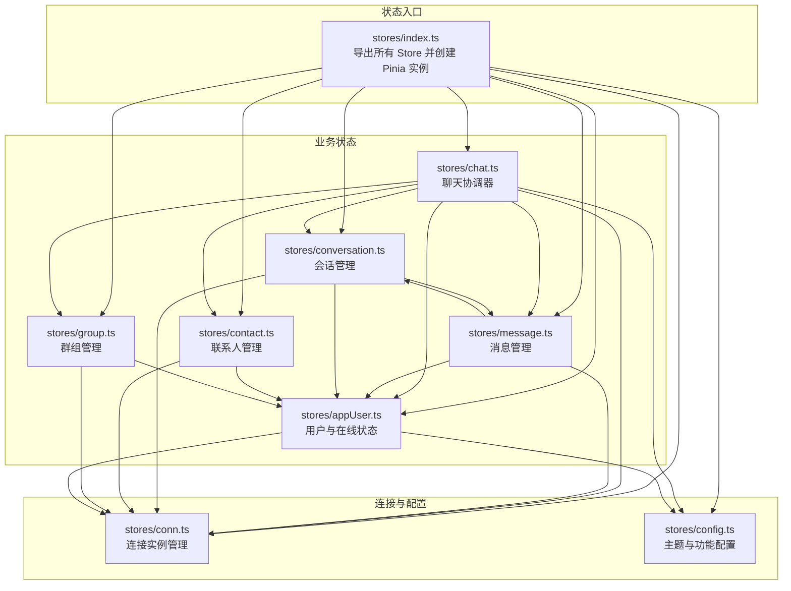
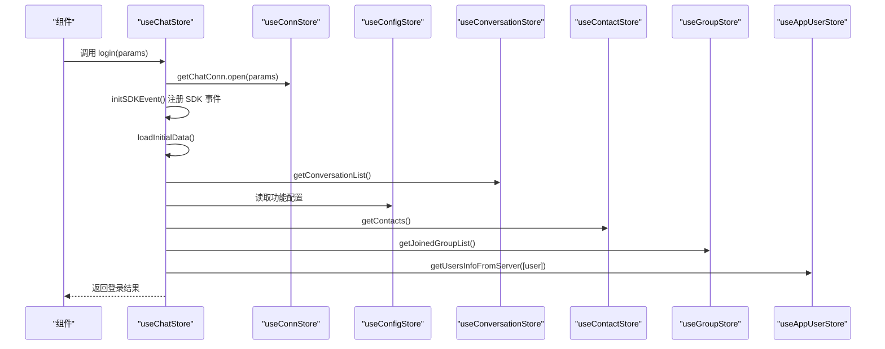
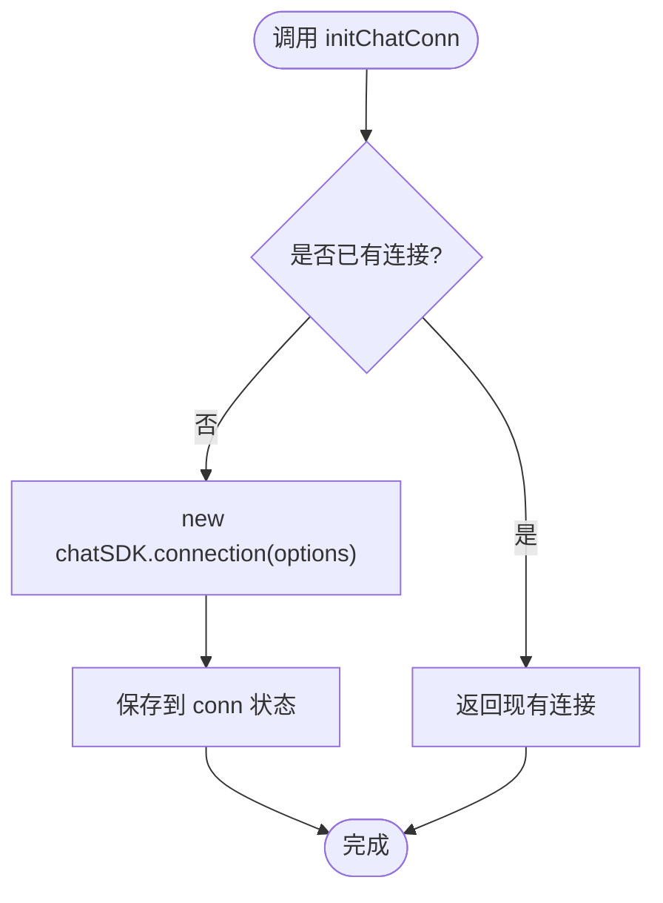
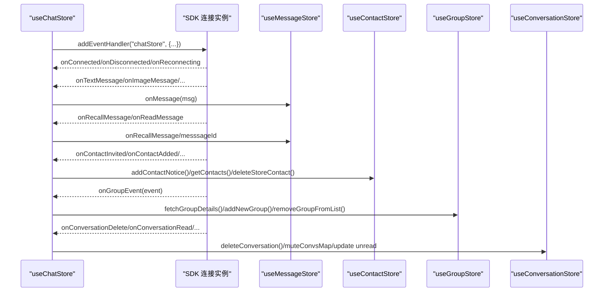
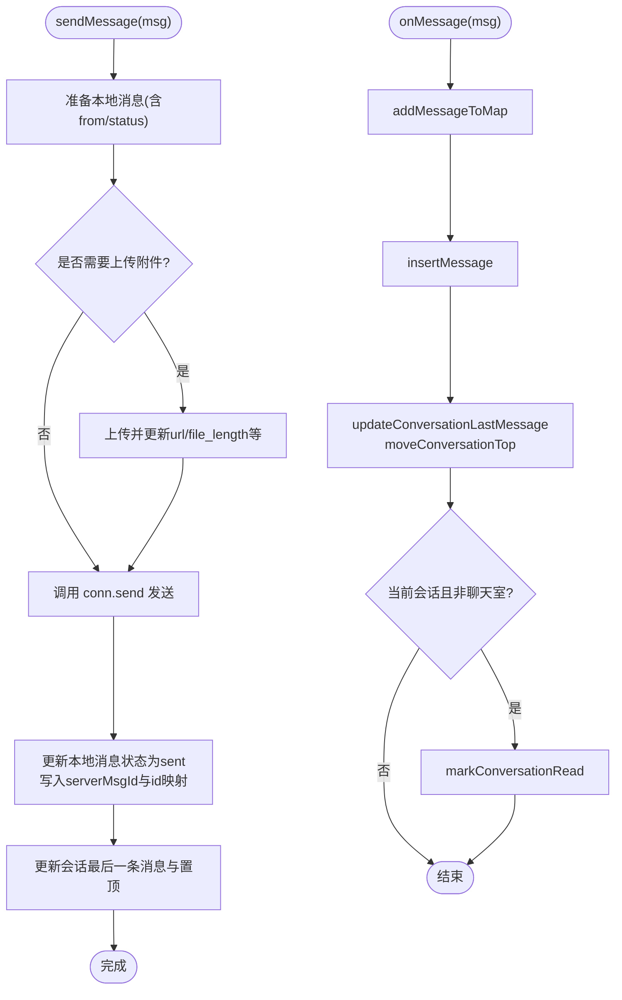
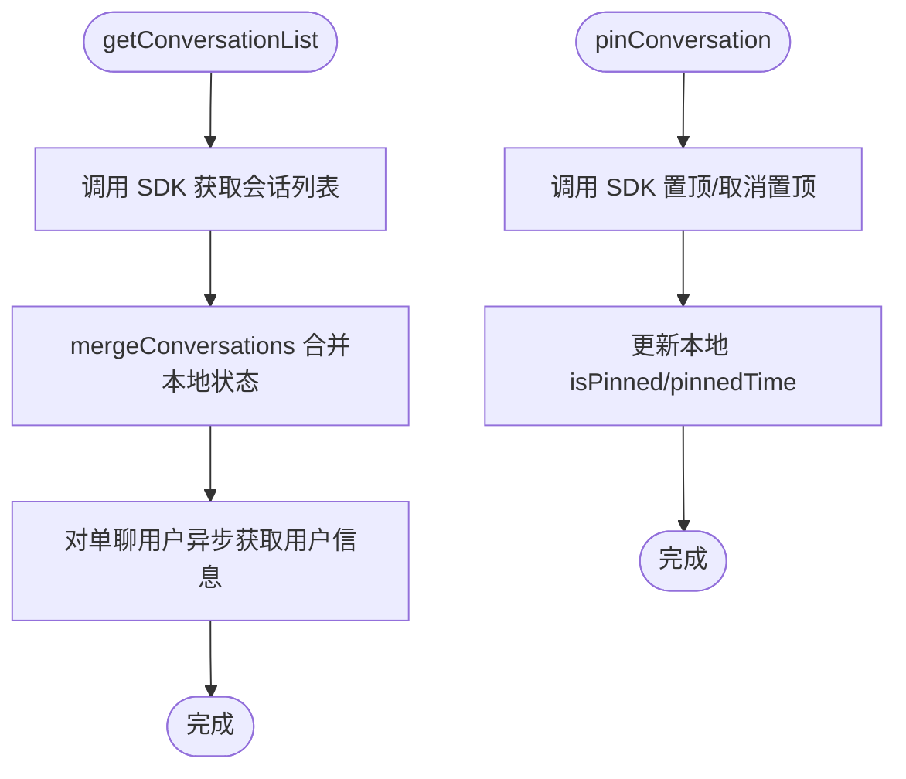
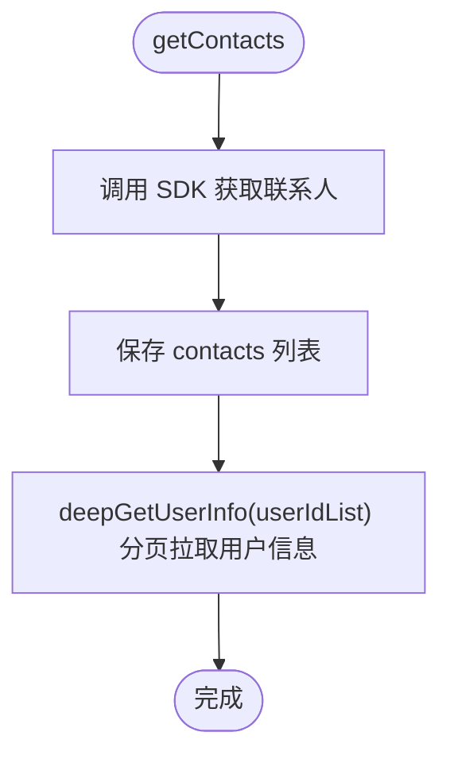
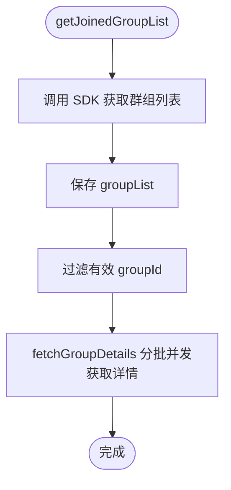
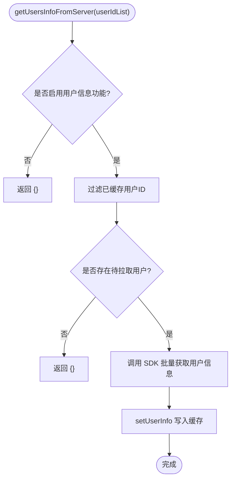
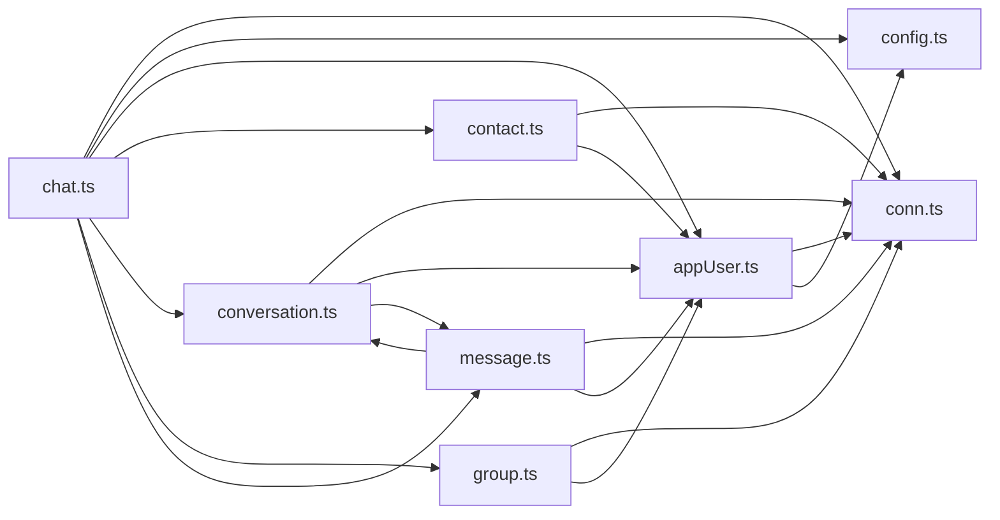

# 状态管理系统

<cite>
**本文档引用的文件**
- [ChatUIKit/stores/index.ts](file://ChatUIKit/stores/index.ts)
- [ChatUIKit/stores/conn.ts](file://ChatUIKit/stores/conn.ts)
- [ChatUIKit/stores/chat.ts](file://ChatUIKit/stores/chat.ts)
- [ChatUIKit/stores/message.ts](file://ChatUIKit/stores/message.ts)
- [ChatUIKit/stores/contact.ts](file://ChatUIKit/stores/contact.ts)
- [ChatUIKit/stores/conversation.ts](file://ChatUIKit/stores/conversation.ts)
- [ChatUIKit/stores/group.ts](file://ChatUIKit/stores/group.ts)
- [ChatUIKit/stores/appUser.ts](file://ChatUIKit/stores/appUser.ts)
- [ChatUIKit/stores/config.ts](file://ChatUIKit/stores/config.ts)
- [ChatUIKit/types/index.ts](file://ChatUIKit/types/index.ts)
- [ChatUIKit/const/index.ts](file://ChatUIKit/const/index.ts)
- [ChatUIKit/sdk.ts](file://ChatUIKit/sdk.ts)
- [ChatUIKit/log.ts](file://ChatUIKit/log.ts)
- [ChatUIKit/modules/Chat/index.vue](file://ChatUIKit/modules/Chat/index.vue)
</cite>

## 目录
1. [简介](#简介)
2. [项目结构](#项目结构)
3. [核心组件](#核心组件)
4. [架构总览](#架构总览)
5. [详细组件分析](#详细组件分析)
6. [依赖关系分析](#依赖关系分析)
7. [性能考量](#性能考量)
8. [故障排查指南](#故障排查指南)
9. [结论](#结论)
10. [附录](#附录)

## 简介
本文件系统性阐述 Easemob UIKit 基于 Pinia 的状态管理架构与实现细节，覆盖连接状态、消息状态、用户状态、会话状态、联系人状态与群组状态六大模块。文档重点说明：
- Store 之间的依赖关系与数据流向
- 状态更新机制、异步操作处理与错误状态管理
- 状态持久化、缓存策略与性能优化方案
- 状态订阅、响应式更新与组件间通信模式

## 项目结构
状态管理采用 Pinia 架构，核心入口导出各模块 Store，并在应用入口集中注册。各 Store 通过 SDK 事件回调与业务动作协调数据流。

图表来源
- [ChatUIKit/stores/index.ts](file://ChatUIKit/stores/index.ts#L1-L31)
- [ChatUIKit/stores/conn.ts](file://ChatUIKit/stores/conn.ts#L1-L84)
- [ChatUIKit/stores/chat.ts](file://ChatUIKit/stores/chat.ts#L1-L407)
- [ChatUIKit/stores/message.ts](file://ChatUIKit/stores/message.ts#L1-L585)
- [ChatUIKit/stores/conversation.ts](file://ChatUIKit/stores/conversation.ts#L1-L421)
- [ChatUIKit/stores/contact.ts](file://ChatUIKit/stores/contact.ts#L1-L282)
- [ChatUIKit/stores/group.ts](file://ChatUIKit/stores/group.ts#L1-L317)
- [ChatUIKit/stores/appUser.ts](file://ChatUIKit/stores/appUser.ts#L1-L242)
- [ChatUIKit/stores/config.ts](file://ChatUIKit/stores/config.ts#L1-L124)

章节来源
- [ChatUIKit/stores/index.ts](file://ChatUIKit/stores/index.ts#L1-L31)

## 核心组件
- 连接状态管理（conn）：封装 IM SDK 连接实例，提供初始化、关闭与状态查询能力。
- 聊天状态管理（chat）：作为事件协调器，整合 SDK 事件、驱动其他 Store 的数据同步与初始加载。
- 消息状态管理（message）：维护消息内容映射与会话消息 ID 序列，处理发送、接收、撤回、删除与历史拉取。
- 会话状态管理（conversation）：管理会话列表、置顶、免打扰、已读回执与最后一条消息更新。
- 联系人状态管理（contact）：维护联系人列表、好友申请通知与用户信息批量拉取。
- 群组状态管理（group）：维护加入群组列表、群组详情缓存与群组生命周期操作。
- 用户状态管理（appUser）：维护用户信息与在线状态缓存，支持订阅与发布。
- 配置状态管理（config）：统一管理主题与功能开关。

章节来源
- [ChatUIKit/stores/conn.ts](file://ChatUIKit/stores/conn.ts#L1-L84)
- [ChatUIKit/stores/chat.ts](file://ChatUIKit/stores/chat.ts#L1-L407)
- [ChatUIKit/stores/message.ts](file://ChatUIKit/stores/message.ts#L1-L585)
- [ChatUIKit/stores/conversation.ts](file://ChatUIKit/stores/conversation.ts#L1-L421)
- [ChatUIKit/stores/contact.ts](file://ChatUIKit/stores/contact.ts#L1-L282)
- [ChatUIKit/stores/group.ts](file://ChatUIKit/stores/group.ts#L1-L317)
- [ChatUIKit/stores/appUser.ts](file://ChatUIKit/stores/appUser.ts#L1-L242)
- [ChatUIKit/stores/config.ts](file://ChatUIKit/stores/config.ts#L1-L124)

## 架构总览
以下序列图展示登录流程中各 Store 的协作与数据流向：

图表来源
- [ChatUIKit/stores/chat.ts](file://ChatUIKit/stores/chat.ts#L299-L328)
- [ChatUIKit/stores/chat.ts](file://ChatUIKit/stores/chat.ts#L377-L396)
- [ChatUIKit/stores/conn.ts](file://ChatUIKit/stores/conn.ts#L46-L63)
- [ChatUIKit/stores/contact.ts](file://ChatUIKit/stores/contact.ts#L112-L130)
- [ChatUIKit/stores/group.ts](file://ChatUIKit/stores/group.ts#L102-L131)
- [ChatUIKit/stores/conversation.ts](file://ChatUIKit/stores/conversation.ts#L126-L160)
- [ChatUIKit/stores/appUser.ts](file://ChatUIKit/stores/appUser.ts#L86-L125)

## 详细组件分析

### 连接状态管理（conn）
- 职责：持有 IM SDK 连接实例，提供初始化、关闭与连接状态查询。
- 关键点：
  - 通过 SDK 包装创建连接实例，避免重复初始化。
  - 提供类型安全的连接访问器，未初始化时抛出明确错误。
  - 提供清理方法，配合登出流程清空状态。

图表来源
- [ChatUIKit/stores/conn.ts](file://ChatUIKit/stores/conn.ts#L54-L63)

章节来源
- [ChatUIKit/stores/conn.ts](file://ChatUIKit/stores/conn.ts#L1-L84)

### 聊天状态管理（chat）
- 职责：作为事件协调器，负责 SDK 事件监听、登录/登出、初始数据加载与跨 Store 协同。
- 关键点：
  - 使用箭头函数绑定 SDK 事件处理器，保证 this 指向稳定。
  - 统一设置连接状态，触发会话列表与联系人等初始加载。
  - 处理消息、联系人、群组与会话相关事件，委派给对应 Store。
  - 登录成功后异步获取用户信息与在线状态，提升首屏体验。

图表来源
- [ChatUIKit/stores/chat.ts](file://ChatUIKit/stores/chat.ts#L75-L221)
- [ChatUIKit/stores/chat.ts](file://ChatUIKit/stores/chat.ts#L226-L294)

章节来源
- [ChatUIKit/stores/chat.ts](file://ChatUIKit/stores/chat.ts#L1-L407)

### 消息状态管理（message）
- 职责：维护消息内容映射与会话消息 ID 序列，处理消息发送、接收、历史拉取、撤回、删除与状态更新。
- 关键点：
  - 使用对象存储消息体，数组存储消息 ID 顺序，降低响应式开销。
  - 发送消息时先本地插入，再上传附件（如需），最后更新为服务器消息并同步会话。
  - 接收消息时区分新旧消息，更新会话最后一条消息与未读计数，并在当前会话时自动标记已读。
  - 历史消息拉取支持分页与去重合并，避免重复渲染。
  - 撤回消息时生成通知消息并更新会话最后一条消息。
  - 提供音频播放状态与引用/编辑消息的上下文管理。

图表来源
- [ChatUIKit/stores/message.ts](file://ChatUIKit/stores/message.ts#L229-L342)
- [ChatUIKit/stores/message.ts](file://ChatUIKit/stores/message.ts#L347-L394)

章节来源
- [ChatUIKit/stores/message.ts](file://ChatUIKit/stores/message.ts#L1-L585)

### 会话状态管理（conversation）
- 职责：维护会话列表、置顶、免打扰、已读回执与最后一条消息更新。
- 关键点：
  - 使用对象存储会话，计算属性缓存未读总数，排除免打扰会话。
  - 提供置顶/取消置顶与免打扰开关，同步服务器与本地状态。
  - 会话移动到顶部与创建新会话，保证 UI 顺序正确。
  - @ 类型检测（@全体/提及我），用于会话列表展示提醒。

图表来源
- [ChatUIKit/stores/conversation.ts](file://ChatUIKit/stores/conversation.ts#L126-L160)
- [ChatUIKit/stores/conversation.ts](file://ChatUIKit/stores/conversation.ts#L218-L241)

章节来源
- [ChatUIKit/stores/conversation.ts](file://ChatUIKit/stores/conversation.ts#L1-L421)

### 联系人状态管理（contact）
- 职责：维护联系人列表、好友申请通知与用户信息批量拉取。
- 关键点：
  - 分页递归获取用户信息，避免一次性请求过多导致阻塞。
  - 好友申请通知按类型统计未读数，支持接受/拒绝与本地删除。
  - 提供根据 ID 查找联系人与判断是否已是好友的能力。

图表来源
- [ChatUIKit/stores/contact.ts](file://ChatUIKit/stores/contact.ts#L112-L130)
- [ChatUIKit/stores/contact.ts](file://ChatUIKit/stores/contact.ts#L83-L107)

章节来源
- [ChatUIKit/stores/contact.ts](file://ChatUIKit/stores/contact.ts#L1-L282)

### 群组状态管理（group）
- 职责：维护加入群组列表、群组详情缓存与群组生命周期操作。
- 关键点：
  - 群组详情按需拉取并缓存，支持分批并发获取。
  - 提供创建、解散、退出、加入群组等操作，并同步本地列表与缓存。
  - 兼容多种字段命名（groupId/groupid 等），增强健壮性。

图表来源
- [ChatUIKit/stores/group.ts](file://ChatUIKit/stores/group.ts#L102-L131)
- [ChatUIKit/stores/group.ts](file://ChatUIKit/stores/group.ts#L136-L167)

章节来源
- [ChatUIKit/stores/group.ts](file://ChatUIKit/stores/group.ts#L1-L317)

### 用户状态管理（appUser）
- 职责：维护用户信息与在线状态缓存，支持订阅与发布。
- 关键点：
  - 仅对未缓存用户发起服务器请求，减少网络开销。
  - 提供在线状态订阅/取消与发布自定义状态能力。
  - 统一对外暴露用户信息（带默认昵称与头像），简化组件使用。

图表来源
- [ChatUIKit/stores/appUser.ts](file://ChatUIKit/stores/appUser.ts#L86-L125)

章节来源
- [ChatUIKit/stores/appUser.ts](file://ChatUIKit/stores/appUser.ts#L1-L242)

### 配置状态管理（config）
- 职责：统一管理主题与功能开关，支持隐藏/显示特定功能。
- 关键点：
  - 默认开启常用功能，可通过接口动态调整。
  - 提供资源 URL 常量，便于组件引用静态资源。

章节来源
- [ChatUIKit/stores/config.ts](file://ChatUIKit/stores/config.ts#L1-L124)

## 依赖关系分析
- 低耦合高内聚：每个 Store 专注于单一领域，通过 SDK 与彼此交互。
- 事件驱动：SDK 事件作为外部输入，由 chat Store 统一调度，再委派到具体 Store。
- 数据一致性：消息、会话与联系人/群组之间通过会话 ID 与用户 ID 关联，保证一致性。
- 循环依赖规避：通过 getter 延迟访问与其他 Store，避免直接导入造成循环。

图表来源
- [ChatUIKit/stores/chat.ts](file://ChatUIKit/stores/chat.ts#L12-L18)
- [ChatUIKit/stores/message.ts](file://ChatUIKit/stores/message.ts#L18-L21)
- [ChatUIKit/stores/conversation.ts](file://ChatUIKit/stores/conversation.ts#L19-L22)
- [ChatUIKit/stores/contact.ts](file://ChatUIKit/stores/contact.ts#L12-L14)
- [ChatUIKit/stores/group.ts](file://ChatUIKit/stores/group.ts#L12-L14)
- [ChatUIKit/stores/appUser.ts](file://ChatUIKit/stores/appUser.ts#L13-L16)

## 性能考量
- 响应式优化
  - 使用数组+对象混合结构（消息 ID 序列 + 映射表）降低响应式体积。
  - 通过创建新数组的方式更新列表，确保 Vue 响应式触发。
- 异步与并发
  - 用户信息与群组详情采用分批并发拉取，缩短首屏等待。
  - 历史消息拉取支持分页与去重合并，避免重复渲染。
- 缓存策略
  - 用户信息与群组详情按需缓存，命中则跳过请求。
  - 会话消息上限控制（默认 100 条），超出时清理最早消息，释放内存。
- 功能开关
  - 通过配置 Store 控制功能开关，按需启用/禁用，减少不必要的渲染与请求。

章节来源
- [ChatUIKit/stores/message.ts](file://ChatUIKit/stores/message.ts#L534-L558)
- [ChatUIKit/stores/group.ts](file://ChatUIKit/stores/group.ts#L147-L163)
- [ChatUIKit/stores/appUser.ts](file://ChatUIKit/stores/appUser.ts#L102-L108)
- [ChatUIKit/const/index.ts](file://ChatUIKit/const/index.ts#L14-L15)
- [ChatUIKit/stores/config.ts](file://ChatUIKit/stores/config.ts#L98-L113)

## 故障排查指南
- 连接未初始化
  - 现象：访问连接实例时报错。
  - 处理：先调用初始化方法创建连接，再进行登录或其他操作。
  - 参考：[ChatUIKit/stores/conn.ts](file://ChatUIKit/stores/conn.ts#L29-L34)
- 登录失败
  - 现象：登录接口抛出异常。
  - 处理：检查账号密码/令牌、网络状态与 SDK 配置；查看日志定位错误。
  - 参考：[ChatUIKit/stores/chat.ts](file://ChatUIKit/stores/chat.ts#L324-L327)
- 消息发送失败
  - 现象：消息状态停留在 sending 或变为 failed。
  - 处理：检查网络与 SDK 发送接口返回；必要时重试或提示用户。
  - 参考：[ChatUIKit/stores/message.ts](file://ChatUIKit/stores/message.ts#L338-L342)
- 历史消息拉取异常
  - 现象：历史消息无法加载或重复。
  - 处理：确认游标与分页参数；检查去重逻辑与响应式更新。
  - 参考：[ChatUIKit/stores/message.ts](file://ChatUIKit/stores/message.ts#L130-L200)
- 会话未读数异常
  - 现象：未读数不准确或被免打扰影响。
  - 处理：检查免打扰映射与计算属性；确认已读回执是否发送。
  - 参考：[ChatUIKit/stores/conversation.ts](file://ChatUIKit/stores/conversation.ts#L54-L59)
  - 参考：[ChatUIKit/stores/conversation.ts](file://ChatUIKit/stores/conversation.ts#L314-L339)

章节来源
- [ChatUIKit/stores/conn.ts](file://ChatUIKit/stores/conn.ts#L29-L34)
- [ChatUIKit/stores/chat.ts](file://ChatUIKit/stores/chat.ts#L324-L327)
- [ChatUIKit/stores/message.ts](file://ChatUIKit/stores/message.ts#L338-L342)
- [ChatUIKit/stores/message.ts](file://ChatUIKit/stores/message.ts#L130-L200)
- [ChatUIKit/stores/conversation.ts](file://ChatUIKit/stores/conversation.ts#L54-L59)
- [ChatUIKit/stores/conversation.ts](file://ChatUIKit/stores/conversation.ts#L314-L339)

## 结论
本状态管理架构以 Pinia 为核心，围绕 SDK 事件与业务动作构建清晰的数据流。通过模块化设计、事件驱动与缓存策略，实现了高性能、可维护与可扩展的状态管理方案。建议在生产环境中结合日志与监控，持续优化关键路径与用户体验。

## 附录

### 状态订阅与组件通信
- 组件通过 computed/watch 订阅 Store 状态，实现响应式更新。
- 示例：聊天页面根据消息编辑状态切换布局，根据引用消息焦点行为调整输入框状态。

章节来源
- [ChatUIKit/modules/Chat/index.vue](file://ChatUIKit/modules/Chat/index.vue#L121-L134)
- [ChatUIKit/modules/Chat/index.vue](file://ChatUIKit/modules/Chat/index.vue#L141-L153)

### 类型与常量
- 类型定义：统一了消息、会话、联系人、群组与用户信息等核心类型，确保 Store 间契约一致。
- 常量：包含资源 URL、最大消息数、@ 全体标识等，便于全局复用。

章节来源
- [ChatUIKit/types/index.ts](file://ChatUIKit/types/index.ts#L1-L100)
- [ChatUIKit/const/index.ts](file://ChatUIKit/const/index.ts#L1-L37)

### SDK 集成
- 通过统一 SDK 包装，屏蔽平台差异，Store 仅关注业务逻辑。

章节来源
- [ChatUIKit/sdk.ts](file://ChatUIKit/sdk.ts#L1-L13)