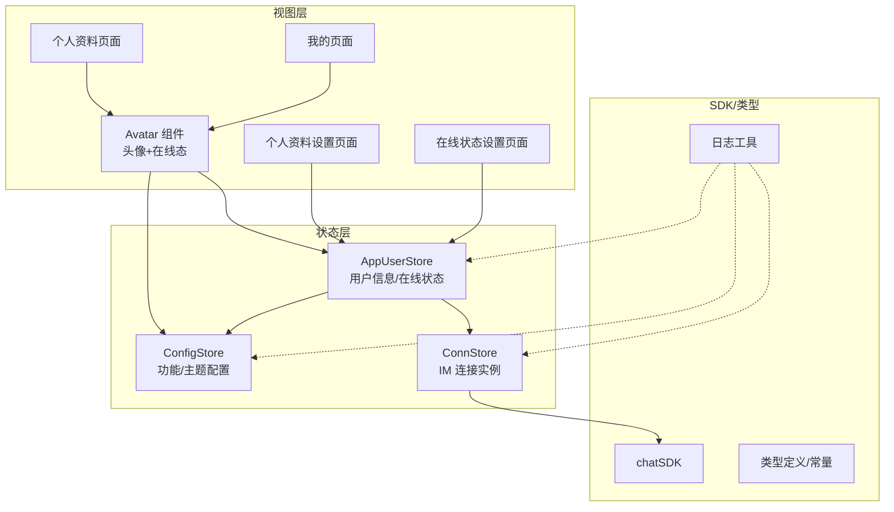
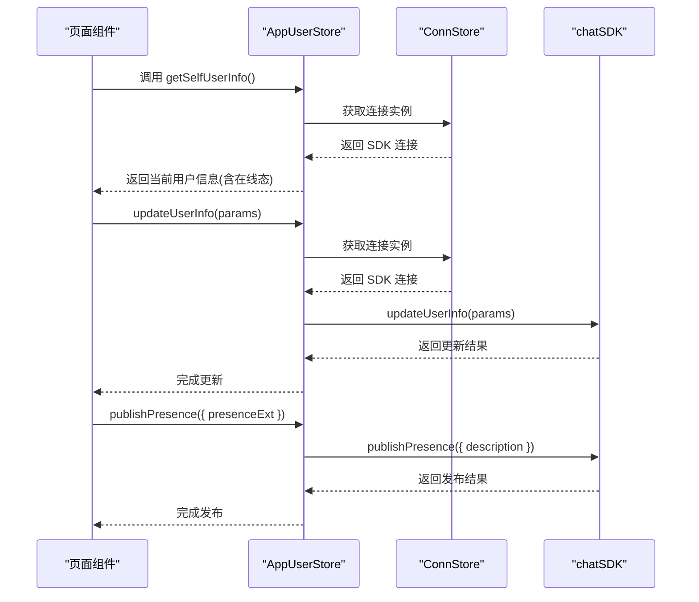
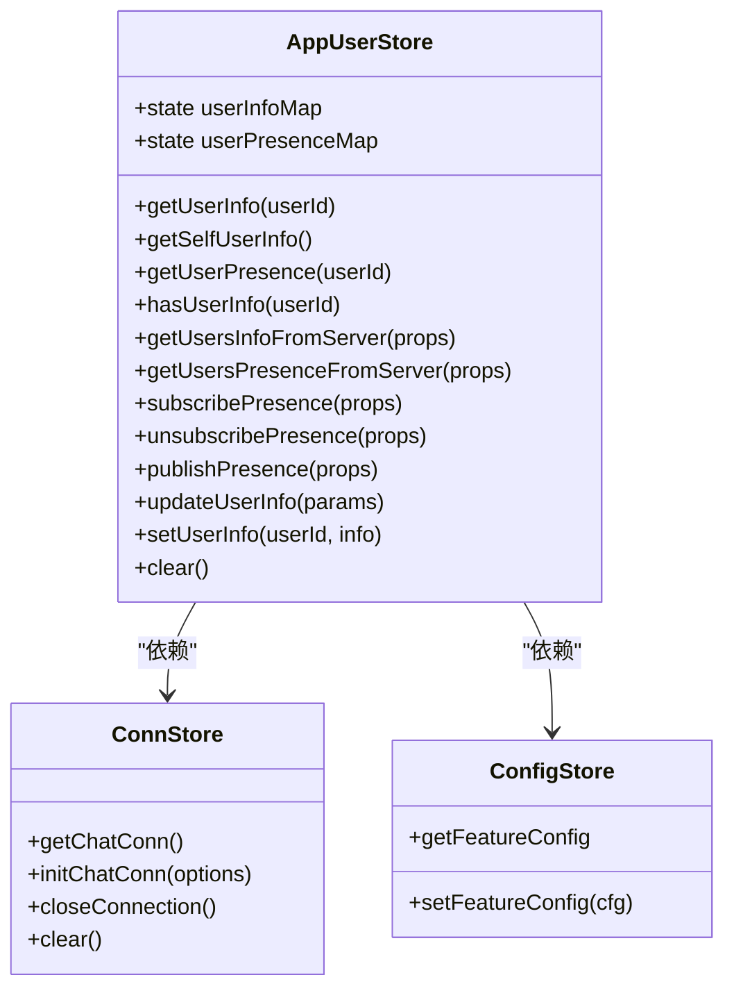
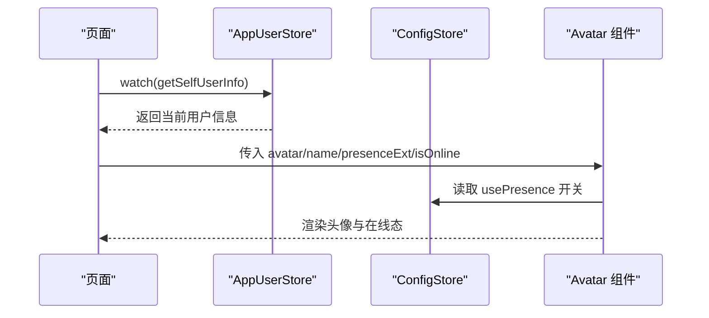
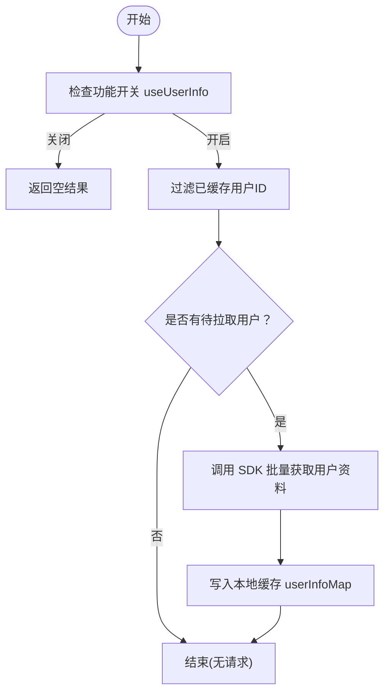
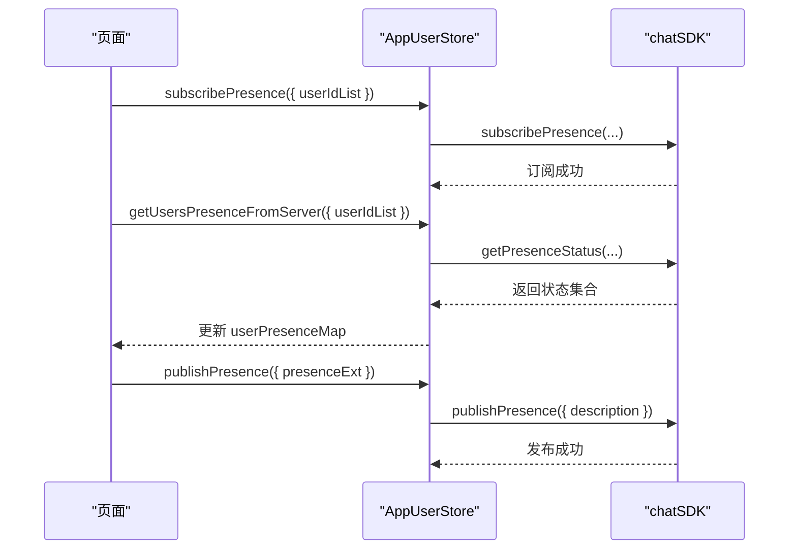
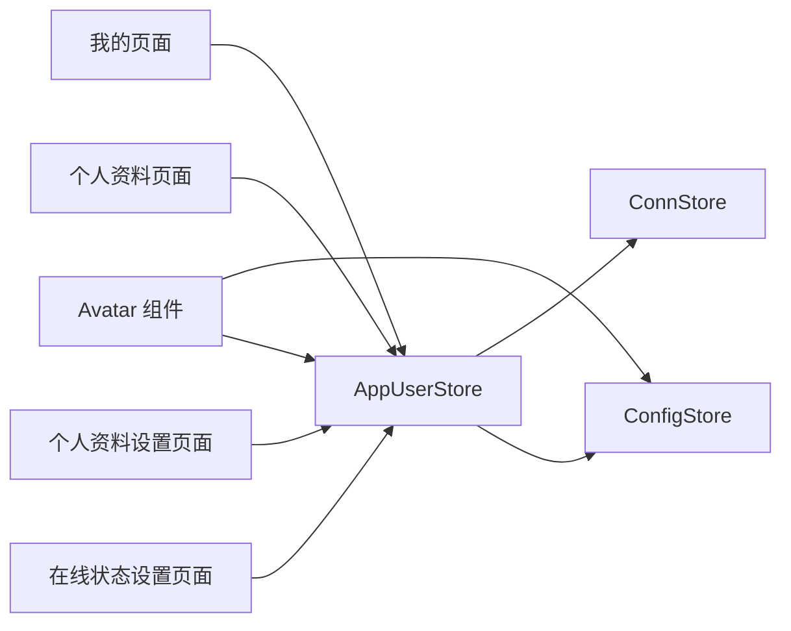

# 用户状态管理

<cite>
**本文引用的文件**
- [ChatUIKit/stores/appUser.ts](file://ChatUIKit/stores/appUser.ts)
- [ChatUIKit/stores/conn.ts](file://ChatUIKit/stores/conn.ts)
- [ChatUIKit/stores/config.ts](file://ChatUIKit/stores/config.ts)
- [ChatUIKit/types/index.ts](file://ChatUIKit/types/index.ts)
- [ChatUIKit/const/index.ts](file://ChatUIKit/const/index.ts)
- [ChatUIKit/sdk.ts](file://ChatUIKit/sdk.ts)
- [ChatUIKit/components/Avatar/index.vue](file://ChatUIKit/components/Avatar/index.vue)
- [demo/pages/Me/index.vue](file://demo/pages/Me/index.vue)
- [demo/pages/Profile/index.vue](file://demo/pages/Profile/index.vue)
- [demo/pages/ProfileSetting/index.vue](file://demo/pages/ProfileSetting/index.vue)
- [demo/pages/PresenceSetting/index.vue](file://demo/pages/PresenceSetting/index.vue)
- [ChatUIKit/log.ts](file://ChatUIKit/log.ts)
</cite>

## 目录
1. [简介](#简介)
2. [项目结构](#项目结构)
3. [核心组件](#核心组件)
4. [架构总览](#架构总览)
5. [详细组件分析](#详细组件分析)
6. [依赖分析](#依赖分析)
7. [性能考虑](#性能考虑)
8. [故障排查指南](#故障排查指南)
9. [结论](#结论)

## 简介
本文件聚焦于 Easemob UIKit 的“用户状态管理”，系统性阐述当前用户信息的存储与管理、用户状态的更新与同步流程、用户资料的获取/修改与缓存策略、在线状态管理、权限与身份认证处理、响应式更新与多设备同步机制，以及用户设置与个性化配置。文档以仓库中的实际实现为依据，辅以可视化图示帮助理解。

## 项目结构
围绕用户状态管理的关键目录与文件如下：
- stores 层：Pinia 状态管理，负责用户信息、连接、配置等全局状态
- components 层：UI 组件，如头像组件根据用户状态渲染在线态
- pages 层：页面组件，负责用户资料查看与编辑、在线状态设置
- types/const/sdk/log：类型定义、常量、SDK 引入与日志工具

图表来源
- [ChatUIKit/stores/appUser.ts](file://ChatUIKit/stores/appUser.ts#L17-L28)
- [ChatUIKit/stores/config.ts](file://ChatUIKit/stores/config.ts#L14-L17)
- [ChatUIKit/stores/conn.ts](file://ChatUIKit/stores/conn.ts#L15-L18)
- [ChatUIKit/components/Avatar/index.vue](file://ChatUIKit/components/Avatar/index.vue#L25-L58)
- [demo/pages/Me/index.vue](file://demo/pages/Me/index.vue#L52-L74)
- [demo/pages/Profile/index.vue](file://demo/pages/Profile/index.vue#L36-L58)
- [demo/pages/ProfileSetting/index.vue](file://demo/pages/ProfileSetting/index.vue#L28-L48)
- [demo/pages/PresenceSetting/index.vue](file://demo/pages/PresenceSetting/index.vue#L62-L101)
- [ChatUIKit/sdk.ts](file://ChatUIKit/sdk.ts#L1-L13)
- [ChatUIKit/types/index.ts](file://ChatUIKit/types/index.ts#L67-L80)
- [ChatUIKit/const/index.ts](file://ChatUIKit/const/index.ts#L17-L25)
- [ChatUIKit/log.ts](file://ChatUIKit/log.ts#L5-L77)

章节来源
- [ChatUIKit/stores/appUser.ts](file://ChatUIKit/stores/appUser.ts#L17-L28)
- [ChatUIKit/stores/config.ts](file://ChatUIKit/stores/config.ts#L14-L17)
- [ChatUIKit/stores/conn.ts](file://ChatUIKit/stores/conn.ts#L15-L18)
- [ChatUIKit/components/Avatar/index.vue](file://ChatUIKit/components/Avatar/index.vue#L25-L58)
- [demo/pages/Me/index.vue](file://demo/pages/Me/index.vue#L52-L74)
- [demo/pages/Profile/index.vue](file://demo/pages/Profile/index.vue#L36-L58)
- [demo/pages/ProfileSetting/index.vue](file://demo/pages/ProfileSetting/index.vue#L28-L48)
- [demo/pages/PresenceSetting/index.vue](file://demo/pages/PresenceSetting/index.vue#L62-L101)
- [ChatUIKit/sdk.ts](file://ChatUIKit/sdk.ts#L1-L13)
- [ChatUIKit/types/index.ts](file://ChatUIKit/types/index.ts#L67-L80)
- [ChatUIKit/const/index.ts](file://ChatUIKit/const/index.ts#L17-L25)
- [ChatUIKit/log.ts](file://ChatUIKit/log.ts#L5-L77)

## 核心组件
- AppUserStore：集中管理用户信息与在线状态，提供获取/更新/发布/订阅/取消订阅等动作，并对用户资料进行本地缓存；通过 Pinia getter 汇总当前登录用户信息并提供默认值。
- ConnStore：统一持有 IM SDK 连接实例，提供类型安全的访问器与初始化/关闭能力。
- ConfigStore：统一管理主题与功能开关，如用户资料与在线状态功能开关。
- Avatar 组件：根据用户在线状态与配置显示头像与在线态徽标。
- 页面组件：我的、个人资料、个人资料设置、在线状态设置页面，均通过 watch 监听 AppUserStore 的 getter 实现响应式更新。

章节来源
- [ChatUIKit/stores/appUser.ts](file://ChatUIKit/stores/appUser.ts#L24-L79)
- [ChatUIKit/stores/conn.ts](file://ChatUIKit/stores/conn.ts#L20-L40)
- [ChatUIKit/stores/config.ts](file://ChatUIKit/stores/config.ts#L59-L80)
- [ChatUIKit/components/Avatar/index.vue](file://ChatUIKit/components/Avatar/index.vue#L25-L78)
- [demo/pages/Me/index.vue](file://demo/pages/Me/index.vue#L52-L74)
- [demo/pages/Profile/index.vue](file://demo/pages/Profile/index.vue#L36-L58)
- [demo/pages/ProfileSetting/index.vue](file://demo/pages/ProfileSetting/index.vue#L28-L48)
- [demo/pages/PresenceSetting/index.vue](file://demo/pages/PresenceSetting/index.vue#L62-L101)

## 架构总览
用户状态管理采用“Pinia Store + SDK 封装”的分层设计：
- Store 层：AppUserStore 负责用户资料与在线状态的读写与缓存；ConnStore 提供 SDK 连接；ConfigStore 提供功能开关。
- 视图层：页面与组件通过 watch 监听 Store getter，实现响应式更新。
- SDK 层：通过 chatSDK 访问底层 IM 能力，如获取用户资料、更新资料、获取/发布在线状态、订阅/取消订阅等。

图表来源
- [ChatUIKit/stores/appUser.ts](file://ChatUIKit/stores/appUser.ts#L51-L64)
- [ChatUIKit/stores/appUser.ts](file://ChatUIKit/stores/appUser.ts#L207-L222)
- [ChatUIKit/stores/appUser.ts](file://ChatUIKit/stores/appUser.ts#L187-L193)
- [ChatUIKit/stores/conn.ts](file://ChatUIKit/stores/conn.ts#L25-L34)
- [ChatUIKit/sdk.ts](file://ChatUIKit/sdk.ts#L1-L13)

## 详细组件分析

### AppUserStore：用户信息与在线状态管理
- 数据结构
  - userInfoMap：按 userId 缓存用户资料
  - userPresenceMap：按 userId 缓存在线状态
- 关键能力
  - 获取用户信息：getUserInfo(userId)、getSelfUserInfo()，提供默认昵称回退
  - 获取在线状态：getUserPresence(userId)
  - 缓存命中检查：hasUserInfo(userId)
  - 从服务器批量拉取用户资料：getUsersInfoFromServer({ userIdList })
  - 从服务器批量拉取在线状态：getUsersPresenceFromServer({ userIdList })
  - 订阅/取消订阅在线状态：subscribePresence()/unsubscribePresence()
  - 发布自定义在线状态：publishPresence({ presenceExt })
  - 更新当前用户资料：updateUserInfo(params)
  - 设置/清空用户信息：setUserInfo()/clear()

图表来源
- [ChatUIKit/stores/appUser.ts](file://ChatUIKit/stores/appUser.ts#L17-L28)
- [ChatUIKit/stores/appUser.ts](file://ChatUIKit/stores/appUser.ts#L30-L79)
- [ChatUIKit/stores/appUser.ts](file://ChatUIKit/stores/appUser.ts#L81-L240)
- [ChatUIKit/stores/conn.ts](file://ChatUIKit/stores/conn.ts#L15-L18)
- [ChatUIKit/stores/config.ts](file://ChatUIKit/stores/config.ts#L14-L17)

章节来源
- [ChatUIKit/stores/appUser.ts](file://ChatUIKit/stores/appUser.ts#L17-L28)
- [ChatUIKit/stores/appUser.ts](file://ChatUIKit/stores/appUser.ts#L30-L79)
- [ChatUIKit/stores/appUser.ts](file://ChatUIKit/stores/appUser.ts#L81-L240)

### ConnStore：IM 连接管理
- 提供 getChatConn() 类型安全访问器
- 提供 initChatConn(options) 初始化连接
- 提供 closeConnection() 关闭连接
- 提供 clear() 清空状态

章节来源
- [ChatUIKit/stores/conn.ts](file://ChatUIKit/stores/conn.ts#L20-L82)

### ConfigStore：功能与主题配置
- 主题配置：avatarShape
- 功能配置：useUserInfo、usePresence 等
- 支持隐藏/显示功能、重置默认配置

章节来源
- [ChatUIKit/stores/config.ts](file://ChatUIKit/stores/config.ts#L14-L17)
- [ChatUIKit/stores/config.ts](file://ChatUIKit/stores/config.ts#L59-L122)

### Avatar 组件：在线状态渲染
- 接收 isOnline 与 presenceExt，结合 ConfigStore 的 usePresence 开关决定是否显示在线态
- 根据不同在线状态选择对应图标资源

章节来源
- [ChatUIKit/components/Avatar/index.vue](file://ChatUIKit/components/Avatar/index.vue#L25-L78)

### 页面组件：响应式更新与交互
- 我的页面：watch getSelfUserInfo，实现头像、名称、ID 等实时更新
- 个人资料页面：watch getSelfUserInfo，支持头像上传与昵称设置
- 个人资料设置页面：watch getSelfUserInfo，限制禁用提交按钮
- 在线状态设置页面：watch getSelfUserInfo，支持预设与自定义在线状态发布

图表来源
- [demo/pages/Me/index.vue](file://demo/pages/Me/index.vue#L52-L74)
- [demo/pages/Profile/index.vue](file://demo/pages/Profile/index.vue#L36-L58)
- [demo/pages/ProfileSetting/index.vue](file://demo/pages/ProfileSetting/index.vue#L28-L48)
- [demo/pages/PresenceSetting/index.vue](file://demo/pages/PresenceSetting/index.vue#L62-L101)
- [ChatUIKit/components/Avatar/index.vue](file://ChatUIKit/components/Avatar/index.vue#L25-L78)
- [ChatUIKit/stores/config.ts](file://ChatUIKit/stores/config.ts#L65-L74)

章节来源
- [demo/pages/Me/index.vue](file://demo/pages/Me/index.vue#L52-L74)
- [demo/pages/Profile/index.vue](file://demo/pages/Profile/index.vue#L36-L58)
- [demo/pages/ProfileSetting/index.vue](file://demo/pages/ProfileSetting/index.vue#L28-L48)
- [demo/pages/PresenceSetting/index.vue](file://demo/pages/PresenceSetting/index.vue#L62-L101)
- [ChatUIKit/components/Avatar/index.vue](file://ChatUIKit/components/Avatar/index.vue#L25-L78)

### 用户资料获取、修改与缓存策略
- 获取：getUsersInfoFromServer 会过滤已缓存用户，仅向服务器请求未缓存用户，避免重复请求
- 修改：updateUserInfo 调用 SDK 更新后，立即在本地更新当前用户资料
- 缓存：userInfoMap 作为本地缓存，配合 hasUserInfo 判断命中

图表来源
- [ChatUIKit/stores/appUser.ts](file://ChatUIKit/stores/appUser.ts#L86-L125)
- [ChatUIKit/stores/config.ts](file://ChatUIKit/stores/config.ts#L65-L74)

章节来源
- [ChatUIKit/stores/appUser.ts](file://ChatUIKit/stores/appUser.ts#L86-L125)
- [ChatUIKit/stores/config.ts](file://ChatUIKit/stores/config.ts#L65-L74)

### 在线状态管理与多设备同步
- 订阅/取消订阅：subscribePresence()/unsubscribePresence()，用于建立状态订阅关系
- 获取在线状态：getUsersPresenceFromServer()，解析服务器返回的状态集合
- 发布自定义状态：publishPresence()，将描述文本发布为 presenceExt
- 多设备同步：presenceExt 与 isOnline 由服务器维护，客户端通过订阅与发布实现跨设备一致

图表来源
- [ChatUIKit/stores/appUser.ts](file://ChatUIKit/stores/appUser.ts#L164-L193)
- [ChatUIKit/stores/appUser.ts](file://ChatUIKit/stores/appUser.ts#L130-L159)

章节来源
- [ChatUIKit/stores/appUser.ts](file://ChatUIKit/stores/appUser.ts#L130-L193)

### 权限验证与身份认证处理
- 身份认证：ConnStore.initChatConn(options) 创建 SDK 连接，后续所有用户状态相关操作均通过该连接实例执行
- 页面登出：演示页面在退出时清理存储并跳转登录页，体现会话生命周期管理

章节来源
- [ChatUIKit/stores/conn.ts](file://ChatUIKit/stores/conn.ts#L54-L63)
- [demo/pages/Me/index.vue](file://demo/pages/Me/index.vue#L82-L88)

### 响应式更新与多设备同步机制
- 响应式：各页面通过 watch(AppUserStore.getSelfUserInfo) 实时获取最新用户信息
- 多设备：通过订阅在线状态与发布自定义状态，确保多端一致

章节来源
- [demo/pages/Me/index.vue](file://demo/pages/Me/index.vue#L67-L74)
- [demo/pages/Profile/index.vue](file://demo/pages/Profile/index.vue#L51-L58)
- [demo/pages/ProfileSetting/index.vue](file://demo/pages/ProfileSetting/index.vue#L40-L48)
- [demo/pages/PresenceSetting/index.vue](file://demo/pages/PresenceSetting/index.vue#L94-L101)

### 用户设置管理、偏好配置与个性化选项
- 主题：avatarShape 控制头像形状
- 功能开关：useUserInfo/usePresence 等控制是否启用用户资料与在线状态功能
- 个性化：在线状态预设与自定义描述，Avatar 组件根据 presenceExt 选择图标

章节来源
- [ChatUIKit/stores/config.ts](file://ChatUIKit/stores/config.ts#L19-L57)
- [ChatUIKit/const/index.ts](file://ChatUIKit/const/index.ts#L17-L25)
- [ChatUIKit/components/Avatar/index.vue](file://ChatUIKit/components/Avatar/index.vue#L60-L78)

## 依赖分析
- AppUserStore 依赖 ConnStore 获取 SDK 连接，依赖 ConfigStore 读取功能开关
- Avatar 组件依赖 ConfigStore 的 usePresence 开关与 AppUserStore 的用户信息
- 页面组件通过 watch 依赖 AppUserStore 的 getter 实现响应式更新

图表来源
- [ChatUIKit/stores/appUser.ts](file://ChatUIKit/stores/appUser.ts#L12-L15)
- [ChatUIKit/stores/config.ts](file://ChatUIKit/stores/config.ts#L65-L74)
- [ChatUIKit/components/Avatar/index.vue](file://ChatUIKit/components/Avatar/index.vue#L25-L58)
- [demo/pages/Me/index.vue](file://demo/pages/Me/index.vue#L52-L74)

章节来源
- [ChatUIKit/stores/appUser.ts](file://ChatUIKit/stores/appUser.ts#L12-L15)
- [ChatUIKit/stores/config.ts](file://ChatUIKit/stores/config.ts#L65-L74)
- [ChatUIKit/components/Avatar/index.vue](file://ChatUIKit/components/Avatar/index.vue#L25-L58)
- [demo/pages/Me/index.vue](file://demo/pages/Me/index.vue#L52-L74)

## 性能考虑
- 批量请求去重：getUsersInfoFromServer 仅对未缓存用户发起请求，减少网络与服务器压力
- 响应式粒度：通过 getter 汇总当前用户信息，避免重复计算
- 功能开关：useUserInfo/usePresence 可按需关闭，降低不必要的网络与渲染开销
- 日志：统一日志工具，便于在调试模式下观察状态变化路径

## 故障排查指南
- 日志定位：AppUserStore/ConnStore/ConfigStore 的 action 中均有日志输出，可通过日志定位问题
- 常见问题
  - 未初始化连接：ConnStore.getChatConn 会在未初始化时抛错，需先调用 initChatConn
  - 功能关闭：若 useUserInfo 或 usePresence 关闭，相关功能不会生效
  - 在线状态异常：确认 subscribePresence 已调用且服务器返回状态正常

章节来源
- [ChatUIKit/stores/conn.ts](file://ChatUIKit/stores/conn.ts#L25-L34)
- [ChatUIKit/stores/appUser.ts](file://ChatUIKit/stores/appUser.ts#L92-L95)
- [ChatUIKit/log.ts](file://ChatUIKit/log.ts#L5-L77)

## 结论
本方案以 Pinia 为核心，结合 SDK 封装与类型定义，实现了用户信息与在线状态的本地缓存、按需拉取、响应式更新与多设备同步。通过功能开关与主题配置，兼顾灵活性与可维护性。建议在生产环境中：
- 明确功能开关策略，避免不必要的网络请求
- 在页面销毁时及时停止 watch，防止内存泄漏
- 对日志进行分级管理，平衡可观测性与性能