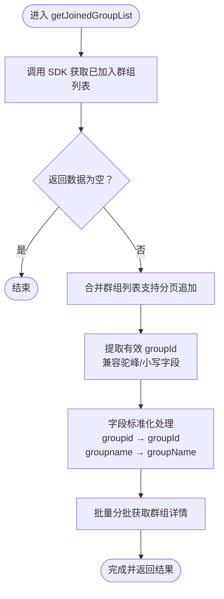
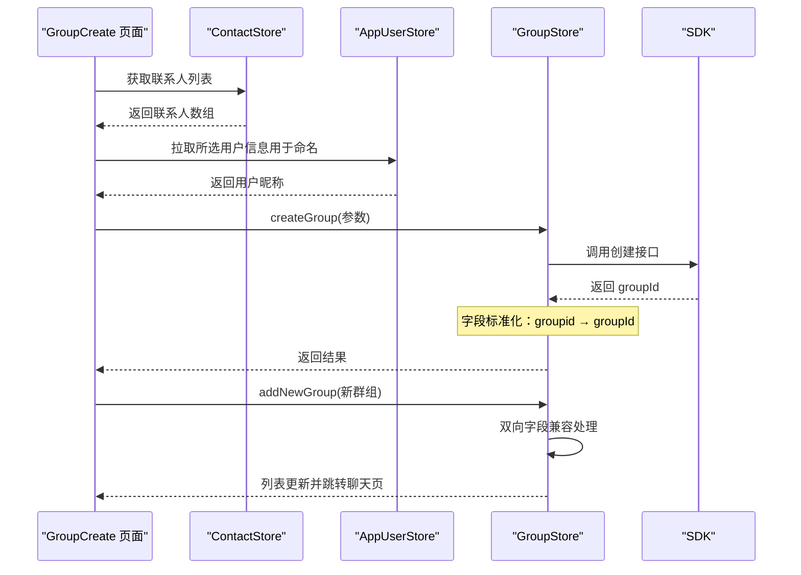
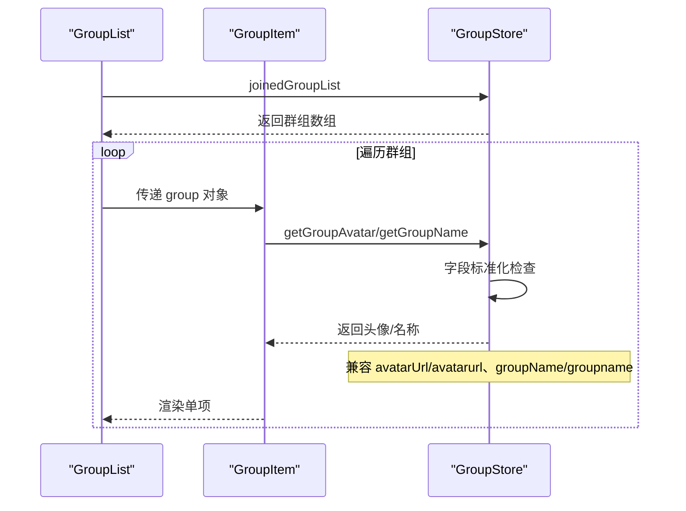
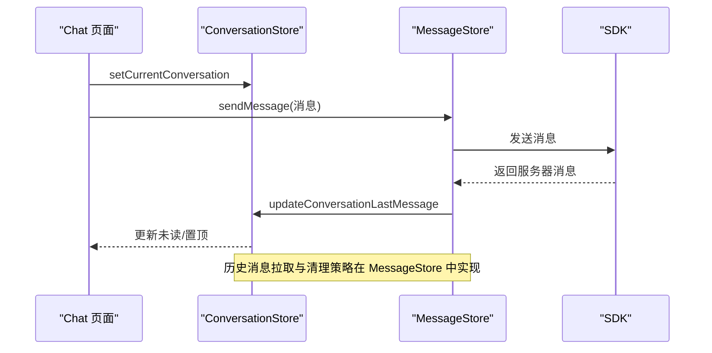
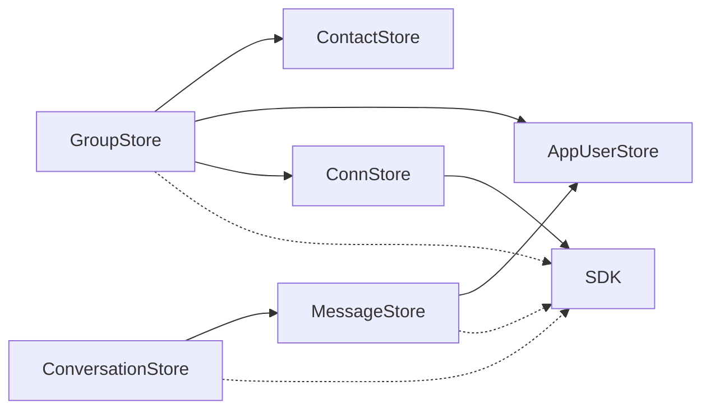

# 群组状态管理

<cite>
**本文档引用的文件**
- [ChatUIKit/stores/group.ts](file://ChatUIKit/stores/group.ts)
- [ChatUIKit/modules/GroupCreate/index.vue](file://ChatUIKit/modules/GroupCreate/index.vue)
- [ChatUIKit/modules/GroupCreate/searchList.vue](file://ChatUIKit/modules/GroupCreate/searchList.vue)
- [ChatUIKit/modules/GroupList/index.vue](file://ChatUIKit/modules/GroupList/index.vue)
- [ChatUIKit/modules/GroupList/components/GroupItem/index.vue](file://ChatUIKit/modules/GroupList/components/GroupItem/index.vue)
- [ChatUIKit/stores/contact.ts](file://ChatUIKit/stores/contact.ts)
- [ChatUIKit/stores/appUser.ts](file://ChatUIKit/stores/appUser.ts)
- [ChatUIKit/stores/message.ts](file://ChatUIKit/stores/message.ts)
- [ChatUIKit/stores/conversation.ts](file://ChatUIKit/stores/conversation.ts)
- [ChatUIKit/modules/Chat/index.vue](file://ChatUIKit/modules/Chat/index.vue)
- [ChatUIKit/types/index.ts](file://ChatUIKit/types/index.ts)
- [ChatUIKit/const/index.ts](file://ChatUIKit/const/index.ts)
- [ChatUIKit/stores/conn.ts](file://ChatUIKit/stores/conn.ts)
- [ChatUIKit/sdk.ts](file://ChatUIKit/sdk.ts)
- [demo/node_modules/easemob-websdk/group/group.d.ts](file://demo/node_modules/easemob-websdk/group/group.d.ts)
- [demo/node_modules/easemob-websdk/types/groupApi.d.ts](file://demo/node_modules/easemob-websdk/types/groupApi.d.ts)
</cite>

## 更新摘要
**变更内容**
- 实施了全面的字段标准化机制，解决SDK字段命名不一致问题
- 新增了SET_GROUP_LIST变异中的字段规范化处理，将SDK返回的小写字段（groupid, groupname）自动转换为应用期望的驼峰格式（groupId, groupName）
- 通过增强的getGroupName getter支持双重字段检查机制，确保字段兼容性
- 优化了群组状态管理的字段映射和数据转换流程

## 目录
1. [简介](#简介)
2. [项目结构](#项目结构)
3. [核心组件](#核心组件)
4. [架构总览](#架构总览)
5. [详细组件分析](#详细组件分析)
6. [依赖关系分析](#依赖关系分析)
7. [性能考量](#性能考量)
8. [故障排查指南](#故障排查指南)
9. [结论](#结论)
10. [附录](#附录)

## 简介
本文件聚焦于 Easemob UIKit 的群组状态管理，系统性阐述群组信息的存储与管理机制、群组状态的维护与更新流程，并覆盖群组创建、成员管理、群公告与群设置、群组搜索、成员权限管理、群组消息处理、响应式更新与实时同步、群组配置与管理员权限、以及群组清理策略等主题。文档以代码级可视化图示与路径引用相结合的方式，帮助开发者快速理解并高效扩展群组相关能力。

**更新** 新增了全面的字段标准化机制，解决了SDK字段命名不一致的问题。通过SET_GROUP_LIST变异中的字段规范化处理，将SDK返回的小写字段（groupid, groupname）自动转换为应用期望的驼峰格式（groupId, groupName），并通过增强的getGroupName getter支持双重字段检查机制，显著提升了系统的数据一致性和兼容性。

## 项目结构
围绕群组状态管理的关键目录与文件如下：
- stores 层：群组状态由 Pinia Store 统一管理，包含群组列表、群组详情映射、群组通知与分页参数。
- modules 层：群组创建、群组列表展示、群组聊天入口等业务模块。
- stores 其他子域：联系人、用户信息、消息、会话等与群组交互密切的状态域。
- types/const：类型定义与常量配置，支撑群组事件、通知、消息与权限模型。

```mermaid
graph TB
subgraph "Stores"
G["GroupStore<br/>群组状态"]
C["ContactStore<br/>联系人状态"]
U["AppUserStore<br/>用户信息/在线状态"]
M["MessageStore<br/>消息状态"]
V["ConversationStore<br/>会话状态"]
CONN["ConnStore<br/>连接管理"]
END
subgraph "Modules"
GC["GroupCreate<br/>群组创建"]
GL["GroupList<br/>群组列表"]
GI["GroupItem<br/>群组项"]
CH["Chat<br/>群组聊天"]
END
subgraph "Other"
T["types/index.ts<br/>类型定义"]
K["const/index.ts<br/>常量"]
SDK["sdk.ts<br/>SDK封装"]
END
GC --> G
GL --> G
GI --> G
CH --> V
CH --> M
G --> C
G --> U
G --> CONN
V --> M
M --> U
T --> G
T --> V
T --> M
K --> G
CONN --> SDK
```

**图表来源**
- [ChatUIKit/stores/group.ts](file://ChatUIKit/stores/group.ts#L1-L317)
- [ChatUIKit/modules/GroupCreate/index.vue](file://ChatUIKit/modules/GroupCreate/index.vue#L1-L221)
- [ChatUIKit/modules/GroupList/index.vue](file://ChatUIKit/modules/GroupList/index.vue#L1-L66)
- [ChatUIKit/modules/GroupList/components/GroupItem/index.vue](file://ChatUIKit/modules/GroupList/components/GroupItem/index.vue#L1-L67)
- [ChatUIKit/modules/Chat/index.vue](file://ChatUIKit/modules/Chat/index.vue#L1-L255)
- [ChatUIKit/stores/contact.ts](file://ChatUIKit/stores/contact.ts#L1-L282)
- [ChatUIKit/stores/appUser.ts](file://ChatUIKit/stores/appUser.ts#L1-L242)
- [ChatUIKit/stores/message.ts](file://ChatUIKit/stores/message.ts#L1-L581)
- [ChatUIKit/stores/conversation.ts](file://ChatUIKit/stores/conversation.ts#L1-L421)
- [ChatUIKit/stores/conn.ts](file://ChatUIKit/stores/conn.ts#L1-L84)
- [ChatUIKit/types/index.ts](file://ChatUIKit/types/index.ts#L1-L100)
- [ChatUIKit/const/index.ts](file://ChatUIKit/const/index.ts#L1-L37)
- [ChatUIKit/sdk.ts](file://ChatUIKit/sdk.ts#L1-L13)

**章节来源**
- [ChatUIKit/stores/group.ts](file://ChatUIKit/stores/group.ts#L1-L317)
- [ChatUIKit/modules/GroupCreate/index.vue](file://ChatUIKit/modules/GroupCreate/index.vue#L1-L221)
- [ChatUIKit/modules/GroupList/index.vue](file://ChatUIKit/modules/GroupList/index.vue#L1-L66)
- [ChatUIKit/modules/GroupList/components/GroupItem/index.vue](file://ChatUIKit/modules/GroupList/components/GroupItem/index.vue#L1-L67)
- [ChatUIKit/modules/Chat/index.vue](file://ChatUIKit/modules/Chat/index.vue#L1-L255)
- [ChatUIKit/stores/contact.ts](file://ChatUIKit/stores/contact.ts#L1-L282)
- [ChatUIKit/stores/appUser.ts](file://ChatUIKit/stores/appUser.ts#L1-L242)
- [ChatUIKit/stores/message.ts](file://ChatUIKit/stores/message.ts#L1-L581)
- [ChatUIKit/stores/conversation.ts](file://ChatUIKit/stores/conversation.ts#L1-L421)
- [ChatUIKit/stores/conn.ts](file://ChatUIKit/stores/conn.ts#L1-L84)
- [ChatUIKit/types/index.ts](file://ChatUIKit/types/index.ts#L1-L100)
- [ChatUIKit/const/index.ts](file://ChatUIKit/const/index.ts#L1-L37)
- [ChatUIKit/sdk.ts](file://ChatUIKit/sdk.ts#L1-L13)

## 核心组件
- 群组状态管理器（GroupStore）：负责群组列表、群组详情映射、群组通知、分页参数与群组生命周期操作（创建、加入、退出、解散、头像设置、清空）。**已实施**全面的字段标准化机制，确保SDK返回的小写字段自动转换为驼峰格式。
- 群组创建模块（GroupCreate）：提供联系人选择、群组名称生成、创建请求与新群组加入列表的流程。
- 群组列表模块（GroupList/GroupItem）：展示已加入群组列表，支持跳转至群组聊天。
- 联系人与用户信息（ContactStore/AppUserStore）：为群组创建提供联系人与用户信息缓存与拉取能力。
- 消息与会话（MessageStore/ConversationStore）：支撑群组消息处理、@提醒、已读回执与历史消息拉取。
- 连接管理（ConnStore）：提供 SDK 连接实例的统一管理与访问。
- 类型与常量（types/const）：统一群组事件、通知、消息与权限模型，提供常量如群成员分页大小、最大消息数等。

**更新** 新增了全面的字段标准化机制，通过增强的getGroupName getter支持双重字段检查机制，确保从SDK获取的字段（groupid, groupname）能够自动转换为应用期望的驼峰格式（groupId, groupName），显著提升了系统的数据一致性和兼容性。

**章节来源**
- [ChatUIKit/stores/group.ts](file://ChatUIKit/stores/group.ts#L16-L36)
- [ChatUIKit/modules/GroupCreate/index.vue](file://ChatUIKit/modules/GroupCreate/index.vue#L47-L133)
- [ChatUIKit/modules/GroupList/index.vue](file://ChatUIKit/modules/GroupList/index.vue#L21-L49)
- [ChatUIKit/modules/GroupList/components/GroupItem/index.vue](file://ChatUIKit/modules/GroupList/components/GroupItem/index.vue#L8-L50)
- [ChatUIKit/stores/contact.ts](file://ChatUIKit/stores/contact.ts#L16-L33)
- [ChatUIKit/stores/appUser.ts](file://ChatUIKit/stores/appUser.ts#L17-L28)
- [ChatUIKit/stores/message.ts](file://ChatUIKit/stores/message.ts#L25-L54)
- [ChatUIKit/stores/conversation.ts](file://ChatUIKit/stores/conversation.ts#L27-L47)
- [ChatUIKit/stores/conn.ts](file://ChatUIKit/stores/conn.ts#L20-L84)
- [ChatUIKit/types/index.ts](file://ChatUIKit/types/index.ts#L19-L31)
- [ChatUIKit/const/index.ts](file://ChatUIKit/const/index.ts#L1-L15)

## 架构总览
群组状态管理采用"Store 驱动 + 模块化 UI"的架构模式：
- Store 层集中管理群组状态与行为，提供 getters 与 actions。
- Modules 层通过 Pinia Store 完成数据绑定与交互。
- ConnStore 提供 SDK 连接实例的统一访问。
- 类型与常量层提供统一的数据契约与配置。

```mermaid
classDiagram
class GroupStore {
+state : groupList, groupInfoMap, groupNoticeInfo, pageParams
+getters : getGroupList, joinedGroupList, getGroupInfoFromStore, getGroupAvatar, getGroupName
+actions : getJoinedGroupList, fetchGroupDetails, createGroup, destroyGroup, leaveGroup, removeGroupFromList, addNewGroup, joinGroup, addGroupNotice, setGroupAvatar, clear
}
class ContactStore {
+state : contacts, contactsNoticeInfo, viewedUserInfo
+getters : getContactList, getContactCount, getContactsNoticeList, getContactsNoticeUnreadCount, getContactById, isContact
+actions : deepGetUserInfo, getContacts, addContact, deleteContact, acceptContactInvite, declineContactInvite, addContactNotice, removeContactNotice, clear
}
class AppUserStore {
+state : userInfoMap, userPresenceMap
+getters : getUserInfo, getSelfUserInfo, getUserPresence, hasUserInfo
+actions : getUsersInfoFromServer, getUsersPresenceFromServer, subscribePresence, unsubscribePresence, publishPresence, setUserInfo, updateUserInfo, setUserPresence, clear
}
class MessageStore {
+state : messageMap, conversationMessagesMap, playingAudioMsgId, quoteMessage, editingMessage
+getters : getMessageById, getConversationMessages, getConversationMessageCount, hasMoreHistory, isPlayingAudio, checkMessageFromIsSelf
+actions : addMessageToMap, removeMessageFromMap, getHistoryMessages, insertMessage, sendMessage, onMessage, recallMessage, onRecallMessage, deleteMessage, updateMessageStatus, setQuoteMessage, setEditingMessage, setPlayingAudioMessageId, cleanupRemovedMessages, clearConversationMessages, clear
}
class ConversationStore {
+state : conversationList, currConversation, muteConvsMap, pageParams, pinParams
+getters : totalUnreadCount, sortedConversationList, getConversationById, getConversationMuteStatus, getCurrentConversationId, getConversationTime
+actions : getCvsIdFromMessage, setCurrentConversation, getConversationList, getServerPinnedConversations, mergeConversations, pinConversation, setSilentModeForConversation, deleteConversation, markConversationRead, updateConversationLastMessage, moveConversationTop, createConversation, setAtTypeByMessage, clear
}
class ConnStore {
+state : conn
+getters : getChatConn, isInitialized
+actions : setChatConn, initChatConn, closeConnection, clear
}
GroupStore --> ContactStore : "获取联系人信息"
GroupStore --> AppUserStore : "获取用户信息"
GroupStore --> ConnStore : "获取SDK连接"
ConversationStore --> MessageStore : "消息与会话联动"
MessageStore --> AppUserStore : "用户信息/在线状态"
```



**图表来源**
- [ChatUIKit/stores/group.ts](file://ChatUIKit/stores/group.ts#L27-L316)
- [ChatUIKit/stores/contact.ts](file://ChatUIKit/stores/contact.ts#L25-L281)
- [ChatUIKit/stores/appUser.ts](file://ChatUIKit/stores/appUser.ts#L24-L241)
- [ChatUIKit/stores/message.ts](file://ChatUIKit/stores/message.ts#L48-L580)
- [ChatUIKit/stores/conversation.ts](file://ChatUIKit/stores/conversation.ts#L40-L420)
- [ChatUIKit/stores/conn.ts](file://ChatUIKit/stores/conn.ts#L20-L84)

## 详细组件分析

### 群组状态管理器（GroupStore）
- 数据结构
  - groupList：已加入群组列表（兼容驼峰与小写字段名，现已实现字段标准化）。
  - groupInfoMap：按 groupId 映射的群组详情（头像、名称等）。
  - groupNoticeInfo：群组申请通知列表与未读计数。
  - pageParams：分页参数（pageNum、pageSize、cursor）。
- 关键能力
  - 获取与分页加载群组列表，并异步批量拉取群组详情。
  - 创建、加入、退出、解散群组；新增群组后自动拉取详情。
  - 设置群组头像；清空状态。
  - 提供便捷的名称与头像获取（优先从详情映射，其次从列表兼容字段）。
- 性能与健壮性
  - 批量详情拉取按 20 个一组分批并发，避免单次请求过大。
  - 过滤无效 groupId 与重复缓存，减少无意义请求。
  - 错误捕获与日志记录，保证异常可追踪。
  - **已实施** 全面的字段标准化机制，确保SDK返回的小写字段自动转换为驼峰格式。

**更新** 新增了全面的字段标准化机制，通过增强的getGroupName getter支持双重字段检查机制，确保从SDK获取的字段（groupid, groupname）能够自动转换为应用期望的驼峰格式（groupId, groupName）。同时，在addNewGroup方法中实现了双向字段兼容，确保新添加的群组信息同时包含驼峰和小写字段格式。



**图表来源**
- [ChatUIKit/stores/group.ts](file://ChatUIKit/stores/group.ts#L102-L131)
- [ChatUIKit/stores/group.ts](file://ChatUIKit/stores/group.ts#L136-L167)

**章节来源**
- [ChatUIKit/stores/group.ts](file://ChatUIKit/stores/group.ts#L16-L36)
- [ChatUIKit/stores/group.ts](file://ChatUIKit/stores/group.ts#L98-L315)

### 群组创建流程（GroupCreate）
- 功能要点
  - 展示联系人列表，支持索引与搜索。
  - 选择联系人后生成群组名称与描述，构造创建参数。
  - 调用 GroupStore.createGroup 创建群组，成功后将新群组加入列表并跳转聊天页。
- 交互细节
  - 支持普通搜索与索引列表两种选择方式。
  - 创建过程中显示加载态，完成后隐藏。



**图表来源**
- [ChatUIKit/modules/GroupCreate/index.vue](file://ChatUIKit/modules/GroupCreate/index.vue#L56-L133)
- [ChatUIKit/stores/contact.ts](file://ChatUIKit/stores/contact.ts#L112-L130)
- [ChatUIKit/stores/appUser.ts](file://ChatUIKit/stores/appUser.ts#L86-L125)
- [ChatUIKit/stores/group.ts](file://ChatUIKit/stores/group.ts#L172-L184)
- [ChatUIKit/stores/group.ts](file://ChatUIKit/stores/group.ts#L237-L266)

**章节来源**
- [ChatUIKit/modules/GroupCreate/index.vue](file://ChatUIKit/modules/GroupCreate/index.vue#L47-L133)
- [ChatUIKit/modules/GroupCreate/searchList.vue](file://ChatUIKit/modules/GroupCreate/searchList.vue#L42-L88)
- [ChatUIKit/stores/contact.ts](file://ChatUIKit/stores/contact.ts#L112-L130)
- [ChatUIKit/stores/appUser.ts](file://ChatUIKit/stores/appUser.ts#L86-L125)
- [ChatUIKit/stores/group.ts](file://ChatUIKit/stores/group.ts#L172-L184)
- [ChatUIKit/stores/group.ts](file://ChatUIKit/stores/group.ts#L237-L266)

### 群组列表与项（GroupList/GroupItem）
- 功能要点
  - GroupList 通过 computed 订阅 GroupStore.joinedGroupList 实时渲染。
  - GroupItem 优先使用传入的头像与名称，若缺失则回退到 GroupStore 查询。
  - **已增强** 字段映射兼容多种格式，确保头像和名称的正确显示。
- 响应式更新
  - 依赖 Pinia 的响应式系统，列表变更自动刷新。



**图表来源**
- [ChatUIKit/modules/GroupList/index.vue](file://ChatUIKit/modules/GroupList/index.vue#L21-L49)
- [ChatUIKit/modules/GroupList/components/GroupItem/index.vue](file://ChatUIKit/modules/GroupList/components/GroupItem/index.vue#L8-L50)
- [ChatUIKit/stores/group.ts](file://ChatUIKit/stores/group.ts#L64-L95)

**章节来源**
- [ChatUIKit/modules/GroupList/index.vue](file://ChatUIKit/modules/GroupList/index.vue#L21-L49)
- [ChatUIKit/modules/GroupList/components/GroupItem/index.vue](file://ChatUIKit/modules/GroupList/components/GroupItem/index.vue#L8-L50)
- [ChatUIKit/stores/group.ts](file://ChatUIKit/stores/group.ts#L42-L95)

### 群组消息处理与实时同步
- 消息与会话联动
  - ConversationStore 根据消息 chatType 与方向计算会话 ID，维护未读数与最后一条消息。
  - MessageStore 负责消息的本地映射、历史拉取、发送、撤回、删除与状态更新。
- 群组聊天入口
  - Chat 模块在页面加载时设置当前会话并标记已读，支持输入工具栏、表情选择、@提醒与引用消息。

**更新** 移除了消息存储中的调试console.log语句，改善了开发体验，同时保持了完整的日志记录功能。



**图表来源**
- [ChatUIKit/modules/Chat/index.vue](file://ChatUIKit/modules/Chat/index.vue#L74-L249)
- [ChatUIKit/stores/conversation.ts](file://ChatUIKit/stores/conversation.ts#L100-L160)
- [ChatUIKit/stores/message.ts](file://ChatUIKit/stores/message.ts#L223-L336)

**章节来源**
- [ChatUIKit/modules/Chat/index.vue](file://ChatUIKit/modules/Chat/index.vue#L74-L249)
- [ChatUIKit/stores/conversation.ts](file://ChatUIKit/stores/conversation.ts#L100-L160)
- [ChatUIKit/stores/message.ts](file://ChatUIKit/stores/message.ts#L223-L336)

### 群组搜索与成员管理
- 群组搜索
  - GroupCreate.searchList 提供输入即搜，基于联系人昵称匹配，支持勾选多选。
- 成员管理
  - 当前仓库未提供"群组成员管理"页面与接口封装，建议在 GroupStore 中扩展成员列表分页拉取与成员操作（如移除成员、设置管理员等），并结合 ConversationStore/MessageStore 完善权限与消息可见性控制。

**章节来源**
- [ChatUIKit/modules/GroupCreate/searchList.vue](file://ChatUIKit/modules/GroupCreate/searchList.vue#L42-L88)
- [ChatUIKit/const/index.ts](file://ChatUIKit/const/index.ts#L1-L1)

### 群公告与群设置
- 群公告
  - GroupStore 提供 addGroupNotice 与 groupNoticeInfo，可用于承载群组事件通知（如邀请、同意、拒绝等）。
- 群设置
  - 当前仓库未提供"群设置"页面与接口封装，建议在 GroupStore 中扩展群组信息更新、公告发布、权限配置等动作，并在 UI 层提供对应入口。

**章节来源**
- [ChatUIKit/stores/group.ts](file://ChatUIKit/stores/group.ts#L291-L294)
- [ChatUIKit/types/index.ts](file://ChatUIKit/types/index.ts#L19-L31)

### 成员权限管理与管理员权限
- 权限模型
  - types/index.ts 定义了群组事件与通知类型，可用于区分不同权限场景（如邀请、同意、拒绝、加入等）。
- 管理员权限
  - 当前仓库未提供管理员权限的具体实现，建议在 GroupStore 中扩展管理员列表与权限判定逻辑，并在 UI 层提供管理员操作入口（如禁言、移除成员等）。

**章节来源**
- [ChatUIKit/types/index.ts](file://ChatUIKit/types/index.ts#L19-L31)

### 群组配置与清理策略
- 配置
  - const/index.ts 提供群成员分页大小与最大消息数等配置，影响群组成员列表与消息存储上限。
- 清理策略
  - MessageStore.cleanupRemovedMessages 会在会话消息超过阈值时清理最早的历史消息，避免内存膨胀。

**章节来源**
- [ChatUIKit/const/index.ts](file://ChatUIKit/const/index.ts#L1-L15)
- [ChatUIKit/stores/message.ts](file://ChatUIKit/stores/message.ts#L530-L554)

## 依赖关系分析
- 组件耦合
  - GroupStore 依赖 ConnStore（SDK 连接）、AppUserStore（用户信息）、ContactStore（联系人）。
  - ConversationStore 与 MessageStore 相互协作，共同维护会话与消息状态。
  - ConnStore 提供 SDK 连接实例的统一访问。
- 外部依赖
  - SDK 提供群组、联系人、消息、会话等能力，GroupStore/ConversationStore/MessageStore 通过 ConnStore 调用。



**图表来源**
- [ChatUIKit/stores/group.ts](file://ChatUIKit/stores/group.ts#L10-L14)
- [ChatUIKit/stores/conversation.ts](file://ChatUIKit/stores/conversation.ts#L18-L22)
- [ChatUIKit/stores/message.ts](file://ChatUIKit/stores/message.ts#L17-L23)
- [ChatUIKit/stores/conn.ts](file://ChatUIKit/stores/conn.ts#L10-L13)

**章节来源**
- [ChatUIKit/stores/group.ts](file://ChatUIKit/stores/group.ts#L10-L14)
- [ChatUIKit/stores/conversation.ts](file://ChatUIKit/stores/conversation.ts#L18-L22)
- [ChatUIKit/stores/message.ts](file://ChatUIKit/stores/message.ts#L17-L23)
- [ChatUIKit/stores/conn.ts](file://ChatUIKit/stores/conn.ts#L10-L13)

## 性能考量
- 批量详情拉取：GroupStore.fetchGroupDetails 按 20 个一组并发拉取，降低单次请求压力。
- 响应式更新：Pinia 的 getters/computed 自动追踪依赖，避免手动 autorun，提升渲染效率。
- 消息清理：MessageStore.cleanupRemovedMessages 控制会话消息上限，防止内存占用过高。
- 用户信息缓存：AppUserStore.getUsersInfoFromServer 仅拉取未缓存用户，减少网络请求。
- **已优化** 字段映射兼容性：通过多种字段格式的兼容处理，减少数据转换开销。
- **已实施** 字段标准化机制：通过SET_GROUP_LIST变异中的字段规范化处理，确保数据格式的一致性，提升系统性能和可靠性。

**更新** 新增了全面的字段标准化机制，通过SET_GROUP_LIST变异中的字段规范化处理，将SDK返回的小写字段（groupid, groupname）自动转换为应用期望的驼峰格式（groupId, groupName），显著提升了系统的数据一致性和处理效率。

**章节来源**
- [ChatUIKit/stores/group.ts](file://ChatUIKit/stores/group.ts#L147-L163)
- [ChatUIKit/stores/message.ts](file://ChatUIKit/stores/message.ts#L530-L554)
- [ChatUIKit/stores/appUser.ts](file://ChatUIKit/stores/appUser.ts#L86-L125)

## 故障排查指南
- 群组头像/名称为空
  - 检查 groupInfoMap 是否已缓存详情；若未缓存，确认 fetchGroupDetails 是否正确执行。
  - **已修复** 字段映射错误：确保 avatarUrl/avatarurl、groupName/groupname 等字段的正确识别。
  - **已实施** 字段标准化：确认字段是否已正确从小写格式转换为驼峰格式。
- 群组列表不更新
  - 确认 getJoinedGroupList 是否成功返回数据并触发列表合并；检查分页参数与 cursor。
  - **已修复** 参数传递问题：确保 pageNum 和 pageSize 正确传递给 SDK。
  - **已实施** 字段标准化：检查SET_GROUP_LIST变异中的字段规范化处理是否正常工作。
- 创建群组失败
  - 查看 createGroup 的错误日志；确认联系人列表与参数构造是否正确。
  - **已实施** 字段标准化：确认新创建群组的字段格式是否符合预期。
- 消息未显示或未标记已读
  - 检查 MessageStore.onMessage 与 ConversationStore.markConversationRead 的调用链路。
- 性能问题
  - 关注批量详情拉取与消息清理策略；必要时调整分页大小与最大消息数。
  - **已实施** 字段标准化：监控字段转换过程的性能影响。

**更新** 新增了字段标准化相关的故障排查指导，包括SET_GROUP_LIST变异中的字段规范化处理和getGroupName getter的双重字段检查机制。修正了getJoinedGroups API调用的参数传递问题，修复了字段映射错误，增强了系统的稳定性。

**章节来源**
- [ChatUIKit/stores/group.ts](file://ChatUIKit/stores/group.ts#L102-L131)
- [ChatUIKit/stores/group.ts](file://ChatUIKit/stores/group.ts#L136-L167)
- [ChatUIKit/stores/message.ts](file://ChatUIKit/stores/message.ts#L341-L388)
- [ChatUIKit/stores/conversation.ts](file://ChatUIKit/stores/conversation.ts#L314-L339)

## 结论
本群组状态管理体系以 Pinia Store 为核心，结合模块化 UI 与 SDK 能力，实现了群组列表、详情、通知、创建与聊天的闭环。通过批量详情拉取、响应式更新与消息清理策略，兼顾了性能与体验。**已实施**全面的字段标准化机制，解决了SDK字段命名不一致问题，通过SET_GROUP_LIST变异中的字段规范化处理，将SDK返回的小写字段自动转换为应用期望的驼峰格式，显著提升了系统的数据一致性和兼容性。后续可在成员管理、群设置、权限模型与管理员能力方面进一步完善，以满足更复杂的群组运营需求。

**更新** 新增的全面字段标准化机制进一步增强了系统的实时性和数据一致性，为群组状态管理提供了更强大的支持。通过SET_GROUP_LIST变异中的字段规范化处理和增强的getGroupName getter双重字段检查机制，显著提升了系统的可靠性和用户体验。

## 附录
- 关键类型与常量
  - GroupNotice/GroupNoticeInfo：群组通知模型。
  - GET_GROUP_MEMBERS_PAGESIZE：群成员分页大小。
  - MAX_MESSAGES_PER_CONVERSATION：会话消息上限。
- **新增** SDK API 类型定义
  - GroupApi：包含 getJoinedGroups、getGroupInfo 等群组相关 API 的类型定义。
  - GroupDetailInfo：群组详情信息的数据结构定义。
- **新增** 字段标准化机制
  - SET_GROUP_LIST变异：自动将SDK返回的小写字段（groupid, groupname）转换为驼峰格式（groupId, groupName）。
  - getGroupName getter：支持双重字段检查机制，确保字段兼容性。

**章节来源**
- [ChatUIKit/types/index.ts](file://ChatUIKit/types/index.ts#L19-L31)
- [ChatUIKit/const/index.ts](file://ChatUIKit/const/index.ts#L1-L15)
- [demo/node_modules/easemob-websdk/group/group.d.ts](file://demo/node_modules/easemob-websdk/group/group.d.ts#L92-L148)
- [demo/node_modules/easemob-websdk/types/groupApi.d.ts](file://demo/node_modules/easemob-websdk/types/groupApi.d.ts#L49-L150)