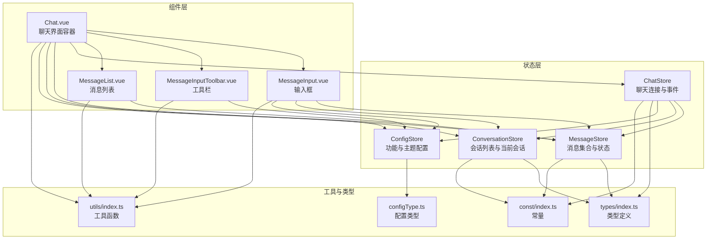
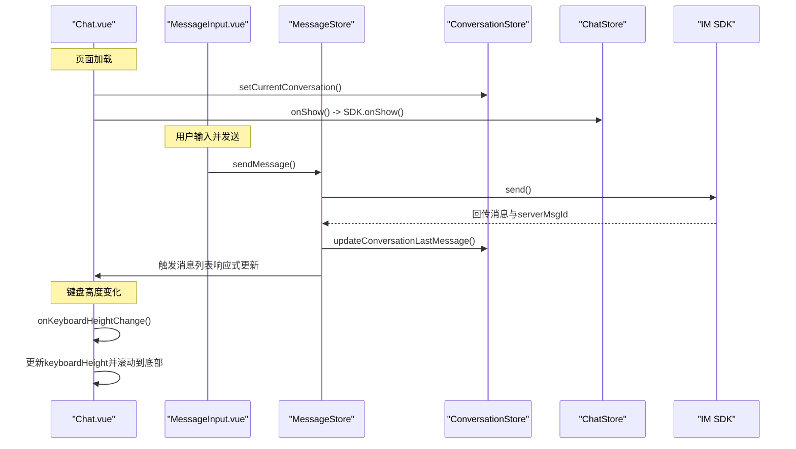
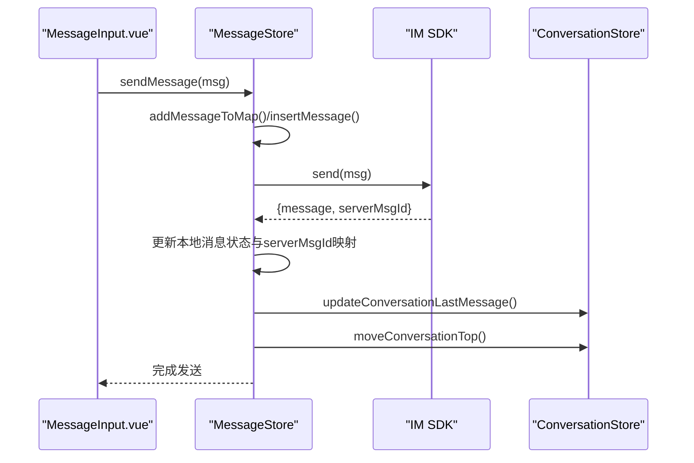
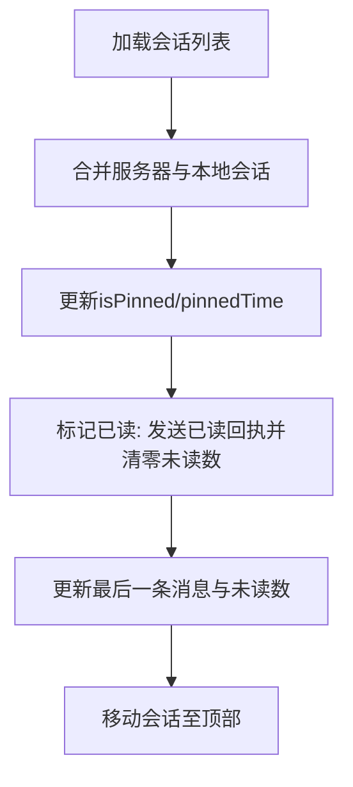
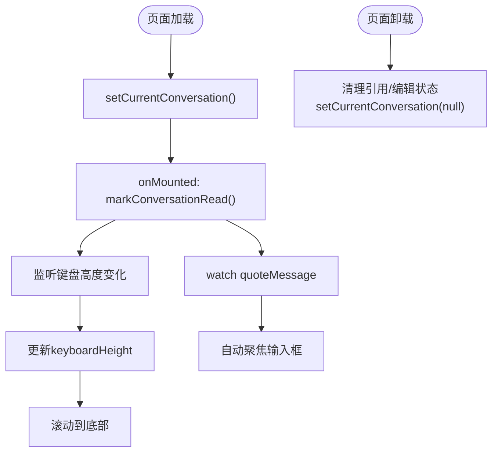
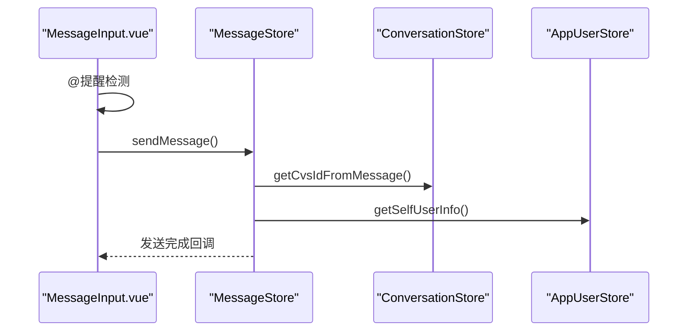
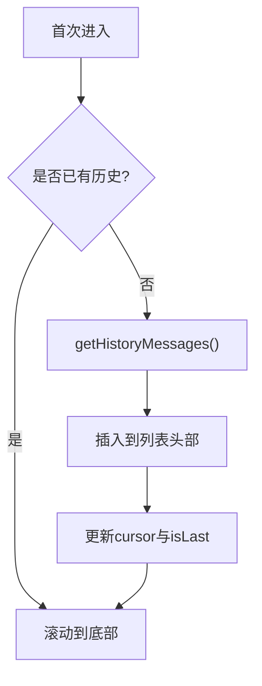
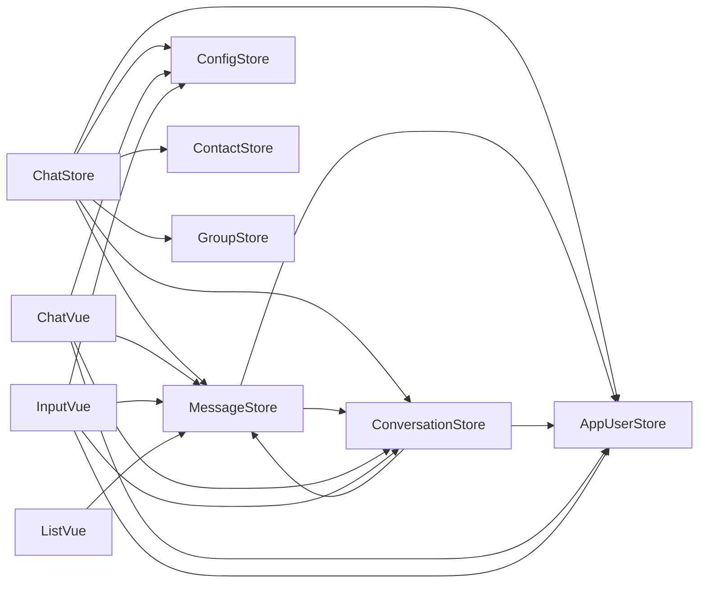

# 聊天状态管理

<cite>
**本文档引用的文件**
- [ChatUIKit/stores/chat.ts](file://ChatUIKit/stores/chat.ts)
- [ChatUIKit/stores/message.ts](file://ChatUIKit/stores/message.ts)
- [ChatUIKit/stores/conversation.ts](file://ChatUIKit/stores/conversation.ts)
- [ChatUIKit/stores/config.ts](file://ChatUIKit/stores/config.ts)
- [ChatUIKit/modules/Chat/index.vue](file://ChatUIKit/modules/Chat/index.vue)
- [ChatUIKit/modules/Chat/components/MessageInput/index.vue](file://ChatUIKit/modules/Chat/components/MessageInput/index.vue)
- [ChatUIKit/modules/Chat/components/MessageInputToolBar/index.vue](file://ChatUIKit/modules/Chat/components/MessageInputToolBar/index.vue)
- [ChatUIKit/modules/Chat/components/Message/messageList.vue](file://ChatUIKit/modules/Chat/components/Message/messageList.vue)
- [ChatUIKit/types/index.ts](file://ChatUIKit/types/index.ts)
- [ChatUIKit/utils/index.ts](file://ChatUIKit/utils/index.ts)
- [ChatUIKit/const/index.ts](file://ChatUIKit/const/index.ts)
- [ChatUIKit/configType.ts](file://ChatUIKit/configType.ts)
</cite>

## 目录
1. [简介](#简介)
2. [项目结构](#项目结构)
3. [核心组件](#核心组件)
4. [架构总览](#架构总览)
5. [详细组件分析](#详细组件分析)
6. [依赖关系分析](#依赖关系分析)
7. [性能考量](#性能考量)
8. [故障排查指南](#故障排查指南)
9. [结论](#结论)

## 简介
本文件系统性阐述 Easemob UIKit 的聊天状态管理机制，覆盖以下方面：
- 聊天界面的状态管理与上下文维护
- 会话激活、消息输入状态与工具栏状态管理
- 聊天界面的打开/关闭、会话切换与临时状态保存
- 聊天状态的响应式更新与界面同步
- 聊天配置、输入法管理与界面布局状态

## 项目结构
聊天状态管理主要由三层构成：
- 状态层（Pinia Store）：负责持久化状态与跨模块协调
- 组件层（Vue 组件）：负责 UI 响应与交互事件
- 工具与类型层：提供工具函数、类型定义与常量

图表来源
- [ChatUIKit/stores/chat.ts](file://ChatUIKit/stores/chat.ts#L29-L398)
- [ChatUIKit/stores/message.ts](file://ChatUIKit/stores/message.ts#L48-L581)
- [ChatUIKit/stores/conversation.ts](file://ChatUIKit/stores/conversation.ts#L40-L421)
- [ChatUIKit/stores/config.ts](file://ChatUIKit/stores/config.ts#L59-L124)
- [ChatUIKit/modules/Chat/index.vue](file://ChatUIKit/modules/Chat/index.vue#L74-L250)
- [ChatUIKit/modules/Chat/components/MessageInput/index.vue](file://ChatUIKit/modules/Chat/components/MessageInput/index.vue#L43-L217)
- [ChatUIKit/modules/Chat/components/MessageInputToolBar/index.vue](file://ChatUIKit/modules/Chat/components/MessageInputToolBar/index.vue#L26-L69)
- [ChatUIKit/modules/Chat/components/Message/messageList.vue](file://ChatUIKit/modules/Chat/components/Message/messageList.vue#L52-L202)
- [ChatUIKit/types/index.ts](file://ChatUIKit/types/index.ts#L1-L100)
- [ChatUIKit/utils/index.ts](file://ChatUIKit/utils/index.ts#L1-L344)
- [ChatUIKit/const/index.ts](file://ChatUIKit/const/index.ts#L1-L37)
- [ChatUIKit/configType.ts](file://ChatUIKit/configType.ts#L1-L68)

章节来源
- [ChatUIKit/stores/chat.ts](file://ChatUIKit/stores/chat.ts#L1-L407)
- [ChatUIKit/stores/message.ts](file://ChatUIKit/stores/message.ts#L1-L581)
- [ChatUIKit/stores/conversation.ts](file://ChatUIKit/stores/conversation.ts#L1-L421)
- [ChatUIKit/stores/config.ts](file://ChatUIKit/stores/config.ts#L1-L124)
- [ChatUIKit/modules/Chat/index.vue](file://ChatUIKit/modules/Chat/index.vue#L1-L255)
- [ChatUIKit/modules/Chat/components/MessageInput/index.vue](file://ChatUIKit/modules/Chat/components/MessageInput/index.vue#L1-L217)
- [ChatUIKit/modules/Chat/components/MessageInputToolBar/index.vue](file://ChatUIKit/modules/Chat/components/MessageInputToolBar/index.vue#L1-L69)
- [ChatUIKit/modules/Chat/components/Message/messageList.vue](file://ChatUIKit/modules/Chat/components/Message/messageList.vue#L1-L284)
- [ChatUIKit/types/index.ts](file://ChatUIKit/types/index.ts#L1-L100)
- [ChatUIKit/utils/index.ts](file://ChatUIKit/utils/index.ts#L1-L344)
- [ChatUIKit/const/index.ts](file://ChatUIKit/const/index.ts#L1-L37)
- [ChatUIKit/configType.ts](file://ChatUIKit/configType.ts#L1-L68)

## 核心组件
- ChatStore：负责 SDK 连接状态、事件监听、登录/登出、初始数据加载与全局清理
- MessageStore：负责消息集合、历史消息拉取、消息发送/接收、消息状态更新、引用/编辑消息管理、语音播放状态
- ConversationStore：负责会话列表、当前会话、置顶/免打扰、会话已读回执、最后一条消息更新
- ConfigStore：负责功能开关与主题配置的读取与动态修改
- Chat.vue：聊天界面容器，负责键盘高度、遮罩层、工具栏/表情面板显隐、引用/编辑状态同步
- MessageInput.vue：输入框组件，负责文本输入、@ 提醒、引用消息、语音录制权限、发送消息
- MessageInputToolbar.vue：输入工具栏，负责图片/视频/文件/名片按钮
- MessageList.vue：消息列表组件，负责历史消息分页加载、滚动到底部、闪烁高亮

章节来源
- [ChatUIKit/stores/chat.ts](file://ChatUIKit/stores/chat.ts#L29-L398)
- [ChatUIKit/stores/message.ts](file://ChatUIKit/stores/message.ts#L48-L581)
- [ChatUIKit/stores/conversation.ts](file://ChatUIKit/stores/conversation.ts#L40-L421)
- [ChatUIKit/stores/config.ts](file://ChatUIKit/stores/config.ts#L59-L124)
- [ChatUIKit/modules/Chat/index.vue](file://ChatUIKit/modules/Chat/index.vue#L74-L250)
- [ChatUIKit/modules/Chat/components/MessageInput/index.vue](file://ChatUIKit/modules/Chat/components/MessageInput/index.vue#L43-L217)
- [ChatUIKit/modules/Chat/components/MessageInputToolBar/index.vue](file://ChatUIKit/modules/Chat/components/MessageInputToolBar/index.vue#L26-L69)
- [ChatUIKit/modules/Chat/components/Message/messageList.vue](file://ChatUIKit/modules/Chat/components/Message/messageList.vue#L52-L202)

## 架构总览
聊天状态管理采用“状态驱动 UI”的设计，通过 Pinia Store 统一管理聊天状态，并由 Vue 组件响应状态变化实现界面同步。

图表来源
- [ChatUIKit/modules/Chat/index.vue](file://ChatUIKit/modules/Chat/index.vue#L229-L245)
- [ChatUIKit/modules/Chat/components/MessageInput/index.vue](file://ChatUIKit/modules/Chat/components/MessageInput/index.vue#L137-L189)
- [ChatUIKit/stores/message.ts](file://ChatUIKit/stores/message.ts#L223-L336)
- [ChatUIKit/stores/conversation.ts](file://ChatUIKit/stores/conversation.ts#L344-L354)
- [ChatUIKit/stores/chat.ts](file://ChatUIKit/stores/chat.ts#L366-L371)

## 详细组件分析

### ChatStore：聊天连接与事件
- 连接状态管理：提供连接状态枚举与 getter，支持设置连接状态
- SDK 事件监听：在首次初始化时注册 SDK 事件处理器，涵盖连接状态、消息类型、联系人/群组事件、会话事件等
- 登录/登出：封装 SDK 登录与登出，登录后加载初始数据并清空事件监听标志位；登出后清理所有 Store 并重置连接状态
- 初始数据加载：登录成功或连接恢复后，加载会话列表、置顶会话、联系人与群组

```mermaid
flowchart TD
Start(["初始化事件"]) --> CheckInit{"是否已初始化?"}
CheckInit --> |是| End(["结束"])
CheckInit --> |否| Register["注册SDK事件处理器"]
Register --> OnConnected["连接成功: 设置连接状态为connected<br/>加载初始数据"]
Register --> OnDisconnected["断开: 设置连接状态为disconnected"]
Register --> OnReconnecting["重连中: 设置连接状态为reconnecting"]
Register --> OnText["文本消息: handleReceivedMessage()"]
Register --> OnImage["图片消息: handleReceivedMessage()"]
Register --> OnAudio["音频消息: handleReceivedMessage()"]
Register --> OnVideo["视频消息: handleReceivedMessage()"]
Register --> OnFile["文件消息: handleReceivedMessage()"]
Register --> OnCustom["自定义消息: handleReceivedMessage()"]
Register --> OnRecall["撤回消息: onRecallMessage()"]
Register --> OnRead["已读回执: updateMessageStatus('read')"]
Register --> OnContact["联系人事件: contact notices"]
Register --> OnGroup["群组事件: handleGroupEvent()"]
Register --> OnConvDelete["会话删除: deleteConversation()"]
Register --> OnConvRead["会话已读: unReadCount=0"]
Register --> OnMute["免打扰: muteConvsMap"]
Register --> OnPin["置顶/取消置顶: 更新会话isPinned/pinnedTime"]
Register --> End
```

图表来源
- [ChatUIKit/stores/chat.ts](file://ChatUIKit/stores/chat.ts#L67-L221)
- [ChatUIKit/stores/chat.ts](file://ChatUIKit/stores/chat.ts#L226-L242)
- [ChatUIKit/stores/chat.ts](file://ChatUIKit/stores/chat.ts#L247-L294)

章节来源
- [ChatUIKit/stores/chat.ts](file://ChatUIKit/stores/chat.ts#L29-L398)

### MessageStore：消息集合与状态
- 消息存储结构：使用 messageMap 与 conversationMessagesMap 分离消息内容与会话消息 ID 序列
- 历史消息拉取：按分页游标拉取历史消息，合并新旧消息并维护 isGetHistoryMessage 标志
- 发送消息：准备本地消息、上传附件（如需要）、调用 SDK 发送、更新本地状态与服务器消息映射、更新会话最后一条消息与置顶
- 接收消息：新增消息到本地、设置 @ 类型、更新会话最后一条消息与未读数、移动会话至顶部、清理非当前会话消息
- 撤回/删除/状态更新：提供撤回、删除与状态更新接口，并同步更新 UI
- 引用/编辑消息：维护 quoteMessage 与 editingMessage，供输入框与编辑面板使用

图表来源
- [ChatUIKit/modules/Chat/components/MessageInput/index.vue](file://ChatUIKit/modules/Chat/components/MessageInput/index.vue#L137-L189)
- [ChatUIKit/stores/message.ts](file://ChatUIKit/stores/message.ts#L223-L336)
- [ChatUIKit/stores/conversation.ts](file://ChatUIKit/stores/conversation.ts#L344-L369)

章节来源
- [ChatUIKit/stores/message.ts](file://ChatUIKit/stores/message.ts#L48-L581)

### ConversationStore：会话列表与当前会话
- 当前会话：setCurrentConversation 维护 currConversation
- 会话列表：getConversationList/getServerPinnedConversations 合并服务器与本地状态，维护置顶与免打扰映射
- 会话操作：置顶/取消置顶、免打扰、删除会话、标记已读（发送已读回执并清零未读数）、更新最后一条消息与未读数
- @ 类型：根据消息内容设置 atType（NONE/ALL/ME）

图表来源
- [ChatUIKit/stores/conversation.ts](file://ChatUIKit/stores/conversation.ts#L126-L160)
- [ChatUIKit/stores/conversation.ts](file://ChatUIKit/stores/conversation.ts#L194-L213)
- [ChatUIKit/stores/conversation.ts](file://ChatUIKit/stores/conversation.ts#L314-L339)
- [ChatUIKit/stores/conversation.ts](file://ChatUIKit/stores/conversation.ts#L344-L369)

章节来源
- [ChatUIKit/stores/conversation.ts](file://ChatUIKit/stores/conversation.ts#L40-L421)

### ConfigStore：功能与主题配置
- 功能开关：inputVoice/inputEmoji/inputMention/inputQuote/inputEdit/inputImage/inputAudio/inputVideo/inputFile、useUserInfo/usePresence/messageStatus、copyMessage/deleteMessage/recallMessage/editMessage/replyMessage、pinConversation/muteConversation/deleteConversation、userCard/isDebug
- 主题配置：avatarShape
- 动态控制：hideFeature/showFeature/reset

章节来源
- [ChatUIKit/stores/config.ts](file://ChatUIKit/stores/config.ts#L59-L124)
- [ChatUIKit/configType.ts](file://ChatUIKit/configType.ts#L3-L67)

### Chat.vue：聊天界面容器与状态同步
- 键盘高度管理：监听 uni.onKeyboardHeightChange，动态更新 keyboardHeight 并触发消息列表滚动到底部
- 工具栏与表情面板：isShowToolbar/isShowEmojiPicker 控制显隐，遮罩层点击关闭工具栏
- 引用/编辑状态：computed isEditingMessage 基于 messageStore.editingMessage；watch 监听 quoteMessage 变化，自动聚焦输入框
- 会话激活：onLoad 时设置当前会话；onMounted 标记会话已读；onUnmounted 清理引用/编辑状态与当前会话
- 输入框事件：onInputTap 关闭工具栏并聚焦输入框；onMention/selectUserCard 触发提及/名片选择

图表来源
- [ChatUIKit/modules/Chat/index.vue](file://ChatUIKit/modules/Chat/index.vue#L229-L245)
- [ChatUIKit/modules/Chat/index.vue](file://ChatUIKit/modules/Chat/index.vue#L211-L227)
- [ChatUIKit/modules/Chat/index.vue](file://ChatUIKit/modules/Chat/index.vue#L136-L139)
- [ChatUIKit/modules/Chat/index.vue](file://ChatUIKit/modules/Chat/index.vue#L124-L134)

章节来源
- [ChatUIKit/modules/Chat/index.vue](file://ChatUIKit/modules/Chat/index.vue#L74-L250)

### MessageInput.vue：输入框与工具栏
- 文本输入：v-model 绑定 text，@input 检测 @ 提醒，@confirm 触发发送
- 工具栏显隐：根据功能开关与文本长度控制 plus/发送图标显示
- 语音录制：权限检查（Android）后弹出录音弹窗
- 引用消息：从 messageStore.quoteMessage 读取并构造扩展字段
- 发送流程：构建消息体（含 @ 列表、名片扩展、引用扩展），调用 messageStore.sendMessage

图表来源
- [ChatUIKit/modules/Chat/components/MessageInput/index.vue](file://ChatUIKit/modules/Chat/components/MessageInput/index.vue#L123-L135)
- [ChatUIKit/modules/Chat/components/MessageInput/index.vue](file://ChatUIKit/modules/Chat/components/MessageInput/index.vue#L137-L189)
- [ChatUIKit/stores/message.ts](file://ChatUIKit/stores/message.ts#L223-L336)
- [ChatUIKit/stores/conversation.ts](file://ChatUIKit/stores/conversation.ts#L104-L114)

章节来源
- [ChatUIKit/modules/Chat/components/MessageInput/index.vue](file://ChatUIKit/modules/Chat/components/MessageInput/index.vue#L43-L217)

### MessageList.vue：消息列表与历史加载
- 响应式渲染：computed 获取会话消息列表，watch 监听长度变化自动滚动到底部
- 历史加载：首次进入或需要更多历史时，按 cursor 分页拉取，插入到列表头部并更新游标
- 闪烁高亮：jumpToMessage 设置 blinkMsgId 实现消息定位闪烁
- 加载状态：isLast/isLoading 控制“加载更多”与“没有更多消息”

图表来源
- [ChatUIKit/modules/Chat/components/Message/messageList.vue](file://ChatUIKit/modules/Chat/components/Message/messageList.vue#L117-L134)
- [ChatUIKit/modules/Chat/components/Message/messageList.vue](file://ChatUIKit/modules/Chat/components/Message/messageList.vue#L136-L172)
- [ChatUIKit/stores/message.ts](file://ChatUIKit/stores/message.ts#L130-L197)

章节来源
- [ChatUIKit/modules/Chat/components/Message/messageList.vue](file://ChatUIKit/modules/Chat/components/Message/messageList.vue#L52-L202)

## 依赖关系分析
- ChatStore 依赖 ConnStore、ConfigStore、AppUserStore、ContactStore、GroupStore、MessageStore
- MessageStore 依赖 ConnStore、ConversationStore、AppUserStore
- ConversationStore 依赖 ConnStore、AppUserStore、MessageStore
- Chat.vue 依赖 MessageStore、ConversationStore、AppUserStore、ConfigStore
- MessageInput.vue 依赖 MessageStore、ConversationStore、AppUserStore、ConfigStore
- MessageList.vue 依赖 MessageStore

图表来源
- [ChatUIKit/stores/chat.ts](file://ChatUIKit/stores/chat.ts#L10-L20)
- [ChatUIKit/stores/message.ts](file://ChatUIKit/stores/message.ts#L11-L21)
- [ChatUIKit/stores/conversation.ts](file://ChatUIKit/stores/conversation.ts#L11-L22)
- [ChatUIKit/modules/Chat/index.vue](file://ChatUIKit/modules/Chat/index.vue#L88-L101)
- [ChatUIKit/modules/Chat/components/MessageInput/index.vue](file://ChatUIKit/modules/Chat/components/MessageInput/index.vue#L46-L66)
- [ChatUIKit/modules/Chat/components/Message/messageList.vue](file://ChatUIKit/modules/Chat/components/Message/messageList.vue#L56-L68)

章节来源
- [ChatUIKit/stores/chat.ts](file://ChatUIKit/stores/chat.ts#L10-L20)
- [ChatUIKit/stores/message.ts](file://ChatUIKit/stores/message.ts#L11-L21)
- [ChatUIKit/stores/conversation.ts](file://ChatUIKit/stores/conversation.ts#L11-L22)
- [ChatUIKit/modules/Chat/index.vue](file://ChatUIKit/modules/Chat/index.vue#L88-L101)
- [ChatUIKit/modules/Chat/components/MessageInput/index.vue](file://ChatUIKit/modules/Chat/components/MessageInput/index.vue#L46-L66)
- [ChatUIKit/modules/Chat/components/Message/messageList.vue](file://ChatUIKit/modules/Chat/components/Message/messageList.vue#L56-L68)

## 性能考量
- 历史消息分页：MessageStore 使用 PAGE_SIZE 与 cursor 控制分页，避免一次性加载过多消息
- 消息上限：MAX_MESSAGES_PER_CONVERSATION 限制单会话消息数量，定期清理超出部分，降低内存占用
- 响应式更新：使用 computed/watch 精准监听状态变化，减少不必要的重渲染
- 滚动优化：MessageList 在消息新增时延迟滚动，配合 opacity 动画提升体验
- 工具函数：throttle/deepClone/sortByPinned 等工具在高频场景下降低计算成本

章节来源
- [ChatUIKit/stores/message.ts](file://ChatUIKit/stores/message.ts#L46-L47)
- [ChatUIKit/const/index.ts](file://ChatUIKit/const/index.ts#L14-L15)
- [ChatUIKit/utils/index.ts](file://ChatUIKit/utils/index.ts#L107-L134)
- [ChatUIKit/utils/index.ts](file://ChatUIKit/utils/index.ts#L184-L197)
- [ChatUIKit/modules/Chat/components/Message/messageList.vue](file://ChatUIKit/modules/Chat/components/Message/messageList.vue#L100-L115)

## 故障排查指南
- 登录失败：检查 ChatStore.login 的错误日志，确认 SDK open 参数与网络状态
- 消息发送失败：查看 MessageStore.sendMessage 的异常分支，关注状态更新为 failed
- 历史消息拉取异常：观察 MessageStore.getHistoryMessages 的错误处理，确保 cursor 与分页参数正确
- 已读回执无效：确认 ConversationStore.markConversationRead 的已读消息创建与发送流程
- 键盘遮挡输入框：检查 Chat.vue 的键盘高度监听与样式计算，确保滚动到底部逻辑生效
- 工具栏/表情面板不关闭：确认 isShowToolbar/isShowEmojiPicker 的状态同步与遮罩层点击事件

章节来源
- [ChatUIKit/stores/chat.ts](file://ChatUIKit/stores/chat.ts#L299-L328)
- [ChatUIKit/stores/message.ts](file://ChatUIKit/stores/message.ts#L332-L336)
- [ChatUIKit/stores/message.ts](file://ChatUIKit/stores/message.ts#L190-L197)
- [ChatUIKit/stores/conversation.ts](file://ChatUIKit/stores/conversation.ts#L314-L339)
- [ChatUIKit/modules/Chat/index.vue](file://ChatUIKit/modules/Chat/index.vue#L136-L139)

## 结论
Easemob UIKit 的聊天状态管理通过 Pinia Store 实现了清晰的状态分离与跨模块协作，结合 Vue 的响应式系统实现了高效的界面同步。核心路径如下：
- 连接与事件：ChatStore 统一管理 SDK 事件与连接状态
- 消息生命周期：MessageStore 负责消息的本地存储、历史拉取、发送与状态更新
- 会话管理：ConversationStore 维护会话列表、当前会话与置顶/免打扰状态
- 界面同步：Chat.vue、MessageInput.vue、MessageList.vue 基于响应式状态驱动 UI 更新
- 配置与工具：ConfigStore 与工具函数保障功能可配置与性能优化

该体系具备良好的扩展性与可维护性，便于后续在消息类型、会话能力与界面交互上持续演进。