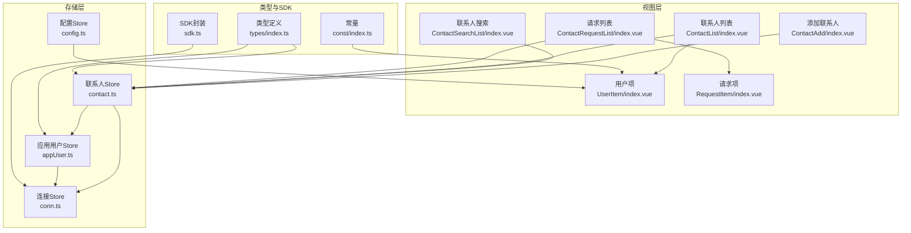
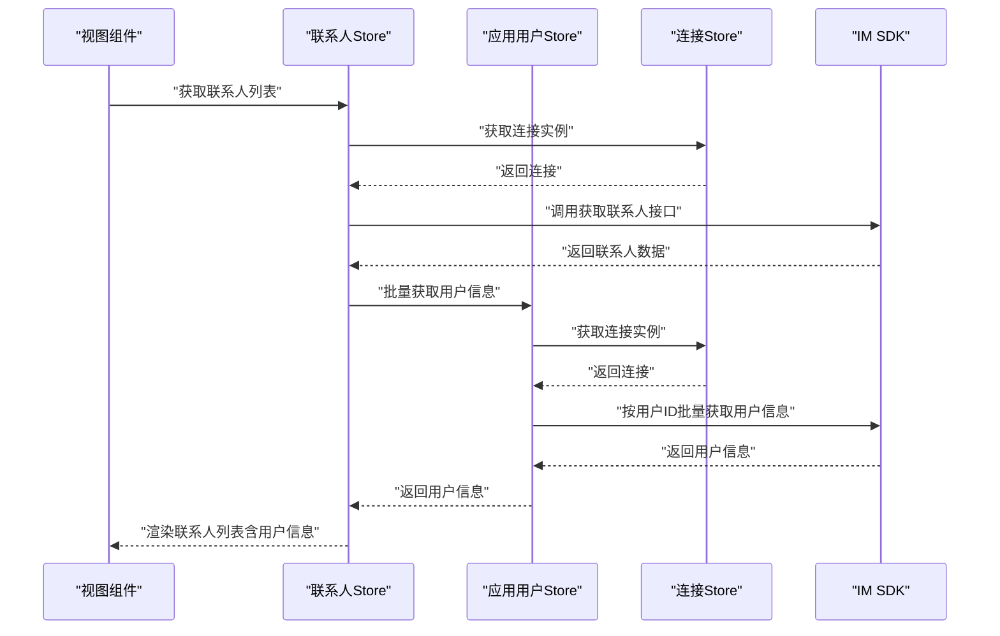
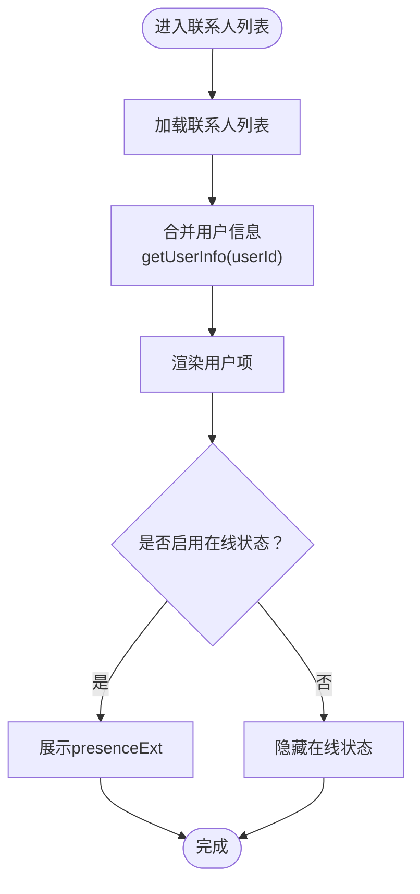
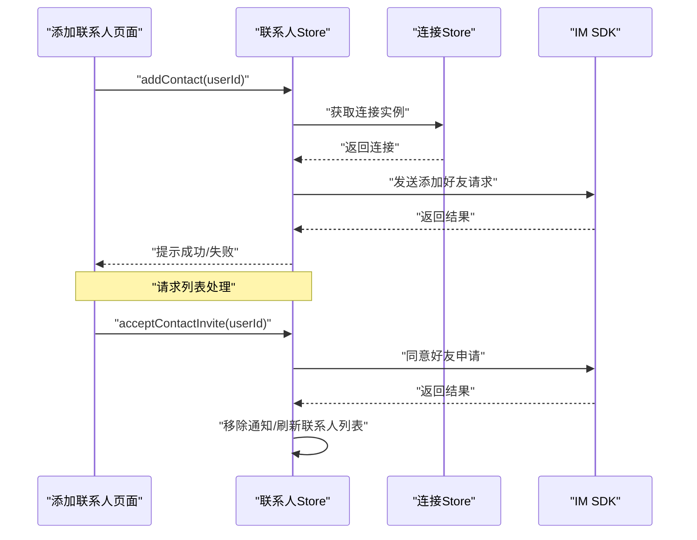
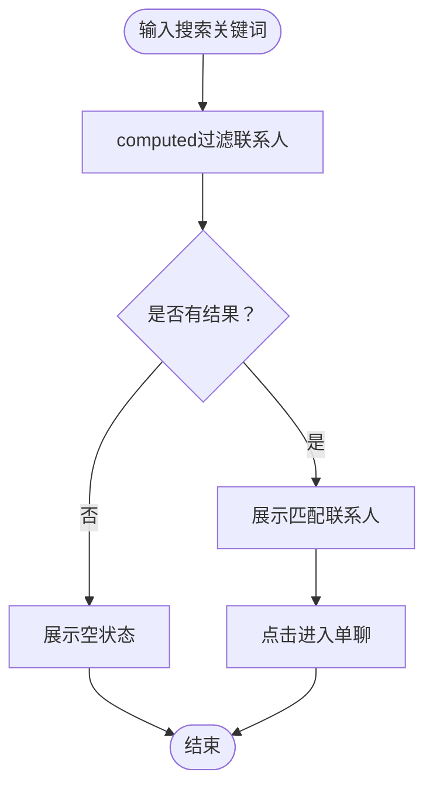
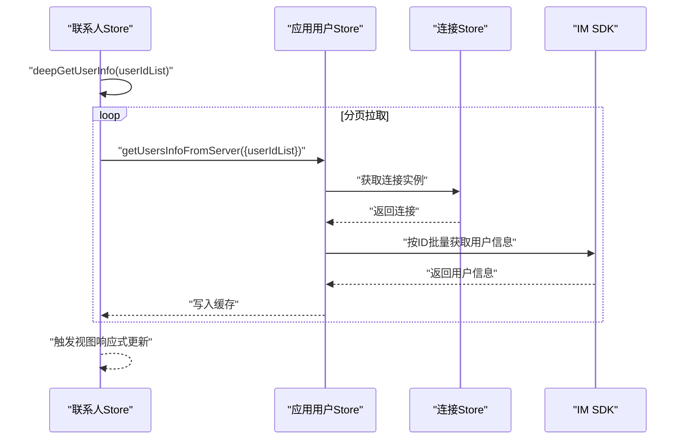
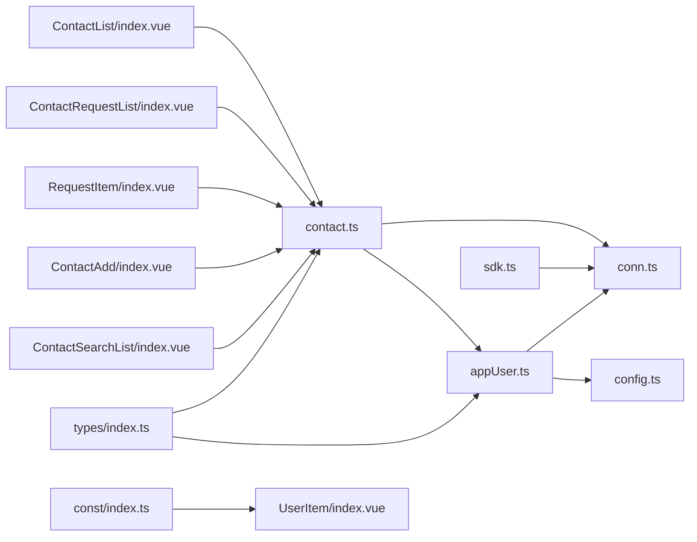

# 联系人状态管理

<cite>
**本文档引用的文件**
- [ChatUIKit/stores/contact.ts](file://ChatUIKit/stores/contact.ts)
- [ChatUIKit/stores/appUser.ts](file://ChatUIKit/stores/appUser.ts)
- [ChatUIKit/stores/conn.ts](file://ChatUIKit/stores/conn.ts)
- [ChatUIKit/stores/config.ts](file://ChatUIKit/stores/config.ts)
- [ChatUIKit/modules/ContactList/index.vue](file://ChatUIKit/modules/ContactList/index.vue)
- [ChatUIKit/modules/ContactList/components/UserItem/index.vue](file://ChatUIKit/modules/ContactList/components/UserItem/index.vue)
- [ChatUIKit/modules/ContactRequestList/index.vue](file://ChatUIKit/modules/ContactRequestList/index.vue)
- [ChatUIKit/modules/ContactRequestList/components/RequestItem/index.vue](file://ChatUIKit/modules/ContactRequestList/components/RequestItem/index.vue)
- [ChatUIKit/modules/ContactAdd/index.vue](file://ChatUIKit/modules/ContactAdd/index.vue)
- [ChatUIKit/modules/ContactSearchList/index.vue](file://ChatUIKit/modules/ContactSearchList/index.vue)
- [ChatUIKit/types/index.ts](file://ChatUIKit/types/index.ts)
- [ChatUIKit/sdk.ts](file://ChatUIKit/sdk.ts)
- [ChatUIKit/const/index.ts](file://ChatUIKit/const/index.ts)
</cite>

## 目录
1. [简介](#简介)
2. [项目结构](#项目结构)
3. [核心组件](#核心组件)
4. [架构总览](#架构总览)
5. [详细组件分析](#详细组件分析)
6. [依赖关系分析](#依赖关系分析)
7. [性能考虑](#性能考虑)
8. [故障排查指南](#故障排查指南)
9. [结论](#结论)
10. [附录](#附录)

## 简介
本文件系统性阐述 Easemob UIKit 中“联系人状态管理”的实现与使用方式，覆盖以下关键能力：
- 联系人列表的存储与管理机制
- 联系人状态（含在线状态）的维护与更新
- 好友添加、请求处理与黑名单管理（通过请求处理流程体现）
- 联系人搜索、分组管理与联系人信息同步
- 联系人状态的响应式更新与实时同步机制
- 联系人配置、备注管理与隐私设置

## 项目结构
围绕联系人状态管理的关键目录与文件如下：
- 存储层（Pinia Store）
  - 联系人管理：ChatUIKit/stores/contact.ts
  - 应用用户信息与在线状态：ChatUIKit/stores/appUser.ts
  - 连接管理：ChatUIKit/stores/conn.ts
  - 配置管理：ChatUIKit/stores/config.ts
- 类型定义与SDK
  - 类型定义：ChatUIKit/types/index.ts
  - SDK封装：ChatUIKit/sdk.ts
  - 常量与预设：ChatUIKit/const/index.ts
- 视图层（模块与组件）
  - 联系人列表：ChatUIKit/modules/ContactList/index.vue
  - 联系人项：ChatUIKit/modules/ContactList/components/UserItem/index.vue
  - 好友请求列表：ChatUIKit/modules/ContactRequestList/index.vue
  - 请求项组件：ChatUIKit/modules/ContactRequestList/components/RequestItem/index.vue
  - 添加联系人：ChatUIKit/modules/ContactAdd/index.vue
  - 联系人搜索：ChatUIKit/modules/ContactSearchList/index.vue

图表来源
- [ChatUIKit/modules/ContactList/index.vue](file://ChatUIKit/modules/ContactList/index.vue#L1-L115)
- [ChatUIKit/modules/ContactList/components/UserItem/index.vue](file://ChatUIKit/modules/ContactList/components/UserItem/index.vue#L1-L165)
- [ChatUIKit/modules/ContactRequestList/index.vue](file://ChatUIKit/modules/ContactRequestList/index.vue#L1-L74)
- [ChatUIKit/modules/ContactRequestList/components/RequestItem/index.vue](file://ChatUIKit/modules/ContactRequestList/components/RequestItem/index.vue#L1-L148)
- [ChatUIKit/modules/ContactAdd/index.vue](file://ChatUIKit/modules/ContactAdd/index.vue#L1-L85)
- [ChatUIKit/modules/ContactSearchList/index.vue](file://ChatUIKit/modules/ContactSearchList/index.vue#L1-L117)
- [ChatUIKit/stores/contact.ts](file://ChatUIKit/stores/contact.ts#L1-L282)
- [ChatUIKit/stores/appUser.ts](file://ChatUIKit/stores/appUser.ts#L1-L242)
- [ChatUIKit/stores/conn.ts](file://ChatUIKit/stores/conn.ts#L1-L84)
- [ChatUIKit/stores/config.ts](file://ChatUIKit/stores/config.ts#L1-L124)
- [ChatUIKit/types/index.ts](file://ChatUIKit/types/index.ts#L1-L100)
- [ChatUIKit/sdk.ts](file://ChatUIKit/sdk.ts#L1-L13)
- [ChatUIKit/const/index.ts](file://ChatUIKit/const/index.ts#L1-L37)

章节来源
- [ChatUIKit/stores/contact.ts](file://ChatUIKit/stores/contact.ts#L1-L282)
- [ChatUIKit/stores/appUser.ts](file://ChatUIKit/stores/appUser.ts#L1-L242)
- [ChatUIKit/stores/conn.ts](file://ChatUIKit/stores/conn.ts#L1-L84)
- [ChatUIKit/stores/config.ts](file://ChatUIKit/stores/config.ts#L1-L124)
- [ChatUIKit/modules/ContactList/index.vue](file://ChatUIKit/modules/ContactList/index.vue#L1-L115)
- [ChatUIKit/modules/ContactList/components/UserItem/index.vue](file://ChatUIKit/modules/ContactList/components/UserItem/index.vue#L1-L165)
- [ChatUIKit/modules/ContactRequestList/index.vue](file://ChatUIKit/modules/ContactRequestList/index.vue#L1-L74)
- [ChatUIKit/modules/ContactRequestList/components/RequestItem/index.vue](file://ChatUIKit/modules/ContactRequestList/components/RequestItem/index.vue#L1-L148)
- [ChatUIKit/modules/ContactAdd/index.vue](file://ChatUIKit/modules/ContactAdd/index.vue#L1-L85)
- [ChatUIKit/modules/ContactSearchList/index.vue](file://ChatUIKit/modules/ContactSearchList/index.vue#L1-L117)
- [ChatUIKit/types/index.ts](file://ChatUIKit/types/index.ts#L1-L100)
- [ChatUIKit/sdk.ts](file://ChatUIKit/sdk.ts#L1-L13)
- [ChatUIKit/const/index.ts](file://ChatUIKit/const/index.ts#L1-L37)

## 核心组件
- 联系人Store（contact.ts）
  - 负责联系人列表、好友申请通知、当前查看用户信息的管理
  - 提供获取联系人、添加/删除好友、接受/拒绝好友申请、通知增删与清空等动作
  - 内部异步拉取用户信息并触发响应式更新
- 应用用户Store（appUser.ts）
  - 负责用户信息与在线状态的缓存与查询
  - 提供从服务器批量获取用户信息、订阅/取消订阅在线状态、发布自定义在线状态等能力
- 连接Store（conn.ts）
  - 管理IM SDK连接实例，提供类型安全的连接访问
- 配置Store（config.ts）
  - 统一管理主题与功能开关，如是否启用在线状态显示等

章节来源
- [ChatUIKit/stores/contact.ts](file://ChatUIKit/stores/contact.ts#L16-L76)
- [ChatUIKit/stores/appUser.ts](file://ChatUIKit/stores/appUser.ts#L17-L79)
- [ChatUIKit/stores/conn.ts](file://ChatUIKit/stores/conn.ts#L15-L40)
- [ChatUIKit/stores/config.ts](file://ChatUIKit/stores/config.ts#L14-L80)

## 架构总览
联系人状态管理采用“视图层-存储层-SDK层”三层架构：
- 视图层通过组件与Store交互，驱动状态变更
- 存储层负责数据聚合、缓存与响应式更新
- SDK层封装底层IM能力，提供联系人、消息、状态等接口

图表来源
- [ChatUIKit/modules/ContactList/index.vue](file://ChatUIKit/modules/ContactList/index.vue#L34-L53)
- [ChatUIKit/stores/contact.ts](file://ChatUIKit/stores/contact.ts#L112-L130)
- [ChatUIKit/stores/appUser.ts](file://ChatUIKit/stores/appUser.ts#L86-L125)
- [ChatUIKit/stores/conn.ts](file://ChatUIKit/stores/conn.ts#L25-L34)
- [ChatUIKit/sdk.ts](file://ChatUIKit/sdk.ts#L1-L13)

## 详细组件分析

### 联系人列表与状态展示
- 数据来源
  - 联系人列表来自联系人Store的contacts
  - 用户昵称、头像、在线状态等来自应用用户Store的getUserInfo
- 展示逻辑
  - 联系人列表组件通过computed将联系人与用户信息合并后渲染
  - 用户项组件根据配置决定是否展示在线状态文本
- 响应式更新
  - 联系人列表与用户信息均通过Pinia getter与Vue computed实现自动追踪与更新

图表来源
- [ChatUIKit/modules/ContactList/index.vue](file://ChatUIKit/modules/ContactList/index.vue#L44-L53)
- [ChatUIKit/modules/ContactList/components/UserItem/index.vue](file://ChatUIKit/modules/ContactList/components/UserItem/index.vue#L44-L51)
- [ChatUIKit/stores/appUser.ts](file://ChatUIKit/stores/appUser.ts#L30-L79)
- [ChatUIKit/stores/config.ts](file://ChatUIKit/stores/config.ts#L65-L80)

章节来源
- [ChatUIKit/modules/ContactList/index.vue](file://ChatUIKit/modules/ContactList/index.vue#L30-L115)
- [ChatUIKit/modules/ContactList/components/UserItem/index.vue](file://ChatUIKit/modules/ContactList/components/UserItem/index.vue#L23-L165)
- [ChatUIKit/stores/appUser.ts](file://ChatUIKit/stores/appUser.ts#L30-L79)
- [ChatUIKit/stores/config.ts](file://ChatUIKit/stores/config.ts#L65-L80)

### 好友添加、请求处理与黑名单管理
- 好友添加
  - 通过添加联系人页面输入目标用户ID，调用联系人Store的addContact发起申请
- 请求处理
  - 请求列表展示“invited”类型的申请通知
  - 请求项组件提供接受/拒绝入口；接受时若已是好友则提示并移除通知
- 黑名单管理
  - 代码中未发现显式的黑名单接口调用；黑名单可通过“拒绝申请”或服务端策略间接影响后续交互

图表来源
- [ChatUIKit/modules/ContactAdd/index.vue](file://ChatUIKit/modules/ContactAdd/index.vue#L42-L61)
- [ChatUIKit/stores/contact.ts](file://ChatUIKit/stores/contact.ts#L135-L147)
- [ChatUIKit/modules/ContactRequestList/index.vue](file://ChatUIKit/modules/ContactRequestList/index.vue#L34-L52)
- [ChatUIKit/modules/ContactRequestList/components/RequestItem/index.vue](file://ChatUIKit/modules/ContactRequestList/components/RequestItem/index.vue#L47-L68)
- [ChatUIKit/stores/contact.ts](file://ChatUIKit/stores/contact.ts#L180-L196)

章节来源
- [ChatUIKit/modules/ContactAdd/index.vue](file://ChatUIKit/modules/ContactAdd/index.vue#L26-L85)
- [ChatUIKit/stores/contact.ts](file://ChatUIKit/stores/contact.ts#L135-L147)
- [ChatUIKit/modules/ContactRequestList/index.vue](file://ChatUIKit/modules/ContactRequestList/index.vue#L21-L74)
- [ChatUIKit/modules/ContactRequestList/components/RequestItem/index.vue](file://ChatUIKit/modules/ContactRequestList/components/RequestItem/index.vue#L23-L148)
- [ChatUIKit/stores/contact.ts](file://ChatUIKit/stores/contact.ts#L180-L196)

### 联系人搜索与分组管理
- 联系人搜索
  - 搜索框输入触发computed过滤，基于用户昵称匹配
  - 支持跳转到单聊页面
- 分组管理
  - 联系人列表顶部展示“群组数量”，来源于群组Store
  - 点击可跳转至群组列表

图表来源
- [ChatUIKit/modules/ContactSearchList/index.vue](file://ChatUIKit/modules/ContactSearchList/index.vue#L47-L77)
- [ChatUIKit/modules/ContactList/index.vue](file://ChatUIKit/modules/ContactList/index.vue#L57-L73)

章节来源
- [ChatUIKit/modules/ContactSearchList/index.vue](file://ChatUIKit/modules/ContactSearchList/index.vue#L29-L117)
- [ChatUIKit/modules/ContactList/index.vue](file://ChatUIKit/modules/ContactList/index.vue#L30-L115)

### 联系人信息同步与实时状态
- 信息同步
  - 联系人Store在获取联系人后，异步批量拉取用户信息，避免阻塞主流程
  - 应用用户Store提供“仅拉取未缓存用户”的去重逻辑，提升性能
- 实时状态
  - 应用用户Store支持订阅/取消订阅用户在线状态，并可发布自定义在线状态
  - 用户项组件根据配置动态显示presenceExt

图表来源
- [ChatUIKit/stores/contact.ts](file://ChatUIKit/stores/contact.ts#L83-L107)
- [ChatUIKit/stores/appUser.ts](file://ChatUIKit/stores/appUser.ts#L86-L125)

章节来源
- [ChatUIKit/stores/contact.ts](file://ChatUIKit/stores/contact.ts#L83-L130)
- [ChatUIKit/stores/appUser.ts](file://ChatUIKit/stores/appUser.ts#L86-L159)

### 联系人配置、备注管理与隐私设置
- 配置
  - 配置Store提供功能开关，如useUserInfo、usePresence等
  - 用户项组件根据配置决定是否展示在线状态
- 备注管理
  - 代码中未发现针对联系人的备注字段或备注接口调用
- 隐私设置
  - 代码中未发现针对联系人的隐私设置接口调用

章节来源
- [ChatUIKit/stores/config.ts](file://ChatUIKit/stores/config.ts#L24-L57)
- [ChatUIKit/modules/ContactList/components/UserItem/index.vue](file://ChatUIKit/modules/ContactList/components/UserItem/index.vue#L44-L51)

## 依赖关系分析
- 联系人Store依赖连接Store与应用用户Store
- 应用用户Store依赖连接Store与配置Store
- 视图层组件通过computed与actions与Store交互
- 类型定义与SDK封装为各层提供类型安全与能力支撑

图表来源
- [ChatUIKit/modules/ContactList/index.vue](file://ChatUIKit/modules/ContactList/index.vue#L34-L53)
- [ChatUIKit/modules/ContactRequestList/index.vue](file://ChatUIKit/modules/ContactRequestList/index.vue#L30-L31)
- [ChatUIKit/modules/ContactRequestList/components/RequestItem/index.vue](file://ChatUIKit/modules/ContactRequestList/components/RequestItem/index.vue#L38-L40)
- [ChatUIKit/modules/ContactAdd/index.vue](file://ChatUIKit/modules/ContactAdd/index.vue#L30-L34)
- [ChatUIKit/modules/ContactSearchList/index.vue](file://ChatUIKit/modules/ContactSearchList/index.vue#L35-L45)
- [ChatUIKit/stores/contact.ts](file://ChatUIKit/stores/contact.ts#L12-L13)
- [ChatUIKit/stores/appUser.ts](file://ChatUIKit/stores/appUser.ts#L12-L14)
- [ChatUIKit/stores/conn.ts](file://ChatUIKit/stores/conn.ts#L11-L13)
- [ChatUIKit/stores/config.ts](file://ChatUIKit/stores/config.ts#L10-L12)
- [ChatUIKit/types/index.ts](file://ChatUIKit/types/index.ts#L1-L2)
- [ChatUIKit/sdk.ts](file://ChatUIKit/sdk.ts#L1-L6)
- [ChatUIKit/const/index.ts](file://ChatUIKit/const/index.ts#L17-L25)

章节来源
- [ChatUIKit/stores/contact.ts](file://ChatUIKit/stores/contact.ts#L10-L14)
- [ChatUIKit/stores/appUser.ts](file://ChatUIKit/stores/appUser.ts#L11-L15)
- [ChatUIKit/stores/conn.ts](file://ChatUIKit/stores/conn.ts#L10-L13)
- [ChatUIKit/stores/config.ts](file://ChatUIKit/stores/config.ts#L10-L12)
- [ChatUIKit/types/index.ts](file://ChatUIKit/types/index.ts#L1-L2)
- [ChatUIKit/sdk.ts](file://ChatUIKit/sdk.ts#L1-L6)
- [ChatUIKit/const/index.ts](file://ChatUIKit/const/index.ts#L17-L25)

## 性能考虑
- 分页拉取用户信息：联系人Store在深拷贝用户信息时采用分页（每页100），避免一次性处理大量用户导致卡顿
- 去重与缓存：应用用户Store仅对未缓存用户发起服务器请求，减少重复网络开销
- 响应式更新：通过computed与getter自动追踪依赖，避免手动订阅与复杂状态同步逻辑

章节来源
- [ChatUIKit/stores/contact.ts](file://ChatUIKit/stores/contact.ts#L83-L107)
- [ChatUIKit/stores/appUser.ts](file://ChatUIKit/stores/appUser.ts#L86-L125)

## 故障排查指南
- 添加好友失败
  - 检查连接Store是否已初始化
  - 查看联系人Store的addContact异常日志
- 获取联系人为空
  - 确认已调用getContacts并等待异步用户信息拉取完成
- 在线状态不更新
  - 确认已订阅用户在线状态并检查presenceExt是否正确
  - 检查配置Store中的usePresence开关
- 请求列表未显示
  - 确认通知列表中存在ext为“invited”的记录
  - 检查请求列表组件的过滤逻辑

章节来源
- [ChatUIKit/stores/conn.ts](file://ChatUIKit/stores/conn.ts#L25-L40)
- [ChatUIKit/stores/contact.ts](file://ChatUIKit/stores/contact.ts#L135-L147)
- [ChatUIKit/stores/contact.ts](file://ChatUIKit/stores/contact.ts#L112-L130)
- [ChatUIKit/stores/appUser.ts](file://ChatUIKit/stores/appUser.ts#L130-L159)
- [ChatUIKit/stores/config.ts](file://ChatUIKit/stores/config.ts#L65-L80)
- [ChatUIKit/modules/ContactRequestList/index.vue](file://ChatUIKit/modules/ContactRequestList/index.vue#L34-L38)

## 结论
Easemob UIKit 的联系人状态管理通过Pinia Store实现了清晰的数据流与响应式更新，结合IM SDK提供了完整的联系人生命周期管理能力。当前实现覆盖了联系人列表、好友申请、用户信息与在线状态同步等核心场景；对于黑名单、备注与隐私设置，代码中未见直接实现，建议通过服务端策略或扩展Store进行补充。

## 附录
- 关键类型与常量
  - 联系人通知类型、用户信息与在线状态类型定义位于类型文件
  - 在线状态枚举与资源URL位于常量文件

章节来源
- [ChatUIKit/types/index.ts](file://ChatUIKit/types/index.ts#L14-L31)
- [ChatUIKit/const/index.ts](file://ChatUIKit/const/index.ts#L17-L25)