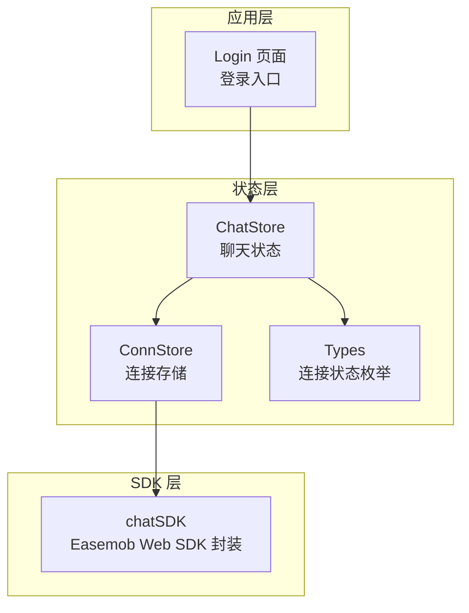
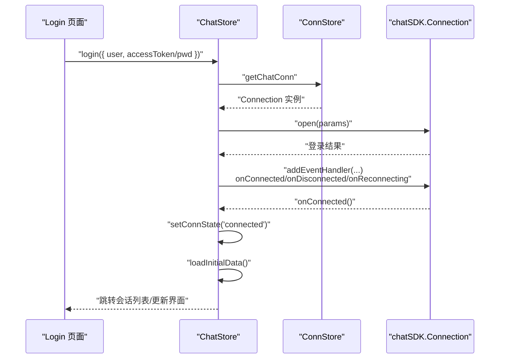
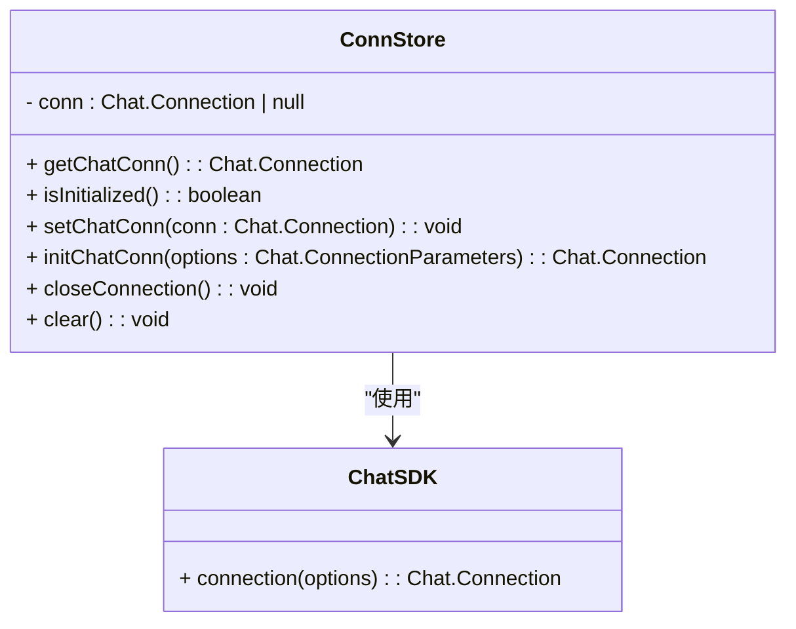
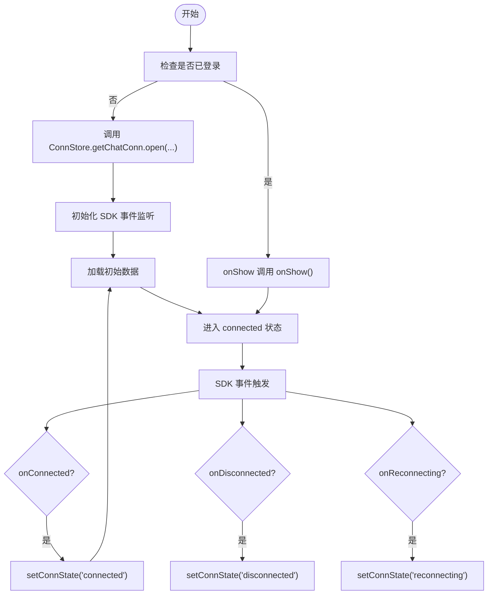
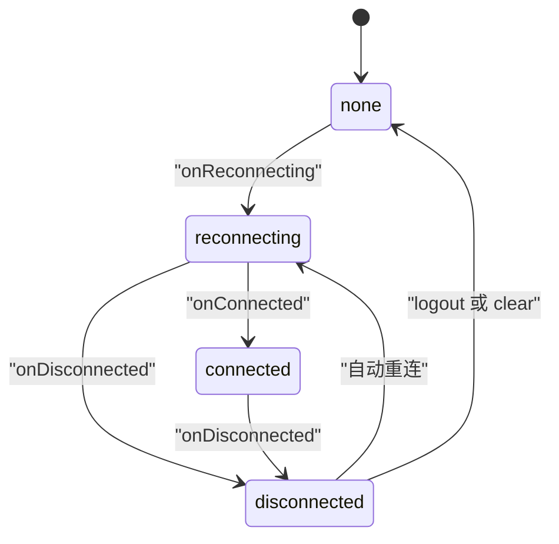
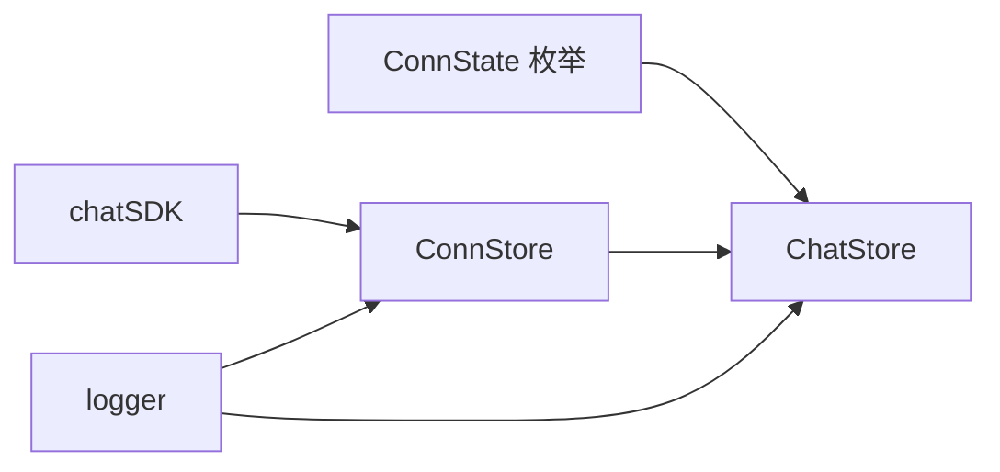

# 连接状态管理

<cite>
**本文引用的文件**
- [ChatUIKit/stores/conn.ts](file://ChatUIKit/stores/conn.ts)
- [ChatUIKit/stores/chat.ts](file://ChatUIKit/stores/chat.ts)
- [ChatUIKit/types/index.ts](file://ChatUIKit/types/index.ts)
- [ChatUIKit/sdk.ts](file://ChatUIKit/sdk.ts)
- [ChatUIKit/log.ts](file://ChatUIKit/log.ts)
- [demo/ChatUIKit/stores/conn.ts](file://demo/ChatUIKit/stores/conn.ts)
- [demo/ChatUIKit/stores/chat.ts](file://demo/ChatUIKit/stores/chat.ts)
- [demo/ChatUIKit/types/index.ts](file://demo/ChatUIKit/types/index.ts)
- [demo/ChatUIKit/sdk.ts](file://demo/ChatUIKit/sdk.ts)
- [demo/ChatUIKit/log.ts](file://demo/ChatUIKit/log.ts)
- [demo/pages/Login/index.vue](file://demo/pages/Login/index.vue)
</cite>

## 目录
1. [简介](#简介)
2. [项目结构](#项目结构)
3. [核心组件](#核心组件)
4. [架构总览](#架构总览)
5. [详细组件分析](#详细组件分析)
6. [依赖关系分析](#依赖关系分析)
7. [性能考量](#性能考量)
8. [故障排查指南](#故障排查指南)
9. [结论](#结论)

## 简介
本文件系统性阐述 Easemob UIKit 在 UniApp 场景下的“连接状态管理”机制，覆盖 IM 连接生命周期、连接建立与断开处理、重连状态、错误处理策略、WebSocket 连接管理、心跳与网络状态监听、以及连接状态变更的响应式处理与组件更新机制。同时解释连接配置参数、认证流程与安全连接处理方式。

## 项目结构
围绕连接状态管理的关键模块如下：
- 连接存储：负责维护与暴露 IM 连接实例，提供初始化、关闭与清理能力
- 聊天存储：负责订阅 SDK 事件，驱动连接状态变更，并协调消息、会话、联系人、群组等数据流
- 类型定义：统一连接状态枚举与 SDK 类型
- SDK 包装：对 Easemob Web SDK 的封装与导出
- 日志工具：统一记录连接与事件处理过程中的关键信息

图表来源
- [ChatUIKit/stores/conn.ts](file://ChatUIKit/stores/conn.ts#L1-L84)
- [ChatUIKit/stores/chat.ts](file://ChatUIKit/stores/chat.ts#L1-L407)
- [ChatUIKit/types/index.ts](file://ChatUIKit/types/index.ts#L12-L12)
- [ChatUIKit/sdk.ts](file://ChatUIKit/sdk.ts#L1-L13)
- [demo/pages/Login/index.vue](file://demo/pages/Login/index.vue#L182-L237)

章节来源
- [ChatUIKit/stores/conn.ts](file://ChatUIKit/stores/conn.ts#L1-L84)
- [ChatUIKit/stores/chat.ts](file://ChatUIKit/stores/chat.ts#L1-L407)
- [ChatUIKit/types/index.ts](file://ChatUIKit/types/index.ts#L12-L12)
- [ChatUIKit/sdk.ts](file://ChatUIKit/sdk.ts#L1-L13)
- [demo/pages/Login/index.vue](file://demo/pages/Login/index.vue#L182-L237)

## 核心组件
- 连接存储（ConnStore）
  - 维护 IM 连接实例，提供初始化、设置、关闭与清理方法
  - 提供类型安全的连接访问器，避免未初始化直接使用
- 聊天存储（ChatStore）
  - 订阅 SDK 事件，驱动连接状态变更（connected/disconnected/reconnecting/none）
  - 登录时触发 open，登出时触发 close；登录成功后初始化 SDK 事件监听
  - 在连接成功后加载初始数据（会话、联系人、群组等）
- 类型定义（Types）
  - 定义连接状态枚举：none、reconnecting、connected、disconnected
- SDK 包装（chatSDK）
  - 对 Easemob Web SDK 的统一封装，导出 connection 构造器与静态类型
- 日志工具（logger）
  - 统一输出连接与事件处理日志，便于排障

章节来源
- [ChatUIKit/stores/conn.ts](file://ChatUIKit/stores/conn.ts#L15-L83)
- [ChatUIKit/stores/chat.ts](file://ChatUIKit/stores/chat.ts#L22-L61)
- [ChatUIKit/types/index.ts](file://ChatUIKit/types/index.ts#L12-L12)
- [ChatUIKit/sdk.ts](file://ChatUIKit/sdk.ts#L1-L13)
- [ChatUIKit/log.ts](file://ChatUIKit/log.ts#L1-L78)

## 架构总览
下图展示了从登录到连接建立、事件监听、状态变更与组件更新的整体流程。

图表来源
- [demo/pages/Login/index.vue](file://demo/pages/Login/index.vue#L182-L237)
- [ChatUIKit/stores/chat.ts](file://ChatUIKit/stores/chat.ts#L299-L328)
- [ChatUIKit/stores/chat.ts](file://ChatUIKit/stores/chat.ts#L67-L221)
- [ChatUIKit/stores/conn.ts](file://ChatUIKit/stores/conn.ts#L29-L34)

章节来源
- [demo/pages/Login/index.vue](file://demo/pages/Login/index.vue#L182-L237)
- [ChatUIKit/stores/chat.ts](file://ChatUIKit/stores/chat.ts#L299-L328)
- [ChatUIKit/stores/chat.ts](file://ChatUIKit/stores/chat.ts#L67-L221)
- [ChatUIKit/stores/conn.ts](file://ChatUIKit/stores/conn.ts#L29-L34)

## 详细组件分析

### 连接存储（ConnStore）分析
- 职责
  - 维护 Connection 实例，提供初始化、设置、关闭与清理
  - 提供类型安全的访问器，未初始化时抛错，避免运行期空指针
- 关键点
  - 初始化：仅在未存在连接时创建新实例，避免重复初始化
  - 关闭：调用底层 close 并清空实例
  - 清理：清空状态，便于重新登录或测试

图表来源
- [ChatUIKit/stores/conn.ts](file://ChatUIKit/stores/conn.ts#L15-L83)
- [ChatUIKit/sdk.ts](file://ChatUIKit/sdk.ts#L1-L13)

章节来源
- [ChatUIKit/stores/conn.ts](file://ChatUIKit/stores/conn.ts#L15-L83)
- [ChatUIKit/sdk.ts](file://ChatUIKit/sdk.ts#L1-L13)

### 聊天存储（ChatStore）分析
- 连接状态管理
  - 通过 SDK 事件驱动状态变更：onConnected → connected；onDisconnected → disconnected；onReconnecting → reconnecting
  - 初始状态为 none，登录成功后进入 connected
- 登录与登出
  - login：调用 Connection.open，成功后初始化 SDK 事件并加载初始数据
  - logout：调用 Connection.close，清理各 Store 状态并复位连接状态
- 初始数据加载
  - 登录成功或连接恢复后，加载会话列表、联系人、群组等
- 事件处理
  - 收到消息、联系人、群组、会话等事件时，协调对应 Store 更新数据

图表来源
- [ChatUIKit/stores/chat.ts](file://ChatUIKit/stores/chat.ts#L299-L328)
- [ChatUIKit/stores/chat.ts](file://ChatUIKit/stores/chat.ts#L67-L221)
- [ChatUIKit/stores/chat.ts](file://ChatUIKit/stores/chat.ts#L366-L371)

章节来源
- [ChatUIKit/stores/chat.ts](file://ChatUIKit/stores/chat.ts#L22-L61)
- [ChatUIKit/stores/chat.ts](file://ChatUIKit/stores/chat.ts#L67-L221)
- [ChatUIKit/stores/chat.ts](file://ChatUIKit/stores/chat.ts#L299-L328)
- [ChatUIKit/stores/chat.ts](file://ChatUIKit/stores/chat.ts#L333-L361)
- [ChatUIKit/stores/chat.ts](file://ChatUIKit/stores/chat.ts#L366-L371)

### 连接状态生命周期与重连机制
- 生命周期
  - none：未初始化或已登出
  - connecting：底层正在建立连接（由 SDK 内部状态映射）
  - reconnecting：底层正在进行重连
  - connected：连接建立成功
  - disconnected：连接断开
- 重连机制
  - 由 SDK 内部自动进行，上层通过 onReconnecting 与 onConnected 事件感知
  - onReconnecting 期间可提示用户网络不稳定
  - onConnected 后自动触发 loadInitialData，保证数据一致性

图表来源
- [ChatUIKit/types/index.ts](file://ChatUIKit/types/index.ts#L12-L12)
- [ChatUIKit/stores/chat.ts](file://ChatUIKit/stores/chat.ts#L74-L88)
- [ChatUIKit/stores/chat.ts](file://ChatUIKit/stores/chat.ts#L333-L361)

章节来源
- [ChatUIKit/types/index.ts](file://ChatUIKit/types/index.ts#L12-L12)
- [ChatUIKit/stores/chat.ts](file://ChatUIKit/stores/chat.ts#L74-L88)
- [ChatUIKit/stores/chat.ts](file://ChatUIKit/stores/chat.ts#L333-L361)

### WebSocket 连接管理、心跳与网络状态监听
- WebSocket 连接管理
  - 通过 Connection.open 建立连接，Connection.close 关闭连接
  - onShow 生命周期中调用 onShow，用于检测连接有效性（如小程序/APP切前台场景）
- 心跳检测
  - 由 SDK 内部维护，上层通过 onReconnecting 与 onConnected 事件感知
- 网络状态监听
  - 代码中未显式监听系统网络状态变化；如需增强，可在 onShow 中结合平台 API 判断网络状态并主动触发重连

章节来源
- [ChatUIKit/stores/chat.ts](file://ChatUIKit/stores/chat.ts#L310-L310)
- [ChatUIKit/stores/chat.ts](file://ChatUIKit/stores/chat.ts#L338-L338)
- [ChatUIKit/stores/chat.ts](file://ChatUIKit/stores/chat.ts#L366-L371)

### 连接状态变更的响应式处理与组件更新
- 响应式处理
  - ChatStore 维护 connState，setConnState 更新状态
  - 组件可通过 getConnState 获取当前状态，驱动 UI 变化（如显示“重连中”、“离线”等）
- 组件更新
  - 登录成功与连接恢复后，自动加载初始数据，确保界面数据一致
  - 事件回调中按需更新消息、会话、联系人、群组等 Store

章节来源
- [ChatUIKit/stores/chat.ts](file://ChatUIKit/stores/chat.ts#L39-L40)
- [ChatUIKit/stores/chat.ts](file://ChatUIKit/stores/chat.ts#L58-L61)
- [ChatUIKit/stores/chat.ts](file://ChatUIKit/stores/chat.ts#L377-L396)

### 连接配置参数、认证流程与安全连接
- 连接配置参数
  - ConnectionParameters 由 SDK 定义，ConnStore.initChatConn 接收该参数并创建连接实例
- 认证流程
  - 登录：ChatStore.login 调用 Connection.open，传入 user、pwd 或 accessToken
  - 登出：ChatStore.logout 调用 Connection.close，清理 Store 并复位状态
- 安全连接
  - 使用 accessToken 进行无密码登录，降低明文密码传输风险
  - 登录成功后立即初始化事件监听，确保后续状态与消息处理正常

章节来源
- [ChatUIKit/stores/conn.ts](file://ChatUIKit/stores/conn.ts#L54-L62)
- [ChatUIKit/stores/chat.ts](file://ChatUIKit/stores/chat.ts#L299-L328)
- [demo/pages/Login/index.vue](file://demo/pages/Login/index.vue#L200-L237)

## 依赖关系分析
- ConnStore 依赖 chatSDK.connection 构造连接实例
- ChatStore 依赖 ConnStore 提供的连接实例，订阅 SDK 事件并协调数据流
- 类型定义 ConnState 为连接状态枚举，被 ChatStore 与组件消费
- 日志工具贯穿连接初始化、登录、事件处理等关键节点

图表来源
- [ChatUIKit/types/index.ts](file://ChatUIKit/types/index.ts#L12-L12)
- [ChatUIKit/stores/conn.ts](file://ChatUIKit/stores/conn.ts#L10-L13)
- [ChatUIKit/stores/chat.ts](file://ChatUIKit/stores/chat.ts#L10-L20)
- [ChatUIKit/log.ts](file://ChatUIKit/log.ts#L1-L78)

章节来源
- [ChatUIKit/types/index.ts](file://ChatUIKit/types/index.ts#L12-L12)
- [ChatUIKit/stores/conn.ts](file://ChatUIKit/stores/conn.ts#L10-L13)
- [ChatUIKit/stores/chat.ts](file://ChatUIKit/stores/chat.ts#L10-L20)
- [ChatUIKit/log.ts](file://ChatUIKit/log.ts#L1-L78)

## 性能考量
- 事件监听一次性初始化：isInitEvent 标记避免重复绑定
- 初始数据加载策略：登录成功后统一加载会话、联系人、群组，减少多次请求
- 连接实例复用：ConnStore.initChatConn 仅在未初始化时创建，避免重复实例化带来的资源浪费
- 日志按需输出：Logger 默认关闭调试模式，仅在开启调试时输出详细日志，降低生产环境开销

章节来源
- [ChatUIKit/stores/chat.ts](file://ChatUIKit/stores/chat.ts#L67-L69)
- [ChatUIKit/stores/chat.ts](file://ChatUIKit/stores/chat.ts#L377-L396)
- [ChatUIKit/stores/conn.ts](file://ChatUIKit/stores/conn.ts#L54-L62)
- [ChatUIKit/log.ts](file://ChatUIKit/log.ts#L21-L30)

## 故障排查指南
- 未初始化连接
  - 现象：访问 getChatConn 抛错
  - 处理：先调用 initChatConn(options) 创建连接实例，再进行登录
- 登录失败
  - 现象：login 抛错并记录错误日志
  - 处理：检查参数（user、accessToken/pwd）、网络状态与服务器返回信息
- 连接断开
  - 现象：setConnState('disconnected')，界面显示离线
  - 处理：等待 SDK 自动重连；必要时在 onShow 中主动触发重连
- 事件未生效
  - 现象：消息或事件未更新界面
  - 处理：确认 initSDKEvent 已执行且未重复初始化；检查对应 Store 的数据更新逻辑

章节来源
- [ChatUIKit/stores/conn.ts](file://ChatUIKit/stores/conn.ts#L29-L32)
- [ChatUIKit/stores/chat.ts](file://ChatUIKit/stores/chat.ts#L324-L327)
- [ChatUIKit/stores/chat.ts](file://ChatUIKit/stores/chat.ts#L82-L84)
- [ChatUIKit/stores/chat.ts](file://ChatUIKit/stores/chat.ts#L67-L69)

## 结论
Easemob UIKit 的连接状态管理以 Pinia Store 为核心，通过 ConnStore 统一管理连接实例，ChatStore 订阅 SDK 事件驱动状态流转，并在登录成功后加载初始数据。连接状态包括 none、reconnecting、connected、disconnected 四态，重连由 SDK 内部完成，上层通过事件感知并更新 UI。建议在实际项目中结合平台网络状态 API 增强重连策略，并在生产环境谨慎开启调试日志以控制性能开销。