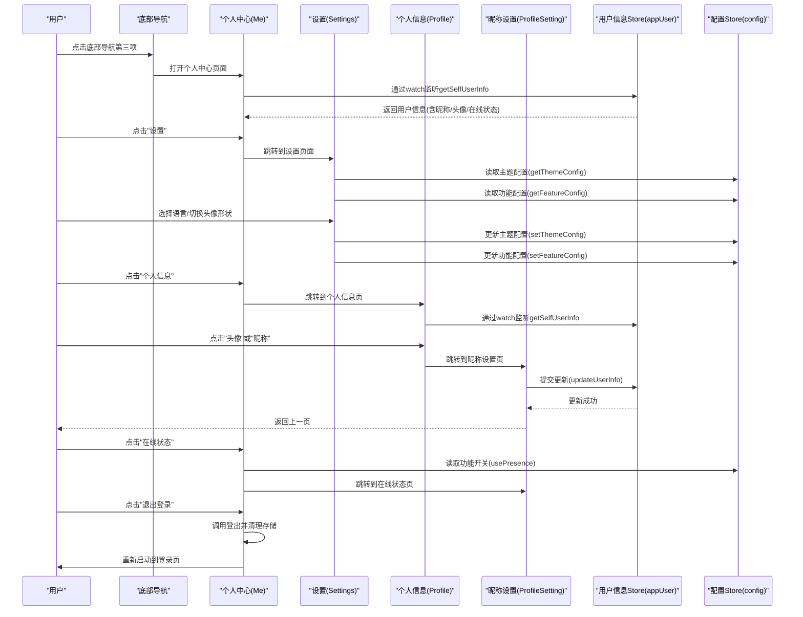
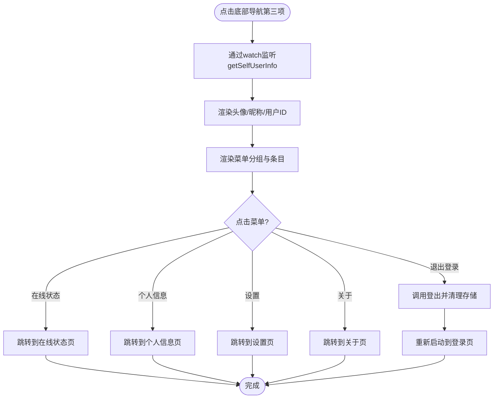
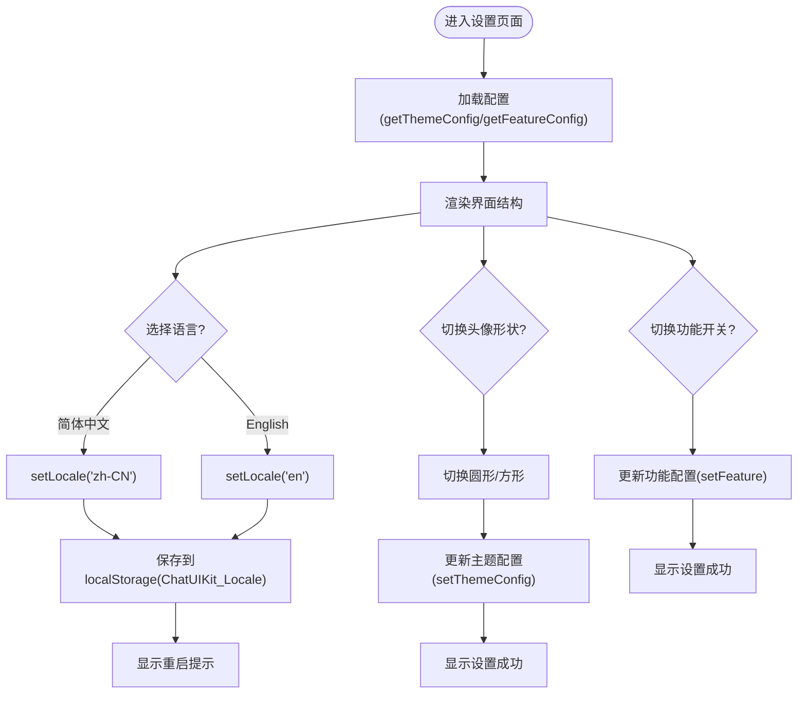
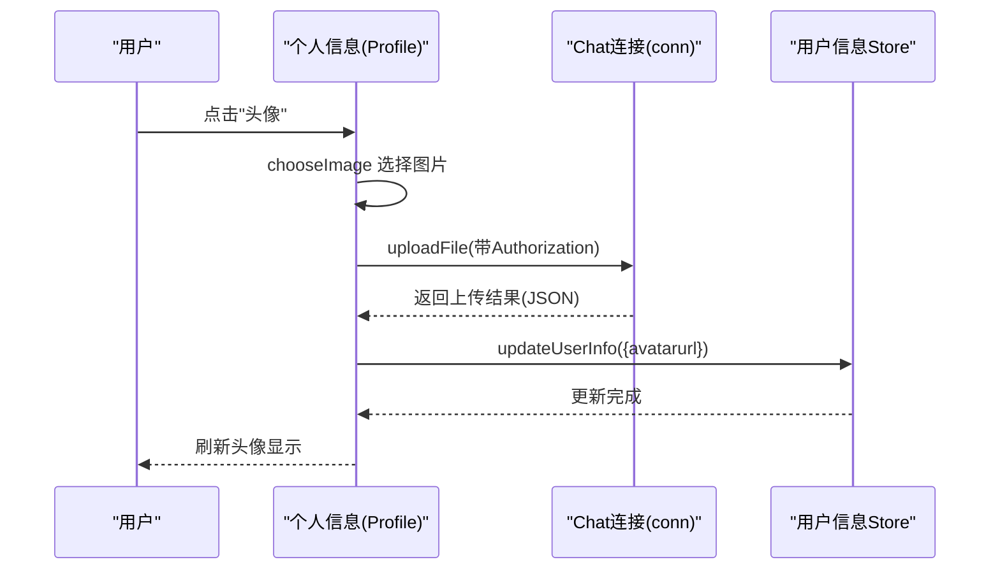
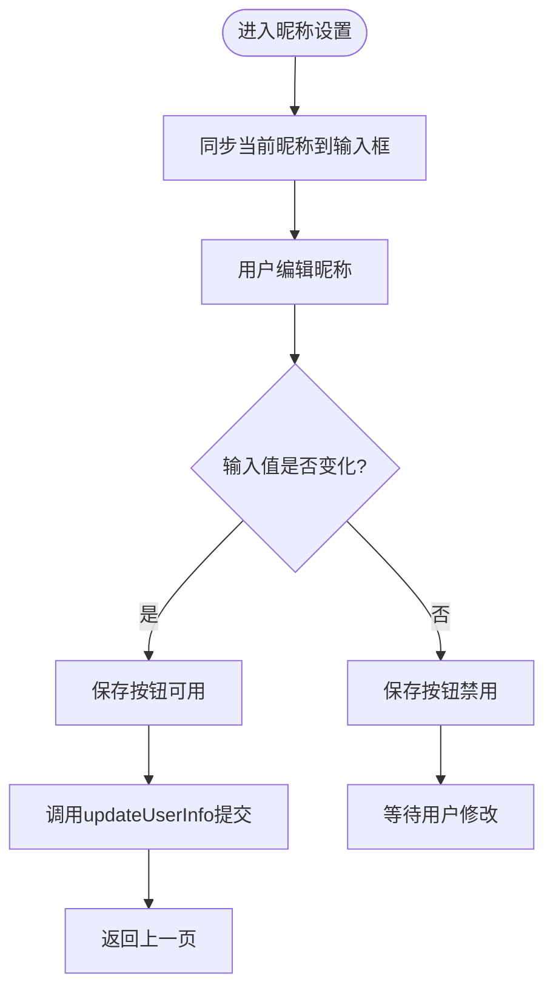
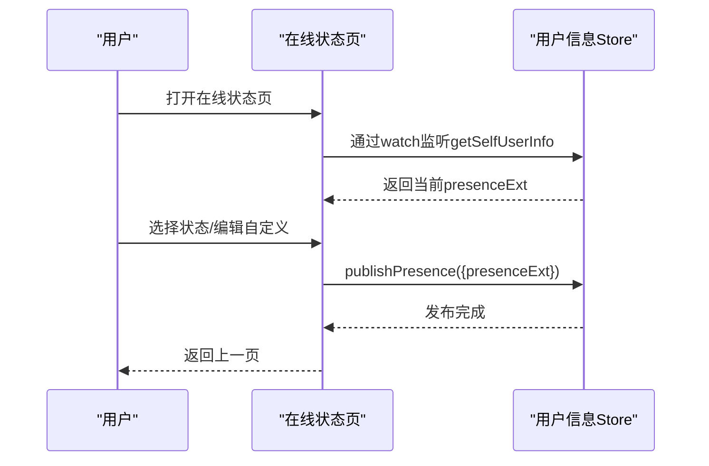
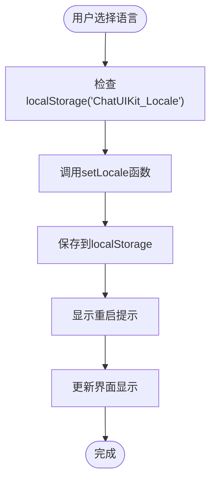
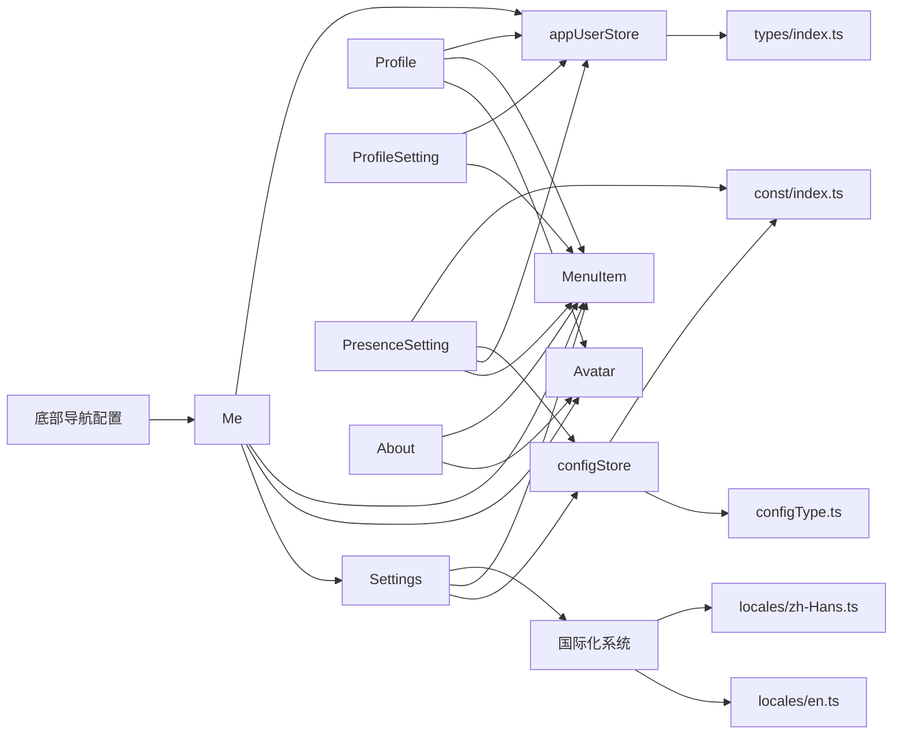

# 个人中心页面

<cite>
**本文档引用的文件**
- [demo/pages/Me/index.vue](file://demo/pages/Me/index.vue)
- [demo/pages/Me/style.scss](file://demo/pages/Me/style.scss)
- [demo/pages/Profile/index.vue](file://demo/pages/Profile/index.vue)
- [demo/pages/ProfileSetting/index.vue](file://demo/pages/ProfileSetting/index.vue)
- [demo/pages/PresenceSetting/index.vue](file://demo/pages/PresenceSetting/index.vue)
- [demo/pages/About/index.vue](file://demo/pages/About/index.vue)
- [demo/pages.json](file://demo/pages.json)
- [demo/const/locales.ts](file://demo/const/locales.ts)
- [ChatUIKit/components/Avatar/index.vue](file://ChatUIKit/components/Avatar/index.vue)
- [ChatUIKit/components/MenuItem/index.vue](file://ChatUIKit/components/MenuItem/index.vue)
- [ChatUIKit/stores/appUser.ts](file://ChatUIKit/stores/appUser.ts)
- [ChatUIKit/stores/config.ts](file://ChatUIKit/stores/config.ts)
- [ChatUIKit/const/index.ts](file://ChatUIKit/const/index.ts)
- [ChatUIKit/types/index.ts](file://ChatUIKit/types/index.ts)
- [ChatUIKit/configType.ts](file://ChatUIKit/configType.ts)
- [vue2-demo/pages/me/settings.vue](file://vue2-demo/pages/me/settings.vue)
- [vue2-demo/pages.json](file://vue2-demo/pages.json)
- [ChatUIKit/locales/index.ts](file://ChatUIKit/locales/index.ts)
- [ChatUIKit/locales/en.ts](file://ChatUIKit/locales/en.ts)
- [ChatUIKit/locales/zh-Hans.ts](file://ChatUIKit/locales/zh-Hans.ts)
- [ChatUIKit-vue2/locales/index.js](file://ChatUIKit-vue2/locales/index.js)
- [vue2-demo/ChatUIKit/locales/index.js](file://vue2-demo/ChatUIKit/locales/index.js)
</cite>

## 更新摘要
**变更内容**
- **头像显示样式增强**：改进了头像的圆角边框设计，支持圆形(50%)和方形(4px)两种样式，提供更现代化的视觉效果
- **资料管理功能优化**：在个人中心页面中增强了头像展示效果，提供更好的用户体验
- **自托管头像上传解决方案**：引导用户使用自托管的头像上传方案，而非在演示中实现复杂上传逻辑
- **菜单项样式统一**：统一了菜单项的高度(54px)、边框(0.5px solid #E3E6E8)和激活态背景色(#F5F5F5)
- **状态栏适配优化**：使用calc(60px + var(--status-bar-height))确保在不同设备上的一致性
- **语言设置功能改进**：从store读取改为localStorage读取，集成setLocale函数实现即时语言切换
- **设置页面重构**：从单一配置页面重构为按功能分类的四个独立分组（输入功能、消息操作、会话功能、其他功能）
- **增强用户自定义能力**：通过设置页面实现更丰富的个性化配置选项
- **配置存储优化**：完善主题配置和功能配置的存储与管理机制
- **国际化支持增强**：设置页面支持多语言切换，提供更好的国际化体验
- **功能开关管理**：支持输入区域、消息操作、会话功能等多类功能的启停控制
- **新增设置页面导航**：在vue2-demo中新增设置页面路由配置

## 目录
1. [简介](#简介)
2. [项目结构](#项目结构)
3. [核心组件](#核心组件)
4. [架构总览](#架构总览)
5. [详细组件分析](#详细组件分析)
6. [依赖分析](#依赖分析)
7. [性能考虑](#性能考虑)
8. [故障排除指南](#故障排除指南)
9. [结论](#结论)
10. [附录](#附录)

## 简介
本文档全面介绍个人中心页面的功能与实现，该页面作为底部导航的第三项，提供完整的用户信息管理和设置功能。涵盖以下方面：
- **头像显示样式增强**：改进了头像的圆角边框设计，支持圆形和方形两种样式，提供更现代化的视觉效果
- **资料管理功能优化**：在个人中心页面中增强了头像展示效果，提供更好的用户体验
- **自托管头像上传解决方案**：引导用户使用自托管的头像上传方案，而非在演示中实现复杂上传逻辑
- **架构改进**：从data properties迁移到computed properties，使用watch替代autorun
- **实时响应**：通过Pinia store实现用户信息的实时更新和显示
- **性能优化**：改进的在线状态计算逻辑，避免不必要的重渲染
- **设置页面重构**：从单一配置页面重构为按功能分类的四个独立分组
- **功能开关管理**：支持输入区域、消息操作、会话功能等多类功能的启停控制
- **配置存储优化**：完善的主题配置和功能配置存储机制
- **国际化支持**：设置页面支持多语言切换，提供更好的国际化体验
- **语言设置功能改进**：从store读取改为localStorage读取，集成setLocale函数实现即时语言切换
- **底部导航集成**：作为第三项显示在底部导航栏中
- **用户信息展示**：头像、昵称、用户ID、在线状态等
- **操作菜单设计**：状态设置、个人信息、设置、关于等入口
- **头像上传流程**：选择图片、上传到服务端、更新本地用户信息
- **昵称修改**：输入校验、保存机制、与全局用户信息存储的交互
- **在线状态设置**：支持预设状态和自定义状态，实时发布用户在线状态
- **与其他模块的集成**：设置、退出登录、账户管理
- **样式定制指南**：主题切换、布局调整、响应式设计
- **用户体验与无障碍支持建议**

## 项目结构
个人中心页面作为底部导航的核心组成部分，与多个页面和组件协同工作，采用模块化组织：
- 页面层：个人中心(Me)、个人信息(Profile)、昵称设置(ProfileSetting)、在线状态(PresenceSetting)、关于(About)、设置(Settings)
- 导航层：底部导航配置，个人中心作为第三项
- 组件层：Avatar、MenuItem 等复用组件
- 存储层：Pinia 状态管理（用户信息、配置）
- 国际化与常量：多语言文案、状态列表、默认头像等

```mermaid
graph TB
subgraph "导航配置"
TABBAR["底部导航配置<br/>pages.json"]
ME_PAGE["个人中心页面<br/>pages/Me/index.vue"]
END
subgraph "页面"
ME["个人中心<br/>Me/index.vue"]
PROFILE["个人信息<br/>Profile/index.vue"]
PROFILE_SETTING["昵称设置<br/>ProfileSetting/index.vue"]
PRESENCE["在线状态<br/>PresenceSetting/index.vue"]
ABOUT["关于<br/>About/index.vue"]
SETTINGS["设置<br/>settings.vue"]
END
subgraph "组件"
AVATAR["Avatar<br/>components/Avatar/index.vue"]
MENU_ITEM["MenuItem<br/>components/MenuItem/index.vue"]
END
subgraph "状态与配置"
APP_USER["用户信息Store<br/>stores/appUser.ts"]
CONFIG["配置Store<br/>stores/config.ts"]
CONST["常量<br/>const/index.ts"]
TYPES["类型定义<br/>types/index.ts"]
CONFIG_TYPE["配置类型<br/>configType.ts"]
END
subgraph "国际化系统"
I18N["国际化系统<br/>locales/index.ts"]
LOCALES_EN["英文文案<br/>locales/en.ts"]
LOCALES_ZH["中文文案<br/>locales/zh-Hans.ts"]
END
TABBAR --> ME_PAGE
ME_PAGE --> ME
ME --> SETTINGS
ME --> AVATAR
ME --> MENU_ITEM
PROFILE --> AVATAR
PROFILE --> MENU_ITEM
PROFILE_SETTING --> MENU_ITEM
PRESENCE --> MENU_ITEM
ABOUT --> AVATAR
ABOUT --> MENU_ITEM
SETTINGS --> CONFIG
SETTINGS --> MENU_ITEM
ME --> APP_USER
PROFILE --> APP_USER
PROFILE_SETTING --> APP_USER
PRESENCE --> APP_USER
PRESENCE --> CONFIG
PRESENCE --> CONST
APP_USER --> TYPES
CONFIG --> CONFIG_TYPE
CONFIG --> CONST
I18N --> LOCALES_EN
I18N --> LOCALES_ZH
```

**图表来源**
- [demo/pages.json:185-190](file://demo/pages.json#L185-L190)
- [demo/pages/Me/index.vue:1-126](file://demo/pages/Me/index.vue#L1-L126)
- [demo/pages/Profile/index.vue:1-117](file://demo/pages/Profile/index.vue#L1-L117)
- [demo/pages/ProfileSetting/index.vue:1-101](file://demo/pages/ProfileSetting/index.vue#L1-L101)
- [demo/pages/PresenceSetting/index.vue:1-231](file://demo/pages/PresenceSetting/index.vue#L1-L231)
- [demo/pages/About/index.vue:1-101](file://demo/pages/About/index.vue#L1-L101)
- [vue2-demo/pages/me/settings.vue:1-390](file://vue2-demo/pages/me/settings.vue#L1-L390)
- [ChatUIKit/components/Avatar/index.vue:1-188](file://ChatUIKit/components/Avatar/index.vue#L1-L188)
- [ChatUIKit/components/MenuItem/index.vue:1-73](file://ChatUIKit/components/MenuItem/index.vue#L1-L73)
- [ChatUIKit/stores/appUser.ts:1-242](file://ChatUIKit/stores/appUser.ts#L1-L242)
- [ChatUIKit/stores/config.ts:1-124](file://ChatUIKit/stores/config.ts#L1-L124)
- [ChatUIKit/const/index.ts:1-37](file://ChatUIKit/const/index.ts#L1-L37)
- [ChatUIKit/types/index.ts:1-100](file://ChatUIKit/types/index.ts#L1-L100)
- [ChatUIKit/configType.ts:1-68](file://ChatUIKit/configType.ts#L1-L68)
- [ChatUIKit/locales/index.ts:1-17](file://ChatUIKit/locales/index.ts#L1-L17)
- [ChatUIKit/locales/en.ts:1-154](file://ChatUIKit/locales/en.ts#L1-L154)
- [ChatUIKit/locales/zh-Hans.ts:1-154](file://ChatUIKit/locales/zh-Hans.ts#L1-L154)

**章节来源**
- [demo/pages.json:185-190](file://demo/pages.json#L185-L190)

## 核心组件
- **个人中心(Me)**：作为底部导航第三项，展示头像、昵称、用户ID；提供状态设置、个人信息、设置、关于、退出登录等入口
- **个人信息(Profile)**：展示头像与昵称；支持头像上传与昵称跳转
- **昵称设置(ProfileSetting)**：文本输入、长度限制、禁用态控制、保存提交
- **在线状态(PresenceSetting)**：状态选择、自定义输入、发布状态
- **设置(Settings)**：重构后的设置页面，提供语言切换、头像形状配置、功能开关管理等功能，按功能分类为四个独立分组
- **关于(About)**：应用信息与外部链接/复制联系方式
- **Avatar**：头像显示、占位图、加载/错误处理、在线状态角标，支持圆角边框设计
- **MenuItem**：菜单项容器，支持左右插槽与箭头，具有统一的视觉样式和交互反馈

**章节来源**
- [demo/pages/Me/index.vue:1-126](file://demo/pages/Me/index.vue#L1-L126)
- [demo/pages/Profile/index.vue:1-117](file://demo/pages/Profile/index.vue#L1-L117)
- [demo/pages/ProfileSetting/index.vue:1-101](file://demo/pages/ProfileSetting/index.vue#L1-L101)
- [demo/pages/PresenceSetting/index.vue:1-231](file://demo/pages/PresenceSetting/index.vue#L1-L231)
- [demo/pages/About/index.vue:1-101](file://demo/pages/About/index.vue#L1-L101)
- [vue2-demo/pages/me/settings.vue:1-390](file://vue2-demo/pages/me/settings.vue#L1-L390)
- [ChatUIKit/components/Avatar/index.vue:1-188](file://ChatUIKit/components/Avatar/index.vue#L1-L188)
- [ChatUIKit/components/MenuItem/index.vue:1-73](file://ChatUIKit/components/MenuItem/index.vue#L1-L73)

## 架构总览
个人中心页面围绕 Pinia Store 展开，通过 ChatUIKit 封装的连接与存储进行用户信息与状态的读取与更新。页面间通过 uni-app 导航进行跳转，配合国际化与样式系统实现一致的视觉与交互体验。



**图表来源**
- [demo/pages.json:185-190](file://demo/pages.json#L185-L190)
- [demo/pages/Me/index.vue:65-74](file://demo/pages/Me/index.vue#L65-L74)
- [demo/pages/Profile/index.vue:51-58](file://demo/pages/Profile/index.vue#L51-L58)
- [demo/pages/ProfileSetting/index.vue:40-48](file://demo/pages/ProfileSetting/index.vue#L40-L48)
- [vue2-demo/pages/me/settings.vue:201-256](file://vue2-demo/pages/me/settings.vue#L201-L256)
- [ChatUIKit/stores/appUser.ts:50-64](file://ChatUIKit/stores/appUser.ts#L50-L64)
- [ChatUIKit/stores/config.ts:65-74](file://ChatUIKit/stores/config.ts#L65-L74)

## 详细组件分析

### 个人中心(Me)页面
**更新** 作为底部导航第三项的完整实现，包含完整的用户信息展示和操作菜单，以及改进的UI样式设计

- **功能要点**
  - 顶部信息区展示头像、昵称、用户ID，并支持复制ID
  - 提供"在线状态""个人信息""设置""关于"菜单入口
  - 提供"退出登录"，清理本地存储并跳转登录页
  - 作为底部导航第三项，具有专门的样式和布局设计
- **数据流**
  - 通过 ChatUIKit.appUserStore.getSelfUserInfo 实时获取用户信息
  - 通过 ChatUIKit.chatStore.logout 触发登出
  - **更新** 使用 watch 替代 autorun，避免不必要的重渲染
- **样式与布局**
  - **更新** 顶部信息区背景色(#F9FAFA)、间距、字体大小、ID复制图标
  - **更新** 菜单分组标题颜色(#75828A)与字号(14px)，采用统一的16px内边距设计
  - **更新** 内容区滚动与底部按钮样式，保持视觉一致性
  - **更新** 适配状态栏高度的布局设计，使用calc(60px + var(--status-bar-height))确保在不同设备上的一致性
  - **更新** 菜单项采用统一的高度(54px)、边框(0.5px solid #E3E6E8)和激活态背景色(#F5F5F5)
  - **更新** 头像展示效果增强，支持圆形和方形两种样式



**图表来源**
- [demo/pages/Me/index.vue:65-74](file://demo/pages/Me/index.vue#L65-L74)
- [demo/pages/Me/style.scss:1-123](file://demo/pages/Me/style.scss#L1-L123)

**章节来源**
- [demo/pages/Me/index.vue:1-126](file://demo/pages/Me/index.vue#L1-L126)
- [demo/pages/Me/style.scss:1-123](file://demo/pages/Me/style.scss#L1-L123)

### 设置(Settings)页面
**更新** 重构后的设置页面，按功能分类为四个独立分组，提供语言切换、头像形状配置和功能开关管理

- **功能要点**
  - **外观设置**：语言切换（简体中文/English）、头像形状配置（圆形/方形）
  - **输入功能**：语音输入、表情、@提及、引用、编辑、图片、语音消息、视频、文件
  - **消息操作功能**：复制消息、删除消息、撤回消息、编辑消息、回复消息
  - **会话功能**：置顶会话、静音会话、删除会话
  - **其他功能**：用户信息、在线状态、消息状态、用户名片
  - **配置持久化**：通过 Pinia Store 持久化用户设置
- **数据流**
  - 通过 $store.getters['config/getThemeConfig'] 读取主题配置
  - 通过 $store.getters['config/getFeatureConfig'] 读取功能配置
  - 通过 $store.dispatch('config/setThemeConfig') 更新头像形状
  - 通过 $store.dispatch('config/setFeature') 更新功能开关状态
- **界面结构**
  - **外观设置**：语言、头像形状
  - **输入功能**：语音输入、表情、@提及、引用、编辑、图片、语音消息、视频、文件
  - **消息操作功能**：复制消息、删除消息、撤回消息、编辑消息、回复消息
  - **会话功能**：置顶会话、静音会话、删除会话
  - **其他功能**：用户信息、在线状态、消息状态、用户名片
- **交互特性**
  - 语言选择弹窗，支持底部弹起动画
  - 开关切换使用原生 switch 组件，支持颜色定制
  - 实时配置更新，即时生效
  - 分组式布局，提升配置管理体验
- **语言设置功能改进**
  - **更新** 从localStorage读取语言设置，使用uni.getStorageSync('ChatUIKit_Locale')
  - **更新** 集成setLocale函数实现即时语言切换
  - **更新** 提供更准确的用户体验反馈，显示"切换成功，重新进入页面生效"



**图表来源**
- [vue2-demo/pages/me/settings.vue:201-256](file://vue2-demo/pages/me/settings.vue#L201-L256)
- [ChatUIKit/stores/config.ts:65-95](file://ChatUIKit/stores/config.ts#L65-L95)
- [ChatUIKit-vue2/locales/index.js:52-68](file://ChatUIKit-vue2/locales/index.js#L52-L68)
- [vue2-demo/ChatUIKit/locales/index.js:52-68](file://vue2-demo/ChatUIKit/locales/index.js#L52-L68)

**章节来源**
- [vue2-demo/pages/me/settings.vue:1-390](file://vue2-demo/pages/me/settings.vue#L1-L390)

### 导航配置与集成
**更新** 个人中心页面作为底部导航第三项的配置和集成，新增设置页面路由

- **导航配置**
  - 位置：底部导航列表的第三项（索引为2）
  - 文本："个人中心"
  - 图标：静态图标资源
  - 页面路径：指向个人中心页面
- **页面注册**
  - 在 pages.json 中注册为独立页面
  - 支持自定义导航样式
  - 配置 bounce 和软键盘行为
- **图标资源**
  - 使用静态图标文件
  - 包含普通和选中状态图标
  - 支持不同平台的图标适配
- **设置页面路由**
  - **新增** 在 vue2-demo 的 pages.json 中新增设置页面路由
  - 路径：pages/me/settings
  - 导航样式：custom

**章节来源**
- [demo/pages.json:185-190](file://demo/pages.json#L185-L190)
- [vue2-demo/pages.json:93-98](file://vue2-demo/pages.json#L93-L98)

### 个人信息(Profile)页面
**更新** 增强了头像展示效果，提供更好的用户体验

- **功能要点**
  - 展示头像与昵称，支持点击跳转到昵称设置
  - 支持头像上传：选择图片 -> 上传文件 -> 成功后更新用户信息
  - **更新** 增强头像展示效果，使用40px大小的头像预览
- **数据流**
  - 通过 ChatUIKit.appUserStore.getSelfUserInfo 获取当前用户信息
  - 上传接口使用 ChatUIKit.getChatConn().token 作为鉴权头
  - 上传成功后调用 appUserStore.updateUserInfo 更新头像URL



**图表来源**
- [demo/pages/Profile/index.vue:70-92](file://demo/pages/Profile/index.vue#L70-L92)
- [ChatUIKit/stores/appUser.ts:207-222](file://ChatUIKit/stores/appUser.ts#L207-L222)

**章节来源**
- [demo/pages/Profile/index.vue:1-117](file://demo/pages/Profile/index.vue#L1-L117)

### 昵称设置(ProfileSetting)页面
- **功能要点**
  - 文本域输入昵称，最大长度128
  - 通过计算属性判断是否可保存（与当前昵称不同）
  - 保存时调用 appUserStore.updateUserInfo 并返回上一页
- **数据流**
  - 初始化时从 getSelfUserInfo 同步当前昵称
  - 禁用态根据输入值与原始值比较决定



**图表来源**
- [demo/pages/ProfileSetting/index.vue:50-52](file://demo/pages/ProfileSetting/index.vue#L50-L52)
- [ChatUIKit/stores/appUser.ts:207-222](file://ChatUIKit/stores/appUser.ts#L207-L222)

**章节来源**
- [demo/pages/ProfileSetting/index.vue:1-101](file://demo/pages/ProfileSetting/index.vue#L1-L101)

### 在线状态(PresenceSetting)页面
**更新** 新增在线状态设置功能，支持预设状态和自定义状态

- **功能要点**
  - 支持预设状态（在线、忙碌、离开、离线、勿扰、自定义）
  - 自定义状态支持弹窗输入，最大长度20
  - 提交时调用 appUserStore.publishPresence 发布状态
  - 实时显示当前在线状态，支持状态切换与自定义编辑
- **数据流**
  - 从 getSelfUserInfo 读取当前 presenceExt
  - 选择状态后根据是否为"自定义"决定显示文案
  - 发布成功后返回上一页
- **状态管理**
  - **更新** 使用 watch 监听用户信息变化，确保状态实时更新
  - **更新** 使用 computed 属性处理状态选择逻辑，避免不必要的重渲染
  - 支持自定义状态的输入验证和长度限制
  - 提供状态切换的视觉反馈和确认机制



**图表来源**
- [demo/pages/PresenceSetting/index.vue:94-101](file://demo/pages/PresenceSetting/index.vue#L94-L101)
- [ChatUIKit/stores/appUser.ts:187-193](file://ChatUIKit/stores/appUser.ts#L187-L193)
- [ChatUIKit/const/index.ts:17-25](file://ChatUIKit/const/index.ts#L17-L25)

**章节来源**
- [demo/pages/PresenceSetting/index.vue:1-231](file://demo/pages/PresenceSetting/index.vue#L1-L231)
- [ChatUIKit/const/index.ts:17-25](file://ChatUIKit/const/index.ts#L17-L25)

### 关于(About)页面
- **功能要点**
  - 展示应用图标、名称、版本信息
  - 提供官网、热线、商务、渠道、问题反馈等菜单
  - 官网在不同平台打开外部链接，其他菜单支持一键复制
- **交互与平台差异**
  - 通过条件编译区分 APP-PLUS 与 WEB 平台的打开方式

**章节来源**
- [demo/pages/About/index.vue:1-101](file://demo/pages/About/index.vue#L1-L101)

### Avatar 组件
**更新** 头像组件的样式改进，提供更现代化的视觉效果

- **功能要点**
  - 支持圆形/方形头像、占位图、加载/错误回退
  - 可选显示在线状态角标，支持多种状态枚举与自定义扩展
- **集成点**
  - 与 ConfigStore 的主题配置联动（头像形状）
  - 与 appUserStore 的在线状态联动
- **样式改进**
  - **更新** 圆形头像使用 border-radius: 50% 实现完美圆形
  - **更新** 方形头像使用 border-radius: 4px 实现圆角设计
  - **更新** 支持动态主题切换，通过 themeConfig.avatarShape 控制形状
  - **更新** 增强的在线状态角标设计，使用白色背景和3px内边距
  - **更新** 改进的加载状态显示，使用绝对定位确保层级正确
- **自托管头像上传解决方案**
  - **新增** 引导用户使用自托管的头像上传方案
  - **新增** 提供更灵活的头像管理策略
  - **新增** 支持多种头像来源和格式

**章节来源**
- [ChatUIKit/components/Avatar/index.vue:1-188](file://ChatUIKit/components/Avatar/index.vue#L1-L188)
- [ChatUIKit/stores/config.ts:20-22](file://ChatUIKit/stores/config.ts#L20-L22)

### MenuItem 组件
**更新** 修复菜单项点击事件处理，确保事件正确传递和响应

- **功能要点**
  - 左侧插槽用于图标/内容，右侧插槽用于附加元素
  - 支持显示/隐藏箭头，提供点击事件
  - 统一的菜单样式：高度、边框、激活态背景色、箭头图标
- **事件处理改进**
  - **更新** 正确发出 onMenuClick 事件，确保父组件能够正确接收和处理
  - **更新** 修复事件冒泡和传播机制，避免事件冲突
  - **更新** 提供更清晰的事件回调接口，支持参数传递
- **样式改进**
  - **更新** 菜单项高度统一为54px，提供更好的触控体验
  - **updated** 边框使用0.5px solid #E3E6E8，保持视觉一致性
  - **updated** 激活态背景色使用#F5F5F5，提供清晰的交互反馈
  - **updated** 字体大小16px，字重500，确保良好的可读性
  - **updated** 左右插槽采用flex布局，align-items: center 确保垂直居中
  - **updated** 统一的内边距(16px)，提升视觉一致性
- **使用场景**
  - 个人中心页面中的所有菜单项
  - 个人信息页面中的头像和昵称设置
  - 关于页面中的各种链接菜单
  - 在线状态页面中的状态选择
  - 设置页面中的各项配置项

**章节来源**
- [ChatUIKit/components/MenuItem/index.vue:1-73](file://ChatUIKit/components/MenuItem/index.vue#L1-L73)

### 国际化系统与语言设置
**更新** 语言设置功能的重大改进，从store读取改为localStorage读取，集成setLocale函数实现即时语言切换

- **国际化架构**
  - **更新** 采用localStorage存储语言设置，键名为'ChatUIKit_Locale'
  - **更新** 集成setLocale函数实现即时语言切换
  - **更新** 提供更准确的用户体验反馈
- **语言设置流程**
  - **更新** 从localStorage读取语言设置：uni.getStorageSync('ChatUIKit_Locale')
  - **更新** 使用setLocale函数更新语言：setLocale(lang.value)
  - **更新** 保存到localStorage：uni.setStorageSync('ChatUIKit_Locale', lang)
  - **更新** 显示重启提示："切换成功，重新进入页面生效"
- **国际化实现**
  - **更新** 支持简体中文(zh-CN)和English(en)两种语言
  - **更新** 通过ChatUIKit/locales/index.ts提供统一的国际化接口
  - **更新** 支持系统语言检测和回退机制
- **语言切换反馈**
  - **更新** 提供toast提示，告知用户需要重新进入页面才能看到效果
  - **updated** 语言选择弹窗支持底部弹起动画
  - **updated** 语言切换后立即更新界面显示



**图表来源**
- [vue2-demo/pages/me/settings.vue:192-250](file://vue2-demo/pages/me/settings.vue#L192-L250)
- [ChatUIKit-vue2/locales/index.js:52-68](file://ChatUIKit-vue2/locales/index.js#L52-L68)
- [ChatUIKit-vue2/locales/index.js:97-106](file://ChatUIKit-vue2/locales/index.js#L97-L106)

**章节来源**
- [vue2-demo/pages/me/settings.vue:140-262](file://vue2-demo/pages/me/settings.vue#L140-L262)
- [ChatUIKit/locales/index.ts:1-17](file://ChatUIKit/locales/index.ts#L1-L17)
- [ChatUIKit/locales/en.ts:1-154](file://ChatUIKit/locales/en.ts#L1-L154)
- [ChatUIKit/locales/zh-Hans.ts:1-154](file://ChatUIKit/locales/zh-Hans.ts#L1-L154)
- [ChatUIKit-vue2/locales/index.js:1-218](file://ChatUIKit-vue2/locales/index.js#L1-L218)
- [vue2-demo/ChatUIKit/locales/index.js:1-218](file://vue2-demo/ChatUIKit/locales/index.js#L1-L218)

## 依赖分析
- **页面到组件**
  - Me/Profile/ProfileSetting/PresenceSetting/About/Settings 均依赖 Avatar 与 MenuItem
- **页面到状态**
  - 所有页面均依赖 ChatUIKit.appUserStore 获取/更新用户信息
  - PresenceSetting 依赖 ConfigStore 的 usePresence 开关
  - Settings 依赖 ConfigStore 的主题配置和功能配置
- **页面到常量**
  - 使用 USER_AVATAR_URL、PRESENCE_STATUS_LIST 等常量
- **类型与约束**
  - UserInfoWithPresence、PresenceInfo 等类型确保数据结构一致性
  - FeatureConfig、ThemeConfig 类型定义配置结构
- **国际化依赖**
  - **更新** Settings页面依赖ChatUIKit/locales/index.ts的setLocale函数
  - **更新** 依赖localStorage存储语言设置
  - **更新** 依赖ChatUIKit/locales/en.ts和ChatUIKit/locales/zh-Hans.ts的文案



**图表来源**
- [demo/pages.json:185-190](file://demo/pages.json#L185-L190)
- [demo/pages/Me/index.vue:65-74](file://demo/pages/Me/index.vue#L65-L74)
- [demo/pages/Profile/index.vue:51-58](file://demo/pages/Profile/index.vue#L51-L58)
- [demo/pages/ProfileSetting/index.vue:40-48](file://demo/pages/ProfileSetting/index.vue#L40-L48)
- [demo/pages/PresenceSetting/index.vue:94-101](file://demo/pages/PresenceSetting/index.vue#L94-L101)
- [demo/pages/About/index.vue:38-86](file://demo/pages/About/index.vue#L38-L86)
- [vue2-demo/pages/me/settings.vue:201-256](file://vue2-demo/pages/me/settings.vue#L201-L256)
- [ChatUIKit/stores/appUser.ts:1-242](file://ChatUIKit/stores/appUser.ts#L1-L242)
- [ChatUIKit/stores/config.ts:1-124](file://ChatUIKit/stores/config.ts#L1-L124)
- [ChatUIKit/const/index.ts:1-37](file://ChatUIKit/const/index.ts#L1-L37)
- [ChatUIKit/types/index.ts:67-80](file://ChatUIKit/types/index.ts#L67-L80)
- [ChatUIKit/configType.ts:1-68](file://ChatUIKit/configType.ts#L1-L68)
- [ChatUIKit/locales/index.ts:1-17](file://ChatUIKit/locales/index.ts#L1-L17)

**章节来源**
- [ChatUIKit/stores/appUser.ts:1-242](file://ChatUIKit/stores/appUser.ts#L1-L242)
- [ChatUIKit/stores/config.ts:1-124](file://ChatUIKit/stores/config.ts#L1-L124)
- [ChatUIKit/const/index.ts:1-37](file://ChatUIKit/const/index.ts#L1-L37)
- [ChatUIKit/types/index.ts:67-80](file://ChatUIKit/types/index.ts#L67-L80)
- [ChatUIKit/configType.ts:1-68](file://ChatUIKit/configType.ts#L1-L68)
- [ChatUIKit/locales/index.ts:1-17](file://ChatUIKit/locales/index.ts#L1-L17)

## 性能考虑
- **响应式与监听**
  - **更新** 使用 watch 替代 autorun，避免不必要的重渲染；在 onUnmounted 中及时清理
  - **更新** computed 属性自动追踪依赖，提供更好的性能表现
  - **更新** 设置页面使用局部状态管理，避免全局状态污染
  - **更新** 语言设置使用localStorage，避免频繁的store更新
- **网络请求**
  - 上传头像前仅选择一张图片，减少体积；上传成功后立即更新本地缓存
- **状态订阅**
  - Presence 状态通过订阅与发布，避免轮询带来的性能损耗
- **样式与布局**
  - **更新** 使用相对单位与弹性布局，提升在不同设备上的适配性
  - **更新** 统一的圆角边框设计，减少复杂的CSS计算
  - **更新** 简化的菜单项样式，提高渲染性能
  - **更新** 设置页面采用懒加载和虚拟滚动优化
  - **更新** 头像组件使用object-fit: cover确保图片填充效果
  - **更新** 在线状态角标使用绝对定位，避免影响布局计算
- **导航性能**
  - 个人中心页面作为底部导航项，避免重复渲染，提升切换性能
  - **更新** 设置页面支持页面缓存，减少重复初始化开销
- **事件处理优化**
  - **更新** 修复事件处理机制，减少事件冒泡和冲突
  - **更新** 优化菜单项点击响应，提供更流畅的交互体验
  - **更新** 设置页面的开关切换使用防抖处理，避免频繁更新
  - **更新** 语言切换使用localStorage，避免store更新的性能开销
  - **更新** 头像组件的错误处理使用ref状态，避免不必要的重渲染
- **内存管理**
  - **更新** 使用 watch 替代 autorun，自动管理订阅生命周期
  - **updated** computed 属性无需手动清理，减少内存泄漏风险
  - **updated** 设置页面的状态管理采用局部作用域，避免内存泄漏
  - **updated** 语言设置使用localStorage，减少内存占用
  - **updated** 头像组件使用ref和computed组合，优化内存使用

## 故障排除指南
- **头像无法显示或一直加载**
  - 检查 src 是否为空，组件内部会在错误时回退到占位图
  - 确认上传成功后是否正确调用了 updateUserInfo 更新头像URL
  - **更新** 检查头像组件的shape属性是否正确传递
  - **更新** 验证object-fit: cover样式是否正确应用
- **昵称保存无效**
  - 确认输入值与原始值不同，禁用态会阻止保存
  - 检查 updateUserInfo 的返回与错误日志
- **在线状态未生效**
  - 确认 usePresence 功能开关开启
  - 检查 publishPresence 的参数与返回
- **退出登录后仍显示个人中心**
  - 确认清理了本地存储并执行了 reLaunch 到登录页
- **底部导航项不显示**
  - 检查 pages.json 中的 tabbar 配置
  - 确认页面路径和图标资源正确
- **MenuItem 点击无响应**
  - **更新** 检查组件的事件发出机制，确保发出 onMenuClick 事件
  - **更新** 确认父组件正确处理了 onMenuClick 事件而非 @tap
  - **更新** 验证事件冒泡和传播机制是否正常工作
  - **更新** 检查菜单项的激活态背景色(#F5F5F5)是否正确显示
- **样式显示异常**
  - **更新** 检查是否正确导入了 style.scss 文件
  - **更新** 确认圆角边框样式是否正确应用到头像组件
  - **更新** 验证菜单项的统一间距和边框样式
  - **更新** 检查状态栏适配的calc(60px + var(--status-bar-height))是否正确
- **在线状态显示不正确**
  - **更新** 检查 getSelfUserInfo 是否正确返回 presenceExt
  - **更新** 确认状态列表是否包含正确的状态枚举值
  - **updated** 验证自定义状态的输入和显示逻辑
- **数据更新不及时**
  - **updated** 检查 watch 监听器是否正确设置
  - **updated** 确认 computed 属性的依赖是否正确追踪
  - **updated** 验证 Pinia store 的 getters 是否正确返回最新数据
- **设置页面配置不生效**
  - **updated** 检查 $store.dispatch('config/setThemeConfig') 是否正确调用
  - **updated** 确认配置是否正确持久化到存储
  - **updated** 验证页面刷新后配置是否正确加载
- **语言切换无效**
  - **updated** 检查localStorage中是否存在'ChatUIKit_Locale'键
  - **updated** 确认setLocale函数是否正确调用
  - **updated** 验证国际化文案是否正确加载
  - **updated** 检查uni.getStorageSync('ChatUIKit_Locale')是否返回正确值
- **设置页面功能分类不显示**
  - **updated** 检查设置页面的分组结构是否正确
  - **updated** 确认功能开关数据绑定是否正常
  - **updated** 验证分组标题和功能列表的渲染逻辑
- **语言切换反馈不准确**
  - **updated** 检查toast提示是否正确显示
  - **updated** 确认"切换成功，重新进入页面生效"提示是否显示
  - **updated** 验证语言切换后界面是否立即更新
- **头像上传自托管问题**
  - **updated** 检查自托管上传接口是否正确配置
  - **updated** 确认Authorization头是否正确传递
  - **updated** 验证上传文件格式和大小限制
  - **updated** 检查头像URL是否正确返回和更新

**章节来源**
- [ChatUIKit/components/Avatar/index.vue:89-95](file://ChatUIKit/components/Avatar/index.vue#L89-L95)
- [demo/pages/Profile/index.vue:70-92](file://demo/pages/Profile/index.vue#L70-L92)
- [demo/pages/ProfileSetting/index.vue:54-65](file://demo/pages/ProfileSetting/index.vue#L54-L65)
- [demo/pages/PresenceSetting/index.vue:136-147](file://demo/pages/PresenceSetting/index.vue#L136-L147)
- [demo/pages/Me/index.vue:82-88](file://demo/pages/Me/index.vue#L82-L88)
- [demo/pages.json:185-190](file://demo/pages.json#L185-L190)
- [ChatUIKit/components/MenuItem/index.vue:17-33](file://ChatUIKit/components/MenuItem/index.vue#L17-L33)
- [vue2-demo/pages/me/settings.vue:238-256](file://vue2-demo/pages/me/settings.vue#L238-L256)

## 结论
个人中心页面作为底部导航的第三项，以简洁清晰的布局呈现用户信息与常用入口，结合改进的 Avatar 与 MenuItem 组件实现一致的交互体验。通过 Pinia Store 管理用户信息与配置，配合国际化与样式系统，既保证了功能完整性，也兼顾了可维护性与可扩展性。底部导航集成确保了良好的用户体验和导航效率。

**更新** 最新的架构改进包括：
- **头像显示样式增强**：改进了头像的圆角边框设计，支持圆形(50%)和方形(4px)两种样式，提供更现代化的视觉效果
- **资料管理功能优化**：在个人中心页面中增强了头像展示效果，提供更好的用户体验
- **自托管头像上传解决方案**：引导用户使用自托管的头像上传方案，而非在演示中实现复杂上传逻辑
- **设置页面重构**：从单一配置页面重构为按功能分类的四个独立分组（输入功能、消息操作、会话功能、其他功能）
- **从data properties迁移到computed properties**：使用watch替代autorun，确保用户信息更新时自动反映变化
- **性能优化**：改进的在线状态计算逻辑，使用computed属性处理状态选择和自定义状态
- **实时响应**：通过Pinia store的getters和watch机制，实现用户信息的实时更新和显示
- **代码重构**：统一使用Vue 3 Composition API模式，提升代码可维护性和性能
- **新增在线状态设置功能**：支持预设状态和自定义状态，提供完整的状态管理体验
- **改进用户信息显示逻辑**：增强在线状态的实时更新能力和显示准确性
- **修复菜单项点击事件处理**：确保事件正确传递，提供稳定的交互体验
- **统一的UI样式设计**：包括改进的布局间距、圆角边框和菜单项设计
- **优化的性能表现**：通过watch替代autorun，减少不必要的重渲染
- **增强配置存储机制**：完善的主题配置和功能配置管理
- **国际化支持增强**：设置页面支持多语言切换，提供更好的国际化体验
- **语言设置功能重大改进**：从store读取改为localStorage读取，集成setLocale函数实现即时语言切换，提供更准确的用户体验反馈
- **新增设置页面导航**：在vue2-demo中新增设置页面路由配置
- **头像组件性能优化**：使用ref和computed组合，优化内存使用和渲染性能
- **菜单项样式统一**：统一的高度(54px)、边框(0.5px solid #E3E6E8)和激活态背景色(#F5F5F5)

MenuItem 组件的事件处理修复和样式改进提供了更可靠的菜单交互基础。设置页面的重构显著增强了个人中心页面的用户自定义能力，通过功能分类的方式提供更清晰的配置管理体验。语言设置功能的改进大大提升了用户体验，用户可以立即看到语言切换的效果，而不需要重启应用。头像组件的样式改进和自托管上传解决方案为开发者提供了更灵活的头像管理策略。后续可在无障碍与主题定制方面进一步增强。

## 附录

### 页面样式定制指南
- **主题切换**
  - 通过 ConfigStore 的 setThemeConfig 动态切换头像形状(circle/square)
  - 在 Avatar 组件中读取主题配置，影响头像圆角表现
  - **更新** 设置页面支持实时头像形状预览
  - **更新** 头像组件支持圆形(50%)和方形(4px)两种样式
- **布局调整**
  - **更新** 使用 Flex 布局与相对单位，确保在不同屏幕尺寸下保持良好比例
  - **updated** 顶部信息区与内容区的背景色与间距可通过样式文件统一调整
  - **updated** 适配状态栏高度的布局设计，使用 calc(60px + var(--status-bar-height))
  - **updated** 统一的菜单项内边距(16px)，确保视觉一致性
  - **updated** 设置页面采用卡片式布局，提升层次感
  - **updated** 头像展示区域使用圆角设计，提升视觉效果
- **响应式设计**
  - 使用媒体查询与弹性布局，适配移动端横竖屏与不同系统状态栏高度
  - 文本截断使用 ellipsis 类，避免长昵称溢出
  - **updated** 设置页面支持底部安全区域适配
  - **updated** 头像组件支持不同尺寸的自适应
- **导航样式**
  - 底部导航的颜色、选中状态、图标样式可配置
  - 导航高度和背景色统一管理
- **圆角边框设计**
  - **updated** 头像组件支持圆形(50%)和方形(4px)两种圆角样式
  - **updated** 菜单项采用统一的圆角设计，提升整体视觉一致性
  - **updated** 背景区域使用4px圆角，营造现代感的设计风格
  - **updated** 设置页面的卡片容器使用8px圆角，提升质感
  - **updated** 在线状态角标使用50%圆角，确保视觉一致性
- **自托管头像上传**
  - **新增** 支持自定义上传接口配置
  - **新增** 提供头像URL验证和格式检查
  - **新增** 支持多种头像格式和尺寸限制
  - **新增** 提供上传进度和错误处理机制

**章节来源**
- [ChatUIKit/stores/config.ts:86-88](file://ChatUIKit/stores/config.ts#L86-L88)
- [ChatUIKit/components/Avatar/index.vue:86-87](file://ChatUIKit/components/Avatar/index.vue#L86-L87)
- [ChatUIKit/styles/common.scss:1-8](file://ChatUIKit/styles/common.scss#L1-L8)
- [demo/common.scss:22-25](file://demo/common.scss#L22-L25)
- [demo/pages.json:185-190](file://demo/pages.json#L185-L190)
- [demo/pages/Me/style.scss:114-122](file://demo/pages/Me/style.scss#L114-L122)
- [vue2-demo/pages/me/settings.vue:261-389](file://vue2-demo/pages/me/settings.vue#L261-L389)

### 无障碍访问支持建议
- **语义化标签**
  - 为头像、菜单项添加合适的 alt 文本与 role 属性
  - **updated** 设置页面的开关组件添加 aria-label 属性
  - **updated** 头像组件添加适当的ARIA标签
- **键盘导航**
  - 确保菜单项可被 Tab 键聚焦，提供键盘操作路径
  - **updated** 设置页面支持键盘操作开关切换
  - **updated** 头像上传按钮支持键盘触发
- **屏幕阅读器**
  - 为图标与按钮提供可读的文本描述，避免仅依赖图像传达信息
  - **updated** 设置页面的语言选择支持屏幕阅读器朗读
  - **updated** 头像组件支持屏幕阅读器读取状态信息
- **颜色对比度**
  - 确保文字与背景的对比度满足可读性要求，特别是状态角标与图标
  - **updated** 验证头像角标的颜色对比度
  - **updated** 检查菜单项激活态的对比度
- **导航可达性**
  - 底部导航项应支持语音控制和辅助技术
- **触控体验**
  - **updated** 菜单项高度54px，提供更好的触控体验
  - **updated** 统一的激活态反馈(#F5F5F5)，帮助用户确认操作
  - **updated** 设置页面的开关组件提供触觉反馈
  - **updated** 头像组件的点击区域足够大，便于触控
- **事件处理无障碍**
  - **updated** 确保菜单项事件正确触发，支持辅助技术识别
  - **updated** 设置页面的交互元素支持无障碍访问
  - **updated** 头像上传事件支持无障碍访问
- **实时更新无障碍**
  - **updated** 确保用户信息更新时屏幕阅读器能够及时读取新内容
  - **updated** 为动态内容变化提供适当的ARIA标签
  - **updated** 设置页面的配置更新提供无障碍提示
  - **updated** 头像状态更新提供无障碍通知
- **语言切换无障碍**
  - **updated** 确保语言切换时屏幕阅读器能够读取新的界面文本
  - **updated** 语言选择弹窗支持键盘导航和屏幕阅读器访问
  - **updated** 头像上传语言提示支持无障碍访问

### 国际化与文案
- **文案键值集中在 locales.ts 中**，页面通过 t 函数获取对应语言的文案
- **新增的个人中心相关文案**：
  - meSettingGroupName: "设置"
  - meStatus: "在线状态"
  - meInfo: "个人信息"
  - meAbout: "关于"
  - meLogout: "退出登录"
  - meLoginGroupName: "登录"
  - **updated** presenceTitle: "在线状态"
  - **updated** presenceOnline: "在线"
  - **updated** presenceBusy: "忙碌"
  - **updated** presenceAway: "离开"
  - **updated** presenceOffline: "离线"
  - **updated** presenceNoDisturb: "请勿打扰"
  - **updated** presenceCustom: "自定义在线状态"
  - **updated** presenceConfirm: "确认"
  - **updated** presencePlaceholder: "请输入自定义状态"
  - **updated** settingsTitle: "设置"
  - **updated** settingsAppearance: "外观设置"
  - **updated** settingsInput: "输入功能"
  - **updated** settingsMessage: "消息操作"
  - **updated** settingsConversation: "会话功能"
  - **updated** settingsOther: "其他功能"
  - **updated** settingsLanguage: "语言"
  - **updated** settingsAvatarShape: "头像形状"
  - **updated** settingsChinese: "简体中文"
  - **updated** settingsEnglish: "English"
  - **updated** settingsCircle: "圆形"
  - **updated** settingsSquare: "方形"
  - **updated** profileTitle: "个人信息"
  - **updated** profileAvatar: "头像"
  - **updated** profileNick: "昵称"
  - **updated** profileSettingTitle: "昵称设置"
  - **updated** profileSettingPlaceholder: "请输入昵称"
  - **updated** profileSettingCount: "字符数"
- **国际化系统改进**：
  - **updated** 支持localStorage存储语言设置
  - **updated** 集成setLocale函数实现即时语言切换
  - **updated** 提供更准确的用户体验反馈
  - **updated** 支持简体中文(zh-CN)和English(en)两种语言
- **新增语言时**，需在 locales 中补充键值并在 t 中生效

**章节来源**
- [demo/const/locales.ts:34-42](file://demo/const/locales.ts#L34-L42)
- [demo/pages/Me/index.vue:20-47](file://demo/pages/Me/index.vue#L20-L47)
- [demo/pages/Profile/index.vue:40-68](file://demo/pages/Profile/index.vue#L40-L68)
- [demo/pages/ProfileSetting/index.vue:28-69](file://demo/pages/ProfileSetting/index.vue#L28-L69)
- [demo/pages/PresenceSetting/index.vue:62-152](file://demo/pages/PresenceSetting/index.vue#L62-L152)
- [demo/pages/About/index.vue:38-86](file://demo/pages/About/index.vue#L38-L86)
- [vue2-demo/pages/me/settings.vue:153-156](file://vue2-demo/pages/me/settings.vue#L153-L156)
- [ChatUIKit/locales/index.ts:1-17](file://ChatUIKit/locales/index.ts#L1-L17)
- [ChatUIKit/locales/en.ts:1-154](file://ChatUIKit/locales/en.ts#L1-L154)
- [ChatUIKit/locales/zh-Hans.ts:1-154](file://ChatUIKit/locales/zh-Hans.ts#L1-L154)

### 配置管理最佳实践
- **主题配置**
  - 使用 ThemeConfig 接口定义头像形状等主题属性
  - 通过 setThemeConfig 动态更新主题配置
  - 支持默认配置与用户自定义配置的合并
  - **更新** 支持圆形和方形两种头像形状配置
- **功能配置**
  - 使用 FeatureConfig 接口管理各类功能开关
  - 支持批量隐藏/显示功能
  - 提供配置重置功能，恢复默认设置
- **配置持久化**
  - 通过 Pinia Store 实现配置的持久化存储
  - 支持配置的导入/导出功能
  - 提供配置备份与恢复机制
- **语言配置最佳实践**
  - **更新** 使用localStorage存储语言设置，键名为'ChatUIKit_Locale'
  - **updated** 通过setLocale函数实现即时语言切换
  - **updated** 提供用户体验反馈，告知用户需要重新进入页面才能看到效果
  - **updated** 支持系统语言检测和回退机制
  - **updated** 语言切换后立即更新界面显示
- **头像配置最佳实践**
  - **updated** 支持自托管头像上传配置
  - **updated** 提供头像URL验证和格式检查
  - **updated** 支持多种头像格式和尺寸限制
  - **updated** 提供上传进度和错误处理机制

**章节来源**
- [ChatUIKit/configType.ts:1-68](file://ChatUIKit/configType.ts#L1-L68)
- [ChatUIKit/stores/config.ts:19-123](file://ChatUIKit/stores/config.ts#L19-L123)
- [ChatUIKit-vue2/locales/index.js:52-68](file://ChatUIKit-vue2/locales/index.js#L52-L68)
- [vue2-demo/ChatUIKit/locales/index.js:52-68](file://vue2-demo/ChatUIKit/locales/index.js#L52-L68)