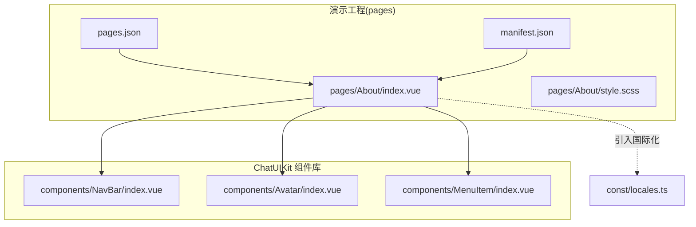
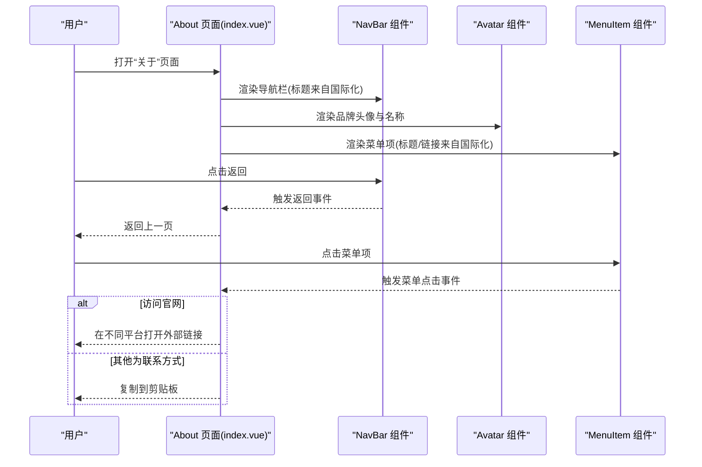
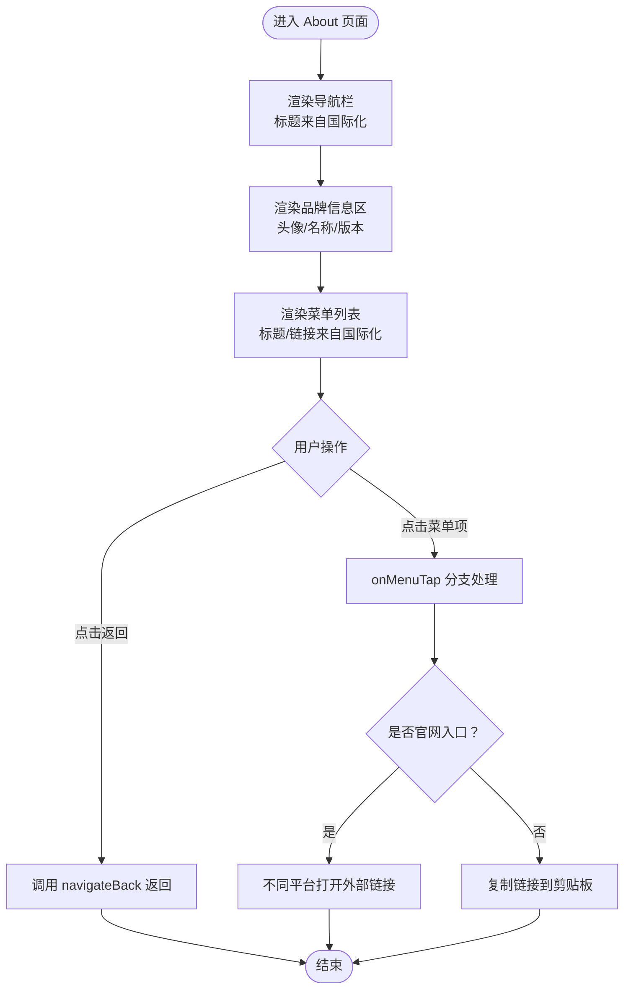
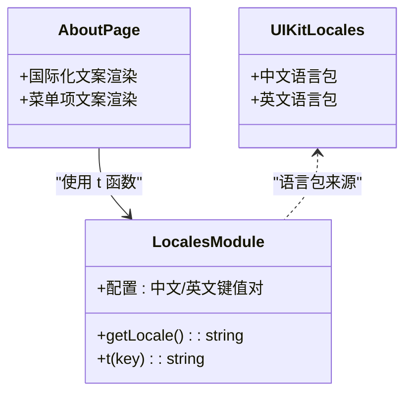
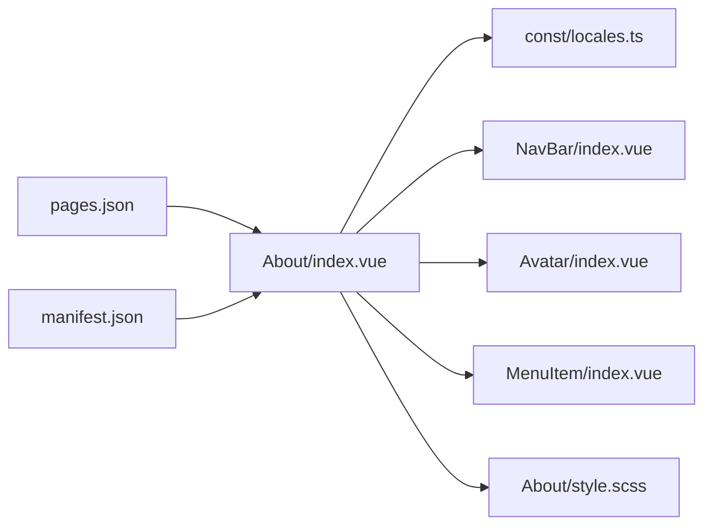

# 关于页面

<cite>
**本文引用的文件**
- [demo/pages/About/index.vue](file://demo/pages/About/index.vue)
- [demo/pages/About/style.scss](file://demo/pages/About/style.scss)
- [demo/pages.json](file://demo/pages.json)
- [demo/manifest.json](file://demo/manifest.json)
- [demo/const/locales.ts](file://demo/const/locales.ts)
- [demo/ChatUIKit/components/NavBar/index.vue](file://demo/ChatUIKit/components/NavBar/index.vue)
- [demo/ChatUIKit/components/Avatar/index.vue](file://demo/ChatUIKit/components/Avatar/index.vue)
- [demo/ChatUIKit/components/MenuItem/index.vue](file://demo/ChatUIKit/components/MenuItem/index.vue)
- [demo/ChatUIKit/locales/zh-Hans.ts](file://demo/ChatUIKit/locales/zh-Hans.ts)
- [demo/ChatUIKit/locales/en.ts](file://demo/ChatUIKit/locales/en.ts)
- [demo/static/icon/about.png](file://demo/static/icon/about.png)
</cite>

## 目录
1. [简介](#简介)
2. [项目结构](#项目结构)
3. [核心组件](#核心组件)
4. [架构总览](#架构总览)
5. [详细组件分析](#详细组件分析)
6. [依赖分析](#依赖分析)
7. [性能考虑](#性能考虑)
8. [故障排查指南](#故障排查指南)
9. [结论](#结论)
10. [附录](#附录)

## 简介
本文件针对“关于页面”进行系统化文档说明，覆盖信息展示结构、版本与版权信息、布局设计与品牌元素、国际化与多语言切换、交互行为（菜单项点击、跳转与复制）、以及可扩展的自定义方案与SEO建议。该页面位于演示工程中，采用 uni-app 技术栈，使用 Vue 3 组合式 API 与 SCSS 样式。

## 项目结构
“关于页面”位于演示工程 pages 目录下，其核心由一个页面模板与样式文件组成，并通过 uni-app 的页面配置进行注册；同时页面内复用 UIKit 内部的通用组件（导航栏、头像、菜单项）以保证一致的视觉与交互体验。

**图表来源**
- [demo/pages/About/index.vue](file://demo/pages/About/index.vue#L1-L101)
- [demo/pages/About/style.scss](file://demo/pages/About/style.scss#L1-L58)
- [demo/pages.json](file://demo/pages.json#L54-L62)
- [demo/manifest.json](file://demo/manifest.json#L1-L134)
- [demo/ChatUIKit/components/NavBar/index.vue](file://demo/ChatUIKit/components/NavBar/index.vue#L1-L66)
- [demo/ChatUIKit/components/Avatar/index.vue](file://demo/ChatUIKit/components/Avatar/index.vue#L1-L188)
- [demo/ChatUIKit/components/MenuItem/index.vue](file://demo/ChatUIKit/components/MenuItem/index.vue#L1-L73)
- [demo/const/locales.ts](file://demo/const/locales.ts#L1-L141)

**章节来源**
- [demo/pages/About/index.vue](file://demo/pages/About/index.vue#L1-L101)
- [demo/pages/About/style.scss](file://demo/pages/About/style.scss#L1-L58)
- [demo/pages.json](file://demo/pages.json#L54-L62)
- [demo/manifest.json](file://demo/manifest.json#L1-L134)

## 核心组件
- 页面容器与布局：采用 Flex 布局，顶部为导航栏，中部为品牌信息区（头像、产品名、版本号），底部为菜单列表。
- 导航栏组件：提供返回按钮与标题插槽，支持微信小程序平台的特殊适配。
- 头像组件：支持圆形/方形、占位图、在线状态等能力，用于展示品牌头像。
- 菜单项组件：提供左右布局、箭头指示与点击事件，用于承载“官网/热线/邮箱”等入口。
- 国际化模块：提供中英文键值映射与运行时选择逻辑，确保界面文案随系统语言切换。

**章节来源**
- [demo/pages/About/index.vue](file://demo/pages/About/index.vue#L1-L101)
- [demo/ChatUIKit/components/NavBar/index.vue](file://demo/ChatUIKit/components/NavBar/index.vue#L1-L66)
- [demo/ChatUIKit/components/Avatar/index.vue](file://demo/ChatUIKit/components/Avatar/index.vue#L1-L188)
- [demo/ChatUIKit/components/MenuItem/index.vue](file://demo/ChatUIKit/components/MenuItem/index.vue#L1-L73)
- [demo/const/locales.ts](file://demo/const/locales.ts#L1-L141)

## 架构总览
“关于页面”的控制流从模板开始，通过组合式 API 定义返回与菜单点击处理逻辑；国际化函数负责文本渲染；页面样式独立管理；页面注册与主题配置由全局配置文件统一约束。

**图表来源**
- [demo/pages/About/index.vue](file://demo/pages/About/index.vue#L38-L86)
- [demo/ChatUIKit/components/NavBar/index.vue](file://demo/ChatUIKit/components/NavBar/index.vue#L20-L35)
- [demo/ChatUIKit/components/Avatar/index.vue](file://demo/ChatUIKit/components/Avatar/index.vue#L1-L188)
- [demo/ChatUIKit/components/MenuItem/index.vue](file://demo/ChatUIKit/components/MenuItem/index.vue#L17-L34)

## 详细组件分析

### 页面模板与交互流程
- 导航栏标题通过国际化函数渲染，确保中英文标题一致。
- 品牌信息区包含头像、产品名与版本信息，版本号目前硬编码展示。
- 菜单列表通过循环渲染，点击后区分“打开外部链接”和“复制到剪贴板”。

**图表来源**
- [demo/pages/About/index.vue](file://demo/pages/About/index.vue#L38-L86)

**章节来源**
- [demo/pages/About/index.vue](file://demo/pages/About/index.vue#L1-L101)

### 导航栏组件
- 支持显示/隐藏返回箭头，提供左侧插槽用于放置标题。
- 微信小程序平台下增加状态栏高度补偿，提升视觉一致性。

**章节来源**
- [demo/ChatUIKit/components/NavBar/index.vue](file://demo/ChatUIKit/components/NavBar/index.vue#L1-L66)

### 头像组件
- 支持圆形/方形、尺寸与占位图配置。
- 可选在线状态角标，便于品牌标识与状态展示。

**章节来源**
- [demo/ChatUIKit/components/Avatar/index.vue](file://demo/ChatUIKit/components/Avatar/index.vue#L1-L188)

### 菜单项组件
- 左侧为内容插槽，右侧可显示箭头与额外内容。
- 提供点击事件，便于在页面层绑定业务逻辑。

**章节来源**
- [demo/ChatUIKit/components/MenuItem/index.vue](file://demo/ChatUIKit/components/MenuItem/index.vue#L1-L73)

### 国际化与多语言切换
- 运行时根据系统语言选择对应语言包，提供 t 函数进行键值查询。
- 页面中所有文案均通过 t 函数获取，包括标题、菜单项标题与链接文案。
- UIKit 层也提供独立的语言包文件，用于其他模块的本地化。

**图表来源**
- [demo/const/locales.ts](file://demo/const/locales.ts#L1-L141)
- [demo/ChatUIKit/locales/zh-Hans.ts](file://demo/ChatUIKit/locales/zh-Hans.ts#L1-L154)
- [demo/ChatUIKit/locales/en.ts](file://demo/ChatUIKit/locales/en.ts#L1-L154)

**章节来源**
- [demo/const/locales.ts](file://demo/const/locales.ts#L1-L141)
- [demo/ChatUIKit/locales/zh-Hans.ts](file://demo/ChatUIKit/locales/zh-Hans.ts#L1-L154)
- [demo/ChatUIKit/locales/en.ts](file://demo/ChatUIKit/locales/en.ts#L1-L154)

### 版本信息与版权信息
- 页面当前展示两条版本信息：产品版本与 UIKIT 版本，均为硬编码字符串。
- 版权信息未在该页面显式展示，建议在品牌信息区或菜单项中补充。

**章节来源**
- [demo/pages/About/index.vue](file://demo/pages/About/index.vue#L14-L16)

### 布局设计与品牌元素
- 品牌信息区采用居中布局，背景色与字体颜色符合品牌视觉规范。
- 菜单项采用统一的高度与间距，右侧箭头指示增强可发现性。
- 页面整体采用自上而下的信息层级，突出品牌与联系方式。

**章节来源**
- [demo/pages/About/style.scss](file://demo/pages/About/style.scss#L1-L58)

### 图标与品牌元素
- 页面静态资源包含“关于”图标，可用于 tab 或导航标识。
- 头像组件使用统一的品牌头像资源，支持占位与错误兜底。

**章节来源**
- [demo/static/icon/about.png](file://demo/static/icon/about.png)
- [demo/ChatUIKit/components/Avatar/index.vue](file://demo/ChatUIKit/components/Avatar/index.vue#L1-L188)

### 版本更新检测、下载链接与反馈渠道
- 当前页面未实现版本更新检测逻辑。
- 官方网站入口在不同平台分别打开外部链接；其他菜单项为联系方式，点击后复制到剪贴板。
- 反馈渠道可通过新增菜单项实现，例如“意见反馈”、“问题反馈”等。

**章节来源**
- [demo/pages/About/index.vue](file://demo/pages/About/index.vue#L71-L85)

### SEO 优化与元数据配置建议
- 页面未包含 meta 标签与 SEO 相关配置，建议在页面级或全局配置中补充：
  - 页面标题：使用页面级 navigationBarTitleText 或动态设置。
  - 描述与关键词：可在构建阶段注入或通过运行时设置。
  - 社交媒体卡片：针对 H5 平台可配置 og:title、og:description、og:image。
  - 结构化数据：可考虑添加组织结构（如公司信息）的 JSON-LD。
- uni-app H5 平台路由模式与 publicPath 已配置，可结合上述 meta 一起使用。

**章节来源**
- [demo/pages.json](file://demo/pages.json#L54-L62)
- [demo/manifest.json](file://demo/manifest.json#L112-L131)

## 依赖分析
“关于页面”主要依赖关系如下：

**图表来源**
- [demo/pages/About/index.vue](file://demo/pages/About/index.vue#L38-L42)
- [demo/const/locales.ts](file://demo/const/locales.ts#L1-L141)
- [demo/pages.json](file://demo/pages.json#L54-L62)
- [demo/manifest.json](file://demo/manifest.json#L1-L134)

**章节来源**
- [demo/pages/About/index.vue](file://demo/pages/About/index.vue#L38-L42)
- [demo/pages.json](file://demo/pages.json#L54-L62)
- [demo/manifest.json](file://demo/manifest.json#L1-L134)

## 性能考虑
- 图片资源：头像与图标建议使用 WebP/JPEG2000 等压缩格式，并按设备像素比提供多尺寸资源。
- 样式：SCSS 文件拆分合理，避免重复选择器与深层嵌套。
- 组件：菜单项与导航栏均为轻量组件，注意在大量菜单项场景下的渲染性能。
- 国际化：键值查询为 O(1)，语言包体积可控。

## 故障排查指南
- 文案不随系统语言变化
  - 检查运行时语言选择逻辑与 t 函数是否正确。
  - 确认 pages.json 中 navigationBarTitleText 是否被覆盖。
- 菜单点击无响应
  - 检查 onMenuTap 事件绑定与分支逻辑。
  - 确认不同平台条件编译（APP-PLUS、WEB）是否正确。
- 外链无法打开
  - 检查 URL 协议与平台权限配置。
- 剪贴板复制失败
  - 确认 uni.setClipboardData 权限与平台支持情况。

**章节来源**
- [demo/pages/About/index.vue](file://demo/pages/About/index.vue#L71-L85)
- [demo/const/locales.ts](file://demo/const/locales.ts#L134-L141)
- [demo/pages.json](file://demo/pages.json#L54-L62)

## 结论
“关于页面”在结构与交互上清晰简洁，复用了 UIKit 的通用组件，具备良好的可维护性与一致性。建议后续完善版本更新检测、补充版权与反馈渠道、增强 SEO 元数据，并持续优化国际化与品牌元素的可配置性。

## 附录
- 自定义方式建议
  - 公司信息：在品牌信息区增加公司名称、地址、ICP 备案号等。
  - 联系方式：通过菜单项扩展“客服热线”“邮箱”“社交媒体”等入口。
  - 技术栈展示：在菜单项中新增“技术栈”或“开源信息”，指向文档或仓库。
  - 版本更新：在菜单项中新增“检查更新”，并在页面层接入更新检测逻辑。
- SEO 与元数据
  - 在页面级或全局配置中补充 meta 标签与结构化数据，提升搜索引擎可见性。