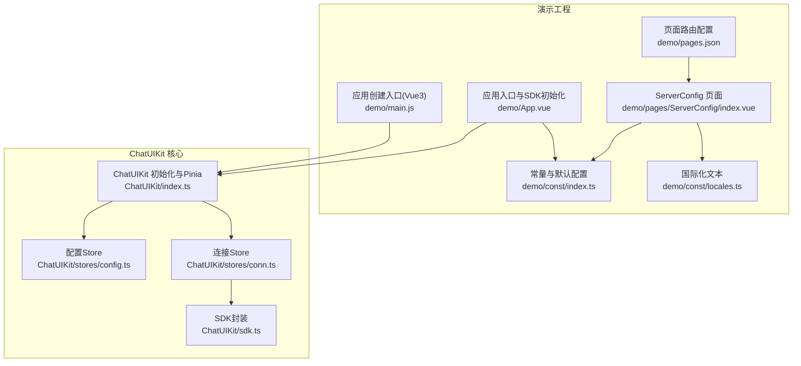
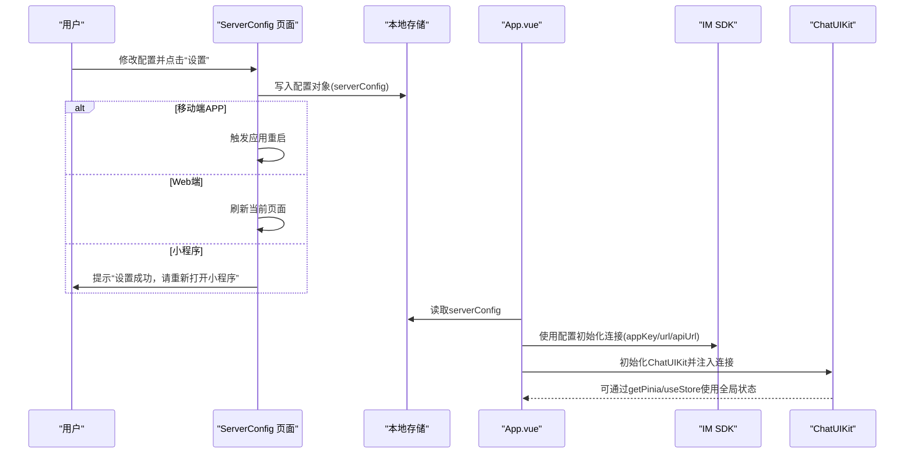
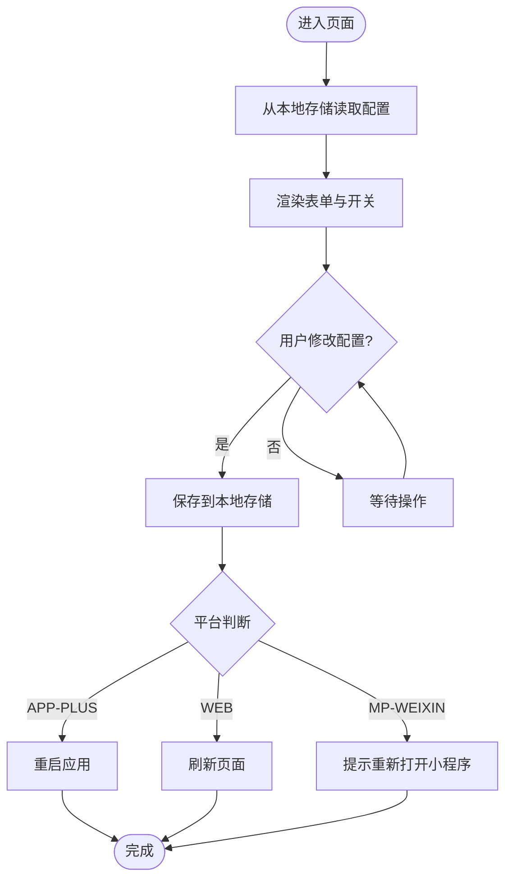
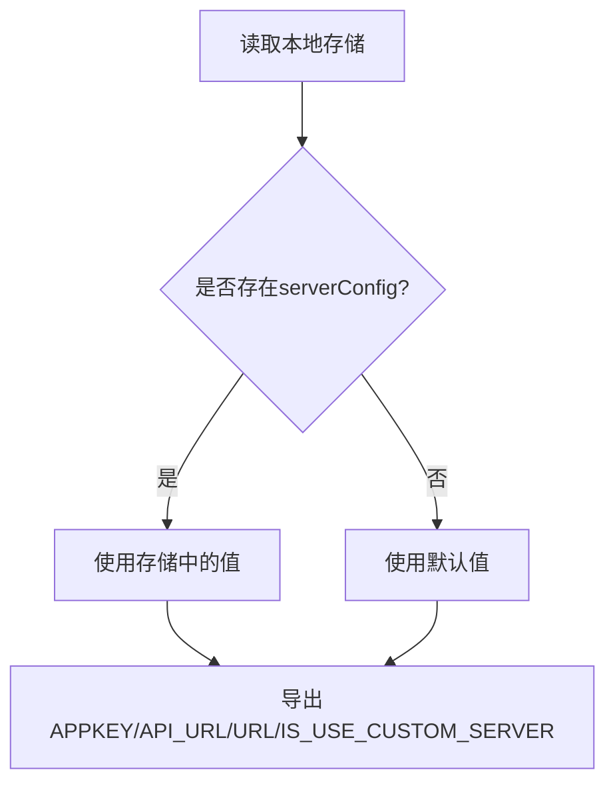
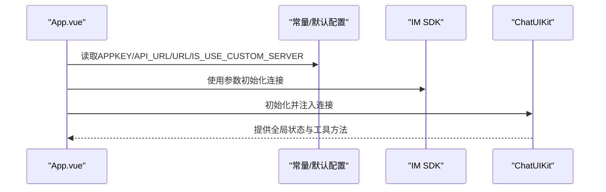
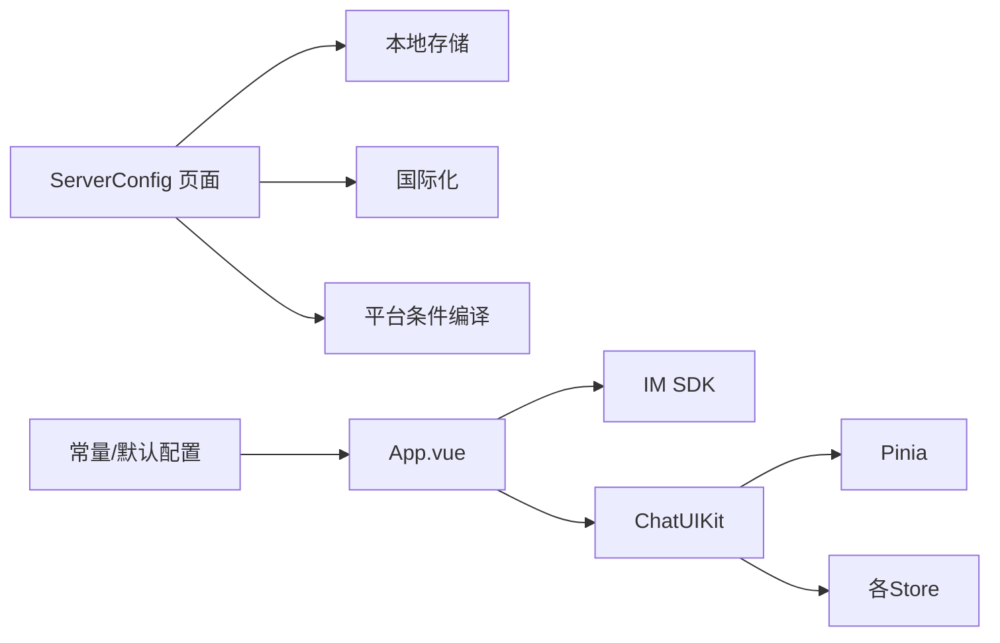

# 服务器配置页面

<cite>
**本文引用的文件**
- [demo/pages/ServerConfig/index.vue](file://demo/pages/ServerConfig/index.vue)
- [demo/pages/ServerConfig/style.scss](file://demo/pages/ServerConfig/style.scss)
- [demo/const/index.ts](file://demo/const/index.ts)
- [demo/const/locales.ts](file://demo/const/locales.ts)
- [demo/App.vue](file://demo/App.vue)
- [demo/main.js](file://demo/main.js)
- [demo/pages.json](file://demo/pages.json)
- [ChatUIKit/index.ts](file://ChatUIKit/index.ts)
- [ChatUIKit/stores/config.ts](file://ChatUIKit/stores/config.ts)
- [ChatUIKit/configType.ts](file://ChatUIKit/configType.ts)
- [ChatUIKit/stores/conn.ts](file://ChatUIKit/stores/conn.ts)
- [ChatUIKit/sdk.ts](file://ChatUIKit/sdk.ts)
</cite>

## 目录
1. [简介](#简介)
2. [项目结构](#项目结构)
3. [核心组件](#核心组件)
4. [架构总览](#架构总览)
5. [详细组件分析](#详细组件分析)
6. [依赖关系分析](#依赖关系分析)
7. [性能考虑](#性能考虑)
8. [故障排除指南](#故障排除指南)
9. [结论](#结论)
10. [附录](#附录)

## 简介
本文件面向“服务器配置页面”，系统性说明其作用、配置项与验证机制，并覆盖以下主题：
- 配置项：服务器地址、API 地址、APPKEY、是否使用自定义服务器
- 默认值、可选范围与有效性校验
- 配置变更后的应用方式、重启要求与影响范围
- 配置备份、导入导出与重置能力的现状与扩展建议
- 多环境配置管理、测试部署与故障排除

该页面负责读取并持久化服务器配置，随后在应用启动时将这些配置注入到 IM SDK 初始化流程中，从而影响后续的网络连接行为。

## 项目结构
服务器配置页面位于 demo 工程中，采用 uni-app 页面组织方式；配置数据通过本地存储进行持久化；运行时由应用入口在启动阶段读取配置并初始化 SDK。

**图表来源**
- [demo/pages/ServerConfig/index.vue](file://demo/pages/ServerConfig/index.vue#L1-L79)
- [demo/const/index.ts](file://demo/const/index.ts#L1-L32)
- [demo/const/locales.ts](file://demo/const/locales.ts#L1-L141)
- [demo/pages.json](file://demo/pages.json#L1-L200)
- [demo/App.vue](file://demo/App.vue#L1-L134)
- [demo/main.js](file://demo/main.js#L1-L28)
- [ChatUIKit/index.ts](file://ChatUIKit/index.ts#L1-L139)
- [ChatUIKit/stores/config.ts](file://ChatUIKit/stores/config.ts#L1-L124)
- [ChatUIKit/stores/conn.ts](file://ChatUIKit/stores/conn.ts#L1-L84)
- [ChatUIKit/sdk.ts](file://ChatUIKit/sdk.ts#L1-L13)

**章节来源**
- [demo/pages/ServerConfig/index.vue](file://demo/pages/ServerConfig/index.vue#L1-L79)
- [demo/const/index.ts](file://demo/const/index.ts#L1-L32)
- [demo/const/locales.ts](file://demo/const/locales.ts#L1-L141)
- [demo/pages.json](file://demo/pages.json#L1-L200)
- [demo/App.vue](file://demo/App.vue#L1-L134)
- [demo/main.js](file://demo/main.js#L1-L28)
- [ChatUIKit/index.ts](file://ChatUIKit/index.ts#L1-L139)
- [ChatUIKit/stores/config.ts](file://ChatUIKit/stores/config.ts#L1-L124)
- [ChatUIKit/stores/conn.ts](file://ChatUIKit/stores/conn.ts#L1-L84)
- [ChatUIKit/sdk.ts](file://ChatUIKit/sdk.ts#L1-L13)

## 核心组件
- 服务器配置页面：提供开关与输入框，保存配置到本地存储，并按平台触发重启或刷新。
- 常量与默认配置：从本地存储读取配置，提供默认值，作为 SDK 初始化参数来源。
- 国际化：提供中英文文案映射，包括“是否使用自定义服务器”“Appkey”“WebSocket URL”“REST URL”等。
- 应用入口：在启动时读取配置，创建 IM SDK 连接并初始化 ChatUIKit。
- ChatUIKit：集中管理 Pinia、Store 与 SDK 连接，提供 getPinia、init 等能力。

**章节来源**
- [demo/pages/ServerConfig/index.vue](file://demo/pages/ServerConfig/index.vue#L1-L79)
- [demo/const/index.ts](file://demo/const/index.ts#L1-L32)
- [demo/const/locales.ts](file://demo/const/locales.ts#L1-L141)
- [demo/App.vue](file://demo/App.vue#L1-L134)
- [ChatUIKit/index.ts](file://ChatUIKit/index.ts#L1-L139)

## 架构总览
服务器配置页面与应用启动流程的交互如下：

**图表来源**
- [demo/pages/ServerConfig/index.vue](file://demo/pages/ServerConfig/index.vue#L44-L73)
- [demo/const/index.ts](file://demo/const/index.ts#L4-L10)
- [demo/App.vue](file://demo/App.vue#L14-L32)
- [ChatUIKit/index.ts](file://ChatUIKit/index.ts#L84-L96)

## 详细组件分析

### 服务器配置页面（ServerConfig）
- 功能要点
  - 开关控制：是否使用自定义服务器
  - 输入项：Appkey、WebSocket URL、REST URL
  - 行为：保存到本地存储，按平台执行重启/刷新，小程序提示重新打开
- 数据流
  - 读取：从本地存储读取 serverConfig 并初始化表单
  - 写入：将表单值打包为配置对象写入本地存储
  - 生效：应用下次启动时读取新配置并初始化 SDK
- UI 样式：固定按钮样式，输入框基础样式

**图表来源**
- [demo/pages/ServerConfig/index.vue](file://demo/pages/ServerConfig/index.vue#L29-L73)

**章节来源**
- [demo/pages/ServerConfig/index.vue](file://demo/pages/ServerConfig/index.vue#L1-L79)
- [demo/pages/ServerConfig/style.scss](file://demo/pages/ServerConfig/style.scss#L1-L32)

### 常量与默认配置（读取与默认值）
- 默认值来源
  - 从本地存储读取 serverConfig，若不存在则使用默认值
  - 默认值：APPKEY、REST URL、WebSocket URL、是否使用自定义服务器
- 作用域
  - 作为 SDK 初始化参数传入，影响连接建立
  - 与 ChatUIKit 的主题/功能配置无关

**图表来源**
- [demo/const/index.ts](file://demo/const/index.ts#L4-L10)

**章节来源**
- [demo/const/index.ts](file://demo/const/index.ts#L1-L32)

### 国际化（文案）
- 文案键包括：是否使用自定义服务器、Appkey、WebSocket URL、REST URL、占位提示、标题等
- 语言选择：根据系统语言自动选择，否则回退到中文

**章节来源**
- [demo/const/locales.ts](file://demo/const/locales.ts#L1-L141)

### 应用入口与 SDK 初始化
- 初始化流程
  - 读取 serverConfig 生成 SDK 连接参数
  - 创建 IM SDK 连接并注入 ChatUIKit
  - 将 ChatUIKit 挂载到全局，便于各处使用
- 影响范围
  - 后续所有网络请求均使用新配置
  - 若未使用自定义服务器，相关字段为空字符串，SDK 初始化时将使用默认值或忽略

**图表来源**
- [demo/App.vue](file://demo/App.vue#L14-L32)
- [demo/const/index.ts](file://demo/const/index.ts#L4-L10)
- [ChatUIKit/index.ts](file://ChatUIKit/index.ts#L84-L96)

**章节来源**
- [demo/App.vue](file://demo/App.vue#L1-L134)
- [demo/main.js](file://demo/main.js#L1-L28)

### ChatUIKit 与连接管理
- ChatUIKit
  - 统一管理 Pinia、Store 与 SDK 连接
  - 提供 getPinia、init、getChatConn 等接口
- 连接 Store
  - 管理 SDK 连接实例，提供初始化、关闭、清空等动作
  - 未初始化时抛出明确错误，避免误用

**章节来源**
- [ChatUIKit/index.ts](file://ChatUIKit/index.ts#L1-L139)
- [ChatUIKit/stores/conn.ts](file://ChatUIKit/stores/conn.ts#L1-L84)
- [ChatUIKit/sdk.ts](file://ChatUIKit/sdk.ts#L1-L13)

## 依赖关系分析
- 页面依赖
  - 本地存储：保存/读取 serverConfig
  - 国际化：显示文案
  - 平台条件编译：APP-PLUS、WEB、MP-WEIXIN
- 运行时依赖
  - 常量模块：提供 SDK 初始化所需参数
  - App.vue：在启动阶段读取常量并初始化 SDK
  - ChatUIKit：集中管理状态与 SDK 连接

**图表来源**
- [demo/pages/ServerConfig/index.vue](file://demo/pages/ServerConfig/index.vue#L29-L73)
- [demo/const/index.ts](file://demo/const/index.ts#L4-L10)
- [demo/App.vue](file://demo/App.vue#L14-L32)
- [ChatUIKit/index.ts](file://ChatUIKit/index.ts#L84-L96)

**章节来源**
- [demo/pages/ServerConfig/index.vue](file://demo/pages/ServerConfig/index.vue#L1-L79)
- [demo/const/index.ts](file://demo/const/index.ts#L1-L32)
- [demo/App.vue](file://demo/App.vue#L1-L134)
- [ChatUIKit/index.ts](file://ChatUIKit/index.ts#L1-L139)

## 性能考虑
- 配置变更后立即生效：页面保存配置后，应用下次启动时读取新值，避免在运行时频繁重建 SDK 连接带来的抖动
- 平台差异处理：不同平台采用最优重启/刷新策略，减少不必要的资源消耗
- SDK 初始化成本：连接参数来自本地存储，初始化路径简单，避免额外网络请求

[本节为通用指导，无需特定文件引用]

## 故障排除指南
- 无法连接或连接失败
  - 检查 Appkey、WebSocket URL、REST URL 是否正确
  - 确认是否使用自定义服务器且三项配置均已填写
  - 尝试重启应用或刷新页面
- 小程序提示需重新打开
  - 由于平台限制，需手动关闭后重新打开小程序以加载新配置
- 配置未生效
  - 确认已点击“设置”并保存
  - 检查本地存储中是否存在 serverConfig
- 重置配置
  - 当前实现未提供一键重置按钮；可在本地存储中删除 serverConfig 键，或在页面中清空输入框后重新保存

**章节来源**
- [demo/pages/ServerConfig/index.vue](file://demo/pages/ServerConfig/index.vue#L44-L73)
- [demo/const/index.ts](file://demo/const/index.ts#L4-L10)

## 结论
服务器配置页面提供了简洁直观的配置入口，结合本地存储与平台差异化处理，实现了配置的持久化与跨平台兼容。应用启动时读取配置并初始化 SDK，确保后续网络行为符合预期。当前实现未包含导入导出与一键重置功能，建议在后续版本中增加这些能力以提升运维效率与用户体验。

[本节为总结性内容，无需特定文件引用]

## 附录

### 配置项说明与默认值
- 是否使用自定义服务器
  - 类型：布尔
  - 默认值：false
  - 作用：决定是否启用自定义的 Appkey、WebSocket URL、REST URL
- Appkey
  - 类型：字符串
  - 默认值："your#appkey"
  - 作用：IM SDK 初始化的标识
- WebSocket URL
  - 类型：字符串
  - 默认值："wss://im-api-wechat.easemob.com/websocket"
  - 作用：IM 推送/长连接地址
- REST URL
  - 类型：字符串
  - 默认值："https://a1.easemob.com"
  - 作用：REST API 基础地址

**章节来源**
- [demo/const/index.ts](file://demo/const/index.ts#L4-L10)
- [demo/const/locales.ts](file://demo/const/locales.ts#L25-L32)

### 验证机制与边界
- 无显式前端校验：页面未对输入格式进行强约束
- 生效时机：保存后需重启/刷新应用才生效
- 平台差异：APP-PLUS 重启、WEB 刷新、MP-WEIXIN 提示重新打开

**章节来源**
- [demo/pages/ServerConfig/index.vue](file://demo/pages/ServerConfig/index.vue#L44-L73)

### 多环境配置管理建议
- 环境区分：通过不同的本地存储键或分组管理 dev/test/prod
- 导入导出：在页面新增 JSON 导入/导出按钮，支持批量切换环境
- 一键重置：提供“恢复默认值”按钮，清除本地存储并写入默认值

[本节为扩展建议，无需特定文件引用]

### 测试部署清单
- 配置项测试
  - 正常用例：填写完整自定义配置并保存，重启后连接正常
  - 异常用例：仅填写部分字段，验证连接失败或回退默认值
- 平台测试
  - APP-PLUS：保存后重启，检查配置是否生效
  - WEB：保存后刷新，检查配置是否生效
  - MP-WEIXIN：保存后按提示重新打开小程序
- 回归测试
  - 删除本地存储键，验证默认值回填与连接行为

[本节为通用指导，无需特定文件引用]