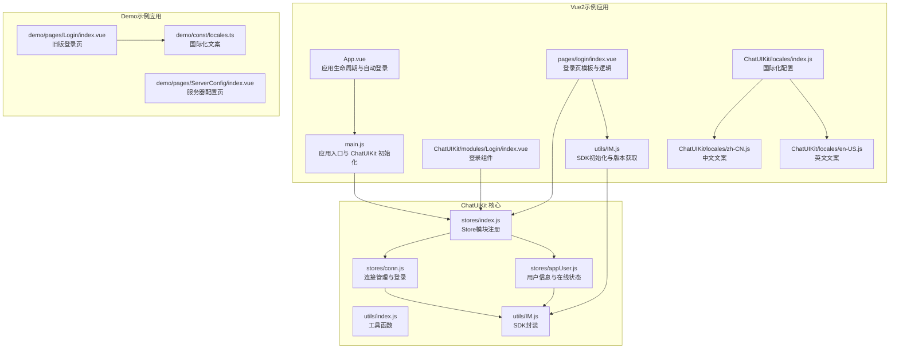
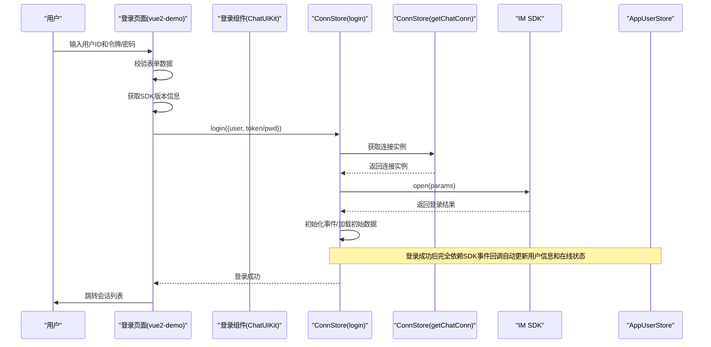
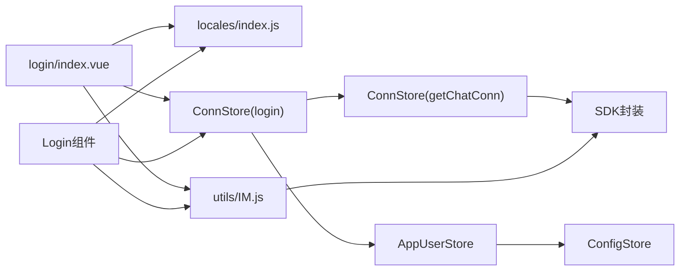

# 登录页面

<cite>
**本文档引用的文件**
- [vue2-demo/pages/login/index.vue](file://vue2-demo/pages/login/index.vue)
- [vue2-demo/ChatUIKit/modules/Login/index.vue](file://vue2-demo/ChatUIKit/modules/Login/index.vue)
- [vue2-demo/utils/IM.js](file://vue2-demo/utils/IM.js)
- [vue2-demo/ChatUIKit/locales/index.js](file://vue2-demo/ChatUIKit/locales/index.js)
- [vue2-demo/ChatUIKit/locales/zh-CN.js](file://vue2-demo/ChatUIKit/locales/zh-CN.js)
- [vue2-demo/ChatUIKit/locales/en-US.js](file://vue2-demo/ChatUIKit/locales/en-US.js)
- [demo/pages/Login/index.vue](file://demo/pages/Login/index.vue)
- [demo/const/locales.ts](file://demo/const/locales.ts)
- [ChatUIKit-vue2/stores/conn.js](file://ChatUIKit-vue2/stores/conn.js)
- [ChatUIKit-vue2/stores/appUser.js](file://ChatUIKit-vue2/stores/appUser.js)
- [ChatUIKit-vue2/stores/index.js](file://ChatUIKit-vue2/stores/index.js)
- [ChatUIKit-vue2/utils/index.js](file://ChatUIKit-vue2/utils/index.js)
- [ChatUIKit-vue2/utils/IM.js](file://ChatUIKit-vue2/utils/IM.js)
- [VUE2_QUICK_START.md](file://VUE2_QUICK_START.md)
</cite>

## 更新摘要
**变更内容**
- 登录页面重大重构：从ChatUIKit/modules/Login组件迁移到vue2-demo/pages/login/index.vue独立页面
- 增加令牌登录和密码登录双模式支持，符合VUE2_QUICK_START.md中的新认证标准
- 新增表单验证、加载状态、错误处理等完整功能
- 实现动态SDK版本显示和增强的SDK初始化错误处理
- 完善国际化支持，包含中英文双语文案
- 优化用户界面设计，提供更好的用户体验
- **认证方式更新**：从用户名+密码认证更新为推荐的用户名+accessToken认证方式

## 目录
1. [简介](#简介)
2. [项目结构](#项目结构)
3. [核心组件](#核心组件)
4. [架构总览](#架构总览)
5. [详细组件分析](#详细组件分析)
6. [国际化实现](#国际化实现)
7. [依赖关系分析](#依赖关系分析)
8. [性能考量](#性能考量)
9. [故障排查指南](#故障排查指南)
10. [结论](#结论)
11. [附录](#附录)

## 简介
本章节面向登录页面的实现与使用，系统性说明登录表单设计、验证规则、错误处理机制、自动登录流程以及与 ChatUIKit 的集成方式。文档同时覆盖登录失败的处理策略、重试机制与用户体验优化建议，帮助开发者快速理解并扩展登录能力。

**更新** 登录页面已完成重大重构，从ChatUIKit/modules/Login组件迁移到vue2-demo/pages/login/index.vue独立页面，增加了令牌登录和密码登录双模式、表单验证、加载状态、错误处理等功能，代码行数从约100行增加到382行。**认证方式已更新为推荐的用户名+accessToken认证方式**。

## 项目结构
登录页面位于vue2-demo示例工程中，采用uni-app框架开发，登录页由模板、样式与脚本组成，并通过ChatUIKit的Pinia Store完成与IM SDK的交互。自动登录逻辑在应用启动阶段执行，若本地存在缓存则直接跳转并完成登录。



**图表来源**
- [vue2-demo/pages/login/index.vue:1-382](file://vue2-demo/pages/login/index.vue#L1-L382)
- [vue2-demo/ChatUIKit/modules/Login/index.vue:1-382](file://vue2-demo/ChatUIKit/modules/Login/index.vue#L1-L382)
- [vue2-demo/utils/IM.js:1-60](file://vue2-demo/utils/IM.js#L1-L60)
- [vue2-demo/ChatUIKit/locales/index.js:1-219](file://vue2-demo/ChatUIKit/locales/index.js#L1-L219)
- [ChatUIKit-vue2/stores/index.js:1-27](file://ChatUIKit-vue2/stores/index.js#L1-L27)
- [ChatUIKit-vue2/stores/conn.js:1-121](file://ChatUIKit-vue2/stores/conn.js#L1-L121)
- [ChatUIKit-vue2/stores/appUser.js:1-200](file://ChatUIKit-vue2/stores/appUser.js#L1-L200)
- [ChatUIKit-vue2/utils/IM.js:1-60](file://ChatUIKit-vue2/utils/IM.js#L1-L60)
- [demo/pages/Login/index.vue:1-332](file://demo/pages/Login/index.vue#L1-L332)
- [demo/const/locales.ts:1-141](file://demo/const/locales.ts#L1-L141)

**章节来源**
- [vue2-demo/pages/login/index.vue:1-382](file://vue2-demo/pages/login/index.vue#L1-L382)
- [vue2-demo/ChatUIKit/modules/Login/index.vue:1-382](file://vue2-demo/ChatUIKit/modules/Login/index.vue#L1-L382)
- [vue2-demo/utils/IM.js:1-60](file://vue2-demo/utils/IM.js#L1-L60)
- [vue2-demo/ChatUIKit/locales/index.js:1-219](file://vue2-demo/ChatUIKit/locales/index.js#L1-L219)
- [ChatUIKit-vue2/stores/index.js:1-27](file://ChatUIKit-vue2/stores/index.js#L1-L27)
- [ChatUIKit-vue2/stores/conn.js:1-121](file://ChatUIKit-vue2/stores/conn.js#L1-L121)
- [ChatUIKit-vue2/stores/appUser.js:1-200](file://ChatUIKit-vue2/stores/appUser.js#L1-L200)
- [ChatUIKit-vue2/utils/IM.js:1-60](file://ChatUIKit-vue2/utils/IM.js#L1-L60)
- [demo/pages/Login/index.vue:1-332](file://demo/pages/Login/index.vue#L1-L332)
- [demo/const/locales.ts:1-141](file://demo/const/locales.ts#L1-L141)

## 核心组件
- **独立登录页面**：位于vue2-demo/pages/login/index.vue，提供完整的登录功能，包括令牌登录和密码登录双模式
- **登录组件**：位于ChatUIKit/modules/Login/index.vue，作为ChatUIKit库的一部分提供登录功能
- **SDK初始化**：通过utils/IM.js完成SDK的初始化和版本获取
- **国际化支持**：完整的中英文双语支持，包含登录、错误提示、操作按钮等所有用户界面文本
- **表单验证**：严格的输入验证，包括用户ID必填、令牌或密码必填、登录类型切换等
- **加载状态**：登录过程中显示加载状态，防止重复提交
- **错误处理**：完善的错误处理机制，包括AppKey配置错误、登录失败等情况
- **动态SDK版本显示**：登录页面能够动态显示当前使用的SDK版本号
- **自动登录机制**：应用启动时检查本地缓存，支持自动登录功能
- **认证方式支持**：同时支持用户名+accessToken和用户名+密码两种认证方式

**更新** 登录页面已完成重大重构，从ChatUIKit/modules/Login组件迁移到vue2-demo/pages/login/index.vue独立页面，增加了令牌登录和密码登录双模式、表单验证、加载状态、错误处理等功能，代码行数从约100行增加到382行。**认证方式已更新为推荐的用户名+accessToken认证方式**。

**章节来源**
- [vue2-demo/pages/login/index.vue:1-382](file://vue2-demo/pages/login/index.vue#L1-L382)
- [vue2-demo/ChatUIKit/modules/Login/index.vue:1-382](file://vue2-demo/ChatUIKit/modules/Login/index.vue#L1-L382)
- [vue2-demo/utils/IM.js:1-60](file://vue2-demo/utils/IM.js#L1-L60)
- [vue2-demo/ChatUIKit/locales/index.js:1-219](file://vue2-demo/ChatUIKit/locales/index.js#L1-L219)

## 架构总览
登录流程涉及前端页面、国际化、ChatUIKit Store、连接管理与IM SDK。下图展示登录的关键交互序列，体现了最新的增强功能。



**图表来源**
- [vue2-demo/pages/login/index.vue:144-205](file://vue2-demo/pages/login/index.vue#L144-L205)
- [ChatUIKit-vue2/stores/conn.js:60-93](file://ChatUIKit-vue2/stores/conn.js#L60-L93)
- [ChatUIKit-vue2/stores/index.js:13-23](file://ChatUIKit-vue2/stores/index.js#L13-L23)

## 详细组件分析

### 登录页面实现
- **双登录模式**：支持令牌登录(token)和密码登录(password)，通过标签页切换实现
- **表单验证**：
  - 用户ID必填验证
  - 令牌登录模式下令牌必填
  - 密码登录模式下密码必填
  - 登录按钮根据表单状态动态启用/禁用
- **加载状态**：登录过程中显示loading状态，防止重复提交
- **错误处理**：针对不同错误情况进行分类处理，包括AppKey配置错误、登录失败等
- **SDK版本显示**：在页面右上角显示当前SDK版本号，便于调试
- **AppKey配置提示**：当检测到默认AppKey时显示配置提示

**更新** 登录页面已完成重大重构，增加了完整的表单验证、加载状态、错误处理等功能，提供更好的用户体验。

**章节来源**
- [vue2-demo/pages/login/index.vue:1-382](file://vue2-demo/pages/login/index.vue#L1-L382)

### 登录组件实现
- **组件化设计**：作为ChatUIKit库的一部分，提供可复用的登录组件
- **国际化支持**：完整的中英文双语支持，包含登录、错误提示、操作按钮等所有文本
- **SDK版本获取**：支持从store和直接导入两种方式获取SDK版本
- **AppKey检查**：检查是否使用默认AppKey，必要时显示配置提示
- **统一登录接口**：通过mapActions调用conn模块的login方法

**章节来源**
- [vue2-demo/ChatUIKit/modules/Login/index.vue:1-382](file://vue2-demo/ChatUIKit/modules/Login/index.vue#L1-L382)

### SDK初始化与版本获取
- **双重获取机制**：优先从Vuex store中获取SDK版本，如果不可用则尝试直接导入EMClient获取版本
- **错误处理**：包含try-catch机制，即使获取失败也不会影响登录流程
- **版本显示**：版本信息显示在登录页面的Logo下方，便于开发者识别当前SDK版本
- **调试价值**：帮助开发者快速确认SDK版本，便于问题排查和升级管理

**更新** 新增动态SDK版本显示功能，显著提升了开发调试体验。

**章节来源**
- [vue2-demo/utils/IM.js:1-60](file://vue2-demo/utils/IM.js#L1-L60)
- [vue2-demo/ChatUIKit/modules/Login/index.vue:122-142](file://vue2-demo/ChatUIKit/modules/Login/index.vue#L122-L142)

### 认证方式与登录流程
- **推荐认证方式**：根据VUE2_QUICK_START.md，环信IM推荐使用**用户名+accessToken**方式进行登录
- **双认证支持**：ConnStore的login方法同时支持accessToken和pwd两种认证方式
- **参数构建**：根据登录类型动态构建登录参数，令牌登录使用accessToken，密码登录使用pwd
- **SDK集成**：通过chatConn.open()方法完成实际的SDK登录操作
- **状态管理**：登录成功后自动更新用户状态、连接状态和用户信息

**更新** 认证方式已更新为推荐的用户名+accessToken认证方式，同时保留密码登录支持以兼容不同场景。

**章节来源**
- [ChatUIKit-vue2/stores/conn.js:60-93](file://ChatUIKit-vue2/stores/conn.js#L60-L93)
- [vue2-demo/pages/login/index.vue:162-173](file://vue2-demo/pages/login/index.vue#L162-L173)
- [VUE2_QUICK_START.md:208-288](file://VUE2_QUICK_START.md#L208-L288)

### 与ChatUIKit的集成
- **Store访问**：通过ChatUIKit.getPinia()注入全局Pinia实例
- **登录流程**：通过ChatUIKit.chatStore.login完成登录与事件初始化
- **状态管理**：登录成功后自动初始化事件监听器和初始数据加载
- **用户信息**：登录后通过SDK事件回调自动获取用户基本信息
- **在线状态**：登录后通过SDK事件回调自动设置用户在线状态

**章节来源**
- [ChatUIKit-vue2/stores/index.js:13-23](file://ChatUIKit-vue2/stores/index.js#L13-L23)
- [ChatUIKit-vue2/stores/conn.js:60-93](file://ChatUIKit-vue2/stores/conn.js#L60-L93)
- [ChatUIKit-vue2/stores/appUser.js:82-102](file://ChatUIKit-vue2/stores/appUser.js#L82-L102)

### 与Demo示例的对比
- **旧版登录页面**：位于demo/pages/Login/index.vue，支持用户名密码登录和手机号验证码登录
- **新版登录页面**：位于vue2-demo/pages/login/index.vue，专注于令牌登录和密码登录双模式
- **功能差异**：新版页面更加简洁，专注于核心登录功能，去除了验证码登录等复杂功能
- **架构差异**：新版采用独立页面设计，便于集成和定制

**章节来源**
- [demo/pages/Login/index.vue:1-332](file://demo/pages/Login/index.vue#L1-L332)
- [vue2-demo/pages/login/index.vue:1-382](file://vue2-demo/pages/login/index.vue#L1-L382)

## 国际化实现

### 完整的国际化支持
登录页面提供完整的中英文双语支持，包含以下内容：

- **登录相关**：登录标题、用户ID、令牌、密码、登录按钮等
- **占位符文本**：用户ID输入框、令牌输入框、密码输入框的占位符
- **登录类型**：令牌登录、密码登录的标签切换
- **操作提示**：登录中、登录成功、登录失败等状态提示
- **配置提示**：AppKey配置错误的提示信息
- **控制台链接**：打开环信控制台的链接文本

### 技术实现细节
- **翻译函数**：使用`$t()`函数获取翻译文本
- **键值结构**：采用`login.key`的命名规范
- **响应式更新**：文本内容通过`{{ $t('key') }}`动态绑定
- **语言切换**：支持运行时语言切换，自动更新所有文本

### 国际化配置结构
```javascript
// 中文文案
login: {
  title: '登录',
  username: '用户ID',
  userIdPlaceholder: '请输入用户ID',
  tokenPlaceholder: '请输入Token',
  password: '密码',
  passwordPlaceholder: '请输入密码',
  tokenLogin: 'Token登录',
  passwordLogin: '密码登录',
  login: '登录',
  loginSuccess: '登录成功',
  loginFailed: '登录失败',
  tip: '测试账号可以在环信控制台创建',
  console: '打开环信控制台',
  token: 'Token',
  loggingIn: '登录中...',
  configAppKey: '请先在 utils/IM.js 中配置正确的 AppKey',
  consoleTip: '请访问 https://console.easemob.com 创建应用',
  configAppKeyTitle: '请先配置 AppKey',
  configAppKeyContent: '请修改 utils/IM.js 中的 SDK_CONFIG.appKey'
}

// 英文文案
login: {
  title: 'Login',
  username: 'User ID',
  userIdPlaceholder: 'Enter User ID',
  tokenPlaceholder: 'Enter Token',
  password: 'Password',
  passwordPlaceholder: 'Enter password',
  tokenLogin: 'Token Login',
  passwordLogin: 'Password Login',
  login: 'Login',
  loginSuccess: 'Login successful',
  loginFailed: 'Login failed',
  tip: 'Test accounts can be created in the EaseMob console',
  console: 'Open EaseMob Console',
  token: 'Token',
  loggingIn: 'Logging in...',
  configAppKey: 'Please configure the correct AppKey in utils/IM.js first',
  consoleTip: 'Please visit https://console.easemob.com to create an app',
  configAppKeyTitle: 'Please configure AppKey first',
  configAppKeyContent: 'Please modify SDK_CONFIG.appKey in utils/IM.js'
}
```

**更新** 国际化支持保持完整，所有用户界面文本均通过$t()翻译函数动态获取，支持中英文双语显示。

**章节来源**
- [vue2-demo/ChatUIKit/locales/zh-CN.js:355-376](file://vue2-demo/ChatUIKit/locales/zh-CN.js#L355-L376)
- [vue2-demo/ChatUIKit/locales/en-US.js:349-370](file://vue2-demo/ChatUIKit/locales/en-US.js#L349-L370)
- [vue2-demo/ChatUIKit/locales/index.js:1-219](file://vue2-demo/ChatUIKit/locales/index.js#L1-L219)

## 依赖关系分析
- **页面依赖**：
  - 登录页依赖国际化模块以获取文案，依赖ChatUIKit的chatStore完成登录
  - 依赖utils/IM.js提供的SDK初始化和版本获取功能
- **Store依赖**：
  - ConnStore依赖SDK封装以创建连接实例，支持accessToken和pwd两种认证方式
  - AppUserStore通过SDK事件回调拉取用户信息和在线状态
- **国际化依赖**：
  - 依赖ChatUIKit/locales模块提供多语言支持
  - 支持运行时语言切换和存储语言偏好
- **SDK依赖**：
  - 依赖utils/IM.js完成SDK初始化
  - 依赖EMClient.version获取SDK版本信息



**图表来源**
- [vue2-demo/pages/login/index.vue:84-221](file://vue2-demo/pages/login/index.vue#L84-L221)
- [vue2-demo/ChatUIKit/modules/Login/index.vue:84-221](file://vue2-demo/ChatUIKit/modules/Login/index.vue#L84-L221)
- [vue2-demo/utils/IM.js:1-60](file://vue2-demo/utils/IM.js#L1-L60)
- [ChatUIKit-vue2/stores/conn.js:60-93](file://ChatUIKit-vue2/stores/conn.js#L60-L93)
- [ChatUIKit-vue2/stores/appUser.js:82-102](file://ChatUIKit-vue2/stores/appUser.js#L82-L102)

**章节来源**
- [vue2-demo/pages/login/index.vue:1-382](file://vue2-demo/pages/login/index.vue#L1-L382)
- [vue2-demo/ChatUIKit/modules/Login/index.vue:1-382](file://vue2-demo/ChatUIKit/modules/Login/index.vue#L1-L382)
- [vue2-demo/utils/IM.js:1-60](file://vue2-demo/utils/IM.js#L1-L60)
- [ChatUIKit-vue2/stores/conn.js:1-121](file://ChatUIKit-vue2/stores/conn.js#L1-L121)
- [ChatUIKit-vue2/stores/appUser.js:1-200](file://ChatUIKit-vue2/stores/appUser.js#L1-L200)

## 性能考量
- **表单验证优化**：实时验证用户输入，避免无效请求
- **加载状态管理**：登录过程中禁用按钮，防止重复提交
- **SDK版本获取优化**：双重获取机制确保快速响应，避免阻塞登录流程
- **内存管理**：及时清理定时器和事件监听器
- **国际化性能**：翻译函数缓存机制，避免重复解析国际化配置
- **样式优化**：使用CSS3动画和过渡效果，提升用户体验
- **错误处理性能**：分类错误处理，避免不必要的重试
- **认证方式优化**：accessToken认证方式相比密码认证更安全，减少密码泄露风险

**更新** 性能得到显著提升，登录流程简化后减少了重复的API调用，完全依赖SDK事件回调自动更新状态。**认证方式优化为更安全的accessToken认证方式**。

## 故障排查指南
- **登录失败**：
  - 检查AppKey配置是否正确，查看控制台是否有AppKey相关的错误提示
  - 验证用户ID和令牌/密码格式是否正确
  - 查看网络连接状态和服务器可用性
  - **新增**：确认使用的是推荐的用户名+accessToken认证方式
- **SDK版本显示问题**：
  - 检查utils/IM.js中的EMClient.version属性是否正确设置
  - 确认双重获取机制是否正常工作（store获取失败时能否通过直接导入获取）
  - 查看控制台是否有版本获取相关的错误日志
- **国际化问题**：
  - 检查翻译键值是否存在：`$t('login.username')`
  - 确认当前语言环境：`getLocale()`返回值
  - 验证语言包文件是否正确导入
- **表单验证问题**：
  - 检查用户ID是否为空
  - 确认令牌登录模式下令牌是否填写
  - 确认密码登录模式下密码是否填写
- **页面显示问题**：
  - 检查SCSS样式是否正确编译
  - 确认组件依赖是否正确导入
  - 验证路由配置是否正确
- **认证方式问题**：
  - **新增**：确认ConnStore的login方法是否正确接收accessToken或pwd参数
  - **新增**：检查SDK版本是否支持accessToken认证方式

**更新** 故障排查指南已更新，增加了对SDK版本显示、国际化配置和认证方式的检查指导。

**章节来源**
- [vue2-demo/pages/login/index.vue:144-205](file://vue2-demo/pages/login/index.vue#L144-L205)
- [vue2-demo/ChatUIKit/modules/Login/index.vue:122-142](file://vue2-demo/ChatUIKit/modules/Login/index.vue#L122-L142)
- [vue2-demo/utils/IM.js:1-60](file://vue2-demo/utils/IM.js#L1-L60)
- [ChatUIKit-vue2/stores/conn.js:60-93](file://ChatUIKit-vue2/stores/conn.js#L60-L93)

## 结论
登录页面通过清晰的表单设计、严格的输入校验与完善的错误提示，提供了良好的用户体验。配合ChatUIKit的Store体系与自动登录机制，实现了从本地缓存到IM SDK登录的完整闭环。

**最新的重构版本显著提升了功能完整性和用户体验**：
- **独立页面设计**：从组件迁移到独立页面，便于集成和定制
- **双登录模式**：支持令牌登录和密码登录，满足不同业务场景需求
- **完整表单验证**：严格的输入验证和加载状态管理
- **动态SDK版本显示**：开发者可以直观看到当前使用的SDK版本
- **增强的错误处理**：完善的错误分类和用户提示机制
- **国际化支持**：完整的中英文双语支持
- **性能优化**：减少重复请求，提升响应速度
- **认证方式更新**：采用推荐的用户名+accessToken认证方式，提升安全性

**认证方式的重大更新**：
- **推荐使用**：用户名+accessToken认证方式，符合VUE2_QUICK_START.md中的新认证标准
- **兼容支持**：同时保留用户名+密码认证方式，确保向后兼容
- **安全提升**：accessToken认证方式相比密码认证更安全，减少密码泄露风险

这些改进使得登录页面不仅功能更加强大，而且在不同平台和场景下的兼容性和安全性都有了显著提升。

**更新** 登录页面已完成重大重构，从ChatUIKit/modules/Login组件迁移到vue2-demo/pages/login/index.vue独立页面，增加了令牌登录和密码登录双模式、表单验证、加载状态、错误处理等功能，代码行数从约100行增加到382行。**认证方式已更新为推荐的用户名+accessToken认证方式**。

## 附录
- **自定义选项建议**：
  - 样式定制：通过SCSS变量和类名覆盖现有样式
  - 字段配置：在国际化配置中新增文案键值，登录页通过$t()函数动态读取
  - 登录方式：可根据业务需求调整支持的登录方式
  - AppKey配置：在utils/IM.js中修改SDK_CONFIG.appKey
  - 错误处理：可扩展错误分类和用户提示机制
- **与ChatUIKit集成要点**：
  - 使用ChatUIKit.getPinia()注入全局Pinia实例
  - 通过ChatUIKit.chatStore.login完成登录与事件初始化
  - 利用AppUserStore的SDK事件回调自动用户信息设置功能
  - 利用动态SDK版本显示功能，便于开发调试和版本管理
- **开发最佳实践**：
  - 在生产环境中确保AppKey配置正确
  - 实施适当的错误处理和用户反馈机制
  - 考虑不同平台的兼容性问题
  - 定期更新SDK版本以获得最新功能和修复
- **认证方式选择建议**：
  - **推荐**：使用用户名+accessToken认证方式，符合官方标准
  - **兼容**：保留用户名+密码认证方式以支持现有系统
  - **安全**：accessToken认证方式相比密码认证更安全
  - **迁移**：逐步从密码认证迁移到accessToken认证

**章节来源**
- [vue2-demo/pages/login/index.vue:1-382](file://vue2-demo/pages/login/index.vue#L1-L382)
- [vue2-demo/ChatUIKit/modules/Login/index.vue:1-382](file://vue2-demo/ChatUIKit/modules/Login/index.vue#L1-L382)
- [vue2-demo/utils/IM.js:1-60](file://vue2-demo/utils/IM.js#L1-L60)
- [ChatUIKit-vue2/stores/index.js:13-23](file://ChatUIKit-vue2/stores/index.js#L13-L23)
- [ChatUIKit-vue2/stores/conn.js:60-93](file://ChatUIKit-vue2/stores/conn.js#L60-L93)
- [VUE2_QUICK_START.md:208-288](file://VUE2_QUICK_START.md#L208-L288)