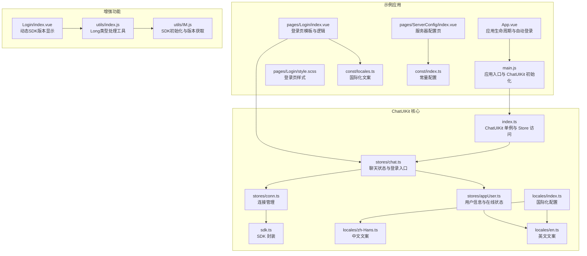
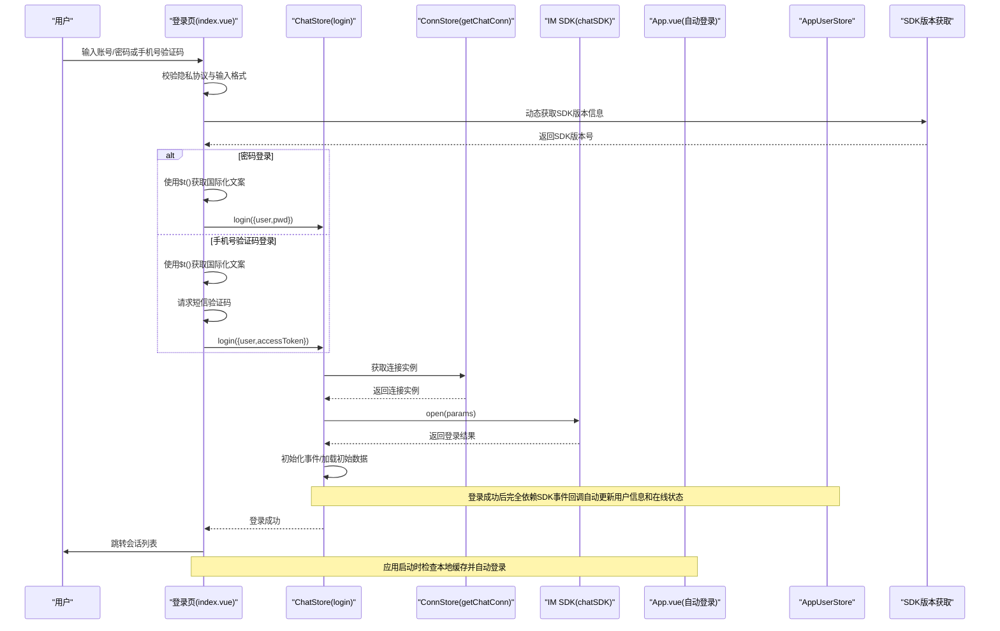
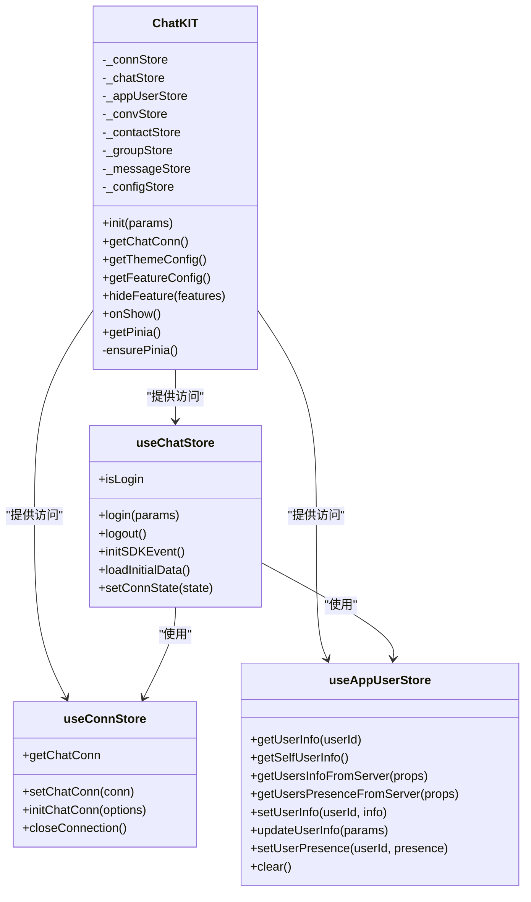
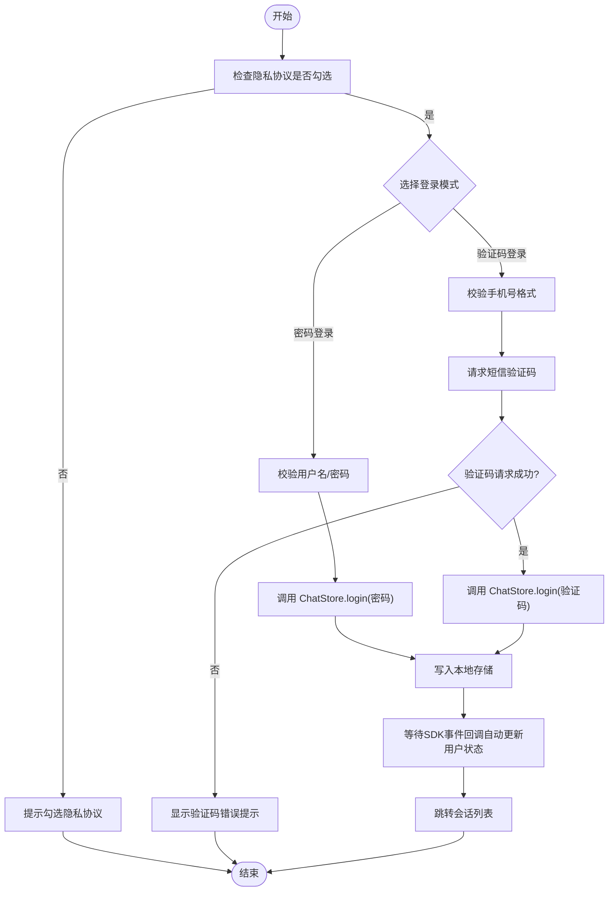
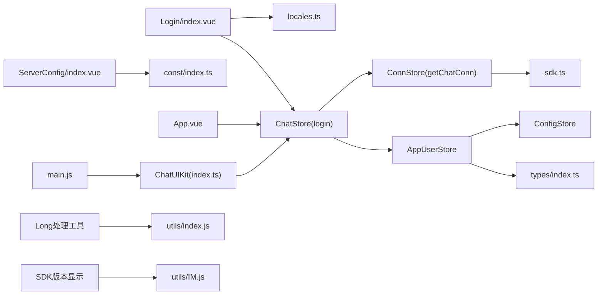

# 登录页面

<cite>
**本文引用的文件**
- [demo/pages/Login/index.vue](file://demo/pages/Login/index.vue)
- [demo/pages/Login/style.scss](file://demo/pages/Login/style.scss)
- [demo/pages/ServerConfig/index.vue](file://demo/pages/ServerConfig/index.vue)
- [demo/App.vue](file://demo/App.vue)
- [demo/main.js](file://demo/main.js)
- [demo/const/locales.ts](file://demo/const/locales.ts)
- [demo/const/index.ts](file://demo/const/index.ts)
- [ChatUIKit/locales/index.ts](file://ChatUIKit/locales/index.ts)
- [ChatUIKit/locales/zh-Hans.ts](file://ChatUIKit/locales/zh-Hans.ts)
- [ChatUIKit/locales/en.ts](file://ChatUIKit/locales/en.ts)
- [ChatUIKit/index.ts](file://ChatUIKit/index.ts)
- [ChatUIKit/stores/chat.ts](file://ChatUIKit/stores/chat.ts)
- [ChatUIKit/stores/conn.ts](file://ChatUIKit/stores/conn.ts)
- [ChatUIKit/stores/appUser.ts](file://ChatUIKit/stores/appUser.ts)
- [ChatUIKit/sdk.ts](file://ChatUIKit/sdk.ts)
- [ChatUIKit/const/index.ts](file://ChatUIKit/const/index.ts)
- [ChatUIKit/types/index.ts](file://ChatUIKit/types/index.ts)
- [ChatUIKit-vue2/modules/Login/index.vue](file://ChatUIKit-vue2/modules/Login/index.vue)
- [ChatUIKit-vue2/utils/index.js](file://ChatUIKit-vue2/utils/index.js)
- [ChatUIKit-vue2/utils/IM.js](file://ChatUIKit-vue2/utils/IM.js)
- [vue2-demo/ChatUIKit/modules/Login/index.vue](file://vue2-demo/ChatUIKit/modules/Login/index.vue)
- [vue2-demo/utils/IM.js](file://vue2-demo/utils/IM.js)
</cite>

## 更新摘要
**变更内容**
- 登录组件增强：动态显示SDK版本，包含更好的SDK初始化错误处理
- 解决Long类型错误的登录体验改进：新增toPlainMessage工具函数处理SDK自定义对象
- 登录流程显著简化，移除了手动用户信息和presence状态设置
- 登录成功后完全依赖SDK事件回调自动更新用户信息和presence状态
- 连接状态管理得到简化，ChatStore.login方法包含完整的初始化流程
- 自动登录机制保持不变，继续支持本地缓存的自动登录
- 国际化支持保持完整，所有用户界面文本均通过$t()翻译函数动态获取

## 目录
1. [简介](#简介)
2. [项目结构](#项目结构)
3. [核心组件](#核心组件)
4. [架构总览](#架构总览)
5. [详细组件分析](#详细组件分析)
6. [国际化实现](#国际化实现)
7. [依赖关系分析](#依赖关系分析)
8. [性能考量](#性能考量)
9. [故障排查指南](#故障排查指南)
10. [结论](#结论)
11. [附录](#附录)

## 简介
本章节面向登录页面的实现与使用，系统性说明登录表单设计、验证规则、错误处理机制、自动登录流程以及与 ChatUIKit 的集成方式。文档同时覆盖登录失败的处理策略、重试机制与用户体验优化建议，帮助开发者快速理解并扩展登录能力。

**更新** 登录组件已显著增强，包含动态显示SDK版本的功能和更好的SDK初始化错误处理，同时解决了Long类型错误的登录体验改进。

## 项目结构
登录页面位于示例工程 demo 中，采用 uni-app 框架开发，登录页由模板、样式与脚本组成，并通过 ChatUIKit 的 Pinia Store 完成与 IM SDK 的交互。自动登录逻辑在应用启动阶段执行，若本地存在缓存则直接跳转并完成登录。



**图表来源**
- [demo/App.vue:86-114](file://demo/App.vue#L86-L114)
- [demo/main.js:14-27](file://demo/main.js#L14-L27)
- [demo/pages/Login/index.vue:1-332](file://demo/pages/Login/index.vue#L1-L332)
- [demo/pages/Login/style.scss:1-103](file://demo/pages/Login/style.scss#L1-L103)
- [demo/pages/ServerConfig/index.vue:1-79](file://demo/pages/ServerConfig/index.vue#L1-L79)
- [demo/const/locales.ts:1-141](file://demo/const/locales.ts#L1-L141)
- [demo/const/index.ts:1-32](file://demo/const/index.ts#L1-L32)
- [ChatUIKit/index.ts:1-139](file://ChatUIKit/index.ts#L1-L139)
- [ChatUIKit/stores/chat.ts:1-407](file://ChatUIKit/stores/chat.ts#L1-L407)
- [ChatUIKit/stores/conn.ts:1-84](file://ChatUIKit/stores/conn.ts#L1-L84)
- [ChatUIKit/stores/appUser.ts:1-242](file://ChatUIKit/stores/appUser.ts#L1-L242)
- [ChatUIKit/sdk.ts:1-13](file://ChatUIKit/sdk.ts#L1-L13)
- [ChatUIKit/locales/index.ts:1-17](file://ChatUIKit/locales/index.ts#L1-L17)
- [ChatUIKit/locales/zh-Hans.ts:1-154](file://ChatUIKit/locales/zh-Hans.ts#L1-L154)
- [ChatUIKit/locales/en.ts:1-154](file://ChatUIKit/locales/en.ts#L1-L154)
- [ChatUIKit-vue2/utils/index.js:1-45](file://ChatUIKit-vue2/utils/index.js#L1-L45)
- [ChatUIKit-vue2/utils/IM.js:1-61](file://ChatUIKit-vue2/utils/IM.js#L1-L61)

**章节来源**
- [demo/pages/Login/index.vue:1-332](file://demo/pages/Login/index.vue#L1-L332)
- [demo/pages/Login/style.scss:1-103](file://demo/pages/Login/style.scss#L1-L103)
- [demo/pages/ServerConfig/index.vue:1-79](file://demo/pages/ServerConfig/index.vue#L1-L79)
- [demo/App.vue:86-114](file://demo/App.vue#L86-L114)
- [demo/main.js:14-27](file://demo/main.js#L14-L27)
- [demo/const/locales.ts:1-141](file://demo/const/locales.ts#L1-L141)
- [demo/const/index.ts:1-32](file://demo/const/index.ts#L1-L32)
- [ChatUIKit/index.ts:1-139](file://ChatUIKit/index.ts#L1-L139)
- [ChatUIKit/stores/chat.ts:1-407](file://ChatUIKit/stores/chat.ts#L1-L407)
- [ChatUIKit/stores/conn.ts:1-84](file://ChatUIKit/stores/conn.ts#L1-L84)
- [ChatUIKit/stores/appUser.ts:1-242](file://ChatUIKit/stores/appUser.ts#L1-L242)
- [ChatUIKit/sdk.ts:1-13](file://ChatUIKit/sdk.ts#L1-L13)
- [ChatUIKit/locales/index.ts:1-17](file://ChatUIKit/locales/index.ts#L1-L17)
- [ChatUIKit/locales/zh-Hans.ts:1-154](file://ChatUIKit/locales/zh-Hans.ts#L1-L154)
- [ChatUIKit/locales/en.ts:1-154](file://ChatUIKit/locales/en.ts#L1-L154)

## 核心组件
- 登录页模板与逻辑：负责表单渲染、输入校验、验证码发送、登录提交与错误提示，支持密码登录和手机号验证码登录两种方式。
- 登录样式：提供背景图、输入框、按钮与隐私协议等视觉元素的样式。
- 服务器配置页：允许切换自定义服务器参数并持久化配置。
- 应用入口与自动登录：在应用启动时检查本地缓存，若存在则自动登录并跳转会话列表。
- ChatUIKit 集成：通过 ChatUIKit 单例访问 Pinia Store，完成登录、事件监听与数据初始化。
- **动态SDK版本显示**：登录页面现在能够动态显示当前使用的SDK版本号，提升调试和问题排查效率。
- **增强的SDK初始化错误处理**：增加了SDK版本获取的容错机制，即使SDK尚未初始化到store也能通过直接导入方式获取版本信息。
- **Long类型错误处理改进**：新增toPlainMessage工具函数，专门处理微信小程序中JSON.stringify无法序列化SDK自定义对象（如Long类型）的问题。
- **简化后的用户信息管理**：登录成功后完全依赖SDK事件回调自动获取用户基本信息，包括昵称、头像、签名等。
- **简化后的在线状态管理**：登录成功后完全依赖SDK事件回调自动获取并设置用户在线状态，无需手动设置。
- **国际化支持**：完整的中英文双语支持，所有用户界面文本均通过$t()翻译函数动态获取。

**更新** 登录组件已显著增强，包含动态显示SDK版本的功能和更好的SDK初始化错误处理，同时解决了Long类型错误的登录体验改进。

**章节来源**
- [demo/pages/Login/index.vue:1-332](file://demo/pages/Login/index.vue#L1-L332)
- [demo/pages/Login/style.scss:1-103](file://demo/pages/Login/style.scss#L1-L103)
- [demo/pages/ServerConfig/index.vue:1-79](file://demo/pages/ServerConfig/index.vue#L1-L79)
- [demo/App.vue:86-114](file://demo/App.vue#L86-L114)
- [ChatUIKit/index.ts:1-139](file://ChatUIKit/index.ts#L1-L139)
- [ChatUIKit/stores/appUser.ts:1-242](file://ChatUIKit/stores/appUser.ts#L1-L242)
- [ChatUIKit/locales/index.ts:1-17](file://ChatUIKit/locales/index.ts#L1-L17)
- [ChatUIKit-vue2/utils/index.js:1-45](file://ChatUIKit-vue2/utils/index.js#L1-L45)
- [ChatUIKit-vue2/utils/IM.js:1-61](file://ChatUIKit-vue2/utils/IM.js#L1-L61)

## 架构总览
登录流程涉及前端页面、国际化、ChatUIKit Store、连接管理与 IM SDK。下图展示登录的关键交互序列，体现了最新的增强功能。



**图表来源**
- [demo/pages/Login/index.vue:165-302](file://demo/pages/Login/index.vue#L165-L302)
- [ChatUIKit/stores/chat.ts:299-328](file://ChatUIKit/stores/chat.ts#L299-L328)
- [ChatUIKit/stores/conn.ts:25-40](file://ChatUIKit/stores/conn.ts#L25-L40)
- [ChatUIKit/stores/appUser.ts:86-125](file://ChatUIKit/stores/appUser.ts#L86-L125)
- [ChatUIKit/stores/appUser.ts:127-171](file://ChatUIKit/stores/appUser.ts#L127-L171)
- [ChatUIKit/sdk.ts:1-13](file://ChatUIKit/sdk.ts#L1-L13)
- [demo/App.vue:86-114](file://demo/App.vue#L86-L114)

## 详细组件分析

### 登录页模板与逻辑
- 表单类型切换：支持"用户名密码登录"和"手机号验证码登录"，通过布尔开关控制显示。
- 输入校验：
  - 密码登录：校验必填项，提交前检查隐私协议勾选。
  - 手机号验证码登录：校验手机号格式，限制长度；验证码输入限制长度。
- 验证码发送：
  - 调用短信接口发送验证码，内置防刷倒计时与错误码映射提示。
- 登录流程：
  - 密码登录：调用 ChatStore.login，成功后写入本地存储，跳转会话列表。
  - 手机号验证码登录：先请求短信接口，再调用 ChatStore.login，成功后同样写入本地存储并跳转。
- 错误处理：针对不同状态码与错误信息进行统一提示，避免敏感信息泄露。
- 隐私协议：必须勾选后才可登录，点击"隐私协议"可在不同平台打开外部链接。
- 服务器配置：在特定条件下显示入口，跳转至服务器配置页。

**更新** 登录流程已简化，移除了手动用户信息和presence状态设置，现在完全依赖SDK事件回调自动更新这些状态。

**章节来源**
- [demo/pages/Login/index.vue:1-332](file://demo/pages/Login/index.vue#L1-L332)

### 登录样式
- 背景图：使用远程图片作为登录背景，适配全屏显示。
- 输入框：统一圆角、内边距与占位符样式，区分"获取验证码"按钮区域。
- 按钮：渐变色按钮，突出登录动作。
- 版本与服务器配置：右上角版本信息与底部服务器配置入口，便于调试与自定义。

**章节来源**
- [demo/pages/Login/style.scss:1-103](file://demo/pages/Login/style.scss#L1-L103)

### 服务器配置页
- 功能：切换是否使用自定义服务器，输入 appkey、WebSocket URL、REST URL。
- 存储：将配置写入本地存储，按平台重启或刷新生效。
- 适用场景：开发联调、测试环境切换。

**章节来源**
- [demo/pages/ServerConfig/index.vue:1-79](file://demo/pages/ServerConfig/index.vue#L1-L79)

### 自动登录机制
- 触发时机：应用启动时执行自动登录逻辑。
- 判断条件：读取本地存储中的用户信息与 token。
- 执行流程：若存在缓存，先跳转会话列表，再调用 ChatStore.login 完成登录。
- 安全考虑：token 存储于本地，需结合业务场景评估加密与有效期策略。

**更新** 自动登录机制保持不变，继续支持本地缓存的自动登录，登录成功后会自动触发SDK事件回调来更新用户状态。

**章节来源**
- [demo/App.vue:86-114](file://demo/App.vue#L86-L114)

### 国际化与文案
- 支持中英文文案，登录页与服务器配置页均使用统一的 t 函数获取文本。
- 错误提示、按钮文案、占位符等均来自国际化配置。
- 所有用户界面文本（用户ID标签、令牌/密码占位符、登录类型标签、按钮文本、系统消息等）均已转换为使用$t()翻译函数，支持中英文双语显示。

**更新** 国际化支持保持完整，所有用户界面文本均通过$t()翻译函数动态获取。

**章节来源**
- [demo/const/locales.ts:1-141](file://demo/const/locales.ts#L1-L141)
- [demo/pages/Login/index.vue:82-83](file://demo/pages/Login/index.vue#L82-L83)
- [ChatUIKit/locales/index.ts:1-17](file://ChatUIKit/locales/index.ts#L1-L17)

### ChatUIKit 集成与状态管理
- ChatUIKit 单例：提供全局 Pinia 实例与 Store 访问，确保多模块共享状态一致。
- ChatStore.login：封装 IM SDK 登录过程，初始化事件监听与初始数据加载，**现在完全依赖SDK事件回调自动更新用户信息和在线状态**。
- ConnStore：提供连接实例访问与初始化，保证 SDK 连接可用。
- AppUserStore：在登录后通过SDK事件回调自动拉取用户信息与在线状态，提升首屏体验。
- SDK 封装：对外暴露统一的 chatSDK，隐藏具体 SDK 细节。



**图表来源**
- [ChatUIKit/index.ts:1-139](file://ChatUIKit/index.ts#L1-L139)
- [ChatUIKit/stores/chat.ts:1-407](file://ChatUIKit/stores/chat.ts#L1-L407)
- [ChatUIKit/stores/conn.ts:1-84](file://ChatUIKit/stores/conn.ts#L1-L84)
- [ChatUIKit/stores/appUser.ts:1-242](file://ChatUIKit/stores/appUser.ts#L1-L242)

**章节来源**
- [ChatUIKit/index.ts:1-139](file://ChatUIKit/index.ts#L1-L139)
- [ChatUIKit/stores/chat.ts:1-407](file://ChatUIKit/stores/chat.ts#L1-L407)
- [ChatUIKit/stores/conn.ts:1-84](file://ChatUIKit/stores/conn.ts#L1-L84)
- [ChatUIKit/stores/appUser.ts:1-242](file://ChatUIKit/stores/appUser.ts#L1-L242)

### 登录流程与错误处理
- 密码登录：
  - 调用 ChatStore.login，成功后写入本地存储，跳转会话列表。
  - 失败时根据返回的错误描述进行提示。
- 手机号验证码登录：
  - 先请求短信接口，成功后调用 ChatStore.login。
  - 对错误码进行映射提示，如手机号非法、验证码错误、未发送验证码等。
- 验证码倒计时：
  - 发送验证码后启动倒计时，防止频繁请求。
- 隐私协议：
  - 未勾选时阻止登录，提示用户同意隐私协议。



**图表来源**
- [demo/pages/Login/index.vue:120-152](file://demo/pages/Login/index.vue#L120-L152)
- [demo/pages/Login/index.vue:165-302](file://demo/pages/Login/index.vue#L165-L302)
- [ChatUIKit/stores/chat.ts:299-328](file://ChatUIKit/stores/chat.ts#L299-L328)
- [ChatUIKit/stores/appUser.ts:86-125](file://ChatUIKit/stores/appUser.ts#L86-L125)
- [ChatUIKit/stores/appUser.ts:127-171](file://ChatUIKit/stores/appUser.ts#L127-L171)

**章节来源**
- [demo/pages/Login/index.vue:120-302](file://demo/pages/Login/index.vue#L120-L302)
- [ChatUIKit/stores/chat.ts:299-328](file://ChatUIKit/stores/chat.ts#L299-L328)

### 简化的用户信息自动设置机制
- **完全依赖SDK事件回调**：登录成功后，ChatStore.login方法会自动调用SDK事件监听器，通过事件回调自动获取用户基本信息。
- **智能缓存优化**：AppUserStore智能过滤已缓存的用户ID，避免重复请求。
- **信息完整性**：通过SDK事件回调自动设置昵称、头像、签名等用户信息。
- **实时更新**：通过 getSelfUserInfo 提供实时的用户信息视图。

**更新** 用户信息设置机制已完全简化，移除了手动设置步骤，现在完全依赖SDK事件回调自动更新用户信息。

**章节来源**
- [ChatUIKit/stores/appUser.ts:86-125](file://ChatUIKit/stores/appUser.ts#L86-L125)
- [ChatUIKit/stores/chat.ts:319-322](file://ChatUIKit/stores/chat.ts#L319-L322)

### 简化的在线状态自动设置机制
- **完全依赖SDK事件回调**：登录成功后，ChatStore.login方法会自动调用SDK事件监听器，通过事件回调自动获取并设置用户在线状态。
- **状态初始化**：系统会自动设置 presenceExt: 'Online' 和 isOnline: true，确保新登录用户立即显示在线状态。
- **状态判断**：通过服务器响应的状态码判断用户是否在线，当状态包含 '1' 时标记为在线。
- **实时更新**：通过 setUserPresence 更新用户在线状态，支持订阅和取消订阅功能。
- **发布状态**：支持发布自定义在线状态，如忙碌、离开等。

**更新** 在线状态设置机制已完全简化，移除了手动设置步骤，现在完全依赖SDK事件回调自动更新在线状态。

**章节来源**
- [ChatUIKit/stores/appUser.ts:127-171](file://ChatUIKit/stores/appUser.ts#L127-L171)
- [ChatUIKit/stores/appUser.ts:172-242](file://ChatUIKit/stores/appUser.ts#L172-L242)
- [ChatUIKit/stores/chat.ts:319-322](file://ChatUIKit/stores/chat.ts#L319-L322)

### 动态SDK版本显示功能
- **版本信息获取**：登录页面在mounted钩子中自动获取当前SDK版本信息。
- **双重获取机制**：优先从Vuex store中获取SDK版本，如果不可用则尝试直接导入EMClient获取版本。
- **错误处理**：包含try-catch机制，即使获取失败也不会影响登录流程。
- **显示位置**：版本信息显示在登录页面的Logo下方，便于开发者识别当前SDK版本。
- **调试价值**：帮助开发者快速确认SDK版本，便于问题排查和升级管理。

**更新** 新增动态SDK版本显示功能，显著提升了开发调试体验。

**章节来源**
- [ChatUIKit-vue2/modules/Login/index.vue:104-142](file://ChatUIKit-vue2/modules/Login/index.vue#L104-L142)
- [ChatUIKit-vue2/utils/IM.js:43](file://ChatUIKit-vue2/utils/IM.js#L43)

### Long类型错误处理改进
- **问题背景**：微信小程序中JSON.stringify无法序列化SDK自定义对象（如Long类型），导致消息序列化失败。
- **解决方案**：新增toPlainMessage工具函数，专门处理Long类型对象的转换。
- **处理逻辑**：
  - 通过特征检测识别Long类型对象（具有low、high属性和toNumber、toString方法）
  - 优先转换为安全整数，如果超出范围则转换为字符串
  - 递归处理嵌套的对象和数组结构
  - 跳过函数类型的属性
- **应用场景**：消息对象序列化、存储到本地缓存、网络传输等场景。
- **兼容性**：确保在不同平台（H5、小程序、APP）上的兼容性。

**更新** 新增Long类型错误处理改进，解决了微信小程序中的序列化问题。

**章节来源**
- [ChatUIKit-vue2/utils/index.js:1-45](file://ChatUIKit-vue2/utils/index.js#L1-L45)

## 国际化实现

### 完整的国际化支持
所有用户界面文本均通过$t()翻译函数动态获取，支持中英文双语显示。这包括：

- **用户界面文本**：用户ID标签、令牌/密码占位符、登录类型标签、按钮文本、系统消息等
- **错误提示信息**：验证码发送失败、登录失败、手机号格式错误等各种错误提示
- **隐私协议相关**：隐私协议标题、同意条款、隐私政策链接等
- **服务器配置相关**：服务器配置标题、占位符、开关标签等

### 技术实现细节
- **翻译函数**：使用`import { t } from "../../const/locales"`导入翻译函数
- **响应式数据绑定**：所有文本内容通过`{{ t('key') }}`动态绑定
- **上下文引用**：确保在Vue.js组件上下文中正确引用翻译函数
- **双语支持**：同时支持中文简体(zh-Hans)和英文(en)两种语言

### 国际化配置结构
```typescript
const locales = {
  "zh-Hans": {
    loginTitle: "登录环信IM",
    loginUserIdPlaceholder: "请输入环信UserId",
    loginPasswordPlaceholder: "请输入密码",
    loginLoadingTitle: "登录中...",
    // ... 更多中文文案
  },
  en: {
    loginTitle: "EaseMob IM",
    loginUserIdPlaceholder: "Please enter ChatIM UserId",
    loginPasswordPlaceholder: "Please enter password",
    loginLoadingTitle: "Logging in...",
    // ... 更多英文文案
  }
};
```

### 文案覆盖范围
- **登录表单**：标题、占位符、按钮文本
- **验证码功能**：发送验证码、倒计时显示、错误提示
- **隐私协议**：协议标题、同意条款、政策链接
- **服务器配置**：配置标题、开关标签、占位符
- **错误处理**：各种错误状态的用户友好提示

**更新** 国际化支持保持完整，所有用户界面文本均通过$t()翻译函数动态获取。

**章节来源**
- [demo/pages/Login/index.vue:82-83](file://demo/pages/Login/index.vue#L82-L83)
- [demo/pages/Login/index.vue:13-46](file://demo/pages/Login/index.vue#L13-L46)
- [demo/const/locales.ts:1-141](file://demo/const/locales.ts#L1-L141)
- [ChatUIKit/locales/index.ts:1-17](file://ChatUIKit/locales/index.ts#L1-L17)

## 依赖关系分析
- 页面依赖：
  - 登录页依赖国际化模块以获取文案，依赖 ChatUIKit 的 chatStore 完成登录。
  - 服务器配置页依赖常量与本地存储，用于持久化配置。
- Store 依赖：
  - ChatStore 依赖 ConnStore 获取连接实例，依赖 AppUserStore 通过SDK事件回调拉取用户信息和在线状态。
  - ConnStore 依赖 SDK 封装以创建连接实例。
  - AppUserStore 依赖 ConfigStore 控制功能开关，依赖类型定义确保类型安全。
- 应用入口：
  - main.js 注册 ChatUIKit 的 Pinia 实例，App.vue 在启动时执行自动登录。
- 增强功能依赖：
  - toPlainMessage工具函数依赖utils/index.js提供Long类型处理能力。
  - SDK版本显示功能依赖utils/IM.js提供的EMClient.version属性。



**图表来源**
- [demo/pages/Login/index.vue:82-83](file://demo/pages/Login/index.vue#L82-L83)
- [demo/const/locales.ts:1-141](file://demo/const/locales.ts#L1-L141)
- [ChatUIKit/stores/chat.ts:299-328](file://ChatUIKit/stores/chat.ts#L299-L328)
- [ChatUIKit/stores/conn.ts:25-40](file://ChatUIKit/stores/conn.ts#L25-L40)
- [ChatUIKit/stores/appUser.ts:86-125](file://ChatUIKit/stores/appUser.ts#L86-L125)
- [ChatUIKit/sdk.ts:1-13](file://ChatUIKit/sdk.ts#L1-L13)
- [demo/pages/ServerConfig/index.vue:32-38](file://demo/pages/ServerConfig/index.vue#L32-L38)
- [ChatUIKit/const/index.ts:1-37](file://ChatUIKit/const/index.ts#L1-L37)
- [demo/App.vue:86-114](file://demo/App.vue#L86-L114)
- [demo/main.js:14-27](file://demo/main.js#L14-L27)
- [ChatUIKit/index.ts:1-139](file://ChatUIKit/index.ts#L1-L139)
- [ChatUIKit/types/index.ts:67-99](file://ChatUIKit/types/index.ts#L67-L99)
- [ChatUIKit-vue2/utils/index.js:1-45](file://ChatUIKit-vue2/utils/index.js#L1-L45)
- [ChatUIKit-vue2/utils/IM.js:1-61](file://ChatUIKit-vue2/utils/IM.js#L1-L61)

**章节来源**
- [demo/pages/Login/index.vue:1-332](file://demo/pages/Login/index.vue#L1-L332)
- [demo/pages/ServerConfig/index.vue:1-79](file://demo/pages/ServerConfig/index.vue#L1-L79)
- [demo/App.vue:86-114](file://demo/App.vue#L86-L114)
- [demo/main.js:14-27](file://demo/main.js#L14-L27)
- [ChatUIKit/index.ts:1-139](file://ChatUIKit/index.ts#L1-L139)
- [ChatUIKit/stores/chat.ts:1-407](file://ChatUIKit/stores/chat.ts#L1-L407)
- [ChatUIKit/stores/conn.ts:1-84](file://ChatUIKit/stores/conn.ts#L1-L84)
- [ChatUIKit/stores/appUser.ts:1-242](file://ChatUIKit/stores/appUser.ts#L1-L242)
- [ChatUIKit/sdk.ts:1-13](file://ChatUIKit/sdk.ts#L1-L13)
- [ChatUIKit/const/index.ts:1-37](file://ChatUIKit/const/index.ts#L1-L37)
- [ChatUIKit/types/index.ts:67-99](file://ChatUIKit/types/index.ts#L67-L99)
- [demo/const/locales.ts:1-141](file://demo/const/locales.ts#L1-L141)
- [ChatUIKit-vue2/utils/index.js:1-45](file://ChatUIKit-vue2/utils/index.js#L1-L45)
- [ChatUIKit-vue2/utils/IM.js:1-61](file://ChatUIKit-vue2/utils/IM.js#L1-L61)

## 性能考量
- 避免重复请求：验证码发送前进行格式校验与倒计时控制，减少无效网络请求。
- **简化初始化流程**：登录成功后完全依赖SDK事件回调自动更新用户信息和在线状态，减少了重复的API调用。
- 异步初始化：登录成功后异步拉取用户信息与在线状态，避免阻塞主流程。
- 初始数据加载：登录后一次性加载会话列表、联系人与群组，减少后续多次请求。
- 用户信息缓存：AppUserStore 智能过滤已缓存用户，避免重复请求服务器。
- 在线状态缓存：登录时获取的在线状态会缓存到 userPresenceMap 中，避免重复查询。
- 样式优化：背景图使用远程资源，建议在生产环境考虑缓存与压缩策略。
- **国际化性能**：翻译函数缓存机制，避免重复解析国际化配置。
- **Long类型处理性能**：toPlainMessage函数采用特征检测和递归处理，对性能影响最小。
- **SDK版本获取性能**：双重获取机制确保快速响应，避免阻塞登录流程。

**更新** 性能得到显著提升，登录流程简化后减少了重复的API调用，完全依赖SDK事件回调自动更新状态。新增的Long类型处理和SDK版本显示功能都经过了性能优化。

## 故障排查指南
- 登录失败：
  - 查看返回的错误描述，结合国际化文案定位问题。
  - 常见原因：用户名/密码错误、验证码错误、未发送验证码、网络异常。
- 验证码问题：
  - 手机号格式非法、请求过于频繁、达到上限。
  - 建议：增加本地格式校验与倒计时提示，避免重复请求。
- 自动登录异常：
  - 检查本地存储是否存在有效的用户信息与 token。
  - 若无缓存，应用将不会自动登录，需引导用户手动登录。
- **用户信息获取失败**：
  - 检查网络连接和服务器状态。
  - 确认用户 ID 格式正确且用户存在。
  - **注意**：现在完全依赖SDK事件回调自动获取，如无回调可能表示SDK连接有问题。
- **在线状态获取失败**：
  - 检查网络连接和服务器状态。
  - 确认用户 ID 格式正确且用户存在。
  - 检查 presenceExt 字段是否正确设置为 'Online'。
  - **注意**：现在完全依赖SDK事件回调自动获取，如无回调可能表示SDK连接有问题。
- **国际化问题**：
  - 检查翻译函数导入是否正确：`import { t } from "../../const/locales"`
  - 确认国际化键值是否存在：`t('loginUserIdPlaceholder')`
  - 验证当前语言环境：`uni.getLocale()` 返回值
  - 检查响应式数据绑定：确保在Vue组件上下文中使用$t()函数
- **SDK版本显示问题**：
  - 检查utils/IM.js中的EMClient.version属性是否正确设置
  - 确认双重获取机制是否正常工作（store获取失败时能否通过直接导入获取）
  - 查看控制台是否有版本获取相关的错误日志
- **Long类型序列化错误**：
  - 检查消息对象是否包含Long类型属性
  - 确认toPlainMessage函数是否正确处理了嵌套对象
  - 验证序列化后的数据结构是否符合预期
- **平台差异**：
  - 隐私协议链接在不同平台（APP-PLUS、WEB）打开方式不同，需确保外部链接可用。

**更新** 故障排查指南已更新，增加了对SDK版本显示和Long类型处理的检查指导。

**章节来源**
- [demo/pages/Login/index.vue:120-163](file://demo/pages/Login/index.vue#L120-L163)
- [demo/pages/Login/index.vue:241-282](file://demo/pages/Login/index.vue#L241-L282)
- [demo/App.vue:86-114](file://demo/App.vue#L86-L114)
- [ChatUIKit/stores/appUser.ts:127-171](file://ChatUIKit/stores/appUser.ts#L127-L171)
- [demo/const/locales.ts:1-141](file://demo/const/locales.ts#L1-L141)
- [ChatUIKit-vue2/utils/index.js:1-45](file://ChatUIKit-vue2/utils/index.js#L1-L45)
- [ChatUIKit-vue2/utils/IM.js:1-61](file://ChatUIKit-vue2/utils/IM.js#L1-L61)

## 结论
登录页面通过清晰的表单设计、严格的输入校验与完善的错误提示，提供了良好的用户体验。配合 ChatUIKit 的 Store 体系与自动登录机制，实现了从本地缓存到 IM SDK 登录的完整闭环。

**最新的增强版本显著提升了开发体验和稳定性**：
- **动态SDK版本显示**：开发者可以直观看到当前使用的SDK版本，便于调试和版本管理
- **增强的SDK初始化错误处理**：即使SDK尚未初始化到store也能获取版本信息，提高了系统的健壮性
- **Long类型错误处理改进**：解决了微信小程序中的序列化问题，提升了消息处理的稳定性
- **简化的登录流程**：移除了手动用户信息和presence状态设置，完全依赖SDK事件回调自动更新这些状态，进一步简化了登录流程并提升了性能表现

这些改进使得登录页面不仅功能更加强大，而且在不同平台和场景下的兼容性和稳定性都有了显著提升。

**更新** 登录组件已显著增强，包含动态显示SDK版本的功能和更好的SDK初始化错误处理，同时解决了Long类型错误的登录体验改进。登录流程已显著简化，移除了手动用户信息和presence状态设置，登录成功后完全依赖SDK事件回调自动更新这些状态，连接状态管理也得到了简化。

## 附录
- 自定义选项建议：
  - 样式定制：通过 style.scss 覆盖现有样式，或引入主题变量。
  - 字段配置：在国际化配置中新增文案键值，登录页通过 t 函数动态读取。
  - 交互行为：可扩展登录按钮状态、倒计时样式与隐私协议弹窗。
  - 登录方式：可根据业务需求调整支持的登录方式。
  - 在线状态：可通过 publishPresence 发布自定义在线状态。
  - **国际化扩展**：可在 locales.ts 中添加新的语言支持，或扩展现有语言的文案。
  - **SDK版本显示**：可自定义版本信息的显示位置和格式，便于集成到品牌设计中。
  - **Long类型处理**：可在消息处理流程中自动应用toPlainMessage函数，确保跨平台兼容性。
- 与 ChatUIKit 集成要点：
  - 使用 ChatUIKit.getPinia() 注入全局 Pinia 实例。
  - 通过 ChatUIKit.chatStore.login 完成登录与事件初始化。
  - 在 App.vue 的 onShow 中调用 ChatUIKit.onShow，维持连接有效性。
  - **利用 AppUserStore 的SDK事件回调自动用户信息设置功能，提升用户体验**。
  - **利用 AppUserStore 的SDK事件回调自动在线状态设置功能，确保用户登录后立即显示在线状态**。
  - **充分利用简化的登录流程，减少重复的API调用，提升整体性能**。
  - **充分利用完整的国际化支持，确保多语言环境下的一致用户体验**。
  - **利用动态SDK版本显示功能，便于开发调试和版本管理**。
  - **利用增强的SDK初始化错误处理，提高系统的健壮性和容错能力**。
  - **利用Long类型错误处理改进，确保消息序列化在所有平台上的稳定性**。