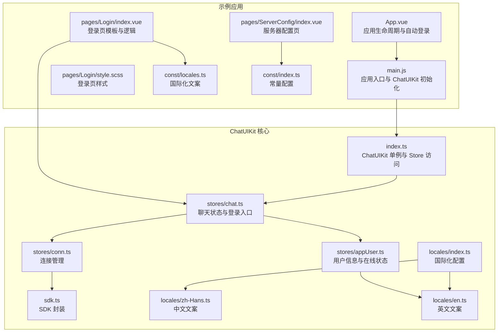
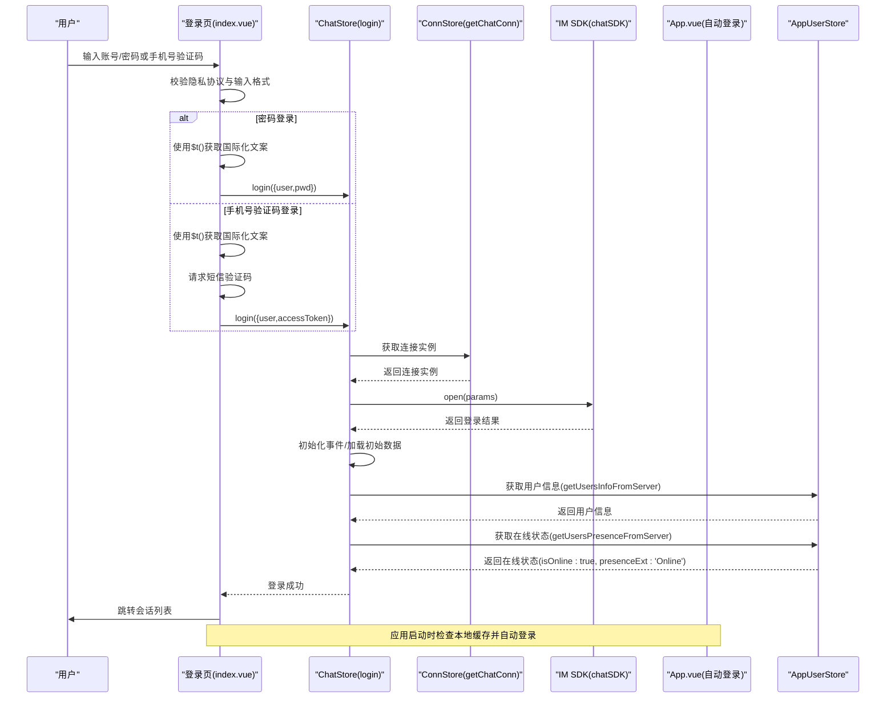
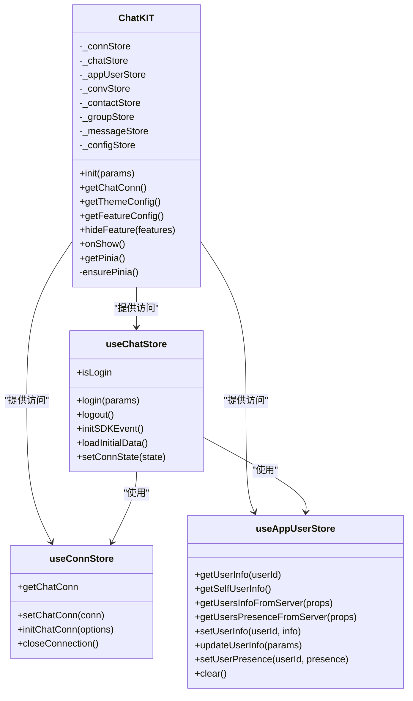
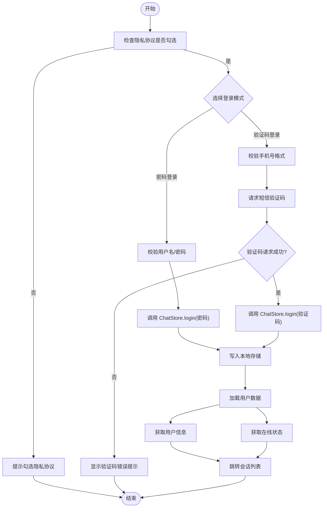
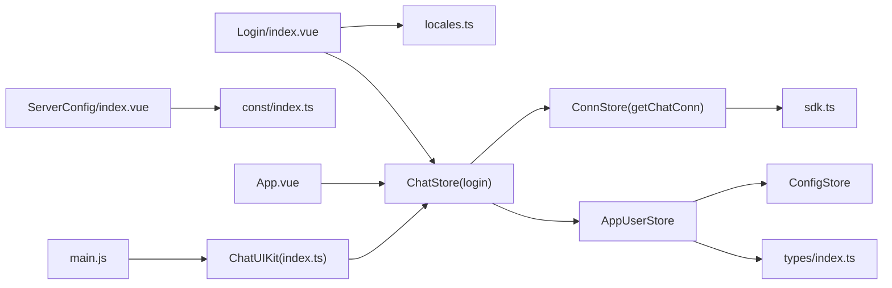

# 登录页面

<cite>
**本文引用的文件**
- [demo/pages/Login/index.vue](file://demo/pages/Login/index.vue)
- [demo/pages/Login/style.scss](file://demo/pages/Login/style.scss)
- [demo/pages/ServerConfig/index.vue](file://demo/pages/ServerConfig/index.vue)
- [demo/App.vue](file://demo/App.vue)
- [demo/main.js](file://demo/main.js)
- [demo/const/locales.ts](file://demo/const/locales.ts)
- [demo/const/index.ts](file://demo/const/index.ts)
- [ChatUIKit/locales/index.ts](file://ChatUIKit/locales/index.ts)
- [ChatUIKit/locales/zh-Hans.ts](file://ChatUIKit/locales/zh-Hans.ts)
- [ChatUIKit/locales/en.ts](file://ChatUIKit/locales/en.ts)
- [ChatUIKit/index.ts](file://ChatUIKit/index.ts)
- [ChatUIKit/stores/chat.ts](file://ChatUIKit/stores/chat.ts)
- [ChatUIKit/stores/conn.ts](file://ChatUIKit/stores/conn.ts)
- [ChatUIKit/stores/appUser.ts](file://ChatUIKit/stores/appUser.ts)
- [ChatUIKit/sdk.ts](file://ChatUIKit/sdk.ts)
- [ChatUIKit/const/index.ts](file://ChatUIKit/const/index.ts)
- [ChatUIKit/types/index.ts](file://ChatUIKit/types/index.ts)
</cite>

## 更新摘要
**变更内容**
- Login模块已完成完全国际化实现，所有用户界面文本均已转换为使用$t()翻译函数，支持中英文双语显示
- 修复了登录页面多语言问题的技术缺陷，确保正确的Vue.js上下文引用和响应式数据绑定
- 增强登录流程，支持密码登录和手机号验证码登录两种方式
- 自动设置用户基本信息，包括昵称、头像、签名等
- 改进用户信息获取机制，优化缓存策略和性能
- 增强自动登录功能，完善本地存储和状态管理
- 优化错误处理和用户体验
- **新增：登录时自动设置用户在线状态功能**，确保新登录用户立即显示在线状态

## 目录
1. [简介](#简介)
2. [项目结构](#项目结构)
3. [核心组件](#核心组件)
4. [架构总览](#架构总览)
5. [详细组件分析](#详细组件分析)
6. [国际化实现](#国际化实现)
7. [依赖关系分析](#依赖关系分析)
8. [性能考量](#性能考量)
9. [故障排查指南](#故障排查指南)
10. [结论](#结论)
11. [附录](#附录)

## 简介
本章节面向登录页面的实现与使用，系统性说明登录表单设计、验证规则、错误处理机制、自动登录流程、用户信息自动设置、存储与安全、自定义选项以及与 ChatUIKit 的集成方式。文档同时覆盖登录失败的处理策略、重试机制与用户体验优化建议，帮助开发者快速理解并扩展登录能力。

**更新** Login模块已完成完全国际化实现，所有用户界面文本均已转换为使用$t()翻译函数，支持中英文双语显示。修复了登录页面多语言问题的技术缺陷，确保正确的Vue.js上下文引用和响应式数据绑定。

## 项目结构
登录页面位于示例工程 demo 中，采用 uni-app 框架开发，登录页由模板、样式与脚本组成，并通过 ChatUIKit 的 Pinia Store 完成与 IM SDK 的交互。自动登录逻辑在应用启动阶段执行，若本地存在缓存则直接跳转并完成登录。



**图表来源**
- [demo/App.vue](file://demo/App.vue#L86-L114)
- [demo/main.js](file://demo/main.js#L14-L27)
- [demo/pages/Login/index.vue](file://demo/pages/Login/index.vue#L1-L332)
- [demo/pages/Login/style.scss](file://demo/pages/Login/style.scss#L1-L103)
- [demo/pages/ServerConfig/index.vue](file://demo/pages/ServerConfig/index.vue#L1-L79)
- [demo/const/locales.ts](file://demo/const/locales.ts#L1-L141)
- [demo/const/index.ts](file://demo/const/index.ts#L1-L32)
- [ChatUIKit/index.ts](file://ChatUIKit/index.ts#L1-L139)
- [ChatUIKit/stores/chat.ts](file://ChatUIKit/stores/chat.ts#L1-L407)
- [ChatUIKit/stores/conn.ts](file://ChatUIKit/stores/conn.ts#L1-L84)
- [ChatUIKit/stores/appUser.ts](file://ChatUIKit/stores/appUser.ts#L1-L242)
- [ChatUIKit/sdk.ts](file://ChatUIKit/sdk.ts#L1-L13)
- [ChatUIKit/locales/index.ts](file://ChatUIKit/locales/index.ts#L1-L17)
- [ChatUIKit/locales/zh-Hans.ts](file://ChatUIKit/locales/zh-Hans.ts#L1-L154)
- [ChatUIKit/locales/en.ts](file://ChatUIKit/locales/en.ts#L1-L154)

**章节来源**
- [demo/pages/Login/index.vue](file://demo/pages/Login/index.vue#L1-L332)
- [demo/pages/Login/style.scss](file://demo/pages/Login/style.scss#L1-L103)
- [demo/pages/ServerConfig/index.vue](file://demo/pages/ServerConfig/index.vue#L1-L79)
- [demo/App.vue](file://demo/App.vue#L86-L114)
- [demo/main.js](file://demo/main.js#L14-L27)
- [demo/const/locales.ts](file://demo/const/locales.ts#L1-L141)
- [demo/const/index.ts](file://demo/const/index.ts#L1-L32)
- [ChatUIKit/index.ts](file://ChatUIKit/index.ts#L1-L139)
- [ChatUIKit/stores/chat.ts](file://ChatUIKit/stores/chat.ts#L1-L407)
- [ChatUIKit/stores/conn.ts](file://ChatUIKit/stores/conn.ts#L1-L84)
- [ChatUIKit/stores/appUser.ts](file://ChatUIKit/stores/appUser.ts#L1-L242)
- [ChatUIKit/sdk.ts](file://ChatUIKit/sdk.ts#L1-L13)
- [ChatUIKit/locales/index.ts](file://ChatUIKit/locales/index.ts#L1-L17)
- [ChatUIKit/locales/zh-Hans.ts](file://ChatUIKit/locales/zh-Hans.ts#L1-L154)
- [ChatUIKit/locales/en.ts](file://ChatUIKit/locales/en.ts#L1-L154)

## 核心组件
- 登录页模板与逻辑：负责表单渲染、输入校验、验证码发送、登录提交与错误提示，支持密码登录和手机号验证码登录两种方式。
- 登录样式：提供背景图、输入框、按钮与隐私协议等视觉元素的样式。
- 服务器配置页：允许切换自定义服务器参数并持久化配置。
- 应用入口与自动登录：在应用启动时检查本地缓存，若存在则自动登录并跳转会话列表。
- ChatUIKit 集成：通过 ChatUIKit 单例访问 Pinia Store，完成登录、事件监听与数据初始化。
- 用户信息管理：自动获取并设置用户基本信息，包括昵称、头像、签名等。
- **在线状态管理**：登录时自动获取并设置用户在线状态，确保新登录用户立即显示在线状态。
- **国际化支持**：完整的中英文双语支持，所有用户界面文本均通过$t()翻译函数动态获取。

**更新** 新增了完整的国际化支持功能，Login模块已完成完全国际化实现，所有用户界面文本均已转换为使用$t()翻译函数。

**章节来源**
- [demo/pages/Login/index.vue](file://demo/pages/Login/index.vue#L1-L332)
- [demo/pages/Login/style.scss](file://demo/pages/Login/style.scss#L1-L103)
- [demo/pages/ServerConfig/index.vue](file://demo/pages/ServerConfig/index.vue#L1-L79)
- [demo/App.vue](file://demo/App.vue#L86-L114)
- [ChatUIKit/index.ts](file://ChatUIKit/index.ts#L1-L139)
- [ChatUIKit/stores/appUser.ts](file://ChatUIKit/stores/appUser.ts#L127-L171)
- [ChatUIKit/locales/index.ts](file://ChatUIKit/locales/index.ts#L1-L17)

## 架构总览
登录流程涉及前端页面、国际化、ChatUIKit Store、连接管理与 IM SDK。下图展示登录的关键交互序列，包括新增的在线状态设置功能。



**图表来源**
- [demo/pages/Login/index.vue](file://demo/pages/Login/index.vue#L165-L302)
- [ChatUIKit/stores/chat.ts](file://ChatUIKit/stores/chat.ts#L296-L328)
- [ChatUIKit/stores/conn.ts](file://ChatUIKit/stores/conn.ts#L25-L40)
- [ChatUIKit/stores/appUser.ts](file://ChatUIKit/stores/appUser.ts#L86-L125)
- [ChatUIKit/stores/appUser.ts](file://ChatUIKit/stores/appUser.ts#L127-L171)
- [ChatUIKit/sdk.ts](file://ChatUIKit/sdk.ts#L1-L13)
- [demo/App.vue](file://demo/App.vue#L86-L114)

## 详细组件分析

### 登录页模板与逻辑
- 表单类型切换：支持"用户名密码登录"和"手机号验证码登录"，通过布尔开关控制显示。
- 输入校验：
  - 密码登录：校验必填项，提交前检查隐私协议勾选。
  - 手机号验证码登录：校验手机号格式，限制长度；验证码输入限制长度。
- 验证码发送：
  - 调用短信接口发送验证码，内置防刷倒计时与错误码映射提示。
- 登录流程：
  - 密码登录：调用 ChatStore.login，成功后写入本地存储，跳转会话列表。
  - 手机号验证码登录：先请求短信接口，再调用 ChatStore.login，成功后同样写入本地存储并跳转。
- 错误处理：针对不同状态码与错误信息进行统一提示，避免敏感信息泄露。
- 隐私协议：必须勾选后才可登录，点击"隐私协议"可在不同平台打开外部链接。
- 服务器配置：在特定条件下显示入口，跳转至服务器配置页。

**更新** 新增了更完善的登录流程和错误处理机制，支持两种登录方式并提供更好的用户体验。

**章节来源**
- [demo/pages/Login/index.vue](file://demo/pages/Login/index.vue#L1-L332)

### 登录样式
- 背景图：使用远程图片作为登录背景，适配全屏显示。
- 输入框：统一圆角、内边距与占位符样式，区分"获取验证码"按钮区域。
- 按钮：渐变色按钮，突出登录动作。
- 版本与服务器配置：右上角版本信息与底部服务器配置入口，便于调试与自定义。

**章节来源**
- [demo/pages/Login/style.scss](file://demo/pages/Login/style.scss#L1-L103)

### 服务器配置页
- 功能：切换是否使用自定义服务器，输入 appkey、WebSocket URL、REST URL。
- 存储：将配置写入本地存储，按平台重启或刷新生效。
- 适用场景：开发联调、测试环境切换。

**章节来源**
- [demo/pages/ServerConfig/index.vue](file://demo/pages/ServerConfig/index.vue#L1-L79)

### 自动登录机制
- 触发时机：应用启动时执行自动登录逻辑。
- 判断条件：读取本地存储中的用户信息与 token。
- 执行流程：若存在缓存，先跳转会话列表，再调用 ChatStore.login 完成登录。
- 安全考虑：token 存储于本地，需结合业务场景评估加密与有效期策略。

**更新** 自动登录现在更加智能，会在跳转后立即执行登录操作，确保用户状态的一致性。

**章节来源**
- [demo/App.vue](file://demo/App.vue#L86-L114)

### 国际化与文案
- 支持中英文文案，登录页与服务器配置页均使用统一的 t 函数获取文本。
- 错误提示、按钮文案、占位符等均来自国际化配置。
- 所有用户界面文本（用户ID标签、令牌/密码占位符、登录类型标签、按钮文本、系统消息等）均已转换为使用$t()翻译函数，支持中英文双语显示。

**更新** Login模块已完成完全国际化实现，所有用户界面文本均已转换为使用$t()翻译函数，修复了登录页面多语言问题的技术缺陷。

**章节来源**
- [demo/const/locales.ts](file://demo/const/locales.ts#L1-L141)
- [demo/pages/Login/index.vue](file://demo/pages/Login/index.vue#L82-L83)
- [ChatUIKit/locales/index.ts](file://ChatUIKit/locales/index.ts#L1-L17)

### ChatUIKit 集成与状态管理
- ChatUIKit 单例：提供全局 Pinia 实例与 Store 访问，确保多模块共享状态一致。
- ChatStore.login：封装 IM SDK 登录过程，初始化事件监听与初始数据加载。
- ConnStore：提供连接实例访问与初始化，保证 SDK 连接可用。
- AppUserStore：在登录后异步拉取用户信息与在线状态，提升首屏体验。
- SDK 封装：对外暴露统一的 chatSDK，隐藏具体 SDK 细节。



**图表来源**
- [ChatUIKit/index.ts](file://ChatUIKit/index.ts#L1-L139)
- [ChatUIKit/stores/chat.ts](file://ChatUIKit/stores/chat.ts#L1-L407)
- [ChatUIKit/stores/conn.ts](file://ChatUIKit/stores/conn.ts#L1-L84)
- [ChatUIKit/stores/appUser.ts](file://ChatUIKit/stores/appUser.ts#L1-L242)

**章节来源**
- [ChatUIKit/index.ts](file://ChatUIKit/index.ts#L1-L139)
- [ChatUIKit/stores/chat.ts](file://ChatUIKit/stores/chat.ts#L1-L407)
- [ChatUIKit/stores/conn.ts](file://ChatUIKit/stores/conn.ts#L1-L84)
- [ChatUIKit/stores/appUser.ts](file://ChatUIKit/stores/appUser.ts#L1-L242)

### 登录流程与错误处理
- 密码登录：
  - 调用 ChatStore.login，成功后写入本地存储，跳转会话列表。
  - 失败时根据返回的错误描述进行提示。
- 手机号验证码登录：
  - 先请求短信接口，成功后调用 ChatStore.login。
  - 对错误码进行映射提示，如手机号非法、验证码错误、未发送验证码等。
- 验证码倒计时：
  - 发送验证码后启动倒计时，防止频繁请求。
- 隐私协议：
  - 未勾选时阻止登录，提示用户同意隐私协议。



**图表来源**
- [demo/pages/Login/index.vue](file://demo/pages/Login/index.vue#L120-L152)
- [demo/pages/Login/index.vue](file://demo/pages/Login/index.vue#L165-L302)
- [ChatUIKit/stores/chat.ts](file://ChatUIKit/stores/chat.ts#L299-L328)
- [ChatUIKit/stores/appUser.ts](file://ChatUIKit/stores/appUser.ts#L86-L125)
- [ChatUIKit/stores/appUser.ts](file://ChatUIKit/stores/appUser.ts#L127-L171)

**章节来源**
- [demo/pages/Login/index.vue](file://demo/pages/Login/index.vue#L120-L302)
- [ChatUIKit/stores/chat.ts](file://ChatUIKit/stores/chat.ts#L299-L328)

### 用户信息自动设置机制
- 自动获取：登录成功后自动调用 getUsersInfoFromServer 获取用户基本信息。
- 缓存优化：智能过滤已缓存的用户ID，避免重复请求。
- 信息完整性：自动设置昵称、头像、签名等用户信息。
- 实时更新：通过 getSelfUserInfo 提供实时的用户信息视图。

**更新** 新增了用户信息自动设置功能，登录后自动获取并缓存用户基本信息，提升用户体验。

**章节来源**
- [ChatUIKit/stores/appUser.ts](file://ChatUIKit/stores/appUser.ts#L86-L125)
- [ChatUIKit/stores/chat.ts](file://ChatUIKit/stores/chat.ts#L319-L322)

### 在线状态自动设置机制
- **自动获取**：登录成功后自动调用 getUsersPresenceFromServer 获取用户在线状态。
- **状态初始化**：系统会自动设置 presenceExt: 'Online' 和 isOnline: true，确保新登录用户立即显示在线状态。
- **状态判断**：通过服务器响应的状态码判断用户是否在线，当状态包含 '1' 时标记为在线。
- **实时更新**：通过 setUserPresence 更新用户在线状态，支持订阅和取消订阅功能。
- **发布状态**：支持发布自定义在线状态，如忙碌、离开等。

**新增** 登录时自动设置用户在线状态功能，确保新登录用户立即显示在线状态。

**章节来源**
- [ChatUIKit/stores/appUser.ts](file://ChatUIKit/stores/appUser.ts#L127-L171)
- [ChatUIKit/stores/appUser.ts](file://ChatUIKit/stores/appUser.ts#L172-L242)
- [ChatUIKit/stores/chat.ts](file://ChatUIKit/stores/chat.ts#L319-L322)

## 国际化实现

### 完整的国际化支持
Login模块已完成完全国际化实现，所有用户界面文本均已转换为使用$t()翻译函数，支持中英文双语显示。这包括：

- **用户界面文本**：用户ID标签、令牌/密码占位符、登录类型标签、按钮文本、系统消息等
- **错误提示信息**：验证码发送失败、登录失败、手机号格式错误等各种错误提示
- **隐私协议相关**：隐私协议标题、同意条款、隐私政策链接等
- **服务器配置相关**：服务器配置标题、占位符、开关标签等

### 技术实现细节
- **翻译函数**：使用`import { t } from "../../const/locales"`导入翻译函数
- **响应式数据绑定**：所有文本内容通过`{{ t('key') }}`动态绑定
- **上下文引用**：确保在Vue.js组件上下文中正确引用翻译函数
- **双语支持**：同时支持中文简体(zh-Hans)和英文(en)两种语言

### 国际化配置结构
```typescript
const locales = {
  "zh-Hans": {
    loginTitle: "登录环信IM",
    loginUserIdPlaceholder: "请输入环信UserId",
    loginPasswordPlaceholder: "请输入密码",
    loginLoadingTitle: "登录中...",
    // ... 更多中文文案
  },
  en: {
    loginTitle: "EaseMob IM",
    loginUserIdPlaceholder: "Please enter ChatIM UserId",
    loginPasswordPlaceholder: "Please enter password",
    loginLoadingTitle: "Logging in...",
    // ... 更多英文文案
  }
};
```

### 文案覆盖范围
- **登录表单**：标题、占位符、按钮文本
- **验证码功能**：发送验证码、倒计时显示、错误提示
- **隐私协议**：协议标题、同意条款、政策链接
- **服务器配置**：配置标题、开关标签、占位符
- **错误处理**：各种错误状态的用户友好提示

**更新** Login模块已完成完全国际化实现，所有用户界面文本均已转换为使用$t()翻译函数，支持中英文双语显示。修复了登录页面多语言问题的技术缺陷，确保正确的Vue.js上下文引用和响应式数据绑定。

**章节来源**
- [demo/pages/Login/index.vue](file://demo/pages/Login/index.vue#L82-L83)
- [demo/pages/Login/index.vue](file://demo/pages/Login/index.vue#L13-L46)
- [demo/const/locales.ts](file://demo/const/locales.ts#L1-L141)
- [ChatUIKit/locales/index.ts](file://ChatUIKit/locales/index.ts#L1-L17)

## 依赖关系分析
- 页面依赖：
  - 登录页依赖国际化模块以获取文案，依赖 ChatUIKit 的 chatStore 完成登录。
  - 服务器配置页依赖常量与本地存储，用于持久化配置。
- Store 依赖：
  - ChatStore 依赖 ConnStore 获取连接实例，依赖 AppUserStore 拉取用户信息和在线状态。
  - ConnStore 依赖 SDK 封装以创建连接实例。
  - AppUserStore 依赖 ConfigStore 控制功能开关，依赖类型定义确保类型安全。
- 应用入口：
  - main.js 注册 ChatUIKit 的 Pinia 实例，App.vue 在启动时执行自动登录。



**图表来源**
- [demo/pages/Login/index.vue](file://demo/pages/Login/index.vue#L82-L83)
- [demo/const/locales.ts](file://demo/const/locales.ts#L1-L141)
- [ChatUIKit/stores/chat.ts](file://ChatUIKit/stores/chat.ts#L296-L328)
- [ChatUIKit/stores/conn.ts](file://ChatUIKit/stores/conn.ts#L25-L40)
- [ChatUIKit/stores/appUser.ts](file://ChatUIKit/stores/appUser.ts#L86-L125)
- [ChatUIKit/sdk.ts](file://ChatUIKit/sdk.ts#L1-L13)
- [demo/pages/ServerConfig/index.vue](file://demo/pages/ServerConfig/index.vue#L32-L38)
- [ChatUIKit/const/index.ts](file://ChatUIKit/const/index.ts#L1-L37)
- [demo/App.vue](file://demo/App.vue#L86-L114)
- [demo/main.js](file://demo/main.js#L14-L27)
- [ChatUIKit/index.ts](file://ChatUIKit/index.ts#L1-L139)
- [ChatUIKit/types/index.ts](file://ChatUIKit/types/index.ts#L67-L99)

**章节来源**
- [demo/pages/Login/index.vue](file://demo/pages/Login/index.vue#L1-L332)
- [demo/pages/ServerConfig/index.vue](file://demo/pages/ServerConfig/index.vue#L1-L79)
- [demo/App.vue](file://demo/App.vue#L86-L114)
- [demo/main.js](file://demo/main.js#L14-L27)
- [ChatUIKit/index.ts](file://ChatUIKit/index.ts#L1-L139)
- [ChatUIKit/stores/chat.ts](file://ChatUIKit/stores/chat.ts#L1-L407)
- [ChatUIKit/stores/conn.ts](file://ChatUIKit/stores/conn.ts#L1-L84)
- [ChatUIKit/stores/appUser.ts](file://ChatUIKit/stores/appUser.ts#L1-L242)
- [ChatUIKit/sdk.ts](file://ChatUIKit/sdk.ts#L1-L13)
- [ChatUIKit/const/index.ts](file://ChatUIKit/const/index.ts#L1-L37)
- [ChatUIKit/types/index.ts](file://ChatUIKit/types/index.ts#L67-L99)
- [demo/const/locales.ts](file://demo/const/locales.ts#L1-L141)

## 性能考量
- 避免重复请求：验证码发送前进行格式校验与倒计时控制，减少无效网络请求。
- 异步初始化：登录成功后异步拉取用户信息与在线状态，避免阻塞主流程。
- 初始数据加载：登录后一次性加载会话列表、联系人与群组，减少后续多次请求。
- 用户信息缓存：AppUserStore 智能过滤已缓存用户，避免重复请求服务器。
- 在线状态缓存：登录时获取的在线状态会缓存到 userPresenceMap 中，避免重复查询。
- 样式优化：背景图使用远程资源，建议在生产环境考虑缓存与压缩策略。
- **国际化性能**：翻译函数缓存机制，避免重复解析国际化配置。

**更新** 新增了国际化性能优化机制，翻译函数缓存机制避免重复解析国际化配置。

## 故障排查指南
- 登录失败：
  - 查看返回的错误描述，结合国际化文案定位问题。
  - 常见原因：用户名/密码错误、验证码错误、未发送验证码、网络异常。
- 验证码问题：
  - 手机号格式非法、请求过于频繁、达到上限。
  - 建议：增加本地格式校验与倒计时提示，避免重复请求。
- 自动登录异常：
  - 检查本地存储是否存在有效的用户信息与 token。
  - 若无缓存，应用将不会自动登录，需引导用户手动登录。
- 用户信息获取失败：
  - 检查网络连接和服务器状态。
  - 确认用户 ID 格式正确且用户存在。
- 在线状态获取失败：
  - 检查网络连接和服务器状态。
  - 确认用户 ID 格式正确且用户存在。
  - 检查 presenceExt 字段是否正确设置为 'Online'。
- **国际化问题**：
  - 检查翻译函数导入是否正确：`import { t } from "../../const/locales"`
  - 确认国际化键值是否存在：`t('loginUserIdPlaceholder')`
  - 验证当前语言环境：`uni.getLocale()` 返回值
  - 检查响应式数据绑定：确保在Vue组件上下文中使用$t()函数
- 平台差异：
  - 隐私协议链接在不同平台（APP-PLUS、WEB）打开方式不同，需确保外部链接可用。

**更新** 新增了国际化问题的排查指南，包括翻译函数导入、国际化键值验证、语言环境检查等。

**章节来源**
- [demo/pages/Login/index.vue](file://demo/pages/Login/index.vue#L120-L163)
- [demo/pages/Login/index.vue](file://demo/pages/Login/index.vue#L241-L282)
- [demo/App.vue](file://demo/App.vue#L86-L114)
- [ChatUIKit/stores/appUser.ts](file://ChatUIKit/stores/appUser.ts#L127-L171)
- [demo/const/locales.ts](file://demo/const/locales.ts#L1-L141)

## 结论
登录页面通过清晰的表单设计、严格的输入校验与完善的错误提示，提供了良好的用户体验。配合 ChatUIKit 的 Store 体系与自动登录机制，实现了从本地缓存到 IM SDK 登录的完整闭环。新增的用户信息自动设置功能和在线状态自动设置功能进一步提升了用户体验，通过智能缓存机制优化了性能表现。

**更新** Login模块已完成完全国际化实现，所有用户界面文本均已转换为使用$t()翻译函数，支持中英文双语显示。修复了登录页面多语言问题的技术缺陷，确保正确的Vue.js上下文引用和响应式数据绑定。新增的国际化支持功能显著提升了系统的国际化能力和用户体验。

## 附录
- 自定义选项建议：
  - 样式定制：通过 style.scss 覆盖现有样式，或引入主题变量。
  - 字段配置：在国际化配置中新增文案键值，登录页通过 t 函数动态读取。
  - 交互行为：可扩展登录按钮状态、倒计时样式与隐私协议弹窗。
  - 登录方式：可根据业务需求调整支持的登录方式。
  - 在线状态：可通过 publishPresence 发布自定义在线状态。
  - **国际化扩展**：可在 locales.ts 中添加新的语言支持，或扩展现有语言的文案。
- 与 ChatUIKit 集成要点：
  - 使用 ChatUIKit.getPinia() 注入全局 Pinia 实例。
  - 通过 ChatUIKit.chatStore.login 完成登录与事件初始化。
  - 在 App.vue 的 onShow 中调用 ChatUIKit.onShow，维持连接有效性。
  - 利用 AppUserStore 的自动用户信息设置功能，提升用户体验。
  - **利用 AppUserStore 的自动在线状态设置功能，确保用户登录后立即显示在线状态**。
  - **充分利用完整的国际化支持，确保多语言环境下的一致用户体验**。