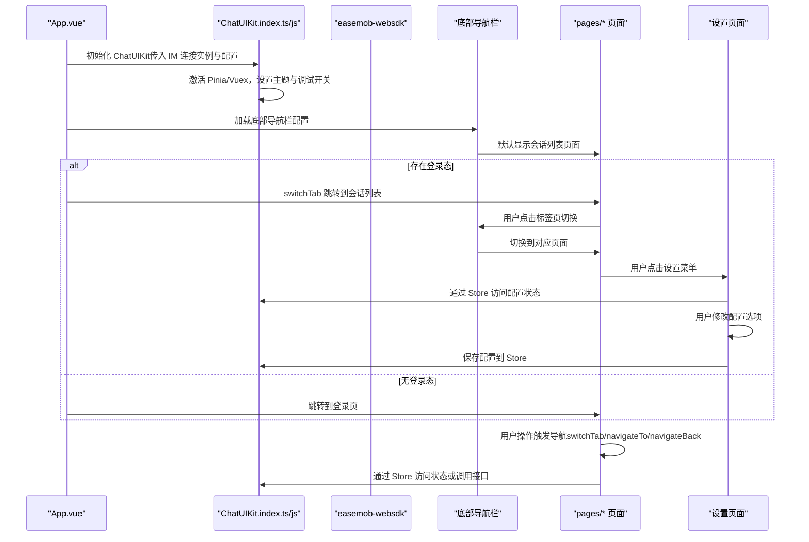
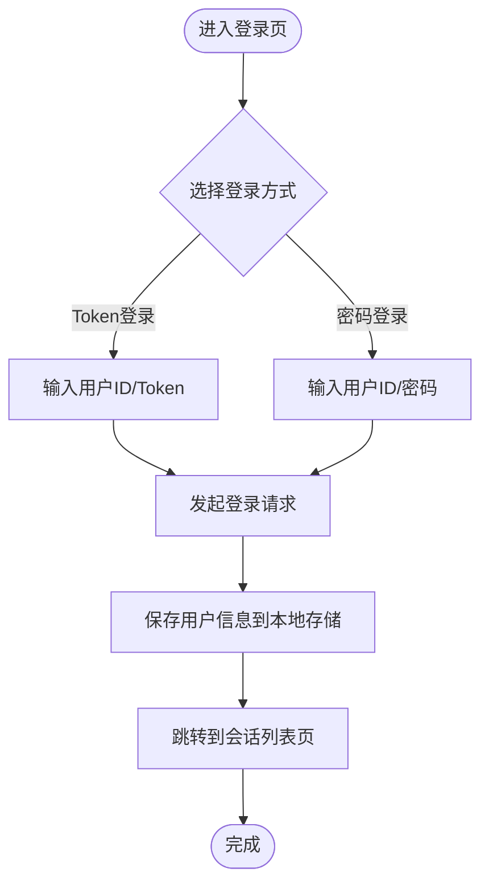
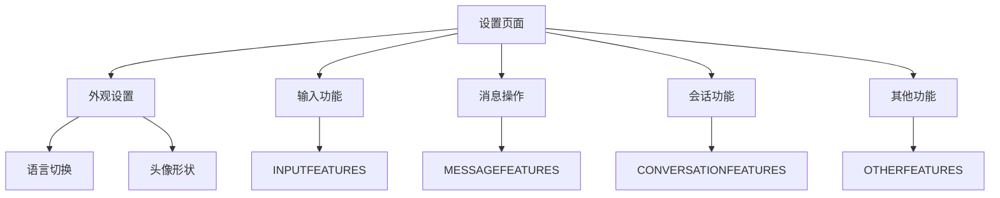
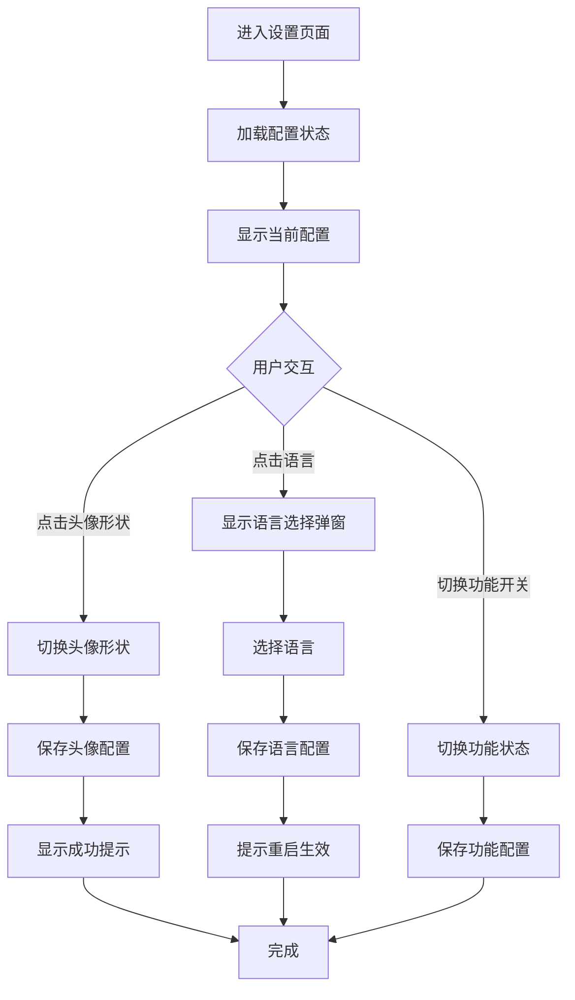
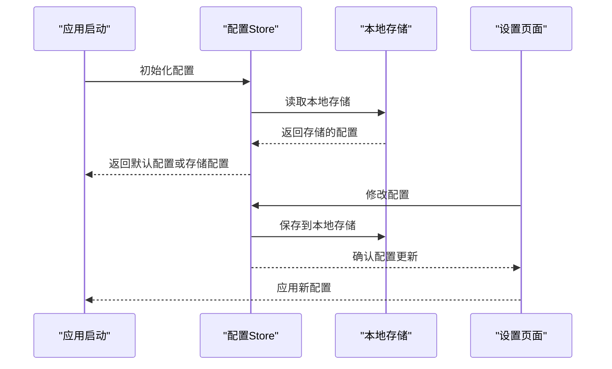
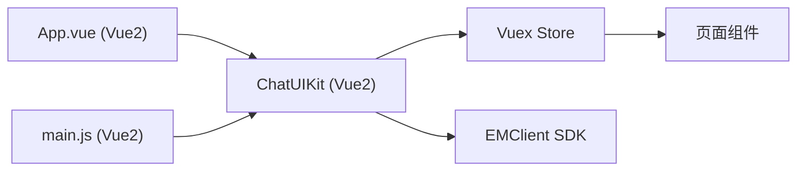
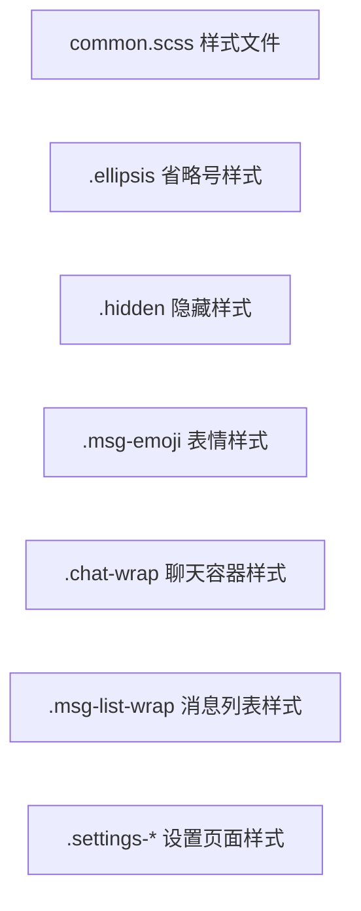
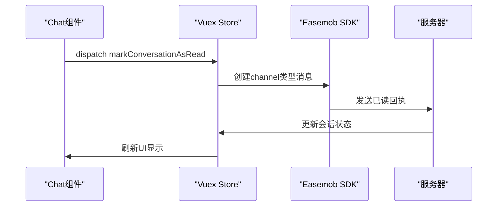
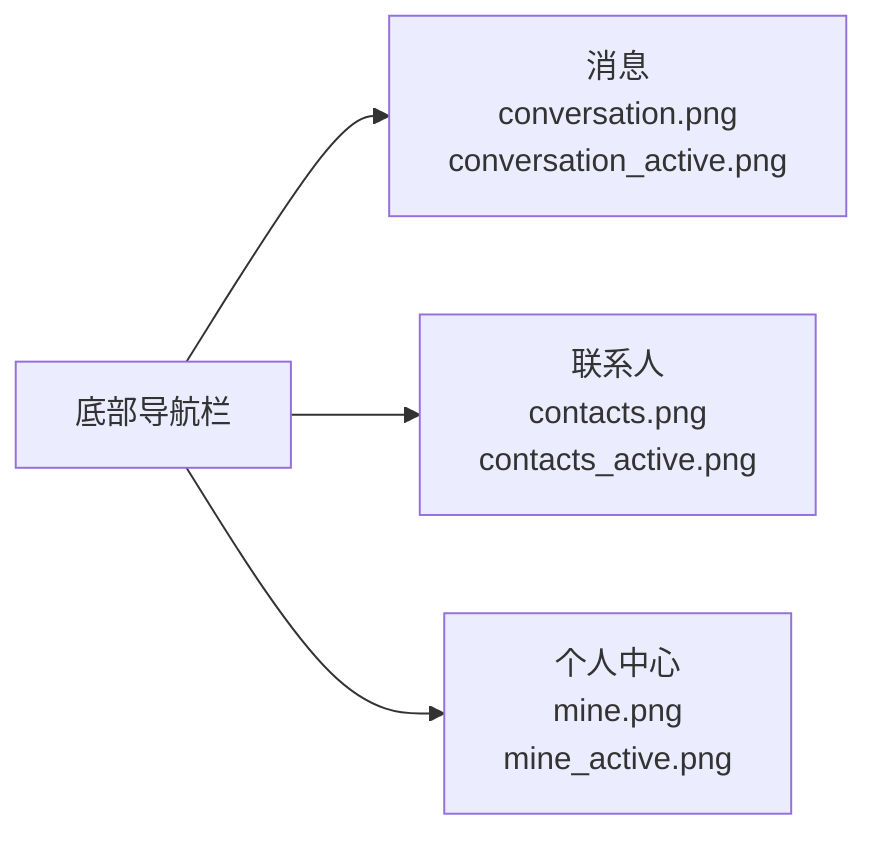
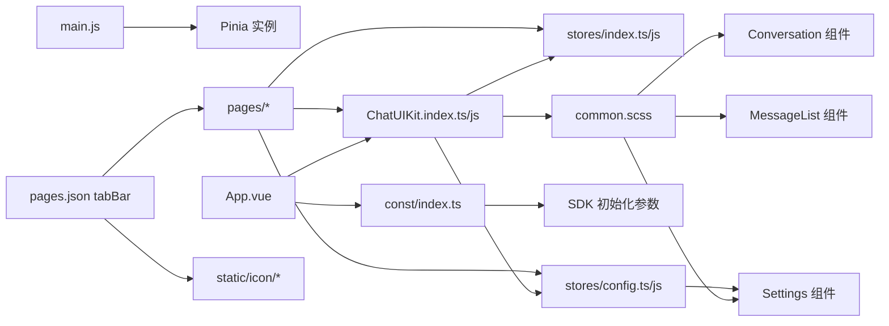

# 示例应用

<cite>
**本文引用的文件**
- [demo/pages.json](file://demo/pages.json)
- [demo/App.vue](file://demo/App.vue)
- [demo/main.js](file://demo/main.js)
- [demo/manifest.json](file://demo/manifest.json)
- [demo/const/index.ts](file://demo/const/index.ts)
- [demo/package.json](file://demo/package.json)
- [demo/pages/Login/index.vue](file://demo/pages/Login/index.vue)
- [demo/pages/Me/index.vue](file://demo/pages/Me/index.vue)
- [demo/pages/About/index.vue](file://demo/pages/About/index.vue)
- [demo/pages/Profile/index.vue](file://demo/pages/Profile/index.vue)
- [demo/pages/ProfileSetting/index.vue](file://demo/pages/ProfileSetting/index.vue)
- [demo/pages/ServerConfig/index.vue](file://demo/pages/ServerConfig/index.vue)
- [vue2-demo/pages/me/settings.vue](file://vue2-demo/pages/me/settings.vue)
- [vue2-demo/pages/me/index.vue](file://vue2-demo/pages/me/index.vue)
- [ChatUIKit/stores/config.ts](file://ChatUIKit/stores/config.ts)
- [vue2-demo/ChatUIKit/stores/config.js](file://vue2-demo/ChatUIKit/stores/config.js)
- [ChatUIKit/configType.ts](file://ChatUIKit/configType.ts)
- [ChatUIKit/locales/index.ts](file://ChatUIKit/locales/index.ts)
- [ChatUIKit/locales/en.ts](file://ChatUIKit/locales/en.ts)
- [vue2-demo/pages.json](file://vue2-demo/pages.json)
- [ChatUIKit/index.ts](file://ChatUIKit/index.ts)
- [ChatUIKit/sdk.ts](file://ChatUIKit/sdk.ts)
- [ChatUIKit/stores/index.ts](file://ChatUIKit/stores/index.ts)
- [ChatUIKit/modules/Conversation/index.vue](file://ChatUIKit/modules/Conversation/index.vue)
- [ChatUIKit/modules/Chat/index.vue](file://ChatUIKit/modules/Chat/index.vue)
- [demo/static/icon/conversation.png](file://demo/static/icon/conversation.png)
- [demo/static/icon/contacts.png](file://demo/static/icon/contacts.png)
- [demo/static/icon/mine.png](file://demo/static/icon/mine.png)
- [demo/static/icon/conversation_active.png](file://demo/static/icon/conversation_active.png)
- [demo/static/icon/contacts_active.png](file://demo/static/icon/contacts_active.png)
- [demo/static/icon/mine_active.png](file://demo/static/icon/mine_active.png)
- [vue2-demo/App.vue](file://vue2-demo/App.vue)
- [vue2-demo/main.js](file://vue2-demo/main.js)
- [vue2-demo/manifest.json](file://vue2-demo/manifest.json)
- [vue2-demo/ChatUIKit/index.js](file://vue2-demo/ChatUIKit/index.js)
- [vue2-demo/utils/IM.js](file://vue2-demo/utils/IM.js)
- [vue2-demo/ChatUIKit/modules/Login/index.vue](file://vue2-demo/ChatUIKit/modules/Login/index.vue)
- [vue2-demo/ChatUIKit/modules/Conversation/index.vue](file://vue2-demo/ChatUIKit/modules/Conversation/index.vue)
- [vue2-demo/ChatUIKit/modules/Chat/index.vue](file://vue2-demo/ChatUIKit/modules/Chat/index.vue)
- [vue2-demo/ChatUIKit/stores/index.js](file://vue2-demo/ChatUIKit/stores/index.js)
- [vue2-demo/ChatUIKit/stores/conn.js](file://vue2-demo/ChatUIKit/stores/conn.js)
- [vue2-demo/ChatUIKit/stores/conversation.js](file://vue2-demo/ChatUIKit/stores/conversation.js)
- [vue2-demo/ChatUIKit/stores/message.js](file://vue2-demo/ChatUIKit/stores/message.js)
- [vue2-demo/package.json](file://vue2-demo/package.json)
- [vue2-demo/ChatUIKit/styles/common.scss](file://vue2-demo/ChatUIKit/styles/common.scss)
- [vue2-demo/ChatUIKit/modules/Chat/components/Message/messageList.vue](file://vue2-demo/ChatUIKit/modules/Chat/components/Message/messageList.vue)
</cite>

## 更新摘要
**变更内容**
- 新增设置页面，提供完整的用户配置功能演示
- 新增语言切换功能，支持简体中文和英文切换
- 新增头像形状设置功能，支持圆形和方形切换
- 完善配置管理Store，支持主题和功能配置的统一管理
- 增强Vue2版本的设置页面功能，提供更丰富的配置选项

## 目录
1. [简介](#简介)
2. [项目结构](#项目结构)
3. [核心组件](#核心组件)
4. [架构总览](#架构总览)
5. [详细组件分析](#详细组件分析)
6. [设置页面详解](#设置页面详解)
7. [配置管理系统](#配置管理系统)
8. [Vue2版本详解](#vue2版本详解)
9. [样式系统增强](#样式系统增强)
10. [会话已读回执功能](#会话已读回执功能)
11. [底部导航栏详解](#底部导航栏详解)
12. [依赖关系分析](#依赖关系分析)
13. [性能考虑](#性能考虑)
14. [故障排查指南](#故障排查指南)
15. [结论](#结论)
16. [附录](#附录)

## 简介
本示例应用基于 ChatUIKit 与环信 Web SDK，演示了在 uni-app 中集成即时通讯能力的完整方案。应用包含登录页、个人中心、关于页、资料设置、服务器配置等页面，并通过统一的路由配置与状态管理实现页面间导航与状态传递。**最新版本通过新增设置页面，提供完整的用户配置功能演示，包括语言切换和头像形状设置，显著增强了应用的个性化配置能力。**

## 项目结构
示例应用采用"示例工程 + 组件库"双仓模式，包含Vue3和Vue2两个版本：
- demo：Vue3版本示例工程，包含页面、样式、常量、入口文件与构建配置
- vue2-demo：Vue2版本示例工程，提供完整的SDK集成方案
- ChatUIKit：可复用的 UI 组件库与状态管理封装，提供统一的初始化、主题与功能开关、Pinia/Vuex 激活与全局访问

```mermaid
graph TB
subgraph "Vue3版本 demo"
PAGES["pages/* 页面集合"]
TABBAR["tabBar 底部导航栏"]
APP["App.vue 应用入口"]
MAIN["main.js 入口挂载"]
MANIFEST["manifest.json 平台配置"]
CONST["const/* 常量与配置"]
PKG["package.json 依赖"]
ICONS["static/icon/* 导航图标"]
KIT["ChatUIKit/index.ts"]
END
subgraph "Vue2版本 vue2-demo"
VUE2APP["App.vue 应用入口"]
VUE2MAIN["main.js 入口挂载"]
VUE2MANIFEST["manifest.json 平台配置"]
VUE2PAGES["pages/* 页面集合"]
VUE2STORES["Vuex Store 状态管理"]
VUE2IM["utils/IM.js SDK初始化"]
VUE2KIT["ChatUIKit/index.js"]
VUE2STYLES["styles/common.scss 样式系统"]
VUE2MESSAGE["MessageList 组件优化"]
VUE2SETTINGS["设置页面功能"]
END
subgraph "ChatUIKit 组件库"
MODULES["modules/* UIKit 功能模块"]
SDK["sdk.ts SDK 类型导出"]
CONFIG["stores/config.ts 配置管理"]
END
PAGES --> TABBAR
TABBAR --> APP
APP --> KIT
MAIN --> KIT
KIT --> MODULES
KIT --> CONFIG
KIT --> SDK
VUE2APP --> VUE2KIT
VUE2MAIN --> VUE2KIT
VUE2KIT --> VUE2STORES
VUE2KIT --> VUE2IM
VUE2KIT --> VUE2STYLES
VUE2STORES --> VUE2PAGES
VUE2MESSAGE --> VUE2STYLES
VUE2SETTINGS --> CONFIG
```

**图表来源**
- [demo/pages.json](file://demo/pages.json#L1-L200)
- [demo/App.vue](file://demo/App.vue#L1-L134)
- [demo/main.js](file://demo/main.js#L1-L28)
- [demo/manifest.json](file://demo/manifest.json#L1-L134)
- [ChatUIKit/index.ts](file://ChatUIKit/index.ts#L1-L139)
- [vue2-demo/App.vue](file://vue2-demo/App.vue#L1-L61)
- [vue2-demo/main.js](file://vue2-demo/main.js#L1-L31)
- [vue2-demo/manifest.json](file://vue2-demo/manifest.json#L1-L96)
- [vue2-demo/ChatUIKit/index.js](file://vue2-demo/ChatUIKit/index.js#L1-L276)
- [vue2-demo/ChatUIKit/styles/common.scss](file://vue2-demo/ChatUIKit/styles/common.scss#L1-L18)
- [vue2-demo/ChatUIKit/modules/Chat/components/Message/messageList.vue](file://vue2-demo/ChatUIKit/modules/Chat/components/Message/messageList.vue#L1-L307)
- [ChatUIKit/stores/config.ts](file://ChatUIKit/stores/config.ts#L1-L124)

**章节来源**
- [demo/pages.json](file://demo/pages.json#L1-L200)
- [demo/App.vue](file://demo/App.vue#L1-L134)
- [demo/main.js](file://demo/main.js#L1-L28)
- [demo/manifest.json](file://demo/manifest.json#L1-L134)
- [ChatUIKit/index.ts](file://ChatUIKit/index.ts#L1-L139)
- [vue2-demo/App.vue](file://vue2-demo/App.vue#L1-L61)
- [vue2-demo/main.js](file://vue2-demo/main.js#L1-L31)
- [vue2-demo/manifest.json](file://vue2-demo/manifest.json#L1-L96)
- [vue2-demo/ChatUIKit/index.js](file://vue2-demo/ChatUIKit/index.js#L1-L276)

## 核心组件
- ChatUIKit 单例：负责 SDK 初始化、主题与功能配置、Pinia/Vuex 激活与全局访问
- Pinia Store（Vue3）：集中管理连接、聊天、会话、联系人、群组、消息、配置等状态
- Vuex Store（Vue2）：提供与Vue2生态兼容的状态管理方案
- 页面模块：Login、Me、About、Profile、ProfileSetting、ServerConfig、**Settings** 以及 ChatUIKit 内部模块（Conversation、Chat 等）
- **底部导航栏：提供消息、联系人、我的三个核心功能的快捷导航**
- **样式系统：提供统一的CSS类名规范和样式管理**
- **配置管理：统一管理主题配置和功能开关，支持持久化存储**

**章节来源**
- [ChatUIKit/index.ts](file://ChatUIKit/index.ts#L1-L139)
- [ChatUIKit/stores/index.ts](file://ChatUIKit/stores/index.ts#L1-L31)
- [ChatUIKit/modules/Conversation/index.vue](file://ChatUIKit/modules/Conversation/index.vue#L1-L12)
- [ChatUIKit/modules/Chat/index.vue](file://ChatUIKit/modules/Chat/index.vue#L1-L200)
- [demo/pages.json](file://demo/pages.json#L167-L192)
- [vue2-demo/ChatUIKit/index.js](file://vue2-demo/ChatUIKit/index.js#L1-L276)
- [vue2-demo/ChatUIKit/stores/index.js](file://vue2-demo/ChatUIKit/stores/index.js#L1-L23)
- [vue2-demo/ChatUIKit/styles/common.scss](file://vue2-demo/ChatUIKit/styles/common.scss#L1-L18)
- [ChatUIKit/stores/config.ts](file://ChatUIKit/stores/config.ts#L1-L124)

## 架构总览
应用启动流程与页面导航如下：



**图表来源**
- [demo/App.vue](file://demo/App.vue#L1-L134)
- [ChatUIKit/index.ts](file://ChatUIKit/index.ts#L1-L139)
- [demo/pages.json](file://demo/pages.json#L167-L192)
- [vue2-demo/App.vue](file://vue2-demo/App.vue#L1-L61)
- [vue2-demo/ChatUIKit/index.js](file://vue2-demo/ChatUIKit/index.js#L1-L276)

**章节来源**
- [demo/App.vue](file://demo/App.vue#L1-L134)
- [demo/pages.json](file://demo/pages.json#L167-L192)
- [vue2-demo/App.vue](file://vue2-demo/App.vue#L1-L61)
- [vue2-demo/ChatUIKit/index.js](file://vue2-demo/ChatUIKit/index.js#L1-L276)

## 详细组件分析

### 登录页面（Login）
- 支持账号密码登录与手机号验证码登录两种方式
- 集成隐私条款勾选校验与服务器配置入口
- 登录成功后写入本地存储并跳转至会话列表页



**图表来源**
- [demo/pages/Login/index.vue](file://demo/pages/Login/index.vue#L1-L332)
- [demo/const/index.ts](file://demo/const/index.ts#L1-L32)
- [vue2-demo/ChatUIKit/modules/Login/index.vue](file://vue2-demo/ChatUIKit/modules/Login/index.vue#L1-L346)

**章节来源**
- [demo/pages/Login/index.vue](file://demo/pages/Login/index.vue#L1-L332)
- [demo/const/index.ts](file://demo/const/index.ts#L1-L32)
- [vue2-demo/ChatUIKit/modules/Login/index.vue](file://vue2-demo/ChatUIKit/modules/Login/index.vue#L1-L346)

### 个人中心（Me）
- 展示当前用户头像、昵称、ID，并支持复制 ID
- 提供"在线状态设置"、"个人信息"、"关于"、"设置"等菜单入口
- 提供退出登录，清除本地存储并返回登录页

**章节来源**
- [demo/pages/Me/index.vue](file://demo/pages/Me/index.vue#L1-L126)
- [vue2-demo/pages/me/index.vue](file://vue2-demo/pages/me/index.vue#L1-L292)
- [ChatUIKit/index.ts](file://ChatUIKit/index.ts#L1-L139)

### 关于页面（About）
- 展示应用与 UIKIT 版本信息
- 提供官网、热线、邮箱、渠道、问题反馈等菜单项，支持复制或外部打开

**章节来源**
- [demo/pages/About/index.vue](file://demo/pages/About/index.vue#L1-L101)

### 资料设置（Profile）
- 展示头像与昵称，支持更换头像与进入昵称设置页
- 头像上传通过内部接口完成，并更新用户信息

**章节来源**
- [demo/pages/Profile/index.vue](file://demo/pages/Profile/index.vue#L1-L117)

### 昵称设置（ProfileSetting）
- 文本域输入昵称，限制长度，提交后更新用户信息并返回上一页

**章节来源**
- [demo/pages/ProfileSetting/index.vue](file://demo/pages/ProfileSetting/index.vue#L1-L101)

### 服务器配置（ServerConfig）
- 支持切换"使用自定义服务器"，动态配置 appkey、restUrl、url
- 更新后重启应用或刷新页面以生效

**章节来源**
- [demo/pages/ServerConfig/index.vue](file://demo/pages/ServerConfig/index.vue#L1-L79)
- [demo/const/index.ts](file://demo/const/index.ts#L1-L32)

### 会话列表（Conversation）
- 作为 ChatUIKit 的内置模块，直接渲染会话列表组件
- Vue2版本通过ConversationList组件提供会话列表功能
- **新增样式系统支持，提供统一的样式规范**

**章节来源**
- [ChatUIKit/modules/Conversation/index.vue](file://ChatUIKit/modules/Conversation/index.vue#L1-L12)
- [vue2-demo/ChatUIKit/modules/Conversation/index.vue](file://vue2-demo/ChatUIKit/modules/Conversation/index.vue#L1-L19)
- [vue2-demo/ChatUIKit/styles/common.scss](file://vue2-demo/ChatUIKit/styles/common.scss#L1-L18)

### 聊天界面（Chat）
- 包含消息列表、输入框、表情选择、工具栏、@提及、用户名片等功能
- 通过 Pinia Store（Vue3）或 Vuex Store（Vue2）管理会话与消息状态
- 提供键盘高度适配与遮罩层控制
- **优化消息列表组件，提升用户体验**

**章节来源**
- [ChatUIKit/modules/Chat/index.vue](file://ChatUIKit/modules/Chat/index.vue#L1-L200)
- [vue2-demo/ChatUIKit/modules/Chat/index.vue](file://vue2-demo/ChatUIKit/modules/Chat/index.vue#L1-L296)
- [vue2-demo/ChatUIKit/modules/Chat/components/Message/messageList.vue](file://vue2-demo/ChatUIKit/modules/Chat/components/Message/messageList.vue#L1-L307)

## 设置页面详解

### 设置页面功能概述
设置页面是本次更新的核心功能，提供完整的用户配置管理能力：



**图表来源**
- [vue2-demo/pages/me/settings.vue](file://vue2-demo/pages/me/settings.vue#L1-L386)

### 外观设置功能
外观设置包含两个核心配置项：

#### 语言切换功能
- 支持简体中文（zh-CN）和英文（en）两种语言
- 通过语言选择弹窗实现切换操作
- 切换后需要重启应用才能完全生效
- 当前语言显示在右侧菜单值区域

#### 头像形状设置
- 支持圆形（circle）和方形（square）两种头像形状
- 通过点击菜单项直接切换
- 切换后立即生效，无需重启应用
- 当前形状显示在右侧菜单值区域

**章节来源**
- [vue2-demo/pages/me/settings.vue](file://vue2-demo/pages/me/settings.vue#L10-L31)
- [vue2-demo/pages/me/settings.vue](file://vue2-demo/pages/me/settings.vue#L153-L156)
- [vue2-demo/pages/me/settings.vue](file://vue2-demo/pages/me/settings.vue#L248-L252)

### 输入功能配置
输入功能包含九个可配置的输入选项：

| 功能名称 | 键值 | 默认状态 | 描述 |
|---------|------|----------|------|
| 语音输入 | inputVoice | ✅ 启用 | 支持语音输入功能 |
| 表情 | inputEmoji | ✅ 启用 | 支持表情选择和发送 |
| @提及 | inputMention | ✅ 启用 | 支持@其他用户功能 |
| 引用 | inputQuote | ✅ 启用 | 支持消息引用功能 |
| 编辑 | inputEdit | ✅ 启用 | 支持消息编辑功能 |
| 图片 | inputImage | ✅ 启用 | 支持图片发送功能 |
| 语音消息 | inputAudio | ✅ 启用 | 支持语音消息发送 |
| 视频 | inputVideo | ✅ 启用 | 支持视频发送功能 |
| 文件 | inputFile | ✅ 启用 | 支持文件发送功能 |

**章节来源**
- [vue2-demo/pages/me/settings.vue](file://vue2-demo/pages/me/settings.vue#L158-L168)

### 消息操作功能配置
消息操作功能包含五个可配置的操作选项：

| 功能名称 | 键值 | 默认状态 | 描述 |
|---------|------|----------|------|
| 复制消息 | copyMessage | ✅ 启用 | 支持复制消息内容 |
| 删除消息 | deleteMessage | ✅ 启用 | 支持删除自己的消息 |
| 撤回消息 | recallMessage | ✅ 启用 | 支持撤回发送的消息 |
| 编辑消息 | editMessage | ✅ 启用 | 支持编辑自己的消息 |
| 回复消息 | replyMessage | ✅ 启用 | 支持回复他人消息 |

**章节来源**
- [vue2-demo/pages/me/settings.vue](file://vue2-demo/pages/me/settings.vue#L169-L175)

### 会话功能配置
会话功能包含三个可配置的会话管理选项：

| 功能名称 | 键值 | 默认状态 | 描述 |
|---------|------|----------|------|
| 置顶会话 | pinConversation | ✅ 启用 | 支持会话置顶功能 |
| 静音会话 | muteConversation | ✅ 启用 | 支持会话免打扰功能 |
| 删除会话 | deleteConversation | ✅ 启用 | 支持删除会话记录 |

**章节来源**
- [vue2-demo/pages/me/settings.vue](file://vue2-demo/pages/me/settings.vue#L176-L180)

### 其他功能配置
其他功能包含四个可配置的辅助功能：

| 功能名称 | 键值 | 默认状态 | 描述 |
|---------|------|----------|------|
| 用户信息 | useUserInfo | ✅ 启用 | 显示用户基本信息 |
| 在线状态 | usePresence | ✅ 启用 | 显示用户在线状态 |
| 消息状态 | messageStatus | ✅ 启用 | 显示消息发送状态 |
| 用户名片 | userCard | ✅ 启用 | 支持用户名片功能 |

**章节来源**
- [vue2-demo/pages/me/settings.vue](file://vue2-demo/pages/me/settings.vue#L181-L186)

### 设置页面交互流程
设置页面的用户交互流程如下：



**图表来源**
- [vue2-demo/pages/me/settings.vue](file://vue2-demo/pages/me/settings.vue#L201-L257)

**章节来源**
- [vue2-demo/pages/me/settings.vue](file://vue2-demo/pages/me/settings.vue#L1-L386)

## 配置管理系统

### 配置类型定义
配置管理系统通过TypeScript接口定义了完整的配置结构：

#### 主题配置（ThemeConfig）
- **avatarShape**: 头像形状，支持 "circle" | "square" 两种值
- 默认值：circle（圆形）

#### 功能配置（FeatureConfig）
包含五大类功能配置，每类都有对应的开关控制：

**输入功能配置**：
- inputVoice: 语音输入功能
- inputEmoji: 表情功能  
- inputMention: @提及功能
- inputQuote: 引用功能
- inputEdit: 编辑功能
- inputImage: 图片功能
- inputAudio: 语音消息功能
- inputVideo: 视频功能
- inputFile: 文件功能

**消息功能配置**：
- useUserInfo: 用户信息显示
- usePresence: 在线状态显示
- messageStatus: 消息状态显示

**消息操作功能配置**：
- copyMessage: 复制消息
- deleteMessage: 删除消息
- recallMessage: 撤回消息
- editMessage: 编辑消息
- replyMessage: 回复消息

**会话功能配置**：
- pinConversation: 置顶会话
- muteConversation: 静音会话
- deleteConversation: 删除会话

**其他功能配置**：
- userCard: 用户名片
- isDebug: 调试模式开关

**章节来源**
- [ChatUIKit/configType.ts](file://ChatUIKit/configType.ts#L3-L68)

### Vue3版本配置Store
Vue3版本使用Pinia进行状态管理，提供响应式配置管理：

#### 默认配置
- 主题配置：avatarShape = 'circle'
- 功能配置：所有功能默认启用

#### Store结构
```typescript
interface ConfigState {
  themeConfig: ThemeConfig
  featureConfig: FeatureConfig
}
```

#### 核心方法
- **getThemeConfig**: 获取主题配置
- **getFeatureConfig**: 获取功能配置
- **setThemeConfig**: 设置主题配置
- **setFeatureConfig**: 设置功能配置
- **hideFeature**: 隐藏指定功能
- **showFeature**: 显示指定功能
- **reset**: 重置为默认配置

**章节来源**
- [ChatUIKit/stores/config.ts](file://ChatUIKit/stores/config.ts#L1-L124)

### Vue2版本配置Store
Vue2版本使用Vuex进行状态管理，提供持久化的配置存储：

#### 默认配置
- 主题配置：avatarShape = 'circle'
- 功能配置：所有功能默认启用

#### Store结构
```javascript
state: {
  themeConfig: { avatarShape: 'circle' },
  featureConfig: { /* 所有功能默认true */ }
}
```

#### 核心功能
- **INIT_CONFIG**: 从本地存储初始化配置
- **SET_THEME_CONFIG**: 设置主题配置并持久化
- **SET_FEATURE_CONFIG**: 设置功能配置并持久化
- **SET_FEATURE**: 设置单个功能开关
- **RESET_CONFIG**: 重置配置

#### 本地存储机制
- 配置自动保存到本地存储（ChatUIKit_Config键）
- 应用启动时自动从本地存储加载配置
- 支持配置的持久化和跨会话保持

**章节来源**
- [vue2-demo/ChatUIKit/stores/config.js](file://vue2-demo/ChatUIKit/stores/config.js#L1-L186)

### 配置加载与保存流程
配置管理系统的数据流如下：



**图表来源**
- [vue2-demo/ChatUIKit/stores/config.js](file://vue2-demo/ChatUIKit/stores/config.js#L48-L68)
- [vue2-demo/ChatUIKit/stores/config.js](file://vue2-demo/ChatUIKit/stores/config.js#L138-L184)

**章节来源**
- [vue2-demo/ChatUIKit/stores/config.js](file://vue2-demo/ChatUIKit/stores/config.js#L1-L186)

## Vue2版本详解

### Vue2版本架构设计
Vue2版本提供了完整的SDK集成方案，采用Vuex替代Pinia，确保与Vue2生态的完全兼容：



**图表来源**
- [vue2-demo/App.vue](file://vue2-demo/App.vue#L1-L61)
- [vue2-demo/main.js](file://vue2-demo/main.js#L1-L31)
- [vue2-demo/ChatUIKit/index.js](file://vue2-demo/ChatUIKit/index.js#L1-L276)
- [vue2-demo/ChatUIKit/stores/index.js](file://vue2-demo/ChatUIKit/stores/index.js#L1-L23)

### SDK初始化与集成
Vue2版本通过utils/IM.js文件管理SDK初始化，提供完整的连接配置：

- **SDK配置**：包含appKey、debug、https、isMultiLogin等参数
- **连接实例**：创建EMClient连接实例并导出
- **ChatUIKit集成**：通过$ChatUIKit原型链挂载到Vue实例

**章节来源**
- [vue2-demo/utils/IM.js](file://vue2-demo/utils/IM.js#L1-L35)
- [vue2-demo/App.vue](file://vue2-demo/App.vue#L1-L61)
- [vue2-demo/main.js](file://vue2-demo/main.js#L1-L31)

### Vuex状态管理
Vue2版本采用Vuex进行状态管理，提供与Vue2生态兼容的状态管理方案：

- **Store结构**：包含conn、conversation、group、appUser、message五个核心模块
- **命名空间**：每个模块使用namespaced:true确保状态隔离
- **Actions分发**：通过actions处理异步操作，mutations更新状态

**章节来源**
- [vue2-demo/ChatUIKit/stores/index.js](file://vue2-demo/ChatUIKit/stores/index.js#L1-L23)
- [vue2-demo/ChatUIKit/stores/conn.js](file://vue2-demo/ChatUIKit/stores/conn.js#L1-L109)
- [vue2-demo/ChatUIKit/stores/conversation.js](file://vue2-demo/ChatUIKit/stores/conversation.js#L1-L263)
- [vue2-demo/ChatUIKit/stores/message.js](file://vue2-demo/ChatUIKit/stores/message.js#L1-L601)

### 页面组件结构
Vue2版本的页面组件采用简洁的结构设计：

- **Login页面**：通过import Login from '../../ChatUIKit/modules/Login'导入登录组件
- **Conversation页面**：导入ConversationList组件显示会话列表
- **Chat页面**：导入Chat组件提供完整的聊天界面
- **设置页面**：新增settings.vue提供配置管理功能

**章节来源**
- [vue2-demo/pages/login/index.vue](file://vue2-demo/pages/login/index.vue#L1-L15)
- [vue2-demo/pages/conversation/index.vue](file://vue2-demo/pages/conversation/index.vue#L1-L15)
- [vue2-demo/pages/chat/index.vue](file://vue2-demo/pages/chat/index.vue#L1-L16)
- [vue2-demo/pages/me/settings.vue](file://vue2-demo/pages/me/settings.vue#L1-L386)

### ChatUIKit核心功能
Vue2版本的ChatUIKit提供完整的即时通讯功能：

- **事件监听**：监听SDK连接状态、消息接收、联系人事件等
- **状态管理**：通过store管理连接、消息、会话等状态
- **数据加载**：登录后自动加载会话列表和初始数据
- **配置管理**：通过config store管理主题和功能配置

**章节来源**
- [vue2-demo/ChatUIKit/index.js](file://vue2-demo/ChatUIKit/index.js#L1-L276)

## 样式系统增强

### 样式系统架构
Vue2演示应用新增了统一的样式系统，提供标准化的CSS类名规范：



**图表来源**
- [vue2-demo/ChatUIKit/styles/common.scss](file://vue2-demo/ChatUIKit/styles/common.scss#L1-L18)

### 样式类名规范
样式系统提供了以下核心样式类：

- **.ellipsis**：文本溢出省略号显示，适用于长文本截断
- **.hidden**：元素透明度控制，用于动画和过渡效果
- **.msg-emoji**：消息中表情符号的尺寸规范
- **.chat-wrap**：聊天界面主容器的基础样式
- **.msg-list-wrap**：消息列表容器的布局样式
- **.settings-wrap**：设置页面主容器样式
- **.settings-content**：设置页面内容区域样式
- **.menu-group-name**：菜单分组标题样式
- **.menu-wrap**：菜单容器样式

**章节来源**
- [vue2-demo/ChatUIKit/styles/common.scss](file://vue2-demo/ChatUIKit/styles/common.scss#L1-L18)
- [vue2-demo/pages/me/settings.vue](file://vue2-demo/pages/me/settings.vue#L261-L311)

### 样式应用范围
样式系统在多个组件中得到应用：

- **Conversation组件**：通过@import "../../styles/common.scss"引入通用样式
- **MessageList组件**：使用.msg-list-wrap类名控制消息列表布局
- **消息项组件**：利用.ellipsis类名处理长消息显示
- **设置页面组件**：使用.settings-wrap等类名控制布局和样式

**章节来源**
- [vue2-demo/ChatUIKit/modules/Conversation/index.vue](file://vue2-demo/ChatUIKit/modules/Conversation/index.vue#L16-L18)
- [vue2-demo/ChatUIKit/modules/Chat/components/Message/messageList.vue](file://vue2-demo/ChatUIKit/modules/Chat/components/Message/messageList.vue#L227-L306)
- [vue2-demo/pages/me/settings.vue](file://vue2-demo/pages/me/settings.vue#L261-L311)

## 会话已读回执功能

### 已读回执实现机制
Vue2演示应用完善了会话已读回执功能，通过channel类型消息实现：



**图表来源**
- [vue2-demo/ChatUIKit/modules/Chat/index.vue](file://vue2-demo/ChatUIKit/modules/Chat/index.vue#L138-L144)
- [vue2-demo/ChatUIKit/stores/conversation.js](file://vue2-demo/ChatUIKit/stores/conversation.js#L177-L200)

### 已读回执功能特性
会话已读回执功能包含以下特性：

- **自动标记**：进入聊天页面时自动标记会话为已读
- **channel消息**：使用type:'channel'类型的特殊消息实现已读回执
- **状态同步**：更新会话未读数为0，保持与服务器状态一致
- **错误处理**：包含完整的异常捕获和错误提示机制

**章节来源**
- [vue2-demo/ChatUIKit/modules/Chat/index.vue](file://vue2-demo/ChatUIKit/modules/Chat/index.vue#L138-L144)
- [vue2-demo/ChatUIKit/stores/conversation.js](file://vue2-demo/ChatUIKit/stores/conversation.js#L177-L200)

### 消息状态管理优化
消息状态管理得到进一步优化：

- **状态更新**：通过updateMessageStatus动作更新消息状态
- **回执监听**：监听onReadMessage事件处理消息已读回执
- **UI反馈**：实时更新消息状态显示，提供更好的用户体验

**章节来源**
- [vue2-demo/ChatUIKit/index.js](file://vue2-demo/ChatUIKit/index.js#L123-L140)
- [vue2-demo/ChatUIKit/stores/message.js](file://vue2-demo/ChatUIKit/stores/message.js#L1-L601)

## 底部导航栏详解

### 导航结构设计
应用新增了底部导航栏，提供三个核心功能模块的快捷访问：



**图表来源**
- [demo/pages.json](file://demo/pages.json#L167-L192)
- [demo/static/icon/conversation.png](file://demo/static/icon/conversation.png)
- [demo/static/icon/contacts.png](file://demo/static/icon/contacts.png)
- [demo/static/icon/mine.png](file://demo/static/icon/mine.png)

### 导航配置详情
底部导航栏配置包含以下关键属性：

- **背景色**：`#F6F8FA` - 浅灰色背景
- **文字颜色**：`#999999` - 未选中状态的灰色
- **选中颜色**：`#00a4fd` - 蓝色选中状态
- **高度**：`60px` - 标准导航栏高度
- **标签页数量**：3个 - 消息、联系人、个人中心

### 标签页映射关系
每个标签页都映射到相应的页面组件：

| 标签页 | 文本 | 图标 | 页面路径 | 功能描述 |
|--------|------|------|----------|----------|
| 第一个 | 消息 | conversation.png/conversation_active.png | pages/conversation/index | 显示会话列表，支持消息管理 |
| 第二个 | 联系人 | contacts.png/contacts_active.png | pages/contacts/index | 显示联系人列表，支持好友管理 |
| 第三个 | 个人中心 | mine.png/mine_active.png | pages/me/index | 显示用户信息，提供设置选项 |

### 图标资源管理
导航栏使用了专门的图标资源文件：
- **未选中状态**：`static/icon/conversation.png`、`static/icon/contacts.png`、`static/icon/mine.png`
- **选中状态**：`static/icon/conversation_active.png`、`static/icon/contacts_active.png`、`static/icon/mine_active.png`

**章节来源**
- [demo/pages.json](file://demo/pages.json#L167-L192)
- [demo/static/icon/conversation.png](file://demo/static/icon/conversation.png)
- [demo/static/icon/contacts.png](file://demo/static/icon/contacts.png)
- [demo/static/icon/mine.png](file://demo/static/icon/mine.png)
- [demo/static/icon/conversation_active.png](file://demo/static/icon/conversation_active.png)
- [demo/static/icon/contacts_active.png](file://demo/static/icon/contacts_active.png)
- [demo/static/icon/mine_active.png](file://demo/static/icon/mine_active.png)

## 依赖关系分析
- 应用入口依赖 ChatUIKit 单例与 Pinia/Vuex，通过 main.js 注入
- App.vue 负责初始化 ChatUIKit、注入 IM 连接、自动登录与生命周期处理
- 页面通过 uni.$UIKit 或 ChatUIKit 单例访问 Store 与 SDK 能力
- 服务器配置通过 const/index.ts 动态读取并影响 SDK 初始化参数
- **底部导航栏配置通过 pages.json 管理，提供统一的导航体验**
- **样式系统通过common.scss提供统一的样式规范，提升视觉一致性**
- **设置页面通过config store管理用户配置，支持主题和功能的个性化定制**
- **配置管理系统支持持久化存储，确保用户设置跨会话保持**



**图表来源**
- [demo/main.js](file://demo/main.js#L1-L28)
- [demo/App.vue](file://demo/App.vue#L1-L134)
- [ChatUIKit/index.ts](file://ChatUIKit/index.ts#L1-L139)
- [ChatUIKit/stores/index.ts](file://ChatUIKit/stores/index.ts#L1-L31)
- [ChatUIKit/stores/config.ts](file://ChatUIKit/stores/config.ts#L1-L124)
- [demo/const/index.ts](file://demo/const/index.ts#L1-L32)
- [demo/pages.json](file://demo/pages.json#L167-L192)
- [vue2-demo/main.js](file://vue2-demo/main.js#L1-L31)
- [vue2-demo/App.vue](file://vue2-demo/App.vue#L1-L61)
- [vue2-demo/ChatUIKit/index.js](file://vue2-demo/ChatUIKit/index.js#L1-L276)
- [vue2-demo/ChatUIKit/stores/index.js](file://vue2-demo/ChatUIKit/stores/index.js#L1-L23)
- [vue2-demo/ChatUIKit/styles/common.scss](file://vue2-demo/ChatUIKit/styles/common.scss#L1-L18)

**章节来源**
- [demo/main.js](file://demo/main.js#L1-L28)
- [demo/App.vue](file://demo/App.vue#L1-L134)
- [ChatUIKit/index.ts](file://ChatUIKit/index.ts#L1-L139)
- [ChatUIKit/stores/index.ts](file://ChatUIKit/stores/index.ts#L1-L31)
- [ChatUIKit/stores/config.ts](file://ChatUIKit/stores/config.ts#L1-L124)
- [demo/const/index.ts](file://demo/const/index.ts#L1-L32)
- [demo/pages.json](file://demo/pages.json#L167-L192)
- [vue2-demo/main.js](file://vue2-demo/main.js#L1-L31)
- [vue2-demo/App.vue](file://vue2-demo/App.vue#L1-L61)
- [vue2-demo/ChatUIKit/index.js](file://vue2-demo/ChatUIKit/index.js#L1-L276)
- [vue2-demo/ChatUIKit/stores/index.js](file://vue2-demo/ChatUIKit/stores/index.js#L1-L23)
- [vue2-demo/ChatUIKit/styles/common.scss](file://vue2-demo/ChatUIKit/styles/common.scss#L1-L18)

## 性能考虑
- 避免在组件中直接使用 autorun，改用 watch/computed 管理响应式状态，减少不必要重渲染
- 对长列表与频繁更新的状态（如键盘高度、消息列表滚动）采用节流/防抖策略
- 图片与资源加载建议按需懒加载，避免阻塞首屏
- 在多端（APP/H5/小程序）差异化配置中，合理使用条件编译与平台特性开关
- Pinia/Vuex 状态持久化建议仅保留必要字段，避免过度存储导致内存压力
- **底部导航栏的图标资源应进行适当的缓存策略，避免重复加载**
- **Vue2版本中，Vuex状态管理应避免深层嵌套，保持状态结构扁平化**
- **样式系统采用CSS类名复用，减少重复样式定义，提升渲染性能**
- **消息列表组件优化滚动性能，使用虚拟滚动和增量加载机制**
- **设置页面的配置切换操作应避免频繁的Store更新，可考虑批量更新机制**
- **语言切换功能需要重启应用才能生效，应在用户界面明确提示**

## 故障排查指南
- 登录失败
  - 检查隐私条款是否勾选
  - 核对账号/密码或Token是否正确
  - 查看网络请求返回的错误描述
- 自动登录未生效
  - 确认本地存储键值是否存在且格式正确
  - 检查 switchTab 目标页面路径是否正确
- 服务器配置不生效
  - 确认已保存配置并重启应用或刷新页面
  - 核对 appkey、restUrl、url 是否符合预期
- 聊天界面输入异常
  - 检查键盘高度事件回调是否正确设置
  - 确认工具栏/表情面板遮罩层逻辑未阻止输入焦点
- 头像更新失败
  - 确认上传接口与鉴权头是否正确
  - 检查用户 ID 与 Token 是否匹配
- **底部导航栏图标显示异常**
  - 确认图标文件路径是否正确
  - 检查图标文件是否存在且格式正确
  - 验证图标尺寸是否符合平台要求
- **Vue2版本兼容性问题**
  - 确认Vue版本为2.x，Vuex版本为3.x
  - 检查组件生命周期钩子是否正确使用
  - 验证事件监听器是否正确绑定
- **样式系统问题**
  - 确认common.scss文件路径正确
  - 检查CSS类名拼写是否正确
  - 验证样式优先级和覆盖规则
- **已读回执功能异常**
  - 检查channel类型消息发送是否成功
  - 确认会话状态更新逻辑正常执行
  - 验证onReadMessage事件监听器是否正确绑定
- **设置页面配置不生效**
  - 检查Store中的配置是否正确更新
  - 确认本地存储中是否有配置数据
  - 验证配置加载函数是否正确执行
- **语言切换无效**
  - 确认语言配置已保存到Store
  - 检查应用是否需要重启才能生效
  - 验证语言包文件是否存在
- **头像形状切换异常**
  - 检查themeConfig中的avatarShape配置
  - 确认Store的setThemeConfig方法被正确调用
  - 验证Avatar组件是否正确读取配置

**章节来源**
- [demo/pages/Login/index.vue](file://demo/pages/Login/index.vue#L1-L332)
- [demo/App.vue](file://demo/App.vue#L1-L134)
- [demo/pages/ServerConfig/index.vue](file://demo/pages/ServerConfig/index.vue#L1-L79)
- [ChatUIKit/modules/Chat/index.vue](file://ChatUIKit/modules/Chat/index.vue#L1-L200)
- [demo/pages.json](file://demo/pages.json#L167-L192)
- [vue2-demo/App.vue](file://vue2-demo/App.vue#L1-L61)
- [vue2-demo/ChatUIKit/modules/Login/index.vue](file://vue2-demo/ChatUIKit/modules/Login/index.vue#L1-L346)
- [vue2-demo/ChatUIKit/styles/common.scss](file://vue2-demo/ChatUIKit/styles/common.scss#L1-L18)
- [vue2-demo/ChatUIKit/stores/conversation.js](file://vue2-demo/ChatUIKit/stores/conversation.js#L177-L200)
- [vue2-demo/pages/me/settings.vue](file://vue2-demo/pages/me/settings.vue#L1-L386)
- [vue2-demo/ChatUIKit/stores/config.js](file://vue2-demo/ChatUIKit/stores/config.js#L1-L186)

## 结论
该示例应用展示了在 uni-app 中集成 ChatUIKit 的完整路径：从应用入口初始化、路由与页面导航、状态管理到功能页面的实现。**最新版本通过新增设置页面，提供完整的用户配置功能演示，包括语言切换和头像形状设置，显著增强了应用的个性化配置能力和用户体验。**通过统一的 ChatUIKit 单例与 Pinia/Vuex Store，开发者可以快速搭建登录、会话、聊天、个人中心等核心功能，并具备良好的扩展性与跨平台兼容性。配置管理系统的引入使得应用具备了完善的个性化定制能力，为后续的功能扩展奠定了坚实的基础。

## 附录

### 页面路由与导航配置
- 登录页、服务器配置页、个人中心、资料页、关于页、状态设置页均在 pages.json 中声明
- **底部导航栏通过 tabBar 配置统一管理，包含三个标签页的消息、联系人、个人中心**
- **设置页面在Vue2版本中通过pages.json声明，提供完整的配置管理功能**
- 顶部导航与 tabBar 配置统一管理，支持不同平台的差异化设置

**章节来源**
- [demo/pages.json](file://demo/pages.json#L1-L200)
- [vue2-demo/pages.json](file://vue2-demo/pages.json#L1-L134)
- [vue2-demo/pages/me/settings.vue](file://vue2-demo/pages/me/settings.vue#L94-L98)

### 开发环境与构建部署
- 依赖管理：easemob-websdk、pinia（Vue3）、vuex（Vue2）、pinyin-pro
- 入口挂载：main.js 根据 Vue 版本注入 Pinia/Vuex
- 平台配置：manifest.json 定义 Android/iOS/小程序/H5 等打包与权限

**章节来源**
- [demo/package.json](file://demo/package.json#L1-L18)
- [demo/main.js](file://demo/main.js#L1-L28)
- [demo/manifest.json](file://demo/manifest.json#L1-L134)
- [vue2-demo/package.json](file://vue2-demo/package.json#L1-L16)
- [vue2-demo/main.js](file://vue2-demo/main.js#L1-L31)
- [vue2-demo/manifest.json](file://vue2-demo/manifest.json#L1-L96)

### 多平台发布要点
- H5：注意 router 模式与 publicPath 配置，避免资源路径问题
- 小程序：根据平台要求开启相应组件与权限
- APP：注意 splashscreen、模块权限与相机/录音/视频播放能力

**章节来源**
- [demo/manifest.json](file://demo/manifest.json#L1-L134)
- [vue2-demo/manifest.json](file://vue2-demo/manifest.json#L1-L96)

### 底部导航栏配置规范
- **图标尺寸**：建议使用 40x40px 的图标文件
- **颜色规范**：未选中状态使用 #999999，选中状态使用 #00a4fd
- **文本位置**：图标下方显示文字，居中对齐
- **交互反馈**：点击时有明显的颜色变化和高亮效果

**章节来源**
- [demo/pages.json](file://demo/pages.json#L167-L192)
- [demo/static/icon/conversation.png](file://demo/static/icon/conversation.png)
- [demo/static/icon/contacts.png](file://demo/static/icon/contacts.png)
- [demo/static/icon/mine.png](file://demo/static/icon/mine.png)
- [vue2-demo/pages.json](file://vue2-demo/pages.json#L34-L59)

### Vue2版本迁移指南
- **状态管理**：从Pinia迁移到Vuex，注意命名空间和模块结构
- **生命周期**：确保Vue2生命周期钩子正确使用
- **事件处理**：检查事件监听器和$emit/$on的使用方式
- **组件通信**：验证父子组件和兄弟组件的通信机制
- **样式系统**：学习CSS类名规范和样式组织方式
- **配置管理**：理解Vuex的本地存储机制和持久化策略

**章节来源**
- [vue2-demo/ChatUIKit/stores/index.js](file://vue2-demo/ChatUIKit/stores/index.js#L1-L23)
- [vue2-demo/ChatUIKit/index.js](file://vue2-demo/ChatUIKit/index.js#L1-L276)
- [vue2-demo/App.vue](file://vue2-demo/App.vue#L1-L61)
- [vue2-demo/ChatUIKit/styles/common.scss](file://vue2-demo/ChatUIKit/styles/common.scss#L1-L18)
- [vue2-demo/ChatUIKit/stores/config.js](file://vue2-demo/ChatUIKit/stores/config.js#L1-L186)

### 样式系统使用指南
- **CSS类名规范**：遵循语义化命名原则，使用功能导向的类名
- **样式复用**：通过common.scss提供基础样式，减少重复定义
- **响应式设计**：结合uni-app的响应式特性，确保多端兼容
- **性能优化**：避免过度使用复杂选择器，保持样式的简洁高效

**章节来源**
- [vue2-demo/ChatUIKit/styles/common.scss](file://vue2-demo/ChatUIKit/styles/common.scss#L1-L18)
- [vue2-demo/ChatUIKit/modules/Conversation/index.vue](file://vue2-demo/ChatUIKit/modules/Conversation/index.vue#L16-L18)
- [vue2-demo/ChatUIKit/modules/Chat/components/Message/messageList.vue](file://vue2-demo/ChatUIKit/modules/Chat/components/Message/messageList.vue#L227-L306)

### 配置管理系统使用指南
- **主题配置**：通过themeConfig管理外观设置，如头像形状
- **功能配置**：通过featureConfig管理各种功能开关
- **持久化存储**：配置自动保存到本地存储，支持跨会话保持
- **配置加载**：应用启动时自动从本地存储加载配置
- **配置更新**：通过Store方法更新配置并触发UI更新

**章节来源**
- [ChatUIKit/stores/config.ts](file://ChatUIKit/stores/config.ts#L1-L124)
- [vue2-demo/ChatUIKit/stores/config.js](file://vue2-demo/ChatUIKit/stores/config.js#L1-L186)
- [ChatUIKit/configType.ts](file://ChatUIKit/configType.ts#L1-L68)