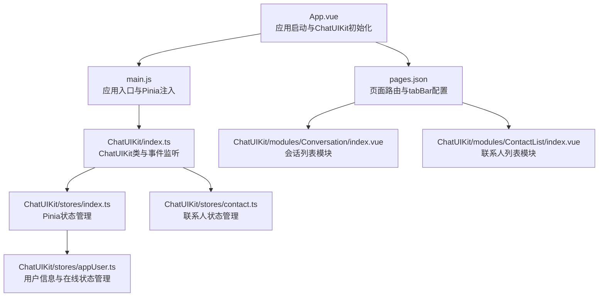
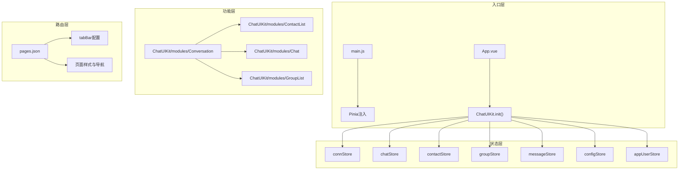
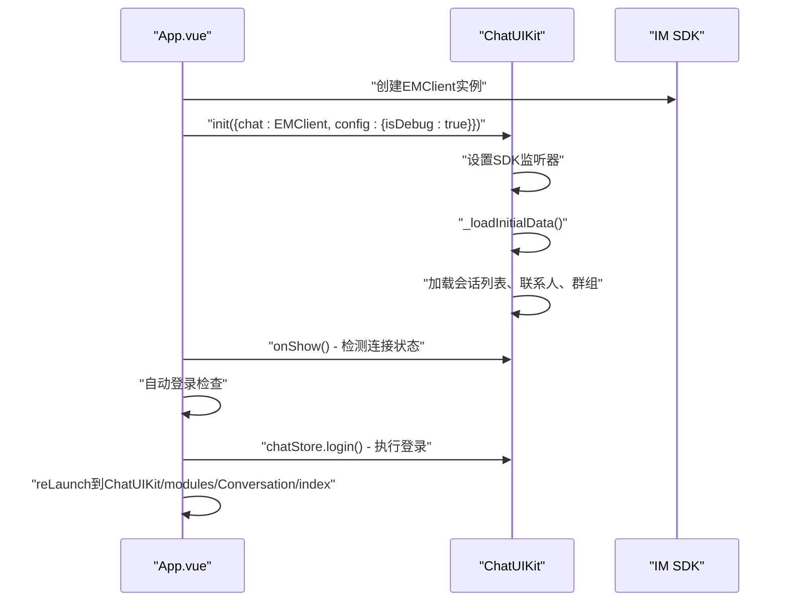
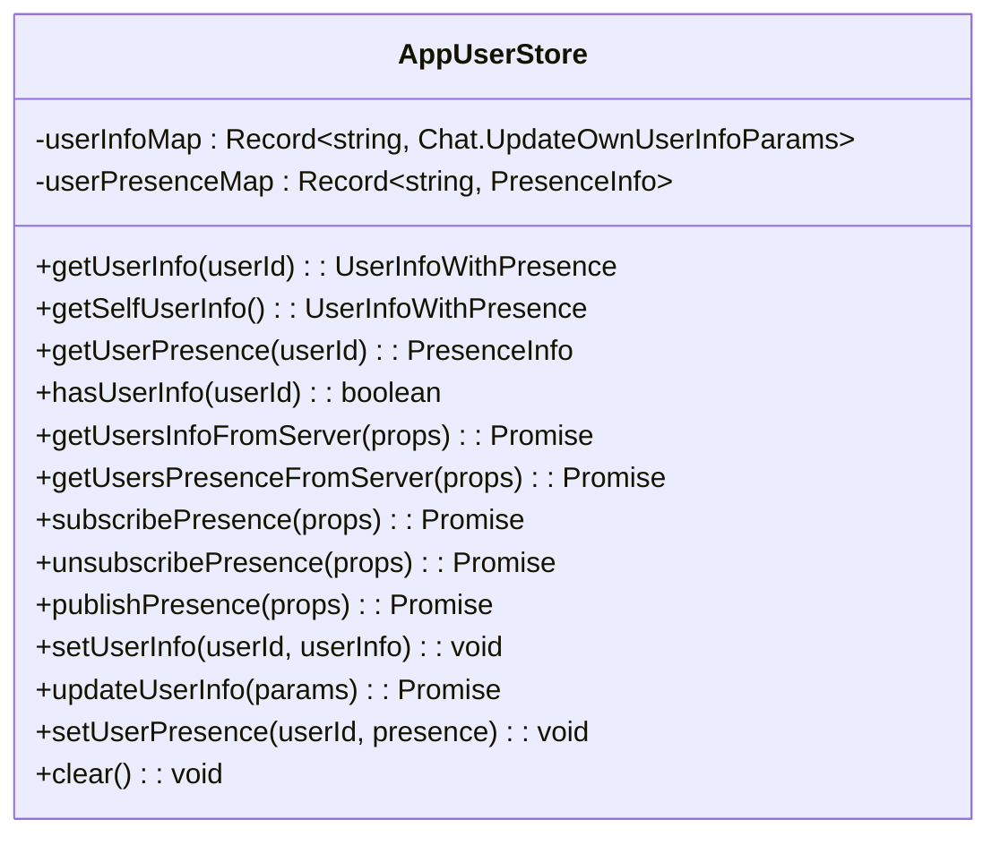
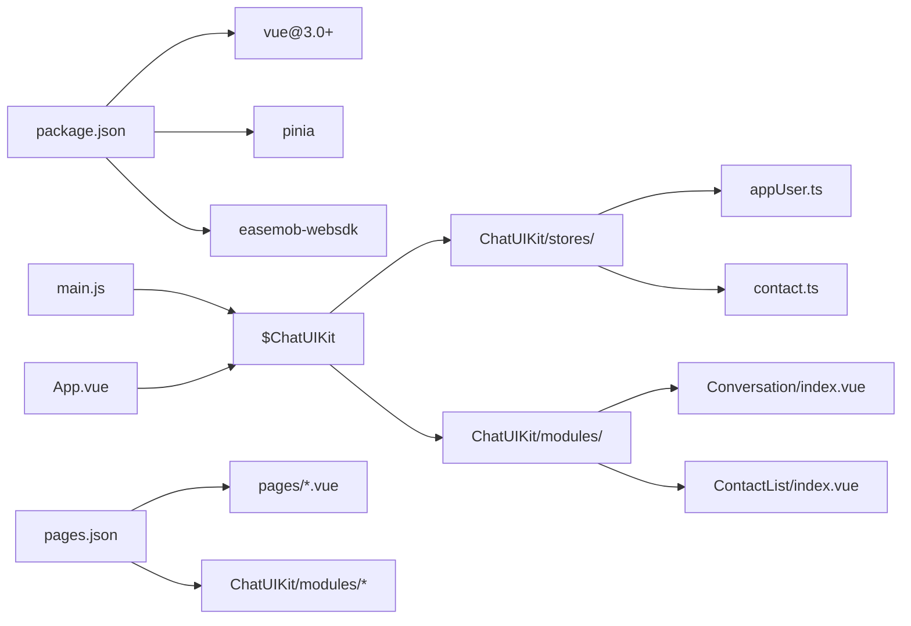

# 示例应用概览

<cite>
**本文档引用的文件**
- [demo/App.vue](file://demo/App.vue)
- [demo/main.js](file://demo/main.js)
- [demo/pages.json](file://demo/pages.json)
- [demo/pages/Login/index.vue](file://demo/pages/Login/index.vue)
- [demo/pages/Me/index.vue](file://demo/pages/Me/index.vue)
- [demo/pages/Profile/index.vue](file://demo/pages/Profile/index.vue)
- [demo/pages/PresenceSetting/index.vue](file://demo/pages/PresenceSetting/index.vue)
- [demo/ChatUIKit/index.ts](file://demo/ChatUIKit/index.ts)
- [demo/ChatUIKit/stores/index.ts](file://demo/ChatUIKit/stores/index.ts)
- [demo/ChatUIKit/stores/appUser.ts](file://demo/ChatUIKit/stores/appUser.ts)
- [demo/ChatUIKit/stores/contact.ts](file://demo/ChatUIKit/stores/contact.ts)
- [demo/ChatUIKit/modules/Conversation/index.vue](file://demo/ChatUIKit/modules/Conversation/index.vue)
- [demo/ChatUIKit/modules/ContactList/index.vue](file://demo/ChatUIKit/modules/ContactList/index.vue)
- [demo/ChatUIKit/const/index.ts](file://demo/ChatUIKit/const/index.ts)
- [demo/const/locales.ts](file://demo/const/locales.ts)
- [demo/package.json](file://demo/package.json)
</cite>

## 更新摘要
**变更内容**
- 完全移除了 wrapper page 模式，采用直接路由到 ChatUIKit 模块的统一架构
- TabBar 直接指向 ChatUIKit/modules/Conversation/index 和 ChatUIKit/modules/ContactList/index
- 简化了导航结构，去除了中间层包装页面
- 登录后直接跳转到 ChatUIKit/modules/Conversation/index

## 目录
1. [简介](#简介)
2. [项目结构](#项目结构)
3. [核心组件](#核心组件)
4. [架构总览](#架构总览)
5. [详细组件分析](#详细组件分析)
6. [依赖关系分析](#依赖关系分析)
7. [性能考虑](#性能考虑)
8. [故障排查指南](#故障排查指南)
9. [结论](#结论)
10. [附录](#附录)

## 简介
本示例应用基于 uni-app 与 ChatUIKit（环信即时通讯 Web SDK 的 UI 组件库）构建，演示了从应用启动、自动登录、全局状态管理到页面路由与 tabBar 配置的完整流程。应用通过统一入口初始化 ChatUIKit，并结合 Pinia 进行全局状态管理；页面路由由 pages.json 管理，包含 tabBar 与导航样式配置；开发环境通过 manifest.json 与 package.json 定义。**重大架构变更**：完全移除了 wrapper page 模式，采用直接路由到 ChatUIKit 模块的统一架构，TabBar 直接指向 ChatUIKit/modules/Conversation/index 和 ChatUIKit/modules/ContactList/index，简化了导航结构。

## 项目结构
示例应用位于 demo 目录，核心文件包括：
- 应用入口与启动逻辑：App.vue、main.js
- 页面路由与 tabBar：pages.json
- 页面组件：pages/ 目录下的各个页面
- ChatUIKit 核心类与状态管理：ChatUIKit/index.ts、ChatUIKit/stores/
- ChatUIKit 模块：ChatUIKit/modules/Conversation、ChatUIKit/modules/ContactList
- 依赖与脚本：package.json

**图表来源**
- [demo/App.vue:1-134](file://demo/App.vue#L1-L134)
- [demo/main.js:1-28](file://demo/main.js#L1-L28)
- [demo/ChatUIKit/index.ts:1-139](file://demo/ChatUIKit/index.ts#L1-L139)
- [demo/pages.json:1-200](file://demo/pages.json#L1-L200)
- [demo/ChatUIKit/modules/Conversation/index.vue:1-12](file://demo/ChatUIKit/modules/Conversation/index.vue#L1-L12)
- [demo/ChatUIKit/stores/index.ts:1-31](file://demo/ChatUIKit/stores/index.ts#L1-L31)

## 核心组件
- ChatUIKit 类：负责初始化 IM 连接、事件监听、初始数据加载、连接状态检测等。
- Pinia 全局状态：通过 ChatUIKit/stores/index.ts 统一管理连接、聊天、联系人、群组、消息、配置、用户信息等 Store。
- ChatUIKit 模块：直接暴露的模块组件，如 Conversation 和 ContactList，支持直接路由访问。
- 页面路由与 tabBar：通过 pages.json 统一声明，包含登录、会话、联系人、聊天、个人中心等页面。
- 自动登录流程：应用启动时检查本地存储，若存在用户凭证则直接登录并跳转会话列表。

**章节来源**
- [demo/ChatUIKit/index.ts:84-96](file://demo/ChatUIKit/index.ts#L84-L96)
- [demo/ChatUIKit/stores/index.ts:18-31](file://demo/ChatUIKit/stores/index.ts#L18-L31)
- [demo/pages.json:167-192](file://demo/pages.json#L167-L192)

## 架构总览
应用采用"入口初始化 + 统一状态管理 + ChatUIKit 模块 + 路由与平台配置"的分层架构：
- 入口层：main.js 创建应用并注入 ChatUIKit；App.vue 负责初始化 ChatUIKit、建立 IM 连接。
- 状态层：ChatUIKit 统一管理连接、聊天、联系人、群组、消息、配置、用户信息等 Store，并提供事件监听和初始数据加载。
- 功能层：直接暴露的 ChatUIKit 模块，包括会话列表、联系人列表、聊天界面等。
- 路由层：pages.json 声明页面与 tabBar，包含登录、会话、联系人、聊天、个人中心等页面。
- 配置层：ChatUIKit/const/index.ts 提供在线状态常量，const/locales.ts 提供国际化支持。

**图表来源**
- [demo/App.vue:24-32](file://demo/App.vue#L24-L32)
- [demo/ChatUIKit/index.ts:38-78](file://demo/ChatUIKit/index.ts#L38-L78)
- [demo/pages.json:167-192](file://demo/pages.json#L167-L192)

## 详细组件分析

### 应用启动与 ChatUIKit 初始化（App.vue）
- ChatUIKit 初始化：通过 ChatUIKit.init() 方法初始化 ChatUIKit，传入 EMClient 实例和配置参数。
- IM SDK 验证：检查 EMClient 是否存在，不存在则输出错误信息。
- 连接状态检测：在 onShow 生命周期中调用 ChatUIKit.onShow() 检测连接有效性。
- 群组头像管理：使用 watch 监听已加入群组列表，自动获取群组头像。
- 自动登录流程：应用启动时检查本地存储，若存在用户凭证则直接登录并跳转会话列表。

**图表来源**
- [demo/App.vue:24-32](file://demo/App.vue#L24-L32)
- [demo/App.vue:86-114](file://demo/App.vue#L86-L114)

**章节来源**
- [demo/App.vue:1-134](file://demo/App.vue#L1-L134)
- [demo/ChatUIKit/index.ts:84-96](file://demo/ChatUIKit/index.ts#L84-L96)

### 应用入口与 Pinia 注入（main.js）
- Vue 3 兼容：使用 Vue 3.0+ 版本，通过 createSSRApp 创建应用实例。
- ChatUIKit 挂载：将 ChatUIKit 实例挂载到 Vue.prototype.$ChatUIKit。
- Pinia 状态管理：导入 ChatUIKit/stores/index.ts 并在 Vue 实例中使用。
- 应用启动：创建 Vue 实例并挂载到页面。

**图表来源**
- [demo/main.js:14-27](file://demo/main.js#L14-L27)

**章节来源**
- [demo/main.js:1-28](file://demo/main.js#L1-L28)

### ChatUIKit 模块系统（Conversation 模块）
- 直接路由支持：Conversation 模块通过 ChatUIKit/modules/Conversation/index.vue 直接暴露给路由系统。
- 组件结构：模板中直接渲染 ConversationList 子组件，提供简洁的会话列表界面。
- 状态管理：使用 ChatUIKit/stores 中的状态管理器，如 useContactStore、useGroupStore 等。

**章节来源**
- [demo/ChatUIKit/modules/Conversation/index.vue:1-12](file://demo/ChatUIKit/modules/Conversation/index.vue#L1-L12)

### ChatUIKit 模块系统（ContactList 模块）
- 直接路由支持：ContactList 模块通过 ChatUIKit/modules/ContactList/index.vue 直接暴露给路由系统。
- 组件结构：模板中包含 ContactNav、IndexedList、UserItem 等子组件，提供完整的联系人列表界面。
- 状态管理：使用 ChatUIKit/stores 中的状态管理器，如 useContactStore、useGroupStore、useAppUserStore 等。
- 用户交互：支持联系人点击、滑动操作、删除联系人等交互功能。

**章节来源**
- [demo/ChatUIKit/modules/ContactList/index.vue:1-115](file://demo/ChatUIKit/modules/ContactList/index.vue#L1-L115)

### 登录页面与自动登录（pages/Login/index.vue）
- 登录方式：支持用户名密码登录和手机号验证码登录两种方式。
- 自动登录：登录成功后直接跳转到 ChatUIKit/modules/Conversation/index。
- 状态管理：使用 ChatUIKit.chatStore 进行登录操作，存储用户凭证到本地存储。

**章节来源**
- [demo/pages/Login/index.vue:165-198](file://demo/pages/Login/index.vue#L165-L198)
- [demo/pages/Login/index.vue:200-289](file://demo/pages/Login/index.vue#L200-L289)

### 页面路由与 tabBar 配置（pages.json）
- 页面声明：包含登录、会话、联系人、聊天、好友申请、群组管理、我的等页面。
- tabBar 配置：定义消息、联系人、个人中心三个 tab，分别对应 ChatUIKit/modules/Conversation/index、ChatUIKit/modules/ContactList/index、pages/Me/index。
- 导航样式：统一设置 navigationStyle 为 custom，支持自定义导航栏。
- 全局样式：设置导航栏文字颜色、标题文本与背景色。

**章节来源**
- [demo/pages.json:1-200](file://demo/pages.json#L1-L200)

### 用户信息与在线状态管理（ChatUIKit/stores/appUser.ts）
- 用户信息管理：提供用户信息的获取、设置和更新功能。
- 在线状态管理：支持用户在线状态的发布、订阅和获取。
- 状态缓存：使用 Map 结构缓存用户信息和在线状态，提高访问效率。
- 异步操作：所有网络请求都使用 async/await 处理，确保操作的原子性。

**图表来源**
- [demo/ChatUIKit/stores/appUser.ts:24-242](file://demo/ChatUIKit/stores/appUser.ts#L24-L242)

**章节来源**
- [demo/ChatUIKit/stores/appUser.ts:1-242](file://demo/ChatUIKit/stores/appUser.ts#L1-L242)

### 联系人状态管理（ChatUIKit/stores/contact.ts）
- 状态结构：包含 contacts、contactsNoticeInfo、viewedUserInfo 等状态。
- 联系人操作：提供获取联系人列表、添加联系人、删除联系人等操作。
- 好友申请：管理好友申请通知，包括添加、移除、未读数统计等功能。
- 查询功能：提供根据ID查找联系人、检查是否为好友等查询方法。

**章节来源**
- [demo/ChatUIKit/stores/contact.ts:1-282](file://demo/ChatUIKit/stores/contact.ts#L1-L282)

## 依赖关系分析
- 依赖管理：项目依赖 Vue 3.0+、Pinia、环信 Web SDK。
- 入口与状态：main.js 通过 ChatUIKit 挂载 ChatUIKit；App.vue 初始化 ChatUIKit 并建立 IM 连接。
- ChatUIKit 模块：直接暴露的模块组件，支持直接路由访问，简化了导航结构。
- 页面路由：pages.json 声明所有页面路径和 tabBar 配置。
- IM 集成：ChatUIKit/index.ts 处理 SDK 事件，stores 提供状态管理功能。

**图表来源**
- [demo/main.js:14-27](file://demo/main.js#L14-L27)
- [demo/App.vue:24-32](file://demo/App.vue#L24-L32)
- [demo/ChatUIKit/stores/index.ts:1-31](file://demo/ChatUIKit/stores/index.ts#L1-L31)
- [demo/pages.json:64-129](file://demo/pages.json#L64-L129)

**章节来源**
- [demo/main.js:1-28](file://demo/main.js#L1-L28)
- [demo/App.vue:1-134](file://demo/App.vue#L1-L134)
- [demo/ChatUIKit/stores/index.ts:1-31](file://demo/ChatUIKit/stores/index.ts#L1-L31)

## 性能考虑
- 延迟初始化 Store：避免在应用启动阶段进行大量状态初始化，减少首屏开销。
- 直接路由访问：移除 wrapper page 模式后，减少了中间层的额外开销。
- 监听策略：使用深度监听与条件过滤，仅在必要时发起网络请求。
- 页面懒加载：ChatUIKit 模块组件在路由访问时才加载数据。
- 状态缓存：Pinia 状态在内存中缓存，避免重复网络请求。
- 事件处理：ChatUIKit 统一处理 SDK 事件，减少重复监听。

## 故障排查指南
- ChatUIKit 初始化失败
  - 检查 EMClient 是否正确初始化，确认 App.vue 配置正确。
  - 确认 $ChatUIKit 实例已正确挂载到 Vue 原型。
  - 查看控制台是否有初始化错误信息。
- ChatUIKit 模块访问失败
  - 检查 pages.json 中的 ChatUIKit 模块路径配置是否正确。
  - 确认 ChatUIKit 模块文件是否存在且可访问。
  - 验证模块组件的导出和导入路径。
- 自动登录流程异常
  - 检查本地存储中的用户凭证格式是否正确。
  - 确认 ChatUIKit.chatStore.login() 方法调用是否成功。
  - 验证 reLaunch 到 ChatUIKit/modules/Conversation/index 的路径。
- 页面跳转异常
  - 核对 pages.json 中的页面路径配置。
  - 检查页面组件的 import 路径是否正确。
  - 确认 tabBar 配置的 pagePath 是否指向正确的 ChatUIKit 模块。
- 状态管理问题
  - 检查 ChatUIKit.getPinia() 是否正确返回 Pinia 实例。
  - 确认各 Store 是否正确初始化和使用。
  - 验证状态更新的异步操作处理。

**章节来源**
- [demo/App.vue:24-32](file://demo/App.vue#L24-L32)
- [demo/ChatUIKit/index.ts:127-131](file://demo/ChatUIKit/index.ts#L127-L131)
- [demo/pages.json:64-129](file://demo/pages.json#L64-L129)

## 结论
示例应用以 ChatUIKit 为核心，结合 Pinia 实现统一状态管理，采用了全新的直接路由架构。通过移除 wrapper page 模式，应用形成了更加简洁高效的导航结构，TabBar 直接指向 ChatUIKit 模块，简化了开发和维护复杂度。应用通过 pages.json 与 manifest.json 完成页面与平台配置，配合 App.vue 的启动与 ChatUIKit 初始化流程，形成一套现代化、可扩展、易维护的即时通讯应用骨架。ChatUIKit 模块系统的直接暴露为开发者提供了更灵活的集成方式，为后续的功能扩展和定制化开发奠定了良好的基础。

## 附录

### 集成步骤（将示例应用集成到现有项目）
- 准备工作
  - 安装依赖：确保项目已安装 Vue 3.0+、Pinia、环信 Web SDK。
  - 复制 ChatUIKit：将 ChatUIKit 目录复制到项目中。
- 初始化 ChatUIKit
  - 在 main.js 中导入 ChatUIKit 并挂载到 Vue.prototype。
  - 在 App.vue 中调用 ChatUIKit.init() 初始化 ChatUIKit。
  - 配置 App.vue 中的 SDK 参数。
- ChatUIKit 模块集成
  - 在 pages.json 中声明 ChatUIKit 模块路径，如 ChatUIKit/modules/Conversation/index。
  - 配置 TabBar 直接指向 ChatUIKit 模块，如 ChatUIKit/modules/ContactList/index。
  - 移除原有的 wrapper page 配置。
- 页面配置
  - 在 pages.json 中声明所有需要的页面路径。
  - 配置 tabBar，包含消息、联系人、个人中心等 tab。
  - 设置 navigationStyle 为 custom 支持自定义导航栏。
- 登录与状态
  - 在应用启动时检查登录状态，执行自动登录。
  - 在 onShow 生命周期中检测 IM 连接有效性。
  - 配置登录成功后的路由跳转到 ChatUIKit 模块。
- 开发与调试
  - 配置 App.vue 中的 SDK 调试参数。
  - 使用 isDebug 控制日志输出，便于开发调试。

**章节来源**
- [demo/main.js:14-27](file://demo/main.js#L14-L27)
- [demo/App.vue:24-32](file://demo/App.vue#L24-L32)
- [demo/pages.json:64-129](file://demo/pages.json#L64-L129)
- [demo/pages/Login/index.vue:176-187](file://demo/pages/Login/index.vue#L176-L187)