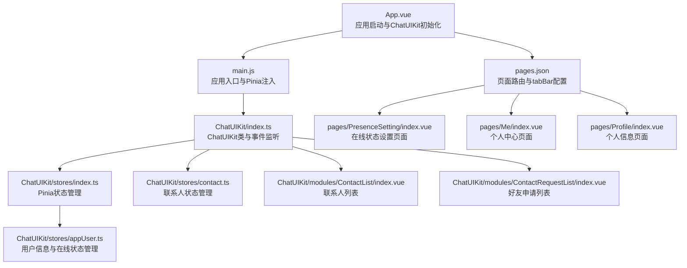
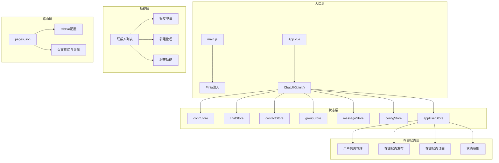
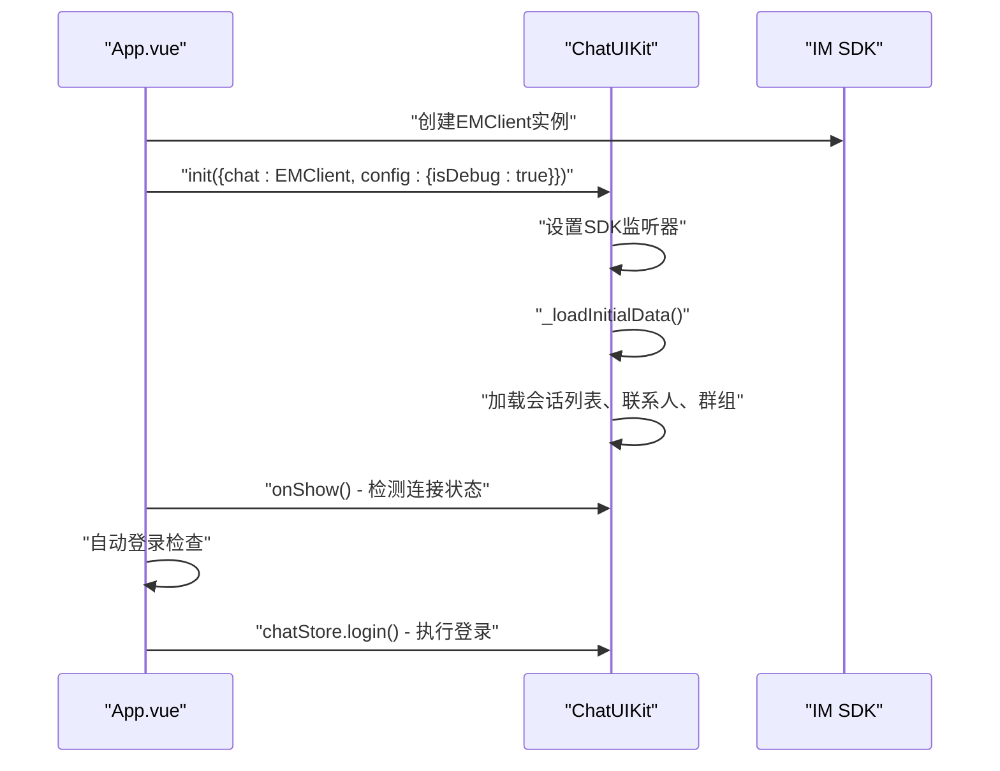
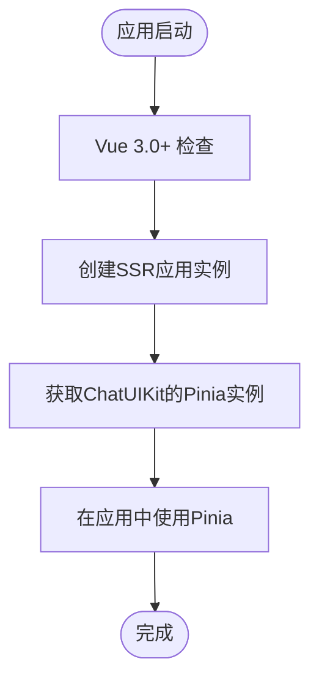
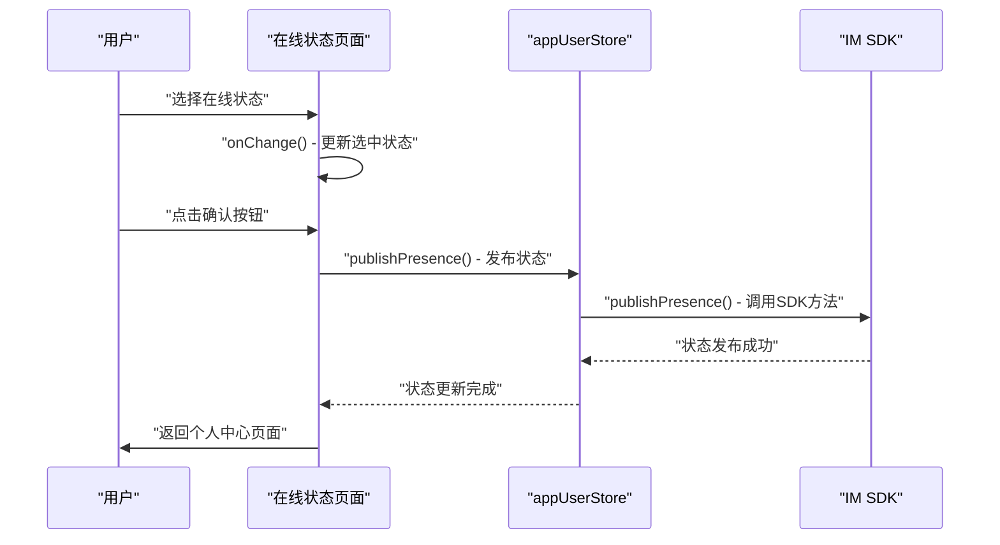
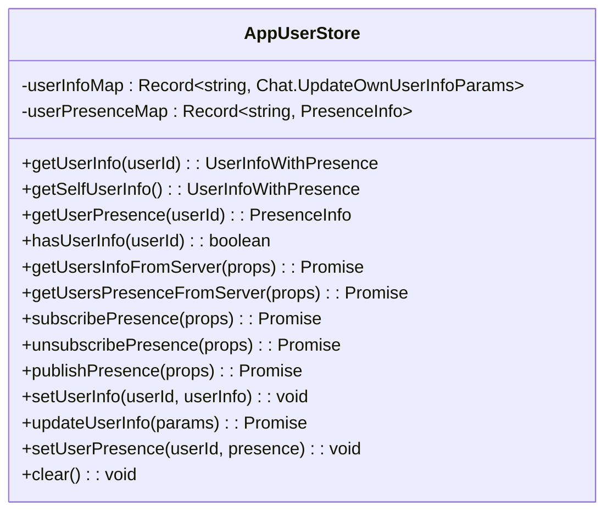
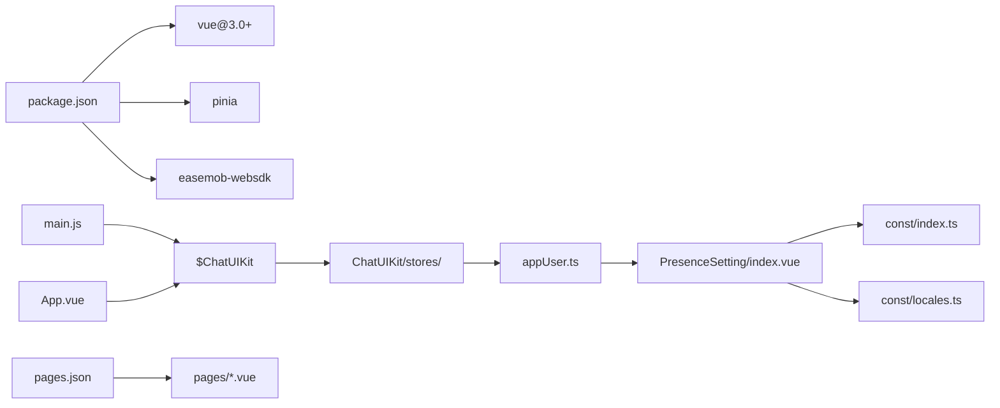

# 示例应用概览

<cite>
**本文档引用的文件**
- [demo/App.vue](file://demo/App.vue)
- [demo/main.js](file://demo/main.js)
- [demo/pages.json](file://demo/pages.json)
- [demo/pages/PresenceSetting/index.vue](file://demo/pages/PresenceSetting/index.vue)
- [demo/pages/PresenceSetting/style.scss](file://demo/pages/PresenceSetting/style.scss)
- [demo/pages/Me/index.vue](file://demo/pages/Me/index.vue)
- [demo/pages/Profile/index.vue](file://demo/pages/Profile/index.vue)
- [demo/ChatUIKit/stores/appUser.ts](file://demo/ChatUIKit/stores/appUser.ts)
- [demo/ChatUIKit/const/index.ts](file://demo/ChatUIKit/const/index.ts)
- [demo/const/locales.ts](file://demo/const/locales.ts)
- [demo/ChatUIKit/index.ts](file://demo/ChatUIKit/index.ts)
- [demo/ChatUIKit/stores/index.ts](file://demo/ChatUIKit/stores/index.ts)
- [demo/ChatUIKit/stores/contact.ts](file://demo/ChatUIKit/stores/contact.ts)
- [demo/ChatUIKit/modules/ContactList/index.vue](file://demo/ChatUIKit/modules/ContactList/index.vue)
- [demo/ChatUIKit/modules/ContactRequestList/index.vue](file://demo/ChatUIKit/modules/ContactRequestList/index.vue)
</cite>

## 更新摘要
**变更内容**
- 新增在线状态设置页面，提供完整的在线状态管理功能
- 在个人中心页面集成在线状态设置入口
- 新增在线状态常量定义和国际化支持
- 增强用户信息管理功能，支持在线状态发布和订阅

## 目录
1. [简介](#简介)
2. [项目结构](#项目结构)
3. [核心组件](#核心组件)
4. [架构总览](#架构总览)
5. [详细组件分析](#详细组件分析)
6. [依赖关系分析](#依赖关系分析)
7. [性能考虑](#性能考虑)
8. [故障排查指南](#故障排查指南)
9. [结论](#结论)
10. [附录](#附录)

## 简介
本示例应用基于 uni-app 与 ChatUIKit（环信即时通讯 Web SDK 的 UI 组件库）构建，演示了从应用启动、自动登录、全局状态管理到页面路由与 tabBar 配置的完整流程。应用通过统一入口初始化 ChatUIKit，并结合 Pinia 进行全局状态管理；页面路由由 pages.json 管理，包含 tabBar 与导航样式配置；开发环境通过 manifest.json 与 package.json 定义。**新增** 在线状态设置页面提供了完整的在线状态管理功能，包括预设状态选择、自定义状态编辑和状态发布等核心功能模块。

## 项目结构
示例应用位于 demo 目录，核心文件包括：
- 应用入口与启动逻辑：App.vue、main.js
- 页面路由与 tabBar：pages.json
- 页面组件：pages/ 目录下的各个页面，包括新增的在线状态设置页面
- ChatUIKit 核心类与状态管理：ChatUIKit/index.ts、ChatUIKit/stores/
- 在线状态管理：ChatUIKit/stores/appUser.ts、ChatUIKit/const/index.ts
- 国际化支持：const/locales.ts
- 联系人管理模块：ChatUIKit/modules/ContactList、ChatUIKit/modules/ContactRequestList
- 依赖与脚本：package.json

**图表来源**
- [demo/App.vue](file://demo/App.vue#L1-L134)
- [demo/main.js](file://demo/main.js#L1-L28)
- [demo/ChatUIKit/index.ts](file://demo/ChatUIKit/index.ts#L1-L282)
- [demo/pages.json](file://demo/pages.json#L1-L200)
- [demo/pages/PresenceSetting/index.vue](file://demo/pages/PresenceSetting/index.vue#L1-L231)
- [demo/ChatUIKit/stores/index.ts](file://demo/ChatUIKit/stores/index.ts#L1-L25)
- [demo/ChatUIKit/stores/appUser.ts](file://demo/ChatUIKit/stores/appUser.ts#L1-L242)

## 核心组件
- ChatUIKit 类：负责初始化 IM 连接、事件监听、初始数据加载、连接状态检测等。
- Pinia 全局状态：通过 ChatUIKit/stores/index.ts 统一管理连接、聊天、联系人、群组、消息、配置、用户信息等 Store。
- 在线状态管理：通过 ChatUIKit/stores/appUser.ts 管理用户信息、在线状态发布和订阅。
- 页面路由与 tabBar：通过 pages.json 统一声明，包含登录、会话、联系人、聊天、个人中心、在线状态设置等页面。
- 在线状态设置功能：完整的在线状态设置页面，支持预设状态和自定义状态管理。
- 自动登录流程：应用启动时检查本地存储，若存在用户凭证则直接登录并跳转会话列表。

**章节来源**
- [demo/ChatUIKit/index.ts](file://demo/ChatUIKit/index.ts#L19-L42)
- [demo/ChatUIKit/stores/index.ts](file://demo/ChatUIKit/stores/index.ts#L12-L21)
- [demo/ChatUIKit/stores/appUser.ts](file://demo/ChatUIKit/stores/appUser.ts#L24-L79)
- [demo/pages.json](file://demo/pages.json#L1-L200)

## 架构总览
应用采用"入口初始化 + 统一状态管理 + 在线状态管理 + 联系人管理 + 路由与平台配置"的分层架构：
- 入口层：main.js 创建应用并注入 ChatUIKit；App.vue 负责初始化 ChatUIKit、建立 IM 连接。
- 状态层：ChatUIKit 统一管理连接、聊天、联系人、群组、消息、配置、用户信息等 Store，并提供事件监听和初始数据加载。
- 在线状态层：通过 appUserStore 管理用户在线状态，支持状态发布、订阅和获取。
- 功能层：完整的联系人管理功能，包括联系人列表、好友申请、群组管理等模块。
- 路由层：pages.json 声明页面与 tabBar，包含登录、会话、联系人、聊天、个人中心、在线状态设置等页面。
- 配置层：ChatUIKit/const/index.ts 提供在线状态常量，const/locales.ts 提供国际化支持。

**图表来源**
- [demo/App.vue](file://demo/App.vue#L24-L32)
- [demo/ChatUIKit/index.ts](file://demo/ChatUIKit/index.ts#L48-L210)
- [demo/pages.json](file://demo/pages.json#L167-L192)
- [demo/ChatUIKit/stores/appUser.ts](file://demo/ChatUIKit/stores/appUser.ts#L81-L193)

## 详细组件分析

### 应用启动与 ChatUIKit 初始化（App.vue）
- ChatUIKit 初始化：通过 ChatUIKit.init() 方法初始化 ChatUIKit，传入 EMClient 实例和配置参数。
- IM SDK 验证：检查 EMClient 是否存在，不存在则输出错误信息。
- 连接状态检测：在 onShow 生命周期中调用 ChatUIKit.onShow() 检测连接有效性。
- 群组头像管理：使用 watch 监听已加入群组列表，自动获取群组头像。
- 自动登录流程：应用启动时检查本地存储，若存在用户凭证则直接登录并跳转会话列表。

**图表来源**
- [demo/App.vue](file://demo/App.vue#L14-L32)
- [demo/ChatUIKit/index.ts](file://demo/ChatUIKit/index.ts#L19-L42)
- [demo/ChatUIKit/index.ts](file://demo/ChatUIKit/index.ts#L229-L240)

**章节来源**
- [demo/App.vue](file://demo/App.vue#L1-L134)
- [demo/ChatUIKit/index.ts](file://demo/ChatUIKit/index.ts#L19-L42)

### 应用入口与 Pinia 注入（main.js）
- Vue 3 兼容：使用 Vue 3.0+ 版本，通过 createSSRApp 创建应用实例。
- ChatUIKit 挂载：将 ChatUIKit 实例挂载到 Vue.prototype.$ChatUIKit。
- Pinia 状态管理：导入 ChatUIKit/stores/index.ts 并在 Vue 实例中使用。
- 应用启动：创建 Vue 实例并挂载到页面。

**图表来源**
- [demo/main.js](file://demo/main.js#L14-L27)

**章节来源**
- [demo/main.js](file://demo/main.js#L1-L28)

### 在线状态设置页面（pages/PresenceSetting/index.vue）
- 在线状态管理：提供完整的在线状态设置界面，支持预设状态和自定义状态。
- 状态选择：使用 radio-group 实现状态选择，支持在线、离线、离开、忙碌、请勿打扰、自定义等状态。
- 自定义状态：提供输入框允许用户自定义状态描述，支持最多20个字符。
- 状态发布：通过 publishPresence 方法发布用户在线状态到服务器。
- 国际化支持：支持中英文界面切换，状态标题和提示信息国际化。

**图表来源**
- [demo/pages/PresenceSetting/index.vue](file://demo/pages/PresenceSetting/index.vue#L136-L147)
- [demo/ChatUIKit/stores/appUser.ts](file://demo/ChatUIKit/stores/appUser.ts#L187-L193)

**章节来源**
- [demo/pages/PresenceSetting/index.vue](file://demo/pages/PresenceSetting/index.vue#L1-L231)
- [demo/ChatUIKit/const/index.ts](file://demo/ChatUIKit/const/index.ts#L17-L25)
- [demo/const/locales.ts](file://demo/const/locales.ts#L56-L64)

### 个人中心页面（pages/Me/index.vue）
- 用户信息展示：显示当前登录用户的头像、昵称、用户ID等信息。
- 在线状态设置：提供在线状态设置入口，支持跳转到在线状态设置页面。
- 个人信息管理：支持跳转到个人信息页面，管理头像和昵称。
- 退出登录：提供退出登录功能，清除本地存储并重新启动应用。

**章节来源**
- [demo/pages/Me/index.vue](file://demo/pages/Me/index.vue#L1-L126)

### 个人信息页面（pages/Profile/index.vue）
- 用户信息管理：显示和管理用户的基本信息，包括头像和昵称。
- 头像上传：支持从相册选择图片并上传到服务器。
- 昵称修改：支持跳转到昵称修改页面进行昵称更改。

**章节来源**
- [demo/pages/Profile/index.vue](file://demo/pages/Profile/index.vue#L1-L117)

### 在线状态常量定义（ChatUIKit/const/index.ts）
- 在线状态列表：定义了支持的在线状态类型，包括 Online、Offline、Away、Busy、Do Not Disturb、Custom。
- 状态国际化：每个状态都有对应的国际化键值，支持中英文显示。
- 资源管理：提供用户头像和群组头像的默认URL。

**章节来源**
- [demo/ChatUIKit/const/index.ts](file://demo/ChatUIKit/const/index.ts#L17-L36)

### 用户信息与在线状态管理（ChatUIKit/stores/appUser.ts）
- 用户信息管理：提供用户信息的获取、设置和更新功能。
- 在线状态管理：支持用户在线状态的发布、订阅和获取。
- 状态缓存：使用 Map 结构缓存用户信息和在线状态，提高访问效率。
- 异步操作：所有网络请求都使用 async/await 处理，确保操作的原子性。

**图表来源**
- [demo/ChatUIKit/stores/appUser.ts](file://demo/ChatUIKit/stores/appUser.ts#L24-L242)

**章节来源**
- [demo/ChatUIKit/stores/appUser.ts](file://demo/ChatUIKit/stores/appUser.ts#L1-L242)

### 联系人管理功能（ChatUIKit/modules/ContactList/index.vue）
- 联系人列表：使用 IndexedList 组件展示联系人，支持分组和索引功能。
- 好友申请：显示未读的好友申请数量，支持跳转到申请列表。
- 群组管理：显示已加入群组数量，支持跳转到群组列表。
- 用户操作：支持删除联系人、滑动操作、点击跳转聊天等功能。
- 数据加载：在 onShow 生命周期中获取联系人列表和群组列表。

**章节来源**
- [demo/ChatUIKit/modules/ContactList/index.vue](file://demo/ChatUIKit/modules/ContactList/index.vue#L1-L148)

### 好友申请列表（ChatUIKit/modules/ContactRequestList/index.vue）
- 申请列表：展示所有的好友申请请求，过滤出 ext 为 'invited' 的请求。
- 用户信息：自动获取申请人用户信息，支持显示头像和昵称。
- 交互功能：支持同意或拒绝好友申请的操作。
- 空状态处理：当没有申请时显示 Empty 组件。

**章节来源**
- [demo/ChatUIKit/modules/ContactRequestList/index.vue](file://demo/ChatUIKit/modules/ContactRequestList/index.vue#L1-L78)

### 页面路由与 tabBar 配置（pages.json）
- 页面声明：包含登录、会话、联系人、聊天、好友申请、群组管理、我的、在线状态设置等页面。
- tabBar 配置：定义消息、联系人、个人中心三个 tab，分别对应不同的页面。
- 导航样式：统一设置 navigationStyle 为 custom，支持自定义导航栏。
- 全局样式：设置导航栏文字颜色、标题文本与背景色。

**章节来源**
- [demo/pages.json](file://demo/pages.json#L1-L200)

### 联系人状态管理（ChatUIKit/stores/contact.ts）
- 状态结构：包含 contacts、contactsNoticeInfo、viewedUserInfo 等状态。
- 联系人操作：提供获取联系人列表、添加联系人、删除联系人等操作。
- 好友申请：管理好友申请通知，包括添加、移除、未读数统计等功能。
- 查询功能：提供根据ID查找联系人、检查是否为好友等查询方法。

**章节来源**
- [demo/ChatUIKit/stores/contact.ts](file://demo/ChatUIKit/stores/contact.ts#L1-L202)

## 依赖关系分析
- 依赖管理：项目依赖 Vue 3.0+、Pinia、环信 Web SDK。
- 入口与状态：main.js 通过 ChatUIKit 挂载 ChatUIKit；App.vue 初始化 ChatUIKit 并建立 IM 连接。
- 在线状态管理：ChatUIKit/stores/appUser.ts 管理用户信息和在线状态；PresenceSetting 页面消费这些状态。
- 页面路由：pages.json 声明所有页面路径和 tabBar 配置。
- IM 集成：ChatUIKit/index.ts 处理 SDK 事件，appUserStore 提供在线状态功能。

**图表来源**
- [demo/main.js](file://demo/main.js#L14-L27)
- [demo/App.vue](file://demo/App.vue#L24-L32)
- [demo/ChatUIKit/stores/appUser.ts](file://demo/ChatUIKit/stores/appUser.ts#L1-L242)
- [demo/pages.json](file://demo/pages.json#L46-L53)

**章节来源**
- [demo/main.js](file://demo/main.js#L1-L28)
- [demo/App.vue](file://demo/App.vue#L1-L134)
- [demo/ChatUIKit/stores/appUser.ts](file://demo/ChatUIKit/stores/appUser.ts#L1-L242)

## 性能考虑
- 延迟初始化 Store：避免在应用启动阶段进行大量状态初始化，减少首屏开销。
- 监听策略：使用深度监听与条件过滤，仅在必要时发起网络请求。
- 页面懒加载：联系人列表等组件在 onShow 生命周期中才加载数据。
- 状态缓存：Pinia 状态在内存中缓存，避免重复网络请求。
- 事件处理：ChatUIKit 统一处理 SDK 事件，减少重复监听。
- 在线状态优化：使用 Map 结构缓存用户信息和在线状态，提高访问效率。

## 故障排查指南
- ChatUIKit 初始化失败
  - 检查 EMClient 是否正确初始化，确认 App.vue 配置正确。
  - 确认 $ChatUIKit 实例已正确挂载到 Vue 原型。
  - 查看控制台是否有初始化错误信息。
- 在线状态设置失败
  - 检查 appUserStore 的 publishPresence 方法是否正确调用。
  - 确认 IM 连接状态正常，检查 SDK 事件监听是否注册成功。
  - 验证在线状态常量定义是否正确。
- 联系人列表为空
  - 检查 ChatUIKit 是否正确加载初始数据。
  - 确认 IM 连接状态正常，检查 SDK 事件监听是否注册成功。
  - 验证联系人状态管理是否正确更新。
- 页面跳转异常
  - 核对 pages.json 中的页面路径配置。
  - 检查页面组件的 import 路径是否正确。
  - 确认 tabBar 配置的 pagePath 是否指向正确的页面。
- 好友申请处理失败
  - 检查联系人状态管理 actions 是否正确执行。
  - 确认 IM SDK 的 addContact、deleteContact 等方法调用是否成功。
  - 查看控制台是否有相关错误信息。

**章节来源**
- [demo/App.vue](file://demo/App.vue#L24-L32)
- [demo/ChatUIKit/index.ts](file://demo/ChatUIKit/index.ts#L48-L210)
- [demo/ChatUIKit/stores/appUser.ts](file://demo/ChatUIKit/stores/appUser.ts#L187-L193)

## 结论
示例应用以 ChatUIKit 为核心，结合 Pinia 实现统一状态管理，提供了完整的在线状态管理和联系人管理功能。应用通过 pages.json 与 manifest.json 完成页面与平台配置，配合 App.vue 的启动与 ChatUIKit 初始化流程，形成一套可扩展、易维护的即时通讯应用骨架。新增的在线状态设置页面提供了完整的在线状态管理功能，包括预设状态选择、自定义状态编辑和状态发布等核心功能，为开发者提供了完整的业务参考实现。

## 附录

### 集成步骤（将示例应用集成到现有项目）
- 准备工作
  - 安装依赖：确保项目已安装 Vue 3.0+、Pinia、环信 Web SDK。
  - 复制 ChatUIKit：将 ChatUIKit 目录复制到项目中。
- 初始化 ChatUIKit
  - 在 main.js 中导入 ChatUIKit 并挂载到 Vue.prototype。
  - 在 App.vue 中调用 ChatUIKit.init() 初始化 ChatUIKit。
  - 配置 App.vue 中的 SDK 参数。
- 在线状态管理
  - 在 pages.json 中声明在线状态设置页面路径。
  - 在个人中心页面添加在线状态设置入口。
  - 配置 ChatUIKit/stores/appUser.ts 管理在线状态。
- 页面配置
  - 在 pages.json 中声明所有需要的页面路径。
  - 配置 tabBar，包含消息、联系人、个人中心等 tab。
  - 设置 navigationStyle 为 custom 支持自定义导航栏。
- 联系人管理
  - 使用 ChatUIKit/modules/ContactList 组件实现联系人列表。
  - 使用 ChatUIKit/modules/ContactRequestList 组件实现好友申请列表。
  - 配置 ChatUIKit/stores/contact.js 管理联系人状态。
- 登录与状态
  - 在应用启动时检查登录状态，执行自动登录。
  - 在 onShow 生命周期中检测 IM 连接有效性。
- 开发与调试
  - 配置 App.vue 中的 SDK 调试参数。
  - 使用 isDebug 控制日志输出，便于开发调试。

**章节来源**
- [demo/main.js](file://demo/main.js#L14-L27)
- [demo/App.vue](file://demo/App.vue#L24-L32)
- [demo/pages.json](file://demo/pages.json#L46-L53)
- [demo/ChatUIKit/stores/appUser.ts](file://demo/ChatUIKit/stores/appUser.ts#L187-L193)
- [demo/pages/PresenceSetting/index.vue](file://demo/pages/PresenceSetting/index.vue#L136-L147)