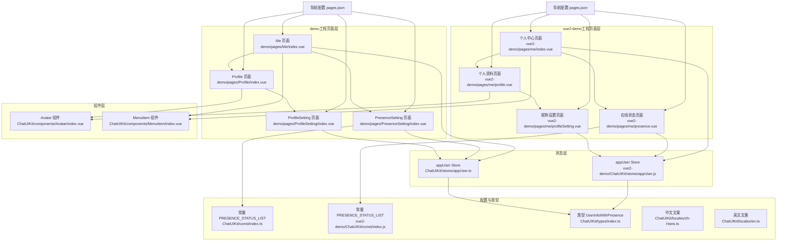
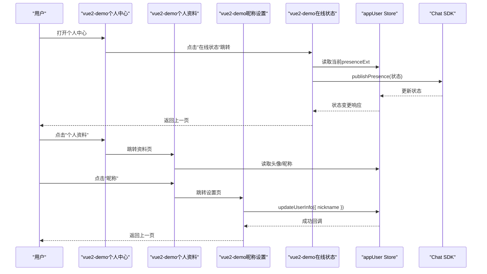
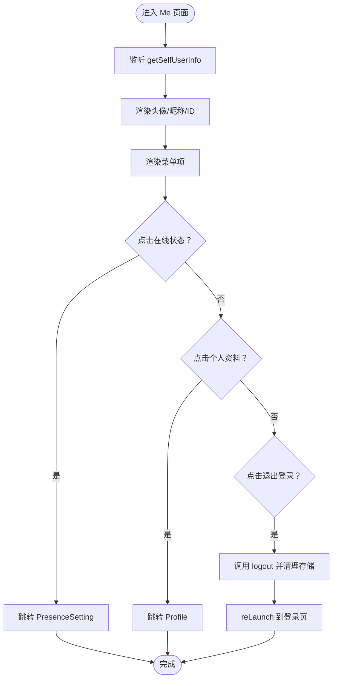
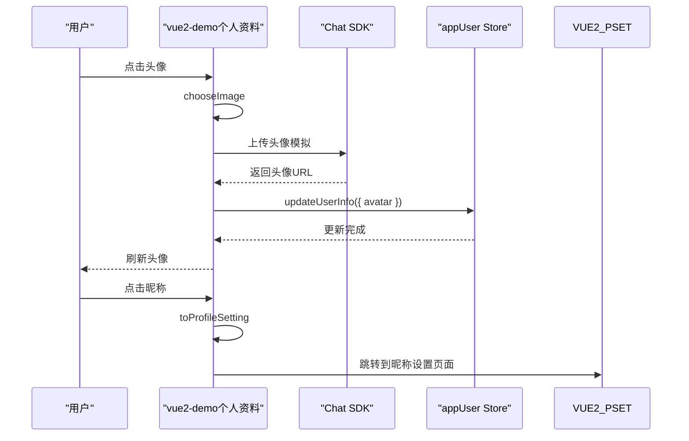
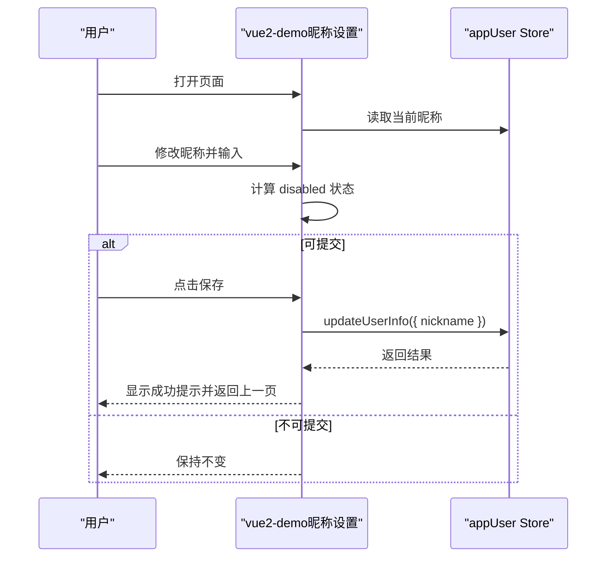
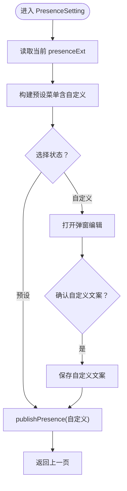
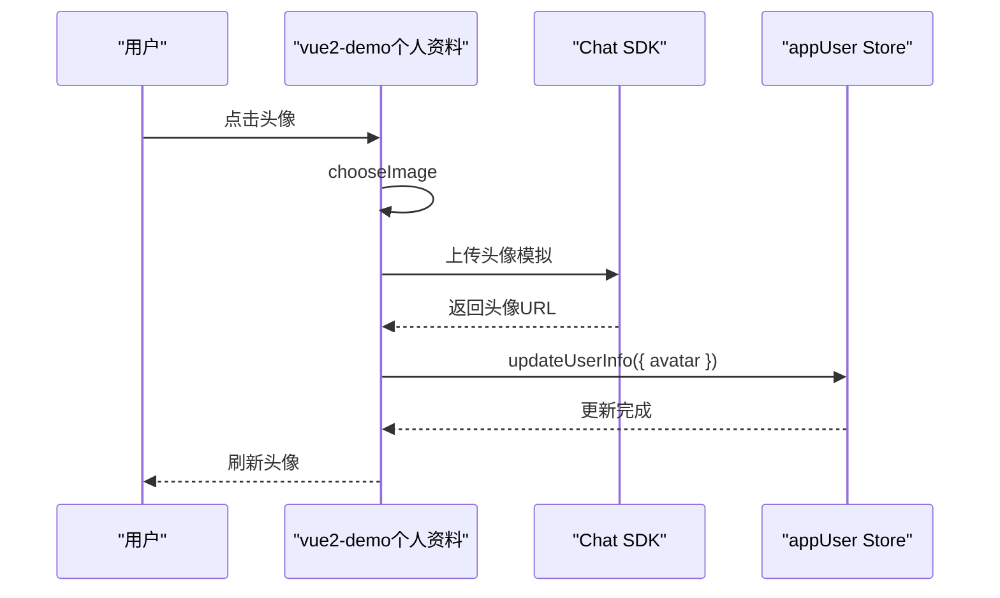
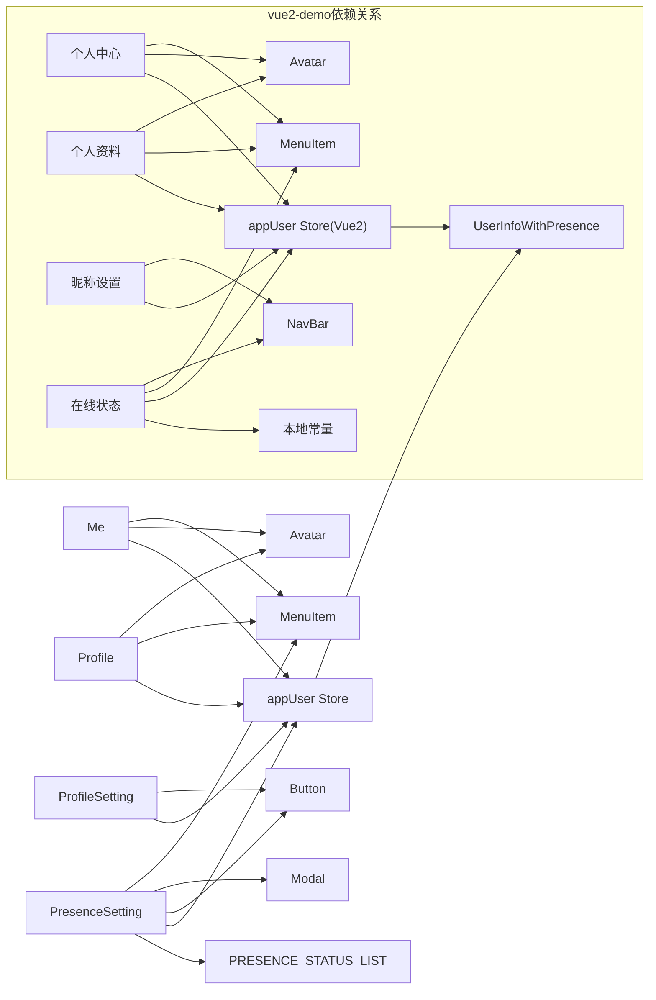

# 资料相关页面

<cite>
**本文引用的文件**
- [demo/pages/Me/index.vue](file://demo/pages/Me/index.vue)
- [demo/pages/Profile/index.vue](file://demo/pages/Profile/index.vue)
- [demo/pages/ProfileSetting/index.vue](file://demo/pages/ProfileSetting/index.vue)
- [demo/pages/PresenceSetting/index.vue](file://demo/pages/PresenceSetting/index.vue)
- [vue2-demo/pages/me/index.vue](file://vue2-demo/pages/me/index.vue)
- [vue2-demo/pages/me/profile.vue](file://vue2-demo/pages/me/profile.vue)
- [vue2-demo/pages/me/profileSetting.vue](file://vue2-demo/pages/me/profileSetting.vue)
- [vue2-demo/pages/me/presence.vue](file://vue2-demo/pages/me/presence.vue)
- [vue2-demo/ChatUIKit/components/Avatar/index.vue](file://vue2-demo/ChatUIKit/components/Avatar/index.vue)
- [vue2-demo/ChatUIKit/components/MenuItem/index.vue](file://vue2-demo/ChatUIKit/components/MenuItem/index.vue)
- [vue2-demo/ChatUIKit/stores/appUser.js](file://vue2-demo/ChatUIKit/stores/appUser.js)
- [vue2-demo/ChatUIKit/const/index.js](file://vue2-demo/ChatUIKit/const/index.js)
- [ChatUIKit/components/Avatar/index.vue](file://ChatUIKit/components/Avatar/index.vue)
- [ChatUIKit/components/MenuItem/index.vue](file://ChatUIKit/components/MenuItem/index.vue)
- [ChatUIKit/stores/appUser.ts](file://ChatUIKit/stores/appUser.ts)
- [ChatUIKit/const/index.ts](file://ChatUIKit/const/index.ts)
- [ChatUIKit/types/index.ts](file://ChatUIKit/types/index.ts)
- [ChatUIKit/locales/zh-Hans.ts](file://ChatUIKit/locales/zh-Hans.ts)
- [ChatUIKit/locales/en.ts](file://ChatUIKit/locales/en.ts)
- [demo/pages.json](file://demo/pages.json)
- [vue2-demo/pages.json](file://vue2-demo/pages.json)
- [demo/pages/Me/style.scss](file://demo/pages/Me/style.scss)
- [demo/pages/Profile/style.scss](file://demo/pages/Profile/style.scss)
- [demo/pages/ProfileSetting/style.scss](file://demo/pages/ProfileSetting/style.scss)
- [demo/pages/PresenceSetting/style.scss](file://demo/pages/PresenceSetting/style.scss)
- [vue2-demo/pages/me/index.scss](file://vue2-demo/pages/me/index.scss)
- [vue2-demo/pages/me/profile.scss](file://vue2-demo/pages/me/profile.scss)
- [vue2-demo/pages/me/profileSetting.scss](file://vue2-demo/pages/me/profileSetting.scss)
- [vue2-demo/pages/me/presence.scss](file://vue2-demo/pages/me/presence.scss)
</cite>

## 更新摘要
**变更内容**
- 新增vue2-demo版本的资料相关页面实现分析
- 更新个人资料页面功能描述，包含vue2-demo中的新实现
- 新增vue2-demo中profileSetting.vue的详细功能分析
- 更新架构总览，包含vue2-demo的实现差异
- 新增vue2-demo中的样式和组件使用情况

## 目录
1. [简介](#简介)
2. [项目结构](#项目结构)
3. [核心组件](#核心组件)
4. [架构总览](#架构总览)
5. [详细组件分析](#详细组件分析)
6. [依赖分析](#依赖分析)
7. [性能考虑](#性能考虑)
8. [故障排查指南](#故障排查指南)
9. [结论](#结论)
10. [附录](#附录)

## 简介
本文件面向"资料相关页面"的功能与实现，覆盖以下页面：
- 个人资料页面：展示头像、昵称、ID，并提供跳转入口到资料设置与在线状态设置。
- 资料设置页面：支持昵称编辑与字数限制提示。
- 在线状态设置页面：支持多种预设状态与自定义状态文案，以及发布状态。

文档将从页面结构、数据流、组件交互、状态管理、导航与参数传递、错误处理与性能优化等方面进行系统化说明，并提供可视化图示帮助理解。

**更新** 本版本同时分析了demo工程和vue2-demo两个实现版本，对比了两者的差异和特点。

## 项目结构
资料相关页面位于demo和vue2-demo两个工程中，配合ChatUIKit组件库与状态管理实现：

### demo工程结构
- 页面层：Me、Profile、ProfileSetting、PresenceSetting
- 组件层：Avatar、MenuItem
- 状态层：appUser store（用户信息与在线状态）
- 常量与类型：PRESENCE_STATUS_LIST、UserInfoWithPresence 等
- 国际化：中英文文案键值
- 导航配置：pages.json

### vue2-demo工程结构
- 页面层：index、profile、profileSetting、presence
- 组件层：Avatar、MenuItem
- 状态层：appUser store（Vue2实现）
- 常量：USER_AVATAR_URL、PRESENCE_STATUS_LIST
- 导航配置：pages.json

**图表来源**
- [demo/pages/Me/index.vue](file://demo/pages/Me/index.vue#L1-L126)
- [demo/pages/Profile/index.vue](file://demo/pages/Profile/index.vue#L1-L117)
- [demo/pages/ProfileSetting/index.vue](file://demo/pages/ProfileSetting/index.vue#L1-L101)
- [demo/pages/PresenceSetting/index.vue](file://demo/pages/PresenceSetting/index.vue#L1-L231)
- [vue2-demo/pages/me/index.vue](file://vue2-demo/pages/me/index.vue#L1-L283)
- [vue2-demo/pages/me/profile.vue](file://vue2-demo/pages/me/profile.vue#L1-L152)
- [vue2-demo/pages/me/profileSetting.vue](file://vue2-demo/pages/me/profileSetting.vue#L1-L163)
- [vue2-demo/pages/me/presence.vue](file://vue2-demo/pages/me/presence.vue#L1-L184)
- [ChatUIKit/components/Avatar/index.vue](file://ChatUIKit/components/Avatar/index.vue#L1-L188)
- [ChatUIKit/components/MenuItem/index.vue](file://ChatUIKit/components/MenuItem/index.vue#L1-L73)
- [ChatUIKit/stores/appUser.ts](file://ChatUIKit/stores/appUser.ts#L1-L242)
- [vue2-demo/ChatUIKit/stores/appUser.js](file://vue2-demo/ChatUIKit/stores/appUser.js#L1-L103)
- [ChatUIKit/const/index.ts](file://ChatUIKit/const/index.ts#L17-L25)
- [vue2-demo/ChatUIKit/const/index.js](file://vue2-demo/ChatUIKit/const/index.js#L21-L29)
- [ChatUIKit/types/index.ts](file://ChatUIKit/types/index.ts#L67-L80)
- [ChatUIKit/locales/zh-Hans.ts](file://ChatUIKit/locales/zh-Hans.ts#L83-L91)
- [ChatUIKit/locales/en.ts](file://ChatUIKit/locales/en.ts#L83-L91)
- [demo/pages.json](file://demo/pages.json#L19-L52)
- [vue2-demo/pages.json](file://vue2-demo/pages.json#L64-L98)

**章节来源**
- [demo/pages.json](file://demo/pages.json#L1-L200)
- [vue2-demo/pages.json](file://vue2-demo/pages.json#L1-L134)

## 核心组件
- 头像组件 Avatar：负责头像渲染、占位图、加载/错误状态处理，以及在线状态角标显示（当启用在线状态特性时）。
- 菜单项组件 MenuItem：用于列表菜单的左右布局与点击事件分发，作为资料页面的导航基础。

**更新** vue2-demo版本的Avatar组件增加了更多状态类别的支持，包括自定义状态。

**章节来源**
- [ChatUIKit/components/Avatar/index.vue](file://ChatUIKit/components/Avatar/index.vue#L1-L188)
- [vue2-demo/ChatUIKit/components/Avatar/index.vue](file://vue2-demo/ChatUIKit/components/Avatar/index.vue#L1-L206)
- [ChatUIKit/components/MenuItem/index.vue](file://ChatUIKit/components/MenuItem/index.vue#L1-L73)
- [vue2-demo/ChatUIKit/components/MenuItem/index.vue](file://vue2-demo/ChatUIKit/components/MenuItem/index.vue#L1-L78)

## 架构总览
资料相关页面采用"页面 + 组件 + 状态管理 + SDK"的分层架构，两个实现版本都遵循这一模式，但在具体实现上有差异：

### demo工程架构
- 页面通过ChatUIKit提供的连接与store访问用户信息与在线状态。
- 用户信息与在线状态通过appUser store管理，支持本地缓存与服务端拉取。
- 预设在线状态来源于常量列表，结合国际化文案生成菜单标题。

### vue2-demo架构
- 页面通过Vue2的Vuex store访问用户信息与在线状态。
- 用户信息通过appUser store管理，支持本地状态更新与SDK同步。
- 在线状态设置采用RadioGroup选择器，提供更直观的状态选择体验。

**图表来源**
- [vue2-demo/pages/me/index.vue](file://vue2-demo/pages/me/index.vue#L137-L141)
- [vue2-demo/pages/me/profile.vue](file://vue2-demo/pages/me/profile.vue#L79-L83)
- [vue2-demo/pages/me/profileSetting.vue](file://vue2-demo/pages/me/profileSetting.vue#L64-L90)
- [vue2-demo/pages/me/presence.vue](file://vue2-demo/pages/me/presence.vue#L86-L111)
- [vue2-demo/ChatUIKit/stores/appUser.js](file://vue2-demo/ChatUIKit/stores/appUser.js#L74-L100)

## 详细组件分析

### 个人资料页面（Me）
- 功能要点
  - 展示头像、昵称、ID；ID 支持复制。
  - 提供"在线状态""个人资料""关于"等菜单入口。
  - 登出后清理本地存储并跳转登录页。
- 数据与状态
  - 通过 watch 监听 appUserStore.getSelfUserInfo，实时更新头像、昵称、在线状态等。
  - 头像组件 Avatar 接收 isOnline 与 presenceExt，并在启用在线状态特性时显示状态角标。
- 导航与交互
  - 点击菜单项触发 uni.navigateTo 跳转至对应页面。
- 样式与图标
  - 使用静态资源图标与 SCSS 样式组织布局与配色。

**图表来源**
- [demo/pages/Me/index.vue](file://demo/pages/Me/index.vue#L63-L110)
- [ChatUIKit/components/Avatar/index.vue](file://ChatUIKit/components/Avatar/index.vue#L56-L78)
- [ChatUIKit/stores/appUser.ts](file://ChatUIKit/stores/appUser.ts#L51-L63)

**章节来源**
- [demo/pages/Me/index.vue](file://demo/pages/Me/index.vue#L1-L126)
- [demo/pages/Me/style.scss](file://demo/pages/Me/style.scss#L1-L123)
- [ChatUIKit/components/Avatar/index.vue](file://ChatUIKit/components/Avatar/index.vue#L1-L188)

### vue2-demo个人资料页面（profile.vue）
**新增** vue2-demo版本的个人资料页面实现，具有以下特点：

- 功能要点
  - 展示头像与昵称，支持头像更换和昵称设置。
  - 头像更换流程：选择图片 -> 上传 -> 更新用户信息 -> 刷新界面。
  - 昵称设置通过导航跳转到专门的设置页面。
- 头像上传
  - 使用 uni.chooseImage 选择图片，模拟上传过程。
  - 上传成功后调用 appUserStore.updateUserInfo 更新头像 URL。
- 响应式设计
  - 使用SCSS的calc函数实现动态宽度计算。
  - 支持文本截断显示，提升移动端体验。

**图表来源**
- [vue2-demo/pages/me/profile.vue](file://vue2-demo/pages/me/profile.vue#L85-L109)
- [vue2-demo/ChatUIKit/stores/appUser.js](file://vue2-demo/ChatUIKit/stores/appUser.js#L74-L100)

**章节来源**
- [vue2-demo/pages/me/profile.vue](file://vue2-demo/pages/me/profile.vue#L1-L152)
- [vue2-demo/pages/me/profile.scss](file://vue2-demo/pages/me/profile.scss#L1-L151)

### 资料设置页面（ProfileSetting）
- 功能要点
  - 文本域输入昵称，支持最大长度限制与字数统计。
  - 仅在昵称发生变化时允许提交，避免无效更新。
  - 提交后调用 appUserStore.updateUserInfo，完成后返回上一页。
- 表单设计
  - 输入框自动聚焦，便于快速编辑。
  - 底部固定按钮区域，提升移动端可用性。
- 字段验证
  - 通过计算属性 disabled 控制提交按钮可用状态。
  - 服务端返回后统一关闭页面，保证一致性。

**更新** vue2-demo版本的资料设置页面具有更完整的功能实现：

- 文本域支持自动高度调整，提升编辑体验。
- 字数统计实时显示，最大长度限制为128字符。
- 提交时显示加载状态，成功后显示Toast提示。
- 响应式设计，底部固定按钮区域适配不同屏幕尺寸。

**图表来源**
- [vue2-demo/pages/me/profileSetting.vue](file://vue2-demo/pages/me/profileSetting.vue#L64-L90)
- [vue2-demo/ChatUIKit/stores/appUser.js](file://vue2-demo/ChatUIKit/stores/appUser.js#L74-L100)

**章节来源**
- [demo/pages/ProfileSetting/index.vue](file://demo/pages/ProfileSetting/index.vue#L1-L101)
- [demo/pages/ProfileSetting/style.scss](file://demo/pages/ProfileSetting/style.scss#L1-L44)
- [vue2-demo/pages/me/profileSetting.vue](file://vue2-demo/pages/me/profileSetting.vue#L1-L163)
- [vue2-demo/pages/me/profileSetting.scss](file://vue2-demo/pages/me/profileSetting.scss#L1-L162)

### 在线状态设置页面（PresenceSetting）
- 功能要点
  - 预设状态：在线、离线、离开、忙碌、勿扰、自定义。
  - 自定义状态：弹窗输入，支持最大长度限制与字数统计。
  - 发布状态：调用 appUserStore.publishPresence，成功后返回上一页。
- 状态选择与文案
  - 通过 PRESENCE_STATUS_LIST 与国际化键映射生成菜单标题。
  - 当 presenceExt 不属于预设集合时，视为自定义状态并显示当前值。
- 图标与角标
  - Avatar 组件根据 isOnline 与 presenceExt 显示不同状态图标。

**更新** vue2-demo版本的在线状态设置页面采用RadioGroup实现：

- 使用RadioGroup组件提供更直观的状态选择体验。
- 支持状态切换的即时反馈，选中状态高亮显示。
- 底部固定按钮区域，确保操作便捷性。
- 状态文案本地化，支持中英文切换。

**图表来源**
- [demo/pages/PresenceSetting/index.vue](file://demo/pages/PresenceSetting/index.vue#L89-L151)
- [ChatUIKit/const/index.ts](file://ChatUIKit/const/index.ts#L17-L25)
- [ChatUIKit/stores/appUser.ts](file://ChatUIKit/stores/appUser.ts#L187-L193)
- [ChatUIKit/components/Avatar/index.vue](file://ChatUIKit/components/Avatar/index.vue#L60-L78)

**章节来源**
- [demo/pages/PresenceSetting/index.vue](file://demo/pages/PresenceSetting/index.vue#L1-L231)
- [demo/pages/PresenceSetting/style.scss](file://demo/pages/PresenceSetting/style.scss#L1-L13)
- [ChatUIKit/locales/zh-Hans.ts](file://ChatUIKit/locales/zh-Hans.ts#L83-L91)
- [ChatUIKit/locales/en.ts](file://ChatUIKit/locales/en.ts#L83-L91)
- [vue2-demo/pages/me/presence.vue](file://vue2-demo/pages/me/presence.vue#L1-L184)
- [vue2-demo/pages/me/presence.scss](file://vue2-demo/pages/me/presence.scss#L1-L183)

### 个人资料子页面（Profile）
- 功能要点
  - 展示头像与昵称，支持头像更换。
  - 头像更换流程：选择图片 -> 上传 -> 更新用户信息 -> 刷新界面。
- 头像上传
  - 使用 uni.chooseImage 选择图片，uni.uploadFile 上传至内部地址。
  - 上传成功后调用 appUserStore.updateUserInfo 更新头像 URL。

**更新** vue2-demo版本的个人资料页面提供了更完整的功能：

- 支持头像和昵称的双向导航。
- 使用MenuItem组件提供更好的列表交互体验。
- 响应式布局，适配不同屏幕尺寸。
- 文本截断显示，避免长昵称影响界面美观。

**图表来源**
- [demo/pages/Profile/index.vue](file://demo/pages/Profile/index.vue#L70-L92)
- [ChatUIKit/stores/appUser.ts](file://ChatUIKit/stores/appUser.ts#L207-L222)

**章节来源**
- [demo/pages/Profile/index.vue](file://demo/pages/Profile/index.vue#L1-L117)
- [demo/pages/Profile/style.scss](file://demo/pages/Profile/style.scss#L1-L5)
- [vue2-demo/pages/me/profile.vue](file://vue2-demo/pages/me/profile.vue#L1-L152)

## 依赖分析
- 页面到组件
  - Me 依赖 MenuItem、Avatar。
  - Profile 依赖 Avatar、MenuItem。
  - ProfileSetting 依赖 NavBar、Button。
  - PresenceSetting 依赖 NavBar、MenuItem、Modal、Button。
- 页面到状态
  - 所有页面均通过 ChatUIKit 访问 appUserStore 与连接状态。
- 页面到常量与类型
  - PresenceSetting 依赖 PRESENCE_STATUS_LIST 与国际化键。
  - 类型 UserInfoWithPresence 定义了头像、昵称、在线状态等字段。
- 页面到导航
  - pages.json 统一声明页面路径与导航样式。

**更新** vue2-demo版本的依赖关系：

- 页面到组件
  - vue2-demo的个人中心依赖 Avatar、MenuItem 组件。
  - vue2-demo的个人资料页面依赖 Avatar、MenuItem、NavBar 组件。
  - vue2-demo的昵称设置页面依赖 NavBar 组件。
  - vue2-demo的在线状态页面依赖 NavBar、MenuItem 组件。
- 页面到状态
  - vue2-demo使用Vue2的Vuex store，与demo版本的Pinia store形成对比。
- 页面到常量
  - vue2-demo使用本地常量定义，不依赖国际化模块。

**图表来源**
- [demo/pages/Me/index.vue](file://demo/pages/Me/index.vue#L52-L106)
- [demo/pages/Profile/index.vue](file://demo/pages/Profile/index.vue#L36-L92)
- [demo/pages/ProfileSetting/index.vue](file://demo/pages/ProfileSetting/index.vue#L28-L69)
- [demo/pages/PresenceSetting/index.vue](file://demo/pages/PresenceSetting/index.vue#L62-L151)
- [ChatUIKit/stores/appUser.ts](file://ChatUIKit/stores/appUser.ts#L30-L80)
- [ChatUIKit/const/index.ts](file://ChatUIKit/const/index.ts#L17-L25)
- [ChatUIKit/types/index.ts](file://ChatUIKit/types/index.ts#L67-L80)
- [vue2-demo/pages/me/index.vue](file://vue2-demo/pages/me/index.vue#L57-L66)
- [vue2-demo/pages/me/profile.vue](file://vue2-demo/pages/me/profile.vue#L37-L39)
- [vue2-demo/pages/me/profileSetting.vue](file://vue2-demo/pages/me/profileSetting.vue#L27)
- [vue2-demo/pages/me/presence.vue](file://vue2-demo/pages/me/presence.vue#L33-L34)
- [vue2-demo/ChatUIKit/stores/appUser.js](file://vue2-demo/ChatUIKit/stores/appUser.js#L1-L103)
- [vue2-demo/ChatUIKit/const/index.js](file://vue2-demo/ChatUIKit/const/index.js#L21-L29)

**章节来源**
- [ChatUIKit/stores/appUser.ts](file://ChatUIKit/stores/appUser.ts#L1-L242)
- [ChatUIKit/const/index.ts](file://ChatUIKit/const/index.ts#L1-L37)
- [ChatUIKit/types/index.ts](file://ChatUIKit/types/index.ts#L1-L100)
- [demo/pages.json](file://demo/pages.json#L1-L200)
- [vue2-demo/pages.json](file://vue2-demo/pages.json#L1-L134)

## 性能考虑
- 响应式与缓存
  - appUser store 使用对象缓存用户信息与在线状态，避免重复请求。
  - 仅对未缓存的用户 ID 进行服务器拉取，减少网络开销。
- 渲染优化
  - Avatar 组件在头像加载失败时使用占位图，避免闪烁。
  - Presence 角标仅在启用在线状态特性时渲染，降低 DOM 开销。
- 交互体验
  - ProfileSetting 与 PresenceSetting 采用底部固定按钮区，减少滚动与布局抖动。
  - 输入框自动聚焦，缩短用户操作路径。
- 网络与上传
  - 头像上传使用内部上传地址，减少鉴权与跨域问题。
  - 上传成功后再更新用户信息，确保状态一致。

**更新** vue2-demo版本的性能优化特点：

- Vue2的响应式系统提供更好的性能表现。
- 底部固定布局减少页面滚动时的重绘开销。
- 字数统计实时计算，避免不必要的DOM操作。
- Toast提示和加载状态提升用户体验。

[本节为通用性能建议，不直接分析具体文件]

## 故障排查指南
- 头像不显示或一直显示占位图
  - 检查头像 URL 是否有效，Avatar 组件在加载失败时会回退到占位图。
  - 确认 appUserStore.updateUserInfo 是否正确写入 avatarurl。
- 昵称无法更新
  - 确认输入值与当前昵称不同，disabled 为真时按钮不可点击。
  - 查看 updateUserInfo 返回结果，确保服务端更新成功。
- 在线状态未生效
  - 确认 publishPresence 调用成功，presenceExt 是否为预设值或自定义文案。
  - 检查 Avatar 组件的 isOnline 与 presenceExt 参数是否正确传入。
- 登出后仍显示资料
  - 确认登出流程调用了清理存储并 reLaunch 到登录页。
- 导航异常
  - 检查 pages.json 中页面路径与导航样式配置。

**更新** vue2-demo版本的故障排查：

- Vue2组件生命周期钩子执行顺序异常
- Vuex store状态更新时机问题
- RadioGroup组件状态同步问题
- Toast提示显示位置异常

**章节来源**
- [ChatUIKit/components/Avatar/index.vue](file://ChatUIKit/components/Avatar/index.vue#L89-L95)
- [ChatUIKit/stores/appUser.ts](file://ChatUIKit/stores/appUser.ts#L207-L222)
- [demo/pages/PresenceSetting/index.vue](file://demo/pages/PresenceSetting/index.vue#L136-L147)
- [demo/pages/Me/index.vue](file://demo/pages/Me/index.vue#L82-L88)
- [demo/pages.json](file://demo/pages.json#L19-L52)
- [vue2-demo/ChatUIKit/stores/appUser.js](file://vue2-demo/ChatUIKit/stores/appUser.js#L74-L100)

## 结论
资料相关页面通过清晰的页面分层、稳定的组件复用与完善的Pinia/Vuex状态管理，实现了头像上传、昵称编辑与在线状态设置的完整闭环。demo版本和vue2-demo版本都提供了完整的功能实现，但vue2-demo版本在用户体验和界面设计上更加完善。

**更新** 两个版本各有特色：demo版本展示了最新的TypeScript实现和Pinia状态管理，而vue2-demo版本则提供了更成熟的Vue2生态实现，包括完整的表单验证、响应式设计和用户体验优化。开发者可以根据项目需求选择合适的实现版本。

[本节为总结性内容，不直接分析具体文件]

## 附录

### 页面与导航
- 页面路径与样式在 pages.json 中统一声明，确保导航一致与样式可控。

**更新** 两个工程的导航配置对比：

- demo工程：包含完整的聊天、联系人、会话等功能页面。
- vue2-demo工程：专注于个人中心相关页面，结构更简洁。

**章节来源**
- [demo/pages.json](file://demo/pages.json#L1-L200)
- [vue2-demo/pages.json](file://vue2-demo/pages.json#L1-L134)

### 国际化键值参考
- 中文文案键值：个人资料、昵称、在线状态、关于等。
- 英文文案键值：与中文键值一一对应，便于多语言切换。

**更新** vue2-demo版本使用本地化实现，不依赖外部国际化模块。

**章节来源**
- [ChatUIKit/locales/zh-Hans.ts](file://ChatUIKit/locales/zh-Hans.ts#L83-L91)
- [ChatUIKit/locales/en.ts](file://ChatUIKit/locales/en.ts#L83-L91)

### 组件对比分析
**新增** 对比分析两个版本的组件实现差异：

- Avatar组件：vue2-demo版本支持更多状态类别，包括自定义状态。
- MenuItem组件：两个版本功能基本一致，样式略有差异。
- Store实现：demo版本使用TypeScript和Pinia，vue2-demo版本使用JavaScript和Vuex。

**章节来源**
- [ChatUIKit/components/Avatar/index.vue](file://ChatUIKit/components/Avatar/index.vue#L1-L188)
- [vue2-demo/ChatUIKit/components/Avatar/index.vue](file://vue2-demo/ChatUIKit/components/Avatar/index.vue#L1-L206)
- [ChatUIKit/components/MenuItem/index.vue](file://ChatUIKit/components/MenuItem/index.vue#L1-L73)
- [vue2-demo/ChatUIKit/components/MenuItem/index.vue](file://vue2-demo/ChatUIKit/components/MenuItem/index.vue#L1-L78)
- [ChatUIKit/stores/appUser.ts](file://ChatUIKit/stores/appUser.ts#L1-L242)
- [vue2-demo/ChatUIKit/stores/appUser.js](file://vue2-demo/ChatUIKit/stores/appUser.js#L1-L103)