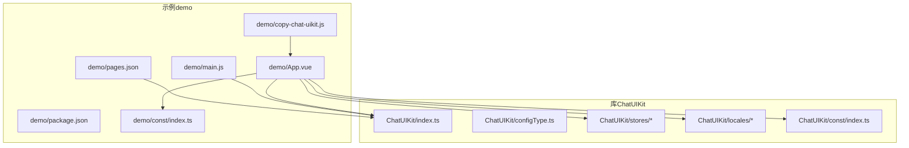
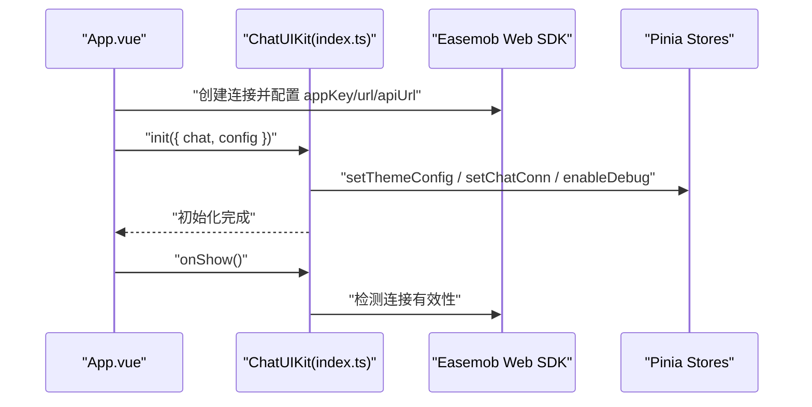
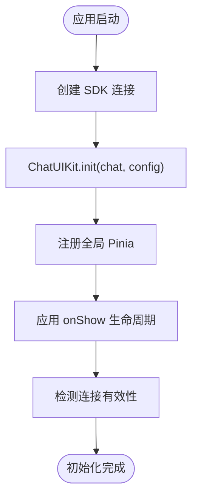
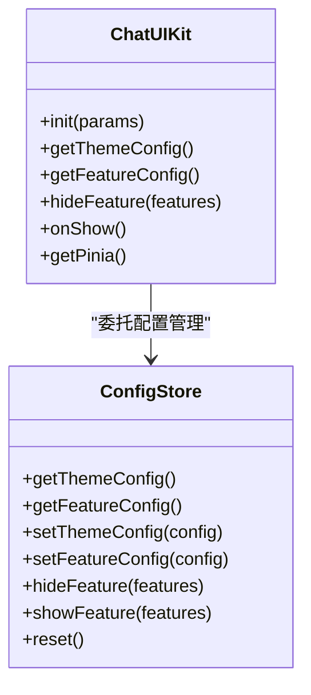
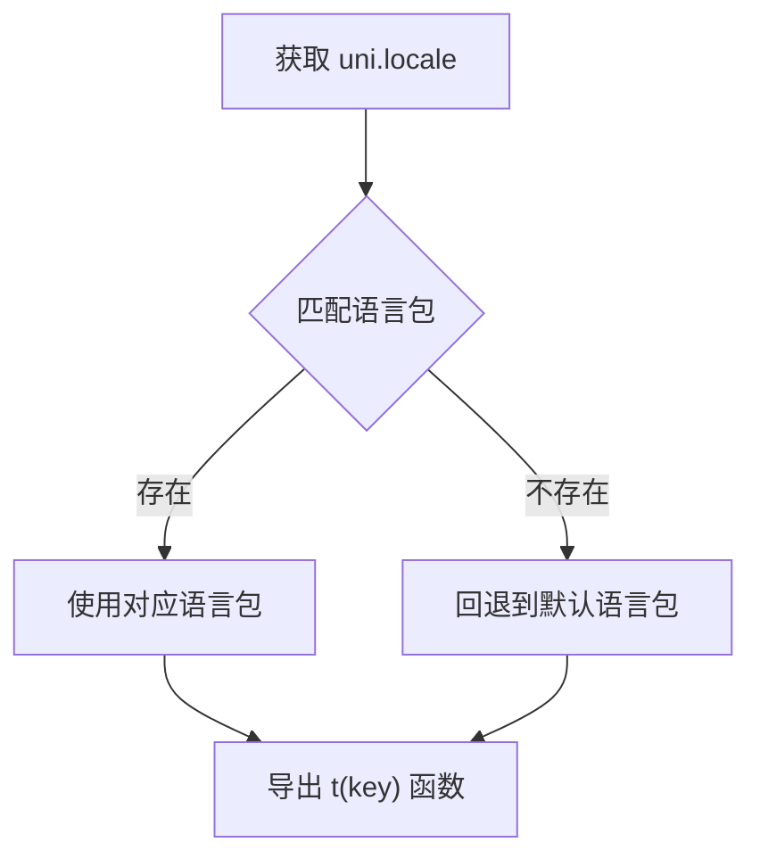
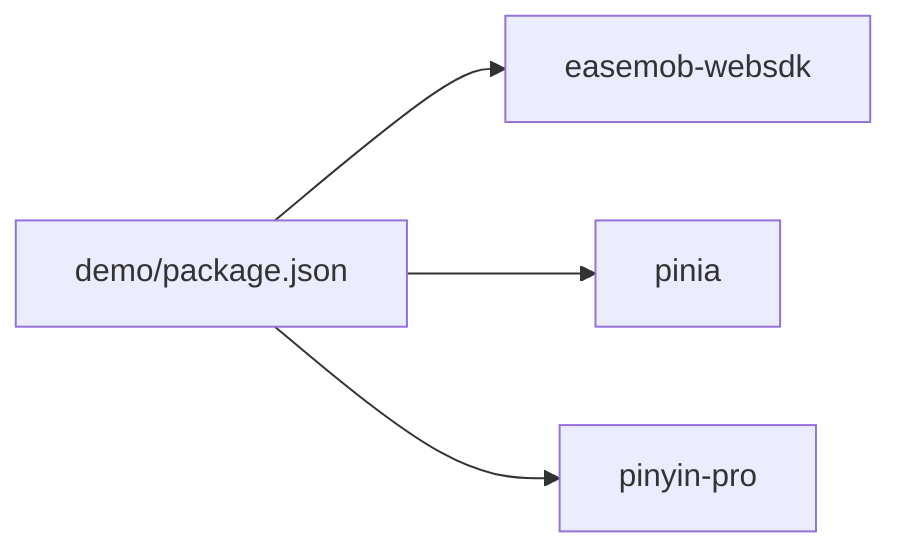

# 集成示例

<cite>
**本文引用的文件**
- [ChatUIKit/README.md](file://ChatUIKit/README.md)
- [demo/README.md](file://demo/README.md)
- [ChatUIKit/index.ts](file://ChatUIKit/index.ts)
- [ChatUIKit/configType.ts](file://ChatUIKit/configType.ts)
- [ChatUIKit/stores/config.ts](file://ChatUIKit/stores/config.ts)
- [ChatUIKit/locales/index.ts](file://ChatUIKit/locales/index.ts)
- [ChatUIKit/locales/en.ts](file://ChatUIKit/locales/en.ts)
- [ChatUIKit/locales/zh-Hans.ts](file://ChatUIKit/locales/zh-Hans.ts)
- [ChatUIKit/const/index.ts](file://ChatUIKit/const/index.ts)
- [ChatUIKit/stores/index.ts](file://ChatUIKit/stores/index.ts)
- [demo/main.js](file://demo/main.js)
- [demo/App.vue](file://demo/App.vue)
- [demo/package.json](file://demo/package.json)
- [demo/const/index.ts](file://demo/const/index.ts)
- [demo/pages.json](file://demo/pages.json)
- [demo/copy-chat-uikit.js](file://demo/copy-chat-uikit.js)
</cite>

## 目录
1. [简介](#简介)
2. [项目结构](#项目结构)
3. [核心组件](#核心组件)
4. [架构总览](#架构总览)
5. [详细组件分析](#详细组件分析)
6. [依赖分析](#依赖分析)
7. [性能考虑](#性能考虑)
8. [故障排查指南](#故障排查指南)
9. [结论](#结论)
10. [附录](#附录)

## 简介
本集成示例面向在 uni-app（Vue3）中集成环信单群聊 UIKit 的开发者，提供从安装依赖、初始化配置、平台差异适配、自定义主题与功能开关、国际化配置，到与现有项目兼容性处理、常见场景（第三方登录、推送通知、统计埋点）的集成方案与最佳实践。文档同时给出性能优化、内存管理与错误处理策略，帮助你在 H5、微信小程序、App 等多端稳定落地。

## 项目结构
该项目采用“库与示例分离”的组织方式：
- ChatUIKit：可复用的 UI 组件库与状态管理（Pinia）、国际化、常量与类型定义
- demo：基于 ChatUIKit 的示例工程，演示如何在真实项目中接入并运行

图表来源
- [ChatUIKit/index.ts](file://ChatUIKit/index.ts#L1-L139)
- [ChatUIKit/configType.ts](file://ChatUIKit/configType.ts#L1-L68)
- [ChatUIKit/stores/config.ts](file://ChatUIKit/stores/config.ts#L1-L124)
- [ChatUIKit/locales/index.ts](file://ChatUIKit/locales/index.ts#L1-L17)
- [ChatUIKit/const/index.ts](file://ChatUIKit/const/index.ts#L1-L37)
- [demo/main.js](file://demo/main.js#L1-L28)
- [demo/App.vue](file://demo/App.vue#L1-L134)
- [demo/pages.json](file://demo/pages.json#L1-L200)
- [demo/package.json](file://demo/package.json#L1-L18)
- [demo/const/index.ts](file://demo/const/index.ts#L1-L32)
- [demo/copy-chat-uikit.js](file://demo/copy-chat-uikit.js#L1-L71)

章节来源
- [ChatUIKit/README.md](file://ChatUIKit/README.md#L1-L63)
- [demo/README.md](file://demo/README.md#L1-L125)

## 核心组件
- ChatUIKit 单例与初始化：负责创建 Pinia、注入 SDK 实例、设置主题与调试开关、暴露全局 store 访问器与生命周期钩子
- 配置管理 Store：集中管理主题与功能开关，默认值与隐藏/显示能力
- 国际化：基于 uni.locale 自动选择语言，提供英文与简体中文键值映射
- 常量与资源：统一管理资源地址、最大消息数、群成员分页大小、在线状态枚举等
- 示例工程：在 App.vue 中完成 SDK 初始化与自动登录流程；在 main.js 中注入 ChatUIKit 的 Pinia 实例；pages.json 定义页面与 TabBar

章节来源
- [ChatUIKit/index.ts](file://ChatUIKit/index.ts#L1-L139)
- [ChatUIKit/stores/config.ts](file://ChatUIKit/stores/config.ts#L1-L124)
- [ChatUIKit/locales/index.ts](file://ChatUIKit/locales/index.ts#L1-L17)
- [ChatUIKit/locales/en.ts](file://ChatUIKit/locales/en.ts#L1-L154)
- [ChatUIKit/locales/zh-Hans.ts](file://ChatUIKit/locales/zh-Hans.ts#L1-L154)
- [ChatUIKit/const/index.ts](file://ChatUIKit/const/index.ts#L1-L37)
- [demo/App.vue](file://demo/App.vue#L1-L134)
- [demo/main.js](file://demo/main.js#L1-L28)
- [demo/pages.json](file://demo/pages.json#L1-L200)

## 架构总览
整体架构围绕 ChatUIKit 单例展开，示例工程通过 App.vue 创建 SDK 连接并调用 ChatUIKit.init 完成初始化；随后在页面中以模块化方式引入 ChatUIKit 的各模块（会话、聊天、联系人、群组等）。Pinia 作为全局状态容器贯穿始终，配置 Store 提供主题与功能开关的统一入口。

图表来源
- [demo/App.vue](file://demo/App.vue#L14-L32)
- [ChatUIKit/index.ts](file://ChatUIKit/index.ts#L84-L125)

## 详细组件分析

### 初始化与生命周期
- 在 App.vue 中创建 SDK 连接并调用 ChatUIKit.init，传入 SDK 实例与配置（主题、调试开关）
- 在 App.vue 的 onShow 中调用 ChatUIKit.onShow，用于在应用前台时检测连接有效性
- 在 main.js 中通过 ChatUIKit.getPinia() 注入全局 Pinia，保证与 ChatUIKit 内部状态一致

图表来源
- [demo/App.vue](file://demo/App.vue#L14-L32)
- [demo/App.vue](file://demo/App.vue#L121-L127)
- [demo/main.js](file://demo/main.js#L18-L27)
- [ChatUIKit/index.ts](file://ChatUIKit/index.ts#L84-L125)

章节来源
- [demo/App.vue](file://demo/App.vue#L14-L32)
- [demo/App.vue](file://demo/App.vue#L121-L127)
- [demo/main.js](file://demo/main.js#L18-L27)
- [ChatUIKit/index.ts](file://ChatUIKit/index.ts#L84-L125)

### 配置管理（主题与功能开关）
- 主题配置：支持头像形状等主题项，可通过 setThemeConfig 动态更新
- 功能开关：默认全部开启，可通过 hideFeature 关闭指定功能，showFeature 开启指定功能，reset 恢复默认
- 类型定义：FeatureConfig 与 ThemeConfig 在 configType.ts 中定义，便于 IDE 提示与约束

图表来源
- [ChatUIKit/stores/config.ts](file://ChatUIKit/stores/config.ts#L59-L123)
- [ChatUIKit/index.ts](file://ChatUIKit/index.ts#L84-L131)
- [ChatUIKit/configType.ts](file://ChatUIKit/configType.ts#L3-L67)

章节来源
- [ChatUIKit/stores/config.ts](file://ChatUIKit/stores/config.ts#L1-L124)
- [ChatUIKit/configType.ts](file://ChatUIKit/configType.ts#L1-L68)
- [ChatUIKit/index.ts](file://ChatUIKit/index.ts#L84-L131)

### 国际化
- 自动语言选择：根据 uni.getLocale() 选择对应语言包
- 键值映射：英文与简体中文分别提供完整键值集合
- 使用方式：在组件中通过 t(key) 获取本地化文本

图表来源
- [ChatUIKit/locales/index.ts](file://ChatUIKit/locales/index.ts#L9-L17)
- [ChatUIKit/locales/en.ts](file://ChatUIKit/locales/en.ts#L1-L154)
- [ChatUIKit/locales/zh-Hans.ts](file://ChatUIKit/locales/zh-Hans.ts#L1-L154)

章节来源
- [ChatUIKit/locales/index.ts](file://ChatUIKit/locales/index.ts#L1-L17)
- [ChatUIKit/locales/en.ts](file://ChatUIKit/locales/en.ts#L1-L154)
- [ChatUIKit/locales/zh-Hans.ts](file://ChatUIKit/locales/zh-Hans.ts#L1-L154)

### 平台差异与页面跳转
- 页面跳转方式：ChatUIKit 默认使用 uni.redirectTo；示例项目因采用 TabBar，使用 uni.switchTab 切换 Tab 页面
- 可选跳转方法：navigateTo、redirectTo、switchTab、reLaunch，需根据业务架构选择
- 平台差异：示例 pages.json 对微信小程序做了特殊配置（如禁用滚动）

章节来源
- [demo/README.md](file://demo/README.md#L38-L53)
- [demo/pages.json](file://demo/pages.json#L76-L82)

### 资源与静态资产
- 资源地址：默认指向环信演示 OSS，建议替换为自有服务器地址
- 更新方式：修改 ChatUIKit/const/index.ts 中的 ASSETS_URL

章节来源
- [ChatUIKit/README.md](file://ChatUIKit/README.md#L56-L58)
- [ChatUIKit/const/index.ts](file://ChatUIKit/const/index.ts#L7-L8)

### 示例工程集成步骤
- 安装依赖：在 demo 目录执行依赖安装
- 获取 AppKey 与服务地址：在环信控制台获取并写入 demo/const/index.ts
- 运行示例：通过 HBuilderX 选择平台运行
- 源码复制：使用 npm run copy:uikit 将根目录 ChatUIKit 复制到 demo（注意覆盖风险）

章节来源
- [demo/README.md](file://demo/README.md#L21-L105)
- [demo/const/index.ts](file://demo/const/index.ts#L4-L10)
- [demo/copy-chat-uikit.js](file://demo/copy-chat-uikit.js#L1-L71)

## 依赖分析
- 核心依赖：easemob-websdk（IM SDK）、pinia（状态管理）、pinyin-pro（拼音工具）
- 版本与兼容性：示例工程使用 pinia^2.1.7，确保与 Vue3 生态兼容

图表来源
- [demo/package.json](file://demo/package.json#L12-L16)

章节来源
- [demo/package.json](file://demo/package.json#L1-L18)

## 性能考虑
- 资源加载：将 ChatUIKit/assets 资源迁移到自有服务器，降低外部依赖与访问频率限制带来的影响
- 消息上限：单会话最大消息数限制可避免内存膨胀，结合分页加载策略
- 状态管理：Pinia 替代 MobX 后，减少 autorun 带来的副作用，配合 watch 精准监听
- 页面跳转：在 TabBar 架构中优先使用 switchTab，减少页面栈深度
- 图片/视频/文件：按需加载与懒加载，避免一次性渲染过多媒体资源

章节来源
- [ChatUIKit/README.md](file://ChatUIKit/README.md#L56-L58)
- [ChatUIKit/const/index.ts](file://ChatUIKit/const/index.ts#L14-L15)
- [demo/pages.json](file://demo/pages.json#L167-L192)

## 故障排查指南
- 初始化失败
  - 检查 AppKey、API 地址、WebSocket 地址是否正确
  - 确认 ChatUIKit.init 已在 SDK 连接创建之后调用
- 登录与自动登录
  - 检查本地存储是否存在用户信息，确保 token 有效
  - 如无缓存，走正常登录流程后再 reLaunch 到会话列表
- 页面跳转异常
  - TabBar 页面必须使用 switchTab；非 Tab 页面可使用 redirectTo/navigateTo
- 资源加载失败
  - 替换 ASSETS_URL 为自有服务器地址
- 国际化不生效
  - 确认 uni.locale 设置正确，语言包键值完整

章节来源
- [demo/App.vue](file://demo/App.vue#L86-L114)
- [demo/README.md](file://demo/README.md#L38-L53)
- [ChatUIKit/const/index.ts](file://ChatUIKit/const/index.ts#L7-L8)

## 结论
通过本集成示例，你可以在 uni-app（Vue3）中快速接入环信单群聊 UIKit，并在多端（H5、小程序、App）稳定运行。建议优先完成资源迁移、配置初始化与国际化校验，再按需调整主题与功能开关。对于复杂业务场景，可结合第三方登录、推送与埋点进行扩展，同时关注性能与内存管理，确保用户体验与稳定性。

## 附录

### 常见集成场景与最佳实践
- 第三方登录
  - 在登录成功后，调用 ChatUIKit.chatStore.login 完成 IM 登录
  - 将用户 token 缓存到本地存储，实现自动登录
- 推送通知
  - App.vue 的 onShow 中调用 ChatUIKit.onShow，保持连接有效性
  - 平台推送由各自渠道处理，IM 层维持连接状态
- 统计埋点
  - 在关键页面（会话列表、聊天页、联系人页）埋点
  - 在功能开关变更（如 hideFeature/showFeature）时记录行为

章节来源
- [demo/App.vue](file://demo/App.vue#L103-L106)
- [ChatUIKit/index.ts](file://ChatUIKit/index.ts#L114-L125)
- [ChatUIKit/stores/config.ts](file://ChatUIKit/stores/config.ts#L97-L113)

### 自定义主题与功能开关示例路径
- 主题配置：在 ChatUIKit.init 的 config.theme 中设置
- 功能开关：通过 ChatUIKit.hideFeature 或 ChatUIKit.showFeature 控制
- 默认配置：参考 stores/config.ts 中的默认值

章节来源
- [ChatUIKit/index.ts](file://ChatUIKit/index.ts#L84-L96)
- [ChatUIKit/stores/config.ts](file://ChatUIKit/stores/config.ts#L19-L57)
- [ChatUIKit/stores/config.ts](file://ChatUIKit/stores/config.ts#L97-L113)

### 国际化配置示例路径
- 语言选择逻辑：locales/index.ts
- 英文键值：locales/en.ts
- 中文键值：locales/zh-Hans.ts

章节来源
- [ChatUIKit/locales/index.ts](file://ChatUIKit/locales/index.ts#L1-L17)
- [ChatUIKit/locales/en.ts](file://ChatUIKit/locales/en.ts#L1-L154)
- [ChatUIKit/locales/zh-Hans.ts](file://ChatUIKit/locales/zh-Hans.ts#L1-L154)