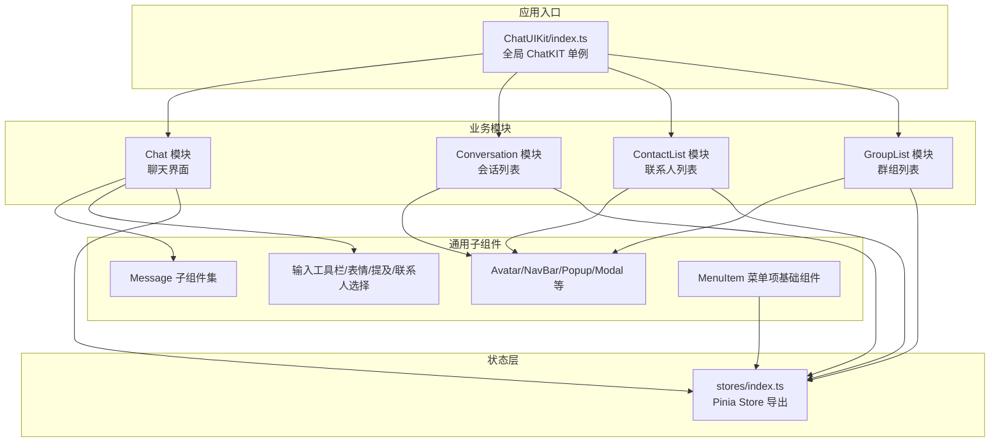
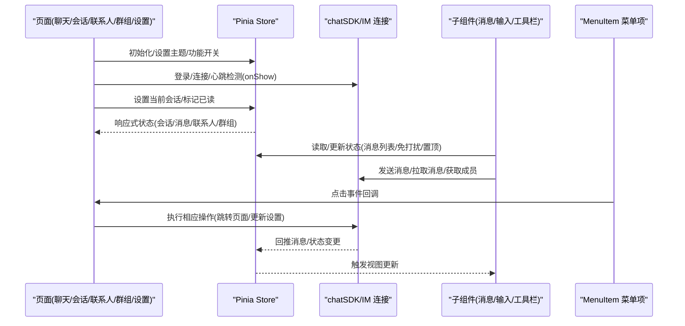
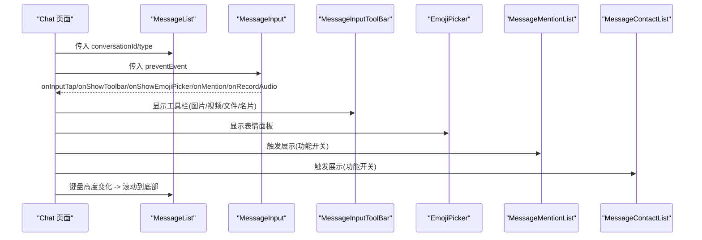
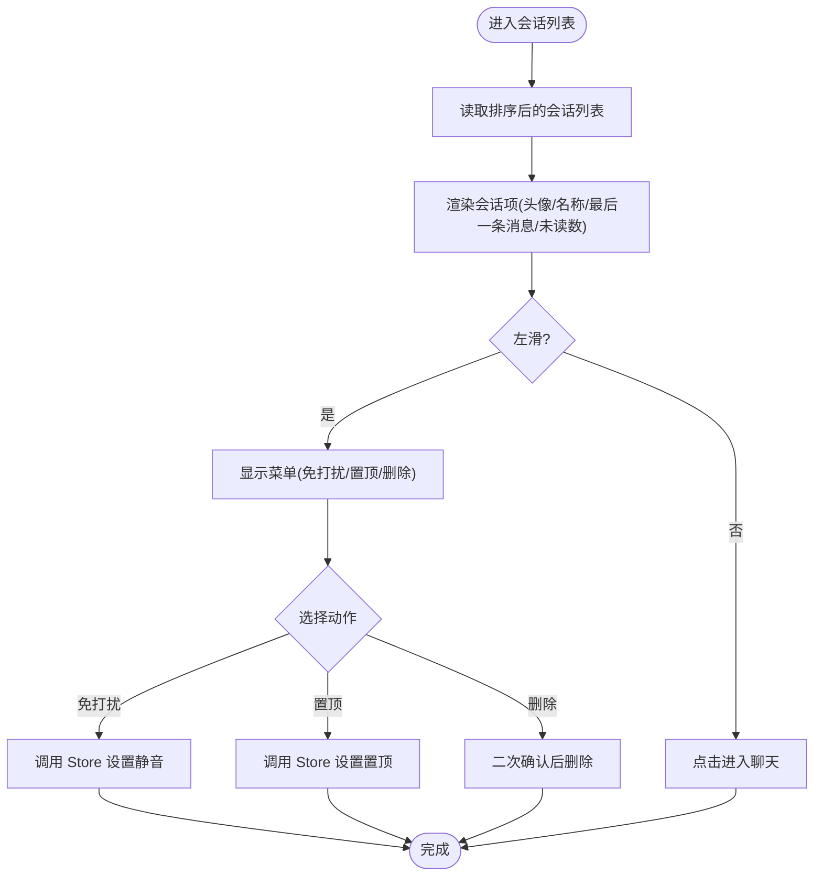
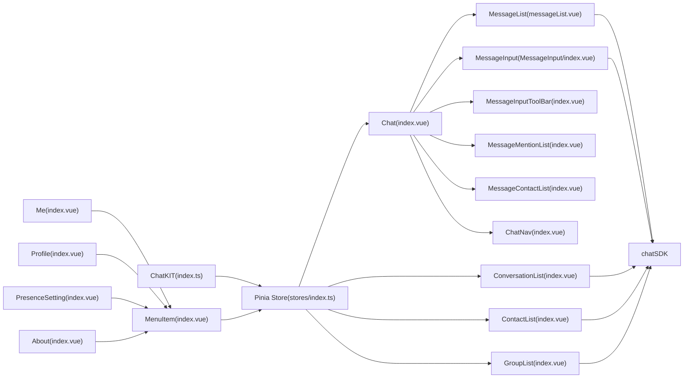

# 业务组件

<cite>
**本文引用的文件**
- [ChatUIKit/index.ts](file://ChatUIKit/index.ts)
- [Chat/index.vue](file://ChatUIKit/modules/Chat/index.vue)
- [Conversation/index.vue](file://ChatUIKit/modules/Conversation/index.vue)
- [ConversationList/index.vue](file://ChatUIKit/modules/Conversation/components/ConversationList/index.vue)
- [ConversationItem/index.vue](file://ChatUIKit/modules/Conversation/components/ConversationItem/index.vue)
- [ContactList/index.vue](file://ChatUIKit/modules/ContactList/index.vue)
- [GroupList/index.vue](file://ChatUIKit/modules/GroupList/index.vue)
- [ChatNav/index.vue](file://ChatUIKit/modules/Chat/components/ChatNav/index.vue)
- [messageList.vue](file://ChatUIKit/modules/Chat/components/Message/messageList.vue)
- [MessageInput/index.vue](file://ChatUIKit/modules/Chat/components/MessageInput/index.vue)
- [MessageInputToolBar/index.vue](file://ChatUIKit/modules/Chat/components/MessageInputToolBar/index.vue)
- [messageItem.vue](file://ChatUIKit/modules/Chat/components/Message/messageItem.vue)
- [MessageContactList/index.vue](file://ChatUIKit/modules/Chat/components/MessageContactList/index.vue)
- [MessageMentionList/index.vue](file://ChatUIKit/modules/Chat/components/MessageMentionList/index.vue)
- [MenuItem/index.vue](file://ChatUIKit/components/MenuItem/index.vue)
- [MenuItem/index.vue](file://ChatUIKit-vue2/components/MenuItem/index.vue)
- [Me/index.vue](file://demo/pages/Me/index.vue)
- [Profile/index.vue](file://demo/pages/Profile/index.vue)
- [ProfileSetting/index.vue](file://demo/pages/ProfileSetting/index.vue)
- [PresenceSetting/index.vue](file://demo/pages/PresenceSetting/index.vue)
- [About/index.vue](file://demo/pages/About/index.vue)
- [stores/index.ts](file://ChatUIKit/stores/index.ts)
</cite>

## 更新摘要
**所做更改**
- 新增 MenuItem 组件章节，详细说明菜单项基础组件的设计与实现
- 更新设置页和列表页章节，反映 MenuItem 组件的统一使用
- 增加 MenuItem 组件在实际业务场景中的应用示例
- 完善组件间的协作关系和数据传递机制

## 目录
1. [引言](#引言)
2. [项目结构](#项目结构)
3. [核心组件](#核心组件)
4. [架构总览](#架构总览)
5. [详细组件分析](#详细组件分析)
6. [依赖分析](#依赖分析)
7. [性能考量](#性能考量)
8. [故障排查指南](#故障排查指南)
9. [结论](#结论)
10. [附录](#附录)

## 引言
本文件系统化梳理并文档化 Easemob UIKit 中与业务强相关的组件：聊天界面、会话列表、联系人列表、群组列表等。内容覆盖设计原理、实现细节、数据流与状态管理、用户交互模式、组件间协作与数据传递、配置与扩展点、生命周期与错误处理、多平台适配与兼容性建议，并提供可操作的使用示例与集成方案。

**更新** 新增 MenuItem 组件章节，为设置页和列表页提供统一的菜单项基础组件，提升组件复用性和一致性。

## 项目结构
该仓库采用模块化组织方式，业务组件集中在 ChatUIKit/modules 下，按功能域划分模块（Chat、Conversation、ContactList、GroupList 等），每个模块内部再细分子组件（如 Chat 模块下的 Message、MessageInput、MessageInputToolBar 等）。状态管理统一通过 Pinia Store 提供，入口位于 stores/index.ts。



**图表来源**
- [ChatUIKit/index.ts](file://ChatUIKit/index.ts#L1-L139)
- [stores/index.ts](file://ChatUIKit/stores/index.ts#L1-L31)

**章节来源**
- [ChatUIKit/index.ts](file://ChatUIKit/index.ts#L1-L139)
- [stores/index.ts](file://ChatUIKit/stores/index.ts#L1-L31)

## 核心组件
- 聊天界面组件：负责渲染消息列表、输入区、工具栏、表情选择、提及列表、用户名片等，承载消息发送、历史拉取、键盘高度适配、引用回复等交互。
- 会话列表组件：展示最近会话，支持置顶、免打扰、删除、左滑菜单、搜索跳转等。
- 联系人列表组件：展示联系人、请求计数、分组计数，支持单击进入聊天、左滑删除、新请求跳转。
- 群组列表组件：展示已加入群组，支持点击进入群聊、空态处理。
- **菜单项组件（MenuItem）**：为设置页和列表页提供统一的菜单项基础组件，支持标题显示、箭头指示、左右插槽自定义内容。

**更新** 新增菜单项组件，作为设置页和列表页的基础组件，提供统一的交互体验和样式规范。

**章节来源**
- [Chat/index.vue](file://ChatUIKit/modules/Chat/index.vue#L1-L261)
- [ConversationList/index.vue](file://ChatUIKit/modules/Conversation/components/ConversationList/index.vue#L1-L158)
- [ContactList/index.vue](file://ChatUIKit/modules/ContactList/index.vue#L1-L115)
- [GroupList/index.vue](file://ChatUIKit/modules/GroupList/index.vue#L1-L66)
- [MenuItem/index.vue](file://ChatUIKit/components/MenuItem/index.vue#L1-L73)

## 架构总览
组件间通过 Pinia Store 进行状态共享与通信，页面通过 onLoad/onUnload 生命周期与 uni-app 事件绑定解绑，组件内部通过 provide/inject 传递上下文事件（如输入工具栏事件）。MenuItem 组件作为基础组件，被广泛应用于设置页和列表页中。



**图表来源**
- [ChatUIKit/index.ts](file://ChatUIKit/index.ts#L84-L125)
- [Chat/index.vue](file://ChatUIKit/modules/Chat/index.vue#L233-L251)
- [messageList.vue](file://ChatUIKit/modules/Chat/components/Message/messageList.vue#L117-L134)
- [MessageInput/index.vue](file://ChatUIKit/modules/Chat/components/MessageInput/index.vue#L137-L189)

## 详细组件分析

### 菜单项组件（MenuItem）
**职责与特性**
- 作为设置页和列表页的基础菜单项组件，提供统一的交互体验
- 支持标题显示、右侧箭头指示、左右插槽自定义内容
- 提供点击事件回调，支持禁用箭头显示
- 具备默认的样式规范和交互反馈效果

**数据流与状态管理**
- 接收标题文本和箭头显示状态属性
- 通过点击事件向父组件传递交互信号
- 不直接参与业务状态管理，专注于界面展示和用户交互

**用户交互模式**
- 点击整个菜单区域触发点击事件
- 左侧插槽用于显示图标或其他装饰元素
- 右侧插槽用于显示详情内容或操作按钮
- 可通过属性控制是否显示右侧箭头

**章节来源**
- [MenuItem/index.vue](file://ChatUIKit/components/MenuItem/index.vue#L1-L73)
- [MenuItem/index.vue](file://ChatUIKit-vue2/components/MenuItem/index.vue#L1-L78)

### 聊天界面组件（Chat）
职责与特性
- 渲染聊天导航、消息列表、输入区、工具栏、表情选择器、提及列表、用户名片弹窗。
- 处理键盘高度变化、遮罩层关闭、编辑态消息遮罩、引用回复聚焦。
- 通过 provide/inject 向子组件传递输入工具栏事件（如关闭工具栏）。
- 生命周期内完成当前会话标记已读、清理引用/编辑态、监听键盘高度变化。

数据流与状态管理
- 从 Pinia Store 读取当前会话、消息列表、功能配置；向 Store 写入编辑态消息、引用消息、发送消息。
- 通过 uni.on/offKeyboardHeightChange 绑定/解绑键盘事件，动态调整布局与滚动。

用户交互模式
- 点击输入区聚焦；点击工具栏/表情切换显隐；@ 触发提及列表；名片按钮触发联系人选择。
- 长按消息弹出操作菜单；点击消息气泡跳转到指定消息定位。

组件协作
- Chat -> MessageList：传入会话标识，驱动消息列表渲染与历史拉取。
- Chat -> MessageInput：传入事件防抖参数，接收输入焦点控制、提及/表情/录音回调。
- Chat -> MessageInputToolBar/EmojiPicker/MentionList/ContactList：条件渲染与事件联动。
- Chat -> MessageQuotePanel/MessageEdit：编辑态与引用态的遮罩与定位。



**图表来源**
- [Chat/index.vue](file://ChatUIKit/modules/Chat/index.vue#L138-L168)
- [MessageInput/index.vue](file://ChatUIKit/modules/Chat/components/MessageInput/index.vue#L119-L135)
- [MessageInputToolBar/index.vue](file://ChatUIKit/modules/Chat/components/MessageInputToolBar/index.vue#L1-L69)
- [messageList.vue](file://ChatUIKit/modules/Chat/components/Message/messageList.vue#L100-L115)

**章节来源**
- [Chat/index.vue](file://ChatUIKit/modules/Chat/index.vue#L1-L261)

### 会话列表组件（ConversationList）
职责与特性
- 展示会话列表，支持搜索跳转、空态提示、导航占位适配小程序。
- 支持左滑菜单：免打扰、置顶、删除（二次确认）。
- 会话项根据类型（单聊/群聊）动态拼装头像与名称，显示未读数与提醒标签。

数据流与状态管理
- 从 Pinia Store 读取排序后的会话列表；对会话进行静音、置顶、删除等操作写回 Store。
- 通过 computed 直接引用 Store 状态，避免深拷贝与手动订阅。

用户交互模式
- 点击进入聊天；左滑显示菜单；点击菜单项触发对应动作。



**图表来源**
- [ConversationList/index.vue](file://ChatUIKit/modules/Conversation/components/ConversationList/index.vue#L49-L97)
- [ConversationItem/index.vue](file://ChatUIKit/modules/Conversation/components/ConversationItem/index.vue#L154-L192)

**章节来源**
- [ConversationList/index.vue](file://ChatUIKit/modules/Conversation/components/ConversationList/index.vue#L1-L158)
- [ConversationItem/index.vue](file://ChatUIKit/modules/Conversation/components/ConversationItem/index.vue#L1-L260)

### 联系人列表组件（ContactList）
职责与特性
- 展示联系人列表，支持分组与请求计数；支持左滑删除联系人；点击进入单聊。
- 将联系人信息与用户信息合并，形成渲染所需字段。

数据流与状态管理
- 从 Pinia Store 读取联系人列表与群组数量；删除联系人通过 Store 调用 SDK 并反馈结果。

用户交互模式
- 点击联系人进入聊天；左滑删除并弹出 Toast；点击"群组"跳转群组列表；点击"新请求"跳转请求列表。

**章节来源**
- [ContactList/index.vue](file://ChatUIKit/modules/ContactList/index.vue#L1-L115)

### 群组列表组件（GroupList）
职责与特性
- 展示已加入群组，空态显示 Empty；点击进入群聊。

数据流与状态管理
- 从 Pinia Store 读取已加入群组列表；点击群组携带 groupId 进入聊天页面。

用户交互模式
- 点击群组进入群聊；返回上一页。

**章节来源**
- [GroupList/index.vue](file://ChatUIKit/modules/GroupList/index.vue#L1-L66)

### 聊天导航组件（ChatNav）
职责与特性
- 渲染聊天顶部导航，显示对方头像与名称；单聊时显示在线状态与状态扩展。
- 在挂载时按需拉取与订阅在线状态，在卸载时取消订阅。

数据流与状态管理
- 从 Pinia Store 读取当前会话信息，根据会话类型选择用户或群组信息源。

用户交互模式
- 点击左侧返回上一页。

**章节来源**
- [ChatNav/index.vue](file://ChatUIKit/modules/Chat/components/ChatNav/index.vue#L1-L127)

### 消息列表组件（MessageList）
职责与特性
- 渲染消息列表，支持历史消息分页加载、加载中动画、无更多消息提示、消息闪烁定位。
- 自动滚动到底部，首次渲染与新增消息时平滑过渡。

数据流与状态管理
- 通过 computed 读取指定会话的消息列表；通过 Store 的历史消息接口进行分页加载；维护当前可视第一条消息 ID 以保证滚动锚定。

用户交互模式
- 点击"查看更多"加载历史；长按消息选中；点击消息气泡跳转到指定消息。

**章节来源**
- [messageList.vue](file://ChatUIKit/modules/Chat/components/Message/messageList.vue#L1-L284)

### 消息输入组件（MessageInput）
职责与特性
- 文本输入、发送、表情、工具栏、语音录制（按平台权限申请）、@ 提及（仅群聊）。
- 支持引用消息扩展、@ 全体成员标记、发送后清空输入与提及列表。

数据流与状态管理
- 从 Pinia Store 读取功能开关、当前会话、自身用户信息；通过 chatSDK 创建文本消息并调用 Store 发送。

用户交互模式
- 输入 @ 触发展示提及列表；点击工具栏按钮显示图片/视频/文件/名片；点击发送触发消息发送流程。

**章节来源**
- [MessageInput/index.vue](file://ChatUIKit/modules/Chat/components/MessageInput/index.vue#L1-L217)

### 输入工具栏组件（MessageInputToolBar）
职责与特性
- 提供图片/视频/文件/名片等快捷入口，按功能开关与平台能力显示。

数据流与状态管理
- 通过 Pinia Store 读取功能开关；向父组件暴露名片按钮事件。

用户交互模式
- 点击名片按钮向上抛出事件。

**章节来源**
- [MessageInputToolBar/index.vue](file://ChatUIKit/modules/Chat/components/MessageInputToolBar/index.vue#L1-L69)

### 消息项组件（MessageItem）
职责与特性
- 渲染不同类型消息（文本/图片/视频/音频/文件/自定义名片），支持长按消息弹出操作菜单、消息状态指示、引用消息预览、昵称显示等。
- 根据消息方向（自己/他人）切换气泡样式与头像位置。

数据流与状态管理
- 从 Pinia Store 读取用户信息、连接信息、功能开关；通过工具类格式化时间与消息摘要。

用户交互模式
- 长按消息触发选中与操作菜单；点击引用消息跳转到目标消息。

**章节来源**
- [messageItem.vue](file://ChatUIKit/modules/Chat/components/Message/messageItem.vue#L1-L264)

### 提及人员列表（MessageMentionList）
职责与特性
- 展示群成员列表，支持分页加载、@全体成员、过滤当前用户、弹窗选择。

数据流与状态管理
- 从 Pinia Store 读取当前会话群组 ID，分页拉取群成员；通过常量与资源路径拼接头像。

用户交互模式
- 点击成员或@全体触发选择并关闭弹窗。

**章节来源**
- [MessageMentionList/index.vue](file://ChatUIKit/modules/Chat/components/MessageMentionList/index.vue#L1-L158)

### 用户名片选择（MessageContactList）
职责与特性
- 弹窗展示联系人列表，支持索引列表渲染、选择后回调父组件。

数据流与状态管理
- 从 Pinia Store 读取联系人列表并合并用户信息；通过 Popup 组件控制显隐。

用户交互模式
- 点击联系人触发选择并关闭弹窗。

**章节来源**
- [MessageContactList/index.vue](file://ChatUIKit/modules/Chat/components/MessageContactList/index.vue#L1-L123)

### 设置页组件（Me）
**职责与特性**
- 展示用户个人信息和设置选项，使用 MenuItem 组件构建统一的菜单项列表。
- 支持在线状态设置、个人资料修改、关于页面跳转等功能。
- 通过 MenuItem 组件实现统一的点击交互和样式规范。

**数据流与状态管理**
- 从 ChatUIKit.appUserStore 读取用户信息；通过 MenuItem 的点击事件触发相应操作。
- 支持用户信息的实时更新和状态同步。

**用户交互模式**
- 点击菜单项跳转到对应的设置页面或执行相应操作。
- 支持复制用户 ID、退出登录等操作。

**章节来源**
- [Me/index.vue](file://demo/pages/Me/index.vue#L1-L126)

### 个人资料组件（Profile）
**职责与特性**
- 展示和编辑用户个人资料，使用 MenuItem 组件构建菜单项。
- 支持头像更换和个人信息编辑功能。
- 通过 MenuItem 组件实现统一的交互体验。

**数据流与状态管理**
- 从 ChatUIKit.appUserStore 读取用户信息；支持头像上传和信息更新。
- 通过 MenuItem 的点击事件触发相应的操作流程。

**用户交互模式**
- 点击头像菜单项进行头像更换。
- 点击昵称菜单项跳转到个人资料设置页面。

**章节来源**
- [Profile/index.vue](file://demo/pages/Profile/index.vue#L1-L117)

### 个人资料设置组件（ProfileSetting）
**职责与特性**
- 提供个人资料编辑界面，支持昵称修改和保存功能。
- 使用 MenuItem 组件构建设置项，提供统一的交互体验。

**数据流与状态管理**
- 从 ChatUIKit.appUserStore 读取用户信息并进行编辑。
- 支持实时验证和保存操作。

**用户交互模式**
- 编辑昵称内容，支持字数统计。
- 点击保存按钮提交修改。

**章节来源**
- [ProfileSetting/index.vue](file://demo/pages/ProfileSetting/index.vue#L1-L101)

### 在线状态设置组件（PresenceSetting）
**职责与特性**
- 提供在线状态设置界面，使用 MenuItem 组件构建状态选项。
- 支持多种预设状态和自定义状态设置。
- 通过 MenuItem 组件实现状态选择和编辑功能。

**数据流与状态管理**
- 从 ChatUIKit.appUserStore 读取当前状态信息。
- 支持状态发布和更新操作。

**用户交互模式**
- 选择预设状态或自定义状态。
- 点击编辑按钮进行自定义状态设置。
- 点击确认按钮发布状态。

**章节来源**
- [PresenceSetting/index.vue](file://demo/pages/PresenceSetting/index.vue#L1-L231)

### 关于页面组件（About）
**职责与特性**
- 展示应用相关信息和链接，使用 MenuItem 组件构建信息列表。
- 支持官方网站跳转和联系方式复制功能。
- 通过 MenuItem 组件实现统一的信息展示和交互。

**数据流与状态管理**
- 使用静态数据构建菜单项列表。
- 通过 MenuItem 的点击事件处理不同的操作。

**用户交互模式**
- 点击菜单项进行网站跳转或联系方式复制。
- 支持不同平台的打开方式适配。

**章节来源**
- [About/index.vue](file://demo/pages/About/index.vue#L1-L101)

## 依赖分析
- ChatKIT 全局单例负责初始化 Pinia、设置主题与功能配置、提供 IM 连接与 onShow 生命周期检测。
- 各模块组件通过 useXxxStore() 访问 Store，Store 通过 chatSDK 与 IM 服务交互。
- 组件间通过 props/emits 与 provide/inject 传递数据与事件，减少耦合。
- **MenuItem 组件作为基础组件，被设置页和列表页广泛使用，提供统一的交互体验。**



**图表来源**
- [ChatUIKit/index.ts](file://ChatUIKit/index.ts#L84-L125)
- [stores/index.ts](file://ChatUIKit/stores/index.ts#L1-L31)
- [Chat/index.vue](file://ChatUIKit/modules/Chat/index.vue#L74-L95)
- [Me/index.vue](file://demo/pages/Me/index.vue#L24-L42)
- [Profile/index.vue](file://demo/pages/Profile/index.vue#L9-L32)
- [PresenceSetting/index.vue](file://demo/pages/PresenceSetting/index.vue#L21-L29)
- [About/index.vue](file://demo/pages/About/index.vue#L20-L32)

**章节来源**
- [ChatUIKit/index.ts](file://ChatUIKit/index.ts#L1-L139)
- [stores/index.ts](file://ChatUIKit/stores/index.ts#L1-L31)

## 性能考量
- 响应式优先：大量使用 computed 直接引用 Store 状态，避免 autorun 与深拷贝，降低重渲染成本。
- 懒加载与分页：消息列表按需加载历史消息，滚动锚定当前可视消息，减少 DOM 重建。
- 动画与过渡：首次渲染与新增消息时使用微小延时与透明度过渡，提升视觉稳定性。
- 平台差异：针对不同平台（APP/H5/小程序）在消息历史加载与滚动锚定上采用条件编译，确保一致性与性能。
- 事件绑定：在 onLoad/onUnload 中绑定/解绑键盘事件，避免内存泄漏与重复监听。
- **MenuItem 组件优化：使用插槽机制减少不必要的 DOM 结构，通过属性控制箭头显示，提升渲染性能。**

**章节来源**
- [messageList.vue](file://ChatUIKit/modules/Chat/components/Message/messageList.vue#L100-L134)
- [Chat/index.vue](file://ChatUIKit/modules/Chat/index.vue#L244-L251)
- [MenuItem/index.vue](file://ChatUIKit/components/MenuItem/index.vue#L35-L73)

## 故障排查指南
常见问题与处理
- 发送消息失败：检查网络与 IM 连接状态；查看发送异常 Toast；必要时重试或检查权限（如录音权限）。
- 历史消息不显示：确认会话标识正确；检查 Store 中是否已拉取过历史；观察"无更多消息"与加载动画状态。
- 键盘遮挡输入框：确认 onKeyboardHeightChange 事件绑定与解绑逻辑；检查布局计算与滚动锚定。
- 提及/名片弹窗无法显示：确认功能开关开启；检查当前会话类型（群聊才显示提及）；确认弹窗组件显隐方法调用。
- 在线状态不更新：确认 ChatNav 中 presence 开关与订阅/取消订阅逻辑；检查用户 ID 有效性。
- **MenuItem 点击事件无效：检查组件是否正确导入和注册；确认事件监听器是否正确绑定；验证父组件的事件处理函数。**
- **MenuItem 样式显示异常：检查 CSS 类名是否正确；确认 SCSS 变量和主题配置；验证插槽内容的样式覆盖。**

**章节来源**
- [MessageInput/index.vue](file://ChatUIKit/modules/Chat/components/MessageInput/index.vue#L183-L188)
- [messageList.vue](file://ChatUIKit/modules/Chat/components/Message/messageList.vue#L136-L172)
- [ChatNav/index.vue](file://ChatUIKit/modules/Chat/components/ChatNav/index.vue#L82-L103)
- [MenuItem/index.vue](file://ChatUIKit/components/MenuItem/index.vue#L17-L34)

## 结论
该业务组件体系以模块化与 Pinia 状态管理为核心，围绕聊天、会话、联系人、群组四大场景构建，具备清晰的数据流与良好的扩展性。通过 computed 响应式与平台差异化适配，兼顾性能与用户体验。**新增的 MenuItem 组件为设置页和列表页提供了统一的菜单项基础，提升了组件复用性和一致性，简化了开发流程。** 建议在集成时关注功能开关、权限申请与生命周期事件绑定，确保跨平台一致表现。

## 附录

### 使用示例与集成方案
- 初始化与主题配置
  - 在应用入口调用 ChatKIT.init，传入 chat 参数与 config（含 theme 与 isDebug）。
  - 通过 ChatKIT.getThemeConfig/getFeatureConfig 获取配置，按需隐藏功能。
- 页面路由集成
  - 会话列表：导航至 Conversation/index.vue。
  - 聊天页面：携带 type 与 id 参数，如 /ChatUIKit/modules/Chat/index?type=groupChat&id=xxx。
  - 联系人/群组：分别导航至 ContactList/index.vue 与 GroupList/index.vue。
  - **设置页：使用 MenuItem 组件构建菜单项，支持统一的点击交互和样式。**
- 生命周期与连接检测
  - 在应用 onShow 中调用 ChatKIT.onShow，检测 IM 连接有效性。

**更新** 新增 MenuItem 组件的使用示例，展示其在设置页和列表页中的统一应用。

**章节来源**
- [ChatUIKit/index.ts](file://ChatUIKit/index.ts#L84-L125)
- [Conversation/index.vue](file://ChatUIKit/modules/Conversation/index.vue#L1-L12)
- [Chat/index.vue](file://ChatUIKit/modules/Chat/index.vue#L233-L246)
- [Me/index.vue](file://demo/pages/Me/index.vue#L24-L42)

### 配置选项与扩展点
- 主题与功能开关
  - 通过 ChatKIT.getFeatureConfig 控制各功能（如免打扰、置顶、文件/图片/视频/名片、消息状态、@ 提及、在线状态等）。
- 平台能力
  - 针对 APP/H5/小程序/WEB 的能力差异，组件内部已做条件编译处理（如录音权限、文件上传、滚动锚定）。
- 自定义能力
  - 可通过主题配置与功能开关定制 UI 与行为；若需扩展消息类型，可在 MessageItem 中增加对应渲染组件并在 MessageInput 中扩展发送逻辑。
  - **MenuItem 组件支持通过插槽自定义左右内容，可通过属性控制箭头显示，满足不同场景需求。**

**更新** 新增 MenuItem 组件的配置选项说明，包括插槽使用和属性控制。

**章节来源**
- [ChatUIKit/index.ts](file://ChatUIKit/index.ts#L103-L113)
- [MessageInput/index.vue](file://ChatUIKit/modules/Chat/components/MessageInput/index.vue#L1-L217)
- [messageItem.vue](file://ChatUIKit/modules/Chat/components/Message/messageItem.vue#L1-L264)
- [MenuItem/index.vue](file://ChatUIKit/components/MenuItem/index.vue#L24-L33)

### 生命周期与错误处理机制
- 生命周期
  - Chat：onLoad 设置当前会话；onMounted 标记已读；onUnload 解绑键盘事件与清理状态。
  - ChatNav：onMounted 订阅在线状态；onUnmounted 取消订阅。
  - MessageList：onMounted 首次拉取历史；watch 监听消息长度变化自动滚动。
  - **MenuItem：组件本身无复杂生命周期，主要负责事件传递和样式渲染。**
- 错误处理
  - 发送失败弹出 Toast；历史加载异常恢复状态；键盘事件绑定/解绑在卸载时执行。
  - **MenuItem 点击事件错误：检查事件监听器绑定，确保父组件正确处理点击回调。**

**更新** 新增 MenuItem 组件的生命周期说明和错误处理机制。

**章节来源**
- [Chat/index.vue](file://ChatUIKit/modules/Chat/index.vue#L213-L251)
- [ChatNav/index.vue](file://ChatUIKit/modules/Chat/components/ChatNav/index.vue#L82-L103)
- [messageList.vue](file://ChatUIKit/modules/Chat/components/Message/messageList.vue#L169-L172)
- [MenuItem/index.vue](file://ChatUIKit/components/MenuItem/index.vue#L17-L34)

### MenuItem 组件详细使用指南
**组件属性**
- title：菜单项标题文本，默认为空字符串
- showArrow：是否显示右侧箭头，默认为 true

**插槽使用**
- left 插槽：用于显示左侧图标或其他装饰元素
- right 插槽：用于显示右侧详情内容或操作按钮

**事件处理**
- tap 事件：菜单项点击事件，向父组件传递点击信号

**使用示例**
```vue
<!-- 基础用法 -->
<MenuItem title="设置项名称" @tap="handleTap">
  <template v-slot:left>
    <view class="icon">图标</view>
  </template>
</MenuItem>

<!-- 隐藏箭头 -->
<MenuItem title="无箭头设置" :showArrow="false" @tap="handleTap">
  <template v-slot:right>
    <text>详情内容</text>
  </template>
</MenuItem>
```

**章节来源**
- [MenuItem/index.vue](file://ChatUIKit/components/MenuItem/index.vue#L17-L34)
- [MenuItem/index.vue](file://ChatUIKit-vue2/components/MenuItem/index.vue#L14-L32)
- [Me/index.vue](file://demo/pages/Me/index.vue#L24-L42)
- [Profile/index.vue](file://demo/pages/Profile/index.vue#L9-L32)
- [PresenceSetting/index.vue](file://demo/pages/PresenceSetting/index.vue#L21-L29)
- [About/index.vue](file://demo/pages/About/index.vue#L20-L32)